# CAIO Academy — AI Executive Decision Maker Track

**The short, dense, decision-driven track for the SME executive who must make strategic AI decisions now**

**Target audience:** Isabelle — SME executive (20 to 200 staff)
**Track duration:** 6 hours of structured content
**Transformation horizon:** 30 days to visible results
**Format:** 5 dense modules, executive deliverables, decision grids ready to use

**Agentik {OS} — agentik-os.com**

---

## Preface — Why this track exists

You run an SME. You have between twenty and two hundred staff, revenue between three and fifty million, a team that holds the fort, a CFO who watches cash, and an overflowing agenda. You have neither the time nor the calling to become technical. And yet, every month, someone talks to you about AI: your head of IT, your accountant, your competitor who just announced an "AI initiative", your child using ChatGPT for homework, your banker asking whether you have an AI strategy, a vendor promising thirty percent productivity gain in six months.

You sense that AI is no longer a marketing topic. It is a board topic. But nobody explains **how to decide** without becoming an engineer. Nobody gives you the grid, the realistic budget range, the question that disarms an overly talkative vendor, the signal that proves an AI project is starting to drift. Existing AI training is either too technical (Python, prompt engineering, LangChain) or too hollow ("AI will transform your company" across one hundred and twenty slides without a single numbered budget).

This track fills that gap. It addresses the executive who must decide without any desire to write a line of code. It gives concrete numbers, comparison tables usable in your next executive committee, precise questions to ask any AI vendor, a ROI calculator that fits on one page, a tested launch speech for internal staff, and a one-hour-a-month piloting routine.

Six hours of content. Thirty days to see the first effects. No technical jargon. No pseudo-code. No promises disconnected from reality. And a clear bridge to what comes next: not becoming a CAIO yourself, but knowing **how to recruit a good one**, on a mission or permanent basis, and how to pilot them with confidence.

Your mission at the end of this track is not to become an AI expert. Your mission is to become the executive who **makes the right AI decisions faster than competitors**, with fewer losses, and by engaging teams instead of tensing them up.

---

## Avatar — Isabelle, SME executive

| Dimension | Profile |
|-----------|---------|
| Typical age | 42-58 |
| Role | CEO, MD, President, General Director of an SME or mid-cap |
| Company size | 20 to 200 staff, 3 to 50 M€ revenue |
| Frequent sectors | B2B services, distribution, industry, agri-food, healthcare, real estate, consulting, logistics |
| Initial training | Business school, engineering school, law, family business takeover |
| Relationship to tech | Has used ChatGPT. Has an IT head or outsourced IT provider. Has never written a line of code. |
| Main pressure | Competitors announcing "AI initiatives", shareholders asking for an AI direction, staff worried about their jobs |
| Frustration | "Everyone talks to me about AI but nobody tells me how much it *really* costs and how to decide" |
| Deep fear | Investing 80k€ in an AI project that ends up shelved, or waiting and falling behind |
| Accessible dream | A first AI project that works within 90 days, measurable ROI, a team that follows, without becoming technical |
| Buying signal | Has already purchased BPI France training, MEDEF, executive networks (APM, Vistage equivalents) |
| Main blocker | Cannot tell a good AI vendor from a dream seller, nor arbitrate between in-house/external |

---

## Track overview

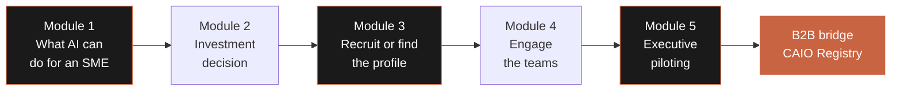

Each module is designed to produce **one executive deliverable directly usable in your executive committee or with your vendor**. By the end of the track, you leave with five concrete tools, a 30-day roadmap, and a direct entry into the CAIO Registry if you want to delegate.

| Module | Duration | Main deliverable | Expected impact |
|--------|----------|------------------|----------------|
| 01 — What AI can do for an SME, now | 1h15 | SME use-case selection grid | Identification of the best first project |
| 02 — Making the right AI investment decision | 1h15 | Simplified AI ROI calculator (Excel) | Objective budget arbitration |
| 03 — Recruiting or finding the right AI profile | 1h15 | CAIO recruitment guide for executives | Informed Permanent / Fractional / Vendor choice |
| 04 — Engaging teams in the AI transformation | 1h15 | Internal AI launch speech template | Engagement instead of resistance |
| 05 — Monitor and adjust: executive AI piloting | 1h00 | Monthly AI piloting meeting agenda | Piloting in 1 hour a month without drift |

**What you will master at the end:**

- Identify the best AI use case for your SME in under thirty minutes.
- Evaluate and select a vendor or a CAIO profile without being trapped.
- Calculate an AI ROI in under an hour, before committing a single euro.
- Engage your teams without creating resistance or panic.
- Pilot your AI projects in one hour a month with executive indicators.

---

---

# Module 01 — What AI can do for an SME, now

**Duration: 1h15 · Format: dense reading + ten concrete cases + selection grid**

## Module objectives

By the end of this module, you will be able to:

1. Cite **ten AI use cases actually deployed in French SMEs**, with sector, budget, timeline, numbered result.
2. Apply a **use-case selection grid** to your own company and identify the two or three priority projects.
3. Name the **three most costly traps** that make the majority of first AI projects fail in SMEs.
4. Leave the module with your **first AI use case identified, roughly priced, and arbitrated**.

## 1.1 — The French SME AI landscape: the real picture in 2025

Forget what you read in the business press. The reality of AI in French SMEs in 2025 is not that of tech unicorns. It is that of thousands of 30-to-150-staff companies that launched, between 2023 and 2025, one or two AI projects targeted at very specific tasks, for budgets between 15,000 and 150,000 euros, with visible results in three to nine months.

Three observations your executive committee must integrate:

**First observation.** AI in SMEs almost never replaces an entire job. It automates one task or a subset of tasks within a job. The accountant remains an accountant, but spends half the time on invoice entry. The salesperson remains a salesperson, but AI prepares the dossiers before the meeting. The HR director remains an HR director, but receives an automatic CV pre-sort. The job stays; the friction disappears.

**Second observation.** First gains almost always come from the back office, not the front. Use cases that hold up over time touch administrative, documentation, internal support, data entry, information search. AI projects "talking to the customer" (public chatbots, product recommendation) are more visible but less profitable in the first nine months. Start with the invisible.

**Third observation.** Success almost never depends on the chosen technology. It depends on the precision of the use case, the quality of available data, and the buy-in of the concerned team. SMEs that fail almost all chose a tool before clarifying the problem.

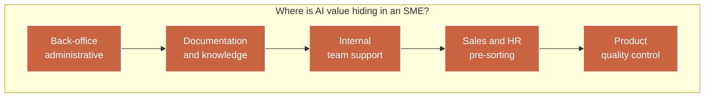

## 1.2 — Ten real use cases in French SMEs

The following cases are anonymised but representative of what was actually deployed between 2023 and 2025 in structures under 250 staff. Budgets indicated cover the project phase (design, implementation, deployment) excluding recurring annual operating cost.

### Case 1 — Automated accounting data entry (accounting firm, 45 staff, Loire-Atlantique)

| Item | Data |
|------|------|
| Sector | B2B services — Accounting expertise |
| Staff | 45 people, 5.2 M€ revenue |
| Problem | 6 accountants spent 40% of their time entering supplier invoices for small-business clients |
| Solution | AI-powered invoice reading tool (OCR+LLM) connected to Sage and Cegid |
| Project budget | 38,000 € (design + integration + training) |
| Recurring cost | 14,000 €/year (licences + monitoring) |
| Deployment time | 4 months |
| Result at 6 months | Entry time divided by 3.2. ROI reached at month 9. Staff repositioned on advisory work. |

### Case 2 — CV pre-sort and phone interviews (mid-cap construction, 180 staff, Île-de-France)

| Item | Data |
|------|------|
| Sector | Construction — secondary works |
| Staff | 180 people, 28 M€ revenue |
| Problem | 800 applications/month for 15 open positions, HR overwhelmed, 54-day recruitment lead time |
| Solution | AI assistant for CV pre-qualification + voice agent for first-round phone interview |
| Project budget | 72,000 € |
| Recurring cost | 22,000 €/year |
| Deployment time | 5 months |
| Result at 6 months | Recruitment lead time down to 28 days. HR recovers 12 hours/week. 6-month retention +9 points. |

### Case 3 — Sales assistant preparing meetings (software publisher, 60 staff, Rhône)

| Item | Data |
|------|------|
| Sector | B2B software publishing |
| Staff | 60 people, 11 M€ revenue |
| Problem | Sales reps spend 8h/week preparing meetings (customer research, history, buying signals) |
| Solution | AI assistant connected to HubSpot, LinkedIn, Pappers, news. Produces a 2-page brief before each meeting. |
| Project budget | 45,000 € |
| Recurring cost | 18,000 €/year |
| Deployment time | 3 months |
| Result at 6 months | Preparation time divided by 4. Meeting-to-proposal conversion +11 points. |

### Case 4 — Tier-1 customer support (e-commerce, 32 staff, Gironde)

| Item | Data |
|------|------|
| Sector | E-commerce home products |
| Staff | 32 people, 7 M€ revenue |
| Problem | 2,200 support tickets/month, 60% repetitive (order tracking, return, refund) |
| Solution | AI agent connected to Shopify + carrier + CRM, answers simple questions autonomously |
| Project budget | 28,000 € |
| Recurring cost | 9,600 €/year |
| Deployment time | 2.5 months |
| Result at 6 months | 58% of tickets resolved without a human. Support team reduced from 5 to 3 through natural attrition. CSAT stable. |

### Case 5 — Queryable internal document base (law firm, 24 partners + 35 staff, Paris)

| Item | Data |
|------|------|
| Sector | Legal services |
| Staff | 59 people, 14 M€ revenue |
| Problem | 15 years of unexploitable internal archives, each search takes 1 to 3 hours |
| Solution | AI search engine on internal documents + jurisprudence base, with sourced citations |
| Project budget | 95,000 € (high data sensitivity) |
| Recurring cost | 24,000 €/year |
| Deployment time | 6 months |
| Result at 6 months | Search time divided by 5. Junior staff produce briefs in 2h instead of 8h. |

### Case 6 — Visual quality control on production line (mechanical industry, 110 staff, Isère)

| Item | Data |
|------|------|
| Sector | Industry, mechanical subcontracting |
| Staff | 110 people, 19 M€ revenue |
| Problem | Slow manual quality control, 1.8% undetected defects reported by customers |
| Solution | Camera + visual AI at end-of-line, automatic detection of surface defects |
| Project budget | 120,000 € (hardware included) |
| Recurring cost | 11,000 €/year |
| Deployment time | 7 months |
| Result at 6 months | Customer-facing defects down from 1.8% to 0.4%. Customer penalties divided by 3. |

### Case 7 — Personalised commercial offers generation (event agency, 28 staff, Hauts-de-Seine)

| Item | Data |
|------|------|
| Sector | B2B events |
| Staff | 28 people, 4.6 M€ revenue |
| Problem | Each quote takes 4 to 6 hours (venue, vendor, scenario research) |
| Solution | AI offer generator producing a personalised first draft from the client brief |
| Project budget | 32,000 € |
| Recurring cost | 8,400 €/year |
| Deployment time | 3 months |
| Result at 6 months | Quoting time divided by 2.5. +34% quotes sent at constant headcount. |

### Case 8 — Automated candidate CV analysis (agricultural cooperative, 95 staff, Brittany)

| Item | Data |
|------|------|
| Sector | Agri-food cooperative |
| Staff | 95 people, 22 M€ revenue |
| Problem | Heavy seasonal recruitment, HR + 2 assistants overwhelmed |
| Solution | AI scoring tool for CV pre-ranking against position criteria |
| Project budget | 22,000 € |
| Recurring cost | 7,200 €/year |
| Deployment time | 2 months |
| Result at 6 months | Time per CV divided by 6. HR validates final. No bias found in internal data-protection audit. |

### Case 9 — Medical assistant for reports (radiology practice, 22 staff, Occitanie)

| Item | Data |
|------|------|
| Sector | Healthcare — medical imaging |
| Staff | 22 people, 6.8 M€ revenue |
| Problem | Radiologists dictate reports, secretaries transcribe, 30 min per report |
| Solution | Imaging-specialised AI dictation, automatic transcription + formatting + medical vocabulary |
| Project budget | 48,000 € |
| Recurring cost | 15,600 €/year |
| Deployment time | 4 months |
| Result at 6 months | Transcription 92% automated. Secretaries repositioned to patient relations. |

### Case 10 — AI stock forecasting (specialty distributor, 140 staff, Nouvelle-Aquitaine)

| Item | Data |
|------|------|
| Sector | Specialty distribution |
| Staff | 140 people, 34 M€ revenue |
| Problem | 12% stock-out on top references, 4% obsolete overstock |
| Solution | AI forecasting engine cross-referencing history, weather, calendar, competitive signals |
| Project budget | 110,000 € |
| Recurring cost | 26,000 €/year |
| Deployment time | 8 months |
| Result at 6 months | Stock-outs from 12% to 4.5%. Overstock reduced by 40%. Cash gain 340k€. |

## 1.3 — Synthesis of the ten cases: the constants

| Dimension | Minimum | Median | Maximum |
|-----------|---------|--------|---------|
| Company staff | 22 | 60 | 180 |
| Annual revenue (M€) | 4.6 | 13 | 34 |
| Project budget (€) | 22,000 | 46,500 | 120,000 |
| Recurring annual cost (€) | 7,200 | 14,800 | 26,000 |
| Deployment time (months) | 2 | 4 | 8 |
| ROI reached (months) | 6 | 9 | 14 |

**Executive reading.** The typical first AI project of a French SME in 2025 costs between 25k€ and 75k€ in project mode, plus about 15k€/year in operations, deploys in 3 to 5 months, and reaches return on investment around month 9. These figures are your benchmark. Any vendor announcing 350k€ for a first project "to do things properly" is selling you a consulting firm, not a use case. Any vendor promising 12k€ and 3 weeks is selling you a disposable MVP.

## 1.4 — The three traps that cost SME executives the most

### Trap one — Choosing the tech before the problem

The trap: an IT head, a vendor or an internal enthusiast arrives with an impressive demo of ChatGPT, Claude, Mistral, or an AI no-code platform. The executive committee gets excited. Budget voted. Six months later, the tool is deployed but nobody uses it, because it does not address a real point of friction.

**Warning signal:** the phrase "we could use AI for…" launched in executive committee before a precise, numbered business problem, validated by field teams, has been documented.

**Countermeasure:** refuse any tech discussion until the problem has been written on one page, with three numbered indicators (time spent, cost, volume) and one business person accountable.

### Trap two — Underestimating required data

The trap: you sign an AI project with a convincing vendor, and three months later discover that the data on which the AI was to rely either does not exist, is too dirty, or is locked in an ERP to which nobody has access rights.

**Warning signal:** no data audit phase is planned at project kick-off, or it is allotted half a day.

**Countermeasure:** impose a data audit phase of two to four weeks, with a written deliverable honestly stating "this data exists, this other is missing, here is plan B".

### Trap three — Not engaging field teams

The trap: the AI project is decided in executive committee, championed by an enthusiastic sponsor, developed with a vendor, then presented to teams in "tadaa, here is your new tool" mode. Adoption rate: 18% at six months. Project considered a failure even if the tool works technically.

**Warning signal:** no field staff is involved before user acceptance testing.

**Countermeasure:** include at least two field users in the steering committee from day one, co-define the specifications, plan change management in budget and calendar.

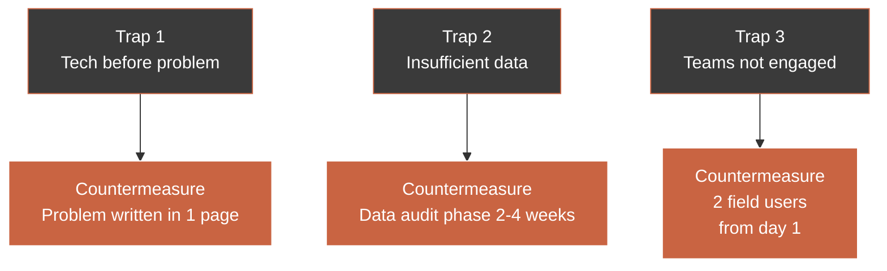

## 1.5 — Use-case selection grid: the twenty-minute exercise

The objective is to leave this module with **your first AI use case identified and arbitrated**. The following grid can be used alone or in executive committee.

### Step 1 — Open inventory (5 minutes)

List, without filtering, all repetitive or time-consuming tasks you observe in your company, classified by major function.

| Function | Potential repetitive task | Person burdened | Frequency |
|----------|---------------------------|-----------------|-----------|
| Finance / accounting | | | |
| HR / recruitment | | | |
| Sales | | | |
| Marketing / communication | | | |
| Customer support | | | |
| Production / operations | | | |
| Management / reporting | | | |

### Step 2 — Criterion scoring (10 minutes)

For each listed task, rate on a 1 to 5 scale the following four criteria.

| Criterion | Associated question | Weighting |
|-----------|---------------------|-----------|
| Volume | Does this task repeat a lot? | 25% |
| Time cost | How many total hours per month? | 25% |
| Available data | Does the required data already exist cleanly? | 25% |
| Team buy-in | Would the concerned team welcome it? | 25% |

**Total score = weighted average.** Any task with a score below 3.5 drops off the radar. Between 3.5 and 4, rework it. From 4 upwards, it is a serious candidate for your first project.

### Step 3 — Feasibility filter (5 minutes)

Apply these three questions to each serious candidate.

| Question | Acceptable answer |
|----------|-------------------|
| Does the scope fit in less than three months of project? | Yes |
| Can you name an internal sponsor who will carry the project? | Yes, with first name |
| Do you accept budgeting between 25k€ and 75k€ for this first case? | Yes or numbered justification |

If all three answers are yes, you have your first AI project.

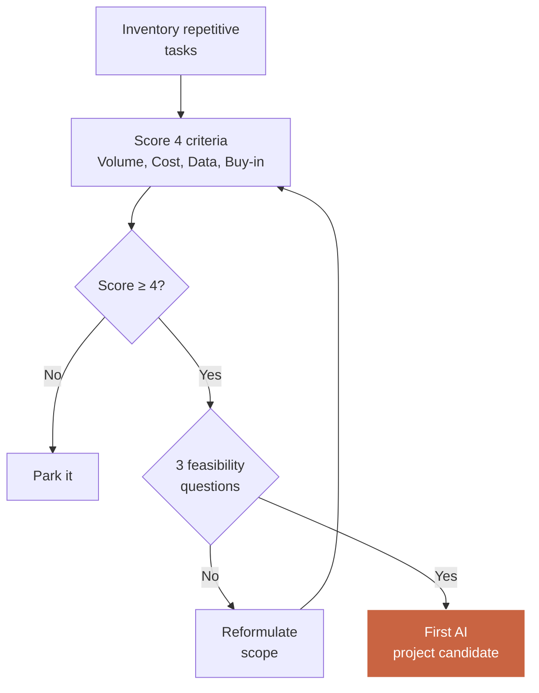

## 1.6 — Module synthesis

| Key point | What to remember |
|-----------|------------------|
| SME target | AI automates tasks, not jobs |
| Where to look | Back-office, documentation, pre-sorting, internal support |
| Typical budget | 25k€ to 75k€ for a first project, 15k€/year recurring |
| Typical timeline | 3 to 5 months to deployment, 9 months to ROI |
| Traps | Tech before problem, phantom data, disengaged team |
| Method | Inventory, scoring, feasibility filter |

### Module 01 deliverable

**SME use-case selection grid**: a table to print or duplicate in an Excel file, allowing the executive to score in thirty minutes the 5 to 10 candidate tasks in their own company, extract the 2-3 priority ones, and arrive at the executive committee with a first numbered and sponsored use case.

---

---

# Module 02 — Making the right AI investment decision

**Duration: 1h15 · Format: budget decoding + ROI calculator + key questions to ask**

## Module objectives

By the end of this module, you will be able to:

1. Read an **AI commercial proposal** and spot in 10 minutes the zones that deserve debate.
2. Use **budget ranges per project type** to sanity-check any received quote.
3. Ask **precise questions** that disarm an overly vague or overly ambitious vendor.
4. Calculate a **rough AI ROI** in under an hour with your team, before any signature.

## 2.1 — The four major families of AI projects in SMEs and their budget ranges

An AI project in an SME almost always fits into one of these four families. Each family has its own budget logic. Knowing these ranges means entering a negotiation with a benchmark.

| Family | Examples | Project budget | Annual recurring | Timeline |
|--------|----------|----------------|------------------|----------|
| A — AI assistant on existing documents | Document base search, legal assistant, internal support | 20k€ – 60k€ | 6k€ – 15k€ | 2-4 months |
| B — Administrative task automation | Invoice entry, CV pre-sort, quote generation | 25k€ – 80k€ | 8k€ – 20k€ | 3-5 months |
| C — Customer or partner-facing AI agent | Support chatbot, voice agent, recommendation | 40k€ – 150k€ | 15k€ – 40k€ | 4-8 months |
| D — Decisioning and forecasting | Stock forecasting, commercial scoring, predictive maintenance | 70k€ – 250k€ | 20k€ – 60k€ | 6-12 months |

**Sanity-check rule.** If a vendor proposes a family-A project for 180k€, they are selling you a disguised family-D project. If a vendor proposes a family-D project for 30k€, they are selling you a demo MVP that will never reach production.

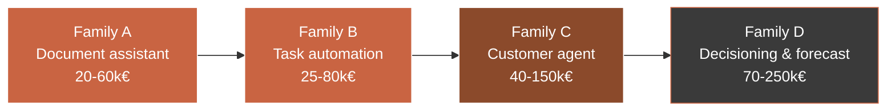

## 2.2 — Breakdown of an SME AI budget: where the money really goes

A 50k€ AI project budget does not break down the way you might imagine. The typical allocation is as follows.

| Item | % of budget | What it covers |
|------|-------------|----------------|
| Scoping and data audit | 10-15% | Business interviews, data quality audit, target architecture |
| Integration with existing systems | 25-30% | Sage, Cegid, HubSpot, Salesforce, SharePoint connections |
| Model development or tool configuration | 20-25% | Prompt engineering, fine-tuning, no-code setup |
| User interface | 10-15% | Screen the end-user sees |
| Testing and adjustments | 10-15% | Real-user tests, fixes |
| Training and change management | 5-10% | Team sessions, support, documentation |
| API/licence costs during project | 2-5% | OpenAI, Anthropic, Mistral, no-code platform |

**Executive reading.** If a quote does not detail these items or if "model development" represents 70% of the budget, that is a quote to rework. Integration and change management are systematically underestimated by purely technical vendors.

## 2.3 — The eighteen questions to ask any AI vendor before signing

Here is the checklist to read in the scoping meeting. The answers determine whether you sign or not. Prefer a vendor who honestly hesitates over one who answers everything with confidence.

### Questions on the problem

| # | Question | What the answer reveals |
|---|----------|------------------------|
| 1 | Can you reformulate my problem in one sentence, without using the word AI? | Ability to exit jargon |
| 2 | What is the worst-case scenario if this project does not happen? | Level of honesty about real value |
| 3 | Have you already solved exactly this problem at a comparable client? | Experience vs enthusiasm |

### Questions on data

| # | Question | What the answer reveals |
|---|----------|------------------------|
| 4 | What specific data is needed for your solution to work? | Technical rigour |
| 5 | If this data doesn't exist or is dirty, what is plan B? | Vendor maturity |
| 6 | How will you audit the quality of our data before starting? | Methodological seriousness |

### Questions on scope and budget

| # | Question | What the answer reveals |
|---|----------|------------------------|
| 7 | What is NOT included in your proposal? | Scope honesty |
| 8 | If we go outside scope, what is your day rate or fixed fee? | Pricing transparency |
| 9 | How much does this project cost in annual operation once deployed? | Long-term vision |
| 10 | Over how many years do you amortise the project in your ROI calculation? | Seriousness of the argument |

### Questions on team and governance

| # | Question | What the answer reveals |
|---|----------|------------------------|
| 11 | Who from my team must be mobilised, how many hours per week, for how long? | Operational realism |
| 12 | What is the precise role of my IT head in this project? | Internal/external articulation |
| 13 | How do you handle change management with end users? | Human consideration |

### Questions on risks and exit

| # | Question | What the answer reveals |
|---|----------|------------------------|
| 14 | What are the three main risks you identify? | Professional lucidity |
| 15 | If I decide to stop the project mid-way, what do I have left? | Executive protection |
| 16 | Do my data leave European territory? Where are they hosted? | GDPR compliance |
| 17 | What happens if OpenAI or Anthropic changes their pricing by 50%? | Vendor dependency |
| 18 | How will you prove to my executive committee in 9 months that the project worked? | Results orientation |

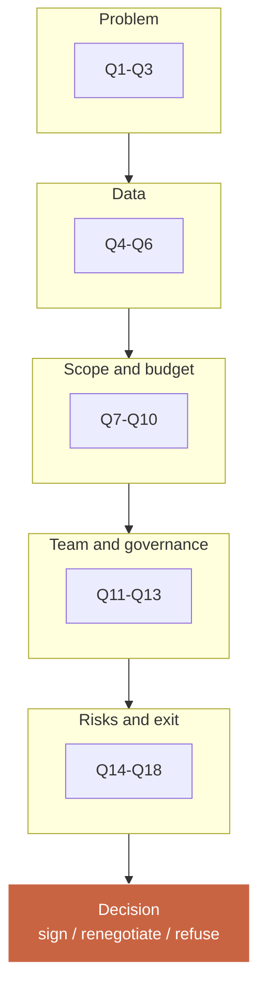

## 2.4 — Calculate an AI ROI in 30 minutes with your team

The goal is not to produce a 40-page consulting firm business case. The goal is to arrive at the executive committee with an honest, rough but defendable estimate that fits on one page.

### The simple formula

```
Annual net gain = Annual gross gain - Annual recurring cost
Cumulative ROI at N years = (Net gain × N) - Initial project budget
Payback = Project budget / Annual net gain
```

### The typical spreadsheet

Here is the mock-up of the Excel file to reproduce. Bold cells must be filled.

| Item | Formula | Value |
|------|---------|-------|
| Weekly hours saved per impacted staff | **to estimate** | 6 h |
| Number of impacted staff | **to estimate** | 4 |
| Weeks worked per year | **constant** | 45 |
| Loaded average hourly cost | **to estimate** | 38 € |
| Annual gross gain in hours | row 1 × row 2 × row 3 | 1,080 h |
| Annual gross gain in euros | gross gain × hourly cost | 41,040 € |
| Annual recurring project cost | **vendor quote** | 15,000 € |
| Annual net gain | gross gain − recurring cost | 26,040 € |
| Initial project budget | **vendor quote** | 55,000 € |
| Payback in months | budget × 12 / net gain | 25 months |
| 3-year ROI | (net gain × 3) − budget | 23,120 € |

### The three scenarios to always compute

Never present a single figure. Systematically present three scenarios to inform the decision.

| Scenario | Assumption | Case of table above |
|----------|-----------|---------------------|
| Pessimistic | Real gains at 50% of estimate | 3-year ROI: −15,940 € |
| Central | Real gains at 100% | 3-year ROI: 23,120 € |
| Optimistic | Real gains at 130% | 3-year ROI: 46,432 € |

**Golden rule.** If the pessimistic scenario is negative at 3 years, the project is not ripe. Reformulate the scope or renegotiate the budget. A healthy SME AI project must stand up even in its pessimistic 3-year scenario.

### Beyond financial ROI: qualitative benefits not to ignore

Some benefits are hard to quantify but can weigh in the decision. List them explicitly in the executive-committee note.

| Qualitative benefit | Indirect impact |
|---------------------|----------------|
| Reducing drudgery of repetitive tasks | Retention, employer brand |
| Ability to attract modernity-seeking talent | HR appeal |
| Market signal of a modernising firm | Client positioning, valuation |
| Collective AI learning (internal human capital) | Base for future projects |
| Better process traceability (positive side-effect) | Compliance, audit |

## 2.5 — French public grants and subsidies for SME AI projects

Many executives ignore this: a significant share of the project budget can be covered by public instruments.

| Instrument | Target | Typical coverage | Contact |
|-----------|--------|------------------|---------|
| BPI France — Diag IA | SMEs under 250 staff | 50% up to 20k€ HT of consulting | bpifrance.fr |
| Research Tax Credit (CIR) | R&D-intensive firms | 30% of eligible R&D expenses | Accountant |
| Innovation Tax Credit (CII) | SMEs | 20% of innovation expenses | Accountant |
| FranceNum | Very small and small SMEs | Digital vouchers, coaching | francenum.gouv.fr |
| Regions — AI / digital transformation vouchers | Variable | 30 to 70% depending on scheme | Regional Council |
| Competitiveness clusters | Collaborative projects | Co-funding, networking | Relevant sector cluster |
| European funds (ERDF) | Structural projects | Co-funding up to 50% | Regional prefecture |

**Practical rule.** Before any vendor signature, consult your accountant on CIR/CII eligibility, and your BPI account manager if you have one. The financial delta can reach 20 to 40% of the budget.

## 2.6 — The final arbitration: sign, renegotiate, refuse

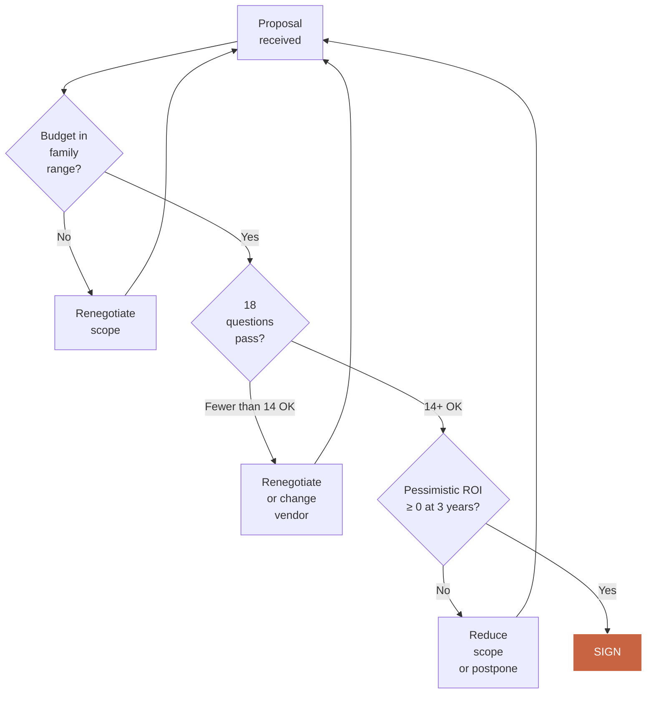

## 2.7 — Module synthesis

| Key point | What to remember |
|-----------|------------------|
| Ranges | 4 families A, B, C, D — from 20k€ to 250k€ |
| Allocation | Integration and change management are underestimated by vendors |
| 18 questions | Ask them in scoping — honest hesitations are better than certainties |
| ROI | Simple formula, 3 scenarios, 1 page |
| Grants | BPI, CIR, CII, FranceNum, regions — can cover 20-40% |
| Decision | Budget OK + 14 questions OK + pessimistic ROI ≥ 0 = sign |

### Module 02 deliverable

**Simplified AI ROI calculator (Excel)**: a single-sheet Excel file with pre-formatted cells, automatic three-scenario generation (pessimistic, central, optimistic), payback graph summary, and a vendor-question page to tick before signing.

---

---

# Module 03 — Recruiting or finding the right AI profile

**Duration: 1h15 · Format: Permanent / Fractional / Vendor comparison + non-technical interview guide**

## Module objectives

By the end of this module, you will be able to:

1. Arbitrate between **recruiting a permanent CAIO, taking a fractional CAIO or going through a firm/vendor**.
2. Write a **CAIO job description for an SME** without calling a specialised HR firm.
3. Evaluate a CAIO profile in interview **even without being technical**, using a behavioural-questions grid.
4. Use the **CAIO Registry** to access a pre-qualified pool of profiles quickly.

## 3.1 — The decision triangle: Permanent, Fractional, Vendor

The three options address three different company sizes and phases. There is no universal right answer. There is your right answer, depending on six criteria.

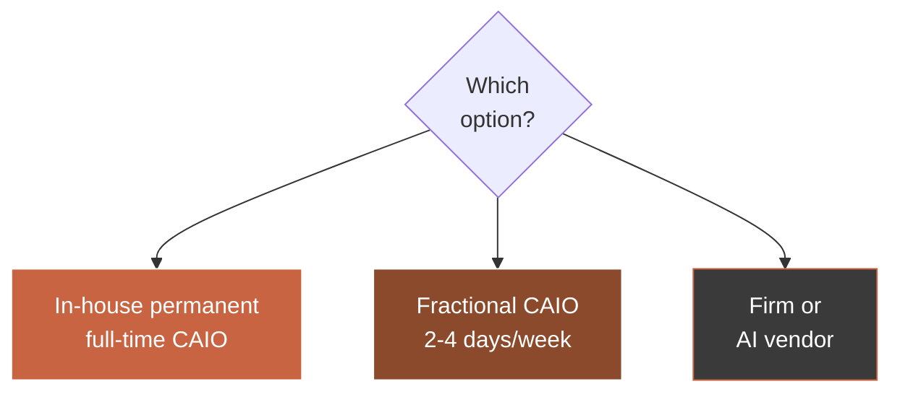

### Full comparison table

| Criterion | Permanent in-house | Fractional CAIO | Vendor / firm |
|-----------|---------------------|-----------------|---------------|
| Recommended for | AI-mature SMEs and mid-caps | SMEs in launch phase | Bounded, one-off use case |
| Minimum company size | 100+ | 30 to 200 | Any size |
| Typical annual cost | 90k€ to 180k€ (package) | 60k€ to 120k€ (2-3 d/wk) | Project 25k€ to 150k€ + maintenance |
| Commitment horizon | 2-5 years | 6-24 renewable months | Bounded project |
| Recruitment lead time | 3-6 months | 3-6 weeks | 2-6 weeks |
| Turnover risk | Medium-high for this profile | Low (independent, chosen) | Nil for contract duration |
| Cultural adaptation | Strong after 6 months | Medium (outside/inside) | Weak |
| Internal skills transfer | High over time | High if well framed | Weak unless contractually imposed |
| Exit flexibility | Weak (redundancy) | Strong (short notice) | Strong (end of contract) |
| Suited for first AI project | No, too early | Yes, ideal | Yes, possible |
| Suited for multiple AI projects | Yes | Yes with ramp-up | No, cumulatively costly |
| Suited for long-term AI governance | Yes | Yes if bridging to permanent | No |

### The six questions that decide

Ask yourself these six questions in order. The sum of answers clearly points to one of the three options.

| # | Question | Answer → Option |
|---|----------|-----------------|
| 1 | Is this your first AI project or have you already deployed some? | First → Fractional or Vendor |
| 2 | How many AI projects do you want to launch in 18 months? | Just 1 → Vendor; 2+ → Fractional or Permanent |
| 3 | What is your annual AI budget capacity (excluding projects)? | <60k€ → Vendor; 60-120k€ → Fractional; >120k€ → Permanent |
| 4 | Do you have an in-house IT head able to handle operations? | No → favour Fractional or Vendor with coaching |
| 5 | What is your tolerance for hiring risk? | Low → Fractional |
| 6 | Do you want to structure permanent AI governance (>2 years)? | Yes → Permanent eventually |

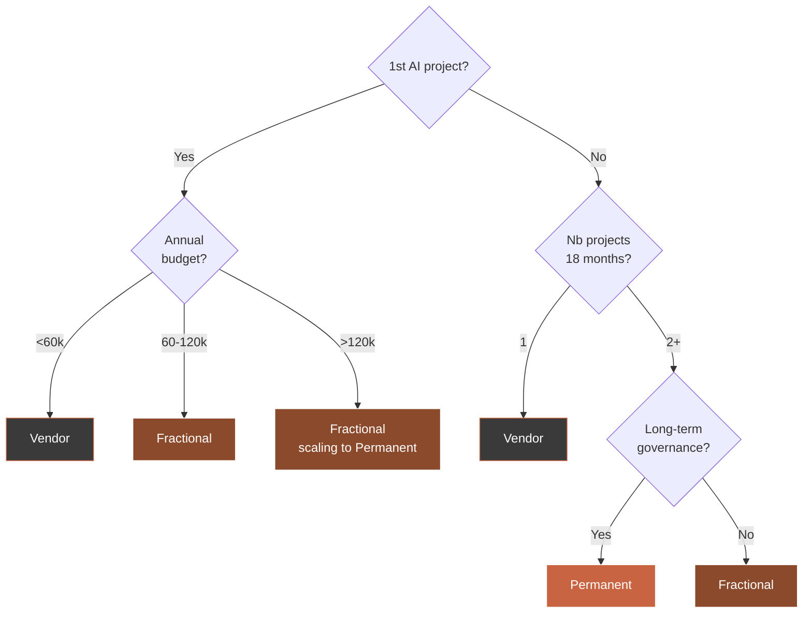

## 3.2 — SME CAIO job description: the template that works

CAIO job descriptions found on LinkedIn are almost all unsuited to an SME. They are either written for large groups (governance, compliance, international ethics) or hollow ("AI transformation"). Here is the short, directly usable template.

### SME CAIO job description template

```
Title: Chief AI Officer (CAIO) — full-time or 3 days/week
Reports to: General Management
Location: [city] / hybrid 2 days remote

Mission
In direct link with General Management, you pilot the company's AI
strategy: identifying priority use cases, selecting vendors, supervising
projects, leading change management, governing data and reporting to the
executive committee.

Main responsibilities
1. Translate business stakes into a quarterly AI roadmap.
2. Select and pilot 2 to 4 AI projects per year, from idea to deployment.
3. Build an AI culture within teams (workshops, training, AI champions).
4. Ensure GDPR compliance and data security.
5. Report monthly to the executive committee on defined KPIs.

Profile sought
- 7+ years of mixed tech + business experience.
- At least 2 AI projects deployed in production, including 1 in an SME.
- Ability to dialogue with IT head, CFO, HR director, business heads.
- Pedagogy, field listening, results orientation.
- Mastery of technical notions (LLM, agents, integration) without being a developer.

Package
According to profile, [X] to [Y] k€ gross annual + bonus on AI KPIs.
Part-time possible (3 d/week) for experienced profiles.

What we offer
- Clear mandate from GM, committed executive committee.
- 2025 AI budget: [X] k€.
- Use case already identified for quick start.
```

### Bad-profile signals

Even without being technical, you can detect the following red flags.

| Red flag | What it reveals |
|----------|----------------|
| Talks about "AI" as a mystical entity | Lack of mastery |
| Cannot cite an AI project in production they delivered | Theoretician |
| Never worked in an SME (only large group or start-up) | Cultural mismatch |
| Uses too many anglicisms and jargon | Posture instead of substance |
| Asks no question about your business | Self-centred |
| Rate or salary outside market range | Market disconnect |
| No public portfolio, no verifiable reference | Risk of fabrication |

## 3.3 — The CAIO interview grid for non-technical executives

Here are eighteen questions, organised in four blocks, allowing you to evaluate a CAIO profile without needing to understand the technology.

### Block 1 — Business understanding (5 questions)

| Question | Typical good answer |
|----------|---------------------|
| What would you do in your first 30 days with us? | Listen, audit, launch nothing before 3-4 weeks |
| In your view, what is the biggest risk for an SME launching an AI project? | Tech before problem / ignoring change management |
| How do you measure the success of an AI project? | Business KPIs (€, hours, rates) — not technical KPIs |
| Have you ever stopped an AI project midway? Tell me. | Yes, with clear reasoning — a good CAIO knows how to stop |
| How do you talk about AI to a 55-year-old colleague who is afraid? | Listening, reformulation, concrete demo, no jargon |

### Block 2 — Technical understanding (executive-level) (5 questions)

| Question | Typical good answer |
|----------|---------------------|
| In one sentence, what does an LLM like ChatGPT do? | Predicts the next word from context |
| Why does an AI sometimes "hallucinate"? | Because it generates without fact-checking by default |
| Must one always use OpenAI or are there alternatives? | Anthropic, Mistral (FR), Llama, etc. exist. Choice depends on use case. |
| What does GDPR mean in an AI project? | Minimisation, consent, EU hosting, right to erasure |
| Is no-code AI enough for an SME? | For 60% of use cases yes, the rest needs custom work |

### Block 3 — Governance and relational (4 questions)

| Question | Typical good answer |
|----------|---------------------|
| How do you collaborate with an IT head who is skeptical about AI? | Alliance, co-building, respect for IT role |
| What AI governance bodies do you recommend for an SME of our size? | Light monthly AI committee, 1 sponsor per project, no heavy governance |
| What do you do if the executive committee refuses your recommendation? | Document, stay professional, come back with data |
| How do you manage unrealistic expectations from general management? | Framing from day 1, concrete examples, precise numbers |

### Block 4 — Pragmatism and field (4 questions)

| Question | Typical good answer |
|----------|---------------------|
| Tell me about an AI project that failed on your watch. | Honesty, identified cause, lesson learned |
| How many days per week do you think are enough for our size? | 2-3 days — a CAIO claiming 5 days/week on an SME must justify it |
| What do you think of AI training for our teams? | Central topic, not accessory, budget allocated |
| Do you have references from SME executives I can call? | Yes, with direct contact |

## 3.4 — The CAIO Registry: accessing a pre-qualified pool

The CAIO Registry (agentik-os.com/registry) is a base of certified CAIO profiles, available on mission or for hire, indexed by sector expertise, geographic zone, and use cases already deployed.

### How to use it effectively

| Step | Action | Gain |
|------|--------|------|
| 1 | Fill the brief for your need (sector, size, use case, Permanent/Fractional format) | 15 min |
| 2 | Receive within 72h a shortlist of 3 to 5 profiles | 2-3 month saving vs classic sourcing |
| 3 | Run 3 short interviews (1h) with your Module 3.3 grid | Gain in rigour |
| 4 | Ask for client references (2 calls of 20 min minimum) | Decision safety |
| 5 | Negotiate Fractional contract or Permanent offer | Legal time saving (templates included) |

### What the Registry guarantees (and does not)

| Guaranteed | Not guaranteed |
|------------|---------------|
| Profiles with at least one AI project in production | Your project's future success |
| Client references verified by call | Human chemistry with your executive committee |
| Validated expertise on declared use cases | Immediate availability (may vary) |
| Fractional master contract available | Floor price (negotiated directly) |

## 3.5 — Most frequent SME CAIO recruitment mistakes

| Mistake | Typical consequence |
|---------|--------------------|
| Recruiting a "100% tech" profile who does not speak business | Executive committee rejects after 4 months |
| Recruiting too senior (ex-AI Director of a large group) in an SME | Posture mismatch, mutual resignation |
| Giving a vague mandate ("move AI forward") | No measurable deliverable, political failure |
| Placing the CAIO under the IT head | Role confusion, tensions |
| Not giving a budget | Purely consultative role, demotivation |
| Not defining KPIs | Impossible to arbitrate after a year |

## 3.6 — Module synthesis

| Key point | What to remember |
|-----------|------------------|
| Decision triangle | Permanent / Fractional / Vendor — 6 questions decide |
| Company size | <100 → favour Fractional or Vendor |
| Job description | Short template, clear mandate, explicit budget |
| Interview | 18 questions in 4 blocks, no tech needed |
| CAIO Registry | 72h for a pre-qualified shortlist |
| Mistakes | Vague mandate, too-senior profile, no budget, no KPIs |

### Module 03 deliverable

**CAIO recruitment guide for executives**: a 12-page PDF containing the SME template job description, the full interview grid (18 questions + typical good answers), the Permanent/Fractional/Vendor comparison table, and CAIO Registry access.

---

---

# Module 04 — Engaging teams in the AI transformation

**Duration: 1h15 · Format: resistance profiles + launch speech + AI champions**

## Module objectives

By the end of this module, you will be able to:

1. Identify **the four resistance profiles** typical of AI in a French SME.
2. Deliver **a launch speech** that reassures without lying and engages without forcing.
3. Spot and activate **internal AI champions** without a dedicated training budget.
4. Manage **foreseeable conflict situations** in the first six months.

## 4.1 — Why humans are the real topic, not technology

Out of one hundred failing AI projects in SMEs, ninety-two fail for human reasons, not technical. Specialised consultancy statistics converge: the main cause of failure is almost never AI itself. It is silent rejection, passive resistance, demotivation, fear for one's job, feeling dismissed, or simply the feeling of not having been heard.

As an executive, you have three human levers to activate from day one: **clarity of discourse**, **acknowledgement of concerns**, **involvement in choices**.

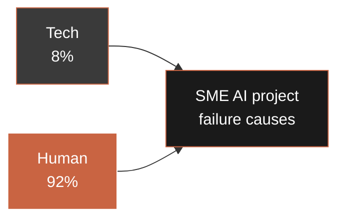

## 4.2 — The four AI resistance profiles in a company

Each profile calls for a specific response. Generalities do not work.

### Profile 1 — The fearful "I will lose my job"

**Description.** Long-established employee, often 45+, expert on a task AI could automate. Legitimate fear of replacement. Expresses doubts quietly, not in meetings.

**Typical presence in an SME.** 30-40% of impacted staff.

**What to say.** "Our commitment is clear: we do not use AI to replace roles, but to free you time on the most repetitive tasks. You keep doing your job. AI prepares, you decide."

**What absolutely not to say.** "Don't worry, AI will never take your place." That is a promise you cannot certainly hold and which damages your credibility if things move in 3 years.

**What to do.** Include them in the user committee. Give them an official role. Reserve training for them before launch.

### Profile 2 — The technophobe "it will never work"

**Description.** Has seen three waves of digital transformation in 15 years, two of which failed. Cynical by experience. Not narrow-minded — lucid.

**Typical presence.** 15-25%.

**What to say.** "You're right to be cautious. Many projects fail. That's why we start small, we measure, we decide next."

**What to do.** Involve them in the steering committee. Their lucid skepticism is pure gold. They will spot drifts before anyone else.

### Profile 3 — The naive enthusiast "AI will fix everything"

**Description.** Often young, has seen ChatGPT demos, thinks AI solves everything in five minutes. Danger: creates unrealistic expectations, discredits the project if those expectations are not met.

**Typical presence.** 10-20%.

**What to say.** "AI is a powerful tool, but one that demands precision and framing. We'll progress methodically."

**What to do.** Frame them. Give them an AI champion role with measurable success indicators, to turn their energy into results.

### Profile 4 — The indifferent "as long as it doesn't change my day"

**Description.** Neither for nor against. Will do whatever is asked. Silent majority.

**Typical presence.** 30-45%.

**What to say.** "Here is what will concretely change for you, and here is the calendar."

**What to do.** Clear, regular, factual communication. No emotional over-investment. The indifferent shifts to adopter as soon as the tool works, or to passive resister if deployment stumbles.

### Profile-and-response matrix

| Profile | Frequency | Main lever | Mistake to avoid |
|---------|-----------|-----------|------------------|
| Fearful | 30-40% | Non-replacement commitment + committee inclusion | Empty promise |
| Technophobe | 15-25% | Recognition of lucidity + steering committee | Minimise their experience |
| Naive enthusiast | 10-20% | Framing + champion role with KPIs | Laissez-faire |
| Indifferent | 30-45% | Regular factual communication | Emotional over-investment |

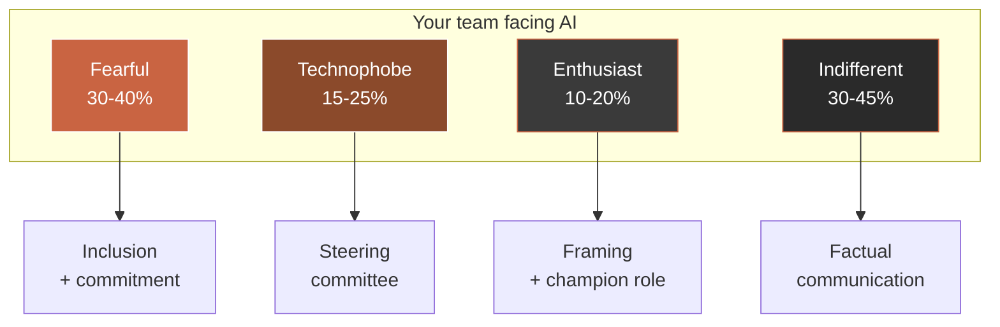

## 4.3 — The internal AI launch speech

Here is the ready speech to adapt to your context, 12 to 15 minutes long, to deliver in a plenary meeting or enlarged executive committee.

### Speech template (to personalise)

```
[Opening — 2 minutes]
Good morning everyone. I wanted to talk to you today about a topic that
concerns all of us: artificial intelligence in our company.

[Honest acknowledgement — 3 minutes]
First, I want to acknowledge something. AI is a subject that worries.
That is normal. Every week there are articles announcing job cuts, jobs
disappearing. I am not going to pretend these questions do not exist.

I want to be clear with you: our company is not on an AI-driven
headcount-reduction path. Our project is to free time on the most
repetitive tasks so that you can focus on what really makes the value
of your job.

[Our framework — 3 minutes]
Concretely, we are launching a limited first AI project, on
[briefly describe the first use case]. Why this one? Because it is
[justify: volume, friction, field demand].

This project will last about [X] months. It costs [Y] euros, which is
not trivial, and that is why we will pilot it closely.

[Your role — 3 minutes]
What matters to me is how we will do this together.

First thing: we will set up a user committee, with representatives of
the impacted teams. If you are interested, flag it.

Second thing: we will name two or three "AI champions": colleagues who
will become reference people. Not necessarily the most technical.
Rather the most pedagogical.

Third thing: we will have a monthly progress point, open, transparent.
Good signals, bad signals, decisions made. Nothing will be hidden.

[My commitments — 2 minutes]
I make three commitments in front of you today.

One: we will not use AI to eliminate positions. If a person sees their
task reduced, we will offer them an upskilling path or an evolution.

Two: decisions concerning you will remain made by humans. AI can
prepare, suggest, classify. It does not decide.

Three: if mid-way we see that this project does not serve our teams,
we will stop it. This is not a headlong rush.

[Conclusion — 1 minute]
AI is not a revolution we undergo. It is a tool we appropriate,
together, at our pace. I count on your critical eye, your questions,
your feedback. Thank you.
```

### The seven phrases never to utter

| Phrase to ban | Why |
|--------------|-----|
| "AI will change everything." | Anxiety + empty generality |
| "We are behind, we must accelerate." | Panic transmitted to teams |
| "There will be no impact on jobs." | A commitment that cannot be guaranteed at 5 years |
| "Don't worry." | Paternalistic, invalidates concern |
| "It's the future, we have no choice." | Abdication of responsibility |
| "The resistant ones will be left behind." | Threat → hardening |
| "We'll see." | Lack of framework → panic |

## 4.4 — Creating AI champions without a dedicated training budget

AI champions are voluntary colleagues, identified as internal relays, becoming the first experienced AI users in their team. They are not technical experts. They are natural pedagogues.

### Ideal AI champion profile

| Criterion | Why |
|-----------|-----|
| Natural curiosity | They will learn fast |
| Credibility in their team | Colleagues will listen |
| Pedagogy | They can explain without condescension |
| Mental availability | Not overloaded |
| Not necessarily young | Age predicts neither appetite nor pedagogy |

### 30-day activation plan without a dedicated budget

| Week | Action | Time required |
|------|--------|--------------|
| 1 | Identify 3-5 candidates, invite them for a 20-minute coffee | 2 h executive |
| 2 | Have them test the AI tool internally on real cases | 3 h per champion |
| 3 | Run a sharing workshop between champions (feedback, questions, tips) | 2 h collective |
| 4 | Give them an official and visible role (internal newsletter mention, LinkedIn status if wanted) | 1 h executive |

### Recognition at no cost

The classic mistake: thinking AI champions absolutely must be financially incentivised. False. The three non-financial recognitions below work better.

| Recognition | Perceived impact |
|-------------|-----------------|
| Public mention by general management in plenary | Very strong |
| Formal responsibility ("AI reference for team X") | Strong |
| Privileged access to general management on these topics | Strong |
| Participation in the steering committee | Strong |
| Mention in external communication if agreed | Strong (motivation, CV) |

## 4.5 — The six foreseeable conflict situations and how to handle them

| Situation | Signal | Executive response |
|-----------|--------|-------------------|
| A manager silently blocks adoption in their team | Adoption <20% after 3 months | One-to-one, listen, reframe expectations |
| An expert employee threatens to resign | Informal conversation surfaced | GM/HR one-to-one, reassure, redefine role |
| A union or employee representatives ask for detailed information | Written request | Full transparency, prepare complete dossier |
| An external client worries about AI usage on their data | Email or call | Provide GDPR clause, hosting, traceability |
| Internal technical team feels dispossessed by the vendor | Tensions in committee | Official co-responsibility, internal training |
| An AI champion burns out and turns negative | Engagement drop | Recognise load, rebalance, do not force |

## 4.6 — The 90-day change-management calendar

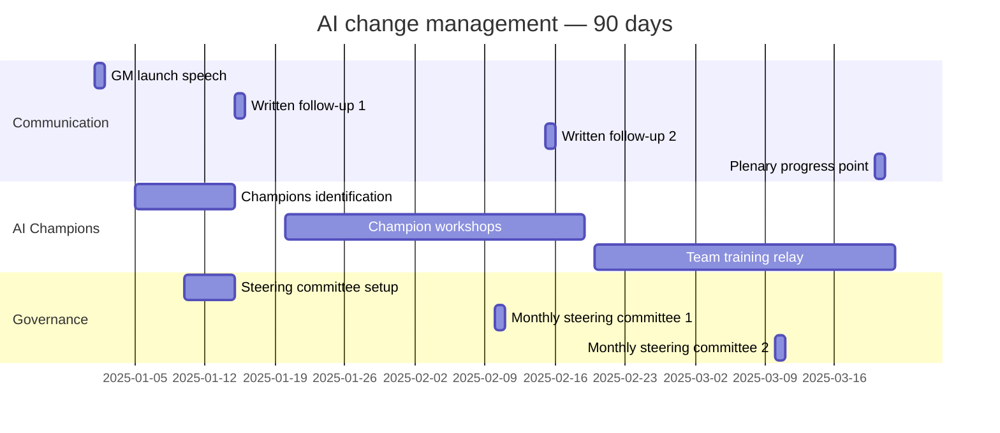

## 4.7 — Module synthesis

| Key point | What to remember |
|-----------|------------------|
| Failure cause | 92% human, 8% technical |
| 4 profiles | Fearful, Technophobe, Enthusiast, Indifferent |
| Speech | Acknowledge + frame + commit — no empty promise |
| Champions | Pedagogues, not experts, non-financial recognition |
| Conflicts | The 6 situations are foreseeable, therefore preparable |
| Calendar | 90 structured days, executive-committee milestones |

### Module 04 deliverable

**Internal AI launch speech template**: an adaptable 4-page Word/Pages document, with speech template, list of seven phrases to ban, pre-speech checklist, and written communication plan for days 30, 60, 90.

---

---

# Module 05 — Monitor and adjust: executive AI piloting

**Duration: 1h00 · Format: meeting template + executive KPIs + stop/pivot/scale decisions**

## Module objectives

By the end of this module, you will be able to:

1. Hold a **one-hour monthly AI committee** in a format that avoids technicality.
2. Track the **five executive KPIs** that tell the truth about an AI project.
3. Decide **stop, pivot or accelerate** without emotion, based on data.
4. Build **quarterly reporting** readable by your executive committee, bank, or shareholders.

## 5.1 — Why a monthly one-hour committee is enough (and why more would be counterproductive)

Many executives believe that piloting an AI project requires multiplying meetings, touchpoints, committees. False. In an SME, over-piloting kills more AI projects than under-piloting. The rhythm that works is a monthly one-hour committee, short, structured, with the same participants, same format, same deliverables.

This rhythm guarantees three things. **First**, the executive does not become the bottleneck for daily decisions (which stay with the CAIO or vendor). **Second**, the project stays visible at executive-committee level without saturating the agenda. **Third**, deviations are spotted early (30 days maximum) without micromanagement.

## 5.2 — The monthly AI committee: one-hour executive format

### Participants

| Role | Presence | Function in the committee |
|------|----------|---------------------------|
| Executive (GM) | Always | Final arbitration |
| CAIO (or vendor) | Always | Report, alerts |
| IT head or equivalent | Always | Technical and security vigilance |
| Business sponsor of the project | Always | Field voice |
| CFO | Monthly | Budget view |
| HR Director | Quarterly | Human view |
| AI Champion representative | Quarterly | User voice |

### Standard agenda (60 minutes)

| Duration | Sequence | Objective |
|----------|----------|-----------|
| 5 min | Review of previous month's decisions | Traceability |
| 15 min | CAIO report — 5 KPIs + milestones | Real state |
| 10 min | Field user point — adoption, feedback | Business voice |
| 10 min | Financial point — burnt, remaining | Budget control |
| 10 min | Red points — alerts, risks, arbitration requests | Decision |
| 10 min | Decisions and next-month assignments | Commitment |

### Committee rules that work

| Rule | Effect |
|------|--------|
| No technical slides — only business figures | Executive focus |
| CAIO sends 1-page pre-brief 48h before | Time saving |
| Every decision tracked in a 1-page minutes document | Corporate memory |
| No ad-hoc visitor — same participants | Continuity |
| Strict end time | Discipline |

## 5.3 — The five executive KPIs of an SME AI project

Forget the seventeen technical KPIs. For an executive, five indicators are enough to tell the truth about an AI project.

### Target dashboard

| KPI | Definition | Frequency | Alert threshold |
|-----|-----------|-----------|----------------|
| Adoption | % of target users using the tool at least 1×/week | Monthly | <50% after M3 |
| Business impact | Business indicator (€, hours, volume) linked to use case | Monthly | <60% of target |
| User satisfaction | 1-10 score on short quarterly survey | Quarterly | <6/10 |
| Budget consumed vs planned | Actual spend / planned spend to date | Monthly | >110% at mid-project |
| Incidents and drifts | Number of critical incidents since last committee | Monthly | >2 critical/month |

### Monthly dashboard mock-up (one A4 page)

```
+----------------------------------------------------------+
|  AI DASHBOARD — Project [Name]      Month: [Month/Year]  |
+----------------------------------------------------------+
|                                                          |
|  ADOPTION       : 68%    (M6 target: 75%)    [OK]        |
|  BUSINESS IMPACT: 41h/wk saved (target 50)   [ALERT]     |
|  SATISFACTION   : 7.4/10 (last Q1 survey)    [OK]        |
|  BUDGET         : 62% consumed / 58% planned [ALERT]     |
|  INCIDENTS      : 1 critical this month      [OK]        |
|                                                          |
|  MONTHLY ALERTS                                          |
|  - Sales team: low adoption (42%), cause: incomplete     |
|    training, catch-up plan at D+15.                      |
|                                                          |
|  PROPOSED DECISIONS THIS MONTH                           |
|  1. Approve additional training budget: 6,000 EUR        |
|  2. Postpone module 3 deployment by 1 month              |
|                                                          |
|  NEXT COMMITTEE: [Date]                                  |
+----------------------------------------------------------+
```

## 5.4 — The five questions to ask your AI team every month

Independent of the dashboard, these five questions open the deep discussion in 10 minutes.

| Question | What it reveals |
|----------|----------------|
| What worked better than expected this month? | Scale opportunities |
| What worked less well than expected? | Weak signals |
| What would you do differently if the project restarted today? | Organisational learning |
| What decision did you take without consulting me that I need to know? | Governance alignment |
| If I had to stop this project next week, what would we have really lost? | Real value created |

The fifth question is the most powerful. It forces the CAIO or vendor to articulate real value, not promised value.

## 5.5 — Stop, pivot, accelerate: the decision matrix

At each quarterly committee, you must decide between these three options. Staying in ambiguity kills AI projects.

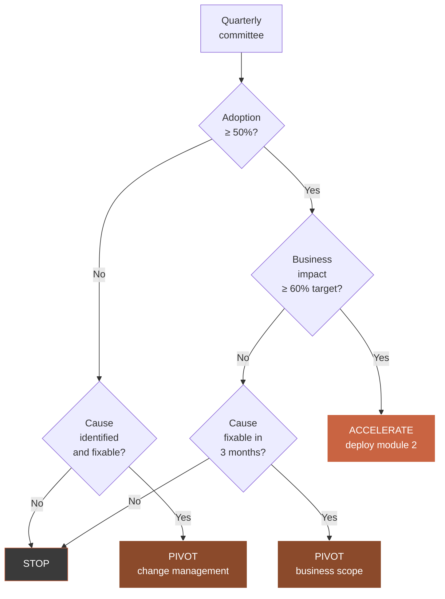

### When to stop

| Signal | Severity |
|--------|---------|
| Adoption <30% after 6 months, deep cause (business rejection) | Immediate stop |
| Budget blown (>150% planned) without result perspective | Stop |
| Vendor tech abandoned or acquired by hostile competitor | Stop + plan B |
| Repeated critical incidents (>3 in 3 months) | Stop |

**How to stop without losing face.** Stopping an AI project is not a failure — it is an executive decision. Executive-committee formulation: "We learned [X], [Y], [Z]. Success conditions are not met. We stop this project and reinvest the remaining budget on [new use case] that capitalises on our learning."

### When to pivot

| Signal | Action |
|--------|--------|
| Adoption OK, impact weak | Pivot scope (another task in same team) |
| Impact OK, adoption weak | Pivot change management (training, champions) |
| Unstable tech but validated use case | Switch vendor or platform |

### When to accelerate

| Signal | Action |
|--------|--------|
| Adoption + impact both above target | Deploy on next team |
| Field teams ask to extend to other tasks | Start scoping use case 2 |
| ROI confirmed ahead of planned deadline | Present 12-month scale plan to executive committee |

## 5.6 — Quarterly reporting: one page for your executive committee, bank, shareholders

A quarterly AI report readable by non-experts must fit on one page and answer four questions.

### Quarterly reporting template

```
QUARTERLY AI REPORT — [Quarter / Year]

1. WHERE ARE WE?
   Project [Name] — phase [scoping / build / deployment / scale]
   Adoption: [X]%     Business impact: [Y]     Budget consumed: [Z]%

2. WHAT DID WE LEARN THIS QUARTER?
   - 3 key learnings in 3 lines maximum each.

3. WHAT DECISIONS DID WE MAKE?
   - 3 decisions with budget or human consequences.

4. WHAT TRAJECTORY FOR NEXT QUARTER?
   - Milestones T+1
   - Identified risks
   - Budget T+1
```

## 5.7 — Annual piloting: review and AI strategy update

Once a year, dedicate half a day with your executive committee to revising your AI strategy. Typical agenda.

| Sequence | Duration | Objective |
|----------|----------|-----------|
| Year review (projects, ROI, learnings) | 45 min | Truth |
| External benchmark (your competitors and sector) | 30 min | Repositioning |
| Identification of 2-3 new use cases | 1 h | Pipeline |
| Budget decisions for next year | 45 min | Commitment |
| CAIO profile review (Permanent / Fractional / Vendor) | 30 min | Governance |

## 5.8 — Module synthesis

| Key point | What to remember |
|-----------|------------------|
| Rhythm | Monthly 1h, quarterly arbitration, annual review |
| Dashboard | 5 KPIs on 1 A4 page — adoption, impact, satisfaction, budget, incidents |
| 5 questions | The "what would we have really lost" question is the most powerful |
| Decision | Stop / Pivot / Scale — never in ambiguity |
| Reporting | 1 page, 4 questions, suited to executive committee / bank / shareholders |

### Module 05 deliverable

**Monthly AI piloting meeting agenda**: a PDF document containing the monthly committee agenda, the 5-KPI dashboard on one A4 page, the 5 monthly questions, the stop/pivot/scale decision matrix, and the quarterly reporting template.

---

---

# Conclusion — You are ready

Six hours of work. Five modules. Five executive deliverables. Thirty days to see the first effects.

From now on, you have what the majority of French SME executives do not yet: **a framework for deciding**. You know how to recognise a good use case, read an AI quote without being trapped, recruit or hire a suitable CAIO profile, engage your teams without friction, and pilot your projects in one hour per month.

You did not become technical. You did not need to. You became the executive who **makes AI decisions faster, more accurately, with fewer losses** than your competitors. That is a considerable competitive edge, and it is quiet: you win while the others hesitate.

## What you should do in the 72 hours following this track

| Timeline | Action | Duration |
|----------|--------|----------|
| D+1 | Fill the Module 01 use-case selection grid | 30 min |
| D+2 | Identify an internal sponsor for the priority use case | 1 h |
| D+3 | Pre-compute a rough ROI with the Module 02 calculator | 45 min |
| D+7 | Decide: Permanent / Fractional / Vendor (Module 03 grid) | 1 h |
| D+14 | Consult the CAIO Registry to shortlist 3-5 profiles | 15 min |
| D+30 | Hold your first monthly AI committee in the Module 05 format | 1 h |

## The special bridge to B2B

You have read this track. You now know what to do. But perhaps you are thinking: "I have neither the time to carry this myself nor the desire to hire a permanent CAIO just yet."

That is normal. It is even the situation of most French SMEs. You are not obliged to do everything yourself. The CAIO Registry exists for that.

### Finding a CAIO for my SME


The average ticket for a Fractional CAIO mission through the CAIO Registry is 15,000 to 30,000 euros over 3 to 6 months, including full scoping of the priority use case, selection and piloting of the technical vendor, change management, and skills transfer to your internal team. It is the fastest shortcut between "I know what needs to be done" and "it is running at my place".

**Head to agentik-os.com/registry** to brief your need in under fifteen minutes.

---

---

# Appendices

## Appendix A — Glossary for non-technical executives

| Term | Simple definition |
|------|-------------------|
| Generative AI | Type of AI producing text, image or sound, like ChatGPT. |
| LLM | "Large Language Model" — engine understanding and producing text (GPT, Claude, Mistral). |
| AI agent | Program executing a sequence of actions autonomously to accomplish a mission. |
| RAG | Technique allowing an AI to consult your internal documents before answering. |
| Fine-tuning | Specialising an AI on your vocabulary and cases. |
| Prompt | Instruction given to AI, in natural language. |
| Hallucination | Answer invented by AI, presented as true. |
| Token | Billing unit for AI (about 4 characters). |
| OCR | Text recognition in an image (scanned invoice). |
| API | Technical entry point to connect two pieces of software. |
| No-code AI | Tools allowing AI configuration without code. |
| GDPR | European regulation on personal-data protection. |
| CAIO | Chief AI Officer — AI head reporting to general management. |
| Fractional | Contractual part-time (typically 2-3 days a week). |
| Day rate | Average daily rate for a vendor or freelancer. |
| ROI | Return on investment. |
| Payback | Return-on-investment duration. |
| POC | Proof of concept — demonstration to validate an idea before deployment. |
| MVP | Minimum viable product — minimal deployable version. |
| CIR / CII | French Research / Innovation Tax Credits. |
| BPI | French Public Investment Bank. |

## Appendix B — 30-day start-up checklist

### Week 1 — Scoping

- [ ] Track completed, grids filled
- [ ] Priority use case identified and roughly priced
- [ ] Internal sponsor named, 1-hour meeting booked
- [ ] Executive-committee information of launch to be planned

### Week 2 — Format decision

- [ ] Permanent / Fractional / Vendor decision made
- [ ] If Fractional: brief filled on CAIO Registry
- [ ] If Vendor: 3 quotes to request with the 18 questions attached
- [ ] CFO briefed on the budget envelope

### Week 3 — Partner choice

- [ ] 3 interviews run with the interview grid
- [ ] 2 client reference calls made
- [ ] Commercial proposal sanity-checked against families A/B/C/D ranges
- [ ] Rough ROI validated with pessimistic scenario ≥ 0

### Week 4 — Internal launch

- [ ] Launch speech written and adapted
- [ ] 3-5 AI champions identified
- [ ] Steering committee set up
- [ ] Date of first monthly AI committee scheduled
- [ ] Internal written communication issued

## Appendix C — CAIO Registry bridge — practical card

| Item | Detail |
|------|--------|
| URL | agentik-os.com/registry |
| Brief required | 15 minutes |
| Shortlist delay | 72 hours |
| Typical Fractional rates | 4,500 to 9,000 €/month for 2-3 d/week |
| Short-mission rates | 15,000 to 30,000 € over 3-6 months |
| Guarantees | Certified profiles, verified references, master contract included |
| Possible disengagement | 30-day notice with no fees beyond time worked |

## Appendix D — Complementary resources

| Resource | Use |
|----------|-----|
| BPI France — Diag IA site | Financial aids for scoping |
| FranceNum | Digital vouchers for SMEs |
| CNIL — AI and GDPR guide | Data compliance |
| Medef — SME AI barometer | Sector benchmark |
| APM / CRA / Vistage | Executive peer networks, experience exchange |
| Agentik OS — agentik-os.com | Tracks, Registry, executive AI intelligence |

## Appendix E — Executive stakeholder map of an SME AI project

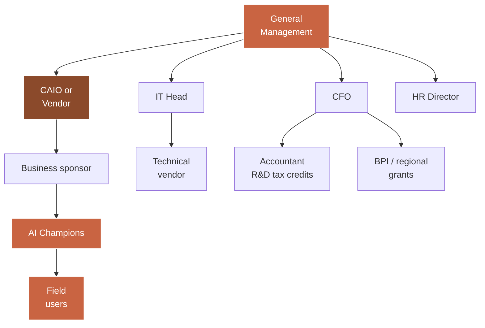

Each arrow represents a decision or information channel. The executive pilots six channels simultaneously. The key to success is not to activate them all at the same intensity. GM works weekly with the CAIO and business sponsor, monthly with the IT head and CFO, quarterly with HR and the champions.

## Appendix F — The ten most costly mistakes to avoid (cross-track synthesis)

| # | Mistake | Typical impact |
|---|---------|---------------|
| 1 | Choosing tech before the problem | Budget lost, project shelved |
| 2 | Underestimating the data audit | 2-3 month minimum delay |
| 3 | Neglecting change management | Adoption <30%, political failure |
| 4 | Recruiting a CAIO without a clear mandate | Resignation after 6-8 months |
| 5 | Not reading the 18 questions before signing a quote | 30-50% overpayment |
| 6 | Underestimating recurring costs | Cash squeeze at M12 |
| 7 | Not asking for plan B if data is dirty | 4-6 month drift |
| 8 | Ignoring BPI/CIR/CII grants | 20-40% saving loss |
| 9 | Over-piloting (weekly meetings, multiple committees) | Project team demotivation |
| 10 | Refusing to stop a project that doesn't work | Loss multiplied 2-3 times |

## Appendix G — Frequently asked executive questions

**Will AI replace my staff?**
In SMEs, rarely entire jobs. Rather tasks. Your non-replacement commitment is both credible and defendable, provided it is sincere.

**Must I absolutely train my whole team?**
No. Train the 10 to 20% directly concerned by the use case, plus your 3-5 AI champions. The others will learn naturally by seeing the tool in action.

**Can my IT head play the CAIO role?**
Rarely. The IT head thinks infrastructure and security. The CAIO thinks use case and strategy. The two roles coexist and complement each other.

**What if I wait another year before starting?**
It is an option. But keep in mind that competitors launching now are taking 12 months of organisational learning ahead. That human capital does not catch up by buying a licence.

**Can I entirely delegate my AI project to a vendor?**
Yes, but you remain the decision-maker. A vendor cannot replace GM on strategic arbitrations or change management.

**From what size should an SME consider AI?**
From 20 people, if you have a back office with repetitive tasks. The threshold is not a company size, it is a volume of repetition.

**Is no-code AI enough?**
For 60% of first use cases, yes. For the remaining 40% (deep ERP integration, sensitive data, high volumes), custom development is still needed.

**How do I justify the investment to my shareholders?**
Three axes: (1) measurable productivity, (2) modernisation signal to clients and talent, (3) capitalisable organisational learning for future projects.

---

**End of the AI Executive Decision Maker Track**

**Agentik {OS} — agentik-os.com**
