# CAIO Academy — AI Executive Decision Maker Track

**Le parcours court, dense et orienté décision pour la dirigeante de PME qui doit prendre des décisions IA stratégiques maintenant**

**Public cible :** Isabelle — Dirigeante de PME (20 à 200 personnes)
**Durée du parcours :** 6 heures de contenu structuré
**Horizon de transformation :** 30 jours pour des résultats visibles
**Format :** 5 modules denses, livrables exécutifs, grilles de décision prêtes à l'emploi

**Agentik {OS} — agentik-os.com**

---

## Préface — Pourquoi ce parcours existe

Vous dirigez une PME. Vous avez entre vingt et deux cents collaborateurs, un chiffre d'affaires entre trois et cinquante millions, une équipe qui tient la maison, un DAF qui veille à la trésorerie, et un agenda qui déborde. Vous n'avez ni le temps ni la vocation de devenir technique. Et pourtant, tous les mois, quelqu'un vous parle d'IA : votre DSI, votre expert-comptable, votre concurrent qui vient d'annoncer un « chantier IA », votre enfant qui utilise ChatGPT pour ses devoirs, votre banquier qui vous demande si vous avez une stratégie IA, un prestataire qui vous promet trente pour cent de productivité en six mois.

Vous sentez que l'IA n'est plus un sujet marketing. C'est un sujet de direction. Mais personne ne vous explique **comment décider** sans devenir ingénieure. Personne ne vous donne la grille, la fourchette budgétaire réaliste, la question qui désarme un prestataire trop bavard, le signal qui prouve qu'un projet IA est en train de dérailler. Les formations IA existantes sont soit trop techniques (Python, prompt engineering, LangChain), soit trop creuses (« l'IA va transformer votre entreprise » en cent vingt slides sans un seul budget chiffré).

Ce parcours comble ce vide. Il s'adresse à la dirigeante qui doit trancher sans avoir envie d'écrire une ligne de code. Il donne des chiffres concrets, des tableaux comparatifs utilisables en CODIR dès demain, des questions précises à poser à tout prestataire IA, un calculateur ROI qui tient sur une page, un discours de lancement interne testé, et une routine de pilotage mensuel d'une heure.

Six heures de contenu. Trente jours pour voir les premiers effets. Aucun jargon technique. Aucun pseudo-code. Aucune promesse hors sol. Et une passerelle claire vers la suite : ne pas devenir CAIO vous-même, mais savoir **en recruter un bon**, en mission ou en CDI, et le piloter en confiance.

Votre mission à la fin de ce parcours n'est pas de devenir experte en IA. Votre mission est de devenir la dirigeante qui **prend les bonnes décisions IA plus vite que ses concurrents**, avec moins de pertes, et en embarquant ses équipes plutôt qu'en les crispant.

---

## Avatar — Isabelle, dirigeante de PME

| Dimension | Profil |
|-----------|--------|
| Âge typique | 42-58 ans |
| Rôle | CEO, DG, Présidente, Directrice générale d'une PME ou ETI |
| Taille d'entreprise | 20 à 200 collaborateurs, 3 à 50 M€ de CA |
| Secteurs fréquents | Services BtoB, distribution, industrie, agro, santé, immobilier, conseil, logistique |
| Formation initiale | École de commerce, école d'ingénieur, droit, reprise familiale |
| Rapport à la technique | A déjà utilisé ChatGPT. A un DSI ou prestataire infogéré. N'a jamais écrit une ligne de code. |
| Pression principale | Concurrents qui annoncent des « chantiers IA », actionnaires qui demandent un cap IA, équipe qui s'inquiète pour ses postes |
| Frustration | « Tout le monde me parle d'IA mais personne ne me dit combien ça coûte *vraiment* et comment décider » |
| Peur profonde | Investir 80 K€ dans un projet IA qui finit au placard, ou attendre et se faire distancer |
| Rêve accessible | Un premier projet IA qui marche en 90 jours, un ROI mesurable, une équipe qui suit, sans devenir technique |
| Signal d'achat | A déjà acheté BPI France formation, MEDEF, CPA dirigeants, CRA, APM ou Vistage |
| Blocage principal | Ne sait pas distinguer un bon prestataire IA d'un vendeur de rêve, ni arbitrer entre interne/externe |

---

## Vue d'ensemble du parcours

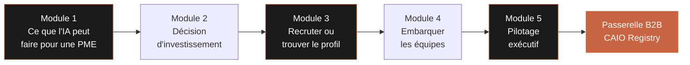

Chaque module est conçu pour produire **un livrable exécutif directement utilisable en CODIR ou avec votre prestataire**. À la fin du parcours, vous repartez avec cinq outils concrets, une feuille de route trente jours, et une entrée directe vers le CAIO Registry si vous souhaitez déléguer.

| Module | Durée | Livrable principal | Impact attendu |
|--------|-------|--------------------|----------------|
| 01 — Ce que l'IA peut faire pour une PME, maintenant | 1h15 | Grille de sélection cas d'usage PME | Identification du meilleur premier projet |
| 02 — Prendre la bonne décision d'investissement IA | 1h15 | Calculateur ROI IA simplifié (Excel) | Arbitrage budgétaire objectivé |
| 03 — Recruter ou trouver le bon profil IA | 1h15 | Guide de recrutement CAIO dirigeants | Choix éclairé CDI / Fractional / Prestataire |
| 04 — Embarquer ses équipes dans la transformation IA | 1h15 | Template discours de lancement IA interne | Adhésion au lieu de résistance |
| 05 — Suivre et ajuster : le pilotage exécutif IA | 1h00 | Agenda type réunion pilotage IA mensuelle | Pilotage en 1h par mois sans dérive |

**Ce que vous maîtriserez à la fin :**

- Identifier le meilleur cas d'usage IA pour votre PME en moins de trente minutes.
- Évaluer et sélectionner un prestataire ou un profil CAIO sans vous faire piéger.
- Calculer un ROI IA en moins d'une heure, avant d'engager un euro.
- Embarquer vos équipes sans créer de résistance ni de panique.
- Piloter vos projets IA en une heure par mois avec des indicateurs exécutifs.

---

---

# Module 01 — Ce que l'IA peut faire pour une PME, maintenant

**Durée : 1h15 · Format : lecture dense + dix cas concrets + grille de sélection**

## Objectifs du module

À la fin de ce module, vous saurez :

1. Citer **dix cas d'usage IA réellement déployés dans des PMEs françaises**, avec secteur, budget, délai, résultat chiffré.
2. Appliquer une **grille de sélection de cas d'usage** à votre propre entreprise et identifier les deux ou trois projets prioritaires.
3. Nommer les **trois pièges les plus coûteux** qui font échouer la majorité des premiers projets IA en PME.
4. Sortir du module avec votre **premier cas d'usage IA identifié, chiffré grossièrement, et arbitré**.

## 1.1 — Le paysage IA en PME française : la vraie photo en 2025

Oubliez ce que vous lisez dans *Les Échos*. La réalité de l'IA en PME française en 2025 n'est pas celle des licornes de la tech. C'est celle de milliers de structures de 30 à 150 personnes qui ont lancé, entre 2023 et 2025, un ou deux projets IA ciblés sur des tâches très précises, pour des budgets compris entre 15 000 et 150 000 euros, avec des résultats visibles en trois à neuf mois.

Trois constats que votre CODIR doit intégrer :

**Premier constat.** L'IA en PME ne remplace quasiment jamais un métier entier. Elle automatise une tâche ou un sous-ensemble de tâches à l'intérieur d'un métier. Le comptable reste comptable, mais il passe deux fois moins de temps sur la saisie des factures. La commerciale reste commerciale, mais l'IA lui prépare les dossiers avant le rendez-vous. La DRH reste DRH, mais elle reçoit un pré-tri automatique des CV. Le métier reste ; la friction disparaît.

**Deuxième constat.** Les premiers gains viennent presque toujours du back-office, pas du front. Les cas d'usage qui tiennent dans la durée touchent l'administratif, la documentation, le support interne, la saisie, la recherche d'informations. Les projets IA « qui parlent au client » (chatbot public, recommandation produit) sont plus visibles mais moins rentables dans les neuf premiers mois. Commencez par l'invisible.

**Troisième constat.** Le succès ne dépend presque jamais de la technologie choisie. Il dépend de la précision du cas d'usage, de la qualité de la donnée disponible, et de l'adhésion de l'équipe concernée. Les PMEs qui échouent ont presque toutes choisi un outil avant d'avoir clarifié le problème.

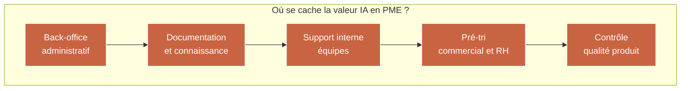

## 1.2 — Dix cas d'usage réels dans des PMEs françaises

Les cas suivants sont anonymisés mais représentatifs de ce qui a été réellement déployé entre 2023 et 2025 dans des structures de moins de 250 salariés. Les budgets indiqués couvrent la phase projet (conception, implémentation, déploiement) hors coût annuel récurrent d'exploitation.

### Cas 1 — Saisie comptable automatisée (cabinet d'expertise-comptable, 45 personnes, Loire-Atlantique)

| Élément | Donnée |
|---------|--------|
| Secteur | Services BtoB — Expertise-comptable |
| Effectif | 45 collaborateurs, CA 5,2 M€ |
| Problème | 6 comptables passaient 40 % de leur temps à saisir des factures fournisseurs pour les clients TPE |
| Solution | Outil de lecture automatique de factures avec IA (OCR+LLM) connecté à Sage et Cegid |
| Budget projet | 38 000 € (conception + intégration + formation) |
| Coût récurrent | 14 000 €/an (licences + monitoring) |
| Délai de déploiement | 4 mois |
| Résultat à 6 mois | Temps de saisie divisé par 3,2. ROI atteint au mois 9. Collaborateurs repositionnés sur du conseil. |

### Cas 2 — Pré-tri CV et entretiens téléphoniques (ETI BTP, 180 personnes, Île-de-France)

| Élément | Donnée |
|---------|--------|
| Secteur | BTP second œuvre |
| Effectif | 180 collaborateurs, CA 28 M€ |
| Problème | 800 candidatures/mois pour 15 postes ouverts, DRH débordée, délais de recrutement 54 jours |
| Solution | Assistant IA de pré-qualification CV + agent vocal pour entretien téléphonique de première sélection |
| Budget projet | 72 000 € |
| Coût récurrent | 22 000 €/an |
| Délai de déploiement | 5 mois |
| Résultat à 6 mois | Délai de recrutement passé à 28 jours. DRH récupère 12 heures/semaine. Taux de rétention à 6 mois +9 points. |

### Cas 3 — Assistant commercial préparant les rendez-vous (éditeur de logiciel, 60 personnes, Rhône)

| Élément | Donnée |
|---------|--------|
| Secteur | Édition logicielle BtoB |
| Effectif | 60 collaborateurs, CA 11 M€ |
| Problème | Commerciaux passent 8h/semaine à préparer leurs RDV (recherche client, historique, signaux d'achat) |
| Solution | Assistant IA connecté à HubSpot, LinkedIn, Pappers, news. Produit un brief de 2 pages avant chaque RDV. |
| Budget projet | 45 000 € |
| Coût récurrent | 18 000 €/an |
| Délai de déploiement | 3 mois |
| Résultat à 6 mois | Temps de préparation divisé par 4. Taux de transformation RDV → proposition +11 points. |

### Cas 4 — Support client niveau 1 (e-commerce, 32 personnes, Gironde)

| Élément | Donnée |
|---------|--------|
| Secteur | E-commerce produits maison |
| Effectif | 32 collaborateurs, CA 7 M€ |
| Problème | 2 200 tickets support/mois, 60 % répétitifs (suivi commande, retour, remboursement) |
| Solution | Agent IA connecté à Shopify + transporteur + CRM, répond en autonomie aux questions simples |
| Budget projet | 28 000 € |
| Coût récurrent | 9 600 €/an |
| Délai de déploiement | 2,5 mois |
| Résultat à 6 mois | 58 % des tickets résolus sans humain. Équipe support ramenée de 5 à 3 personnes par attrition naturelle. CSAT stable. |

### Cas 5 — Base documentaire interne interrogeable (cabinet d'avocats, 24 associés + 35 collaborateurs, Paris)

| Élément | Donnée |
|---------|--------|
| Secteur | Services juridiques |
| Effectif | 59 collaborateurs, CA 14 M€ |
| Problème | 15 ans d'archives internes non exploitables, chaque recherche prend 1 à 3 heures |
| Solution | Moteur de recherche IA sur documents internes + base jurisprudence, avec citations sourcées |
| Budget projet | 95 000 € (sensibilité données élevée) |
| Coût récurrent | 24 000 €/an |
| Délai de déploiement | 6 mois |
| Résultat à 6 mois | Temps de recherche divisé par 5. Collaborateurs juniors produisent des notes en 2h au lieu de 8h. |

### Cas 6 — Contrôle qualité visuel sur ligne de production (industrie mécanique, 110 personnes, Isère)

| Élément | Donnée |
|---------|--------|
| Secteur | Industrie, sous-traitance mécanique |
| Effectif | 110 collaborateurs, CA 19 M€ |
| Problème | Contrôle qualité manuel lent, 1,8 % de défauts non détectés remontés par clients |
| Solution | Caméra + IA visuelle en bout de ligne, détection automatique des défauts d'aspect |
| Budget projet | 120 000 € (matériel inclus) |
| Coût récurrent | 11 000 €/an |
| Délai de déploiement | 7 mois |
| Résultat à 6 mois | Défauts clients passés de 1,8 % à 0,4 %. Pénalités clients divisées par 3. |

### Cas 7 — Génération d'offres commerciales personnalisées (agence événementielle, 28 personnes, Hauts-de-Seine)

| Élément | Donnée |
|---------|--------|
| Secteur | Événementiel BtoB |
| Effectif | 28 collaborateurs, CA 4,6 M€ |
| Problème | Chaque devis demande 4 à 6 heures (recherche lieux, prestataires, scénarisation) |
| Solution | Générateur d'offres IA qui produit un premier jet personnalisé selon brief client |
| Budget projet | 32 000 € |
| Coût récurrent | 8 400 €/an |
| Délai de déploiement | 3 mois |
| Résultat à 6 mois | Temps de devis divisé par 2,5. +34 % de devis envoyés à équipe constante. |

### Cas 8 — Analyse automatique de CV candidats (coopérative agricole, 95 personnes, Bretagne)

| Élément | Donnée |
|---------|--------|
| Secteur | Agro-alimentaire coopératif |
| Effectif | 95 collaborateurs, CA 22 M€ |
| Problème | Recrutement saisonnier massif, DRH + 2 assistantes débordées |
| Solution | Outil IA de scoring et pré-classement CV selon critères du poste |
| Budget projet | 22 000 € |
| Coût récurrent | 7 200 €/an |
| Délai de déploiement | 2 mois |
| Résultat à 6 mois | Temps de traitement par CV divisé par 6. DRH valide en final. Aucun biais relevé en audit CNIL interne. |

### Cas 9 — Assistant médical pour compte-rendus (cabinet de radiologie, 22 personnes, Occitanie)

| Élément | Donnée |
|---------|--------|
| Secteur | Santé — imagerie médicale |
| Effectif | 22 collaborateurs, CA 6,8 M€ |
| Problème | Radiologues dictent leurs compte-rendus, secrétaires les saisissent, 30 min par compte-rendu |
| Solution | Dictée IA spécialisée imagerie, transcription automatique + mise en forme + vocabulaire médical |
| Budget projet | 48 000 € |
| Coût récurrent | 15 600 €/an |
| Délai de déploiement | 4 mois |
| Résultat à 6 mois | Saisie automatisée à 92 %. Secrétaires repositionnées sur relation patient. |

### Cas 10 — Prévision des stocks par IA (distributeur spécialisé, 140 personnes, Nouvelle-Aquitaine)

| Élément | Donnée |
|---------|--------|
| Secteur | Distribution spécialisée |
| Effectif | 140 collaborateurs, CA 34 M€ |
| Problème | 12 % de rupture sur références phares, 4 % de surstocks obsolètes |
| Solution | Moteur de prévision IA croisant historique, météo, calendrier, signaux concurrence |
| Budget projet | 110 000 € |
| Coût récurrent | 26 000 €/an |
| Délai de déploiement | 8 mois |
| Résultat à 6 mois | Ruptures passées de 12 % à 4,5 %. Surstocks réduits de 40 %. Gain trésorerie 340 K€. |

## 1.3 — Synthèse des dix cas : les constantes

| Dimension | Minimum | Médiane | Maximum |
|-----------|---------|---------|---------|
| Effectif entreprise | 22 | 60 | 180 |
| CA annuel (M€) | 4,6 | 13 | 34 |
| Budget projet (€) | 22 000 | 46 500 | 120 000 |
| Coût récurrent annuel (€) | 7 200 | 14 800 | 26 000 |
| Délai de déploiement (mois) | 2 | 4 | 8 |
| ROI atteint (mois) | 6 | 9 | 14 |

**Lecture exécutive.** Le premier projet IA typique d'une PME française en 2025 coûte entre 25 K€ et 75 K€ en mode projet, plus environ 15 K€/an d'exploitation, se déploie en 3 à 5 mois, et atteint le retour sur investissement autour du mois 9. Ces chiffres sont votre référentiel. Tout prestataire qui vous annonce 350 K€ pour un premier projet « pour faire les choses bien » vous vend un cabinet, pas un cas d'usage. Tout prestataire qui vous promet 12 K€ et 3 semaines vous vend un MVP jetable.

## 1.4 — Les trois pièges qui coûtent le plus cher aux dirigeantes de PME

### Piège numéro 1 — Choisir la techno avant le problème

Le piège : un DSI, un prestataire ou un enthousiaste interne arrive avec une démo impressionnante de ChatGPT, Claude, Mistral, ou d'une plateforme no-code IA. Le CODIR s'emballe. Budget voté. Six mois plus tard, l'outil est déployé mais personne ne l'utilise, parce qu'il n'adresse pas un vrai point de friction.

**Signal d'alerte :** la phrase « on pourrait utiliser l'IA pour… » lancée en CODIR avant qu'un problème métier précis, chiffré, et validé par les équipes terrain n'ait été documenté.

**Contre-mesure :** refuser toute discussion techno tant que le problème n'a pas été écrit en une page, avec trois indicateurs chiffrés (temps passé, coût, volume) et une personne métier responsable.

### Piège numéro 2 — Sous-estimer la donnée nécessaire

Le piège : on signe un projet IA avec un prestataire convaincant, et trois mois plus tard on découvre que la donnée sur laquelle l'IA devait s'appuyer n'existe pas, ou est trop sale, ou est bloquée dans un ERP dont personne n'a les droits d'accès.

**Signal d'alerte :** aucune phase d'audit données n'est prévue au kick-off du projet, ou elle tient en une demi-journée.

**Contre-mesure :** imposer une phase d'audit données de deux à quatre semaines, avec un livrable écrit qui dit honnêtement « telle donnée existe, telle autre manque, voici le plan B ».

### Piège numéro 3 — Ne pas embarquer les équipes terrain

Le piège : le projet IA est décidé en CODIR, porté par un sponsor enthousiaste, développé avec un prestataire, puis présenté aux équipes en mode « tadaaa, voici votre nouvel outil ». Taux d'adoption : 18 % au bout de 6 mois. Projet considéré comme un échec même si l'outil fonctionne techniquement.

**Signal d'alerte :** aucun collaborateur terrain n'est impliqué avant la recette utilisateur.

**Contre-mesure :** inclure au moins deux utilisateurs terrain dans le comité de pilotage dès le jour un, co-définir le cahier des charges, planifier l'accompagnement au changement en budget et en calendrier.

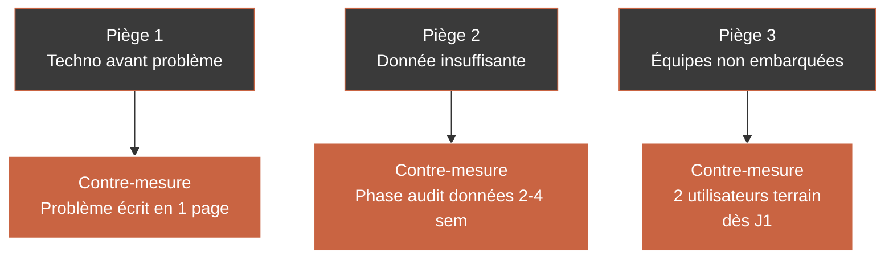

## 1.5 — Grille de sélection de cas d'usage : l'exercice des vingt minutes

L'objectif est de sortir de ce module avec **votre premier cas d'usage IA identifié et arbitré**. La grille suivante est utilisable seule ou en CODIR.

### Étape 1 — Inventaire ouvert (5 minutes)

Listez, sans filtre, toutes les tâches répétitives ou chronophages que vous observez dans votre entreprise, en les classant par grande fonction.

| Fonction | Tâche répétitive potentielle | Personne qui la subit | Fréquence |
|----------|------------------------------|----------------------|-----------|
| Finance / comptabilité | | | |
| RH / recrutement | | | |
| Commercial / ventes | | | |
| Marketing / communication | | | |
| Support client / SAV | | | |
| Production / opérations | | | |
| Direction / reporting | | | |

### Étape 2 — Scoring par critère (10 minutes)

Pour chaque tâche listée, notez sur une échelle de 1 à 5 les quatre critères suivants.

| Critère | Question associée | Pondération |
|---------|-------------------|-------------|
| Volume | Cette tâche se répète-t-elle beaucoup ? | 25 % |
| Coût temps | Combien d'heures totales par mois ? | 25 % |
| Donnée disponible | Les données nécessaires existent-elles déjà proprement ? | 25 % |
| Adhésion équipe | L'équipe concernée accueillerait-elle favorablement ? | 25 % |

**Score total = moyenne pondérée.** Toute tâche avec un score inférieur à 3,5 sort du radar. Entre 3,5 et 4, elle est à retravailler. À partir de 4, c'est un candidat sérieux pour votre premier projet.

### Étape 3 — Filtre de faisabilité (5 minutes)

Appliquez les trois questions suivantes à chaque candidat sérieux.

| Question | Réponse acceptable |
|----------|--------------------|
| Le périmètre tient-il en moins de trois mois de projet ? | Oui |
| Pouvez-vous nommer un sponsor interne qui portera le projet ? | Oui, avec prénom |
| Acceptez-vous de budgéter entre 25 K€ et 75 K€ pour ce premier cas ? | Oui ou justification chiffrée |

Si les trois réponses sont oui, vous tenez votre premier projet IA.

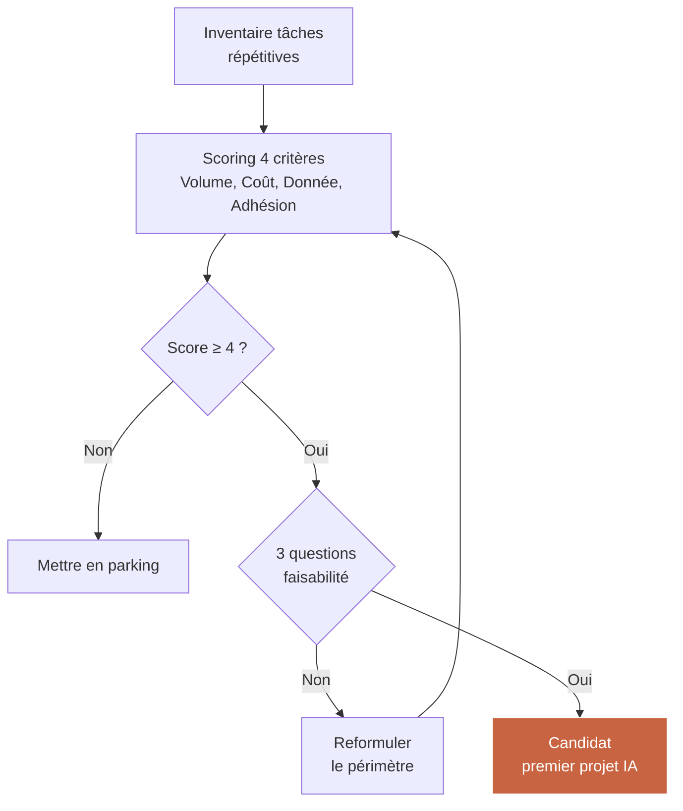

## 1.6 — Synthèse du module

| Point clé | À retenir |
|-----------|-----------|
| Cible PME | L'IA automatise des tâches, pas des métiers |
| Où chercher | Back-office, documentation, pré-tri, support interne |
| Budget typique | 25 K€ à 75 K€ pour un premier projet, 15 K€/an en récurrent |
| Délai typique | 3 à 5 mois jusqu'à déploiement, 9 mois jusqu'au ROI |
| Pièges | Techno avant problème, donnée fantôme, équipe non embarquée |
| Méthode | Inventaire, scoring, filtre de faisabilité |

### Livrable du Module 01

**Grille de sélection cas d'usage PME** : un tableau à imprimer ou dupliquer dans un fichier Excel, permettant à la dirigeante de noter en trente minutes les 5 à 10 tâches candidates de sa propre entreprise, d'en extraire les 2-3 prioritaires, et d'arriver en CODIR avec un premier cas d'usage chiffré et sponsorisé.

---

---

# Module 02 — Prendre la bonne décision d'investissement IA

**Durée : 1h15 · Format : décryptage budgétaire + calculateur ROI + questions-clés à poser**

## Objectifs du module

À la fin de ce module, vous saurez :

1. Lire une **proposition commerciale IA** et repérer en 10 minutes les zones qui méritent débat.
2. Utiliser **les fourchettes budgétaires par type de projet** pour sanity-checker tout devis reçu.
3. Poser **les questions précises** qui désarment un prestataire trop vague ou trop ambitieux.
4. Calculer un **ROI IA** grossier en moins d'une heure avec votre équipe, avant toute signature.

## 2.1 — Les quatre grandes familles de projets IA en PME et leurs fourchettes budgétaires

Un projet IA en PME se range presque toujours dans l'une de ces quatre familles. Chaque famille a sa propre logique budgétaire. Connaître ces fourchettes, c'est arriver en négociation avec un référentiel.

| Famille | Exemples | Budget projet | Récurrent annuel | Délai |
|---------|----------|---------------|------------------|-------|
| A — Assistant IA sur documents existants | Recherche dans base docs, assistant juridique, support interne | 20 K€ – 60 K€ | 6 K€ – 15 K€ | 2-4 mois |
| B — Automatisation d'une tâche administrative | Saisie factures, pré-tri CV, génération devis | 25 K€ – 80 K€ | 8 K€ – 20 K€ | 3-5 mois |
| C — Agent IA orienté client ou partenaire | Chatbot support, agent vocal, recommandation | 40 K€ – 150 K€ | 15 K€ – 40 K€ | 4-8 mois |
| D — Décisionnel et prévision | Prévision stock, scoring commercial, maintenance prédictive | 70 K€ – 250 K€ | 20 K€ – 60 K€ | 6-12 mois |

**Règle de sanity-check.** Si un prestataire vous propose un projet de famille A pour 180 K€, il vous vend un projet de famille D déguisé. Si un prestataire vous propose un projet de famille D pour 30 K€, il vous vend un MVP de démonstration qui ne passera jamais en production.

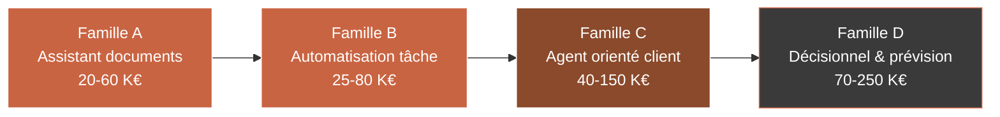

## 2.2 — Décomposition d'un budget IA en PME : où part vraiment l'argent

Un budget de projet IA de 50 K€ ne se répartit pas comme vous l'imaginez. La ventilation typique est la suivante.

| Poste | % du budget | Ce que ça recouvre |
|-------|-------------|--------------------|
| Cadrage et audit données | 10-15 % | Interviews métier, audit qualité données, architecture cible |
| Intégration aux systèmes existants | 25-30 % | Connexion Sage, Cegid, HubSpot, Salesforce, SharePoint |
| Développement du modèle ou configuration de l'outil | 20-25 % | Prompt engineering, fine-tuning, paramétrage no-code |
| Interface utilisateur | 10-15 % | Écran que l'utilisateur final voit |
| Recette et ajustements | 10-15 % | Tests avec utilisateurs réels, corrections |
| Formation et conduite du changement | 5-10 % | Sessions équipe, support, documentation |
| Coût des API/licences pendant le projet | 2-5 % | OpenAI, Anthropic, Mistral, plateforme no-code |

**Lecture exécutive.** Si un devis ne détaille pas ces postes ou si « développement du modèle » représente 70 % du budget, c'est un devis à retravailler. L'intégration et la conduite du changement sont systématiquement sous-estimées par les prestataires techniques purs.

## 2.3 — Les dix-huit questions à poser à tout prestataire IA avant de signer

Voici la check-list à lire en réunion de cadrage. Les réponses déterminent si vous signez ou non. Préférez un prestataire qui hésite honnêtement à un prestataire qui répond à tout avec assurance.

### Questions sur le problème

| N° | Question | Ce que la réponse révèle |
|----|----------|-------------------------|
| 1 | Pouvez-vous reformuler mon problème en une phrase, sans utiliser le mot IA ? | Capacité à sortir du jargon |
| 2 | Quel est le pire scénario si ce projet ne se fait pas ? | Niveau d'honnêteté sur la valeur réelle |
| 3 | Avez-vous déjà résolu exactement ce problème chez un client comparable ? | Expérience vs enthousiasme |

### Questions sur la donnée

| N° | Question | Ce que la réponse révèle |
|----|----------|-------------------------|
| 4 | Quelle donnée spécifique faut-il pour que votre solution fonctionne ? | Rigueur technique |
| 5 | Si cette donnée n'existe pas ou est sale, quel est le plan B ? | Maturité du prestataire |
| 6 | Comment auditerez-vous la qualité de notre donnée avant de démarrer ? | Sérieux méthodologique |

### Questions sur le périmètre et le budget

| N° | Question | Ce que la réponse révèle |
|----|----------|-------------------------|
| 7 | Qu'est-ce qui n'est PAS inclus dans votre proposition ? | Honnêteté du périmètre |
| 8 | Si on sort du périmètre, quel est votre tarif TJM ou forfait ? | Transparence tarifaire |
| 9 | Combien coûte ce projet en exploitation annuelle une fois déployé ? | Vision long terme |
| 10 | Sur combien d'années amortissez-vous le projet dans votre calcul ROI ? | Sérieux de l'argumentation |

### Questions sur l'équipe et la gouvernance

| N° | Question | Ce que la réponse révèle |
|----|----------|-------------------------|
| 11 | Qui de mon équipe doit être mobilisé, combien d'heures par semaine, pendant combien de temps ? | Réalisme opérationnel |
| 12 | Quel est le rôle précis de mon DSI dans ce projet ? | Articulation interne/externe |
| 13 | Comment gérez-vous la conduite du changement auprès des utilisateurs finaux ? | Prise en compte humaine |

### Questions sur les risques et la sortie

| N° | Question | Ce que la réponse révèle |
|----|----------|-------------------------|
| 14 | Quels sont les trois risques principaux que vous identifiez ? | Lucidité professionnelle |
| 15 | Si je décide d'arrêter le projet à mi-parcours, que me reste-t-il ? | Protection de la dirigeante |
| 16 | Mes données sortent-elles du territoire européen ? Où sont-elles hébergées ? | Conformité RGPD |
| 17 | Que se passe-t-il si OpenAI ou Anthropic change ses tarifs de 50 % ? | Dépendance fournisseur |
| 18 | Comment prouverez-vous à mon CODIR dans 9 mois que le projet a fonctionné ? | Orientation résultat |

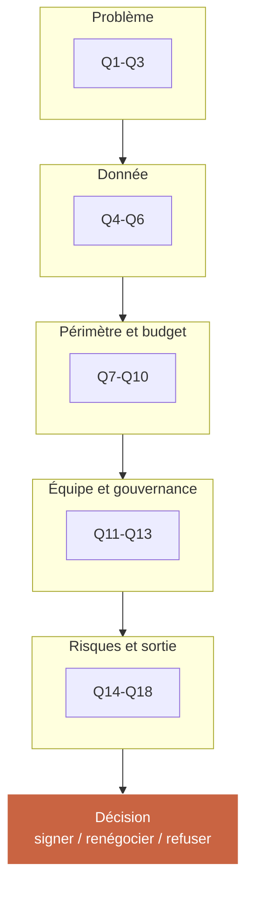

## 2.4 — Calculer un ROI IA en 30 minutes avec son équipe

L'objectif n'est pas de produire un business case de cabinet de conseil à 40 pages. L'objectif est d'arriver en CODIR avec une estimation honnête, grossière mais défendable, tenant sur une page.

### La formule simple

```
Gain net annuel = Gain brut annuel - Coût récurrent annuel
ROI cumulé à N ans = (Gain net × N) - Budget projet initial
Payback = Budget projet / Gain net annuel
```

### La feuille de calcul type

Voici la maquette du fichier Excel à reproduire. Les cellules en gras sont à remplir.

| Poste | Formule | Valeur |
|-------|---------|--------|
| Heures hebdomadaires économisées par collaborateur concerné | **à estimer** | 6 h |
| Nombre de collaborateurs concernés | **à estimer** | 4 |
| Semaines travaillées par an | **constante** | 45 |
| Coût horaire chargé moyen | **à estimer** | 38 € |
| Gain brut annuel en heures | ligne 1 × ligne 2 × ligne 3 | 1 080 h |
| Gain brut annuel en euros | gain brut × coût horaire | 41 040 € |
| Coût récurrent annuel du projet | **devis prestataire** | 15 000 € |
| Gain net annuel | gain brut - coût récurrent | 26 040 € |
| Budget projet initial | **devis prestataire** | 55 000 € |
| Payback en mois | budget × 12 / gain net | 25 mois |
| ROI à 3 ans | (gain net × 3) - budget | 23 120 € |

### Les trois scénarios à toujours calculer

Ne jamais présenter un seul chiffre. Présenter systématiquement trois scénarios pour éclairer la décision.

| Scénario | Hypothèse | Cas du tableau ci-dessus |
|----------|-----------|--------------------------|
| Pessimiste | Gains réels à 50 % de l'estimation | ROI 3 ans : -15 940 € |
| Central | Gains réels à 100 % | ROI 3 ans : 23 120 € |
| Optimiste | Gains réels à 130 % | ROI 3 ans : 46 432 € |

**Règle d'or.** Si le scénario pessimiste est négatif à 3 ans, le projet n'est pas mûr. Reformulez le périmètre ou renégociez le budget. Un projet IA en PME sain doit tenir debout même dans son scénario pessimiste à 3 ans.

### Au-delà du ROI financier : les bénéfices qualitatifs à ne pas ignorer

Certains bénéfices sont difficiles à chiffrer mais peuvent peser dans la décision. À lister explicitement dans la note CODIR.

| Bénéfice qualitatif | Impact indirect |
|---------------------|----------------|
| Réduction de la pénibilité des tâches répétitives | Rétention, marque employeur |
| Capacité à recruter des profils attirés par la modernité | Attractivité RH |
| Signal au marché d'une entreprise qui se modernise | Positionnement client, valorisation |
| Apprentissage collectif sur l'IA (capital humain interne) | Socle pour projets futurs |
| Meilleure traçabilité des processus (effet secondaire positif) | Conformité, audit |

## 2.5 — Les aides et subventions françaises pour projets IA en PME

Beaucoup de dirigeantes l'ignorent : une part significative du budget projet peut être couverte par des dispositifs publics.

| Dispositif | Cible | Couverture typique | À qui s'adresser |
|-----------|-------|--------------------|-----------------|
| BPI France — Diag IA | PME -250 salariés | 50 % jusqu'à 20 K€ HT d'accompagnement | bpifrance.fr |
| CIR — Crédit Impôt Recherche | Entreprises avec R&D | 30 % des dépenses R&D éligibles | Expert-comptable |
| CII — Crédit Impôt Innovation | PME | 20 % des dépenses d'innovation | Expert-comptable |
| FranceNum | TPE et petites PME | Chèques numériques, accompagnement | francenum.gouv.fr |
| Régions — Chèques IA / Transformation numérique | Variable selon région | 30 à 70 % selon dispositif | Conseil régional |
| Pôles de compétitivité | Projets collaboratifs | Co-financement, mise en réseau | Pôle sectoriel concerné |
| Fonds européens (FEDER) | Projets structurants | Co-financement jusqu'à 50 % | Préfecture de région |

**Règle pratique.** Avant toute signature prestataire, consultez votre expert-comptable sur l'éligibilité CIR/CII du projet, et votre chargée d'affaires BPI si vous en avez une. Le delta financier peut atteindre 20 à 40 % du budget.

## 2.6 — L'arbitrage final : signer, renégocier, refuser

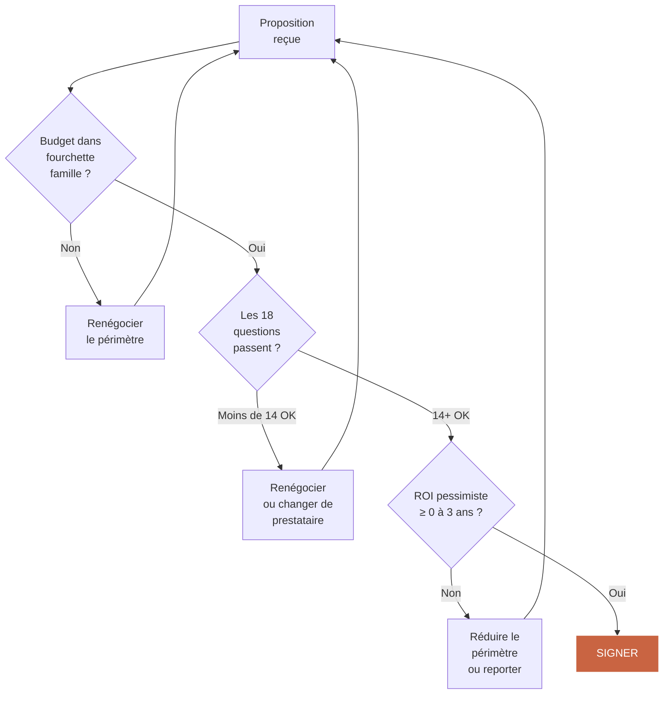

## 2.7 — Synthèse du module

| Point clé | À retenir |
|-----------|-----------|
| Fourchettes | 4 familles A, B, C, D — de 20 K€ à 250 K€ |
| Ventilation | L'intégration et la conduite du changement sont sous-estimées par les prestataires |
| 18 questions | À poser en réunion de cadrage, les hésitations honnêtes valent mieux que les certitudes |
| ROI | Formule simple, 3 scénarios, 1 page |
| Aides | BPI, CIR, CII, FranceNum, régions — peuvent couvrir 20-40 % |
| Décision | Budget OK + 14 questions OK + ROI pessimiste ≥ 0 = signer |

### Livrable du Module 02

**Calculateur ROI IA simplifié (Excel)** : un fichier Excel tenant sur une feuille, avec cellules pré-formatées, trois scénarios automatiques (pessimiste, central, optimiste), synthèse graphique payback, et page de questions prestataire à cocher avant signature.

---

---

# Module 03 — Recruter ou trouver le bon profil IA

**Durée : 1h15 · Format : tableau comparatif CDI/Fractional/Prestataire + guide d'entretien non technique**

## Objectifs du module

À la fin de ce module, vous saurez :

1. Arbitrer entre **recruter un CAIO en CDI, prendre un CAIO fractional ou passer par un cabinet/prestataire**.
2. Rédiger une **fiche de poste CAIO pour PME** sans faire appel à un cabinet RH spécialisé.
3. Évaluer un profil CAIO en entretien **même sans être technique**, grâce à une grille de questions comportementales.
4. Utiliser le **CAIO Registry** pour accéder rapidement à un vivier de profils certifiés.

## 3.1 — Le triangle de décision : CDI, Fractional, Prestataire

Les trois options s'adressent à trois tailles et phases d'entreprise différentes. Il n'existe pas de bonne réponse universelle. Il existe votre bonne réponse, en fonction de six critères.

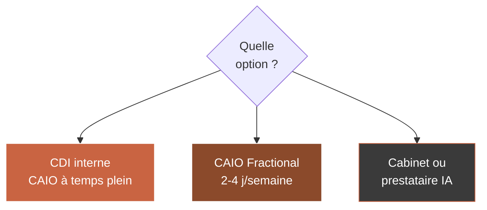

### Tableau comparatif complet

| Critère | CDI interne | CAIO Fractional | Prestataire / cabinet |
|---------|-------------|-----------------|----------------------|
| Profil recommandé pour | ETI et PME matures IA | PME en phase de lancement | Cas d'usage ponctuel et borné |
| Effectif minimum entreprise | 100+ | 30 à 200 | Tout effectif |
| Coût annuel typique | 90 K€ à 180 K€ (package) | 60 K€ à 120 K€ (2-3 j/sem) | Projet 25 K€ à 150 K€ + maintenance |
| Horizon d'engagement | 2-5 ans | 6-24 mois renouvelables | Projet borné |
| Temps de recrutement | 3-6 mois | 3-6 semaines | 2-6 semaines |
| Risque de turn-over | Moyen-élevé sur ce profil | Faible (indépendant, choisi) | Nul sur la durée du contrat |
| Adaptation à votre culture | Forte après 6 mois | Moyenne (dehors/dedans) | Faible |
| Transfert de compétence interne | Élevé dans la durée | Élevé si bien cadré | Faible si pas imposé contractuellement |
| Flexibilité d'arrêt | Faible (licenciement) | Forte (préavis court) | Forte (fin de contrat) |
| Adapté si premier projet IA | Non, trop tôt | Oui, idéal | Oui, possible |
| Adapté si multiples projets IA | Oui | Oui avec montée en charge | Non, coûteux cumulé |
| Adapté pour la gouvernance IA long terme | Oui | Oui si en relais vers CDI | Non |

### Les six questions qui tranchent

Posez-vous ces six questions dans l'ordre. La somme des réponses pointe clairement vers l'une des trois options.

| # | Question | Réponse → Option |
|---|----------|-----------------|
| 1 | Est-ce votre premier projet IA ou en avez-vous déjà déployé ? | Premier → Fractional ou Prestataire |
| 2 | Combien de projets IA voulez-vous lancer dans les 18 mois ? | 1 seul → Prestataire ; 2+ → Fractional ou CDI |
| 3 | Quelle est votre capacité budgétaire annuelle IA (hors projets) ? | <60 K€ → Prestataire ; 60-120 K€ → Fractional ; >120 K€ → CDI |
| 4 | Avez-vous un DSI interne capable de porter l'opérationnel ? | Non → privilégier Fractional ou Prestataire avec accompagnement |
| 5 | Quelle est votre tolérance au risque d'embauche ? | Faible → Fractional |
| 6 | Voulez-vous structurer une gouvernance IA permanente (> 2 ans) ? | Oui → CDI à terme |

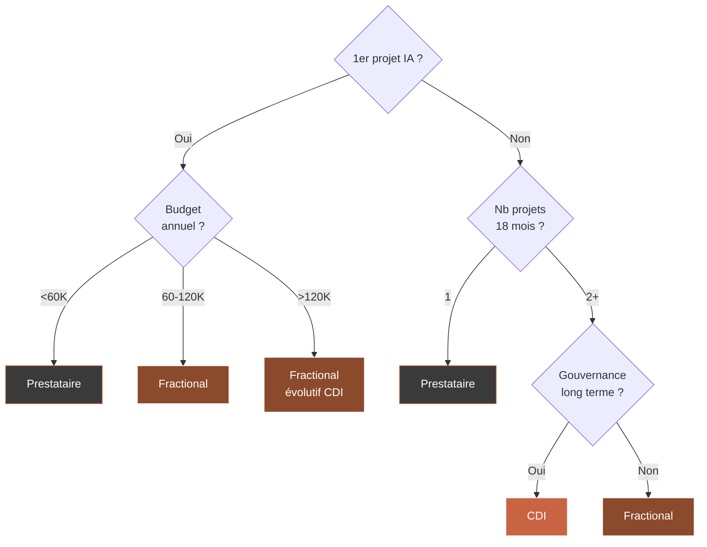

## 3.2 — Fiche de poste CAIO PME : le gabarit qui marche

Les fiches de poste CAIO trouvées sur LinkedIn sont presque toutes inadaptées à une PME. Elles sont soit rédigées pour des grands groupes (gouvernance, conformité, éthique internationale), soit creuses (« transformation IA »). Voici le gabarit court et utilisable directement.

### Gabarit fiche de poste CAIO PME

```
Intitulé : Chief AI Officer (CAIO) — temps plein ou 3 jours/semaine
Rattachement : Direction générale
Localisation : [ville] / hybride 2 j télétravail

Mission
En lien direct avec la Direction générale, vous pilotez la stratégie IA de
l'entreprise : identification des cas d'usage prioritaires, choix des
prestataires, supervision des projets, conduite du changement, gouvernance
des données et reporting au CODIR.

Responsabilités principales
1. Traduire les enjeux business en feuille de route IA trimestrielle.
2. Sélectionner et piloter 2 à 4 projets IA par an, de l'idée au déploiement.
3. Construire une culture IA au sein des équipes (ateliers, formations, AI champions).
4. Garantir la conformité RGPD et la sécurité des données.
5. Reporter mensuellement au CODIR sur indicateurs définis.

Profil recherché
- 7+ ans d'expérience mixte tech + business.
- Au moins 2 projets IA déployés en production, dont 1 en PME.
- Capacité à dialoguer avec DSI, DAF, DRH, directions métier.
- Pédagogie, écoute terrain, sens du résultat.
- Maîtrise des notions techniques (LLM, agents, intégration) sans être développeur.

Package
Selon profil, [X] à [Y] K€ brut annuel + bonus sur KPIs IA.
Temps partiel possible (3 j/semaine) pour profils expérimentés.

Ce que nous offrons
- Mandat clair de la DG, CODIR engagé.
- Budget IA 2025 : [X] K€.
- Cas d'usage déjà identifié pour démarrage rapide.
```

### Les signaux d'un mauvais profil CAIO

Même sans être technique, vous pouvez détecter les signaux rouges suivants.

| Signal rouge | Ce que ça révèle |
|--------------|------------------|
| Parle de « l'IA » comme d'une entité mystique | Manque de maîtrise |
| Incapable de citer un projet IA en production qu'il a livré | Théoricien |
| N'a jamais travaillé en PME (seulement grand groupe ou startup) | Inadaptation culturelle |
| Utilise trop d'anglicismes et jargon | Posture au lieu de substance |
| Ne pose aucune question sur votre business | Centré sur lui |
| Tarif ou salaire hors fourchette | Décalage marché |
| Aucun portfolio public, aucune référence vérifiable | Risque de mythomanie |

## 3.3 — La grille d'entretien CAIO pour dirigeante non technique

Voici dix-huit questions, organisées en quatre blocs, qui vous permettent d'évaluer un profil CAIO sans avoir besoin de comprendre la technique.

### Bloc 1 — Compréhension business (5 questions)

| Question | Bonne réponse type |
|----------|-------------------|
| Que feriez-vous les 30 premiers jours chez nous ? | Écouter, auditer, ne rien lancer avant 3-4 semaines |
| Quel est selon vous le plus grand risque pour une PME qui lance un projet IA ? | Choisir la techno avant le problème / ignorer la conduite du changement |
| Comment mesurez-vous le succès d'un projet IA ? | KPIs métier (€, heures, taux) — pas KPIs techniques |
| Avez-vous déjà arrêté un projet IA en cours ? Racontez. | Oui, avec raison lucide — un bon CAIO sait arrêter |
| Comment parlez-vous d'IA à un collaborateur de 55 ans qui a peur ? | Écoute, reformulation, démo concrète, pas jargon |

### Bloc 2 — Compréhension technique (à portée d'une dirigeante) (5 questions)

| Question | Bonne réponse type |
|----------|-------------------|
| En une phrase, que fait un LLM comme ChatGPT ? | Prédit le mot suivant à partir d'un contexte |
| Pourquoi une IA « hallucine » parfois ? | Parce qu'elle génère sans vérifier les faits par défaut |
| Faut-il toujours utiliser OpenAI ou existe-t-il des alternatives ? | Il existe Anthropic, Mistral (FR), Llama, etc. Le choix dépend du cas. |
| Que veut dire RGPD dans un projet IA ? | Minimisation, consentement, hébergement UE, droit à l'oubli |
| Le no-code IA suffit-il pour une PME ? | Pour 60 % des cas d'usage oui, le reste nécessite du sur-mesure |

### Bloc 3 — Gouvernance et relationnel (4 questions)

| Question | Bonne réponse type |
|----------|-------------------|
| Comment collaborez-vous avec un DSI qui voit l'IA d'un mauvais œil ? | Alliance, co-construction, respect du rôle DSI |
| Quelles instances de gouvernance IA recommandez-vous à une PME de notre taille ? | Comité IA mensuel light, 1 sponsor par projet, pas de comitologie lourde |
| Que faites-vous si un CODIR refuse votre recommandation ? | Documenter la décision, rester professionnelle, revenir avec données |
| Comment gérez-vous les attentes irréalistes d'une direction générale ? | Cadrage dès J1, exemples concrets, chiffres précis |

### Bloc 4 — Pragmatisme et terrain (4 questions)

| Question | Bonne réponse type |
|----------|-------------------|
| Racontez un projet IA qui a échoué chez vous. | Honnêteté, cause identifiée, leçon tirée |
| Combien de jours par semaine pensez-vous être suffisant pour notre taille ? | 2-3 jours — un CAIO qui dit 5 j/sem sur PME doit se justifier |
| Que pensez-vous de la formation IA de nos équipes ? | Sujet central, pas accessoire, budget alloué |
| Avez-vous des références de dirigeantes de PME que je peux appeler ? | Oui, avec contact direct |

## 3.4 — Le CAIO Registry : accéder à un vivier pré-qualifié

Le CAIO Registry (agentik-os.com/registry) est une base de profils CAIO certifiés, disponibles en mission ou en recrutement, référencés selon leur expertise sectorielle, leur zone géographique, et leurs cas d'usage déjà déployés.

### Comment l'utiliser efficacement

| Étape | Action | Gain |
|-------|--------|------|
| 1 | Remplir le brief de votre besoin (secteur, taille, cas d'usage, format CDI/Fractional) | 15 min |
| 2 | Recevoir sous 72 h une liste de 3 à 5 profils shortlistés | Gain de 2-3 mois vs sourcing classique |
| 3 | Organiser 3 entretiens courts (1h) avec votre grille du module 3.3 | Gain en rigueur |
| 4 | Demander les références clients (2 appels de 20 min minimum) | Sécurité décision |
| 5 | Négocier contrat Fractional ou proposition CDI | Gain de temps juridique (gabarits disponibles) |

### Ce que le Registry garantit (et ne garantit pas)

| Garanti | Non garanti |
|---------|-------------|
| Profils ayant au moins un projet IA déployé en production | Réussite future de votre projet |
| Références vérifiées par appel client | Alchimie humaine avec votre CODIR |
| Expertise validée sur cas d'usage déclarés | Disponibilité immédiate (peut varier) |
| Contrat-cadre Fractional disponible | Prix plancher (négocié en direct) |

## 3.5 — Les erreurs de recrutement CAIO les plus fréquentes en PME

| Erreur | Conséquence typique |
|--------|--------------------|
| Recruter un profil « 100 % tech » qui ne parle pas business | CODIR le rejette au bout de 4 mois |
| Recruter trop haut (ex-Dir IA grand groupe) sur une PME | Décalage de posture, démission mutuelle |
| Donner un mandat flou (« faire avancer l'IA ») | Aucun livrable mesurable, échec politique |
| Mettre le CAIO sous le DSI | Confusion des rôles, tensions |
| Ne pas lui donner de budget | Rôle purement consultatif, démotivation |
| Ne pas définir de KPIs | Impossible d'arbitrer au bout d'un an |

## 3.6 — Synthèse du module

| Point clé | À retenir |
|-----------|-----------|
| Triangle de décision | CDI / Fractional / Prestataire — 6 questions tranchent |
| Taille d'entreprise | <100 → privilégier Fractional ou Prestataire |
| Fiche de poste | Gabarit court, mandat clair, budget explicite |
| Entretien | 18 questions en 4 blocs, pas besoin d'être technique |
| CAIO Registry | 72 h pour une shortlist pré-qualifiée |
| Erreurs | Mandat flou, profil trop haut, pas de budget, pas de KPIs |

### Livrable du Module 03

**Guide de recrutement CAIO pour dirigeants** : un PDF de 12 pages contenant la fiche de poste gabarit PME, la grille d'entretien complète (18 questions + bonnes réponses types), le tableau comparatif CDI/Fractional/Prestataire, et l'accès au CAIO Registry.

---

---

# Module 04 — Embarquer ses équipes dans la transformation IA

**Durée : 1h15 · Format : profils de résistance + discours de lancement + AI champions**

## Objectifs du module

À la fin de ce module, vous saurez :

1. Identifier **les quatre profils de résistance** typiques à l'IA dans une PME française.
2. Prononcer **un discours de lancement** qui rassure sans mentir et embarque sans forcer.
3. Repérer et activer **des AI champions internes** sans budget formation dédié.
4. Gérer **les situations conflictuelles** prévisibles lors des six premiers mois.

## 4.1 — Pourquoi l'humain est le vrai sujet, pas la technologie

Sur cent projets IA qui échouent en PME, quatre-vingt-douze échouent pour des raisons humaines, pas techniques. Les statistiques des cabinets spécialisés convergent : la cause principale d'échec n'est presque jamais l'IA elle-même. C'est le rejet silencieux, la résistance passive, la démotivation, la peur pour son poste, l'impression d'être déconsidéré, ou simplement le sentiment de ne pas avoir été entendu.

En tant que dirigeante, vous avez trois leviers humains à activer dès le jour un : **la clarté du discours**, **la reconnaissance des inquiétudes**, **l'implication dans les choix**.

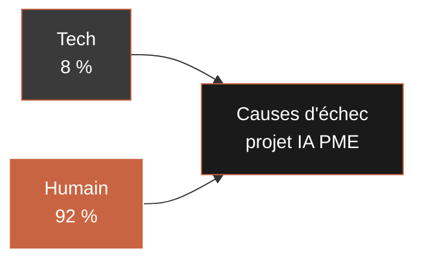

## 4.2 — Les quatre profils de résistance à l'IA en entreprise

Chaque profil appelle une réponse spécifique. Les généralités ne marchent pas.

### Profil 1 — Le craintif « je vais perdre mon poste »

**Description.** Collaborateur installé, souvent 45+, expertise sur une tâche que l'IA pourrait automatiser. Peur légitime d'être remplacé. Exprime ses doutes à voix basse, pas en réunion.

**Taux de présence dans une PME typique.** 30-40 % des collaborateurs impactés.

**Ce qu'il faut dire.** « Notre engagement est clair : nous n'utilisons pas l'IA pour remplacer des postes, mais pour vous libérer du temps sur les tâches les plus répétitives. Vous continuerez votre métier. L'IA prépare, vous décidez. »

**Ce qu'il ne faut surtout pas dire.** « Ne vous inquiétez pas, l'IA ne prendra jamais votre place. » C'est une promesse que vous ne pouvez pas tenir avec certitude et qui abîme votre crédibilité si les choses bougent dans 3 ans.

**Ce qu'il faut faire.** L'inclure en comité utilisateur. Lui donner un rôle officiel. Lui réserver une formation avant le lancement.

### Profil 2 — Le technophobe « ça ne marchera jamais »

**Description.** A vu passer trois vagues de transformation digitale en 15 ans, dont deux ont échoué. Cynique par expérience. Pas borné : lucide.

**Taux de présence dans une PME typique.** 15-25 %.

**Ce qu'il faut dire.** « Vous avez raison d'être prudent. Beaucoup de projets échouent. C'est pourquoi on commence petit, on mesure, on décide ensuite. »

**Ce qu'il faut faire.** L'impliquer dans le comité de pilotage. Son scepticisme lucide vaut de l'or. Il repèrera les dérapages avant tout le monde.

### Profil 3 — L'enthousiaste naïf « l'IA va tout régler »

**Description.** Souvent jeune, a vu des démos ChatGPT, pense que l'IA résout tout en cinq minutes. Danger : crée des attentes irréalistes, décrédibilise le projet si ces attentes ne sont pas tenues.

**Taux de présence dans une PME typique.** 10-20 %.

**Ce qu'il faut dire.** « L'IA est un outil puissant, mais qui demande de la précision et du cadrage. On va avancer méthodiquement. »

**Ce qu'il faut faire.** Le cadrer. Lui confier un rôle d'AI champion avec des indicateurs de succès mesurables, pour transformer son énergie en résultat.

### Profil 4 — L'indifférent « tant que ça ne change pas mon quotidien »

**Description.** Ni pour, ni contre. Fera ce qu'on lui demande. Majorité silencieuse.

**Taux de présence dans une PME typique.** 30-45 %.

**Ce qu'il faut dire.** « Voici ce qui va changer concrètement pour vous, et voici le calendrier. »

**Ce qu'il faut faire.** Communication claire, régulière, factuelle. Pas de sur-investissement émotionnel. L'indifférent bascule en adopteur dès que l'outil marche, ou en résistant passif si le déploiement cafouille.

### Matrice des profils et des réponses

| Profil | Fréquence | Levier principal | Erreur à éviter |
|--------|-----------|-----------------|----------------|
| Craintif | 30-40 % | Engagement non-remplacement + inclusion comité | Promesse creuse |
| Technophobe | 15-25 % | Reconnaissance de la lucidité + comité pilotage | Minimiser son expérience |
| Enthousiaste naïf | 10-20 % | Cadrage + rôle champion avec KPIs | Laisser faire |
| Indifférent | 30-45 % | Communication factuelle régulière | Sur-investissement émotionnel |

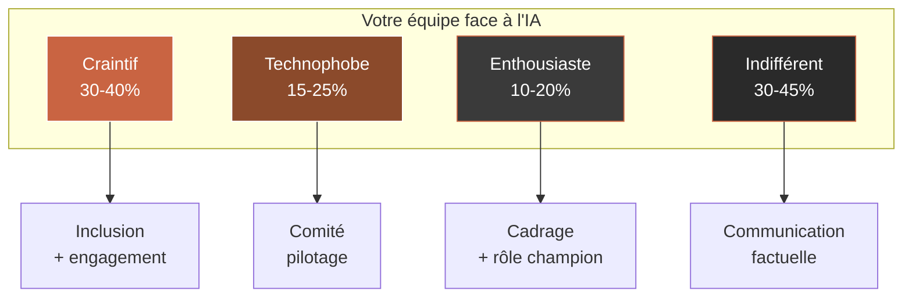

## 4.3 — Le discours de lancement IA en interne

Voici le discours prêt à adapter à votre contexte, d'une durée de 12 à 15 minutes, à prononcer en plénière ou en CODIR élargi.

### Gabarit de discours (à personnaliser)

```
[Ouverture — 2 minutes]
Bonjour à toutes et à tous. Je voulais vous parler aujourd'hui d'un sujet
qui nous concerne toutes et tous : l'intelligence artificielle dans
notre entreprise.

[Reconnaissance honnête — 3 minutes]
D'abord, je veux reconnaître quelque chose. L'IA, c'est un sujet qui
inquiète. C'est normal. Il y a des articles chaque semaine qui annoncent
des suppressions de postes, des métiers qui disparaissent. Je ne vais
pas faire semblant que ces questions ne se posent pas.

Je veux être claire avec vous : notre entreprise n'est pas dans une
logique de réduction d'effectifs par l'IA. Notre projet, c'est de
libérer du temps sur les tâches les plus répétitives pour que vous
puissiez vous concentrer sur ce qui fait vraiment la valeur de votre
métier.

[Notre cadre — 3 minutes]
Concrètement, nous allons lancer un premier projet IA limité, sur
[décrire brièvement le premier cas d'usage]. Pourquoi celui-là ?
Parce que c'est [justifier : volume, friction, demande terrain].

Ce projet durera environ [X] mois. Il coûte [Y] euros, ce qui n'est
pas anodin, et c'est pourquoi nous allons le piloter de près.

[Votre rôle — 3 minutes]
Ce qui compte pour moi, c'est comment nous allons le faire ensemble.

Première chose : nous allons constituer un comité utilisateurs, avec
des représentants des équipes concernées. Si vous êtes intéressé·e,
signalez-vous.

Deuxième chose : nous allons nommer deux ou trois « AI champions » :
des collègues qui deviendront les personnes de référence. Pas
forcément les plus techniques. Plutôt les plus pédagogues.

Troisième chose : nous aurons un point d'étape mensuel, ouvert,
transparent. Les bons signaux, les mauvais signaux, les décisions
prises. Rien ne sera caché.

[Mes engagements — 2 minutes]
Je prends trois engagements devant vous aujourd'hui.

Un : nous n'utiliserons pas l'IA pour supprimer des postes. Si une
personne voit sa tâche réduite, nous lui proposerons une montée en
compétence ou une évolution.

Deux : les décisions qui vous concernent resteront prises par des
humains. L'IA peut préparer, suggérer, classer. Elle ne décide pas.

Trois : si à mi-parcours nous voyons que ce projet ne sert pas nos
équipes, nous l'arrêterons. Ce n'est pas une fuite en avant.

[Conclusion — 1 minute]
L'IA n'est pas une révolution qu'on subit. C'est un outil qu'on
s'approprie, ensemble, à notre rythme. Je compte sur votre regard
critique, vos questions, vos retours. Merci.
```

### Les sept phrases à ne jamais prononcer

| Phrase à bannir | Pourquoi |
|----------------|----------|
| « L'IA va tout changer. » | Angoisse + généralité creuse |
| « Nous sommes en retard, il faut accélérer. » | Panique transmise aux équipes |
| « Il n'y aura aucun impact sur les postes. » | Engagement qu'on ne peut pas garantir à 5 ans |
| « Ne vous inquiétez pas. » | Paternaliste, invalide l'inquiétude |
| « C'est le futur, on n'a pas le choix. » | Déresponsabilisation |
| « Les réticents seront laissés de côté. » | Menace → durcissement |
| « On verra bien. » | Absence de cadre → panique |

## 4.4 — Créer des AI champions sans budget formation dédié

Les AI champions sont des collaborateurs volontaires, identifiés comme relais internes, qui deviennent les premiers utilisateurs expérimentés de l'IA dans leur équipe. Ils ne sont pas des experts techniques. Ils sont des pédagogues naturels.

### Profil idéal d'un AI champion

| Critère | Pourquoi |
|---------|----------|
| Curiosité naturelle | Ils apprendront vite |
| Crédibilité dans leur équipe | Leurs collègues écouteront |
| Pédagogie | Ils sauront expliquer sans condescendance |
| Disponibilité mentale | Pas en surcharge |
| Pas forcément jeune | L'âge ne prédit ni l'appétence ni la pédagogie |

### Plan d'activation en 30 jours sans budget dédié

| Semaine | Action | Temps requis |
|---------|--------|-------------|
| 1 | Identifier 3-5 candidats, les inviter à un café de 20 minutes | 2 h dirigeante |
| 2 | Les faire tester en interne l'outil IA sur des cas réels | 3 h par champion |
| 3 | Organiser un atelier de partage entre champions (retours, questions, astuces) | 2 h collectif |
| 4 | Leur donner un rôle officiel et visible (mention dans le journal interne, statut LinkedIn si souhaité) | 1 h dirigeante |

### Reconnaissance sans coût

L'erreur classique : penser qu'il faut absolument primer financièrement les AI champions. Faux. Les trois reconnaissances non financières suivantes marchent mieux.

| Reconnaissance | Impact perçu |
|----------------|--------------|
| Mention publique par la DG en réunion plénière | Très fort |
| Responsabilité formelle (« référent IA pour l'équipe X ») | Fort |
| Accès privilégié à la DG sur ces sujets | Fort |
| Participation au comité de pilotage | Fort |
| Mention dans la communication externe si accord | Fort (motivation, CV) |

## 4.5 — Les six situations conflictuelles prévisibles et comment les gérer

| Situation | Signal | Réponse dirigeante |
|-----------|--------|--------------------|
| Un manager bloque silencieusement l'adoption dans son équipe | Adoption <20 % après 3 mois | Entretien individuel, écouter, re-cadrer les attentes |
| Un collaborateur expert menace de démissionner | Conversation informelle remontée | Entretien DG/RH, rassurer, redéfinir son rôle |
| Un syndicat ou des IRP demandent des informations détaillées | Demande écrite | Répondre en transparence, préparer dossier complet |
| Un client externe s'inquiète de l'usage de l'IA sur ses données | Email ou appel | Fournir clause RGPD, hébergement, traçabilité |
| L'équipe technique interne se sent dépossédée au profit du prestataire | Tensions en comité | Co-responsabilité officielle, formation interne |
| Un AI champion s'épuise et devient négatif | Baisse d'engagement | Reconnaître la charge, rééquilibrer, pas forcer |

## 4.6 — Le calendrier de conduite du changement sur 90 jours

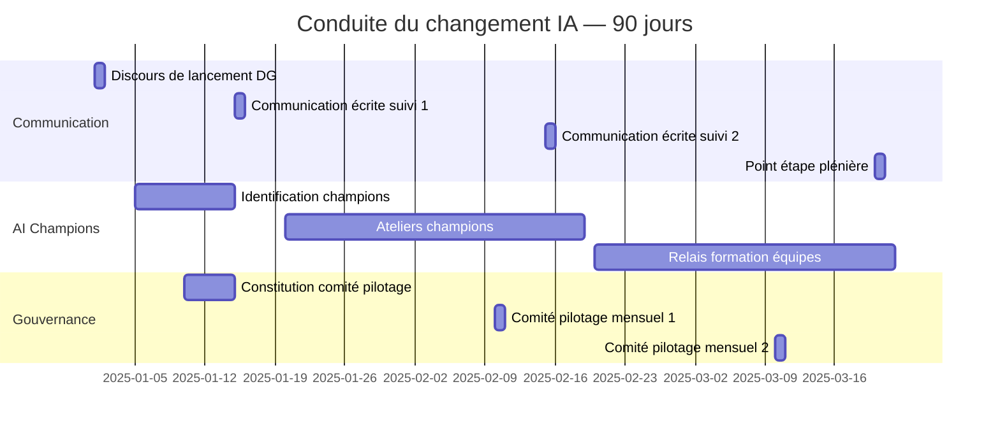

## 4.7 — Synthèse du module

| Point clé | À retenir |
|-----------|-----------|
| Cause d'échec | 92 % humaine, 8 % technique |
| 4 profils | Craintif, Technophobe, Enthousiaste, Indifférent |
| Discours | Reconnaissance + cadre + engagements — pas de promesse creuse |
| Champions | Pédagogues, pas experts, reconnaissance non financière |
| Conflits | Les 6 situations sont prévisibles, donc préparables |
| Calendrier | 90 jours structurés, jalons CODIR |

### Livrable du Module 04

**Template de discours de lancement IA interne** : un document Word / Pages adaptable de 4 pages, avec gabarit de discours, liste des sept phrases à bannir, check-list pré-discours, et plan de communication écrite à 30, 60, 90 jours.

---

---

# Module 05 — Suivre et ajuster : le pilotage exécutif de l'IA

**Durée : 1h00 · Format : réunion type + KPIs exécutifs + décisions stop/pivot/scale**

## Objectifs du module

À la fin de ce module, vous saurez :

1. Tenir un **comité IA mensuel d'une heure** avec un format qui évite la technique.
2. Suivre les **cinq KPIs exécutifs** qui disent la vérité sur un projet IA.
3. Trancher **stop, pivoter ou accélérer** sans émotion, sur la base de données.
4. Bâtir un **reporting trimestriel** lisible par votre CODIR, votre banque ou vos actionnaires.

## 5.1 — Pourquoi un comité mensuel d'une heure suffit (et pourquoi plus serait contre-productif)

Beaucoup de dirigeantes croient que pour piloter un projet IA, il faut multiplier les réunions, les points, les comités. C'est faux. En PME, le sur-pilotage tue plus de projets IA que le sous-pilotage. Le rythme qui marche, c'est un comité mensuel d'une heure, court, structuré, avec les mêmes participants, le même format, les mêmes livrables.

Ce rythme garantit trois choses. **Premièrement**, la dirigeante ne devient pas le goulet d'étranglement des décisions quotidiennes (qui restent au CAIO ou au prestataire). **Deuxièmement**, le projet reste visible au CODIR sans saturer l'agenda. **Troisièmement**, les écarts sont détectés tôt (30 jours maximum) sans micro-management.

## 5.2 — Le comité IA mensuel : format exécutif d'une heure

### Participants

| Rôle | Présence | Fonction dans le comité |
|------|----------|-------------------------|
| Dirigeante (DG) | Toujours | Arbitrage final |
| CAIO (ou prestataire) | Toujours | Rapport, alertes |
| DSI ou équivalent | Toujours | Vigilance technique et sécurité |
| Sponsor métier du projet | Toujours | Voix terrain |
| DAF | Mensuel | Vue budgétaire |
| DRH | Trimestriel | Vue humaine |
| AI Champion représentant | Trimestriel | Voix utilisateur |

### Ordre du jour standard (60 minutes)

| Durée | Séquence | Objectif |
|-------|----------|----------|
| 5 min | Revue des décisions du mois précédent | Traçabilité |
| 15 min | Rapport du CAIO — 5 KPIs + jalons | État réel |
| 10 min | Point utilisateurs terrain — adoption, retours | Voix métier |
| 10 min | Point financier — brûlé, reste à faire | Contrôle budget |
| 10 min | Points rouges — alertes, risques, demandes d'arbitrage | Décision |
| 10 min | Décisions et attributions mois suivant | Engagement |

### Règles du comité qui fonctionnent

| Règle | Effet |
|-------|-------|
| Pas de slide technique — uniquement chiffres métier | Focus exécutif |
| Le CAIO envoie un pré-brief de 1 page 48 h avant | Gain de temps |
| Toute décision est tracée dans un compte-rendu de 1 page | Mémoire d'entreprise |
| Pas de visiteur ad hoc — mêmes participants | Continuité |
| Heure de fin stricte | Discipline |

## 5.3 — Les cinq KPIs exécutifs d'un projet IA en PME

Oubliez les dix-sept KPIs techniques. Pour une dirigeante, cinq indicateurs suffisent à dire la vérité sur un projet IA.

### Dashboard cible

| KPI | Définition | Fréquence | Seuil d'alerte |
|-----|-----------|-----------|----------------|
| Adoption | % d'utilisateurs cibles qui utilisent l'outil au moins 1×/semaine | Mensuelle | <50 % après M3 |
| Impact métier | Indicateur métier (€, heures, volume) lié au cas d'usage | Mensuelle | <60 % de la cible |
| Satisfaction utilisateurs | Score 1-10 sur enquête courte trimestrielle | Trimestrielle | <6/10 |
| Budget consommé vs planifié | Dépense réelle / dépense planifiée à date | Mensuelle | >110 % à mi-parcours |
| Incidents et dérives | Nombre d'incidents critiques depuis le dernier comité | Mensuelle | >2 critiques/mois |

### Maquette du dashboard mensuel (une page A4)

```
+----------------------------------------------------------+
|  DASHBOARD IA — Projet [Nom]       Mois : [Mois / Année] |
+----------------------------------------------------------+
|                                                          |
|  ADOPTION       : 68 %   (cible M6 : 75 %)   [OK]        |
|  IMPACT METIER  : 41 h/sem economisees (cible 50) [ALERT]|
|  SATISFACTION   : 7,4/10 (derniere enquete Q1)   [OK]    |
|  BUDGET         : 62 % consomme / 58 % planifie  [ALERT] |
|  INCIDENTS      : 1 critique ce mois             [OK]    |
|                                                          |
|  ALERTES DU MOIS                                         |
|  - Equipe commerciale : adoption faible (42 %), cause :  |
|    formation incomplete, plan rattrapage J+15.           |
|                                                          |
|  DECISIONS PROPOSEES CE MOIS                             |
|  1. Valider budget complementaire formation : 6 000 EUR  |
|  2. Reporter deploiement module 3 de 1 mois              |
|                                                          |
|  PROCHAIN COMITE : [Date]                                |
+----------------------------------------------------------+
```

## 5.4 — Les cinq questions à poser chaque mois à son équipe IA

Indépendamment du dashboard, ces cinq questions ouvrent la discussion de fond en 10 minutes.

| Question | Ce qu'elle révèle |
|----------|-------------------|
| Qu'est-ce qui marche mieux qu'attendu ce mois-ci ? | Opportunités de scale |
| Qu'est-ce qui marche moins bien qu'attendu ? | Signaux faibles |
| Que feriez-vous différemment si le projet redémarrait aujourd'hui ? | Apprentissage organisationnel |
| Quelle décision avez-vous prise sans me consulter que je dois connaître ? | Alignement gouvernance |
| Si je devais arrêter ce projet la semaine prochaine, qu'aurait-on vraiment perdu ? | Valeur réelle créée |

La cinquième question est la plus puissante. Elle pousse le CAIO ou le prestataire à articuler la valeur réelle, pas la valeur promise.

## 5.5 — Arrêter, pivoter, accélérer : la matrice de décision

À chaque comité trimestriel, vous devez trancher l'une de ces trois options. Rester dans l'ambiguïté tue les projets IA.

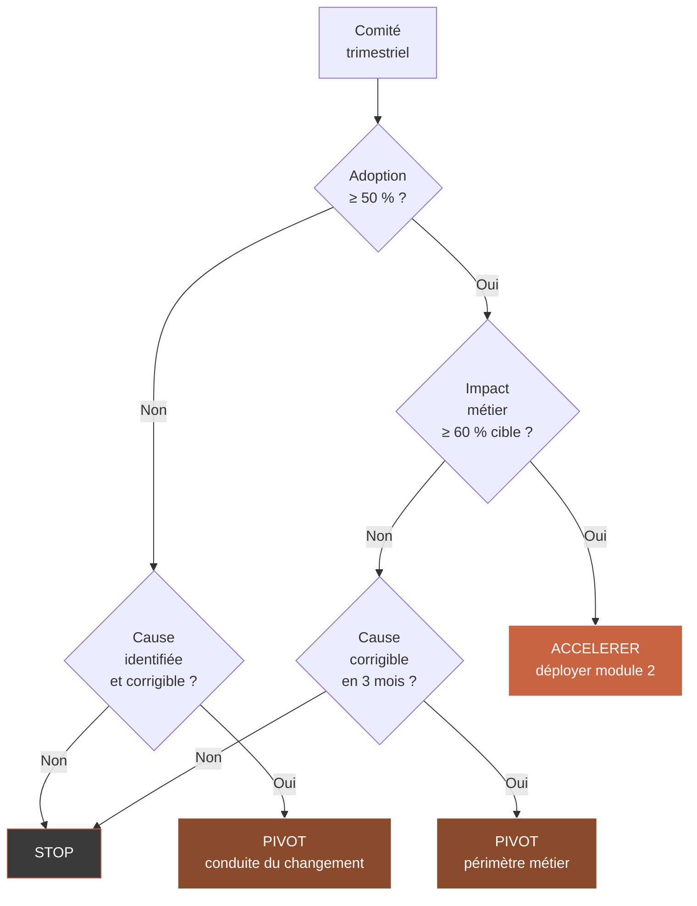

### Quand arrêter

| Signal | Gravité |
|--------|---------|
| Adoption <30 % après 6 mois, cause profonde (rejet métier) | Arrêt immédiat |
| Budget explosé (>150 % planifié) sans perspective de résultat | Arrêt |
| Technologie fournisseur abandonnée ou reprise par concurrent hostile | Arrêt + plan B |
| Incidents critiques à répétition (>3 en 3 mois) | Arrêt |

**Comment arrêter sans perdre la face.** L'arrêt d'un projet IA n'est pas un échec — c'est une décision exécutive. Formulation CODIR : « Nous avons appris [X], [Y], [Z]. Les conditions de succès ne sont pas réunies. Nous arrêtons ce projet et réinvestissons le budget restant sur [nouveau cas d'usage] qui capitalise sur notre apprentissage. »

### Quand pivoter

| Signal | Action |
|--------|--------|
| Adoption ok, impact faible | Pivoter le périmètre (autre tâche dans même équipe) |
| Impact ok, adoption faible | Pivoter la conduite du changement (formation, champions) |
| Tech instable mais cas d'usage validé | Pivoter de prestataire ou de plateforme |

### Quand accélérer

| Signal | Action |
|--------|--------|
| Adoption + impact tous deux au-dessus de la cible | Déployer sur équipe suivante |
| Équipes terrain demandent à étendre à d'autres tâches | Lancer scoping du cas d'usage 2 |
| ROI confirmé avant l'échéance prévue | Présenter en CODIR un plan de scale à 12 mois |

## 5.6 — Le reporting trimestriel : une page pour votre CODIR, banque, actionnaires

Un reporting trimestriel IA lisible par des non-experts doit tenir sur une page et répondre à quatre questions.

### Gabarit reporting trimestriel

```
REPORTING TRIMESTRIEL IA — [Trimestre / Année]

1. OU EN SOMMES-NOUS ?
   Projet [Nom] — phase [cadrage / developpement / deploiement / scale]
   Adoption : [X] %     Impact metier : [Y]     Budget consomme : [Z] %

2. QU'AVONS-NOUS APPRIS CE TRIMESTRE ?
   - 3 apprentissages cles en 3 lignes maximum chacun.

3. QUELLES DECISIONS AVONS-NOUS PRISES ?
   - 3 decisions avec consequences budgetaires ou humaines.

4. QUELLE TRAJECTOIRE POUR LE PROCHAIN TRIMESTRE ?
   - Jalons T+1
   - Risques identifies
   - Budget T+1
```

## 5.7 — Le pilotage annuel : le bilan et la revue de stratégie IA

Une fois par an, consacrez une demi-journée avec votre CODIR à réviser votre stratégie IA. L'ordre du jour type.

| Séquence | Durée | Objectif |
|----------|-------|----------|
| Bilan année écoulée (projets, ROI, apprentissages) | 45 min | Vérité |
| Benchmark externe (vos concurrents et votre secteur) | 30 min | Repositionnement |
| Identification de 2-3 nouveaux cas d'usage | 1 h | Pipeline |
| Décisions budgétaires année suivante | 45 min | Engagement |
| Revue du profil CAIO (CDI / Fractional / Prestataire) | 30 min | Gouvernance |

## 5.8 — Synthèse du module

| Point clé | À retenir |
|-----------|-----------|
| Rythme | Mensuel 1 h, trimestriel arbitrage, annuel bilan |
| Dashboard | 5 KPIs sur 1 page A4 — adoption, impact, satisfaction, budget, incidents |
| 5 questions | La question « qu'aurait-on vraiment perdu » est la plus puissante |
| Décision | Stop / Pivot / Scale — jamais dans l'ambiguïté |
| Reporting | 1 page, 4 questions, adapté CODIR/banque/actionnaires |

### Livrable du Module 05

**Agenda type réunion pilotage IA mensuelle** : un document PDF comprenant l'ordre du jour du comité mensuel, le dashboard type 5 KPIs sur une page A4, les 5 questions mensuelles, la matrice de décision stop/pivot/scale, et le gabarit de reporting trimestriel.

---

---

# Conclusion — Vous êtes prête

Six heures de travail. Cinq modules. Cinq livrables exécutifs. Trente jours pour voir les premiers effets.

À partir de maintenant, vous avez ce que la majorité des dirigeantes de PME françaises n'ont pas encore : **un cadre pour décider**. Vous savez reconnaître un bon cas d'usage, lire un devis IA sans vous faire piéger, recruter ou missionner un profil CAIO adéquat, embarquer vos équipes sans créer de friction, et piloter vos projets en une heure par mois.

Vous n'êtes pas devenue technique. Vous n'en aviez pas besoin. Vous êtes devenue la dirigeante qui **prend des décisions IA plus vite, plus justes, avec moins de pertes** que vos concurrents. C'est un avantage compétitif considérable, et il est discret : vous gagnez pendant que les autres hésitent.

## Ce que vous devriez faire dans les 72 heures suivant ce parcours

| Délai | Action | Durée |
|-------|--------|-------|
| J+1 | Remplir la grille de sélection de cas d'usage du Module 01 | 30 min |
| J+2 | Identifier un sponsor interne pour le cas d'usage prioritaire | 1 h |
| J+3 | Pré-calculer un ROI grossier avec le calculateur du Module 02 | 45 min |
| J+7 | Décider : CDI / Fractional / Prestataire (grille Module 03) | 1 h |
| J+14 | Consulter le CAIO Registry pour shortlister 3-5 profils | 15 min |
| J+30 | Tenir votre premier comité IA mensuel au format Module 05 | 1 h |

## La passerelle spéciale vers le B2B

Vous avez lu ce parcours. Vous savez maintenant ce qu'il faut faire. Mais peut-être vous dites-vous : « Je n'ai ni le temps de porter ça moi-même ni l'envie d'embaucher un CAIO en CDI tout de suite. »

C'est normal. C'est même la situation de la majorité des PMEs françaises. Vous n'êtes pas obligée de tout faire vous-même. Le CAIO Registry existe pour ça.

### Trouver un CAIO pour ma PME

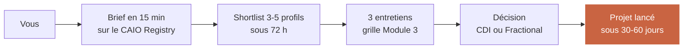

Le ticket moyen d'une mission CAIO Fractional via le CAIO Registry est de 15 000 à 30 000 euros sur 3 à 6 mois, incluant le cadrage complet du cas d'usage prioritaire, la sélection et le pilotage du prestataire technique, la conduite du changement, et le transfert de compétence à votre équipe interne. C'est le raccourci le plus rapide entre « je sais ce qu'il faut faire » et « c'est en train de tourner chez moi ».

**Rendez-vous sur agentik-os.com/registry** pour briefer votre besoin en moins de quinze minutes.

---

---

# Annexes

## Annexe A — Glossaire pour dirigeantes non techniques

| Terme | Définition simple |
|-------|-------------------|
| IA générative | Type d'IA qui produit du texte, de l'image ou du son, comme ChatGPT. |
| LLM | « Large Language Model » — moteur qui comprend et produit du texte (GPT, Claude, Mistral). |
| Agent IA | Programme qui exécute une suite d'actions en autonomie pour accomplir une mission. |
| RAG | Technique qui permet à une IA de consulter vos documents internes avant de répondre. |
| Fine-tuning | Spécialisation d'une IA sur votre vocabulaire et vos cas. |
| Prompt | Instruction donnée à l'IA, en langage naturel. |
| Hallucination | Réponse inventée par l'IA, présentée comme vraie. |
| Token | Unité de calcul pour facturer l'IA (environ 4 caractères). |
| OCR | Reconnaissance de texte dans une image (facture scannée). |
| API | Porte d'entrée technique pour connecter deux logiciels. |
| No-code IA | Outils qui permettent de configurer une IA sans écrire de code. |
| RGPD | Règlement européen sur la protection des données personnelles. |
| CAIO | Chief AI Officer — responsable IA rattaché à la direction générale. |
| Fractional | Temps partiel contractuel (typiquement 2-3 jours par semaine). |
| TJM | Taux journalier moyen d'un prestataire ou indépendant. |
| ROI | Retour sur investissement. |
| Payback | Durée de retour sur investissement. |
| POC | Proof of concept — démonstration pour valider une idée avant déploiement. |
| MVP | Minimum viable product — version minimale déployable. |
| CIR / CII | Crédit Impôt Recherche / Crédit Impôt Innovation. |
| BPI | Banque Publique d'Investissement. |

## Annexe B — Check-list de démarrage 30 jours

### Semaine 1 — Cadrage

- [ ] Parcours terminé, grilles remplies
- [ ] Cas d'usage prioritaire identifié et chiffré grossièrement
- [ ] Sponsor interne nommé, RDV d'une heure calé
- [ ] Information CODIR du démarrage à planifier

### Semaine 2 — Décision de format

- [ ] Décision CDI / Fractional / Prestataire actée
- [ ] Si Fractional : brief rempli sur CAIO Registry
- [ ] Si Prestataire : 3 devis à demander avec les 18 questions en annexe
- [ ] DAF briefé sur l'enveloppe budgétaire

### Semaine 3 — Choix du partenaire

- [ ] 3 entretiens réalisés avec la grille d'entretien
- [ ] 2 appels de références clients passés
- [ ] Proposition commerciale sanity-checkée contre les fourchettes familles A/B/C/D
- [ ] ROI grossier validé avec scénario pessimiste ≥ 0

### Semaine 4 — Lancement interne

- [ ] Discours de lancement écrit et adapté
- [ ] 3-5 AI champions identifiés
- [ ] Comité de pilotage constitué
- [ ] Date du premier comité IA mensuel calée
- [ ] Communication écrite interne diffusée

## Annexe C — Passerelle CAIO Registry — fiche pratique

| Élément | Détail |
|---------|--------|
| URL | agentik-os.com/registry |
| Brief requis | 15 minutes |
| Délai shortlist | 72 heures |
| Tarifs Fractional typiques | 4 500 à 9 000 €/mois pour 2-3 j/semaine |
| Tarifs mission courte | 15 000 à 30 000 € sur 3-6 mois |
| Garanties | Profils certifiés, références vérifiées, contrat-cadre inclus |
| Déconnexion possible | Préavis 30 jours sans frais au-delà du temps travaillé |

## Annexe D — Ressources complémentaires

| Ressource | Utilité |
|-----------|---------|
| BPI France — site Diag IA | Aides financières au cadrage |
| FranceNum | Chèques numériques PME |
| CNIL — guide IA et RGPD | Conformité données |
| Medef — baromètre IA PME | Benchmark secteur |
| APM / CRA / Vistage | Pairs dirigeants, échanges d'expérience |
| Agentik OS — agentik-os.com | Parcours, Registry, veille IA dirigeants |

## Annexe E — Cartographie exécutive des parties prenantes d'un projet IA en PME

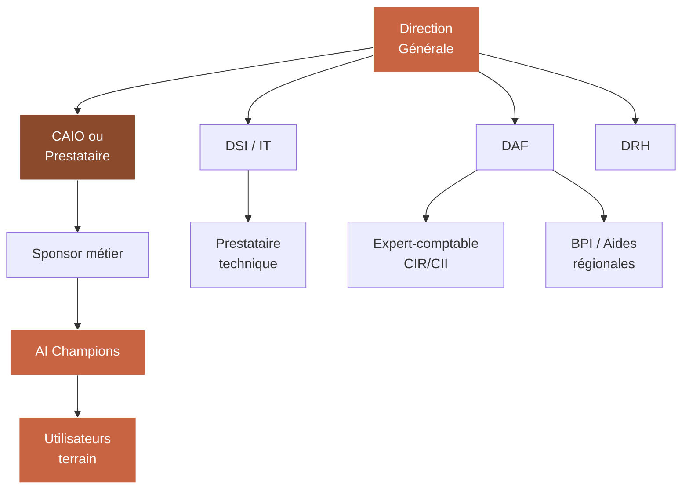

Chaque flèche représente un canal de décision ou d'information. La dirigeante pilote six canaux simultanément. La clé du succès : ne pas tous les activer avec la même intensité. La DG travaille hebdomadairement avec le CAIO et le sponsor métier, mensuellement avec le DSI et le DAF, trimestriellement avec la DRH et les champions.

## Annexe F — Les dix erreurs les plus coûteuses à éviter (synthèse transversale)

| # | Erreur | Impact type |
|---|--------|-------------|
| 1 | Choisir la techno avant le problème | Budget perdu, projet au placard |
| 2 | Sous-estimer l'audit données | Retard 2-3 mois minimum |
| 3 | Négliger la conduite du changement | Adoption <30 %, échec politique |
| 4 | Recruter un CAIO sans mandat clair | Démission après 6-8 mois |
| 5 | Ne pas lire les 18 questions avant de signer un devis | Surpaiement 30-50 % |
| 6 | Sous-estimer les coûts récurrents | Trésorerie tendue à M12 |
| 7 | Ne pas demander le plan B si la donnée est sale | Dérive de 4-6 mois |
| 8 | Ignorer les aides BPI/CIR/CII | Perte de 20-40 % d'économie possible |
| 9 | Sur-piloter (réunions hebdo, comités multiples) | Démotivation équipe projet |
| 10 | Refuser d'arrêter un projet qui ne marche pas | Perte multipliée par 2-3 |

## Annexe G — Questions fréquentes des dirigeantes

**Est-ce que l'IA va remplacer mes salariés ?**
En PME, rarement des métiers entiers. Plutôt des tâches. Votre engagement de non-remplacement par l'IA est à la fois crédible et défendable, à condition d'être sincère.

**Dois-je absolument former toute mon équipe ?**
Non. Formez les 10 à 20 % directement concernés par le cas d'usage, plus vos 3-5 AI champions. Les autres apprendront naturellement en voyant l'outil tourner.

**Mon DSI peut-il jouer le rôle de CAIO ?**
Rarement. Le DSI pense infrastructure et sécurité. Le CAIO pense cas d'usage et stratégie. Les deux rôles coexistent et se complètent.

**Et si j'attends encore un an avant de démarrer ?**
C'est une option. Mais gardez à l'esprit que les concurrents qui lancent maintenant prennent 12 mois d'apprentissage organisationnel d'avance. Ce capital humain ne se rattrape pas en achetant une licence.

**Puis-je déléguer entièrement mon projet IA à un prestataire ?**
Oui, mais vous restez décisionnaire. Un prestataire ne peut pas remplacer la DG sur les arbitrages stratégiques ni sur la conduite du changement.

**À partir de quelle taille une PME doit-elle se poser la question de l'IA ?**
Dès 20 personnes, si vous avez un back-office avec des tâches répétitives. Le seuil n'est pas une taille d'entreprise, c'est un volume de répétition.

**Le no-code IA est-il suffisant ?**
Pour 60 % des premiers cas d'usage, oui. Pour les 40 % restants (intégration ERP profonde, données sensibles, volumes élevés), un développement sur-mesure reste nécessaire.

**Comment justifier l'investissement à mes actionnaires ?**
Trois axes : (1) productivité mesurable, (2) signal de modernisation aux clients et talents, (3) apprentissage organisationnel capitalisable sur projets futurs.

---

**Fin du parcours AI Executive Decision Maker Track**

**Agentik {OS} — agentik-os.com**
