# CAIO Academy — From Dev to CAIO Track

**The complete path to move from executing developer to in-demand Chief AI Officer**

**Target audience:** Kevin — ambitious developer or PM
**Track duration:** 14 hours of structured content
**Transformation horizon:** 12 months
**Format:** 8 professional training modules, concrete deliverables, deployable templates

**Agentik {OS} — agentik-os.com**

---

## Preface — Why this track exists

You're a developer. You know how to ship code. You deliver features that work, you master your IDE, you understand distributed systems. Maybe you've already experimented with the OpenAI API, integrated Claude into a side project, or written a small agent that runs on your laptop.

But you feel a ceiling. You see people who, 18 months ago, weren't coding as well as you do now, raising €2M rounds on AI products. You see ex-developers repositioning themselves as "AI Architect," "Head of AI," "Chief AI Officer" — and charging three to ten times what you charge. You observe that market value is shifting toward a profile you don't yet carry, and you ask yourself: *how do I cross that line?*

This track answers that question. Not in theory. In protocol.

The CAIO role is not a linear promotion from the developer role. It's a **register shift**. You stop selling your ability to execute code and start selling your ability to design systems, direct an enterprise AI strategy, translate business into agentic architecture, and carry a public portfolio that makes you *findable* rather than searching.

What you'll build in 14 hours of training does not replace 10 years of experience — it short-circuits the years you would have spent not knowing what actually matters. You'll learn the value pyramid, master the 2025 CAIO stack, deploy your first documented agent, learn to speak to decision-makers, build a public portfolio, get noticed without an established network, land your first mission, and trace a realistic 12-month roadmap.

At the end of this track, you won't have a diploma. You'll have something much rarer: **public proof that you're already a CAIO in the making**, and a clear path to monetize that proof.

---

## Avatar — Kevin, ambitious dev or PM

| Dimension | Profile |
|-----------|---------|
| Typical age | 25-35 |
| Experience | 2 to 7 years in dev or product |
| Usual stack | JavaScript/TypeScript, React, Node, Python or PHP, some DevOps |
| Relationship to AI | Has tested ChatGPT, integrated an OpenAI API, read 30 Twitter threads on agents |
| Main frustration | "I code things that others invoice 5x more by calling it AI" |
| Deep fear | "I'm going to stay an executor while market value slides out from under my feet" |
| Accessible dream | Becoming a recognized CAIO, freelance at $1,000/day or permanent role at $120-180k/year, with leverage |
| Purchase signal | Has already bought at least one premium dev training (Udemy Pro, Zero to Mastery, Frontend Masters) |
| Main blocker | Doesn't know *what* to produce publicly to appear credible |

---

## Track overview

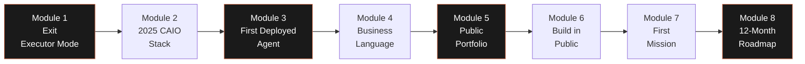

Each module is designed to produce **a public, shareable deliverable**. By the end of the track, you'll have accumulated eight concrete assets — a portfolio of proofs, not a stack of certificates.

| Module | Duration | Main deliverable | Expected impact |
|--------|----------|-------------------|-----------------|
| 01 — Exit "executor" mode | 1h30 | Current CAIO self-diagnostic | Clarity on the gap to bridge |
| 02 — Master the 2025 CAIO stack | 2h00 | CAIO tools map | Reusable quarterly reference |
| 03 — Build your first agent | 3h00 | Deployed agent + README + Loom | First demonstrable "CAIO project" |
| 04 — Speak business | 1h30 | CAIO elevator pitch script | Ability to convince in 5 minutes |
| 05 — Public CAIO portfolio | 2h00 | Deployed one-page portfolio site | Professional web presence |
| 06 — Get noticed | 1h30 | 30-day content plan | Targeted starter audience |
| 07 — First mission | 1h30 | Junior CAIO prospecting kit | First client identified |
| 08 — 12-month roadmap | 1h00 | Detailed personal roadmap | Executable plan, quarter by quarter |

---

---

# Module 01 — Exit "executor" mode

**Duration: 1h30 · Format: structured reading + self-diagnostic exercise**

## Module objectives

By the end of this module, you will be able to:

1. Clearly articulate the **value pyramid — code → system → strategy** and locate where you operate today.
2. Identify the **three thinking biases** that block most developers at the executor level.
3. List at least **five concrete opportunities** for AI leadership in your current context (job, mission, personal project).
4. Complete your **CAIO self-diagnostic** and understand your minimum trajectory to the next level.

## 1.1 — The value pyramid: code, system, strategy

There is a clear hierarchy in the market value of tech skills. Salary, day rate, the interest you generate with recruiters and clients — all of this is directly correlated with the pyramid tier where you spend most of your time.

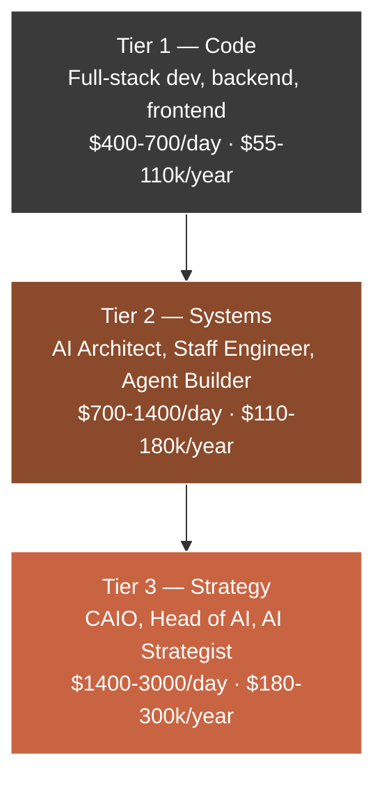

This pyramid is not a linear ladder to climb. It's a focus matrix. A senior developer may spend 90% of their time at tier 1 (code) while occasionally touching tier 2 (architecture). A confirmed CAIO will spend 70% at tier 3 (strategy), 25% at tier 2 (systems), and 5% at tier 1 (code, usually to prototype or validate an idea).

**What distinguishes the three tiers:**

| Dimension | Tier 1 — Code | Tier 2 — Systems | Tier 3 — Strategy |
|-----------|----------------|--------------------|--------------------|
| Horizon | Sprint (1-2 weeks) | Quarter | Year to 3 years |
| Central question | "How do we do this?" | "How do we orchestrate that?" | "Why do this at all?" |
| Delivery unit | Feature, ticket, PR | Architecture, pipeline, agent | Roadmap, AI OKRs, governance |
| Success measure | Code that works | System that scales | Durable competitive advantage |
| Main counterpart | Tech lead, PO | CTO, VP Engineering | CEO, COO, executive team |
| Leverage | 1x (you coding) | 10x (team following your architecture) | 100x (organization executing your strategy) |
| Commoditization | High (juniors + LLMs) | Medium | Low (experience + judgment) |

**The crucial shift** occurs when you move from "I'm paid to execute code" to "I'm paid to decide what should be coded, by whom, and why." This shift is not technical. It's cognitive.

## 1.2 — How CAIOs think differently from devs

A CAIO is not simply a developer who added "AI" to their LinkedIn profile. It's a profile that has internalized three thinking shifts that most developers never make.

### Shift 1: From feature to capability

A developer thinks in **features**: a button, a form, an endpoint, a page. They solve discrete problems.

A CAIO thinks in **capabilities**: a capability is a reusable *potential for action* within the system. A chatbot isn't a feature — it's the capability of "responding to natural text" applied to a use case. That same capability can serve customer support, internal help, documentation generation, lead qualification.

When you reason in capabilities, you automatically see reusability, economies of scale, and modular architectures. You stop proposing "we'll build a chatbot" and start proposing "we'll deploy a conversational capability that five teams will consume via an internal API."

### Shift 2: From code to data

A developer thinks about the quality of their code: readability, tests, performance, technical debt.

A CAIO thinks about the quality of **data and signals**: does user feedback flow into an exploitable pipeline? Is every agent call traced? Can model quality be measured, and if so, with what metric, and at what frequency?

Code is a cost that depreciates. Data and signals are an asset that appreciates. A CAIO spends a significant portion of their time ensuring the organization *captures* what matters, even when nothing is in production yet.

### Shift 3: From resolution to orientation

A developer receives tickets and resolves them. That's their job.

A CAIO identifies problems *before* they become tickets and orients resources to tackle them at the root. They reject projects. They say no to AI use cases that lack strategic alignment. They invest time in things that won't pay off for 9 months because they see a systemic advantage no one else sees.

This orientation capacity is what makes a CAIO irreplaceable. It doesn't come from an LLM's documentation. It develops through repeated practice of *choosing what not to do*, which is why the first exercise of this track — the self-diagnostic — starts by forcing you to identify three things you're currently doing and should **stop**.

## 1.3 — Identifying your first AI leadership opportunities

You don't need to wait for a new role to start taking AI leadership. Most CAIOs you'll encounter on LinkedIn started with micro-initiatives in their current context. Here's a grid to identify yours.

```mermaid
flowchart LR
    Q[Opportunity grid<br/>AI Leadership]
    Q --> A[Internal sphere<br/>at my current company]
    Q --> B[Mission sphere<br/>at my current client]
    Q --> C[Personal sphere<br/>side projects or open source]
    Q --> D[Community sphere<br/>Slack, Discord, Meetups]

    A --> A1[Propose an AI POC<br/>on an internal process]
    A --> A2[Organize a weekly<br/>1h AI Lab with 3 colleagues]
    B --> B1[Identify 1 workflow<br/>automatable by agent]
    B --> B2[Write a memo<br/>"3 AI quick-wins"]
    C --> C1[Publish a useful<br/>open source agent]
    C --> C2[Write a Twitter thread<br/>on a concrete case]
    D --> D1[Present a project<br/>at a local meetup]
    D --> D2[Co-write an article<br/>with a senior peer]
```

The classic mistake of developers who want to pivot to CAIO is waiting for the green light. *The green light never comes.* Opportunities for AI leadership in your current context are not checkboxes in your annual goals — they are spaces you occupy before anyone gives them to you.

**Practical heuristic:** if you can answer "yes" to these three questions for an opportunity, take it.

| Question | Why it matters |
|----------|-----------------|
| Can I produce a visible result in less than 30 days? | Avoids phantom projects that never conclude |
| Can the impact be quantified, even roughly? | Creates a communicable value proof |
| Can I then publish this result (use case, post, repo)? | Turns an internal project into a personal brand asset |

## 1.4 — Deliverable: current CAIO self-diagnostic

The self-diagnostic is structured around five axes, each scored from 1 to 5. Fill it out honestly. Not to reassure yourself — to know where you should invest your 14 training hours first.

| Axis | Anchor question | Your score (1-5) | Expected level at end of track |
|------|------------------|--------------------|----------------------------------|
| Technical AI | Can you deploy an agent to production in less than 3 hours? | ___ | 4/5 |
| Systems vision | Can you sketch a RAG pipeline architecture on a whiteboard? | ___ | 4/5 |
| Business language | Can you explain an AI project in 5 min to a non-tech without jargon? | ___ | 4/5 |
| Public presence | Do you have a CAIO portfolio indexed on Google? | ___ | 4/5 |
| CAIO network | Do you personally know at least 3 CAIOs or Heads of AI? | ___ | 3/5 |

**Interpretation:**

- **Total score ≤ 10**: you're in discovery phase. Modules 02, 03, and 05 are your absolute priorities.
- **Total score 11-15**: you're in acceleration phase. Modules 04, 06, and 07 will tip you over.
- **Total score 16-20**: you're close to the shift. Module 08 lets you crystallize your trajectory.
- **Total score ≥ 21**: you're already an unrecognized CAIO in the making. The track will formalize your positioning.

## Key takeaways — Module 01

- Market value is hierarchized across three tiers: code, systems, strategy. Your salary tracks the median of the tier where you spend 70% of your time.
- The shift to CAIO is cognitive before it's technical: it requires three displacements — feature → capability, code → data, resolution → orientation.
- AI leadership opportunities are spaces you occupy, not checkboxes handed to you.
- The self-diagnostic is your objective starting point: it determines which modules deserve the most time.

**Module 01 deliverable:** Completed CAIO self-diagnostic, identification of your two weakest axes, and written commitment to three actions within 7 days.

---

---

# Module 02 — Master the 2025 CAIO stack

**Duration: 2h00 · Format: structured reading + active mapping + environment setup**

## Module objectives

By the end of this module, you will be able to:

1. Name and locate the **four layers of the CAIO stack** (LLMs, orchestrators, vector databases, interfaces) and the leading products of each layer.
2. Install in under 30 minutes a **complete Next.js + Convex + Composio + Claude environment** ready to host your first agent.
3. Decide **when to go no-code** (Zapier, Make, n8n, Retool) versus **when to go custom code**.
4. Produce your own **CAIO tools map**, updated each quarter and published on your portfolio.

## 2.1 — The CAIO stack mental map

The 2025 CAIO stack is not a monolithic pile. It's a stack of four layers that interact via contracts (APIs, SDKs, protocols like MCP). A competent CAIO knows at least two viable options per layer and can justify their choices.

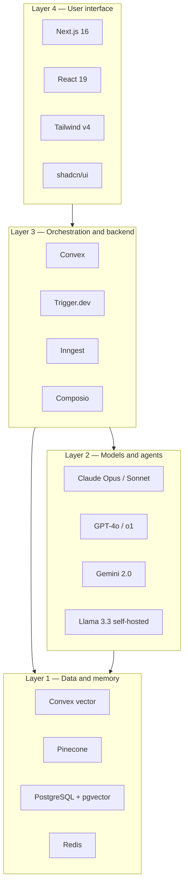

Being at the bottom of the stack doesn't mean being less important. On the contrary: choices made at layer 1 (data) condition everything above. A CAIO who picks the wrong vector database at 10k documents will live in hell at 10M.

## 2.2 — Reasoned inventory of key tools

For each layer, here are the options you need to know at minimum, with their market positioning and the typical decision a CAIO must be able to justify.

### Layer 1 — Data and memory

| Tool | Type | Main strength | When to choose it |
|------|------|----------------|---------------------|
| Convex vector | Integrated with Convex | Zero ops, native reactivity | Next.js + Convex projects, volume < 10M vectors |
| Pinecone | Managed cloud service | Extreme scale, hybrid filtering | High-load production, budget OK |
| PostgreSQL + pgvector | Open source, self-hostable | Total control, sovereignty | Constrained environments (health, public, EU) |
| Redis / Upstash | Cache + vector + KV | Latency < 5ms | Semantic cache, sessions, queues |
| Weaviate | Open source, native GraphQL | Hybrid semantic + keyword search | Need for fine mixed search |

### Layer 2 — Models and agents

| Tool | Provider | Main strength | When to choose it |
|------|----------|----------------|---------------------|
| Claude Opus 4 | Anthropic | Long-horizon reasoning, agentic | Orchestrators, long tasks, code |
| Claude Sonnet 4 | Anthropic | Quality/price ratio | 80% of production use cases |
| Claude Haiku 4.5 | Anthropic | Ultra-fast, cheap | Classification, extraction, routing |
| GPT-4o | OpenAI | Multimodality, ecosystem | Vision, voice, existing integrations |
| Gemini 2.0 | Google | Very long context, price | Massive document analysis |
| Llama 3.3 70B | Meta, self-host | Sovereignty, fixed cost | Sensitive data, very high volume |

### Layer 3 — Orchestration and backend

| Tool | Type | Main strength | When to choose it |
|------|------|----------------|---------------------|
| Convex | Real-time reactive backend | Exceptional DX, typed functions | Web apps with embedded AI |
| Trigger.dev v4 | Agent-oriented background jobs | Retries, batching, durability | Long workflows, autonomous agents |
| Inngest | Event-driven serverless | Durable functions, strong typing | Event-driven pipelines |
| Composio | Ready agent integrations | 250+ connectors, managed auth | Agents that must act on Gmail, Slack, Notion, etc. |
| Pipedream | Code-first iPaaS | Flexibility + connectors | Rapid multi-tool agent prototypes |
| LangChain / LangGraph | Agent framework | Complex state graphs | Multi-step agent workflows |

### Layer 4 — User interface

| Tool | Role | Main strength | When to choose it |
|------|------|----------------|---------------------|
| Next.js 16 | Fullstack framework | App Router, React Server Components | De facto standard in 2025 |
| React 19 | UI library | Actions, use() hook, compiler | Implicit with Next.js 16 |
| Tailwind v4 | Utility CSS | Velocity + consistency | All modern UI projects |
| shadcn/ui | Component library | Copy-paste, full ownership | Internal apps, portfolios |
| Vercel AI SDK | Client-side AI streaming | React hooks for LLM streaming | Chatbots, in-app assistants |

## 2.3 — The CAIO stack in 30 minutes: Next.js + Convex + Composio + Claude

Here's the recommended stack for a first deployed agent. It's *opinionated* — that's the point. A beginner CAIO who spends three weeks choosing their stack never ships a first agent.

### Target architecture

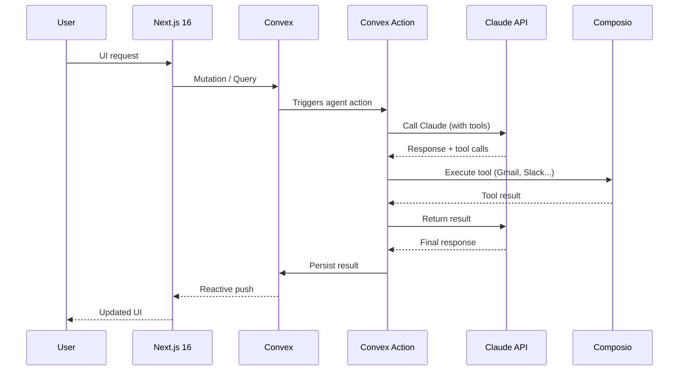

### Setup in 7 steps

```bash
# 1. Scaffold the project
npx create-next-app@latest my-first-agent \
  --typescript --tailwind --app --eslint

cd my-first-agent

# 2. Install Convex
npm install convex
npx convex dev

# 3. Add the Claude SDK
npm install @anthropic-ai/sdk

# 4. Add Composio
npm install composio-core

# 5. Environment variables (in .env.local)
# ANTHROPIC_API_KEY=sk-ant-...
# COMPOSIO_API_KEY=...

# 6. Configure shadcn/ui
npx shadcn@latest init -d
npx shadcn@latest add button input card textarea

# 7. Run in parallel
npm run dev
# and in another terminal
npx convex dev
```

### Minimal agentic Convex action example

```typescript
// convex/agent.ts
import { action } from "./_generated/server";
import { v } from "convex/values";
import Anthropic from "@anthropic-ai/sdk";

const anthropic = new Anthropic({
  apiKey: process.env.ANTHROPIC_API_KEY!,
});

export const askAgent = action({
  args: { prompt: v.string() },
  handler: async (ctx, { prompt }) => {
    const response = await anthropic.messages.create({
      model: "claude-sonnet-4-6",
      max_tokens: 1024,
      system: "You are a CAIO assistant. You help developers think in systems.",
      messages: [{ role: "user", content: prompt }],
    });

    const text = response.content
      .filter((b) => b.type === "text")
      .map((b) => b.text)
      .join("\n");

    await ctx.runMutation(internal.logs.insert, {
      prompt,
      response: text,
      tokensUsed: response.usage.input_tokens + response.usage.output_tokens,
    });

    return text;
  },
});
```

In 30 minutes you have a reactive backend, a powerful model behind it, and a typed entry point. From there, each module of the track adds a layer.

## 2.4 — No-code versus custom code: the decision matrix

A mistake many devs make when wanting to become CAIO: over-coding. The developer thinks every problem deserves a Git repo. The CAIO knows that **90% of first POCs should stay in no-code** to validate value before investing engineer time.

| Criterion | No-code (Zapier, Make, n8n, Retool, Bubble) | Custom code (Next.js + Convex + Claude) |
|-----------|-----------------------------------------------|------------------------------------------|
| Time-to-first-value | 2-8 hours | 2-10 days |
| Startup cost | $20-100/month | Engineer time + infra |
| Scalability | Low to medium (often caps at 10k-100k actions/month) | High (serverless + reactive) |
| UX customization | Limited to medium | Total |
| Observability | Basic (platform logs) | Custom, up to OpenTelemetry |
| Security / compliance | Depends on provider | Total (including on-premise) |
| Ownership | Low (platform lock-in) | Total (you own the code) |
| Ideal for | POC, internal workflows, automation < 10k/month | Public product, SaaS, scale, differentiation |

**CAIO heuristic rule:**

1. **POC in no-code**, always, as long as it's technically possible.
2. If value is proven (real usage, real savings, real revenue) → **migrate to code** layer by layer.
3. **Never** start with code if the problem isn't validated.

## 2.5 — Deliverable: your personal CAIO tools map

You'll produce a markdown document (and ideally a page on your portfolio) listing **every tool you master or want to master**, with for each:

- Tool name
- Stack layer
- Personal level (explored / used once / mastered)
- Decision: *keep* / *explore further* / *drop*
- Quarterly update (date of last review)

```markdown
# My CAIO Tools Map — Q2 2026

## Layer 1 — Data and memory
- **Convex** — mastered — keep ✅ — last review: 2026-04
- **Pinecone** — explored — explore further 🔍 — last review: 2026-04
- **pgvector** — used once — keep ✅ — last review: 2026-04

## Layer 2 — Models
...
```

This map becomes a **personal brand asset**: it proves you have a structured opinion on the ecosystem, which few developers can demonstrate.

## Key takeaways — Module 02

- The 2025 CAIO stack organizes in 4 layers: data, models, orchestration, interface.
- You need to know at least 2 viable options per layer and justify your choices.
- 90% of POCs should start no-code before justifying custom code.
- Your tools map, updated quarterly, is an underused personal brand asset.

**Module 02 deliverable:** your personal CAIO tools map, published on your portfolio (which will be built in module 05).

---

---

# Module 03 — Build your first functional agent

**Duration: 3h00 · Format: hands-on walkthrough with reference repo**

## Module objectives

By the end of this module, you will have:

1. Chosen a **simple use case with visible impact** by applying the CAIO grid.
2. Written, tested, and **deployed an end-to-end agent** on Vercel in under 3 hours.
3. Produced a **portfolio-grade README** that explains the problem, solution, and results.
4. Recorded a **5-minute Loom video** that demonstrates the use case.

## 3.1 — Choosing your first use case: the beginner CAIO grid

The classic trap for developers starting with agents: picking a topic that's too ambitious ("an agent that runs all of accounting") or too technical ("a RAG over 10M documents"). Neither serves your CAIO positioning in the beginning.

Your first agent must satisfy **the Five C's**:

| Criterion | Description | Why it's crucial |
|-----------|-------------|-------------------|
| **Concrete** | Solves a real problem, not an exercise | Credibility with recruiters / clients |
| **Communicable** | Explains in one sentence to a non-tech | Shareable on LinkedIn and in interviews |
| **Compact** | Shipped in < 3h of real work | Avoids the "phantom project" effect |
| **Capturable** | Measurable impact (time saved, errors avoided) | Turns a POC into a quantified proof |
| **Content-rich** | Generates public material (repo, post, video) | Feeds your Build in Public (module 06) |

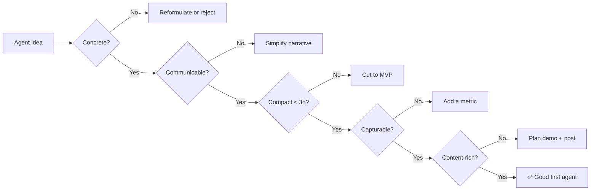

### 10 perfect use cases for a first CAIO agent

| # | Use case | Demonstrable impact | Key tools |
|---|----------|----------------------|-----------|
| 1 | CV triage agent (HR backlog) | "200 CVs sorted in 8 min vs 3h" | Claude + Composio Gmail |
| 2 | Targeted daily X/Twitter summary | "1h of daily monitoring saved" | Next.js + Claude |
| 3 | Level-1 support ticket response assistant | "40% of tickets resolved without human" | Convex + Claude + Intercom API |
| 4 | User feedback analyzer (Typeform, NPS) | "Insights in 2 min instead of 2h" | Claude + Vercel AI SDK |
| 5 | SEO content brief generator | "10 briefs/hour vs 2" | Claude + SERP data |
| 6 | Email tone reformulator in 3 voices | "Pro/friendly/direct tone in 1 click" | Claude + Next.js |
| 7 | Contractual PDF reader with clause extraction | "Contract review in 10 min vs 2h" | Claude + pdf-parse |
| 8 | LinkedIn draft writer (no auto-posting) | "Draft 5 posts/week in 15 min" | Claude + Next.js |
| 9 | Convex dashboard with Q&A on data | "Business question → natural-language answer" | Convex + Claude |
| 10 | Basic PR code review agent | "Detects 3 categories of errors before merge" | Claude + GitHub API |

## 3.2 — Walkthrough: build a CV triage agent in 3h

Let's take use case 1 (CV triage agent) and walk through it end-to-end. You can adapt the same pattern to any case in the list.

### Hour 1 — Setup and interface contract

**Goal:** a Next.js + Convex project running locally, with a data schema for CVs and an endpoint that receives a CV.

```typescript
// convex/schema.ts
import { defineSchema, defineTable } from "convex/server";
import { v } from "convex/values";

export default defineSchema({
  cvs: defineTable({
    filename: v.string(),
    rawText: v.string(),
    uploadedAt: v.number(),
    // Agent results
    status: v.union(
      v.literal("pending"),
      v.literal("processing"),
      v.literal("scored"),
      v.literal("error")
    ),
    score: v.optional(v.number()), // 0-100
    verdict: v.optional(v.union(v.literal("fit"), v.literal("maybe"), v.literal("pass"))),
    reasoning: v.optional(v.string()),
    extractedFields: v.optional(v.object({
      name: v.string(),
      yearsExp: v.number(),
      stack: v.array(v.string()),
      languages: v.array(v.string()),
    })),
  }).index("by_status", ["status"]),
});
```

### Hour 2 — The scoring agent

**Goal:** a Convex action that reads a CV, calls Claude with a structured prompt, and persists a score + verdict + justification.

```typescript
// convex/agent.ts
import { internalAction } from "./_generated/server";
import { v } from "convex/values";
import Anthropic from "@anthropic-ai/sdk";
import { internal } from "./_generated/api";

const client = new Anthropic({ apiKey: process.env.ANTHROPIC_API_KEY! });

const SYSTEM_PROMPT = `You are a senior tech recruiter.
You receive the raw text of a CV and must produce a strict JSON:
{
  "name": "string",
  "yearsExp": number,
  "stack": ["string"],
  "languages": ["string"],
  "score": number (0-100),
  "verdict": "fit" | "maybe" | "pass",
  "reasoning": "string (max 2 sentences)"
}
The target role is a senior TypeScript full-stack developer (5+ years).
`;

export const scoreCV = internalAction({
  args: { cvId: v.id("cvs"), rawText: v.string() },
  handler: async (ctx, { cvId, rawText }) => {
    await ctx.runMutation(internal.cvs.setStatus, { cvId, status: "processing" });

    try {
      const response = await client.messages.create({
        model: "claude-sonnet-4-6",
        max_tokens: 1024,
        system: SYSTEM_PROMPT,
        messages: [{ role: "user", content: rawText }],
      });

      const jsonText = response.content
        .filter((b) => b.type === "text")
        .map((b) => b.text)
        .join("")
        .match(/\{[\s\S]*\}/)?.[0];

      if (!jsonText) throw new Error("No valid JSON returned");

      const parsed = JSON.parse(jsonText);

      await ctx.runMutation(internal.cvs.setResult, {
        cvId,
        score: parsed.score,
        verdict: parsed.verdict,
        reasoning: parsed.reasoning,
        extractedFields: {
          name: parsed.name,
          yearsExp: parsed.yearsExp,
          stack: parsed.stack,
          languages: parsed.languages,
        },
        status: "scored",
      });
    } catch (err) {
      await ctx.runMutation(internal.cvs.setStatus, { cvId, status: "error" });
      throw err;
    }
  },
});
```

### Hour 3 — Minimal UI + Vercel deployment

**Goal:** a Next.js page with a text input (or PDF upload) that displays the result in real time through Convex reactivity.

```typescript
// app/page.tsx
"use client";
import { useState } from "react";
import { useMutation, useQuery } from "convex/react";
import { api } from "@/convex/_generated/api";

export default function Page() {
  const [text, setText] = useState("");
  const submit = useMutation(api.cvs.submit);
  const latest = useQuery(api.cvs.latest);

  return (
    <main className="max-w-2xl mx-auto p-8">
      <h1 className="text-2xl font-bold mb-6">CV Triage Agent</h1>
      <textarea
        value={text}
        onChange={(e) => setText(e.target.value)}
        className="w-full h-64 p-3 border rounded"
        placeholder="Paste CV text here..."
      />
      <button
        onClick={async () => {
          await submit({ filename: "manual-paste", rawText: text });
          setText("");
        }}
        className="mt-4 px-4 py-2 bg-black text-white rounded"
      >
        Analyze
      </button>
      <section className="mt-8 space-y-4">
        {latest?.map((cv) => (
          <article key={cv._id} className="border p-4 rounded">
            <header className="flex justify-between">
              <span className="font-semibold">
                {cv.extractedFields?.name ?? "..."}
              </span>
              <span className="text-sm">
                {cv.status === "scored"
                  ? `${cv.verdict?.toUpperCase()} — ${cv.score}/100`
                  : cv.status}
              </span>
            </header>
            {cv.reasoning && <p className="text-sm mt-2">{cv.reasoning}</p>}
          </article>
        ))}
      </section>
    </main>
  );
}
```

Deployment:

```bash
# Convex prod deployment
npx convex deploy

# Vercel deployment (headless)
vercel --prod --token=$VERCEL_TOKEN
```

You now have a real agent, deployed, testable by anyone with a link. That's worth more than any Udemy certificate.

## 3.3 — Documenting your agent: the portfolio README format

An undocumented agent is an invisible agent. Recruiters and prospects won't read your code — they'll read your README and watch your demo. Here's the skeleton to copy.

```markdown
# CV Triage Agent — CAIO Portfolio

## Problem
Recruiters spend on average 3 hours triaging 200 CVs for one role.
80% of this time is mechanical (verifying 5 simple criteria).

## Solution
AI agent that reads a CV, extracts structured fields, and produces a
FIT / MAYBE / PASS verdict with a 2-sentence justification.

## Measured impact
- 200 CVs triaged in 8 minutes (vs 3 hours)
- Verdict consistent with a human recruiter at 87% (over 50 test CVs)
- Model cost: ~$0.04 per CV

## Architecture
[Mermaid diagram here]

## Stack
- Next.js 16 / React 19
- Convex (reactive backend + agent actions)
- Claude Sonnet 4.6
- Vercel deployment

## Known limits
- Imperfect extraction on scanned PDF CVs (needs OCR)
- No fraud detection (embellished CVs)

## Possible evolutions
- Greenhouse / Lever integration
- Batch processing via Trigger.dev for lots > 500
- Fine-tuning on recruiter's past decisions

## Demo
[5-min Loom link]

## Live
[Vercel link]

## Code
[GitHub link]
```

## 3.4 — Deliverable: deployed agent + documentation

**Delivery checklist:**

- [ ] Public GitHub repo with README in the format above
- [ ] Functional Vercel deployment with shareable URL
- [ ] 3-5 minute Loom video: problem → demo → stack → limits
- [ ] LinkedIn announcement post (prepared in module 06)

## Key takeaways — Module 03

- Your first agent must satisfy the 5 C's: Concrete, Communicable, Compact, Capturable, Content-rich.
- 3 hours is enough for a deployed agent on Next.js + Convex + Claude.
- An undocumented agent is invisible — the README and Loom matter as much as the code.
- This is the first piece of your CAIO portfolio, not an anonymous side project.

**Module 03 deliverable:** your first agent, live, documented, demoed. *Note: in the Agentik Core Training ($2,000), this module is enriched with three ready-to-deploy system templates — CV triage, feedback analysis, support assistant — to short-circuit the cold-start phase.*

---

---

# Module 04 — Speak business: the dev who convinces decision-makers

**Duration: 1h30 · Format: frameworks + oral exercises + script templates**

## Module objectives

By the end of this module, you will be able to:

1. Translate any technical AI project into **quantified business value** ($, time, risk, revenue).
2. Present any AI project in **5 minutes** to a non-technical listener.
3. Write a **jargon-free AI value proposition** usable in sales or internal contexts.
4. Have your **personal CAIO elevator pitch**, calibrated for three contexts (recruiter, client, investor).

## 4.1 — The tech-business translator: the four conversions

The developer speaks latencies, frameworks, models. The decision-maker hears costs, revenues, risks, differentiation. Your role as CAIO is to bridge the gap, systematically.

| Dev language | CAIO translation | Example |
|--------------|-------------------|---------|
| "The model has 94% accuracy" | "Out of 100 files, 6 are misclassified, and here's how we catch them" | "We save 3h of human review per day and avoid 2 critical errors/month" |
| "I set up a semantic cache" | "We reduced inference costs by 60% without degrading experience" | "$22,000/year savings on this workflow" |
| "It's a RAG with reranking" | "The assistant reads the right internal documentation before answering, so it doesn't hallucinate" | "We go from a 22% error rate to 3% on product questions" |
| "We orchestrate 3 agents via MCP" | "Three specialized models cooperate to deliver better results than a single one" | "Final answer quality +35% vs GPT-4 baseline" |
| "Serverless pipeline with exponential retry" | "Even when an AI provider fails, the system keeps running" | "0 user interruptions across 3 OpenAI incidents in 2 months" |

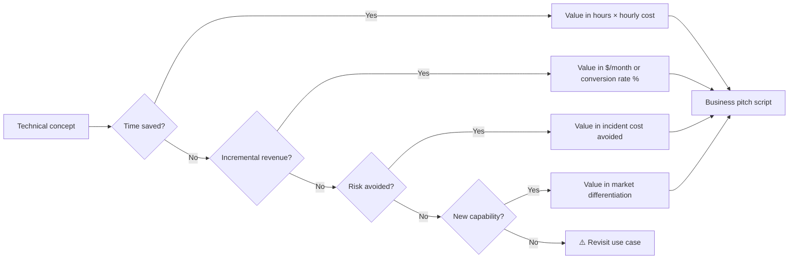

## 4.2 — The 5-minute pitch of an AI project

Five minutes is the time you'll typically have to convince a committee, sponsor, or client. Here's the proven structure.

| Minute | Content | Error to avoid |
|--------|---------|-----------------|
| 0:00 - 0:45 | The problem with a painful number | Starting with the solution |
| 0:45 - 1:30 | Current state and why it's no longer enough | Listing techs without context |
| 1:30 - 3:00 | Solution in one sentence + visual demo | Architecture details |
| 3:00 - 4:00 | Quantified impact ($, time, quality) | Vague estimates |
| 4:00 - 4:30 | What's left to do + budget + timeline | Asking for budget without deliverables |
| 4:30 - 5:00 | A powerful question to engage discussion | Ending with "any questions?" |

### Universal script template

```
[MINUTE 1 — QUANTIFIED PROBLEM]
Today, [CONTEXT]. Our teams spend [X HOURS] per [PERIOD]
doing [TASK]. It's not the most expensive time — it's the most
demotivating. And it prevents us from [STRATEGIC LEVERAGE].

[MINUTE 2 — CURRENT STATE]
We've already tried [PREVIOUS SOLUTION]. It worked at [X%],
but hits [CONCRETE LIMIT]. Classic tools don't attack the
root: [DIAGNOSIS].

[MINUTES 3 — SOLUTION + DEMO]
Here's what we built: [ONE SENTENCE]. Watch.
[60-SECOND LIVE DEMO]
Behind it: [STACK IN ONE LINE]. No magic: [KEY TECHNICAL POINT].

[MINUTE 4 — QUANTIFIED IMPACT]
Over [TEST PERIOD], we measured:
- [METRIC 1: time saved]
- [METRIC 2: quality]
- [METRIC 3: cost]
Extrapolated to [SCALE], that's [ANNUAL IMPACT IN $].

[MINUTE 5 — NEXT STEP]
To industrialize, we need [THREE PRECISE ELEMENTS].
Cost: [BUDGET]. Timeline: [WEEKS].
My question for you: [ENGAGING QUESTION].
```

## 4.3 — Writing a jargon-free value proposition

The value proposition is not a slogan. It's a testable sentence that holds three elements:

> **[FOR WHOM]** who **[DOES WHAT]** and suffers from **[FRUSTRATION]**,
> **[YOUR SOLUTION NAME]** is **[CATEGORY]** that **[KEY BENEFIT]**.
> Unlike **[CURRENT ALTERNATIVE]**, we **[DIFFERENTIATOR]**.

**Example (CV triage agent):**

> For tech recruiters who receive more than 100 applications per role and struggle to triage without sacrificing hours of manual review, **TriageCV** is an AI agent that scans each CV and produces a justified verdict in 5 seconds. Unlike classic ATS systems that only filter by keywords, we reason over the candidate's real experience and flag false positives.

**Value proposition checklist:**

| Criterion | OK? |
|-----------|-----|
| No technical terms (LLM, RAG, fine-tuning, agent, prompt...) | ☐ |
| Reads aloud in under 20 seconds | ☐ |
| A non-tech understands without asking questions | ☐ |
| The benefit is quantifiable or testable | ☐ |
| The differentiator is defendable (not "we're faster") | ☐ |

## 4.4 — Deliverable: your CAIO elevator pitch

You'll produce three versions of your personal CAIO pitch, adapted to three contexts.

### Version 1 — Recruiter (45 seconds)

```
I'm [NAME], [STACK] developer for [X years].
For [PERIOD], I've been specializing in building
production AI agents: [2-3 CONCRETE PROJECTS].
I'm now looking for a [CAIO / Head of AI / AI Lead]
role in a [COMPANY TYPE] that wants to [TARGET TRANSFORMATION].
My differentiating value: I think in systems, not features,
and I ship measurable impact — [ONE CONCRETE NUMBER].
```

### Version 2 — Potential client (60 seconds)

```
I help product and tech teams deploy their first
AI agents in under a month, with an architecture that scales.
My approach: I pick the highest-leverage use case, ship a POC
in 3 weeks, then document everything so your teams take over.
I just did this for [REFERENCE].
If you have a repetitive workflow costing more than [X] hours
per week, we can probably divide it by 5.
```

### Version 3 — Investor / executive committee (90 seconds)

```
Companies that structured their AI strategy in 2025
emerge with a permanent operational advantage. Those that
wait accumulate strategic debt that will be impossible
to catch up by 2027. I position myself as the hinge profile:
technical skill of an AI CTO and business translation
capacity of a product lead.
Concretely: [2 DEPLOYED PROJECTS WITH QUANTIFIED IMPACT].
I can help you: (1) prioritize the 3 AI use cases that
pay off in under 6 months, (2) build the data governance
that prevents debt, (3) recruit or upskill the team.
```

## Key takeaways — Module 04

- Tech-business translation goes through 4 conversions: time, revenue, risk, capability.
- A 5-minute AI pitch follows a fixed structure: quantified problem → current state → solution + demo → impact → next step.
- A jargon-free value proposition is testable aloud in 20 seconds.
- Your elevator pitch exists in 3 versions depending on the listener.

**Module 04 deliverable:** personal CAIO elevator pitch script in 3 versions (recruiter, client, investor), tested on at least two real people.

---

---

# Module 05 — Build your public CAIO portfolio

**Duration: 2h00 · Format: design + build + deployment**

## Module objectives

By the end of this module, you will have:

1. A **restructured GitHub** that clearly communicates your CAIO positioning.
2. A **one-page portfolio site** deployed on your domain, mobile-friendly, performant.
3. A **reusable case study format** for each CAIO project.
4. A **minimal SEO strategy** so that your name + "CAIO" makes you stand out on Google.

## 5.1 — The CAIO GitHub: anatomy of a profile that sells

Most developers have a chaotic GitHub: 40 forks, 6 half-finished projects, an empty personal README. A CAIO GitHub is the opposite: very few repos, but each tells a story.

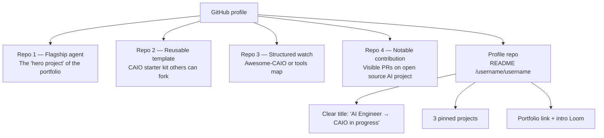

### Rules of the CAIO GitHub

| Rule | Why |
|------|-----|
| Max 6-8 visible repos (the rest archived) | Signal of selection; avoids dilution |
| Each repo has a portfolio-grade README | The repo speaks for itself, no need for you to explain |
| The 3 pinned repos tell a progression | First agent → template → agent system |
| Description in 1 line with emoji + benefit | Scannable in 2 seconds |
| All links (live, Loom, post, article) in the README | Zero friction for visitors from random sources |
| The `/username/username` repo is your condensed CV | First point of contact on github.com/you |

### Personal profile repo README template

```markdown
# Hi 👋 I'm [Name]

I build AI agents in production. I'm moving from **full-stack dev**
to **CAIO** since [DATE].

## 🛠️ Current focus
- **TriageCV** ([demo](...)) — agent that triages 200 CVs in 8 minutes
- **FeedbackLens** ([article](...)) — NPS analysis in natural language
- **My CAIO tools map** ([link](...)) — updated quarterly

## 🎯 What I'm looking for
I'm looking for a **CAIO / Head of AI** role in a [COMPANY TYPE]
that wants [TARGET TRANSFORMATION]. Or a focused freelance mission.

## 📮 Reach out
- Portfolio: [link]
- LinkedIn: [link]
- Intro Loom (2 min): [link]
- Email: [link]
```

## 5.2 — The CAIO portfolio site: one-page structure

You don't need a complex site. One well-structured page is enough.

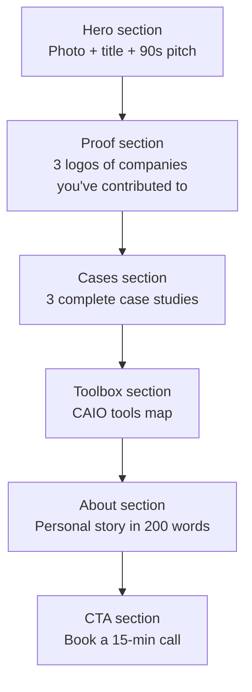

### Recommended stack (coherent with your positioning)

| Layer | Tech | Justification |
|-------|------|---------------|
| Framework | Next.js 16 | Proves you master your own stack |
| Hosting | Vercel | Instant deployment, integrated CI |
| Style | Tailwind v4 | Fast, consistent, modern |
| Components | shadcn/ui | Design quality + code ownership |
| Domain | your-name.com or your-name.ai | First signal of seriousness |
| Analytics | Plausible or Vercel Analytics | Measurement without cookies |
| Form | Resend + Convex | CAIO stack coherence |

### Mandatory sections and typical content

| Section | Content | Size |
|---------|---------|------|
| Hero | Name + positioning title + pitch + CTA | 100 words |
| Social proof | 3-5 recognizable logos or names (companies, OSS projects, meetups) | Visual |
| Case studies | 3 projects with problem / solution / impact / stack / links | 250 words each |
| Tools map | Interactive or static table of your CAIO stack | 40 tools max |
| About | Personal narrative of dev → CAIO transition | 200 words |
| CTA | Calendly or Cal.com for 15-min call | 1 button |
| Footer | Social links + license (your code, your content) | 1 line |

## 5.3 — The CAIO case study format

Your portfolio rests on its case studies. A well-written case study is 10x more impactful than a code repo. Here's the skeleton.

```markdown
# Case Study — [Project Name]

## Context (30 words)
[Which organization, which problem, which stakes.]

## Problem (80 words)
[Precise description, quantified if possible, with concrete "before."]

## Constraints (50 words)
[Time, budget, imposed stack, regulatory constraints.]

## My proposal (80 words)
[One sentence on the solution + 3 key architectural decisions + justification.]

## Architecture
[Mermaid diagram here]

## Implementation (100 words)
[Real stack, counterintuitive choices, pitfalls avoided.]

## Results (60 words)
[Before / after numbers, feedback, actual usage.]

## What I learned (60 words)
[1 business lesson, 1 technical lesson, 1 personal lesson.]

## Links
- Repo: [...]
- Live demo: [...]
- 5-min Loom: [...]
- Associated LinkedIn post: [...]
```

### Condensed case study example (TriageCV)

> **Context.** Tech recruitment firm, 7 recruiters, 400+ CVs per week.
>
> **Problem.** 22 hours weekly lost on level-0 manual triage, at the expense of phone qualification.
>
> **My proposal.** AI agent that reads each CV and produces a justified verdict. No replacement of the recruiter — a **triage** so they start their day at 9am on the top 20 priority CVs instead of 200.
>
> **Results.** -72% triage time, +18% phone interviews completed, verdict consistency with human recruiter at 87%.

## 5.4 — Minimal SEO to be findable

You want that when a recruiter types "[your name] CAIO" or "[your name] AI engineer," you come up first. Doable in 2 hours.

| Action | Effort | Impact |
|--------|--------|--------|
| `<title>` tag: "[Name] — CAIO in progress, AI Engineer" | 5 min | High |
| `<meta description>`: your 90-second pitch | 10 min | High |
| Schema.org Person JSON-LD | 15 min | Medium |
| Custom OG image (your face + title) | 20 min | High (sharing) |
| Sitemap.xml + robots.txt | 10 min | Medium |
| Link from LinkedIn, Twitter, GitHub | 10 min | Very high |
| One blog post per case study | 2h per article | Very high over 6 months |
| CAIO Registry Agentik enrollment | 15 min | Very high on Google |

## Key takeaways — Module 05

- A CAIO GitHub is curated: 6-8 repos max, each tells a progression.
- A well-structured one-page portfolio is enough: hero → proof → cases → toolbox → about → CTA.
- Case studies are the masterpiece, not the code.
- A minimal SEO strategy (title, meta, OG, backlinks) makes you findable on your name + "CAIO."

**Module 05 deliverable:** deployed one-page portfolio site, 3 written case studies, restructured GitHub profile, CAIO Registry submission.

---

---

# Module 06 — Get noticed without 10 years of experience

**Duration: 1h30 · Format: content strategy + templates + calendar**

## Module objectives

By the end of this module, you will have:

1. Understood the **Build in Public** method and why it short-circuits seniority.
2. Mastered the **LinkedIn post formats** that perform for a dev-turned-CAIO profile.
3. Identified and joined the **Twitter/X, Discord, and Slack communities** of AI builders.
4. Produced a personalized **30-day content plan** with topics, formats, and cadence.

## 6.1 — Build in Public: the fastest way to create authority

Traditional authority builds in 10 years: degrees, positions, publications. Build in Public authority builds in 6 months: you publish, publicly and regularly, the *process* of your learning and building.

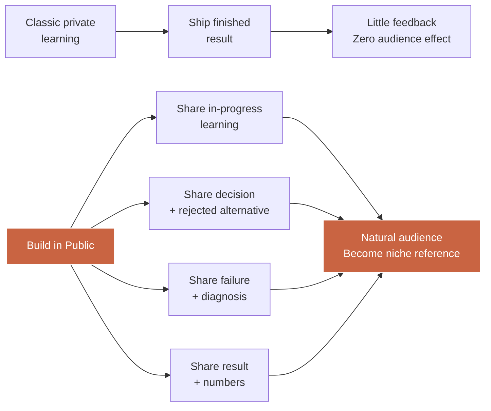

### Why it works (even more in 2025-2026)

| Dynamic | Effect for you |
|---------|-----------------|
| People buy relationships, not products | Sharing your process = relationship before sale |
| Algorithms reward consistency > virality | Posting 3x/week for 12 months > 1 viral post |
| The "francophone CAIO" niche is nearly empty | You don't face 10,000 competitors |
| Tech recruiters look for profiles who teach | Posting makes you more credible than a classic CV |

### The three types of Build in Public content

1. **Progress** — "Here's what I built this week."
2. **Reflection** — "Here's what I understood about [topic] after 10 deployed agents."
3. **Post-mortem** — "I messed up [X]. Here's the diagnosis and what I'm changing."

The golden rule: **never a post devoid of substance**. No "great week! thanks team" LinkedIn corporate. A CAIO post *always* gives an idea, a number, or a usable lesson.

## 6.2 — LinkedIn post formats that perform for devs-turned-CAIO

LinkedIn in 2025 rewards 4 main formats. You must master at least 3 and alternate.

### Format 1 — The "system" carousel (8-12 slides)

Structure:
1. Shocking hook (cover slide)
2. Problem context (1 slide)
3. 4-6 slides of architecture / steps / decisions
4. Quantified result slide
5. CTA slide (link to case study or repo)

Examples of titles that perform:
- *"I deployed my first agent in 3h. Here are the 7 decisions that saved me."*
- *"Production RAG architecture: 10 slides, 0 jargon."*
- *"5 pitfalls I hit building a customer support agent."*

### Format 2 — The narrative text post (300-600 words)

Structure:
- Hook (1 line that intrigues)
- Personal context (2-4 lines)
- Structured learning (lists, numbers, steps)
- Final lesson (1-2 sentences)
- Open question for engagement

Example: *"90 days ago, I was a classic full-stack dev. Today, I just shipped my 4th agent in production. Here's what changed in how I think..."*

### Format 3 — The short demo video (30-90 sec)

Structure:
- Shared screen in Loom or Screen Studio
- You speak on camera for 10 sec (hook)
- Demo of agent in action (20-60 sec)
- Conclusion "link in comments" (10 sec)

### Format 4 — The curated resource list

Structure:
- "15 tools a CAIO in 2025 must know"
- Each tool: 1 line of description + link
- At least 3 "non-obvious" tools to stand out
- No affiliate links that break trust

### Decision matrix: which format, when?

| Goal | Recommended format |
|------|---------------------|
| Show you ship | Short demo video |
| Establish technical credibility | System carousel |
| Create human connection | Narrative text post |
| Gain followers quickly | Curated resource list |
| Announce a big deliverable (site, agent) | Carousel + video combined |

## 6.3 — Twitter/X: joining the AI builders community

Twitter/X is the network where the **technical conversation** between AI builders happens. LinkedIn positions you with recruiters. Twitter positions you with peers — which is worth 10x more long-term.

### Twitter engagement rules for a CAIO-in-progress in 2025

| Action | Cadence |
|--------|---------|
| Original tweets | 3-5 / week |
| Replies to recognized builders' tweets | 2-3 / day |
| Long threads (> 5 tweets) | 1 / week |
| Retweets of quality content | 1-2 / day, with personal comment |

### Accounts to follow to feed your feed

| Category | Examples |
|----------|----------|
| Independent AI builders | @levelsio, @swyx, @karpathy |
| Anthropic + OpenAI official | @AnthropicAI, @OpenAI |
| Agentik stack | @vercel, @convex_dev, @trigger_dev, @composiohq |
| Emerging CAIOs | To identify via CAIO Registry Agentik |

### Typical Twitter thread for an agent post-mortem

```
1/ I spent 3h debugging an agent that was hallucinating.
Here's what I learned. 🧵

2/ Symptom: the agent output fake citations
from internal docs. Visible confidence: 92%. Reality: 0%.

3/ Wrong reflex: lower model temperature.
Doesn't solve anything — it was already at 0.2.

4/ Real diagnosis: the RAG was returning nothing.
The model was "inventing" to fill the void.

5/ One-line fix: when retrieval is empty,
I force the agent to say "I can't find it in the database."

6/ General lesson: the bug is almost never
where you look for it in AI. It's upstream, in the
quality of signals.

7/ Tomorrow I publish the full post-mortem
with code. Link in 24h.
```

## 6.4 — Deliverable: 30-day "Build in Public" content plan

Here's the exact template to fill and publish (at least on your portfolio /journey section).

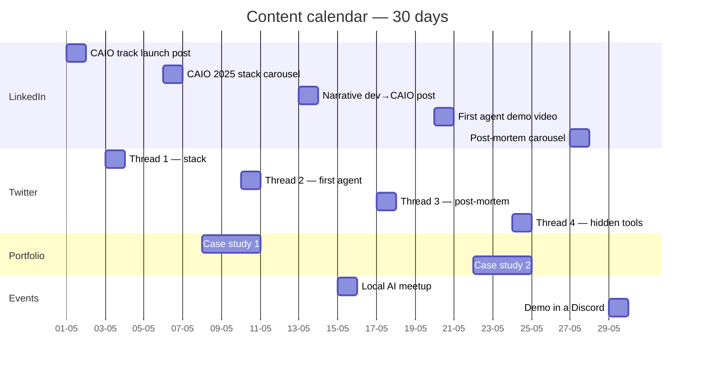

### Weekly content table

| Week | LinkedIn | Twitter | Portfolio | Offline |
|------|----------|---------|-----------|---------|
| 1 | Launch post + stack carousel | 2 threads + 10 replies | Publish portfolio v1 | Join 2 Discords |
| 2 | Narrative transition post | 1 thread + 12 replies | Publish case study 1 | Sign up local meetup |
| 3 | Agent demo video | 1 post-mortem thread | Update tools map | Present project at meetup |
| 4 | Learnings carousel | 1 hidden tools thread | Publish case study 2 | Request 3 peer reviews |

## Key takeaways — Module 06

- Build in Public replaces 10 years of authority with 6 months of regular publishing.
- LinkedIn and Twitter play different roles: recruiters vs peers. You need both.
- 4 post formats are enough: system carousel, narrative text, demo video, curated list.
- 30 days of cadence = base of your CAIO audience.

**Module 06 deliverable:** 30-day content plan filled, first 2 posts published before end of week.

---

---

# Module 07 — Find your first mission or first AI client

**Duration: 1h30 · Format: dev-adapted sales strategy + prospecting templates**

## Module objectives

By the end of this module, you will be able to:

1. Identify the **three paths** most realistic for landing a CAIO mission without established network.
2. Propose a **short free mission** that generates your first client testimonial.
3. Use the **CAIO Registry** and relevant platforms to be *found* rather than searching.
4. Have your complete **junior CAIO prospecting kit**.

## 7.1 — The three paths to land your first mission

When you start from zero (no network, no logo on your CV), you have only three viable paths. All others are illusions or accidents.

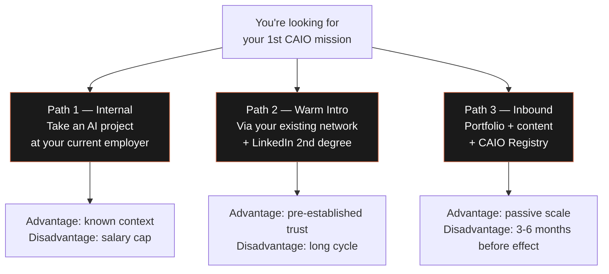

### Path 1 — Take an internal AI project

This is the path 70% of future CAIOs take without knowing it. You're already employed. You already have a context, a budget, a team. Propose to your management an AI POC that solves a real internal problem.

**Protocol:**

| Step | Action | Duration |
|------|--------|----------|
| 1 | Identify 3 repetitive non-AI workflows in your organization | 1 week |
| 2 | Estimate annual impact in $ for each | 2 days |
| 3 | Write a 1-page "AI Project #1" memo with benefit + cost + timeline | 1 day |
| 4 | Propose to your manager a 2-3 week POC at zero budget | 30 minutes |
| 5 | Ship + document for your portfolio | 3 weeks |
| 6 | Formally request the "AI Lead" role on the team | 15 minutes |

### Path 2 — Warm intro via your existing network

You have more network than you think. List all people you've worked with in the last 5 years — not just CTOs, but also PMs, designers, peer devs who changed companies.

| Contact type | Mission probability | Approach |
|---------------|---------------------|----------|
| Former CTO / lead | High | Direct message: "I built [X], think [their new company] has a use case?" |
| Former PM | Medium | Same thing, looking through them for their current CTO |
| Former peer dev | Low (direct) | But they open doors: "Who do you know with an AI need?" |
| LinkedIn 2nd degree | Very low (cold) | Only use after publishing 4 weeks of content |

**Warm intro message template:**

```
Hey [Name],

[Personal context: 2-3 natural lines, no copy-paste]

I'm reaching out because I pivoted to the CAIO (Chief AI Officer) role
and just shipped [CONCRETE PROJECT] for [CONTEXT].

Impact: [1 NUMBER].

I know [THEIR COMPANY] probably has similar workflows.
If you see someone internally who might be interested
in a 3-week POC, I'd take 15 min to chat.

No pressure if it's not the right timing.

Cheers,
[You]
```

### Path 3 — Inbound via portfolio + content + registry

This is the slowest path to start but the most scalable. Once ignited, it brings you missions without active effort.

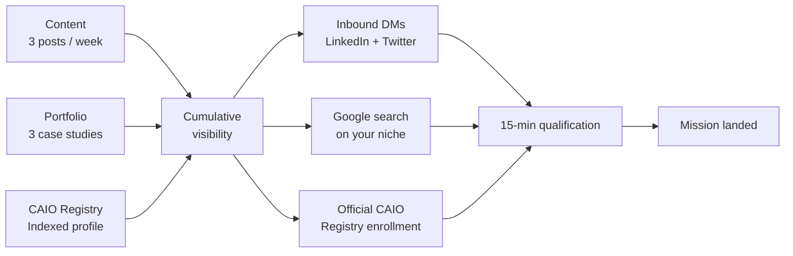

## 7.2 — Propose a short free mission to create the first testimonial

The first testimonial is worth more than the first payment. Here's the mechanic.

### The 2-week free mission

**Rules:**

| Rule | Reason |
|------|--------|
| Max 2 calendar weeks | Avoids "project that drags on" effect |
| Ultra-defined scope in writing (1 page) | No mission creep |
| Publicly documentable deliverable (with client consent) | Feeds your portfolio |
| Explicit written testimonial + LinkedIn recommendation | That's *the* price of free |
| Signed agreement on IP and communication rights | Protects both parties |

**Proposal template:**

```markdown
# Proposal — Free 2-week POC

## Context
[What I understood of your problem.]

## Scope
**In scope:**
- [Item 1]
- [Item 2]
- [Item 3]

**Out of scope:**
- [What I won't do]
- [V1 limits]

## Deliverables
- [ ] Functional deployed agent
- [ ] Technical README
- [ ] 5-min demonstration Loom
- [ ] 30-min retrospective with you

## My asks in exchange
- Written testimonial (1 paragraph) usable on my portfolio
- Public LinkedIn recommendation
- Right to publish an anonymized case study (no sensitive data)
- 15-min intro to 1 other leader in your network

## Timeline
- Day 1-3: discovery + setup
- Day 4-10: build
- Day 11-13: tests + doc
- Day 14: demo + retro

Signed: [You] + [Client] — date.
```

## 7.3 — The CAIO Registry and platforms to be found

Beyond your active efforts, you must enroll in the directories where buyers search.

| Platform | Audience | Enrollment effort | Priority |
|----------|----------|----------------------|----------|
| CAIO Registry Agentik | Companies looking for a CAIO | 15 min | Very high |
| Malt | Freelance clients EU | 1h profile | High |
| Comet, FreelanceRepublik | Tech clients EU | 1h profile | Medium |
| Toptal | Premium US clients | 5-10h (technical test) | Target at M+6 |
| LinkedIn Open to Work | Recruiters | 5 min | Immediate |
| AngelList / Wellfound | AI startups | 30 min | High if targeting startup |
| Lunchclub | Auto warm intros | 20 min / week | Medium |
| Upwork | International clients | 1h profile | Low (compressed pricing) |

### Optimized CAIO profile checklist (valid on all platforms)

| Element | Example |
|---------|---------|
| Title | "Freelance CAIO | I deploy your first AI agent in 3 weeks" |
| Tagline | "Full-stack dev turned CAIO — I help SMBs go from POC to MVP in 30 days" |
| Target day rate | $700-1000/d at start, $1200-1800/d after 3 missions |
| Linked portfolio (minimum 3) | Agent, site, case study |
| Availability | "2 days/week for 3 months" or "full-time 3 months" |
| Certifications | CAIO Registry enrollment, Agentik Academy training |

## 7.4 — Deliverable: junior CAIO prospecting kit

You leave this module with a complete kit:

1. **List of 20 warm contacts** sorted by mission probability (path 2)
2. **Internal project memo** if you're employed (path 1)
3. **Complete profiles** on: LinkedIn, Twitter, CAIO Registry, Malt (path 3)
4. **Message templates**: warm intro, free mission, follow-up
5. **Calendar link** Cal.com or Calendly for 15-min qualifications
6. **Objection kit**: 10 typical objections + written response

### The 10 typical objections of a first prospect

| Objection | Response frame |
|-----------|-----------------|
| "You only have one year of AI experience" | "I have 6 years in dev + 18 months in AI production. Here are 3 shipped projects." |
| "We've already tried ChatGPT internally" | "ChatGPT isn't an agent. An agent can *act* on your data and tools. Watch." |
| "It's too expensive" | "POC is at $X. Estimated annual gain is $Y. Payback < 2 months." |
| "We prefer to wait" | "Totally valid. Risk: every quarter of waiting pays in competitive advantage your competitors take." |
| "We have an internal dev who can do it" | "Perfect. I can help them start in 2 weeks instead of 4 months, and train the team." |
| "AI hallucinates too much" | "In a well-architected system with RAG + validation, error rate drops to 3-5%." |
| "We don't have data" | "Most first use cases need no custom data. Look at my CV triage agent." |
| "We want packaged solutions" | "I can recommend X or Y depending on your case. I sell my expertise, not lock-in." |
| "It's complicated to get approved" | "I'll come present 20 min to your exec committee with quantified ROI." |
| "We want custom but cheaper" | "Cheapest custom is a well-scoped 3-week POC. Beyond that is scope creep." |

## Key takeaways — Module 07

- Three viable paths without network: internal project, warm intro, inbound via portfolio + registry.
- First mission can be free if it brings you a public testimonial and case study rights.
- CAIO Registry and Malt are your two primary inbound levers to activate today.
- A prospecting kit isn't a marketing plan — it's a system running 5 minutes per day.

**Module 07 deliverable:** complete junior CAIO prospecting kit, with first message sent before end of week.

---

---

# Module 08 — 12-month roadmap: from junior CAIO to serious revenue

**Duration: 1h00 · Format: personal planning + quarterly milestones**

## Module objectives

By the end of this module, you will have:

1. Chosen your **priority path** among the three options (permanent, freelance, founder).
2. Detailed your **quarterly milestones** over 12 months with deliverables and metrics.
3. Understood what the **Agentik core training** adds to this free track.
4. Produced **your personal roadmap** with scheduled monthly review.

## 8.1 — The three possible monetization paths

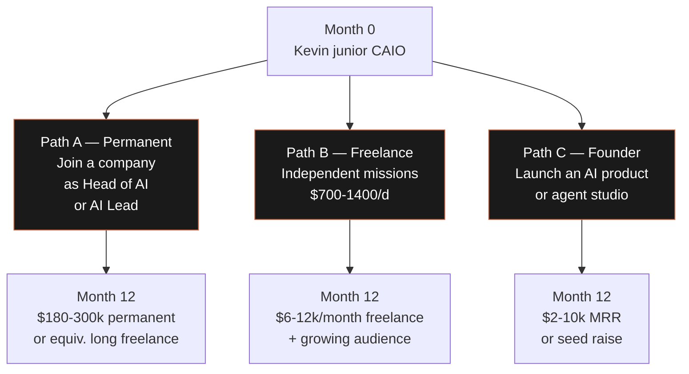

### How to choose your path?

| Criterion | Permanent | Freelance | Founder |
|-----------|-----------|-----------|---------|
| Need for financial stability | High | Medium | Low |
| Risk tolerance | Low | Medium | High |
| Taste for sales | Low | Medium | High |
| Ability to live 3-6 months without income | Not required | Useful | Essential |
| Leverage ambition (spend time vs your business) | Low | Medium | High |
| Typical month 12 (gross income) | $13-20k/month | $10-15k/month | -$5 to +$5k/month |

### Typical profile per path

| Path | Typical Kevin profile |
|------|------------------------|
| Permanent | Kevin has a family, mortgage, seeks stability, wants structured frame |
| Freelance | Kevin likes autonomy, tolerates income variance, no massive fixed costs |
| Founder | Kevin has a strong idea, tolerates 12 months of low income, wants long-term leverage |

## 8.2 — Quarterly milestones: the march plan

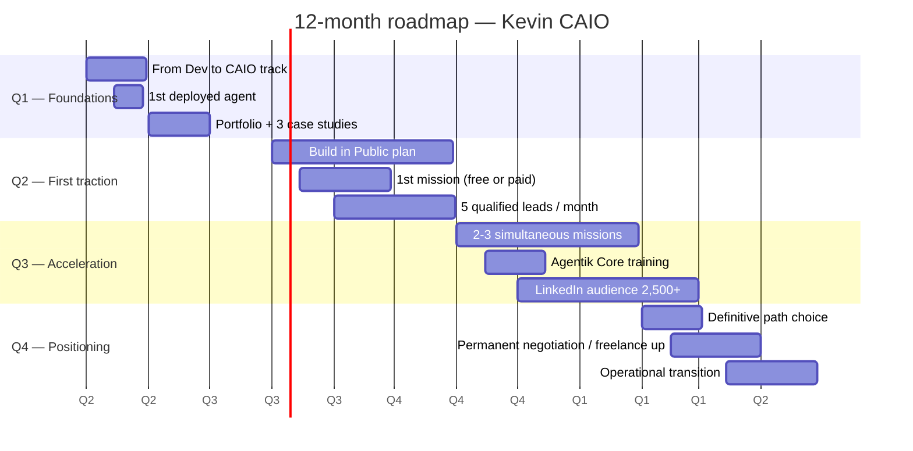

### Q1 detail — Foundations (months 0-3)

| Month | Goal | Deliverable | Success metric |
|-------|------|-------------|-----------------|
| M1 | Complete From Dev to CAIO track | 8 modules + 8 deliverables | 100% completed |
| M2 | Ship 1 agent + 1 case study | Repo + Loom + article | 1 live agent + 300 article views |
| M3 | Publish portfolio + content plan | Deployed site + 10 posts published | 100 visitors/month on portfolio |

### Q2 detail — First traction (months 4-6)

| Month | Goal | Deliverable | Success metric |
|-------|------|-------------|-----------------|
| M4 | Build in Public cadence established | 3 posts/week | 500 LinkedIn followers |
| M5 | 1st mission landed | Contract + proposal | Signed mission (even free) |
| M6 | 1st testimonial + 2nd mission | Recommendation + contract | 1st client payment |

### Q3 detail — Acceleration (months 7-9)

| Month | Goal | Deliverable | Success metric |
|-------|------|-------------|-----------------|
| M7 | 2-3 simultaneous missions | Contracts + deliverables | $8-12k MRR freelance |
| M8 | Agentik Core training (if not done) | 3 deployed systems | Certified CAIO access |
| M9 | Organized lead pipeline | 10 qualifications/month | 30% closing rate |

### Q4 detail — Positioning (months 10-12)

| Month | Goal | Deliverable | Success metric |
|-------|------|-------------|-----------------|
| M10 | Definitive A/B/C path choice | Documented decision | Public announcement of direction |
| M11 | Rate up / signing negotiation | Revised contract | 10-15% increase |
| M12 | Operational transition | Updated system + Y2 roadmap | Target income achieved |

## 8.3 — What the Agentik core training adds on top

This *From Dev to CAIO* track gives you method, framework, and first deliverables. It deliberately omits three things that only the $2,000 core training provides:

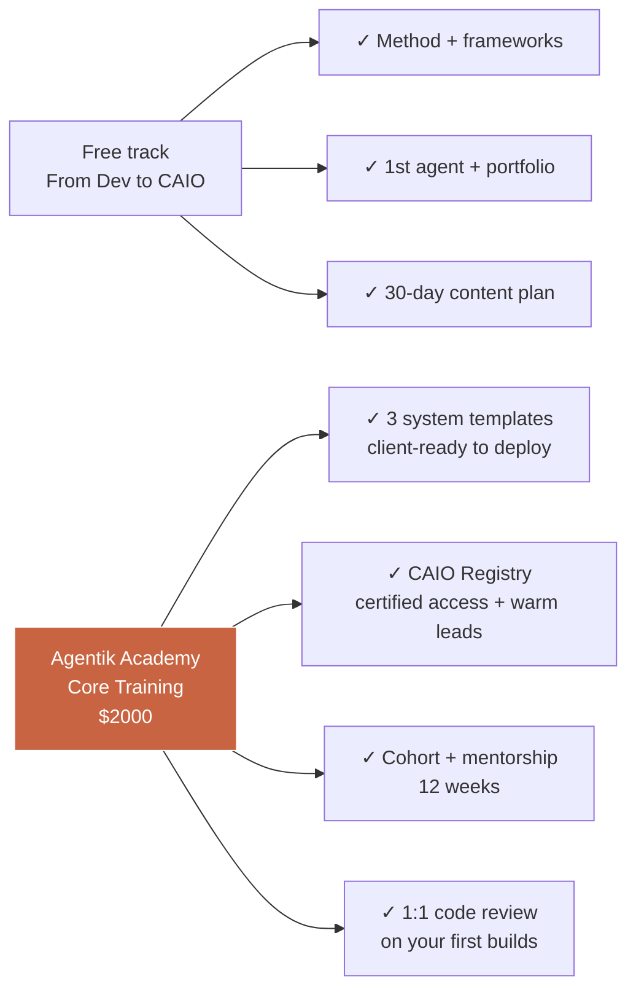

### Detailed comparison

| Dimension | Free track | Core training |
|-----------|------------|----------------|
| Duration | 14h autonomous | 12 weeks with cohort |
| System templates | 0 (build from scratch) | 3 (Triage, FeedbackLens, Support Agent) |
| Community support | Public (Twitter, Discord) | Private cohort + dedicated Slack |
| 1:1 mentoring | 0 | 4 × 45-min sessions |
| Code reviews | 0 | Unlimited during 12 weeks |
| CAIO Registry access | Standard enrollment | Certified profile + highlighted |
| Warm leads | 0 | Warm intros from the Registry |
| Price | $0 | $2,000 |
| Target ROI (if mission at $5k) | On your effort | Payback in 1 mission |

**Expected frustration at module 3:**

> *"I wish I had the 3 full systems as a base instead of starting from zero."*

That's normal. That's intentional. The free track proves you can build. The core training gives you the bricks to *ship faster* to clients and bank more missions per quarter.

## 8.4 — Deliverable: your personal 12-month roadmap

You'll fill and publish (at least on a private page of your portfolio) your personal roadmap. It becomes your dashboard, reviewed monthly.

```markdown
# My CAIO roadmap — 12 months

**Start date:** 2026-05-01
**Chosen path:** [A / B / C]
**M12 goal:** [income / role / MRR]

## Q1 — Foundations
- [ ] Complete 8 modules of the track
- [ ] Ship 1st agent (chosen use case: ______)
- [ ] Publish portfolio + 3 case studies

## Q2 — First traction
- [ ] 500 LinkedIn followers
- [ ] 1st mission (even free)
- [ ] 1st public testimonial

## Q3 — Acceleration
- [ ] $8k MRR freelance OR permanent signing
- [ ] 3 Agentik systems mastered
- [ ] Pipeline of 10 qualified leads/month

## Q4 — Positioning
- [ ] Definitive A/B/C path confirmed
- [ ] Target M12 income achieved: $_____
- [ ] Y2 roadmap defined

## Monthly review — date: 1st of month, 1h
- Month metrics: _____
- Lesson learned: _____
- Adjustment: _____
```

## Key takeaways — Module 08

- Three monetization paths: permanent (stability), freelance (variance), founder (leverage).
- The 12-month roadmap articulates in 4 quarters: foundations → traction → acceleration → positioning.
- The free track proves you can. The core training gives you the bricks to ship at scale.
- A monthly 1h review is the real discipline that separates a written roadmap from an executed one.

**Module 08 deliverable:** documented 12-month personal roadmap + monthly review date scheduled in calendar.

---

---

# Conclusion — The CAIO you become is the CAIO you build publicly

You've completed 14 hours of training. You have 8 concrete deliverables. You have a defendable public positioning.

What no one told you before starting: the CAIO is not a title someone gives you. It's a positioning you occupy through repeated proof. Every week you publish, every month you ship an agent, every quarter you move your metrics — you reinforce that position.

The market will normalize in the next 24-36 months. Profiles that built authority between 2025 and 2027 will bank the first big contracts. Profiles that waited will face mature competition, massive certifying schools, and compressed salaries.

You're ahead because you chose to invest 14 hours while others watch demos on Twitter.

What you do **tonight** determines where you'll be in 12 months. Start with the first action of Module 01 — the self-diagnostic. Fill it. Publish it, even in a private version. Then advance, module by module, deliverable by deliverable.

See you at month 12.

— *The Agentik {OS} team*

---

## Appendices

### Appendix A — CAIO glossary

| Term | Short definition |
|------|-------------------|
| Agent | AI system capable of acting on external tools, not just responding |
| RAG (Retrieval-Augmented Generation) | Technique that feeds the right documents to the model before it answers |
| MCP (Model Context Protocol) | Protocol that standardizes connections between agents and tools |
| Orchestrator | Software layer that drives one or more agents in a workflow |
| Vector database | Storage optimized to search by semantic similarity |
| Fine-tuning | Training a model on your own corpus |
| Hallucination | Production by the model of false information presented as true |
| Semantic cache | Cache that matches requests by meaning, not exact string |
| Feature store | Storage of pre-computed signals for online inference |
| Inference | Call to the model to obtain a response |

### Appendix B — Final track checklist

```markdown
# From Dev to CAIO Track — Delivery checklist

## Module 01
- [ ] CAIO self-diagnostic completed
- [ ] 3 actions at 7 days identified

## Module 02
- [ ] Personal CAIO tools map published
- [ ] Next.js + Convex + Claude environment set up

## Module 03
- [ ] 1st agent deployed on Vercel
- [ ] Portfolio README written
- [ ] 5-min Loom recorded

## Module 04
- [ ] 3-version elevator pitch written
- [ ] Tested on 2 real people

## Module 05
- [ ] One-page portfolio deployed
- [ ] 3 case studies published
- [ ] GitHub restructured

## Module 06
- [ ] 30-day content plan filled
- [ ] First 2 posts published

## Module 07
- [ ] Complete prospecting kit
- [ ] 1st message sent
- [ ] Malt + CAIO Registry profiles submitted

## Module 08
- [ ] Personal 12-month roadmap
- [ ] Monthly review scheduled in calendar
```

### Appendix C — Resources to follow after the track

| Resource | Type | Frequency |
|----------|------|-----------|
| Agentik CAIO Registry | Directory | Weekly |
| Anthropic Engineering Blog | Blog | Weekly |
| Vercel AI Blog | Blog | Weekly |
| Convex Changelog | Product | Weekly |
| Twitter #buildinpublic | Conversation | Daily |
| AI Builders Meetup (your city) | Networking | Monthly |
| Agentik Core training | Training | When you feel the ceiling |

---

**CAIO Academy — From Dev to CAIO Track**
*Agentik {OS} — agentik-os.com*
*Version 1.0 — 2026*
