# CAIO Academy — From Dev to CAIO Track

**Le parcours complet pour passer de développeur exécutant à Chief AI Officer recherché**

**Public cible :** Kevin — Développeur ou PM ambitieux
**Durée du parcours :** 14 heures de contenu structuré
**Horizon de transformation :** 12 mois
**Format :** 8 modules de formation professionnelle, livrables concrets, templates déployables

**Agentik {OS} — agentik-os.com**

---

## Préface — Pourquoi ce parcours existe

Tu es développeur. Tu sais coder. Tu livres des features qui marchent, tu maîtrises ton IDE, tu comprends les systèmes distribués. Peut-être même que tu as déjà joué avec l'API d'OpenAI, intégré Claude dans un projet side, ou écrit un petit agent qui tourne sur ton laptop.

Mais tu sens un plafond. Tu vois des gens qui, il y a 18 mois à peine, ne codaient pas aussi bien que toi, lever des rounds à 2M€ sur des produits IA. Tu vois des ex-développeurs se repositionner comme « AI Architect », « Head of AI », « Chief AI Officer » — et facturer trois à dix fois ce que tu factures. Tu observes que la valeur marché bascule vers un profil que tu ne portes pas encore, et tu te demandes : *comment je traverse cette ligne ?*

Ce parcours répond à cette question. Pas en théorie. En protocole.

Le rôle de CAIO n'est pas une promotion linéaire depuis le rôle de développeur. C'est un **changement de registre**. Tu arrêtes de vendre ta capacité à exécuter du code pour commencer à vendre ta capacité à concevoir des systèmes, à orienter une stratégie IA d'entreprise, à traduire du business en architecture agentique, et à porter un portfolio public qui te rend *trouvable* plutôt que demandeur.

Ce que tu vas construire en 14 heures de formation ne remplace pas 10 ans d'expérience — ça court-circuite les années que tu aurais passées à ne pas savoir ce qui compte vraiment. Tu vas apprendre la pyramide de valeur, maîtriser la stack CAIO 2025, déployer ton premier agent documenté, apprendre à parler aux décideurs, bâtir un portfolio public, te faire remarquer sans réseau établi, décrocher ta première mission, et tracer une roadmap 12 mois réaliste.

À la fin de ce parcours, tu n'auras pas un diplôme. Tu auras quelque chose de beaucoup plus rare : **une preuve publique que tu es déjà un CAIO en devenir**, et un chemin clair pour monétiser cette preuve.

---

## Avatar — Kevin, dev ou PM ambitieux

| Dimension | Profil |
|-----------|--------|
| Âge typique | 25-35 ans |
| Expérience | 2 à 7 ans en dev ou en produit |
| Stack habituelle | JavaScript/TypeScript, React, Node, Python ou PHP, un peu de DevOps |
| Rapport à l'IA | A testé ChatGPT, intégré une API OpenAI, lu 30 threads Twitter sur les agents |
| Frustration principale | « Je code des trucs que d'autres facturent 5x plus en les appelant IA » |
| Peur profonde | « Je vais rester exécutant pendant que la valeur marché glisse sous mes pieds » |
| Rêve accessible | Être un CAIO reconnu, freelance à 1 000€/jour ou CDI à 120-180k€, avec du levier |
| Signal d'achat | A déjà acheté au moins une formation dev premium (Udemy Pro, Zero to Mastery, Frontend Masters) |
| Blocage principal | Ne sait pas *quoi* produire publiquement pour paraître crédible |

---

## Vue d'ensemble du parcours

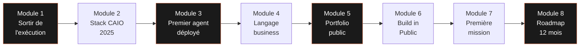

Chaque module est conçu pour produire **un livrable public et partageable**. À la fin du parcours, tu auras accumulé huit actifs concrets — un portefeuille de preuves, pas un empilement de certificats.

| Module | Durée | Livrable principal | Impact attendu |
|--------|-------|--------------------|----------------|
| 01 — Sortir du mode « exécutant » | 1h30 | Auto-diagnostic niveau CAIO actuel | Clarté sur le gap à combler |
| 02 — Maîtriser la stack CAIO 2025 | 2h00 | Carte des outils CAIO | Référentiel trimestriel réutilisable |
| 03 — Construire son premier agent | 3h00 | Agent déployé + README + Loom | Premier « projet CAIO » démontrable |
| 04 — Parler business | 1h30 | Script elevator pitch CAIO | Capacité à convaincre en 5 min |
| 05 — Portfolio CAIO public | 2h00 | Site portfolio one-page déployé | Présence web professionnelle |
| 06 — Se faire remarquer | 1h30 | Plan de contenu 30 jours | Audience de départ ciblée |
| 07 — Première mission | 1h30 | Kit de prospection junior CAIO | Premier client identifié |
| 08 — Roadmap 12 mois | 1h00 | Roadmap personnelle détaillée | Plan exécutable trimestre par trimestre |

---

---

# Module 01 — Sortir du mode « exécutant »

**Durée : 1h30 · Format : lecture structurée + exercice d'auto-diagnostic**

## Objectifs du module

À la fin de ce module, tu seras capable de :

1. Articuler clairement la **pyramide de valeur code → système → stratégie** et situer où tu opères aujourd'hui.
2. Identifier les **trois biais de pensée** qui bloquent la majorité des développeurs au niveau exécutant.
3. Lister au moins **cinq opportunités concrètes** de prise de leadership IA dans ton contexte actuel (emploi, mission, projet perso).
4. Remplir ton **auto-diagnostic CAIO** et comprendre ta trajectoire minimale vers le niveau suivant.

## 1.1 — La pyramide de valeur : code, système, stratégie

Il existe une hiérarchie claire dans la valeur marché des compétences tech. Le salaire, le taux journalier, l'intérêt que tu génères auprès des recruteurs et des clients — tout cela est directement corrélé à l'étage de la pyramide où tu passes la majorité de ton temps.

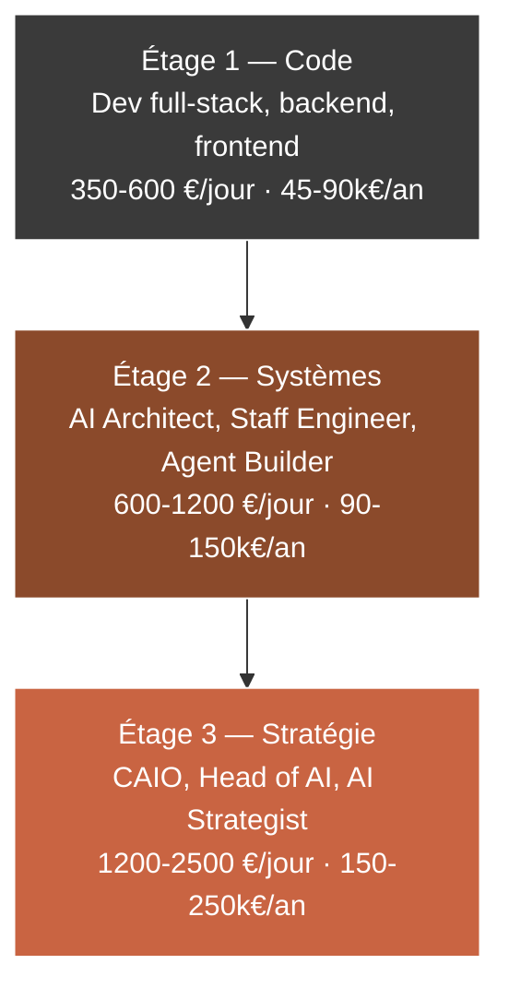

Cette pyramide n'est pas une échelle à gravir linéairement. C'est une matrice de focus. Un développeur senior peut passer 90 % de son temps à l'étage 1 (code) tout en touchant occasionnellement à l'étage 2 (architecture). Un CAIO confirmé passera 70 % à l'étage 3 (stratégie), 25 % à l'étage 2 (systèmes) et 5 % à l'étage 1 (code, mais généralement pour prototyper ou valider une idée).

**Ce qui distingue les trois étages :**

| Dimension | Étage 1 — Code | Étage 2 — Systèmes | Étage 3 — Stratégie |
|-----------|----------------|---------------------|---------------------|
| Horizon | Sprint (1-2 sem) | Trimestre | Année à 3 ans |
| Question centrale | « Comment faire ceci ? » | « Comment orchestrer cela ? » | « Pourquoi faire cela ? » |
| Unité de livraison | Feature, ticket, PR | Architecture, pipeline, agent | Roadmap, OKR IA, gouvernance |
| Mesure de succès | Code qui marche | Système qui scale | Avantage concurrentiel durable |
| Interlocuteur principal | Tech lead, PO | CTO, VP Engineering | CEO, COO, Comex |
| Levier | 1x (toi qui codes) | 10x (équipe qui suit ton architecture) | 100x (organisation qui exécute ta stratégie) |
| Commoditisation | Forte (juniors + LLMs) | Moyenne | Faible (expérience + jugement) |

**La bascule cruciale** se produit quand tu passes de « je suis payé pour exécuter du code » à « je suis payé pour décider ce qui doit être codé, par qui, et pourquoi ». Cette bascule n'est pas technique. Elle est cognitive.

## 1.2 — Comment les CAIO pensent différemment des devs

Un CAIO n'est pas simplement un développeur qui aurait ajouté « IA » à son profil LinkedIn. C'est un profil qui a internalisé trois déplacements de pensée que la plupart des développeurs n'opèrent jamais.

### Déplacement 1 : De la feature à la capacité

Un développeur pense en **features** : un bouton, un formulaire, un endpoint, une page. Il résout des problèmes discrets.

Un CAIO pense en **capacités** : une capacité est un *potentiel d'action* réutilisable par le système. Un chatbot n'est pas une feature — c'est la capacité de « répondre à du texte naturel » appliquée à un cas d'usage. Cette même capacité peut servir au support client, à l'aide interne, à la génération de documentation, à la qualification de leads.

Quand tu raisonnes en capacités, tu vois automatiquement la réutilisabilité, les économies d'échelle, et les architectures modulaires. Tu cesses de proposer « on va faire un chatbot » et tu commences à proposer « on déploie une capacité conversationnelle que cinq équipes vont consommer via une API interne ».

### Déplacement 2 : Du code vers la donnée

Un développeur pense à la qualité de son code : lisibilité, tests, performance, dette technique.

Un CAIO pense à la qualité des **données et des signaux** : est-ce que le feedback utilisateur remonte dans un pipeline exploitable ? Est-ce que chaque appel de l'agent est tracé ? Est-ce que la qualité du modèle peut être mesurée, et si oui, avec quelle métrique, et sur quelle fréquence ?

Le code est un coût qui se déprécie. Les données et les signaux sont un actif qui s'apprécie. Un CAIO passe une part significative de son temps à s'assurer que l'organisation *capte* ce qui compte, même quand rien n'est encore en production.

### Déplacement 3 : De la résolution à l'orientation

Un développeur reçoit des tickets et les résout. C'est son métier.

Un CAIO identifie des problèmes *avant* qu'ils ne deviennent des tickets et oriente les ressources pour les traiter à la racine. Il refuse des projets. Il dit non à des cas d'usage IA qui n'ont pas d'alignement stratégique. Il investit du temps dans des choses qui ne paieront pas avant 9 mois parce qu'il voit un avantage systémique que personne d'autre ne voit.

Cette capacité d'orientation est ce qui rend un CAIO irremplaçable. Elle ne s'apprend pas dans la documentation d'un LLM. Elle se développe par la pratique répétée de *choisir quoi ne pas faire*, et c'est pour ça que le premier exercice de ce parcours — l'auto-diagnostic — commence par te forcer à identifier trois choses que tu fais actuellement et que tu devrais **arrêter**.

## 1.3 — Identifier ses premières opportunités de leadership IA

Tu n'as pas besoin d'attendre un nouveau poste pour commencer à prendre du leadership IA. La plupart des CAIO que tu croiseras sur LinkedIn ont commencé par des micro-initiatives dans leur contexte actuel. Voici une grille pour identifier les tiennes.

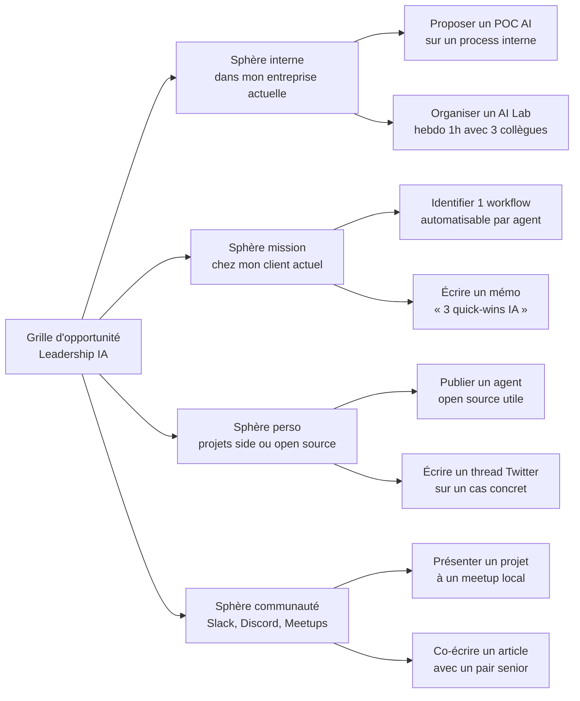

L'erreur classique du développeur qui veut basculer vers le CAIO est d'attendre le feu vert. *Le feu vert ne vient jamais.* Les opportunités de leadership IA dans ton contexte actuel ne sont pas des cases à cocher dans ton objectif annuel — elles sont des espaces que tu occupes avant que quiconque te les donne.

**Heuristique pratique :** si tu peux répondre « oui » à ces trois questions pour une opportunité, prends-la.

| Question | Pourquoi ça compte |
|----------|---------------------|
| Puis-je produire un résultat visible en moins de 30 jours ? | Évite les projets fantômes qui n'aboutissent jamais |
| L'impact peut-il être quantifié, même grossièrement ? | Crée une preuve de valeur communicable |
| Puis-je ensuite publier ce résultat (cas d'usage, post, repo) ? | Transforme un projet interne en actif de marque personnelle |

## 1.4 — Livrable : auto-diagnostic niveau CAIO actuel

L'auto-diagnostic est structuré en cinq axes, chacun noté de 1 à 5. Remplis-le honnêtement. Pas pour te rassurer — pour savoir où tu dois investir tes 14h de formation en priorité.

| Axe | Question d'ancrage | Ton score (1-5) | Niveau attendu en fin de parcours |
|-----|--------------------|------------------|-------------------------------------|
| Technique IA | Peux-tu déployer un agent en production en moins de 3h ? | ___ | 4/5 |
| Vision système | Peux-tu dessiner l'architecture d'un pipeline RAG au tableau ? | ___ | 4/5 |
| Langage business | Peux-tu expliquer un projet IA en 5 min à un non-tech sans jargon ? | ___ | 4/5 |
| Présence publique | As-tu un portfolio CAIO indexé sur Google ? | ___ | 4/5 |
| Réseau CAIO | Connais-tu personnellement au moins 3 CAIO ou Heads of AI ? | ___ | 3/5 |

**Interprétation :**

- **Score total ≤ 10** : tu es en phase de découverte. Les modules 02, 03 et 05 sont tes priorités absolues.
- **Score total 11-15** : tu es en phase d'accélération. Les modules 04, 06 et 07 vont te faire basculer.
- **Score total 16-20** : tu es proche de la bascule. Le module 08 te permet de cristalliser ta trajectoire.
- **Score total ≥ 21** : tu es déjà un CAIO en devenir non reconnu. Le parcours va formaliser ton positionnement.

## Points clés à retenir du Module 01

- La valeur marché est hiérarchisée sur trois étages : code, systèmes, stratégie. Ton salaire suit la médiane de l'étage où tu passes 70 % de ton temps.
- La bascule vers le CAIO est cognitive avant d'être technique : elle exige trois déplacements — feature → capacité, code → donnée, résolution → orientation.
- Les opportunités de leadership IA sont des espaces que tu occupes, pas des cases qu'on te donne.
- L'auto-diagnostic est ton point de départ objectif : il détermine sur quels modules tu dois investir le plus de temps.

**Livrable du Module 01 :** Auto-diagnostic CAIO rempli, identification des deux axes les plus faibles, et engagement écrit sur trois actions à prendre dans les 7 jours.

---

---

# Module 02 — Maîtriser la stack CAIO 2025

**Durée : 2h00 · Format : lecture structurée + cartographie active + setup de l'environnement**

## Objectifs du module

À la fin de ce module, tu seras capable de :

1. Nommer et situer les **quatre couches de la stack CAIO** (LLMs, orchestrateurs, bases vectorielles, interfaces) et les produits leaders de chaque couche.
2. Installer en moins de 30 minutes un **environnement complet Next.js + Convex + Composio + Claude** prêt à recevoir ton premier agent.
3. Décider **quand aller en no-code** (Zapier, Make, n8n, Retool) versus **quand aller en code custom**.
4. Produire ta propre **carte des outils CAIO**, mise à jour chaque trimestre et publiée sur ton portfolio.

## 2.1 — La carte mentale de la stack CAIO

La stack CAIO 2025 n'est pas une pile monolithique. C'est un empilement de quatre couches qui interagissent via des contrats (APIs, SDKs, protocoles comme MCP). Un CAIO compétent connaît au moins deux options viables par couche et sait justifier ses choix.

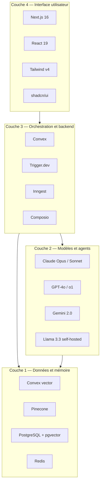

Ce n'est pas parce qu'un outil est en bas de la pile qu'il est moins important. Au contraire : les choix faits à la couche 1 (données) conditionnent tout ce qui se passe au-dessus. Un CAIO qui choisit la mauvaise base vectorielle à l'échelle 10k documents va vivre un enfer à l'échelle 10M.

## 2.2 — Inventaire raisonné des outils clés

Pour chaque couche, voici les options que tu dois connaître a minima, avec leur positionnement marché et la décision type qu'un CAIO doit pouvoir justifier.

### Couche 1 — Données et mémoire

| Outil | Type | Force principale | Quand le choisir |
|-------|------|-------------------|-------------------|
| Convex vector | Intégré à Convex | Zéro ops, réactivité native | Projets Next.js + Convex, volume < 10M vecteurs |
| Pinecone | Service cloud managé | Scale extrême, filtrage hybride | Production haute charge, budget OK |
| PostgreSQL + pgvector | Open source, auto-hébergeable | Contrôle total, souveraineté | Environnements contraints (santé, public, UE) |
| Redis / Upstash | Cache + vector + KV | Latence < 5ms | Cache sémantique, sessions, queues |
| Weaviate | Open source, GraphQL natif | Recherche hybride sémantique + mots-clés | Besoin de recherche mixte fine |

### Couche 2 — Modèles et agents

| Outil | Provider | Force principale | Quand le choisir |
|-------|----------|-------------------|-------------------|
| Claude Opus 4 | Anthropic | Raisonnement long, agentique | Orchestrateurs, tâches longues, code |
| Claude Sonnet 4 | Anthropic | Rapport qualité/prix | 80 % des cas d'usage production |
| Claude Haiku 4.5 | Anthropic | Ultra rapide, pas cher | Classification, extraction, routing |
| GPT-4o | OpenAI | Multimodalité, écosystème | Vision, voice, intégrations existantes |
| Gemini 2.0 | Google | Contexte très long, prix | Analyse de documents massifs |
| Llama 3.3 70B | Meta, self-host | Souveraineté, coût fixe | Données sensibles, volume très élevé |

### Couche 3 — Orchestration et backend

| Outil | Type | Force principale | Quand le choisir |
|-------|------|-------------------|-------------------|
| Convex | Backend réactif temps réel | DX exceptionnelle, fonctions typées | Apps web avec IA embarquée |
| Trigger.dev v4 | Background jobs orientés agents | Retries, batching, durabilité | Workflows longs, agents autonomes |
| Inngest | Event-driven serverless | Fonctions durables, typage fort | Pipelines événementiels |
| Composio | Intégrations agents prêtes | 250+ connecteurs, auth gérée | Agents qui doivent agir sur Gmail, Slack, Notion, etc. |
| Pipedream | iPaaS code-first | Flexibilité + connecteurs | Prototypes agents multi-outils rapides |
| LangChain / LangGraph | Framework agents | Graphes d'état complexes | Workflows agents multi-étapes |

### Couche 4 — Interface utilisateur

| Outil | Rôle | Force principale | Quand le choisir |
|-------|------|-------------------|-------------------|
| Next.js 16 | Framework fullstack | App Router, React Server Components | Standard de fait en 2025 |
| React 19 | Librairie UI | Actions, use() hook, compiler | Implicit avec Next.js 16 |
| Tailwind v4 | CSS utilitaire | Vélocité + cohérence | Tous projets UI modernes |
| shadcn/ui | Bibliothèque de composants | Copier-coller, ownership total | Apps internes, portfolios |
| Vercel AI SDK | Streaming IA côté client | Hooks React pour streaming LLM | Chatbots, assistants in-app |

## 2.3 — La stack CAIO en 30 minutes : Next.js + Convex + Composio + Claude

Voici la stack recommandée pour un premier agent déployé. Elle est *opinionated* — c'est le but. Un CAIO débutant qui passe trois semaines à choisir sa stack ne livre jamais de premier agent.

### Architecture cible

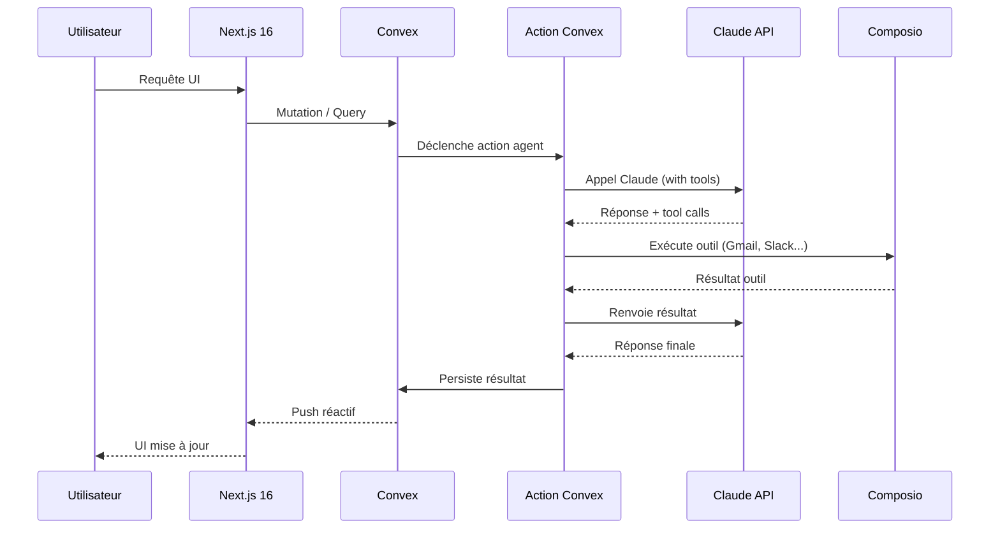

### Setup en 7 étapes

```bash
# 1. Scaffold le projet
npx create-next-app@latest mon-premier-agent \
  --typescript --tailwind --app --eslint

cd mon-premier-agent

# 2. Installer Convex
npm install convex
npx convex dev

# 3. Ajouter le SDK Claude
npm install @anthropic-ai/sdk

# 4. Ajouter Composio
npm install composio-core

# 5. Variables d'env (dans .env.local)
# ANTHROPIC_API_KEY=sk-ant-...
# COMPOSIO_API_KEY=...

# 6. Configurer shadcn/ui
npx shadcn@latest init -d
npx shadcn@latest add button input card textarea

# 7. Lancer en parallèle
npm run dev
# et dans un autre terminal
npx convex dev
```

### Exemple minimal d'action Convex agentique

```typescript
// convex/agent.ts
import { action } from "./_generated/server";
import { v } from "convex/values";
import Anthropic from "@anthropic-ai/sdk";

const anthropic = new Anthropic({
  apiKey: process.env.ANTHROPIC_API_KEY!,
});

export const askAgent = action({
  args: { prompt: v.string() },
  handler: async (ctx, { prompt }) => {
    const response = await anthropic.messages.create({
      model: "claude-sonnet-4-6",
      max_tokens: 1024,
      system: "Tu es un assistant CAIO. Tu aides des développeurs à penser en systèmes.",
      messages: [{ role: "user", content: prompt }],
    });

    const text = response.content
      .filter((b) => b.type === "text")
      .map((b) => b.text)
      .join("\n");

    await ctx.runMutation(internal.logs.insert, {
      prompt,
      response: text,
      tokensUsed: response.usage.input_tokens + response.usage.output_tokens,
    });

    return text;
  },
});
```

En 30 minutes tu as un backend réactif, un modèle puissant derrière, et un point d'entrée typé. À partir de là, chaque module du parcours ajoute une couche.

## 2.4 — No-code versus code custom : la matrice de décision

Une erreur que font beaucoup de devs qui veulent devenir CAIO : sur-coder. Le développeur pense que tout problème mérite un repo Git. Le CAIO sait que **90 % des premiers POCs doivent rester en no-code** pour valider la valeur avant d'investir du temps ingénieur.

| Critère | No-code (Zapier, Make, n8n, Retool, Bubble) | Code custom (Next.js + Convex + Claude) |
|---------|----------------------------------------------|------------------------------------------|
| Time-to-first-value | 2-8 heures | 2-10 jours |
| Coût démarrage | 20-100 €/mois | Temps ingé + infra |
| Scalabilité | Faible à moyenne (souvent plafond 10k-100k actions/mois) | Forte (serverless + réactif) |
| Customisation UX | Limitée à moyenne | Totale |
| Observabilité | Basique (logs plateforme) | Custom, jusqu'à OpenTelemetry |
| Sécurité / conformité | Dépend du provider | Totale (y compris on-premise) |
| Ownership | Faible (lock-in plateforme) | Total (code t'appartient) |
| Ideal pour | POC, workflows internes, automation < 10k/mois | Produit public, SaaS, scale, différenciation |

**Règle heuristique du CAIO :**

1. **POC en no-code**, toujours, tant que c'est techniquement possible.
2. Si la valeur est prouvée (usage réel, économie réelle, revenu réel) → **migrer en code** par couches.
3. Ne **jamais** commencer par le code si le problème n'est pas validé.

## 2.5 — Livrable : ta carte personnelle des outils CAIO

Tu vas produire un document markdown (et idéalement une page de ton portfolio) qui liste **chaque outil que tu maîtrises ou veux maîtriser**, avec pour chacun :

- Nom de l'outil
- Couche de la stack
- Niveau personnel (exploré / utilisé une fois / maîtrisé)
- Décision : *je garde* / *j'explore* / *j'élimine*
- Mise à jour trimestrielle (date de dernière revue)

```markdown
# Ma Carte des Outils CAIO — Q2 2026

## Couche 1 — Données et mémoire
- **Convex** — maîtrisé — garder ✅ — dernière revue : 2026-04
- **Pinecone** — exploré — explorer plus 🔍 — dernière revue : 2026-04
- **pgvector** — utilisé une fois — garder ✅ — dernière revue : 2026-04

## Couche 2 — Modèles
...
```

Cette carte devient un **actif de marque personnelle** : elle prouve que tu as une opinion structurée sur l'écosystème, ce que peu de développeurs peuvent démontrer.

## Points clés à retenir du Module 02

- La stack CAIO 2025 s'organise en 4 couches : données, modèles, orchestration, interface.
- Tu dois connaître au moins 2 options viables par couche et savoir justifier tes choix.
- 90 % des POCs doivent démarrer en no-code avant de justifier du code custom.
- Ta carte des outils, mise à jour chaque trimestre, est un actif de marque personnelle sous-exploité.

**Livrable du Module 02 :** ta carte personnelle des outils CAIO, publiée sur ton portfolio (qui sera construit au module 05).

---

---

# Module 03 — Construire son premier agent fonctionnel

**Durée : 3h00 · Format : walkthrough hands-on avec repo de référence**

## Objectifs du module

À la fin de ce module, tu auras :

1. Choisi un **cas d'usage simple à impact visible** en appliquant la grille CAIO.
2. Écrit, testé et **déployé un agent de bout en bout** sur Vercel en moins de 3 heures.
3. Produit un **README de niveau portfolio** qui explique le problème, la solution et les résultats.
4. Enregistré une **vidéo Loom de 5 minutes** qui montre le cas d'usage.

## 3.1 — Choisir son premier cas d'usage : la grille du CAIO débutant

Le piège classique du développeur qui commence les agents : choisir un sujet trop ambitieux (« un agent qui gère toute la compta ») ou trop technique (« un RAG sur 10M de documents »). Ni l'un ni l'autre ne servent ton positionnement CAIO au début.

Ton premier agent doit satisfaire **les cinq C** :

| Critère | Description | Pourquoi c'est crucial |
|---------|-------------|-------------------------|
| **Concret** | Résout un problème réel, pas un exercice | Crédibilité auprès de recruteurs / clients |
| **Communicable** | S'explique en une phrase à un non-tech | Partageable sur LinkedIn et en entretien |
| **Court** | Déployé en < 3h de travail réel | Évite l'effet « projet fantôme » |
| **Capturable** | Mesure d'impact possible (temps économisé, erreurs évitées) | Transforme un POC en preuve chiffrée |
| **Contenu** | Génère du matériel public (repo, post, vidéo) | Nourrit ton Build in Public (module 06) |

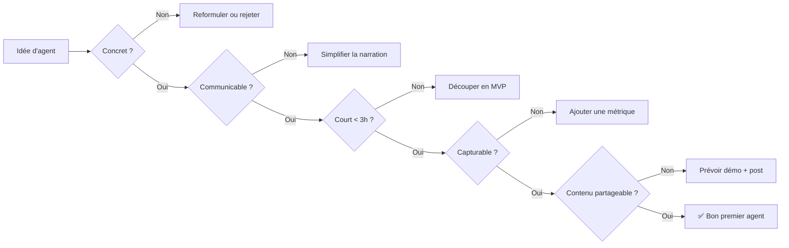

### 10 cas d'usage parfaits pour un premier agent CAIO

| # | Cas d'usage | Impact démontrable | Outils clés |
|---|-------------|---------------------|-------------|
| 1 | Agent de tri de CV (backlog RH) | « 200 CV triés en 8 min au lieu de 3h » | Claude + Composio Gmail |
| 2 | Résumé quotidien de X/Twitter ciblé | « 1h de veille économisée / jour » | Next.js + Claude |
| 3 | Assistant de réponse aux tickets support niveau 1 | « 40 % des tickets résolus sans humain » | Convex + Claude + Intercom API |
| 4 | Analyseur de feedback utilisateurs (Typeform, NPS) | « Insights en 2 min au lieu de 2h » | Claude + Vercel AI SDK |
| 5 | Générateur de briefs de contenu SEO | « 10 briefs / heure au lieu de 2 » | Claude + données SERP |
| 6 | Agent de reformulation d'emails en 3 tons | « Ton pro / cordial / direct en 1 clic » | Claude + Next.js |
| 7 | Lecteur de PDFs contractuels avec extraction de clauses | « Revue contrat en 10 min au lieu de 2h » | Claude + pdf-parse |
| 8 | Agent de rédaction LinkedIn (pas de publication automatique) | « Draft 5 posts / semaine en 15 min » | Claude + Next.js |
| 9 | Dashboard Convex avec Q&A sur les données | « Question business → réponse en langage naturel » | Convex + Claude |
| 10 | Agent de revue de code PR basique | « Detect 3 catégories d'erreurs avant merge » | Claude + GitHub API |

## 3.2 — Walkthrough : construire un agent de tri de CV en 3h

Prenons le cas d'usage 1 (agent de tri de CV) et déroulons-le de bout en bout. Tu pourras adapter le même pattern à n'importe quel cas de la liste.

### Heure 1 — Setup et contrat d'interface

**Objectif :** un projet Next.js + Convex qui tourne en local, avec un schéma de données pour les CVs et un endpoint qui reçoit un CV.

```typescript
// convex/schema.ts
import { defineSchema, defineTable } from "convex/server";
import { v } from "convex/values";

export default defineSchema({
  cvs: defineTable({
    filename: v.string(),
    rawText: v.string(),
    uploadedAt: v.number(),
    // Résultats de l'agent
    status: v.union(
      v.literal("pending"),
      v.literal("processing"),
      v.literal("scored"),
      v.literal("error")
    ),
    score: v.optional(v.number()), // 0-100
    verdict: v.optional(v.union(v.literal("fit"), v.literal("maybe"), v.literal("pass"))),
    reasoning: v.optional(v.string()),
    extractedFields: v.optional(v.object({
      name: v.string(),
      yearsExp: v.number(),
      stack: v.array(v.string()),
      languages: v.array(v.string()),
    })),
  }).index("by_status", ["status"]),
});
```

### Heure 2 — L'agent de scoring

**Objectif :** une action Convex qui lit un CV, appelle Claude avec un prompt structuré, et persiste un score + verdict + justification.

```typescript
// convex/agent.ts
import { internalAction } from "./_generated/server";
import { v } from "convex/values";
import Anthropic from "@anthropic-ai/sdk";
import { internal } from "./_generated/api";

const client = new Anthropic({ apiKey: process.env.ANTHROPIC_API_KEY! });

const SYSTEM_PROMPT = `Tu es un recruteur senior spécialisé en tech.
Tu reçois le texte brut d'un CV et tu dois produire un JSON strict :
{
  "name": "string",
  "yearsExp": number,
  "stack": ["string"],
  "languages": ["string"],
  "score": number (0-100),
  "verdict": "fit" | "maybe" | "pass",
  "reasoning": "string (max 2 phrases)"
}
Le poste cherché est un développeur full-stack TypeScript senior (5+ ans).
`;

export const scoreCV = internalAction({
  args: { cvId: v.id("cvs"), rawText: v.string() },
  handler: async (ctx, { cvId, rawText }) => {
    await ctx.runMutation(internal.cvs.setStatus, { cvId, status: "processing" });

    try {
      const response = await client.messages.create({
        model: "claude-sonnet-4-6",
        max_tokens: 1024,
        system: SYSTEM_PROMPT,
        messages: [{ role: "user", content: rawText }],
      });

      const jsonText = response.content
        .filter((b) => b.type === "text")
        .map((b) => b.text)
        .join("")
        .match(/\{[\s\S]*\}/)?.[0];

      if (!jsonText) throw new Error("Pas de JSON valide retourné");

      const parsed = JSON.parse(jsonText);

      await ctx.runMutation(internal.cvs.setResult, {
        cvId,
        score: parsed.score,
        verdict: parsed.verdict,
        reasoning: parsed.reasoning,
        extractedFields: {
          name: parsed.name,
          yearsExp: parsed.yearsExp,
          stack: parsed.stack,
          languages: parsed.languages,
        },
        status: "scored",
      });
    } catch (err) {
      await ctx.runMutation(internal.cvs.setStatus, { cvId, status: "error" });
      throw err;
    }
  },
});
```

### Heure 3 — UI minimale + déploiement Vercel

**Objectif :** une page Next.js avec un input de texte (ou upload PDF), qui affiche le résultat en temps réel via la réactivité Convex.

```typescript
// app/page.tsx
"use client";
import { useState } from "react";
import { useMutation, useQuery } from "convex/react";
import { api } from "@/convex/_generated/api";

export default function Page() {
  const [text, setText] = useState("");
  const submit = useMutation(api.cvs.submit);
  const latest = useQuery(api.cvs.latest);

  return (
    <main className="max-w-2xl mx-auto p-8">
      <h1 className="text-2xl font-bold mb-6">Agent de tri de CV</h1>
      <textarea
        value={text}
        onChange={(e) => setText(e.target.value)}
        className="w-full h-64 p-3 border rounded"
        placeholder="Colle ici le texte d'un CV..."
      />
      <button
        onClick={async () => {
          await submit({ filename: "manual-paste", rawText: text });
          setText("");
        }}
        className="mt-4 px-4 py-2 bg-black text-white rounded"
      >
        Analyser
      </button>
      <section className="mt-8 space-y-4">
        {latest?.map((cv) => (
          <article key={cv._id} className="border p-4 rounded">
            <header className="flex justify-between">
              <span className="font-semibold">
                {cv.extractedFields?.name ?? "..."}
              </span>
              <span className="text-sm">
                {cv.status === "scored"
                  ? `${cv.verdict?.toUpperCase()} — ${cv.score}/100`
                  : cv.status}
              </span>
            </header>
            {cv.reasoning && <p className="text-sm mt-2">{cv.reasoning}</p>}
          </article>
        ))}
      </section>
    </main>
  );
}
```

Déploiement :

```bash
# Déploiement Convex prod
npx convex deploy

# Déploiement Vercel (headless)
vercel --prod --token=$VERCEL_TOKEN
```

Tu as maintenant un agent réel, déployé, testable par n'importe qui avec un lien. Ça vaut plus que n'importe quel certificat Udemy.

## 3.3 — Documenter son agent : le format README portfolio

Un agent non documenté est un agent invisible. Les recruteurs et prospects ne vont pas lire ton code — ils vont lire ton README et regarder ta démo. Voici le squelette à copier.

```markdown
# Agent de tri de CV — CAIO Portfolio

## Problème
Les recruteurs passent en moyenne 3 heures pour trier 200 CVs sur un poste.
80 % de ce temps est mécanique (vérifier 5 critères simples).

## Solution
Agent IA qui lit un CV, extrait les champs structurés, et produit un verdict
FIT / MAYBE / PASS avec une justification en 2 phrases.

## Impact mesuré
- 200 CVs triés en 8 minutes (vs 3 heures)
- Verdict cohérent avec un recruteur humain à 87 % (sur 50 CVs de test)
- Coût modèle : ~0.04 € par CV

## Architecture
[Diagramme Mermaid ici]

## Stack
- Next.js 16 / React 19
- Convex (backend réactif + actions agent)
- Claude Sonnet 4.6
- Déploiement Vercel

## Limites connues
- Extraction imparfaite sur CVs en PDFs scannés (besoin d'OCR)
- Pas de détection de fraude (CVs enjolivés)

## Évolutions possibles
- Intégration Greenhouse / Lever
- Batch processing via Trigger.dev pour lots > 500
- Fine-tuning sur décisions passées du recruteur

## Démo
[Lien Loom 5 min]

## Live
[Lien Vercel]

## Code
[Lien GitHub]
```

## 3.4 — Livrable : agent déployé + documentation

**Checklist de livraison :**

- [ ] Repo GitHub public avec README au format ci-dessus
- [ ] Déploiement Vercel fonctionnel avec URL partageable
- [ ] Vidéo Loom de 3-5 minutes : problème → démo → stack → limites
- [ ] Post LinkedIn annonce (qui sera préparé au module 06)

## Points clés à retenir du Module 03

- Ton premier agent doit satisfaire les 5 C : Concret, Communicable, Court, Capturable, Contenu.
- 3 heures suffisent pour un agent déployé sur Next.js + Convex + Claude.
- Un agent non documenté est invisible — le README et la Loom comptent autant que le code.
- C'est la première pièce de ton portfolio CAIO, pas un side project anonyme.

**Livrable du Module 03 :** ton premier agent, live, documenté, démontré. *Note : dans la formation Core Agentik à 2 000 €, ce module s'enrichit de trois systèmes templates prêts à déployer — tri CV, analyse de feedback, assistant support — pour court-circuiter la phase de démarrage à froid.*

---

---

# Module 04 — Parler business : le dev qui convainc les décideurs

**Durée : 1h30 · Format : frameworks + exercices oraux + templates de scripts**

## Objectifs du module

À la fin de ce module, tu seras capable de :

1. Traduire tout projet IA technique en **valeur business chiffrée** (€, temps, risque, revenu).
2. Présenter n'importe quel projet IA en **5 minutes** à un interlocuteur non-technique.
3. Écrire une **proposition de valeur IA sans jargon** utilisable en sales ou en interne.
4. Disposer de ton **elevator pitch CAIO** personnel, calibré pour trois contextes (recruteur, client, investisseur).

## 4.1 — Le traducteur tech-business : les quatre conversions

Le développeur parle latences, frameworks, modèles. Le décideur écoute coûts, revenus, risques, différenciation. Ton rôle en tant que CAIO est de faire le pont, systématiquement.

| Langage dev | Traduction CAIO | Exemple |
|-------------|------------------|---------|
| « Le modèle a 94 % de précision » | « Sur 100 dossiers, 6 sont mal classés, et voici comment on les rattrape » | « On gagne 3h de revue humaine par jour et on évite 2 erreurs critiques / mois » |
| « J'ai mis en place un cache sémantique » | « On a réduit les coûts d'inférence de 60 % sans dégrader l'expérience » | « Économie de 18 000 €/an sur ce workflow » |
| « C'est un RAG avec reranking » | « L'assistant lit la bonne documentation interne avant de répondre, donc il ne hallucine plus » | « On passe d'un taux d'erreur de 22 % à 3 % sur les questions produits » |
| « On orchestre 3 agents via MCP » | « Trois modèles spécialisés coopèrent pour livrer un résultat meilleur qu'un modèle seul » | « Qualité de la réponse finale +35 % vs baseline GPT-4 seul » |
| « Pipeline serverless avec retry exponentiel » | « Même quand un fournisseur IA tombe, le système continue à fonctionner » | « 0 interruption utilisateur sur 3 incidents OpenAI en 2 mois » |

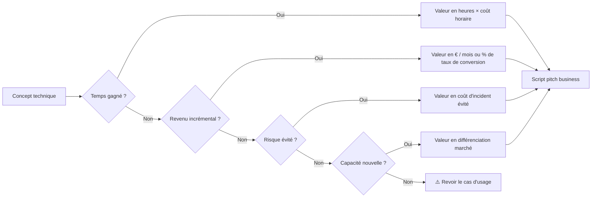

## 4.2 — Le pitch 5 minutes d'un projet IA

Cinq minutes, c'est le temps que tu auras typiquement pour convaincre un comité, un sponsor, ou un client. Voici la structure éprouvée.

| Minute | Contenu | Erreur à éviter |
|--------|---------|-----------------|
| 0:00 - 0:45 | Le problème, avec un chiffre qui fait mal | Commencer par la solution |
| 0:45 - 1:30 | L'état actuel et pourquoi il ne suffit plus | Lister des technos sans contexte |
| 1:30 - 3:00 | La solution en une phrase + démo visuelle | Détails d'architecture |
| 3:00 - 4:00 | L'impact chiffré (€, temps, qualité) | Estimations floues |
| 4:00 - 4:30 | Ce qu'il reste à faire + budget + délais | Demander un budget sans livrables |
| 4:30 - 5:00 | Une question puissante pour engager la discussion | Finir par « voilà, des questions ? » |

### Template de script — version universelle

```
[MINUTE 1 — PROBLÈME CHIFFRÉ]
Aujourd'hui, [CONTEXTE]. Nos équipes passent [X HEURES] par [PÉRIODE]
à faire [TÂCHE]. Ce n'est pas le temps le plus coûteux — c'est le temps
le plus démotivant. Et ça nous empêche de faire [LEVIER STRATÉGIQUE].

[MINUTE 2 — ÉTAT ACTUEL]
On a déjà tenté [SOLUTION PRÉCÉDENTE]. Ça a marché à [X %],
mais ça bute sur [LIMITE CONCRÈTE]. Les outils classiques
n'attaquent pas la racine : [DIAGNOSTIC].

[MINUTES 3-3 — SOLUTION + DÉMO]
Voici ce qu'on a construit : [UNE PHRASE]. Regardez.
[DÉMO LIVE DE 60 SECONDES]
Derrière, c'est [STACK EN UNE LIGNE]. Pas de magie : [POINT TECHNIQUE CLÉ].

[MINUTE 4 — IMPACT CHIFFRÉ]
Sur [PÉRIODE DE TEST], on a mesuré :
- [MÉTRIQUE 1 : gain de temps]
- [MÉTRIQUE 2 : qualité]
- [MÉTRIQUE 3 : coût]
Extrapolé à [ÉCHELLE], c'est [IMPACT ANNUEL EN €].

[MINUTE 5 — NEXT STEP]
Pour industrialiser, il faut [TROIS ÉLÉMENTS PRÉCIS].
Coût : [BUDGET]. Délai : [SEMAINES].
Ma question pour vous : [QUESTION ENGAGEANTE].
```

## 4.3 — Écrire une proposition de valeur sans jargon

La proposition de valeur n'est pas un slogan. C'est une phrase testable qui tient en trois éléments :

> **[POUR QUI]** qui **[FAIT QUOI]** et souffre de **[FRUSTRATION]**,
> **[NOM DE TA SOLUTION]** est **[CATÉGORIE]** qui **[BÉNÉFICE CLÉ]**.
> Contrairement à **[ALTERNATIVE ACTUELLE]**, nous **[DIFFÉRENCIATEUR]**.

**Exemple (agent de tri de CV) :**

> Pour les recruteurs tech qui reçoivent plus de 100 candidatures par poste et peinent à les trier sans sacrifier des heures de revue manuelle, **TriageCV** est un agent IA qui scanne chaque CV et produit un verdict justifié en 5 secondes. Contrairement aux ATS classiques qui se contentent de filtres par mots-clés, nous raisonnons sur l'expérience réelle du candidat et signalons les faux positifs.

**Checklist de la proposition de valeur :**

| Critère | OK ? |
|---------|------|
| Aucun terme technique (LLM, RAG, fine-tuning, agent, prompt...) | ☐ |
| Lecture à voix haute en moins de 20 secondes | ☐ |
| Un non-tech comprend sans te poser de question | ☐ |
| Le bénéfice est quantifiable ou testable | ☐ |
| Le différenciateur est défendable (pas « on est plus rapide ») | ☐ |

## 4.4 — Livrable : ton elevator pitch CAIO

Tu vas produire trois versions de ton pitch CAIO personnel, adaptées à trois contextes.

### Version 1 — Recruteur (45 secondes)

```
Je suis [NOM], développeur [STACK] depuis [X ans].
Depuis [PÉRIODE], je me spécialise dans la construction
d'agents IA en production : [2-3 PROJETS CONCRETS].
Je cherche aujourd'hui un poste [CAIO / Head of AI / AI Lead]
dans une [TYPE D'ENTREPRISE] qui veut [TRANSFORMATION VISÉE].
Ma valeur différenciante : je pense en systèmes, pas en features,
et je livre des impacts mesurables — [UN CHIFFRE CONCRET].
```

### Version 2 — Client potentiel (60 secondes)

```
J'aide les équipes produit et tech à déployer leurs premiers
agents IA en moins d'un mois, avec une architecture qui scale.
Mon approche : je choisis le cas d'usage à plus fort levier,
je livre un POC en 3 semaines, puis je documente tout pour que
vos équipes prennent le relais. Je viens de faire ça pour [RÉFÉRENCE].
Si vous avez un workflow répétitif qui coûte plus de [X] heures
par semaine, on peut probablement le diviser par 5.
```

### Version 3 — Investisseur / décideur Comex (90 secondes)

```
Les entreprises qui ont structuré leur stratégie IA en 2025
sortent avec un avantage opérationnel permanent. Celles qui
attendent accumulent une dette stratégique qui sera impossible
à rattraper en 2027. Je me positionne comme le profil charnière :
j'ai la compétence technique d'un CTO IA et la capacité de
traduction business d'un produit.
Concrètement : [2 PROJETS DÉPLOYÉS AVEC IMPACT CHIFFRÉ].
Je peux vous aider à : (1) prioriser les 3 cas d'usage IA qui
paient en moins de 6 mois, (2) bâtir la gouvernance data qui
empêche la dette, (3) recruter ou upskiller l'équipe.
```

## Points clés à retenir du Module 04

- La traduction tech-business passe par 4 conversions : temps, revenu, risque, capacité.
- Un pitch IA de 5 minutes suit une structure fixe : problème chiffré → état actuel → solution + démo → impact → next step.
- La proposition de valeur sans jargon est testable à voix haute en 20 secondes.
- Ton elevator pitch existe en 3 versions selon l'interlocuteur.

**Livrable du Module 04 :** script elevator pitch CAIO personnel en 3 versions (recruteur, client, investisseur), testé sur au moins deux personnes réelles.

---

---

# Module 05 — Construire son portfolio CAIO public

**Durée : 2h00 · Format : conception + design + déploiement**

## Objectifs du module

À la fin de ce module, tu auras :

1. Un **GitHub restructuré** pour communiquer clairement ton positionnement CAIO.
2. Un **site portfolio one-page** déployé sur ton domaine, mobile-friendly, performant.
3. Un **format de case study** réutilisable pour chaque projet CAIO.
4. Une **stratégie SEO minimale** pour que ton nom + « CAIO » te fasse ressortir sur Google.

## 5.1 — Le GitHub CAIO : anatomie d'un profil qui vend

La plupart des développeurs ont un GitHub chaotique : 40 forks, 6 projets à moitié finis, un README personnel vide. Un GitHub CAIO, c'est l'inverse : très peu de dépôts, mais chacun raconte une histoire.

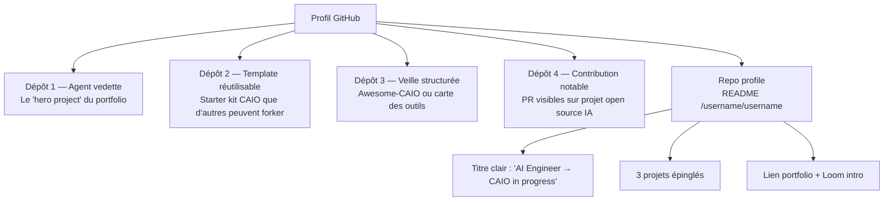

### Règles du GitHub CAIO

| Règle | Pourquoi |
|-------|----------|
| Max 6-8 repos visibles (le reste archivé) | Signal de sélection ; évite la dilution |
| Chaque repo a un README de niveau portfolio | Le repo parle seul, pas besoin de toi pour l'expliquer |
| Les 3 repos épinglés racontent une progression | Premier agent → template → système d'agents |
| Description en 1 ligne avec émoji + bénéfice | Scannable en 2 secondes |
| Tous les liens (live, Loom, post, article) dans le README | Zéro friction pour qui arrive du hasard |
| Le repo `/username/username` est ton CV condensé | Premier point de contact sur github.com/toi |

### Template de README pour le repo profil personnel

```markdown
# Salut 👋 Je suis [Nom]

Je construis des agents IA en production. Je passe de **dev full-stack**
à **CAIO** depuis [DATE].

## 🛠️ Ce sur quoi je bosse en ce moment
- **TriageCV** ([démo](...)) — agent qui trie 200 CVs en 8 minutes
- **FeedbackLens** ([article](...)) — analyse NPS en langage naturel
- **Ma carte des outils CAIO** ([lien](...)) — mise à jour trimestriellement

## 🎯 Ma recherche
Je cherche un rôle **CAIO / Head of AI** dans une [TYPE D'ENTREPRISE]
qui veut [TRANSFORMATION VISÉE]. Ou une mission freelance ciblée.

## 📮 Me contacter
- Portfolio : [lien]
- LinkedIn : [lien]
- Loom intro (2 min) : [lien]
- Email : [lien]
```

## 5.2 — Le site portfolio CAIO : structure one-page

Tu n'as pas besoin d'un site complexe. Une page suffit, bien structurée.

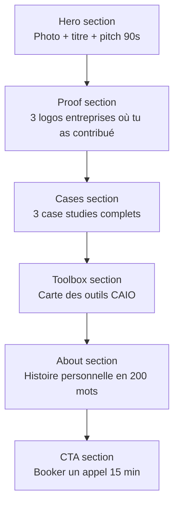

### Stack recommandée (cohérente avec ton positionnement)

| Couche | Techno | Justification |
|--------|--------|---------------|
| Framework | Next.js 16 | Prouve que tu maîtrises ton propre stack |
| Hébergement | Vercel | Déploiement instantané, CI intégrée |
| Style | Tailwind v4 | Rapide, cohérent, moderne |
| Composants | shadcn/ui | Qualité design + ownership du code |
| Domaine | ton-nom.com ou ton-nom.ai | Premier signal de sérieux |
| Analytics | Plausible ou Vercel Analytics | Mesure sans cookies |
| Form | Resend + Convex | Cohérence stack CAIO |

### Sections obligatoires et contenu type

| Section | Contenu | Taille |
|---------|---------|--------|
| Hero | Nom + titre de positionnement + 1 pitch + CTA | 100 mots |
| Preuve sociale | 3-5 logos ou noms reconnaissables (entreprises, projets OSS, meetups) | Visuel |
| Case studies | 3 projets avec problème / solution / impact / stack / liens | 250 mots chacun |
| Carte des outils | Tableau interactif ou statique de ta stack CAIO | 40 outils max |
| À propos | Récit personnel de transition dev → CAIO | 200 mots |
| CTA | Calendly ou Cal.com pour un appel 15 min | 1 bouton |
| Footer | Liens sociaux + licence (ton code, tes contenus) | 1 ligne |

## 5.3 — Le format case study CAIO

Ton portfolio tient par ses case studies. Un case study bien écrit est 10x plus impactant qu'un repo de code. Voici le squelette.

```markdown
# Case Study — [Nom du projet]

## Contexte (30 mots)
[Quelle organisation, quel problème, quel enjeu.]

## Problème (80 mots)
[Description précise, chiffrée si possible, avec le "avant" concret.]

## Contraintes (50 mots)
[Temps, budget, stack imposée, contraintes réglementaires.]

## Ma proposition (80 mots)
[Une phrase sur la solution + 3 décisions d'architecture clés + justification.]

## Architecture
[Diagramme Mermaid ici]

## Implémentation (100 mots)
[Stack réelle, choix contre-intuitifs, pièges évités.]

## Résultats (60 mots)
[Chiffres avant / après, feedback, usage réel.]

## Ce que j'ai appris (60 mots)
[1 leçon business, 1 leçon technique, 1 leçon personnelle.]

## Liens
- Repo : [...]
- Démo live : [...]
- Loom 5 min : [...]
- Post LinkedIn associé : [...]
```

### Exemple de case study condensé (TriageCV)

> **Contexte.** Cabinet de recrutement tech, 7 recruteurs, 400+ CVs par semaine.
>
> **Problème.** 22 heures hebdomadaires perdues en tri manuel de niveau 0, au détriment de la qualification téléphonique.
>
> **Ma proposition.** Agent IA qui lit chaque CV et produit un verdict justifié. Pas de remplacement du recruteur — un **tri** pour qu'il démarre sa journée à 9h sur les 20 CVs prioritaires au lieu des 200.
>
> **Résultats.** -72 % de temps de tri, +18 % d'entretiens téléphoniques réalisés, cohérence verdict vs recruteur humain à 87 %.

## 5.4 — SEO minimal pour être trouvable

Tu veux que quand un recruteur tape « [ton nom] CAIO » ou « [ton nom] AI engineer », tu sortes en première position. C'est réalisable en 2 heures.

| Action | Effort | Impact |
|--------|--------|--------|
| Balise `<title>` : « [Nom] — CAIO en devenir, AI Engineer » | 5 min | Fort |
| `<meta description>` : ton pitch 90 secondes | 10 min | Fort |
| Schema.org Person JSON-LD | 15 min | Moyen |
| OG image custom (ton visage + titre) | 20 min | Fort (partage) |
| Sitemap.xml + robots.txt | 10 min | Moyen |
| Lien depuis ton LinkedIn, Twitter, GitHub | 10 min | Très fort |
| Un article de blog par case study | 2h par article | Très fort sur 6 mois |
| Inscription dans le CAIO Registry Agentik | 15 min | Très fort sur Google |

## Points clés à retenir du Module 05

- Un GitHub CAIO est curé : 6-8 repos maximum, chacun raconte une progression.
- Un portfolio one-page suffit s'il est bien structuré : hero → preuve → cases → toolbox → about → CTA.
- Les case studies sont la pièce maîtresse, pas le code.
- Une stratégie SEO minimale (titre, méta, OG, backlinks) te rend trouvable sur ton nom + « CAIO ».

**Livrable du Module 05 :** site portfolio one-page déployé, 3 case studies rédigés, profil GitHub restructuré, soumission au CAIO Registry.

---

---

# Module 06 — Se faire remarquer sans 10 ans d'expérience

**Durée : 1h30 · Format : stratégie de contenu + templates + calendrier**

## Objectifs du module

À la fin de ce module, tu auras :

1. Compris la méthode **Build in Public** et pourquoi elle court-circuite l'ancienneté.
2. Maîtrisé les **formats de posts LinkedIn** qui performent pour un profil dev devenu CAIO.
3. Identifié et rejoint les **communautés Twitter/X, Discord et Slack** des AI builders francophones et anglophones.
4. Produit un **plan de contenu 30 jours** personnalisé, avec sujets, formats et cadence.

## 6.1 — Build in Public : la méthode la plus rapide pour créer de l'autorité

L'autorité traditionnelle se construit en 10 ans : diplômes, postes, publications. L'autorité Build in Public se construit en 6 mois : tu publies, publiquement et régulièrement, le *processus* de ton apprentissage et de ta construction.

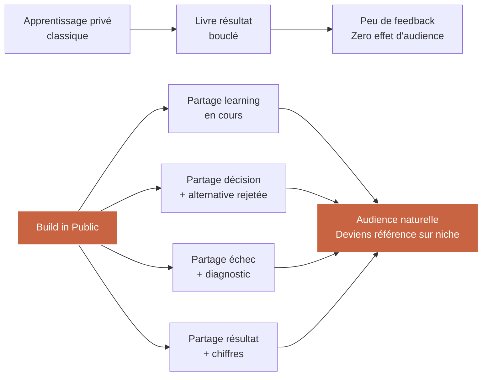

### Pourquoi ça marche (encore plus en 2025-2026)

| Dynamique | Effet pour toi |
|-----------|------------------|
| Les gens achètent des relations, pas des produits | Partage ton process = relation avant vente |
| Les algorithmes récompensent la cohérence > la viralité | Publier 3x / semaine pendant 12 mois > 1 post viral |
| La niche « CAIO francophone » est quasi vide | Tu n'affrontes pas 10 000 concurrents |
| Les recruteurs tech cherchent des profils qui enseignent | Publier te rend plus crédible qu'un CV classique |

### Les trois types de contenu Build in Public

1. **Le progrès** — « Voici ce que j'ai construit cette semaine. »
2. **La réflexion** — « Voici ce que j'ai compris sur [sujet] après 10 agents déployés. »
3. **Le post-mortem** — « J'ai foiré [X]. Voici le diagnostic et ce que je change. »

La règle d'or : **jamais de post vide de substance**. Pas de « great week! thanks team » à la LinkedIn corporate. Un post CAIO donne *toujours* une idée, un chiffre ou une leçon utilisable par le lecteur.

## 6.2 — Formats de posts LinkedIn qui performent pour les devs devenus CAIO

LinkedIn en 2025 récompense 4 formats principaux. Tu dois en maîtriser au moins 3 et alterner.

### Format 1 — Le carrousel « système » (8-12 slides)

Structure :
1. Hook choquant (slide de couverture)
2. Contexte du problème (1 slide)
3. 4-6 slides d'architecture / étapes / décisions
4. Slide résultat chiffré
5. Slide CTA (lien vers case study ou repo)

Exemple de titres qui performent :
- *« J'ai déployé mon premier agent en 3h. Voici les 7 décisions qui m'ont sauvé. »*
- *« Architecture d'un RAG de production : 10 slides, 0 jargon. »*
- *« 5 pièges que j'ai rencontrés en construisant un agent de support client. »*

### Format 2 — Le post texte narratif (300-600 mots)

Structure :
- Accroche (1 ligne qui intrigue)
- Contexte personnel (2-4 lignes)
- Apprentissage structuré (listes, chiffres, étapes)
- Leçon finale (1-2 phrases)
- Question ouverte pour engagement

Exemple : *« Il y a 90 jours, j'étais dev full-stack classique. Aujourd'hui, je viens de livrer mon 4e agent en production. Voici ce qui a changé dans ma façon de penser… »*

### Format 3 — La démo vidéo courte (30-90 sec)

Structure :
- Écran partagé en Loom ou Screen Studio
- Tu parles en caméra face pendant 10 sec (hook)
- Démo de l'agent en action (20-60 sec)
- Conclusion « voici le lien en commentaire » (10 sec)

### Format 4 — La liste de ressources curée

Structure :
- « 15 outils qu'un CAIO en 2025 doit connaître »
- Chaque outil : 1 ligne de description + lien
- Au moins 3 outils « qui ne sont pas évidents » pour se démarquer
- Pas de lien d'affiliation qui casse la confiance

### Matrice de décision : quel format, quand ?

| Objectif | Format recommandé |
|----------|---------------------|
| Montrer que tu livres | Démo vidéo courte |
| Établir ta crédibilité technique | Carrousel système |
| Créer du lien humain | Post texte narratif |
| Gagner des followers rapidement | Liste de ressources |
| Annoncer un gros livrable (site, agent) | Carrousel + vidéo combinés |

## 6.3 — Twitter/X : rejoindre la communauté AI builders

Twitter/X est le réseau où se passe la **conversation technique** entre builders IA. LinkedIn te positionne auprès des recruteurs. Twitter te positionne auprès des pairs — ce qui vaut 10 fois plus à long terme.

### Les règles d'engagement Twitter 2025 pour un CAIO en devenir

| Action | Cadence |
|--------|---------|
| Tweets originaux | 3-5 / semaine |
| Réponses à des tweets de builders reconnus | 2-3 / jour |
| Threads longs (> 5 tweets) | 1 / semaine |
| Retweets de contenu qualitatif | 1-2 / jour, avec commentaire perso |

### Les comptes à suivre pour nourrir ton feed

| Catégorie | Exemples |
|-----------|----------|
| Builders IA indépendants | @levelsio, @swyx, @karpathy |
| Anthropic + OpenAI officiel | @AnthropicAI, @OpenAI |
| Stack Agentik | @vercel, @convex_dev, @trigger_dev, @composiohq |
| CAIOs francophones émergents | À identifier via CAIO Registry Agentik |

### Thread Twitter type pour un post-mortem d'agent

```
1/ J'ai passé 3h à débugger un agent qui hallucinait.
Voici ce que j'ai appris. 🧵

2/ Le symptôme : l'agent sortait des fausses citations
de documents internes. Confiance visible: 92%. Réalité: 0%.

3/ Le réflexe faux : baisser la température du modèle.
Ça ne résout rien — le modèle était déjà à 0.2.

4/ Le vrai diagnostic : le RAG ne retournait rien.
Le modèle "inventait" pour combler le vide.

5/ La fix en 1 ligne : quand le retrieval est vide,
je force l'agent à dire "Je ne trouve pas dans la base".

6/ Leçon générale : le bug n'est presque jamais
là où tu le cherches en IA. Il est en amont, dans la
qualité des signaux.

7/ Demain je publie le post-mortem complet
avec le code. Lien dans 24h.
```

## 6.4 — Livrable : plan de contenu 30 jours « Build in Public »

Voici le template exact à remplir et publier sur ton portfolio (section /journey).

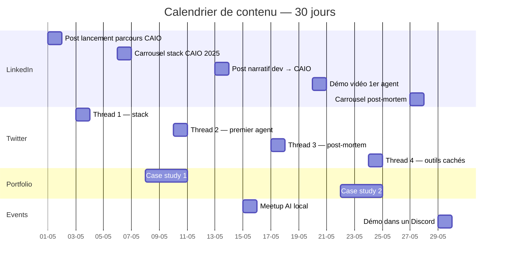

### Tableau de contenu par semaine

| Semaine | LinkedIn | Twitter | Portfolio | Hors-ligne |
|---------|----------|---------|-----------|-------------|
| 1 | Post lancement + carrousel stack | 2 threads + 10 réponses | Publier portfolio v1 | Rejoindre 2 Discords |
| 2 | Post narratif transition | 1 thread + 12 réponses | Publier case study 1 | Inscrire meetup local |
| 3 | Démo vidéo agent | 1 thread post-mortem | Mettre à jour carte outils | Présenter projet en meetup |
| 4 | Carrousel apprentissages | 1 thread outils cachés | Publier case study 2 | Demander 3 feedbacks pairs |

## Points clés à retenir du Module 06

- Build in Public remplace 10 ans d'autorité par 6 mois de publication régulière.
- LinkedIn et Twitter jouent des rôles différents : recruteurs vs pairs. Tu as besoin des deux.
- 4 formats de posts suffisent : carrousel système, texte narratif, démo vidéo, liste curée.
- 30 jours de cadence = base de ton audience CAIO.

**Livrable du Module 06 :** plan de contenu 30 jours rempli, premiers 2 posts publiés avant la fin de la semaine.

---

---

# Module 07 — Trouver sa première mission ou son premier client AI

**Durée : 1h30 · Format : stratégie commerciale adaptée aux devs + templates de prospection**

## Objectifs du module

À la fin de ce module, tu seras capable de :

1. Identifier les **trois chemins** les plus réalistes pour décrocher une mission CAIO sans réseau établi.
2. Proposer une **mission gratuite courte** qui génère ton premier testimonial client.
3. Utiliser le **CAIO Registry** et les plateformes pertinentes pour être *trouvé* plutôt que chercher.
4. Disposer de ton **kit de prospection junior CAIO** complet.

## 7.1 — Les trois chemins pour décrocher ta première mission

Quand tu pars de zéro (pas de réseau, pas de logo sur ton CV), tu n'as que trois chemins viables. Tous les autres sont des illusions ou des accidents.

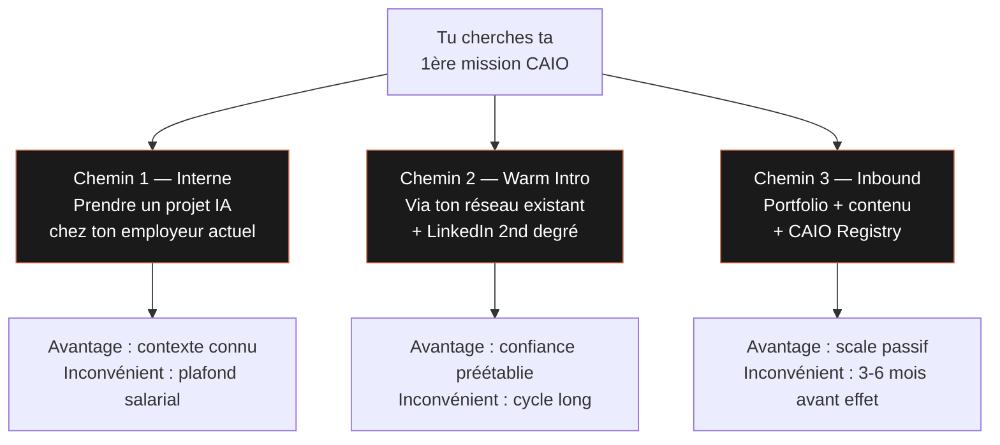

### Chemin 1 — Prendre un projet IA interne

C'est le chemin que 70 % des futurs CAIO prennent sans le savoir. Tu es déjà employé. Tu as déjà un contexte, un budget, une équipe. Propose à ton management un POC IA qui résout un vrai problème interne.

**Protocole :**

| Étape | Action | Durée |
|-------|--------|-------|
| 1 | Identifier 3 workflows répétitifs non-IA dans ton organisation | 1 semaine |
| 2 | Estimer l'impact annuel en € de chacun | 2 jours |
| 3 | Écrire un mémo 1 page « Projet IA #1 » avec bénéfice + coût + délai | 1 jour |
| 4 | Proposer à ton N+1 un POC 2-3 semaines à budget zéro | 30 minutes |
| 5 | Livrer + documenter pour ton portfolio | 3 semaines |
| 6 | Demander formellement le rôle « AI Lead » dans l'équipe | 15 minutes |

### Chemin 2 — Warm intro via ton réseau existant

Tu as plus de réseau que tu ne crois. Liste toutes les personnes avec qui tu as bossé depuis 5 ans — pas seulement les CTO, mais aussi les PMs, designers, devs pairs qui ont changé d'entreprise.

| Type de contact | Probabilité de mission | Approche |
|------------------|-------------------------|----------|
| Ancien CTO / lead | Élevée | Message direct : « J'ai bâti [X], tu penses que [leur nouvelle boîte] a un cas d'usage ? » |
| Ancien PM | Moyenne | Même chose, en cherchant via eux leur CTO actuel |
| Ancien dev pair | Faible (direct) | Mais ils ouvrent des portes : « Tu connais qui a un besoin IA ? » |
| Linkedin 2nd degré | Très faible (à froid) | Utiliser uniquement après avoir publié 4 semaines de contenu |

**Template de message warm intro :**

```
Salut [Prénom],

[Contexte personnel : 2-3 lignes naturelles, pas du copy-paste]

Je te contacte parce que j'ai basculé vers le rôle de CAIO (Chief AI Officer)
et que je viens de livrer [PROJET CONCRET] pour [CONTEXTE].

Impact : [1 CHIFFRE].

Je sais que [LEUR BOÎTE] a probablement des workflows similaires.
Si tu vois une personne chez vous qui pourrait être intéressée par
un POC 3 semaines, je prendrais 15 minutes pour échanger.

Aucune pression si c'est pas le moment.

Cheers,
[Toi]
```

### Chemin 3 — Inbound via portfolio + contenu + registry

C'est le chemin le plus lent au démarrage mais le plus scalable. Une fois enclenché, il te ramène des missions sans effort actif.

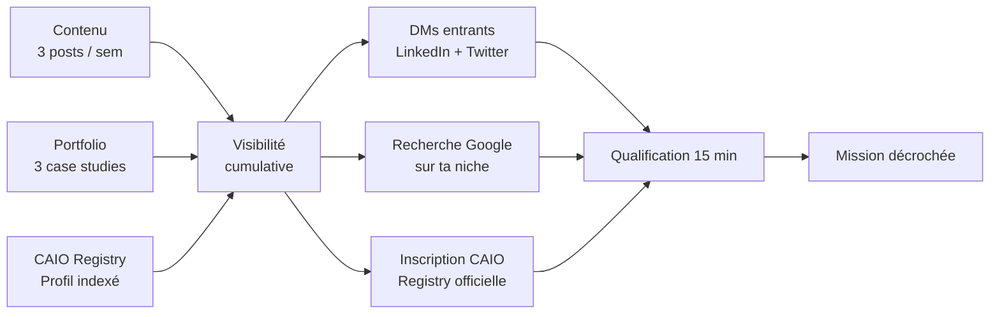

## 7.2 — Proposer une mission gratuite courte pour créer le premier testimonial

Le premier testimonial vaut plus que le premier paiement. Voici la mécanique.

### La mission gratuite 2 semaines

**Règles :**

| Règle | Raison |
|-------|--------|
| Max 2 semaines calendaires | Évite l'effet « projet qui s'éternise » |
| Scope ultra-défini par écrit (1 page) | Pas de mission creep |
| Livrable public documentable (avec accord du client) | Nourrit ton portfolio |
| Testimonial écrit + LinkedIn recommandation explicites | C'est *le* prix de la gratuité |
| Accord signé sur propriété IP et droit de communication | Protège les deux parties |

**Template de proposition :**

```markdown
# Proposition — POC gratuit 2 semaines

## Contexte
[Ce que j'ai compris de ton problème.]

## Scope
**En scope :**
- [Item 1]
- [Item 2]
- [Item 3]

**Hors scope :**
- [Ce que je ne ferai pas]
- [Limites de la V1]

## Livrables
- [ ] Agent fonctionnel déployé
- [ ] README technique
- [ ] Loom 5 min de démonstration
- [ ] Retrospective 30 min avec toi

## Mes demandes en échange
- Testimonial écrit (1 paragraphe) utilisable sur mon portfolio
- Recommandation LinkedIn publique
- Droit de publier un case study anonymisé (pas de données sensibles)
- 15 minutes d'intro à 1 autre dirigeant de ton réseau

## Timeline
- Jour 1-3 : discovery + setup
- Jour 4-10 : build
- Jour 11-13 : tests + doc
- Jour 14 : démo + rétro

Signé : [Toi] + [Client] — date.
```

## 7.3 — Le CAIO Registry et les plateformes pour être trouvé

Au-delà de tes efforts actifs, tu dois t'inscrire dans les annuaires où les acheteurs cherchent.

| Plateforme | Audience | Effort d'inscription | Priorité |
|------------|----------|------------------------|----------|
| CAIO Registry Agentik | Entreprises qui cherchent un CAIO | 15 min | Très haute |
| Malt | Clients freelance FR | 1h profil | Haute |
| Comet, FreelanceRepublik | Clients tech FR | 1h profil | Moyenne |
| Toptal | Clients US premium | 5-10h (test technique) | À viser M+6 |
| LinkedIn Open to Work | Recruteurs | 5 min | Immédiat |
| AngelList / Wellfound | Startups IA | 30 min | Haute si tu vises startup |
| Lunchclub | Warm intros auto | 20 min / semaine | Moyenne |
| Upwork | Clients internationaux | 1h profil | Basse (pricing compressé) |

### Checklist de profil CAIO optimisé (valable sur toutes les plateformes)

| Élément | Exemple |
|---------|---------|
| Titre | « CAIO freelance | Je déploie ton premier agent IA en 3 semaines » |
| Tagline / accroche | « Dev full-stack devenu CAIO — j'aide les PME à passer du POC au MVP en 30 jours » |
| Taux journalier cible | 600-900€/j au démarrage, 1000-1500€/j après 3 missions |
| Portfolio liés (minimum 3) | Agent, site, case study |
| Disponibilité | « 2 jours / semaine sur 3 mois » ou « temps plein 3 mois » |
| Certifications | Inscription CAIO Registry, formation Agentik Academy |

## 7.4 — Livrable : kit de prospection junior CAIO

Tu pars de ce module avec un kit complet :

1. **Liste de 20 contacts warm** triée par probabilité de mission (chemin 2)
2. **Mémo de projet interne** si tu es en poste (chemin 1)
3. **Profils complets** sur : LinkedIn, Twitter, CAIO Registry, Malt (chemin 3)
4. **Templates de messages** : warm intro, mission gratuite, follow-up
5. **Calendar link** Cal.com ou Calendly pour les 15 min de qualification
6. **Objection kit** : 10 objections typiques + réponse par écrit

### Les 10 objections typiques d'un premier prospect

| Objection | Réponse cadre |
|-----------|----------------|
| « Tu n'as qu'un an d'expérience en IA » | « J'ai 6 ans en dev + 18 mois en IA production. Voici 3 projets livrés. » |
| « On a déjà essayé ChatGPT en interne » | « ChatGPT n'est pas un agent. Un agent sait *agir* sur vos données et vos outils. Regardez. » |
| « C'est trop cher » | « Le POC est à X €. Le gain annuel estimé est de Y €. Payback < 2 mois. » |
| « On préfère attendre » | « Totalement valide. Le risque : chaque trimestre d'attente se paie en avantage concurrentiel que vos concurrents prennent. » |
| « On a un dev interne qui peut le faire » | « Parfait. Je peux l'aider à démarrer en 2 semaines plutôt qu'en 4 mois, et former l'équipe. » |
| « L'IA hallucine trop » | « Dans un système bien architecturé avec RAG + validation, le taux d'erreur descend à 3-5 %. » |
| « On n'a pas les données » | « La plupart des premiers cas d'usage n'ont besoin d'aucune data custom. Regardez mon agent tri de CV. » |
| « On veut une solution packagée » | « Je peux recommander X ou Y selon votre cas. Je vends mon expertise, pas du lock-in. » |
| « C'est compliqué à faire approuver » | « Je viens présenter 20 min à ton Comex avec un ROI chiffré. » |
| « On veut du sur-mesure mais moins cher » | « Le sur-mesure le moins cher, c'est 3 semaines de POC bien cadré. Au-delà c'est scope creep. » |

## Points clés à retenir du Module 07

- Trois chemins viables sans réseau : projet interne, warm intro, inbound via portfolio + registry.
- La première mission peut être gratuite si elle te ramène un testimonial public et un droit de case study.
- Le CAIO Registry et Malt sont tes deux leviers inbound francophones à activer dès aujourd'hui.
- Un kit de prospection n'est pas un plan marketing — c'est un système qui tourne 5 minutes par jour.

**Livrable du Module 07 :** kit de prospection junior CAIO complet, avec premier message envoyé avant la fin de la semaine.

---

---

# Module 08 — Roadmap 12 mois : de junior CAIO à revenus sérieux

**Durée : 1h00 · Format : planification personnelle + jalons trimestriels**

## Objectifs du module

À la fin de ce module, tu auras :

1. Choisi ton **chemin prioritaire** parmi les trois options (CDI, freelance, fondateur).
2. Détaillé tes **jalons trimestriels** sur 12 mois avec livrables et métriques.
3. Compris ce que la **formation core Agentik** ajoute à ce parcours gratuit.
4. Produit **ta roadmap personnelle** avec revue mensuelle planifiée.

## 8.1 — Les trois chemins de monétisation possibles

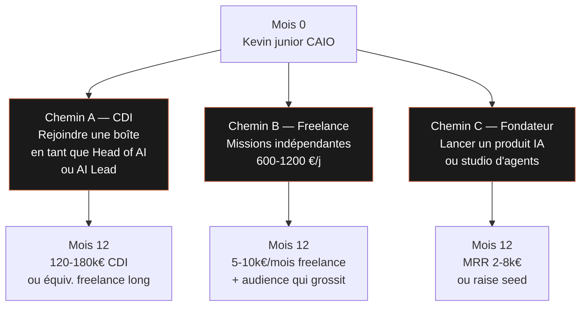

### Comment choisir ton chemin ?

| Critère | CDI | Freelance | Fondateur |
|---------|-----|-----------|-----------|
| Besoin de stabilité financière | Fort | Moyen | Faible |
| Tolérance au risque | Faible | Moyenne | Élevée |
| Goût pour le commercial | Faible | Moyen | Fort |
| Capacité à vivre 3-6 mois sans revenu | Non requise | Utile | Indispensable |
| Ambition de levier (passer ton temps vs ton entreprise) | Faible | Moyen | Fort |
| Mois 12 typique (revenu brut) | 10-15k€/mois | 8-12k€/mois | -5 à +5k€/mois |

### Profil type par chemin

| Chemin | Profil Kevin type |
|--------|---------------------|
| CDI | Kevin a une famille, hypothèque, recherche la stabilité, veut un cadre structuré |
| Freelance | Kevin aime l'autonomie, supporte la variance de revenu, n'a pas de charges fixes massives |
| Fondateur | Kevin a une idée forte, tolère 12 mois de revenus faibles, veut un levier long terme |

## 8.2 — Jalons trimestriels : le plan de marche

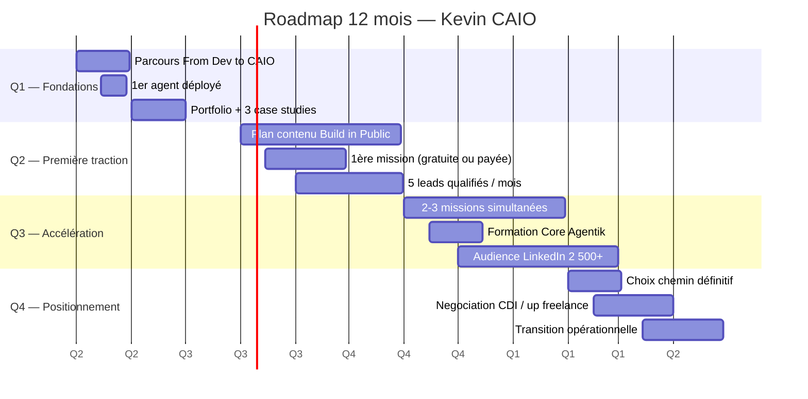

### Détail Q1 — Fondations (mois 0-3)

| Mois | Objectif | Livrable | Métrique de succès |
|------|----------|----------|----------------------|
| M1 | Terminer le parcours From Dev to CAIO | 8 modules + 8 livrables | 100 % complété |
| M2 | Déployer 1 agent + 1 case study | Repo + Loom + article | 1 agent live + 300 vues article |
| M3 | Publier portfolio + plan contenu | Site déployé + 10 posts publiés | 100 visiteurs / mois sur portfolio |

### Détail Q2 — Première traction (mois 4-6)

| Mois | Objectif | Livrable | Métrique de succès |
|------|----------|----------|----------------------|
| M4 | Cadence Build in Public établie | 3 posts / semaine | 500 followers LinkedIn |
| M5 | 1ère mission décrochée | Contrat + proposition | Mission signée (même gratuite) |
| M6 | 1er testimonial + 2e mission | Recommandation + contrat | 1er paiement client |

### Détail Q3 — Accélération (mois 7-9)

| Mois | Objectif | Livrable | Métrique de succès |
|------|----------|----------|----------------------|
| M7 | 2-3 missions simultanées | Contrats + livrables | 6-10k€ MRR freelance |
| M8 | Formation Core Agentik (si pas encore fait) | 3 systèmes déployés | Accès CAIO certifié |
| M9 | Pipeline de leads organisé | 10 qualifications / mois | 30 % closing rate |

### Détail Q4 — Positionnement (mois 10-12)

| Mois | Objectif | Livrable | Métrique de succès |
|------|----------|----------|----------------------|
| M10 | Choix définitif du chemin A/B/C | Décision documentée | Annonce publique de la direction |
| M11 | Négociation up de taux / signing | Contrat revu | 10-15 % d'augmentation |
| M12 | Transition opérationnelle | Système à jour + roadmap Y2 | Revenu cible atteint |

## 8.3 — Ce que la formation core Agentik ajoute en plus

Ce parcours *From Dev to CAIO* te donne la méthode, le framework et les premiers livrables. Il te manque volontairement trois choses que seule la formation core à 2 000 € apporte :

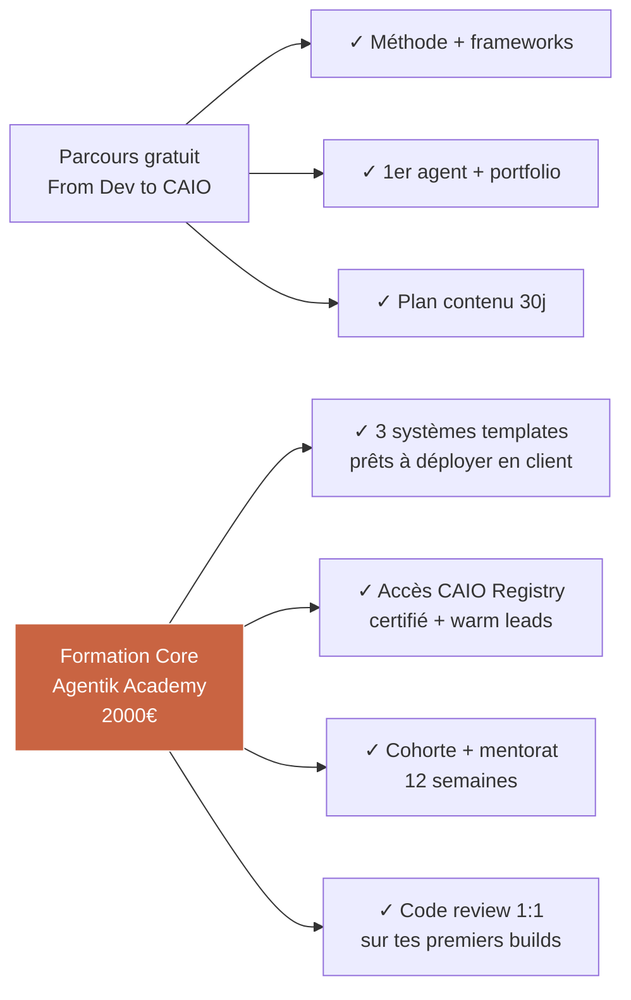

### Comparatif détaillé

| Dimension | Parcours gratuit | Formation Core |
|-----------|--------------------|------------------|
| Durée | 14h autonomie | 12 semaines avec cohorte |
| Systèmes templates | 0 (build from scratch) | 3 (Triage, FeedbackLens, Support Agent) |
| Support communauté | Public (Twitter, Discord) | Cohorte privée + slack dédié |
| Mentorat 1:1 | 0 | 4 sessions de 45 min |
| Revues de code | 0 | Illimitées pendant 12 semaines |
| Accès CAIO Registry | Inscription standard | Profil certifié + mise en avant |
| Leads warm | 0 | Warm intros depuis le Registry |
| Prix | 0 € | 2 000 € |
| ROI cible (si mission à 5k €) | À ton effort | Payback en 1 mission |

**La frustration attendue au module 3 :**

> *« J'aurais voulu avoir les 3 systèmes complets comme base plutôt que de partir de zéro. »*

C'est normal. C'est voulu. Le parcours gratuit prouve que tu peux construire. La formation core te donne les briques pour *livrer plus vite* aux clients et encaisser plus de missions par trimestre.

## 8.4 — Livrable : ta roadmap personnelle 12 mois

Tu vas remplir et publier (au moins sur une page privée de ton portfolio) ta roadmap personnelle. Cela devient ton tableau de bord, revu chaque mois.

```markdown
# Ma roadmap CAIO — 12 mois

**Date de début :** 2026-05-01
**Chemin choisi :** [A / B / C]
**Objectif M12 :** [revenu / rôle / MRR]

## Q1 — Fondations
- [ ] Terminer les 8 modules du parcours
- [ ] Déployer 1er agent (cas d'usage choisi : ______)
- [ ] Publier portfolio + 3 case studies

## Q2 — Première traction
- [ ] 500 followers LinkedIn
- [ ] 1ère mission (même gratuite)
- [ ] 1er testimonial public

## Q3 — Accélération
- [ ] 6k€ MRR freelance OU signature CDI
- [ ] 3 systèmes Agentik maîtrisés
- [ ] Pipeline de 10 leads qualifiés / mois

## Q4 — Positionnement
- [ ] Chemin définitif A/B/C confirmé
- [ ] Revenu cible M12 atteint : _____ €
- [ ] Roadmap Y2 définie

## Revue mensuelle — date : 1er du mois, 1h
- Métriques du mois : _____
- Leçon apprise : _____
- Ajustement : _____
```

## Points clés à retenir du Module 08

- Trois chemins de monétisation : CDI (stabilité), freelance (variance), fondateur (levier).
- La roadmap 12 mois s'articule en 4 trimestres : fondations → traction → accélération → positionnement.
- Le parcours gratuit prouve que tu peux. La formation core te donne les briques pour livrer à l'échelle.
- Une revue mensuelle de 1h est la vraie discipline qui fait la différence entre roadmap écrite et roadmap exécutée.

**Livrable du Module 08 :** roadmap 12 mois personnelle documentée + date de revue mensuelle planifiée au calendrier.

---

---

# Conclusion — Le CAIO que tu deviens est le CAIO que tu construis publiquement

Tu as terminé 14 heures de formation. Tu as 8 livrables concrets. Tu as un positionnement public défendable.

Ce que personne ne t'a dit avant de commencer : le CAIO n'est pas un titre qu'on te donne. C'est un positionnement que tu occupes par la preuve répétée. Chaque semaine où tu publies, chaque mois où tu livres un agent, chaque trimestre où tu bouges tes métriques — tu renforces cette position.

Le marché va se normaliser dans les 24-36 prochains mois. Les profils qui auront construit leur autorité entre 2025 et 2027 vont encaisser les premiers gros contrats. Les profils qui auront attendu vont devoir affronter une concurrence mature, des écoles certifiantes massives, et des salaires compressés.

Tu es en avance parce que tu as choisi d'investir 14 heures pendant que d'autres regardent des démos sur Twitter.

Ce que tu fais **ce soir** détermine où tu seras à 12 mois. Commence par la première action du Module 01 — l'auto-diagnostic. Remplis-le. Publie-le, même dans une version privée. Puis avance, module par module, livrable par livrable.

On se retrouve au mois 12.

— *L'équipe Agentik {OS}*

---

## Annexes

### Annexe A — Glossaire CAIO

| Terme | Définition courte |
|-------|--------------------|
| Agent | Système IA capable d'agir sur des outils externes, pas juste de répondre |
| RAG (Retrieval-Augmented Generation) | Technique qui nourrit le modèle avec les bons documents avant qu'il réponde |
| MCP (Model Context Protocol) | Protocole qui standardise les connexions entre agents et outils |
| Orchestrateur | Couche logicielle qui pilote un ou plusieurs agents dans un workflow |
| Base vectorielle | Stockage optimisé pour chercher par similarité sémantique |
| Fine-tuning | Entraînement d'un modèle sur ton propre corpus |
| Hallucination | Production par le modèle d'informations fausses présentées comme vraies |
| Cache sémantique | Cache qui matche les requêtes par sens, pas par chaîne exacte |
| Feature store | Stockage de signaux pré-calculés pour inférence en ligne |
| Inférence | Appel du modèle pour obtenir une réponse |

### Annexe B — Checklist finale du parcours

```markdown
# Parcours From Dev to CAIO — Checklist de livraison

## Module 01
- [ ] Auto-diagnostic CAIO rempli
- [ ] 3 actions à 7 jours identifiées

## Module 02
- [ ] Carte personnelle des outils CAIO publiée
- [ ] Environnement Next.js + Convex + Claude setup

## Module 03
- [ ] 1er agent déployé sur Vercel
- [ ] README portfolio rédigé
- [ ] Loom 5 min enregistré

## Module 04
- [ ] Elevator pitch 3 versions écrit
- [ ] Testé sur 2 personnes réelles

## Module 05
- [ ] Portfolio one-page déployé
- [ ] 3 case studies publiés
- [ ] GitHub restructuré

## Module 06
- [ ] Plan de contenu 30 jours rempli
- [ ] 2 premiers posts publiés

## Module 07
- [ ] Kit de prospection complet
- [ ] 1er message envoyé
- [ ] Profils Malt + CAIO Registry soumis

## Module 08
- [ ] Roadmap 12 mois personnelle
- [ ] Revue mensuelle planifiée au calendrier
```

### Annexe C — Ressources à suivre après le parcours

| Ressource | Type | Fréquence |
|-----------|------|-----------|
| CAIO Registry Agentik | Annuaire | Hebdomadaire |
| Anthropic Engineering Blog | Blog | Hebdomadaire |
| Vercel AI Blog | Blog | Hebdomadaire |
| Convex Changelog | Product | Hebdomadaire |
| Twitter #buildinpublic | Conversation | Quotidien |
| Meetup AI Builders (ta ville) | Networking | Mensuel |
| Formation Core Agentik | Formation | Quand tu sens le plafond |

---

**CAIO Academy — From Dev to CAIO Track**
*Agentik {OS} — agentik-os.com*
*Version 1.0 — 2026*
