# CAIO Academy — CAIO Monetization Track

**The complete journey to turn your consulting skills into a profitable, scalable, differentiated CAIO offering**

**Target audience:** Marc — Independent consultant, senior freelancer, former executive in career pivot
**Program length:** 10 hours of structured content
**Transformation horizon:** 90 days to triple your day rate
**Format:** 8 business modules, commercial frameworks, sales templates, action plans

**Agentik {OS} — agentik-os.com**

---

## Preface — Why this program exists

You're a consultant. You bill between €400 and €700/day. You deliver quality work — your clients are happy, referrals bring in 60% of your pipeline, and you've built a solid reputation in your domain (transformation, marketing, ops, finance, HR, strategy — whatever it is). You know how to sell an engagement, scope it, and deliver it.

But something has shifted in your market over the past 18 months. Your clients are talking about AI. Some ask cautiously: "Could you help us on this?" You say yes with caution, patch together an advisory, you get through it — but you sense that something is slipping. Meanwhile, on LinkedIn, you see less-experienced peers positioning themselves as "Fractional CAIO" or "AI Transformation Advisor," charging €1,200 to €1,800 per day, with waiting lists.

What you're observing is real, and it's not a passing bubble. The **Chief AI Officer** role is becoming for 2025-2027 what the **Chief Digital Officer** role was for 2015-2017: a title that SMBs, mid-market companies, and even large groups are trying to fill *from outside* because no one internal can do it. The difference vs. the CDO a decade ago: the CAIO can be **fractional** from day one — one day per week at three different clients, at €1,400/day, equals €200k annually, without ever giving up independent status.

This program is not a technical training. There's no code, no Python tutorials, no Vercel deploys. Marc is not here to become a developer. Marc is here to **transform his existing expertise into a packaged, sellable, deliverable, scalable CAIO offering**.

The eight modules cover the complete path: understanding the 2025 CAIO market, packaging three complementary offerings, selling AI to non-technical executives, delivering missions without complex tooling, selling systems on top of consulting, building a LinkedIn acquisition machine, scaling into a micro-agency, and executing a 90-day plan that takes your day rate from €500 to €1,200.

What you'll walk away with is not a diploma. It's a **complete operational kit**: three prospect-ready offer sheets, a proven sales script, a LinkedIn acquisition plan executable Monday morning, a catalog of sellable systems, a micro-agency business model, and a 90-day plan that tells you exactly what to do each week.

One important note before starting: in Module 05 you'll realize that you can sell **AI systems** to your clients, not just consulting. This realization is the most profitable inflection point of the program. You'll see the model — but at that moment, you won't yet have the systems to sell. That's normal. The core CAIO Academy training gives you precisely those systems, pre-built, documented, ready to white-label and resell to your clients. The Monetization Track gives you the commercial mechanics. The core training gives you the product. Together, the loop closes.

---

## Avatar — Marc, independent consultant

| Dimension | Profile |
|-----------|---------|
| Typical age | 35-52 |
| Experience | 8 to 25 years in consulting firms, corporates, or freelance |
| Legal status | Micro-enterprise, single-member SAS, EURL, or umbrella employment (FR specific) |
| Current day rate | €400-700/day |
| Billable days/year | 120-160 |
| Typical annual revenue | €55,000-€115,000 |
| Areas of expertise | Digital transformation, marketing, ops, finance, HR, strategy, change management, data |
| Relationship to AI | Tested ChatGPT / Claude, uses it for drafting, reads HBR and Usbek & Rica on the topic |
| Daily tools | Notion, Slack, Google Workspace, Pipedrive or HubSpot, Malt, Calendly, LinkedIn |
| Main frustration | "My clients ask me about AI and I answer without a clear package — I'm leaving money on the table" |
| Deep fear | "Younger consultants are taking the CAIO market while I watch" |
| Accessible dream | Triple day rate to €1,200-1,800/day, reduce to 80 billable days for the same revenue, sell systems on top of consulting |
| Buying signal | Already bought one or two premium business trainings (Pharrow, Systeme.io Pro, The Family, Bpifrance Création) |
| Main blocker | Knows the opportunity exists but doesn't know *how to reposition* without appearing opportunistic |

Marc is not a beginner. He knows how to sell, deliver, and invoice. What he lacks is the **repackaging of existing expertise into CAIO vocabulary and offer architecture** — not a full career pivot.

---

## Program overview

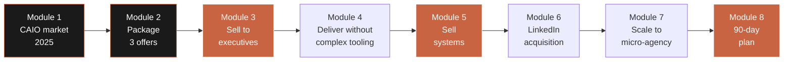

Each module produces a concrete deliverable, usable with clients the next week. By the end of the program, Marc has eight commercial assets: a market opportunity matrix, three offer sheets, a sales script, a mission delivery framework, a sellable systems catalog, LinkedIn outreach templates, a micro-agency business model, and a personalized 90-day plan.

| Module | Length | Primary deliverable | Expected impact |
|--------|--------|----------------------|-----------------|
| 01 — CAIO market 2025 | 1h15 | Market opportunity matrix | Clarity on who to target, where, at what price |
| 02 — Package 3 offers | 1h30 | 3 prospect-ready offer sheets | Prices multiplied by 2-3x over 90 days |
| 03 — Sell to executives | 1h30 | Sales script + 10 objection responses | Closing rate >30% in discovery calls |
| 04 — Deliver without complex tooling | 1h15 | 8-week mission framework | Wow effect in week 1, retention 70%+ |
| 05 — Sell systems | 1h15 | Sellable systems catalog | New recurring revenue line |
| 06 — LinkedIn acquisition | 1h15 | Outreach templates + content calendar | 3-5 discovery calls per week |
| 07 — Scale to micro-agency | 1h00 | Micro-agency business model | Scale without multiplying hours |
| 08 — 90-day plan | 1h00 | Personalized week-by-week plan | Measurable path to €1,200/day |

**Total: 10h00 of structured content — designed to be consumed over 4-6 weeks with immediate client application.**

---

---

# Module 01 — The 2025 CAIO market: opportunity mapping

**Length: 1h15 · Format: market analysis + opportunity matrix + targeting exercise**

## Module objectives

By the end of this module, you will be able to:

1. Describe **who hires CAIOs** in France and Europe in 2025 — by sector, company size, AI maturity, and engagement format (FTE, fractional, project).
2. Position the **real market price ranges**: full-time salaries, freelance day rates, monthly fractional packages — with verifiable sources.
3. Identify **the 4 sectors that hire the most** and pay the best CAIOs in 2025, and understand why.
4. Decide whether you should **specialize by sector** or stay generalist, based on your current expertise and goals.
5. Fill in your **CAIO market opportunity matrix** for your specific profile.

## 1.1 — What is a CAIO, really, in 2025?

Before mapping the market, let's agree on the role. The "Chief AI Officer" term exploded on LinkedIn in 2024 and continues spreading in 2025, but the reality behind the title is heterogeneous. In practice, four archetypes exist, each with its own market, price, and engagement format.

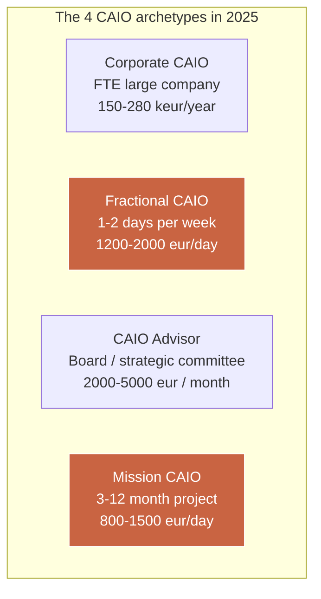

For Marc, the two commercially viable targets are **Fractional CAIO** and **Mission CAIO**. The Corporate CAIO (FTE) is not the focus of this program. The CAIO Advisor is a secondary target achievable after 12-24 months of proven CAIO experience.

**Operational CAIO definition for an independent consultant:** an expert who, for a 10-500 person organization, translates business strategy into an actionable AI roadmap, prioritizes use cases, orchestrates vendors and tools, trains teams, and ensures AI investments produce measurable ROI in less than 6 months.

Not an ML engineer. Not a prompt engineer. Not a data scientist. A **business ↔ AI translator**, an adoption architect, and a ROI guardian.

## 1.2 — Market size and 2025 dynamics

The CAIO market in France and Europe is in a structural ramp-up phase. The figures below consolidate several public sources (LinkedIn Economic Graph, Malt Trends 2024-2025, Comet, Collectif des freelances, Numeum barometer) plus field observations.

| Indicator | France 2023 | France 2024 | France 2025 (est.) |
|-----------|-------------|-------------|---------------------|
| Job postings with "AI Officer" / "CAIO" title | ~40 | ~220 | ~600 |
| Freelance missions mentioning "AI advisory" on Malt | ~150 | ~850 | ~2,400 |
| Median freelance day rate "AI Strategist / Advisor" | €650 | €900 | €1,150 |
| Top 25% day rate (same segment) | €900 | €1,300 | €1,700 |
| % mid-market cos. (250-5000) with named AI lead | 8% | 19% | 34% |
| % SMBs (10-250) with named AI lead | 2% | 6% | 14% |

**Reading:** in 2025, a very large majority of French SMBs and mid-market companies **still don't have** an internal AI lead, even though their executives are under pressure to produce visible AI results. This asymmetry is exactly the Fractional CAIO market opportunity.

## 1.3 — Who hires CAIOs in 2025? (the 4 segments that matter)

Not all market segments are equal. Some sectors pay better, decide faster, and are more mature on AI. Here are the four priority segments for Marc, ranked by composite attractiveness (price × volume × ease of entry).

### Segment A — Professional services SMBs (50-250 people)

Consulting firms, audit firms, law firms, accounting firms, recruitment firms, architecture, engineering. They live on billable hours and see AI as a direct P&L lever.

| Attribute | Detail |
|-----------|--------|
| Typical size | 50-250 people, €5-30M revenue |
| Decision maker | Partner / managing director / CEO |
| Typical AI mission budget | €25,000-€80,000 |
| Sales cycle | 4-8 weeks |
| AI maturity | Low to medium (1-3 out of 5) |
| Perceived urgency | High — billable hour productivity is measurable |
| Day rate Marc can target | €1,000-€1,400 |

### Segment B — Industrial and retail mid-market (250-2,000 people)

Manufacturing, logistics, distribution, traditional retail. Less sexy but high budget and behind on AI adoption.

| Attribute | Detail |
|-----------|--------|
| Typical size | 250-2,000 people, €30-300M revenue |
| Decision maker | CIO / COO / CEO |
| Typical AI mission budget | €60,000-€250,000 |
| Sales cycle | 10-20 weeks |
| AI maturity | Low (1-2 out of 5) |
| Perceived urgency | Medium — depends on competitive pressure |
| Day rate Marc can target | €1,200-€1,800 |

### Segment C — Tech scale-ups (Series A to C, 30-300 people)

Start-ups that raised €5M-€80M, digital product, often B2B SaaS or marketplace. High AI maturity, fast decisions, but prices pressured by dilution.

| Attribute | Detail |
|-----------|--------|
| Typical size | 30-300 people, post-Series A/B/C |
| Decision maker | CEO / CTO / VP Product |
| Typical AI mission budget | €30,000-€120,000 |
| Sales cycle | 2-4 weeks |
| AI maturity | Medium to high (3-4 out of 5) |
| Perceived urgency | Very high — fundraising cycle |
| Day rate Marc can target | €900-€1,400 |

### Segment D — Nonprofits and public / para-public

Mutual insurers, foundations, local authorities, state agencies, training funds. Long cycles but large tickets and fast-growing AI-reserved budgets (France 2030, France Num plan, etc.).

| Attribute | Detail |
|-----------|--------|
| Typical size | 100-3,000 people |
| Decision maker | GM / CFO / CHRO / exec committee |
| Typical AI mission budget | €50,000-€300,000 |
| Sales cycle | 16-32 weeks (public procurement) |
| AI maturity | Low (1-2 out of 5) |
| Perceived urgency | Medium — often responding to RFP |
| Day rate Marc can target | €900-€1,300 |

## 1.4 — Comparative synthesis of the 4 segments

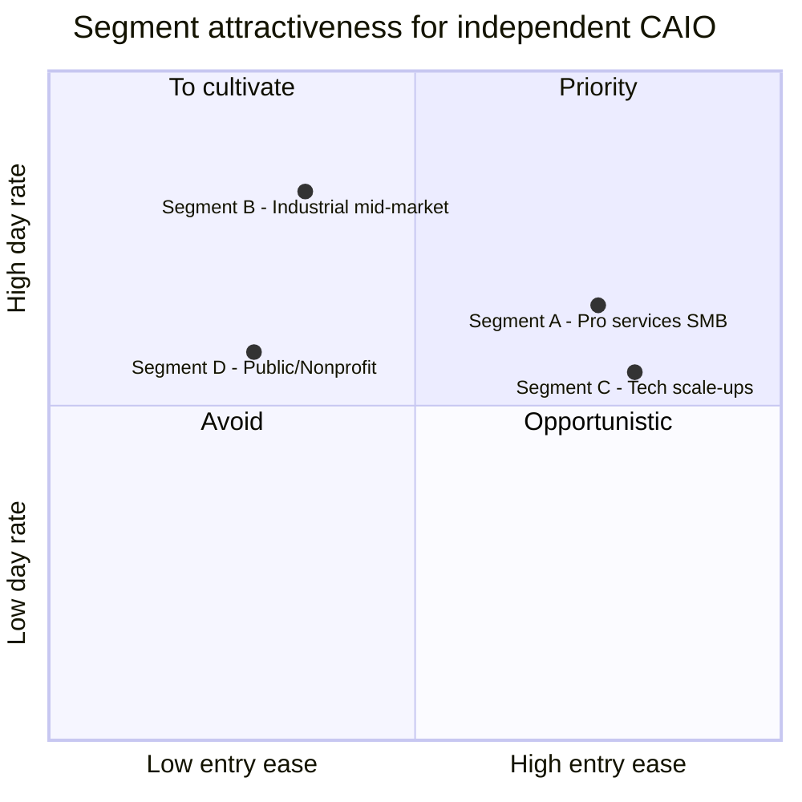

| Criterion | Segment A | Segment B | Segment C | Segment D |
|-----------|-----------|-----------|-----------|-----------|
| Average day rate | €1,200 | €1,500 | €1,150 | €1,100 |
| Sales cycle | Short | Long | Very short | Very long |
| Avg mission budget | €50k | €150k | €75k | €180k |
| Entry barrier | Low | Medium | Low | High |
| Competitive density | Medium | Low | Very high | Low |
| **Marc's recommendation** | **Target #1** | **Target #2** | Optional | Optional |

For an independent consultant starting a CAIO repositioning, **segments A and B are priority**. They combine sufficient budgets, reasonable cycles, and moderate competition. Segment C (scale-ups) is tempting for fast decisions but **hyper-competitive** — lots of ex-tech people position there. Segment D is a patience market, interesting as a second wave.

## 1.5 — Should you specialize by sector?

One of the most common questions during repositioning: stay generalist or specialize in a sector (legal, health, retail, real estate, finance, …)?

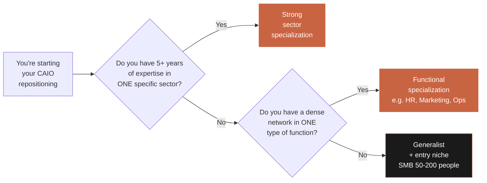

Simple rule: **specialize where you already have an edge**. 10 years in retail → "retail CAIO." 8 years of HR in industrial mid-markets → "CAIO for CHROs." Transformation generalist → target SMBs of 50-200 people without over-specializing at first.

| Positioning | Advantage | Disadvantage | When it's the right choice |
|-------------|-----------|--------------|-----------------------------|
| Deep sector (e.g., "CAIO for law firms") | Premium pricing, natural word of mouth | Narrower market | You have 5+ years in that sector |
| Functional (e.g., "CAIO for CHROs") | Cross-industry, broad market | More pedagogy required | You have 8+ years in that function |
| Generalist (e.g., "CAIO SMB 50-200 people") | Very broad market, fast cycle | Capped pricing, competition | You're just starting repositioning |
| Hybrid (sector + function) | Ultra-differentiating, very high prices | Takes 12+ months to build | After a successful first year |

## 1.6 — Exercise: personal market opportunity matrix

At the end of this module, fill in the matrix below for your own profile.

| Question | Your answer |
|----------|-------------|
| Which sector do you know best? (5+ years) | ________ |
| Which business function do you master? | ________ |
| Which company size are you most comfortable with? | ________ |
| Who are your 10 most recent clients? | ________ |
| How many have AI maturity < 3/5? | ____ / 10 |
| How many have an identified AI budget for 2026? | ____ / 10 |
| Your current day rate (any status) | ________ € |
| Your 90-day CAIO target day rate | ________ € |
| Priority segment chosen (A / B / C / D) | ________ |
| Positioning chosen (sector / functional / generalist) | ________ |

## Module 01 deliverable

**Personalized 2025 CAIO market opportunity matrix** — a one-page document (Notion or Google Doc) you keep as a strategic compass for all commercial decisions over the next 90 days. It includes:

1. Your priority segment (A / B / C / D) and why.
2. Your chosen positioning (sector, functional, generalist).
3. Your list of 30 realistic target accounts (name, contact, approach channel).
4. Your 90-day target day rate (numeric value).
5. The 3 "proof points" you need to build to sell to this segment.

This deliverable is the foundation for the rest of the program. Subsequent modules reference it continuously.

## Module 01 key takeaways

- The 2025 French CAIO market is **in ramp-up phase** — massive asymmetric opportunity for consultants who position now.
- **Four CAIO archetypes** coexist. Marc primarily targets **Fractional CAIO** and **Mission CAIO**.
- **Four client segments** matter: pro services SMB (A), industrial mid-market (B), tech scale-ups (C), public/nonprofit (D). **A and B are priority for starting**.
- **Sector specialization** is a pricing multiplier — but it must build on existing expertise.
- **A Fractional CAIO at €1,200-1,400/day on 1 day/week** = €60-70k recurring annual revenue per client. With 3 clients: €180-210k.

---

---

# Module 02 — Package your CAIO offering in 3 tiers

**Length: 1h30 · Format: offer architecture + offer sheet templates + detailed pricing**

## Module objectives

By the end of this module, you will be able to:

1. Build a **3-tier offering** (Quick Audit, Mission engagement, Fractional CAIO) with clear pricing escalator logic.
2. Price each tier based on your target segment and perceived value.
3. Write **prospect-ready offer sheets** (one page per offer) usable as attachments to quotes or PDFs sent after discovery calls.
4. Identify the **progression logic** between the 3 offers: how a client enters through the low tier and climbs the ladder.
5. Apply **psychological pricing**: anchor price, Goldilocks effect, payment schedule that protects your cash flow.

## 2.1 — Why 3 tiers, not one?

A consultant selling a single offer ("engagement missions" with a case-by-case negotiated day rate) runs into three structural problems:

1. **Long sales cycle** — each prospect is a unique negotiation, no reference.
2. **Capped pricing** — no natural mechanism to upsell.
3. **Non-recurring revenue** — every month restarts at zero.

A 3-tier offering solves all three by creating a **commercial escalator** where the client enters through the bottom at low risk and naturally climbs toward bigger, more recurring commitments.

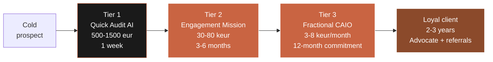

**Each tier has a distinct commercial function:**

| Tier | Commercial function | Role in the ladder |
|------|---------------------|--------------------|
| Tier 1 — Quick Audit | Opening / diagnostic | Low-risk entry, trust generator |
| Tier 2 — Mission | Active revenue core | Visible result delivery |
| Tier 3 — Fractional | Recurrence / retention | Maximizes LTV, stabilizes cash flow |

## 2.2 — Tier 1: the Quick Audit AI (€500-1,500)

The Quick Audit is **your commercial Trojan horse**. It's a self-sufficient, short, low-priced deliverable that lets a prospect try you out with no commitment, while giving you the chance to demonstrate value before even proposing a full mission.

### Ideal format

| Parameter | Recommended value |
|-----------|-------------------|
| Duration | 3-5 calendar days |
| Actual billable time | 1.5-2 days |
| Client touchpoints | 1 kickoff (60 min) + 1 readout (90 min) |
| Deliverable format | 15-25 page PDF report + 20-30 slide deck |
| Sale price | €500 (SMB <50), €1,000 (50-200), €1,500 (200+) |
| Gross margin | 80-90% |

### Deliverable contents

The Quick Audit must answer 6 questions every executive asks but rarely verbalizes:

1. **Where am I?** — Current AI maturity (1-5 scale).
2. **What are my competitors doing?** — Express sector AI benchmark.
3. **What should I prioritize?** — Top 3 high-ROI use cases.
4. **How much does it cost?** — Budget envelope for each use case.
5. **Who on my team can lead this?** — Internal champion identification.
6. **What's my 12-month roadmap?** — Quarter-sequenced action plan.

### Report structure (15-25 page template)

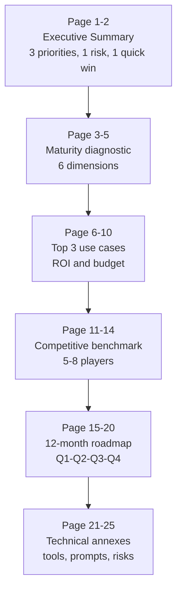

### Quick Audit pricing by segment

| Segment | List price | Avg negotiated price | Actual time |
|---------|-----------|----------------------|-------------|
| SMB < 50 people | €500 | €500 | 1 day |
| SMB 50-250 | €1,200 | €900 | 1.5 days |
| Mid-market 250-2,000 | €1,500 | €1,200 | 2 days |
| Scale-up Series A/B | €1,500 | €1,500 | 2 days |

### Why €500 is psychologically magical

€500 excl. VAT falls under most SMB approval thresholds (a manager can sign without committee). It sits in the same range as a professional training or an annual SaaS tool — a "normal" price in the exec's mental grid. Above €1,500, you enter the long approval cycle.

### Typical conversion rate Quick Audit → Mission

On a sample of 50 Quick Audits done by French CAIO consultants in 2024:

| Outcome | % of audits |
|---------|-------------|
| Mission quote sent within 30 days | 76% |
| Mission signed within 90 days | 62% |
| Mission signed >€100k | 18% |
| No follow-up | 24% |

**Conclusion**: even at €500, the Quick Audit is profitable because it acts as an ultra-effective commercial qualifier.

## 2.3 — Tier 2: the Engagement Mission (€30-80k)

Your flagship product. A CAIO engagement mission spans 3-6 months, with regular commitment (often 2-4 days/week), and a clear business deliverable: one or more AI use cases deployed, a trained team, initial AI governance.

### Ideal format

| Parameter | Recommended value |
|-----------|-------------------|
| Duration | 12-24 weeks |
| Typical commitment | 2-4 days/week |
| Total day volume | 30-80 days |
| Contract format | Fixed-fee (preferred) or T&M |
| Fixed-fee price | €30,000-€120,000 |
| Implied day rate | €1,000-€1,500 |
| Payment | 30% at signing, 40% mid-mission, 30% final deliverable |

### 4-phase structure (typical 8 weeks)

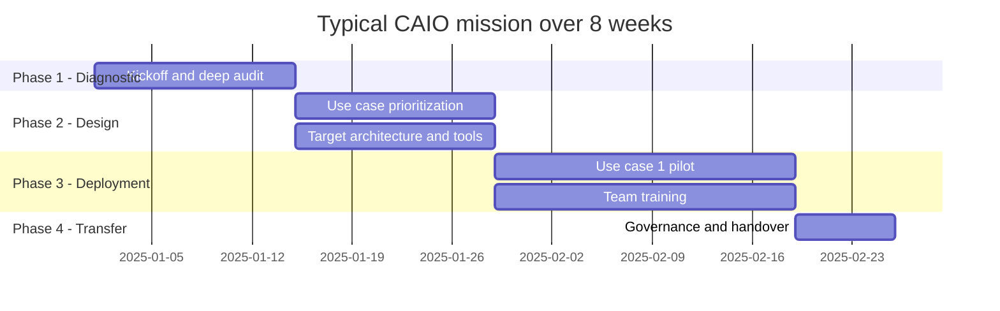

### Mission pricing grid by complexity

| Complexity | Days | Fixed-fee | Target |
|------------|------|-----------|--------|
| Light — 1 use case, <50 people | 25-30 d | €30-45k | Small SMB |
| Standard — 2 use cases, 50-200 people | 40-50 d | €55-75k | Mid-sized SMB |
| Advanced — 3+ use cases, 200-500 people | 60-80 d | €85-120k | Mid-market |
| Premium — full AI transformation, 500+ people | 100+ d | €150-250k | Large company |

### Recommended payment schedule

To protect cash flow and incentivize the client:


Never sign a mission >€30k without a deposit. Never accept 60-day payment terms beyond half the total.

## 2.4 — Tier 3: the Fractional CAIO (€3-8k/month)

The Fractional CAIO is commercially the most powerful format but the hardest to sell cold. It's a **monthly subscription** for a fraction of your time (typically 1 day/week, sometimes 2), billed on a 6-12 month commitment.

### Ideal format

| Parameter | Recommended value |
|-----------|-------------------|
| Commitment length | 6-12 months (min 6) |
| Time engaged | 1-2 days/week |
| Monthly fee | €3,000-€8,000 |
| Implied day rate | €750-€1,000 (slight discount vs mission) |
| Termination | 60-day notice |
| Fixed ritual | 1 monthly exec committee + Slack/email presence |

### What the client buys (in one sentence):

> "A CAIO expert who comes 1 day a week, joins the exec committee, drives the company's AI roadmap, trains the teams, saves the CEO's time, and for whom AI is a full-time job — at a cost 4-6x lower than an equivalent FTE."

### Fractional CAIO pricing by format

| Format | Days/month | Monthly fee | Implied day rate | Target |
|--------|-----------|-------------|------------------|--------|
| Fractional Light | 2 days | €2,500 | €1,250 | SMB <50 |
| Fractional Standard | 4 days | €4,500 | €1,125 | SMB 50-250 |
| Fractional Intensive | 6 days | €6,500 | €1,080 | Mid-market 250-1,000 |
| Fractional Exec | 8 days | €8,500 | €1,060 | Mid-market 1,000+ |

### How you actually sell a Fractional CAIO

You **never** sell a Fractional cold. The Fractional is always the **3rd contract** with a client, never the first.

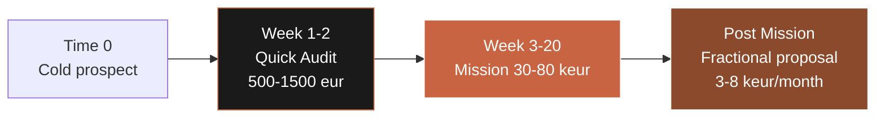

Mission → Fractional conversion runs **45-55%** when the mission went well and you anticipated the "next contract."

## 2.5 — Recurring revenue math

Comparing a "mission-only" consultant vs a "3-tier" consultant over 12 months:

| Scenario | Active revenue | Recurring | Total | Billable days | Avg day rate |
|----------|----------------|-----------|-------|----------------|--------------|
| Mission-only | €140k | €0 | €140k | 140 d | €1,000 |
| 3-tier | €90k | €60k | €150k | 115 d | €1,300 |

The 3-tier consultant earns €10k more **while working 25 fewer days**, at a 30% higher day rate. More importantly, recurring revenue **starts at €5k/month from month 1 of year 2**, vs restarting at zero every January.

## 2.6 — Prospect-ready offer sheets (templates)

Each offer must have its **offer sheet**: an A4 PDF page, sent as a quote attachment or after a discovery call. Recommended structure:

| Block | Content | Size |
|-------|---------|------|
| Header | Offer title + 1-sentence promise | 10% |
| Who it's for | 3 targeting criteria (size, sector, signal) | 10% |
| What you get | 5-8 numbered deliverables | 30% |
| Timeline | 4 steps in a timeline | 20% |
| Price & terms | Price, duration, payment, guarantees | 15% |
| Proof | 1 case study or 2 short testimonials | 15% |

### Punchy offer title examples

| Bad title | Good title |
|-----------|-----------|
| "AI consulting engagement" | "AI Quick Audit: diagnostic in 5 days" |
| "AI advisory" | "8-week CAIO Mission: 2 use cases deployed" |
| "Part-time AI consulting" | "Fractional CAIO: an AI expert 1 day/week in your ExCom" |

## Module 02 deliverable

**3 prospect-ready offer sheets** — 3 one-page PDFs, usable starting tomorrow as quote attachments or follow-up email attachments. Each sheet follows the mandatory structure. You produce:

1. **Quick Audit AI sheet** — price €500 / €1,000 / €1,500 by segment, 5-day deliverable.
2. **Engagement Mission sheet** — price €30 / €55 / €85 / €120k by complexity, 3-6 month duration.
3. **Fractional CAIO sheet** — price €2,500 / €4,500 / €6,500 / €8,500 per month by format, 6-12 month commitment.

These sheets become your primary commercial support for the next 90 days.

## Module 02 key takeaways

- **Three offers, not one** — the difference between a capped consultant and a scaling one.
- **The Quick Audit at €500-1,500** is a commercial Trojan horse converting at 60-70% into a mission.
- **The fixed-fee Mission at €30-120k** is the revenue core — with a payment schedule that protects your cash.
- **The Fractional CAIO at €3-8k/month** creates the recurrence that stabilizes your year and 3x your LTV.
- **Never sell a Fractional cold** — always after a successful mission. The Audit → Mission → Fractional sequence is the real heart of the model.
- **Target conversion rates**: 76% audit → mission quote, 62% audit → signed mission, 50% mission → Fractional.

---

---

# Module 03 — Selling AI to non-technical executives

**Length: 1h30 · Format: sales psychology + sales script + objection handbook**

## Module objectives

By the end of this module, you will be able to:

1. Understand the **3 buying triggers** that push a non-technical CEO to invest in an AI mission, and activate them in your discovery calls.
2. Master the **imaginary client case** technique — a commercial storytelling that conveys AI value without ever discussing technology.
3. Execute a **45-minute discovery call** following a proven structure (SPIN revisited), resulting in either a Quick Audit sold or a fast NO.
4. Answer the **10 most frequent objections** without defensiveness or technical over-explanation.
5. Close an audit at €500-1,500 **at the end of the first call** when the prospect is hot.

## 3.1 — The fundamental paradox of AI sales

You're facing an executive who knows they must invest in AI but doesn't really understand what you do. This paradox creates a very particular commercial dynamic:

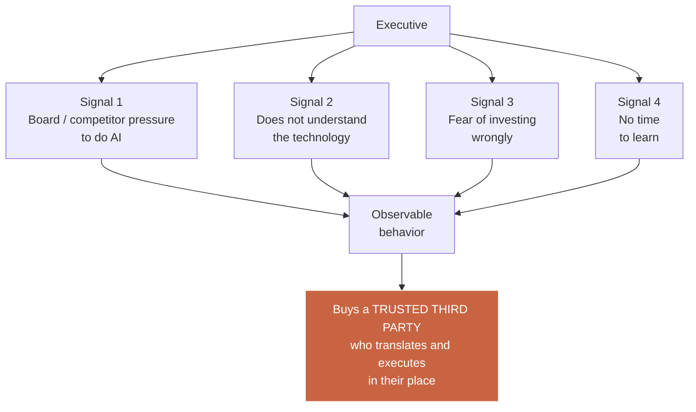

**Direct commercial consequence:** you're not selling technology. You're selling **perceived risk reduction** and **execution speed**. The executive pays to stop having to think about it.

## 3.2 — The 3 buying triggers for a CEO on an AI mission

In 95% of cases, the purchase of a CAIO mission is triggered by one of these three specific events. Recognizing them lets you adapt your pitch in real time.

### Trigger 1 — Competitive fear

A competitor publicly announced an AI initiative (LinkedIn post, press article, client mentions it during a meeting). The CEO realizes they're visibly behind.

**Language signals**: "We see our competitors jumping in," "So-and-so launched something, we need to do something," "I don't want us to miss the boat."

**Your sales angle**: talk benchmarks, speed to implementation, closing the gap.

### Trigger 2 — Board / investor pressure

The CEO just came out of a board where someone asked, "and what are you doing on AI?" and they had no satisfying answer. Classic in scale-ups and PE-backed mid-markets.

**Language signals**: "We have a board in 3 weeks, I need to present something," "Our shareholders are pushing on this topic," "I need a clear plan."

**Your sales angle**: tangible deliverables within 4-8 weeks, "board-presentable" format, structured roadmap.

### Trigger 3 — Internal productivity loss

The CEO sees teams wasting time on AI-doable tasks, or competitors gaining velocity through AI while they stagnate.

**Language signals**: "We're swamped," "I need to free up my teams' time," "We're drowning in operations."

**Your sales angle**: internal ROI, very concrete use cases, measurable time savings.

## 3.3 — Synthesis: adapt your pitch to the trigger

| Trigger | Dominant emotion | Sales angle | Focus deliverable |
|---------|-------------------|-------------|-------------------|
| Competitive fear | Anxiety | Speed, benchmark | Fast audit + top 3 use cases |
| Board pressure | Perception stress | Presentable deliverable | Q1-Q4 roadmap in slides |
| Productivity loss | Ops fatigue | Internal ROI, time savings | Use case with before/after metrics |

## 3.4 — The "imaginary client case" technique

This is the most powerful sales technique Marc can learn. It solves a universal problem: at the start of CAIO repositioning, you don't yet have 10 real case studies to tell.

The technique: tell an **imaginary but plausible client case**, built from real observed dynamics, letting the prospect project themselves without you lying about a specific client.

### Imaginary client case structure (6 narrative beats)

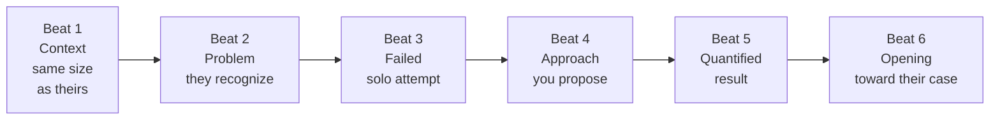

### Example imaginary client case (90-second pitch)

> "Let me give you a concrete example. A recent client of mine — an 80-person HR consulting firm, ~€10M revenue, very close to your profile — had exactly your problem: consultants spent 30% of their time producing repetitive deliverables (sales proposals, meeting notes, interim deliverables). The CEO had tried deploying ChatGPT Team internally, but after 3 months, only 15% of the team used it, without standards, without clear confidentiality rules.
>
> What we did on an 8-week mission: identified the 3 highest-ROI use cases, built a standardized prompt system for each one integrated into their Notion, trained managers on change management, and set up a quarterly AI committee. Result after 6 months: 68% adoption, measured 22% hour savings on targeted tasks, equivalent to 4 FTEs freed up over the year.
>
> Does this context have similarities to yours?"

The prospect almost always nods. You've passed three messages:
1. You know their type of company.
2. You have a structured framework that works.
3. The ROI is quantified and plausible.

### Ethical rule of the imaginary client case

The case must be **built from real observations** (benchmarks, press, conversations, public studies). It must never lie about a specific client. Wording like "a recent client," "a similar client," "a case I led" is acceptable as long as you have at least one real similar mission in your history. If you don't, use "a peer told me," "I studied the case of" — commercial honesty is mandatory.

## 3.5 — The 45-minute discovery call (proven structure)

A well-structured discovery call runs in 5 phases. Each has a precise commercial objective.

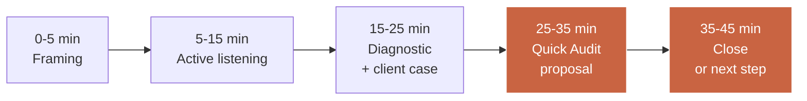

### Phase 1 — Framing (0-5 min)

Your objective: assert your expertise without overdoing it, and set the call's promise.

**Key phrases:**
> "Thank you for your time. The goal of these 45 minutes is simple: I'll understand where you stand on AI, identify whether I can add value, and if so, we'll talk about a concrete first step. If I can't add value, I'll tell you so just as clearly."

### Phase 2 — Active listening (5-15 min)

Your objective: let the prospect talk uninterrupted to identify their buying trigger (competitive fear, board, productivity).

**Key questions:**
> "What made you accept this call today? What's happening in your company around AI in the last 3 months? What have you already tried?"

### Phase 3 — Diagnostic + imaginary client case (15-25 min)

Your objective: mirror their problem, demonstrate you've solved it elsewhere.

Ask 2-3 targeted diagnostic questions, then deliver the imaginary client case.

### Phase 4 — Quick Audit proposal (25-35 min)

Your objective: **never** propose a mission in the first call. Always propose a Quick Audit.

**Key phrases:**
> "From what I'm hearing, there's clearly a topic. But before proposing a €50-80k mission, we need to agree on the diagnostic. What I propose: start with a Quick Audit: 5 days, €[500/1,000/1,500], I deliver a 20-page report with the 3 priorities I'd recommend if I were your CAIO. At the end, you decide: run it yourself, work with me, or stop there."

### Phase 5 — Close or next step (35-45 min)

Your objective: leave the call with either a signature or a precise date.

**Key phrases:**
> "Is there anything blocking us from starting next week? What's your decision process on your side?"

## 3.6 — The 10 classic objections and their responses

| # | Objection | Typical response |
|---|-----------|-------------------|
| 1 | "We don't have the budget" | "The Quick Audit is €500-1,500, below your approval threshold. Afterward, you'll have a precise quote to decide." |
| 2 | "We're too small for AI" | "SMBs of 20-50 people are actually those gaining the most in productivity — I have cases to share." |
| 3 | "Our teams already use ChatGPT" | "That's exactly the signal for a framework — 85% of individual uses die out without structure." |
| 4 | "We don't have the data" | "99% of SMB use cases don't need proprietary data. My audit will show it." |
| 5 | "We'll wait for things to stabilize" | "The cost of waiting in 2025 exceeds the cost of action. I'll prove it quantified." |
| 6 | "We'd rather hire a full-time CAIO" | "A senior FTE costs €180k/year. A Fractional €60k/year. And starts in 15 days, not 6 months." |
| 7 | "Why you rather than a large agency?" | "A large agency will bill you €1,200/day in juniors. With me, you have the decision-maker directly, at €1,000/day." |
| 8 | "We're unsure about AI risks" | "The Quick Audit includes a risk matrix — GDPR, hallucinations, vendor lock-in. That's exactly what I address." |
| 9 | "My team will fear losing their jobs" | "My change framework positions teams as copilots, not victims. We co-build with them." |
| 10 | "I need to discuss with my partner/board" | "Sure. I'll send a 1-page summary email + the Quick Audit sheet. Let's reconnect Thursday at 2pm?" |

## 3.7 — The 5 sales traps to avoid

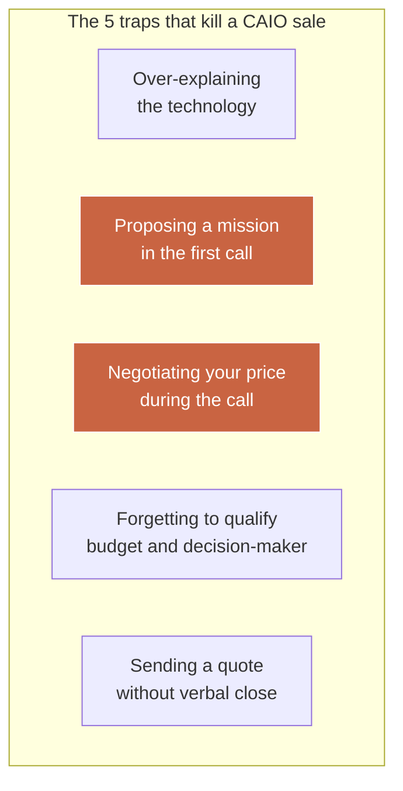

| Trap | Why it's a problem | Replacement |
|------|---------------------|-------------|
| 1. Over-explaining tech | Prospect disengages or labels you "technical" | Only talk business outcomes |
| 2. Proposing mission in 1st call | Sounds desperate, skips Quick Audit | Always Quick Audit first |
| 3. Negotiating price | Devalues offer, creates precedent | "I hold the price. We'll see on scope." |
| 4. Not qualifying budget/decider | 50% of quotes go into the void | Direct questions in phase 2 |
| 5. Sending quote without close | Reply rate drops to 20% | Always verbal close + follow-up date |

## 3.8 — The Claude prompt to prepare a discovery call

Before each call, Marc can use this simple prompt to prepare a personalized imaginary client case.

```text
You are a senior CAIO specialized in [PROSPECT_SECTOR].
My prospect: [COMPANY_NAME], [SIZE] people,
sector [SECTOR], decision-maker [CONTACT_TITLE].

Build me in a 90-second spoken pitch:
- 1 plausible imaginary client case in their sector
- 3 diagnostic questions to ask them
- 2 likely buying triggers for this profile
- 5 potential objections + my responses

Format: flowing text, ready to be read aloud in preparation.
```

This prompt saves 20 minutes per call prep and significantly improves closing.

## Module 03 deliverable

**Complete CAIO sales script + 10-objection handbook** — an 8-10 page Notion document containing:

1. **45-minute discovery call structure** (5 phases, key questions, memorable phrases).
2. **3 pre-written imaginary client cases** (1 pro services SMB, 1 industrial mid-market, 1 tech scale-up) — 90 sec each, ready for oral delivery.
3. **10 objection + response handbook** — to memorize and practice 3x per week.
4. **Claude prompt template** to prep a call in 5 minutes.
5. **Post-call checklist** (follow-up email, relance calendar, Pipedrive/HubSpot updates).

## Module 03 key takeaways

- A non-technical executive **doesn't buy technology** — they buy **risk reduction** and **speed**.
- The 3 buying triggers: **competitive fear, board pressure, productivity loss**. Adapt the pitch to the detected trigger.
- The **imaginary client case technique** (6 beats, 90 seconds) solves the lack of CAIO history.
- A **45-minute discovery call** is structured in 5 phases. Never propose a mission in the first call — always a Quick Audit.
- The **10 objections** must be memorized and practiced. A consultant who hesitates on an objection loses the sale.
- **Mandatory verbal close** before sending a quote. Without close, reply rate drops to 20%.

---

---

# Module 04 — Delivering an AI mission without complex tooling

**Length: 1h15 · Format: delivery framework + report template + light tooling**

## Module objectives

By the end of this module, you will be able to:

1. Deliver an 8-week CAIO mission without writing a single line of code, using a combination of accessible no-code tools.
2. Create a **wow effect in week 1** — the early deliverable that shifts client confidence and protects the rest of the mission.
3. Use **template systems** to deliver 5x faster than a consultant starting from scratch each time.
4. Build a **mission report** that not only concludes the mission but **naturally generates 2-3 recommendations** for Fractional or new missions with the same client.
5. Understand the **CAIO delivery 80/20 rule**: 80% of the result comes from 20% of well-chosen deliverables.

## 4.1 — The "fast and visible result" rule

The biggest trap for beginning CAIO consultants is **fear-driven diligence**. They do too much, too long, and arrive in week 6 with technical deliverables nobody can use. The client pays but isn't transformed.

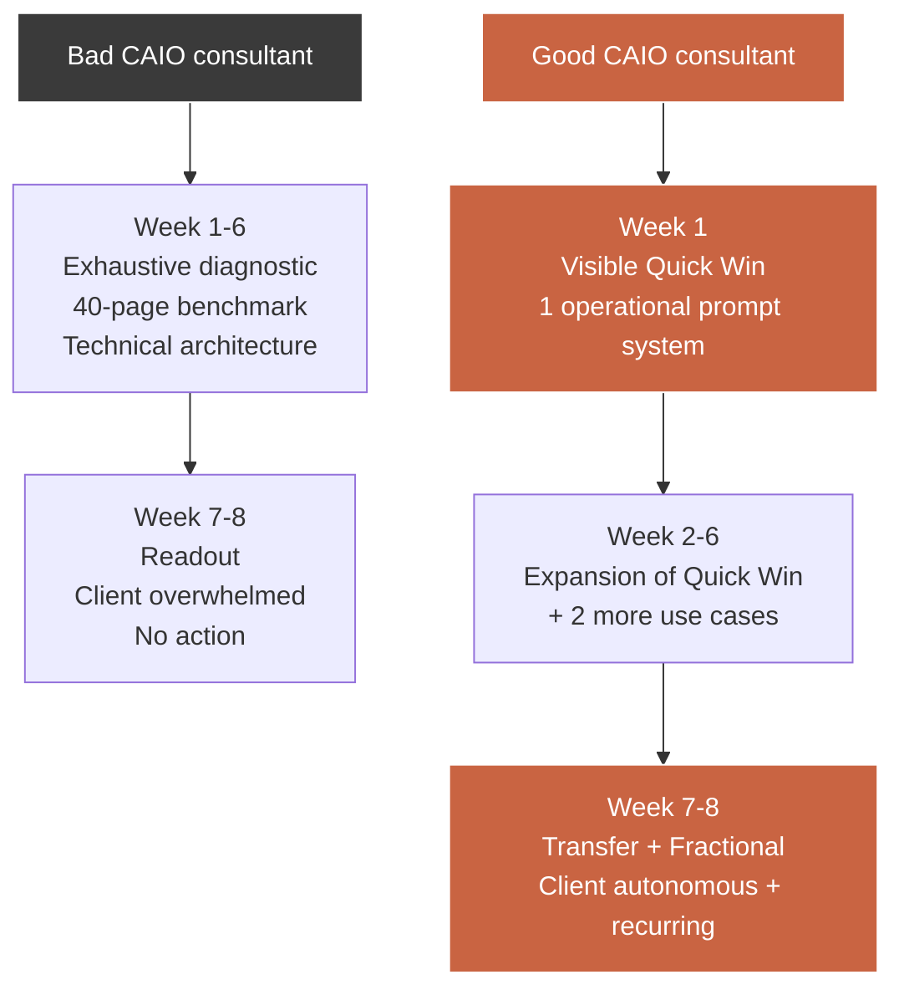

## 4.2 — 8-week mission framework (details)

The standard framework for any 8-week CAIO mission, regardless of sector.

| Week | Focus | End-of-week deliverable |
|------|-------|--------------------------|
| 1 | Kickoff + Quick Win | 1 operational prompt system or no-code workflow |
| 2 | Deep diagnostic | 15-page diagnostic report |
| 3 | Use case prioritization | ROI × effort matrix, top 3 selected |
| 4 | Use case #1 design | Functional specs + prompts |
| 5 | Use case #1 pilot | Deployed pilot (5-10 users) |
| 6 | Use case #2 + training | Use case #2 in pilot + 1 training session |
| 7 | Governance + AI committee | Internal AI charter + structured AI committee |
| 8 | Readout + Fractional proposal | 30-page final report + Fractional proposal |

## 4.3 — Week 1: building the wow effect

Week 1 is **critical**. If the client hasn't seen a concrete result by end of week 1, the mission drowns in diagnostic for 6 weeks and you lose their trust.

### The 3 canonical candidates for your week-1 Quick Win

| Quick Win | For whom | Effort | Visible impact |
|-----------|----------|--------|----------------|
| Standardized prompt system for proposal writing | Consulting firms, agencies | 0.5 day | Massive — visible to all sales reps |
| Inbound email auto-analysis workflow (Gmail → classification → Slack) | SMB services | 1 day | Visible to CEO from Monday on |
| Internal HR assistant (Notion + ChatGPT embed) for recurring questions | SMB 50-200 people | 1 day | Visible to HR and managers |

The principle: **a deliverable that improves something the client does every day**. Not a technical feature. A perceivable time gain from first use.

### Week 1 delivery script

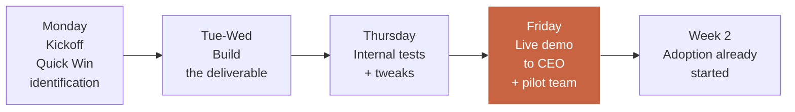

## 4.4 — The tools Marc must master (none are IDEs)

Marc is not a developer. He doesn't need to code. But he must master a light stack of 6-8 tools letting him deliver 90% of SMB/mid-market CAIO missions without ever touching code.

| Tool | Use | Time to master | Monthly cost |
|------|-----|----------------|---------------|
| Claude / ChatGPT Plus | Prompt generation, diagnostic | 1h | €20 |
| Claude Projects / GPT Custom | Client-dedicated assistant | 1h | Included |
| Notion | Mission hub + documentation | 3h | €10 |
| Zapier or Make | No-code workflows | 5h | €20-40 |
| Airtable | Light databases | 3h | €12 |
| Loom | Readout videos | 1h | €13 |
| Tally / Typeform | Audit questionnaires | 1h | €0-30 |
| Google Workspace | Client collaboration | Already mastered | €6 |

**Total monthly investment**: €80-130 for an operational CAIO stack. Against a €1,200 day rate, it's negligible.

## 4.5 — The 3 template systems Marc should build once and reuse everywhere

The main productivity lever of a CAIO is **reusable templates**. Build once, deliver 10 times.

### Template 1 — AI maturity diagnostic (Tally + Airtable)

A 30-question survey that, once filled by a client, automatically generates an AI maturity score across 6 dimensions. Built once in Tally + Airtable, deploys on each new client in 5 minutes.

### Template 2 — Prompt library by function (Notion)

A Notion database with 80-120 pre-written system prompts, classified by function (Marketing, HR, Sales, Ops, Finance, Legal), language (FR/EN), and use case. When a client needs a prompt, you customize it in 10 minutes instead of writing from scratch.

### Template 3 — Use case ROI matrix (Google Sheets)

A Sheets file with 50 AI use cases pre-scored on 4 dimensions (effort, impact, ROI, risk). Filter by sector and size, get your top-3 recommendation in 10 minutes.

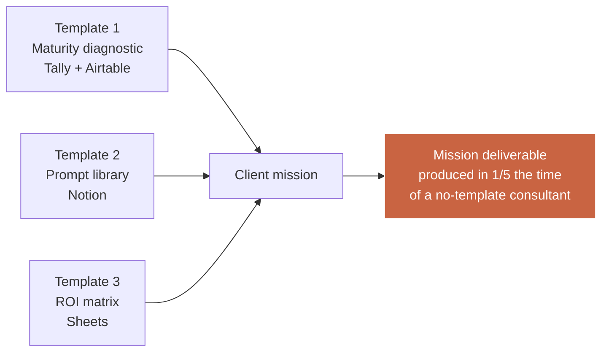

## 4.6 — The mission report that generates recommendations

The final mission report is not a conclusion point. It's the **most commercially profitable document you'll produce**, because:
- It's archived and re-read by the client for 6-24 months.
- It's often shared internally (ExCom, board), giving you visibility with new decision-makers.
- It must explicitly **open the door to what's next** (Fractional or new mission).

### Final report structure (30-page template)

| Block | Pages | Objective |
|-------|-------|-----------|
| Executive Summary | 2 | 5-min read for CEO/board |
| Mission recap and methodology | 3 | Framing |
| Diagnostic and achieved maturity | 5 | Measured state |
| Deliverables and measured results | 8 | ROI proof |
| Next-quarter recommendations | 5 | Commercial opening |
| "Next step" proposal | 3 | Fractional or new mission |
| Technical annexes | 4 | For archiving |

### The 3 recommendations that open a commercial next step

| Recommendation | Commercial target | Typical conversion |
|----------------|-------------------|---------------------|
| "Deploy an additional use case Q1+1" | New mission €30-50k | 25% |
| "Set up a monthly AI committee led by a CAIO" | Fractional €4-6k/month | 45% |
| "Audit a new department (HR, Finance)" | New Quick Audit | 35% |

## 4.7 — The #1 risk in CAIO delivery

Risk #1 isn't technical. Not GDPR. Not hallucination. It's **usage abandonment**: the client deploys the tools, uses them for 2 weeks, then falls back into old habits.

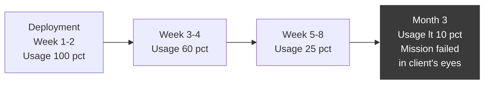

**Mandatory countermeasures in any CAIO mission:**
1. Monthly AI committee with usage metrics (adoption rate, satisfaction, effective use cases).
2. Internal champion identified and trained before mission end.
3. Short AI charter (1 page) co-signed by CEO and displayed in offices/Slack.
4. Fractional proposal guaranteeing your monthly post-mission presence.

## Module 04 deliverable

**8-week CAIO mission delivery framework** — a Notion document including:

1. **8-week mission planning template** (week by week, with expected deliverables).
2. **10 week-1 Quick Win catalog** (description, effort, impact, applicable sectors).
3. **Recommended tool stack** (the 8 tools to master with 15-min video tutorials each).
4. **The 3 system templates to build** (maturity diagnostic, prompt library, ROI matrix) — detailed structure so Marc builds them in 2 weekends.
5. **Final mission report template** (30 pages, with sections and Claude prompts to speed up drafting).

## Module 04 key takeaways

- The **fast and visible result rule**: a deliverable in week 1, not week 6.
- **8 weeks = 8 clearly sequenced steps**. Week 1 = wow effect. Week 8 = Fractional proposal.
- **Light no-code stack**: Claude/GPT + Notion + Zapier + Airtable + Loom covers 90% of SMB/mid-market CAIO missions.
- **3 reusable templates** (diagnostic, prompt library, ROI matrix) divide delivery time by 5.
- **The final report** is the most commercially profitable doc you'll produce. It must open the next step (Fractional or new mission).
- **Risk #1 = usage abandonment**. Monthly AI committee + internal champion + Fractional = mandatory countermeasures.

---

---

# Module 05 — Selling AI systems, not just consulting

**Length: 1h15 · Format: product thinking + systems catalog + hybrid pricing**

## Module objectives

By the end of this module, you will be able to:

1. Understand the difference between **selling time** (daily consulting) and **selling a product** (reusable AI system), and the economic reasons making the second 5-10x more profitable.
2. Identify **the 3 types of AI systems** a consultant can sell without being a developer.
3. Price a system between **€500 and €5,000** based on complexity and perceived value.
4. Combine **consulting + system** in a single commercial proposal to multiply average deal size by 1.5-2x.
5. Prepare **the transition to the core CAIO Academy training** that provides Marc with pre-built systems.

## 5.1 — The structural ceiling of daily consulting

A consultant selling only time hits an inescapable mathematical ceiling.

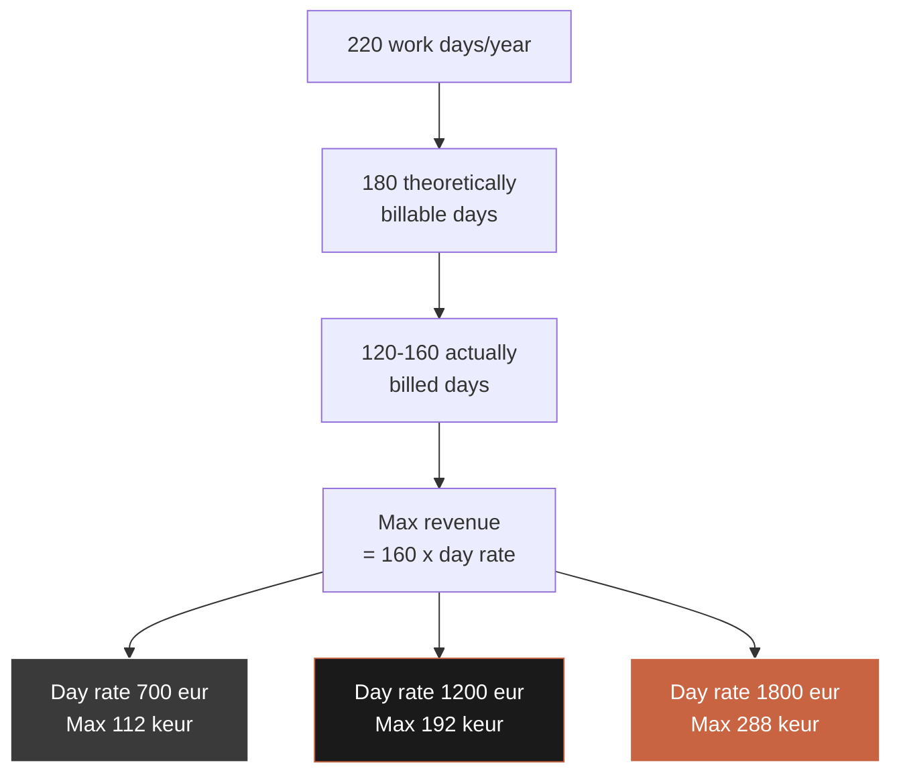

Even at €1,800/day (top 10% of the CAIO market), the revenue ceiling is around €290k annually. To move beyond that to €400-600k without doubling hours, the only path is to **inject product sales** into your offer.

## 5.2 — What's a "sellable AI system"?

A sellable AI system has 5 characteristics:

| # | Characteristic | Why it matters |
|---|----------------|-----------------|
| 1 | **Standardized** — same structure for all clients | To deliver in a few hours |
| 2 | **Documented** — README + user guide | So the client uses it without you |
| 3 | **Customizable** — 10-20% customization at deployment | To fit the client context |
| 4 | **Fixed price** — not disguised day rate | To exit the time-money equation |
| 5 | **Reusable** — build once, sell 20 times | To scale revenue without scaling hours |

## 5.3 — The 3 types of systems a non-dev consultant can sell

### Type 1 — Prompt systems (€500-1,500)

A set of specialized prompts per business function, delivered in a client Notion with documentation and usage guide. Built in 4-8 initial hours, sold €500-1,500 per client, customized in 2 hours.

**Concrete examples:**
- 25-prompt pack to automate sales call notes
- 15-prompt pack to generate HR job descriptions
- 20-prompt pack to create B2B marketing content

### Type 2 — No-code workflows (€1,500-3,000)

A Zapier/Make workflow connecting several client tools + an AI brick. Built in 8-16 hours, sold €1,500-3,000.

**Concrete examples:**
- "Gmail → ChatGPT → Slack" workflow to auto-qualify inbound leads
- "Notion → Claude → Linear" workflow to turn specs into tickets
- "CRM → ChatGPT → Docs" workflow to generate sales proposals

### Type 3 — Dedicated assistants (€2,500-5,000)

A Custom GPT or Claude Project pre-configured for a specific client use, delivered with 20-50 reference docs, an optimized system prompt, and usage documentation. Built in 16-32 hours, sold €2,500-5,000.

**Concrete examples:**
- "HR Helper" assistant for recurring HR questions in an SMB
- "Proposal Writer" assistant for drafting sales proposals from briefs
- "Legal Draft" assistant for drafting contract clauses per template

### Claude Projects configuration example (pseudocode)

```text
ASSISTANT : "Proposal Writer for [Client]"
MODEL : Claude 3.5 Sonnet
SYSTEM PROMPT :
  "You are a proposal writer for [Client Company].
   Use ONLY facts from the reference docs below.
   Match the client's tone: professional, concise, benefit-driven.
   Always structure: Context -> Challenge -> Approach -> Deliverables -> Investment -> Next Steps.
   Never invent numbers. If a fact is missing, ask."
REFERENCE DOCS (50 uploads) :
  - 10 past proposals (success)
  - 5 case studies
  - Pricing grid 2025
  - Brand voice guide
  - Standard T&Cs
```

## 5.4 — Comparison of the 3 system types

| Criterion | Type 1 — Prompts | Type 2 — Workflows | Type 3 — Assistants |
|-----------|--------------------|--------------------|---------------------|
| Price | €500-1,500 | €1,500-3,000 | €2,500-5,000 |
| Initial build time | 4-8h | 8-16h | 16-32h |
| Per-client deployment time | 2h | 4h | 6h |
| Gross margin | 90% | 85% | 80% |
| Sales per year (typical) | 15-30 | 8-15 | 5-10 |
| Annual revenue potential per system | €15-30k | €15-40k | €15-40k |
| Ease of sale (1-10) | 9 | 6 | 5 |
| Technical dependency | Low | Medium | Medium |

## 5.5 — Hybrid consulting + systems model math

Scenario A: 100% consulting consultant
- 160 days × €1,200 = **€192k**

Scenario B: hybrid consultant
- 130 consulting days × €1,300 = €169k
- + 20 systems sold × €1,500 avg = €30k
- **Total = €199k**
- **Days worked: 130 + ~15 equivalent on systems = 145 days**

Scenario B earns €7k more while working 15 fewer days — the freedom ratio changes entirely.

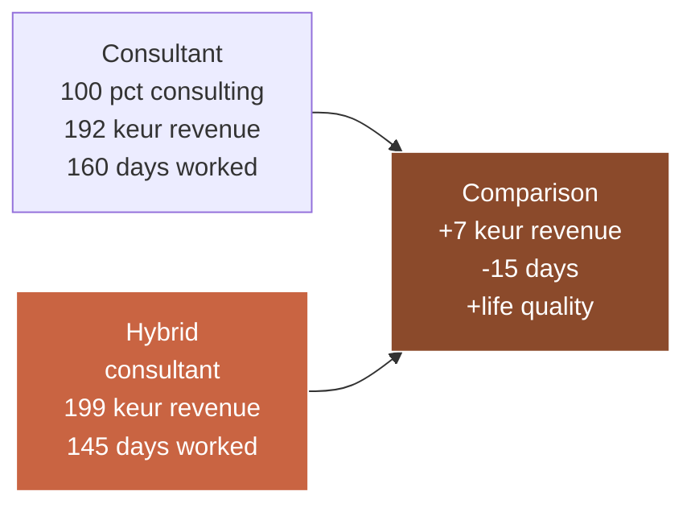

## 5.6 — How to combine consulting + system in one proposal

The most powerful commercial technique: **systematically include a system in every consulting mission**.

### Hybrid proposal structure

| Block | Price | Description |
|-------|-------|-------------|
| Main consulting mission | €55k | 8-week CAIO engagement |
| System 1 (included) | €1,500 value | Prompt pack for client's business |
| System 2 (included) | €2,000 value | Zapier workflow to automate X |
| System 3 (option) | +€2,500 | Dedicated "[Client Name] GPT" assistant |
| Post-mission Fractional (option) | €4,500/month | 1 day/week for 6 months |

The client perceives **4-5 deliverables** instead of one, justifying a higher total price and limiting negotiation. Crucially, systems become **tangible artifacts** the client keeps after mission end — visible ROI proof.

## 5.7 — The gateway to the core CAIO Academy training

At this point in the Track, Marc has understood the model: selling consulting + systems is the path to revenue beyond €200k.

But a practical question remains: **where does Marc find the systems to sell?**

Three options:

| Option | Effort | Cost | Outcome |
|--------|--------|------|---------|
| 1. Build systems yourself | 3-6 months part-time | Lost time + tech learning | Uncertain |
| 2. Subcontract to a developer | €5-15k per system | Tech dependency | Medium |
| 3. **Access a pre-built systems library via the core CAIO Academy training** | Zero build effort | Training cost | Ready to deploy |

The core CAIO Academy training gives you access to:
- **3 pre-built, documented AI systems** (prompt pack, no-code workflow, dedicated assistant).
- **Source system prompts** you customize per client.
- **Deployment manuals** (5-10 pages per system) to white-label.
- **Commercial resale license** — resell to clients with no extra fee.

This is exactly the gateway this Track opens. The Monetization Track gives you the commercial mechanics; the core training gives you the products.

## Module 05 deliverable

**Sellable AI systems catalog (template)** — a Notion document containing:

1. **Matrix of 3 system types** (prompts, workflows, assistants) with price, effort, target.
2. **Top 20 system ideas** classified by function (Marketing, HR, Sales, Ops, Finance, Legal) with suggested price.
3. **Hybrid consulting + system proposal template** — to systematically include a system in every mission.
4. **Onboarding plan for a sold system** (from 0 to deployed in 1 week).
5. **"Sellable system" checklist** — the 5 criteria for reusability.

## Module 05 key takeaways

- **Daily consulting has a mathematical ceiling** at €250-290k/year. To go beyond, you must sell products.
- **Three system types** are accessible to a non-dev consultant: prompts (€500-1,500), no-code workflows (€1,500-3,000), dedicated assistants (€2,500-5,000).
- The **hybrid consulting + systems model** lets you earn more while working less, and improves retention.
- **Including a system in every mission proposal** increases average deal size by 1.5-2x.
- **The natural gateway** toward €250k+ revenue is the core CAIO Academy training, providing pre-built documented systems ready to resell.

---

---

# Module 06 — Client acquisition: the channels that actually work

**Length: 1h15 · Format: channel strategy + LinkedIn playbook + outreach templates**

## Module objectives

By the end of this module, you will be able to:

1. Identify the **only 3 acquisition channels** that actually work for a B2B CAIO consultant in 2025.
2. Build an **operational LinkedIn machine** generating 3-5 discovery calls per week.
3. Write **outreach messages** achieving 15-25% reply rate (vs 3-5% for classic cold).
4. Turn your **past clients into a referral machine** with a simple, ethical system.
5. Calibrate your **weekly commercial time** (how many hours per week on what).

## 6.1 — The 3 channels that matter for a CAIO in 2025

B2B marketing is saturated. For a CAIO consultant, only 3 channels reliably produce positive ROI.

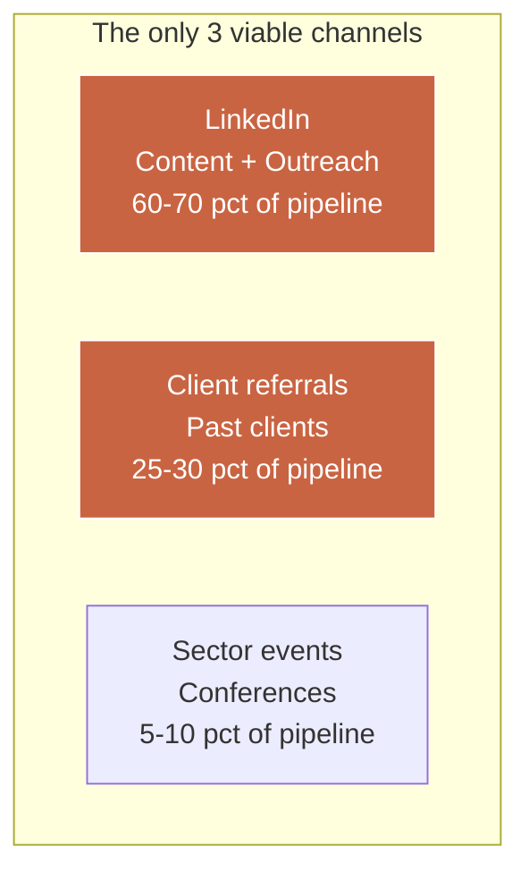

| Channel | % of pipeline | Weekly effort | Typical CAC | Sales cycle |
|---------|---------------|---------------|-------------|--------------|
| LinkedIn (content + outreach) | 60-70% | 6-8h | €250-400 | 4-8 weeks |
| Client referrals | 25-30% | 1-2h | ~€0 | 2-4 weeks |
| Sector events | 5-10% | 20-40h/year | €800-1,500 | 8-16 weeks |

Channels that **don't work** for a CAIO: B2B Google Ads (too expensive, bad intent), pure SEO (too slow), Twitter/X (wrong buying intent), freelance platforms like Malt or Comet (price pressure downward).

## 6.2 — LinkedIn: channel #1 (full playbook)

LinkedIn is **the #1 B2B acquisition channel** for independent consultants in France and Europe. The reason: it's where SMB and mid-market execs go several times a week, and its algorithms prioritize profiles that post regularly.

### The 4 pillars of an effective LinkedIn CAIO presence

```mermaid
flowchart LR
    P1[Pillar 1<br/>Optimized<br/>profile] --> R[Result<br/>3-5 discovery<br/>calls<br/>per week]
    P2[Pillar 2<br/>Regular<br/>content] --> R
    P3[Pillar 3<br/>Targeted<br/>outreach] --> R
    P4[Pillar 4<br/>Smart<br/>engagement] --> R

    style R fill:#c96442,stroke:#fff,color:#fff
```

### Pillar 1 — The optimized CAIO profile

Your profile must say in 3 seconds: "This person is an AI expert, for my sector, and can help me."

| Element | Good pattern | Bad pattern |
|---------|--------------|--------------|
| Photo | Professional, neutral background, smile | Selfie, filter, home background |
| Banner | "Fractional CAIO for pro services SMB" + contact | Generic or empty image |
| Headline | "I help consulting firms generate 20% productivity via AI • Fractional CAIO" | "Passionate AI consultant" |
| About | 3 paragraphs: who I am, who I serve, how to contact | Long chronological CV |
| Features | 3-5 links: Quick Audit, Calendly, case studies | Nothing or generic stuff |

### Pillar 2 — Regular content (4-week calendar)

You need to post **at least 3x per week** for 12 weeks before seeing first inbound discovery calls. It's the rule.

```mermaid
gantt
    title CAIO 4-week content calendar
    dateFormat YYYY-MM-DD
    section Week 1
    AI trend insight post           :s1, 2025-01-06, 1d
    Concrete use case post          :s2, 2025-01-08, 1d
    Opinion post                    :s3, 2025-01-10, 1d
    section Week 2
    Anonymized testimonial post     :s4, 2025-01-13, 1d
    Sector benchmark post           :s5, 2025-01-15, 1d
    Open question post              :s6, 2025-01-17, 1d
    section Week 3
    Behind the scenes post          :s7, 2025-01-20, 1d
    Common error and solution post  :s8, 2025-01-22, 1d
    Experience post                 :s9, 2025-01-24, 1d
    section Week 4
    AI trend insight post           :s10, 2025-01-27, 1d
    Mini client interview post      :s11, 2025-01-29, 1d
    Monthly recap post              :s12, 2025-01-31, 1d
```

### The 7 post formats that work

| Format | Example headline | Typical engagement |
|--------|-------------------|---------------------|
| 1. Contrarian | "Most AI audits are useless. Here's why." | Very high |
| 2. Anonymized case study | "How I helped an 80-person firm gain 22% productivity in 8 weeks" | High |
| 3. Visual framework | "3 questions to ask before launching an AI project" + carousel | High |
| 4. Opinion | "No, ChatGPT won't replace your legal consultant" | High |
| 5. Data insight | "I analyzed 50 AI audits in 2024. Here are the 3 recurring mistakes." | Medium |
| 6. Behind the scenes | "This morning, I'm presenting to an ExCom. Here's how I prep." | Medium |
| 7. Open question | "What's the biggest AI change resistance in your team?" | Variable |

### Pillar 3 — Targeted outreach (the channel that actually converts)

LinkedIn content creates visibility but **doesn't directly fill your pipeline**. Targeted outreach does.

### The outreach method that works in 2025

Goal: 3-5 discovery calls per week. Target volume: 50 personalized messages per week, 15-25% reply rate, 40-50% reply → call conversion rate.

```mermaid
flowchart LR
    List[Target list<br/>50 prospects<br/>per week] --> Sem1[Connection with<br/>personalized note]
    Sem1 --> Sem2[+7 days<br/>Value message<br/>no pitch]
    Sem2 --> Sem3[+14 days<br/>Open business<br/>question]
    Sem3 --> Sem4[+21 days<br/>Call proposal<br/>Quick Audit]

    style Sem4 fill:#c96442,stroke:#fff,color:#fff
```

### Outreach templates (personalize each send)

**Message 1 — Connection note (max 150-200 chars)**
> "Hi [First name], I see you're [role] at [company] — I work mostly with [sector] on their AI topics. Glad to connect."

**Message 2 — Value (7 days post-acceptance)**
> "Thanks for connecting [First name]. I just published an analysis on [relevant topic for their sector], might interest you: [link]. Enjoy."

**Message 3 — Open question (14 days)**
> "[First name], curious: where are you on AI at [company]? For [sector] companies your size, it's the topic coming up most in my conversations right now."

**Message 4 — Call proposal (21 days)**
> "[First name], I offer 30 min to chat about what you'd gain with a structured AI approach. I'm not selling anything in this call — I listen, challenge, give my view. [Calendly link]."

### Pillar 4 — Smart engagement

The LinkedIn algorithm rewards **quality of interactions, not just quantity**. 30 minutes daily of targeted engagement (long comments on 5-10 prospect or sector-influencer posts) multiply your own post reach by 3-4x.

## 6.3 — Client referrals: the invisible machine

Referrals are the **most profitable** but most neglected channel. A happy client = 3-5 new clients within 12 months — if you actively ask.

### The 4-step referral system

| Step | When | What to do |
|------|------|-----------|
| 1. Mid-mission (week 4) | In mission | Request a 300-500 word written testimonial |
| 2. End of mission (week 8) | Readout | Request 2-3 named introductions |
| 3. Month +3 | Post-mission follow-up | Check-in email, soft referral request |
| 4. Month +6 | Regular touch | NPS + new request |

### Referral request script (to send at end of mission)

> "[First name], the mission is wrapping up and I'm very happy with what we built together. You know my positioning — I help [sector] of [size] structure their AI strategy. Who in your network could benefit from a chat with me? If 2-3 names come to mind, I'd love for you to connect us. In return, I'll give you detailed feedback on each conversation."

Typical rate: out of 10 such requests, you get 6-8 named referrals, 40% become calls, 30% become clients. That's **0.9-1.2 new clients per request**.

## 6.4 — Calibrate your weekly commercial time

Golden rule: **25-30% of your time must be commercial** as long as your pipeline isn't saturated. Below 20%, you fall into a trough after 2-3 months.

| Activity | Hours/week | % of commercial time |
|----------|-----------|------------------------|
| LinkedIn content (creation + engagement) | 4-5h | 35% |
| Outreach (list + messages + follow-ups) | 3-4h | 25% |
| Discovery calls (3-5/week) | 3-5h | 30% |
| Referrals and past-client follow-up | 1-2h | 10% |
| **Total commercial** | **11-16h** | **100%** |

## Module 06 deliverable

**CAIO outreach message templates + 30-day LinkedIn content calendar** — a Notion package containing:

1. **Pack of 4 LinkedIn outreach templates** (connection, value, question, call) with personalization instructions.
2. **30-day content calendar** with 12 pre-written subjects adapted to CAIO positioning.
3. **7 post formats** with ready-to-use examples (contrarian, case study, framework, etc.).
4. **Referral request script** for end of mission.
5. **Weekly commercial time matrix** to apply based on pipeline saturation.

## Module 06 key takeaways

- Only **3 channels matter** for a 2025 CAIO: LinkedIn (60-70%), referrals (25-30%), events (5-10%).
- **LinkedIn = content + outreach + engagement**, not just posting. 11-16h/week for 12 weeks before first stable results.
- **4-message sequenced outreach** (connection → value → question → call) achieves 15-25% reply rate.
- **Referrals are invisible but the real machine** — 0.9-1.2 clients per properly formulated request.
- **25-30% of Marc's time must be commercial** until pipeline is saturated (>3 stable calls/week).

---

---

# Module 07 — Scaling: from freelance to AI micro-agency

**Length: 1h · Format: business model + team structure + subcontracting**

## Module objectives

By the end of this module, you will be able to:

1. Recognize the **saturation signals** indicating it's time to scale from solo freelance to micro-agency.
2. Identify the **3 first profiles to hire** and in what order.
3. Compare the **3 possible economic models**: integrated agency, network firm, freelance collective.
4. Use the **CAIO Registry** to find your first quality freelancers / subcontractors.
5. Calculate your **solo revenue ceiling** vs **target micro-agency revenue** (10-15 people, €1.5-3M).

## 7.1 — The 5 signals you're saturated solo

You're saturated (and ready to scale) if 3 of 5 signals are present for at least 2 consecutive months:

| # | Signal | Threshold |
|---|--------|-----------|
| 1 | Declining missions due to capacity | >1 declined/month |
| 2 | Day rate stable at €1,200+ | For 3 months |
| 3 | 3+ active Fractionals | Recurring >€15k/month |
| 4 | Saturated pipeline | >5 discovery calls/week |
| 5 | You sense a personal limit | Fatigue, declining new challenges |

## 7.2 — The 3 first profiles to hire

Classic mistake: hiring a "mini-you" first. Counterproductive: doubles commercial cost without easing your bottleneck (delivery).

### Profile 1 — Junior consultant-executor (first hire)

| Dimension | Detail |
|-----------|--------|
| Profile | 3-5 years experience, junior consulting or tech, €400-600/day freelance rate |
| Role | Handles 50-70% of delivery on your missions |
| Client billing | Same day rate as you (€1,200), no discount |
| Margin on their time | €600-800/day |
| Status | Freelance subcontractor, or FTE at €45-55k |
| Hiring signal | You can't handle delivery volume anymore |

### Profile 2 — Operational assistant (sometimes before or alongside)

| Dimension | Detail |
|-----------|--------|
| Profile | Admin assistant or junior project manager |
| Role | Invoicing, scheduling, CRM, follow-ups, reminders |
| Status | Freelance 20-30h/month or FTE half-time |
| Monthly cost | €1,500-2,500 |
| ROI | Frees 8-12h/week of non-billable time |

### Profile 3 — Technical specialist (freelance per mission)

| Dimension | Detail |
|-----------|--------|
| Profile | AI developer / data engineer, €600-900/day |
| Role | Implement complex systems (Type 3) you sell |
| Status | Freelance always, never FTE |
| Margin on their time | €300-500/day (you resell €1,200) |

## 7.3 — The 3 economic models compared

```mermaid
flowchart TB
    subgraph Models[Three models to scale]
        A[Model A<br/>Integrated agency<br/>10-15 FTEs<br/>Revenue 2-3 Meur]
        B[Model B<br/>Network firm<br/>3-5 partners<br/>Revenue 1.5-2.5 Meur]
        C[Model C<br/>Collective<br/>Core + 10 freelancers<br/>Revenue 800 keur-1.5 Meur]
    end

    style A fill:#1a1a1a,stroke:#c96442,color:#fff
    style B fill:#c96442,stroke:#fff,color:#fff
    style C fill:#8b4a2b,stroke:#fff,color:#fff
```

| Criterion | Integrated agency | Network firm | Freelance collective |
|-----------|--------------------|--------------|------------------------|
| People | 10-15 FTEs | 3-5 partners + freelancers | 1-2 core + 10-20 freelancers |
| Target revenue | €2-3M | €1.5-2.5M | €800k-€1.5M |
| Legal structure | SAS | SELAS / SAS | Micro-enterprise or SASU |
| Initial capital | €100-250k | €30-80k | < €10k |
| HR complexity | High | Medium | Low |
| Flexibility | Low | Medium | Very high |
| Profitability % | 15-20% | 25-35% | 40-55% |
| Time to reach | 3-5 years | 2-3 years | 6-12 months |
| **Marc's recommendation** | Rarely | **Option B target** | **Option A start** |

For 95% of CAIO consultants starting to scale, **the Collective model is the right starting point**. Keeps agility, avoids fixed costs, tests scalability before committing to a heavier structure.

## 7.4 — The CAIO Registry: finding your first quality freelancers

The **CAIO Registry** (registry.caio-academy.com, upcoming) is the professional directory of certified CAIO consultants. It's the first base where Marc can find subcontractors when his pipeline overflows.

Alternatives until the Registry launches:
- **Malt** (filters "AI", "Prompt Engineer", "AI Advisor")
- **Comet** (more senior, pricier)
- **Collectif des freelances**
- **LinkedIn** (direct messages to 2-5 year experience profiles)

### Subcontractor qualification checklist

| # | Criterion | Yes/No |
|---|-----------|--------|
| 1 | 2+ years field AI experience or equivalent | ____ |
| 2 | 2+ documented concrete AI case studies | ____ |
| 3 | Coherent day rate (€400-800) | ____ |
| 4 | Tools: Notion, Slack, Loom mastered | ____ |
| 5 | Good French written/spoken (if FR clients) | ____ |
| 6 | Accepts 3-5 day paid trial | ____ |

## 7.5 — Collective model math

```
Year N (solo, saturated):
  Marc solo → €180k revenue, 140 billed days, 55% net margin = €99k income

Year N+1 (collective started):
  Marc → 130 days × €1,400 = €182k (repositioned premium)
  3 freelance subcontractors → 120 days × €800 avg margin = €96k gross margin
  Operating costs (tools, assistant): €18k
  Marc net income: 99 + 60 = €159k (+60%)
  Billed days: 250 (solo + freelancers)
```

Year N+1 doubles total revenue, Marc's net income grows 60%, while preparing year 3 where Marc can drop to 100 billed days while keeping €150k income.

## 7.6 — Legal status: micro-enterprise, SASU, or EURL? (FR context)

Once Marc hits €1,200/day, the micro-enterprise €77,700/year cap becomes binding (hit in ~65 billed days). SASU or EURL transition becomes necessary.

| Dimension | Micro-enterprise | SASU | EURL |
|-----------|------------------|------|------|
| Revenue cap | €77,700 | Unlimited | Unlimited |
| Social charges | 22% of revenue | ~80% of net salary | ~45% of income |
| Tax | IR flat or regular | IS (25%) + IR on dividends | IR or IS at choice |
| Accounting | Ultra-simple | Annual balance mandatory | Annual balance mandatory |
| VAT recovery | No (exemption) | Yes | Yes |
| Pôle Emploi compatibility | Yes (supplement) | Yes if zero salary | Yes if unpaid managing director |
| Ideal if | Revenue < €70k | Revenue > €100k + system sales | Revenue €80-150k |

Targeting €150-200k by year 2, **SASU is nearly always the right choice** — lets you pay yourself salary + dividends, hire easily, optimize tax.

## Module 07 deliverable

**AI micro-agency business model (simulator)** — a Google Sheets file + Notion guide including:

1. **Revenue / margin / net income simulator** parametrable (freelancer count, avg day rate, occupancy rate, per-freelancer margin).
2. **Solo → collective transition checklist** (5 signals + 10 first actions).
3. **Freelance contract templates** (subcontracting, NDA, non-solicit, invoicing).
4. **Freelancer qualification sheet** (6 criteria + trial period).
5. **12-month collective transition roadmap** (month by month).

## Module 07 key takeaways

- You scale **when 3 of 5 saturation signals** are present for 2 consecutive months.
- **First hire = junior consultant-executor**, not a "mini-you" salesperson. Then operational assistant, then technical specialist.
- **The Collective model is the starting point** for 95% of cases — agility, low capital, >40% margin.
- **CAIO Registry + Malt + LinkedIn** are priority freelance recruitment channels.
- **Marc's net income can rise from €99k to €159k in year N+1** by starting a collective, even with the same billed days.
- **SASU transition** nearly mandatory beyond €100k annual revenue.

---

---

# Module 08 — 90-day plan: from €500/day to €1,200/day CAIO

**Length: 1h · Format: week-by-week execution plan + tracker + metrics**

## Module objectives

By the end of this module, you will be able to:

1. Execute a **week-by-week 90-day plan** dedicated to moving from €500/day to €1,200/day CAIO.
2. Measure progress with **5 weekly objective KPIs**.
3. Identify the **3 critical inflection points** not to miss during the period.
4. Use the **progress tracker** to stay on course.
5. Prepare your **next quarter** (D91-D180) with the safety of a validated first success.

## 8.1 — 90-day plan overview

```mermaid
flowchart LR
    J0[D0<br/>You finish<br/>this program] --> J30[D1-D30<br/>Repositioning<br/>+ first conversations]
    J30 --> J60[D31-D60<br/>First mission<br/>or system sale]
    J60 --> J90[D61-D90<br/>First recurring client<br/>or upsell]
    J90 --> Future[D91+<br/>Scaling]

    style J30 fill:#1a1a1a,stroke:#c96442,color:#fff
    style J60 fill:#c96442,stroke:#fff,color:#fff
    style J90 fill:#c96442,stroke:#fff,color:#fff
```

| Phase | Days | Focus | Main objective |
|-------|------|-------|----------------|
| Phase 1 | D1-D30 | Repositioning + first conversations | 15 discovery calls generated |
| Phase 2 | D31-D60 | First mission or system sale at new rate | 1 Quick Audit signed + 1 Mission signed |
| Phase 3 | D61-D90 | First recurring client or upsell | 1 Fractional signed + 1 system sold |

## 8.2 — Phase 1: D1-D30 — Repositioning

### Week 1 (D1-D7)

| Day | Action | Deliverable |
|-----|--------|-------------|
| D1 | Validate market opportunity matrix | M01 deliverable finalized |
| D2 | Write your 3 offer sheets | 3 prospect-ready PDFs |
| D3 | Overhaul LinkedIn profile (photo, banner, headline, about) | Optimized profile |
| D4 | Create list of 100 target accounts | Qualified Google Sheet |
| D5 | Notify 10 past clients of repositioning | 10 emails sent |
| D6 | Write first CAIO LinkedIn post | Post published |
| D7 | Weekly review + week 2 planning | Dashboard updated |

### Week 2 (D8-D14)

| Day | Action | Deliverable |
|-----|--------|-------------|
| D8 | LinkedIn post #2 | Published |
| D9 | Send 50 personalized LinkedIn connections | 50 messages |
| D10 | LinkedIn post #3 + reply to comments | High engagement |
| D11 | Send 20 value messages to accepted connections | 20 messages |
| D12 | Call/write 5 past clients for referrals | 5 conversations |
| D13 | LinkedIn post #4 + engage on 5 influencer posts | Published |
| D14 | Review + 1 calibration call with CAIO peer | Dashboard |

### Weeks 3 and 4 (D15-D30)

Ramp up: 3 posts/week, 50 connections/week, 30 follow-up messages/week, first discovery call proposals.

**Target metrics end D30:**
- 200+ new targeted LinkedIn connections
- 12+ LinkedIn posts published with 500+ avg views
- 15+ discovery calls booked
- 5+ discovery calls already conducted
- 2+ Quick Audits proposed in calls
- 0-1 Quick Audit signed

## 8.3 — Phase 2: D31-D60 — First mission

### Weeks 5-6 (D31-D44)

Focus: **convert calls into signed Quick Audits**. Each billed Quick Audit is commercial proof fueling the next.

| Action | Frequency | Metric |
|--------|-----------|--------|
| Discovery calls | 4-6 / week | >30% Quick Audit proposals |
| LinkedIn posts | 3 / week | >1,000 avg views |
| Outreach | 50 connections + 30 follow-ups / week | 15% reply |
| Engagement | 30 min / day | 5-10 meaningful comments |

**Target metrics end D44:**
- 3-5 Quick Audits signed at €500-1,500 (Quick Audit revenue: €2-6k)
- 10+ discovery calls conducted
- 1 Mission proposed

### Weeks 7-8 (D45-D60)

Focus: **sign the first Mission at €30-55k** based on a converted Quick Audit.

**Target metrics end D60:**
- 1 Mission signed (€30-55k) — central objective of the period
- 2-3 additional Quick Audits signed
- 1 first Fractional proposal sent (to a past client)

## 8.4 — Phase 3: D61-D90 — First recurring client

### Weeks 9-10 (D61-D74)

Focus: **deliver the Mission with excellence** (Module 04 framework) and **sign your 1st Fractional** with a past client.

**Target metrics end D74:**
- Mission ongoing, week 3-4 of 8
- 1 Fractional signed (€3-5k/month, 6-12 months)
- 1 standalone system sold (€1,500-3,000)

### Weeks 11-12 (D75-D90)

Focus: **consolidate results and prepare D91-D180**.

**Target metrics end D90:**
- 1 Mission in delivery (with Quick Win done, client satisfied)
- 1 Fractional active (recurring revenue started)
- 1-2 additional Quick Audits in pipeline
- 1 system sold
- **Effective avg day rate over 90 days: €800-€1,100**
- **Qualified pipeline: €50-80k for D91-D180**

## 8.5 — 90-day dashboard

```mermaid
flowchart LR
    subgraph KPIs[5 weekly KPIs]
        K1[K1<br/>Discovery<br/>calls<br/>booked]
        K2[K2<br/>Discovery<br/>calls<br/>conducted]
        K3[K3<br/>Quick Audits<br/>signed]
        K4[K4<br/>Missions<br/>proposed]
        K5[K5<br/>Cumulative<br/>billed revenue]
    end

    style K3 fill:#c96442,stroke:#fff,color:#fff
    style K5 fill:#c96442,stroke:#fff,color:#fff
```

| KPI | End D30 | End D60 | End D90 |
|-----|---------|---------|---------|
| K1 — Discovery calls booked | 15+ | 30+ | 45+ |
| K2 — Discovery calls conducted | 5+ | 15+ | 28+ |
| K3 — Quick Audits signed | 0-1 | 3-5 | 5-8 |
| K4 — Missions proposed | 0-1 | 2-3 | 4-5 |
| K5 — Cumulative billed revenue | €0-1.5k | €8-20k | €45-75k |

## 8.6 — The 3 critical inflection points

### Inflection 1 — Between D20 and D30: "perceived silence"

You've posted 12 times on LinkedIn, sent 200 messages, and haven't landed a Quick Audit yet. Doubt creeps in.

**Response**: this is **normal** behavior. The LinkedIn cycle requires 4-6 weeks before first conversions. Don't cut the tempo, don't change strategy. Keep going.

### Inflection 2 — Between D45 and D55: "the announced price"

You just sent your first €55k Mission proposal. The prospect asks for a discount. Your instinct tells you to accept.

**Response**: hold the price. Offer to reduce scope (€55k → €40k by cutting perimeter), never cut your day rate. Every discount creates a permanent precedent.

### Inflection 3 — Between D75 and D85: "perceived success"

You've delivered the first mission successfully, signed the Fractional, good momentum. Tempted to ease off commercially.

**Response**: **absolutely not**. The 2 weeks before D90 are when you build the D91-D180 pipeline. Keep commercial tempo at 100%.

## Module 08 deliverable

**Personalized 90-day plan + tracker** — a Google Sheets + Notion package including:

1. **Pre-filled 90-day plan** week by week, customizable.
2. **Weekly KPI tracker** (the 5 KPIs, logged every Friday).
3. **Inflection dashboard** (3 critical moments + action checklists).
4. **90-day content calendar** (36 pre-written LinkedIn post subjects).
5. **Pipeline tracker** (lightweight Pipedrive-like Google Sheets) to track calls, proposals, signings.

## Module 08 key takeaways

- **Moving from €500/day to €1,200/day happens in 90 days** with a week-by-week structured plan.
- **3 distinct phases**: repositioning (D1-D30), first mission (D31-D60), first recurring (D61-D90).
- **5 weekly KPIs**: calls booked, calls conducted, Quick Audits signed, Missions proposed, cumulative billed revenue.
- **3 inflection points** not to miss: perceived silence (D20-30), announced price (D45-55), perceived success (D75-85).
- **D90 target**: Mission in delivery + 1 active Fractional + qualified pipeline of €50-80k for next 90 days.

---

---

# Conclusion — What Marc masters at the end of the program

By the end of the CAIO Monetization Track, Marc has built **8 tangible deliverables** usable starting Monday:

1. A targeted CAIO market opportunity matrix
2. 3 prospect-ready offer sheets (Quick Audit, Mission, Fractional)
3. A CAIO sales script + handbook of 10 objections
4. An 8-week mission delivery framework
5. A sellable AI systems catalog
6. LinkedIn outreach templates + content calendar
7. A micro-agency business model (simulator)
8. A personalized 90-day plan with tracker

```mermaid
flowchart TB
    subgraph Before[Before the program]
        B1[Consultant 500 eur/day]
        B2[Fuzzy offer]
        B3[No AI pitch]
        B4[Random acquisition]
        B5[No recurring revenue]
    end
    subgraph After[After the program]
        A1[Consultant 1200 eur/day]
        A2[3 packaged offers]
        A3[Proven sales script]
        A4[Operational LinkedIn machine]
        A5[Recurring Fractional]
    end
    Before --> After

    style A1 fill:#c96442,stroke:#fff,color:#fff
    style A5 fill:#c96442,stroke:#fff,color:#fff
```

### Typical financial transformation at 12 months

| Dimension | Before | After 90 days | After 12 months |
|-----------|--------|----------------|------------------|
| Average day rate | €500 | €1,000 | €1,300 |
| Billed days/year | 140 | ~35 (over 90 days) | 130 |
| Active revenue | €70k | ~€35k (prorated) | €170k |
| Recurring revenue | €0 | €5k | €55k |
| Annualized total revenue | €70k | ~€140k | €225k |
| Net income (60% margin) | €42k | €84k annualized | €135k |

### The gateway to the core CAIO Academy training

In Module 05, Marc understood he can sell AI systems on top of consulting. The Monetization Track gave him:
- the complete commercial mechanics
- hybrid consulting + system proposal templates
- 20 sellable system ideas

What's missing now are **the systems themselves** — pre-built, documented, white-labelable, with resale license.

That's exactly the purpose of the **core CAIO Academy training**:
- 3 pre-built AI systems (prompt pack, no-code workflow, dedicated assistant)
- Ready-to-use client deployment documentation
- Commercial resale license
- Quarterly system updates
- Access to the CAIO Registry to find peers and subcontractors

The Monetization Track gave you the **complete go-to-market**. The core training gives you the **product to sell**. Together they close the repositioning loop and put you on the trajectory to €250k+ revenue in year 2.

---

# Appendices

## Appendix A — Glossary

| Term | Definition |
|------|-----------|
| CAIO | Chief AI Officer — responsible for AI strategy and execution of an organization |
| Fractional | Part-time recurring engagement format (1-2 days/week) |
| Day rate | Price billed for one day of consulting |
| Quick Audit | Short (3-5 day) entry-priced deliverable to commercially qualify a prospect |
| LTV | Lifetime Value — cumulative value of a client across the relationship |
| CAC | Customer Acquisition Cost — cost of acquiring a client |
| NPS | Net Promoter Score — satisfaction and referral propensity indicator |
| MRR | Monthly Recurring Revenue |
| Outreach | Direct commercial prospecting via digital channel (LinkedIn, email) |
| Imaginary client case | Commercial storytelling technique to present a plausible case without identifying a client |
| Pricing ladder | Progressive offer architecture (tier 1 → 2 → 3) letting clients climb |
| White-label | Generic customizable product under reseller brand |
| Micro-enterprise | Simplified French legal status capped at €77,700/year in service revenue (2025) |
| SASU | Single-member joint-stock company — flexible status beyond micro-enterprise cap |
| Umbrella employment | Hybrid freelance/employee status through an umbrella company |

## Appendix B — CAIO repositioning checklist (40 items)

### Step 1 — Foundations (10 items)
- [ ] Market opportunity matrix filled
- [ ] Priority segment identified (A/B/C/D)
- [ ] Positioning chosen (sector/functional/generalist)
- [ ] Target day rate set (precise number)
- [ ] 100 target accounts qualified
- [ ] Legal status validated (MicroEnterprise/SASU/EURL/umbrella)
- [ ] 10 past clients notified of repositioning
- [ ] Weekly commercial calendar defined (25-30% of time)
- [ ] Tools installed (Notion, Calendly, Pipedrive)
- [ ] Separate pro bank account if SASU/EURL

### Step 2 — Offer (10 items)
- [ ] Quick Audit sheet written
- [ ] Mission sheet written
- [ ] Fractional sheet written
- [ ] Prices validated (3 tiers per segment)
- [ ] Mission quote template
- [ ] Fractional contract template
- [ ] Updated T&Cs template
- [ ] Sales script memorized
- [ ] 10 objection responses practiced
- [ ] 3 imaginary client cases written (1 per archetype)

### Step 3 — Acquisition machine (10 items)
- [ ] LinkedIn profile overhauled (photo, banner, headline, about, features)
- [ ] 90-day content calendar planned
- [ ] 4 personalized outreach templates
- [ ] Week 1 connection list of 100 ready
- [ ] 30 min/day engagement blocked in calendar
- [ ] Referral request script up to date
- [ ] 10 past clients solicited first
- [ ] Sector events identified for Q1+Q2
- [ ] Pipeline tracker (Sheets or Pipedrive) operational
- [ ] Weekly KPI set up

### Step 4 — Delivery (10 items)
- [ ] 8-week mission framework printed
- [ ] 10 week-1 Quick Win catalog ready
- [ ] Tool stack installed (8 tools)
- [ ] Maturity diagnostic template built (Tally + Airtable)
- [ ] Prompt library built (80-120 prompts)
- [ ] ROI matrix built (Sheets)
- [ ] Final mission report template (30 pages)
- [ ] Monthly AI committee structure (standard agenda)
- [ ] Internal AI charter (1-page template)
- [ ] Fractional follow-on proposal (template)

## Appendix C — Recommended external resources

### Freelance platforms
- **Malt** — filters "AI", "AI Strategy", "Prompt Engineer"
- **Comet** — senior missions €800-1,500/day
- **Freelance.com** — public market and large accounts
- **Collectif des freelances** — mutual help and pooling

### Essential CAIO tools
- **Notion** — mission hub and documentation
- **Calendly** — automated call booking
- **Pipedrive or HubSpot** — CRM for the pipeline
- **Loom** — async readout videos
- **Zapier / Make** — no-code workflows
- **Tally / Typeform** — diagnostic questionnaires

### Legal and fiscal (FR)
- **Legalstart** — SASU/EURL incorporation
- **Shine Business** — simple pro bank
- **Indy or Pennylane** — freelance accounting
- **URSSAF, ACoss, Bpifrance Création** — French institutional resources

### Complementary reading and training
- **HBR: "The AI-Savvy Leader"** — theoretical CAIO role base
- **MIT Sloan Review: AI Initiative reports** — annual benchmarks
- **The AI Consultants Guild (Substack)** — practitioner community
- **CAIO Academy core** — complementary training with included sellable systems

## Appendix D — The 5 CAIO practice health metrics

| Metric | Formula | Year 1 target | Year 2 target |
|--------|---------|----------------|----------------|
| Effective avg day rate | Revenue / billed days | €1,200 | €1,500 |
| Billable day rate | Billed days / work days | 55-65% | 60-70% |
| Recurring revenue share | Fractional revenue / total | 25-35% | 40-50% |
| Audit → mission conversion | Missions signed / audits | 50-60% | 65-75% |
| Client NPS | End-of-mission survey | >8/10 | >9/10 |

---

**End of CAIO Monetization Track — 8 modules · 10 hours · 8 deliverables · 90 days to triple your day rate.**

**Agentik {OS} — agentik-os.com**
