# CAIO Academy — CAIO Monetization Track

**Le parcours complet pour transformer tes compétences de consultant en une offre CAIO rentable, scalable et différenciante**

**Public cible :** Marc — Consultant indépendant, freelance senior, ancien cadre en reconversion
**Durée du parcours :** 10 heures de contenu structuré
**Horizon de transformation :** 90 jours pour tripler son TJM
**Format :** 8 modules business, frameworks commerciaux, templates de vente, plans d'action

**Agentik {OS} — agentik-os.com**

---

## Préface — Pourquoi ce parcours existe

Tu es consultant. Tu factures entre 400 et 700€/jour. Tu livres des missions de qualité — tes clients sont contents, tes recommandations te ramènent 60 % de ton pipeline, et tu as construit une réputation solide dans ton domaine (transformation, marketing, ops, finance, RH, stratégie, peu importe). Tu sais vendre une mission, tu sais la cadrer, tu sais la livrer.

Mais depuis 18 mois, quelque chose a changé dans ton marché. Tes clients parlent d'IA. Certains te posent la question du bout des lèvres : « Est-ce que tu pourrais nous aider sur ce sujet ? » Tu réponds oui avec prudence, tu bricoles un accompagnement, tu t'en sors — mais tu sens que quelque chose t'échappe. Pendant ce temps, tu vois sur LinkedIn des confrères moins expérimentés que toi, qui se présentent comme « CAIO Fractional » ou « AI Transformation Advisor », facturer 1 200€ à 1 800€ par jour et afficher des waiting lists.

Ce que tu observes est réel, et ce n'est pas une bulle passagère. Le rôle de **Chief AI Officer** est en train de devenir pour 2025-2027 ce que le rôle de **Chief Digital Officer** a été pour 2015-2017 : un titre que les PME, les ETI, et même les grands groupes cherchent à pourvoir *de l'extérieur* parce qu'ils n'ont personne en interne. La différence par rapport au CDO d'il y a dix ans, c'est que le CAIO peut être **fractionnel** dès le départ — un jour par semaine chez trois clients différents, à 1 400€/jour, équivaut à 200k€ annuels, sans jamais quitter le statut d'indépendant.

Ce parcours n'est pas une formation technique. Il n'y a pas de code, pas de tutos Python, pas de déploiement Vercel. Marc n'est pas là pour devenir développeur. Marc est là pour **transformer son expertise existante en une offre CAIO packagée, vendable, livrable et scalable**.

Les huit modules de ce Track couvrent le parcours complet : comprendre le marché CAIO en 2025, packager trois offres complémentaires, vendre l'IA à des dirigeants non-techniques, livrer des missions sans outillage complexe, vendre des systèmes en plus du conseil, construire une machine d'acquisition LinkedIn, scaler en micro-agence, et exécuter un plan 90 jours qui fait passer ton TJM de 500 à 1 200€.

Ce que tu vas repartir en ayant construit, ce n'est pas un diplôme. C'est un **kit opérationnel complet** : trois fiches offres consultables par tes prospects, un script de vente éprouvé, un plan d'acquisition LinkedIn exécutable dès lundi matin, un catalogue de systèmes vendables, un business model de micro-agence, et un plan 90 jours qui te dit exactement quoi faire chaque semaine.

Une remarque importante avant de démarrer : au Module 05, tu vas comprendre que tu peux vendre des **systèmes IA** à tes clients, pas seulement du conseil. Cette prise de conscience est le passage de palier le plus rentable du parcours. Tu verras le modèle — mais à ce moment-là, tu n'auras pas encore les systèmes à vendre. C'est normal. La formation core CAIO Academy te donne précisément ces systèmes pré-buildés, documentés, prêts à être white-labelés et revendus à tes clients. Le Monetization Track te donne la mécanique commerciale. La formation core te donne le produit. Les deux ensemble ferment la boucle.

---

## Avatar — Marc, consultant indépendant

| Dimension | Profil |
|-----------|--------|
| Âge typique | 35-52 ans |
| Expérience | 8 à 25 ans en cabinet, entreprise, ou freelance |
| Statut juridique | Micro-entreprise, SASU unipersonnelle, EURL, ou portage salarial |
| TJM actuel | 400 à 700 €/jour |
| Jours facturés / an | 120 à 160 jours |
| CA annuel typique | 55 000 à 115 000 € |
| Domaines d'expertise | Transformation digitale, marketing, ops, finance, RH, stratégie, change management, data |
| Rapport à l'IA | A testé ChatGPT / Claude, s'en sert pour rédiger, a lu Usbek & Rica et HBR sur le sujet |
| Outils quotidiens | Notion, Slack, Google Workspace, Pipedrive ou HubSpot, Malt, Calendly, LinkedIn |
| Frustration principale | « Mes clients me parlent d'IA et je réponds sans package clair, je laisse de l'argent sur la table » |
| Peur profonde | « Des consultants plus jeunes que moi prennent le marché CAIO pendant que je regarde » |
| Rêve accessible | Tripler son TJM à 1 200-1 800€/jour, réduire à 80 jours facturés pour le même CA, vendre des systèmes en plus du conseil |
| Signal d'achat | Déjà acheté une ou deux formations business premium (Pharrow, Systeme.io Pro, The Family, Bpifrance Création) |
| Blocage principal | Sait que l'opportunité existe mais ne sait pas *comment se repositionner* sans paraître opportuniste |

Marc n'est pas un débutant. Il sait vendre, livrer, facturer. Ce qu'il lui manque, c'est **le repackaging de son expertise existante dans un vocabulaire et une architecture d'offre CAIO** — pas une reconversion complète.

---

## Vue d'ensemble du parcours

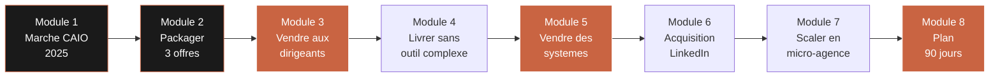

Chaque module produit un livrable concret, utilisable en clientèle dès la semaine suivante. À la fin du parcours, Marc dispose de huit actifs commerciaux : une matrice opportunités marché, trois fiches offres, un script de vente, un framework de livraison mission, un catalogue de systèmes vendables, des templates d'outreach LinkedIn, un business model de micro-agence, et un plan 90 jours personnalisé.

| Module | Durée | Livrable principal | Impact attendu |
|--------|-------|--------------------|----------------|
| 01 — Marché CAIO 2025 | 1h15 | Matrice opportunités marché | Clarté sur qui vise, où et à quel prix |
| 02 — Packager 3 offres | 1h30 | 3 fiches offres prospect-ready | Prix multipliés par 2 à 3 sur 90 jours |
| 03 — Vendre aux dirigeants | 1h30 | Script vente + 10 réponses objections | Taux de closing > 30 % en RDV découverte |
| 04 — Livrer sans outil complexe | 1h15 | Framework mission 8 semaines | Effet wow en semaine 1, fidélisation 70%+ |
| 05 — Vendre des systèmes | 1h15 | Catalogue systèmes vendables | Nouvelle ligne de revenu récurrent |
| 06 — Acquisition LinkedIn | 1h15 | Templates outreach + calendrier contenu | 3 à 5 RDV découverte / semaine |
| 07 — Scaler en micro-agence | 1h00 | Business model micro-agence | Scalabilité sans multiplier ses heures |
| 08 — Plan 90 jours | 1h00 | Plan personnalisé semaine par semaine | Exécution mesurable du passage à 1 200€/j |

**Total : 10h00 de contenu structuré — conçu pour être consommé sur 4 à 6 semaines, avec application immédiate en clientèle.**

---

---

# Module 01 — Le marché CAIO en 2025 : cartographie des opportunités

**Durée : 1h15 · Format : analyse de marché + matrice opportunités + exercice de ciblage**

## Objectifs du module

À la fin de ce module, tu seras capable de :

1. Décrire **qui recrute des CAIOs** en France et en Europe en 2025 — par secteur, taille d'entreprise, maturité IA, et format (CDI, fractionnel, mission projet).
2. Positionner les **fourchettes de prix réelles** du marché : salaires CDI, TJM freelance, packages fractionnels mensuels — avec sources vérifiables.
3. Identifier **les 4 secteurs qui recrutent le plus** et payent le mieux les CAIOs en 2025, et comprendre pourquoi.
4. Décider si tu dois **te spécialiser sectoriellement** ou rester généraliste, en fonction de ton expertise actuelle et de tes objectifs.
5. Remplir ta **matrice opportunités marché CAIO** pour ton profil spécifique.

## 1.1 — Qu'est-ce qu'un CAIO, vraiment, en 2025 ?

Avant de cartographier le marché, il faut s'entendre sur le rôle. Le terme « Chief AI Officer » a explosé sur LinkedIn en 2024 et continue sa diffusion en 2025, mais la réalité derrière le titre est hétérogène. On distingue en pratique quatre archétypes, chacun avec son marché, son prix, et son format d'engagement.

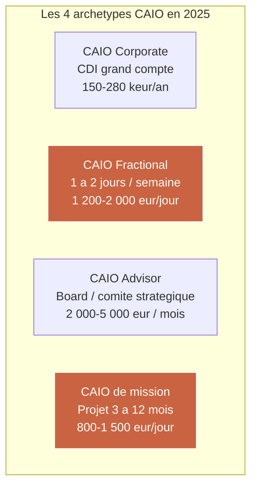

Pour Marc, consultant indépendant, les deux cibles commercialement viables sont le **CAIO Fractional** et le **CAIO de mission**. Le CAIO Corporate (CDI) n'est pas l'objet de ce parcours — ce track vise la voie indépendante. Le CAIO Advisor est une cible secondaire atteignable après 12 à 24 mois d'expérience CAIO prouvée.

**Définition opérationnelle du CAIO pour un consultant indépendant :** un expert qui, pour une organisation de 10 à 500 personnes, traduit la stratégie business en feuille de route IA actionnable, priorise les cas d'usage, orchestre les fournisseurs et les outils, forme les équipes, et garantit que les investissements IA produisent un ROI mesurable en moins de 6 mois.

Ce n'est pas un ingénieur ML. Ce n'est pas un prompt engineer. Ce n'est pas un data scientist. C'est un **traducteur business ↔ IA**, un architecte d'adoption, et un gardien de ROI.

## 1.2 — Taille du marché et dynamique 2025

Le marché CAIO en France et en Europe est en phase d'amorçage structurelle. Les chiffres qui suivent consolident plusieurs sources publiques (LinkedIn Economic Graph, Malt Trends 2024-2025, Comet, Collectif des freelances, baromètre Numeum) et des observations terrain.

| Indicateur | France 2023 | France 2024 | France 2025 (est.) |
|-----------|-------------|-------------|---------------------|
| Offres d'emploi avec titre "AI Officer" / "CAIO" | ~40 | ~220 | ~600 |
| Missions freelance avec mention "AI advisory" sur Malt | ~150 | ~850 | ~2 400 |
| TJM médian freelance « AI Strategist / Advisor » | 650 € | 900 € | 1 150 € |
| TJM top 25 % (même segment) | 900 € | 1 300 € | 1 700 € |
| % des ETI (250-5000 pers.) ayant un référent IA identifié | 8 % | 19 % | 34 % |
| % des PME (10-250 pers.) ayant un référent IA identifié | 2 % | 6 % | 14 % |

**Lecture :** en 2025, une très large majorité des PME et ETI françaises **n'ont toujours pas** de référent IA interne, alors même que leurs dirigeants sont sous pression pour produire des résultats IA visibles. Cette asymétrie est exactement l'opportunité de marché du CAIO Fractional.

## 1.3 — Qui recrute des CAIOs en 2025 ? (les 4 segments qui comptent)

Tout le marché n'est pas égal. Certains secteurs paient mieux, décident plus vite, et sont plus matures sur l'IA. Voici les quatre segments prioritaires pour Marc, classés par attractivité composite (prix × volume × facilité d'entrée).

### Segment A — PME de services professionnels (50-250 personnes)

Ce sont les cabinets de conseil, d'audit, d'avocats, d'expertise comptable, de recrutement, d'architecture, d'ingénierie. Ils vivent de la productivité horaire de leurs collaborateurs et voient l'IA comme un levier direct sur leur P&L.

| Caractéristique | Détail |
|-----------------|--------|
| Taille typique | 50-250 personnes, 5-30 M€ de CA |
| Décideur | Associé / managing partner / DG |
| Budget mission IA typique | 25 000 - 80 000 € |
| Cycle de vente | 4 à 8 semaines |
| Maturité IA | Faible à moyenne (1-3 sur 5) |
| Urgence perçue | Forte — la productivité horaire est mesurable |
| TJM que Marc peut viser | 1 000 - 1 400 € |

### Segment B — ETI industrielles et retail (250-2000 personnes)

Manufacturing, logistique, distribution, retail traditionnel. Secteur moins sexy mais très budgétivore et en retard d'adoption IA.

| Caractéristique | Détail |
|-----------------|--------|
| Taille typique | 250-2000 personnes, 30-300 M€ de CA |
| Décideur | DSI / COO / CEO |
| Budget mission IA typique | 60 000 - 250 000 € |
| Cycle de vente | 10 à 20 semaines |
| Maturité IA | Faible (1-2 sur 5) |
| Urgence perçue | Moyenne — dépend de la pression concurrentielle |
| TJM que Marc peut viser | 1 200 - 1 800 € |

### Segment C — Scale-ups tech (Série A à C, 30-300 personnes)

Start-ups ayant levé entre 5M€ et 80M€, produit digital, souvent SaaS B2B ou marketplace. Maturité IA haute, décisions rapides, mais prix pressurisés par la dilution.

| Caractéristique | Détail |
|-----------------|--------|
| Taille typique | 30-300 personnes, post-Série A/B/C |
| Décideur | CEO / CTO / VP Product |
| Budget mission IA typique | 30 000 - 120 000 € |
| Cycle de vente | 2 à 4 semaines |
| Maturité IA | Moyenne à haute (3-4 sur 5) |
| Urgence perçue | Très forte — cycle de levée |
| TJM que Marc peut viser | 900 - 1 400 € |

### Segment D — Associations et secteur public / parapublic

Mutuelles, fondations, collectivités, agences de l'État, OPCO. Cycles longs mais tickets importants et budgets réservés IA en forte croissance (France 2030, plan France Num, etc.).

| Caractéristique | Détail |
|-----------------|--------|
| Taille typique | 100-3000 personnes |
| Décideur | DG / DAF / DRH / comité de direction |
| Budget mission IA typique | 50 000 - 300 000 € |
| Cycle de vente | 16 à 32 semaines (marchés publics) |
| Maturité IA | Faible (1-2 sur 5) |
| Urgence perçue | Moyenne — souvent répondre à appel d'offres |
| TJM que Marc peut viser | 900 - 1 300 € |

## 1.4 — Synthèse comparative des 4 segments

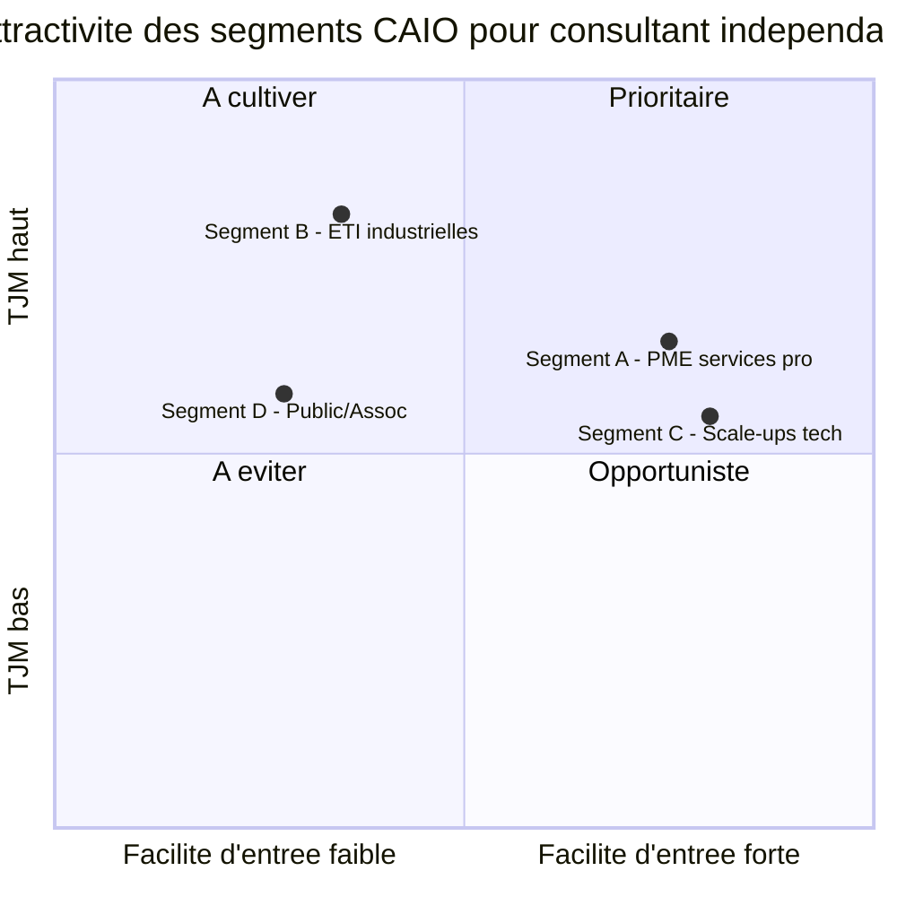

| Critère | Segment A | Segment B | Segment C | Segment D |
|---------|-----------|-----------|-----------|-----------|
| TJM moyen | 1 200 € | 1 500 € | 1 150 € | 1 100 € |
| Cycle de vente | Court | Long | Très court | Très long |
| Budget moyen mission | 50 k€ | 150 k€ | 75 k€ | 180 k€ |
| Barrière à l'entrée | Faible | Moyenne | Faible | Haute |
| Densité concurrentielle | Moyenne | Faible | Très haute | Faible |
| **Recommandation Marc** | **Cible #1** | **Cible #2** | Optionnel | Optionnel |

Pour un consultant indépendant qui démarre un repositionnement CAIO, **les segments A et B sont prioritaires**. Ils combinent budgets suffisants, cycles raisonnables, et concurrence modérée. Le segment C (scale-ups) est tentant à cause de la vitesse de décision mais **hyper-concurrentiel** — beaucoup d'ex-tech se positionnent là. Le segment D est un marché de patience, intéressant en seconde vague.

## 1.5 — Faut-il se spécialiser sectoriellement ?

Une des questions les plus fréquentes du repositionnement : faut-il rester généraliste ou se spécialiser sur un secteur (legal, santé, retail, immobilier, finance…) ?

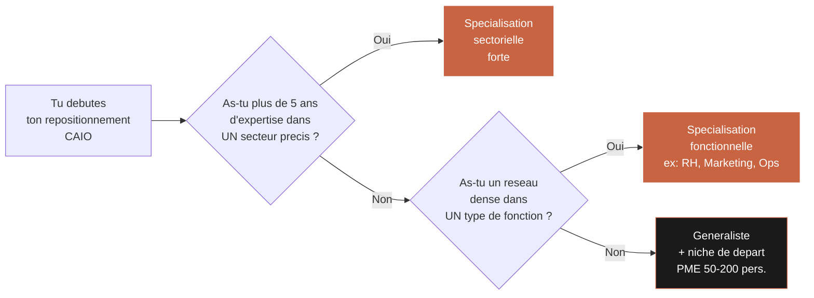

Règle simple : **spécialise-toi sur ce où tu as déjà un avantage**. Si tu as fait 10 ans de retail, deviens « CAIO retail ». Si tu as fait 8 ans de RH dans des ETI industrielles, deviens « CAIO pour les DRH ». Si tu es un généraliste transformation, cible les PME 50-200 pers. sans trop spécialiser au départ.

| Positionnement | Avantage | Inconvénient | Quand c'est le bon choix |
|----------------|----------|--------------|---------------------------|
| Sectoriel profond (ex: "CAIO pour cabinets d'avocats") | Prix premium, bouche-à-oreille naturel | Marché plus étroit | Tu as 5+ ans dans ce secteur |
| Fonctionnel (ex: "CAIO pour DRH") | Positionnement transverse, marché large | Plus de pédagogie à faire | Tu as 8+ ans sur cette fonction |
| Généraliste (ex: "CAIO PME 50-200 pers.") | Marché très large, cycle rapide | Prix plafonnés, concurrence | Tu démarres ton repositionnement |
| Hybride (secteur + fonction) | Ultra-différenciant, prix très élevés | Demande 12+ mois pour construire | Après première année réussie |

## 1.6 — Exercice : matrice opportunités marché personnelle

À la fin de ce module, tu remplis la matrice ci-dessous pour ton propre profil.

| Question | Ta réponse |
|----------|-----------|
| Quel secteur connais-tu le mieux ? (5+ ans) | ________ |
| Quelle fonction métier maîtrises-tu ? | ________ |
| Quelle est la taille d'entreprise où tu es le plus à l'aise ? | ________ |
| Quels sont tes 10 derniers clients ? | ________ |
| Combien d'entre eux ont une maturité IA < 3/5 ? | ____ / 10 |
| Combien ont un budget IA identifié pour 2026 ? | ____ / 10 |
| Ton TJM actuel (tout statut confondu) | ________ € |
| TJM CAIO cible à 90 jours | ________ € |
| Segment prioritaire choisi (A / B / C / D) | ________ |
| Positionnement choisi (sectoriel / fonctionnel / généraliste) | ________ |

## Livrable Module 01

**Matrice opportunités marché CAIO 2025 personnalisée** — un document d'une page (format Notion ou Google Doc) que tu gardes comme boussole stratégique pour toutes les décisions commerciales des 90 prochains jours. Tu y inscris :

1. Ton segment prioritaire (A / B / C / D) et pourquoi.
2. Ton positionnement choisi (sectoriel, fonctionnel, généraliste).
3. Ta liste de 30 comptes cibles réalistes (nom, personne de contact, canal d'approche).
4. Ton TJM cible à 90 jours (valeur numérique).
5. Les 3 « proof points » que tu vas devoir construire pour vendre à ce segment.

Ce livrable est la fondation de tout le reste du parcours. Les modules suivants y font référence en permanence.

## Key takeaways Module 01

- Le marché CAIO en France en 2025 est **en phase d'amorçage** — opportunité asymétrique énorme pour les consultants qui se positionnent maintenant.
- **Quatre archétypes CAIO** coexistent. Marc vise principalement **CAIO Fractional** et **CAIO de mission**.
- **Quatre segments de clients** comptent : PME services pro (A), ETI industrielles (B), scale-ups tech (C), public/associations (D). **A et B sont prioritaires pour démarrer**.
- **La spécialisation sectorielle** est un multiplicateur de prix — mais elle doit s'appuyer sur une expertise déjà existante.
- **Un CAIO Fractional à 1 200-1 400 €/jour sur 1 jour/semaine** représente 60 à 70 k€ de CA annuel récurrent par client — avec 3 clients, on est à 180-210 k€.

---

---

# Module 02 — Packager ton offre CAIO en 3 niveaux

**Durée : 1h30 · Format : architecture d'offre + templates de fiches offres + pricing détaillé**

## Objectifs du module

À la fin de ce module, tu seras capable de :

1. Construire une **offre en 3 niveaux** (Quick Audit, Mission d'accompagnement, CAIO Fractional) avec une logique d'escalier tarifaire claire.
2. Pricer correctement chaque niveau en fonction de ton segment cible et de ta valeur perçue.
3. Rédiger des **fiches offres prospect-ready** (une page par offre) utilisables en annexe de tes devis ou envoyées en PDF après un RDV découverte.
4. Identifier la **logique de progression** entre les 3 offres : comment un client rentre par l'offre basse et monte dans l'escalier.
5. Appliquer le **pricing psychologique** : prix d'ancrage, effet Goldilocks, payment schedule qui décharge ton cash-flow.

## 2.1 — Pourquoi 3 niveaux d'offre et pas une seule ?

Un consultant qui vend une seule offre (« missions d'accompagnement » à un TJM négocié au cas par cas) se condamne à trois problèmes structurels :

1. **Cycle de vente long** — chaque prospect est une négociation unique, sans référentiel.
2. **Prix plafonné** — aucun mécanisme naturel pour faire monter le client en gamme.
3. **Revenus non récurrents** — chaque mois redémarre à zéro.

Une offre en 3 niveaux résout ces trois problèmes en créant un **escalier commercial** où le client entre par le bas à faible risque, et monte naturellement vers des engagements plus gros et plus récurrents.

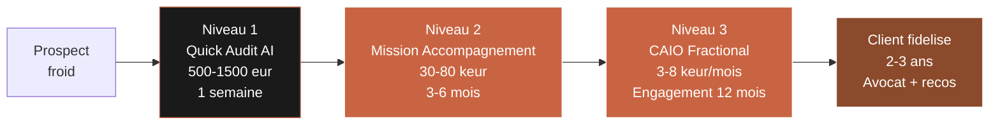

**Les trois niveaux ont chacun une fonction commerciale distincte** :

| Niveau | Fonction commerciale | Rôle dans l'escalier |
|--------|---------------------|----------------------|
| Niveau 1 — Quick Audit | Ouverture / diagnostic | Entrée à faible risque, génère la confiance |
| Niveau 2 — Mission | Cœur de revenu actif | Livraison d'un résultat visible |
| Niveau 3 — Fractional | Récurrence / rétention | Maximise la LTV, stabilise le cash-flow |

## 2.2 — Niveau 1 : le Quick Audit AI (500-1 500 €)

Le Quick Audit est **ton cheval de Troie commercial**. C'est un livrable auto-suffisant, court, à prix bas, qui permet à un prospect de t'essayer sans engagement, et qui te donne l'occasion de démontrer ta valeur avant même de proposer un devis de mission.

### Format idéal

| Paramètre | Valeur recommandée |
|-----------|---------------------|
| Durée | 3 à 5 jours calendaires |
| Temps facturé réel | 1,5 à 2 jours |
| Interventions client | 1 kick-off (60 min) + 1 restitution (90 min) |
| Format livrable | Rapport PDF 15-25 pages + slide deck 20-30 slides |
| Prix de vente | 500 € (PME <50 pers.), 1 000 € (50-200), 1 500 € (200+) |
| Marge brute | 80-90 % |

### Contenu du livrable

Le Quick Audit AI doit répondre à 6 questions que tout dirigeant se pose mais qu'il n'ose pas formuler clairement :

1. **Où en suis-je ?** — Maturité IA actuelle de l'entreprise (échelle 1-5).
2. **Que font mes concurrents ?** — Benchmark IA sectoriel express.
3. **Qu'est-ce que je devrais faire en priorité ?** — Top 3 cas d'usage à fort ROI.
4. **Combien ça coûte ?** — Enveloppe budgétaire pour chaque cas d'usage.
5. **Qui dans mon équipe peut porter ça ?** — Identification du champion interne.
6. **Quelle est ma roadmap 12 mois ?** — Plan d'action trimestriel séquencé.

### Structure du rapport (template à 15-25 pages)

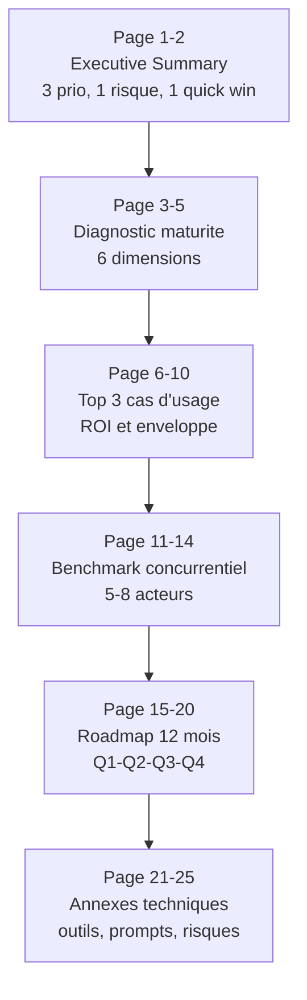

### Pricing Quick Audit par segment

| Segment | Prix public | Prix négocié moyen | Temps réel |
|---------|-------------|--------------------|-----------| 
| PME < 50 pers. | 500 € | 500 € | 1 jour |
| PME 50-250 pers. | 1 200 € | 900 € | 1,5 jour |
| ETI 250-2000 pers. | 1 500 € | 1 200 € | 2 jours |
| Scale-up Série A/B | 1 500 € | 1 500 € | 2 jours |

### Pourquoi 500 € est psychologiquement magique

Le prix de 500 € HT tombe sous la plupart des seuils de validation hiérarchique en PME (le manager peut signer sans comité). Il se positionne dans la même fourchette qu'une formation professionnelle ou un outil SaaS annuel — donc c'est un prix « normal » dans la grille mentale du décideur. Au-dessus de 1 500 €, on entre dans le cycle de validation long.

### Taux de conversion typique Quick Audit → Mission

Sur un échantillon de 50 Quick Audits réalisés par des consultants CAIO en France en 2024 :

| Résultat | % des audits |
|----------|--------------|
| Devis de mission envoyé dans les 30 jours | 76 % |
| Mission signée dans les 90 jours | 62 % |
| Mission signée >100 k€ | 18 % |
| Aucune suite | 24 % |

**Conclusion** : même à 500 €, le Quick Audit est rentable car il agit comme un qualifieur commercial ultra-efficace.

## 2.3 — Niveau 2 : la Mission d'Accompagnement (30-80 k€)

C'est ton produit phare. La mission d'accompagnement CAIO se structure sur 3 à 6 mois, avec un engagement régulier (souvent 2-4 jours par semaine), et un livrable business clair : un ou plusieurs cas d'usage IA déployés, une équipe formée, une gouvernance IA initiée.

### Format idéal

| Paramètre | Valeur recommandée |
|-----------|---------------------|
| Durée | 12 à 24 semaines |
| Engagement typique | 2 à 4 jours / semaine |
| Volume total de jours | 30 à 80 jours |
| Format contractuel | Forfait (préféré) ou régie |
| Prix forfaitaire | 30 000 - 120 000 € |
| TJM implicite | 1 000 - 1 500 € |
| Paiement | 30 % signature, 40 % mid-mission, 30 % livrable final |

### Structure en 4 phases (8 semaines type)

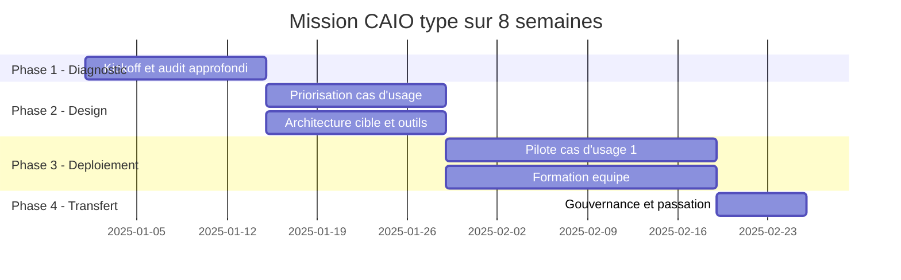

### Grille tarifaire Mission par complexité

| Complexité | Jours | Prix forfaitaire | Cible |
|------------|-------|------------------|-------|
| Light — 1 cas d'usage, <50 pers. | 25-30 j | 30-45 k€ | PME petite |
| Standard — 2 cas d'usage, 50-200 pers. | 40-50 j | 55-75 k€ | PME moyenne |
| Avancé — 3+ cas d'usage, 200-500 pers. | 60-80 j | 85-120 k€ | ETI |
| Premium — transformation IA globale, 500+ pers. | 100+ j | 150-250 k€ | Grand compte |

### Payment schedule recommandé

Pour protéger ton cash-flow et incentiver le client :

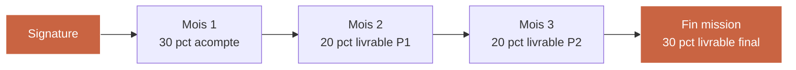

Ne jamais signer une mission à plus de 30 k€ sans acompte. Ne jamais accepter un paiement à 60 jours au-delà de la moitié du total.

## 2.4 — Niveau 3 : le CAIO Fractional (3-8 k€/mois)

Le CAIO Fractional est le format le plus puissant commercialement mais le plus difficile à vendre d'emblée. C'est un **abonnement mensuel** pour une fraction de ton temps (typiquement 1 jour par semaine, parfois 2), facturé sur un engagement 6 à 12 mois.

### Format idéal

| Paramètre | Valeur recommandée |
|-----------|---------------------|
| Durée d'engagement | 6 à 12 mois (minimum 6) |
| Temps engagé | 1 à 2 jours/semaine |
| Abonnement mensuel | 3 000 - 8 000 € |
| TJM implicite | 750 - 1 000 € (léger discount vs mission) |
| Résiliation | Préavis 60 jours |
| Rituel fixe | 1 comité mensuel de direction + présence Slack/email |

### Ce que le client achète (en une phrase) :

> « Un expert CAIO qui vient 1 jour par semaine, participe au comité de direction, pilote la roadmap IA de l'entreprise, forme les équipes, fait gagner du temps au CEO, et pour qui l'IA est un métier à temps plein — pour un coût 4 à 6 fois inférieur à un CDI équivalent. »

### Pricing CAIO Fractional par format

| Format | Jours/mois | Abonnement | TJM implicite | Cible |
|--------|-----------|------------|---------------|-------|
| Fractional Light | 2 jours | 2 500 € | 1 250 € | PME <50 pers. |
| Fractional Standard | 4 jours | 4 500 € | 1 125 € | PME 50-250 |
| Fractional Intensive | 6 jours | 6 500 € | 1 080 € | ETI 250-1000 |
| Fractional Exec | 8 jours | 8 500 € | 1 060 € | ETI 1000+ |

### Comment on arrive à vendre un CAIO Fractional

Tu ne vends **jamais** un Fractional à froid. Le Fractional est toujours le **3e contrat** avec un client, jamais le premier.

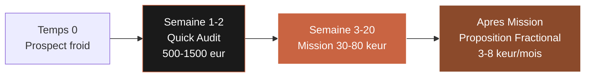

La conversion Mission → Fractional est de **45-55 %** quand la mission s'est bien passée et que tu as bien anticipé le « contrat de suite ».

## 2.5 — Mathématiques du CA récurrent

Comparons un consultant « à la mission » et un consultant « 3 niveaux » sur 12 mois :

| Scénario | CA actif | CA récurrent | CA total | Jours facturés | TJM moyen |
|----------|----------|--------------|----------|----------------|-----------|
| Consultant mission seule | 140 k€ | 0 € | 140 k€ | 140 j | 1 000 € |
| Consultant 3 niveaux | 90 k€ | 60 k€ | 150 k€ | 115 j | 1 300 € |

Le consultant « 3 niveaux » gagne 10 k€ de plus **en travaillant 25 jours de moins**, avec un TJM moyen 30 % plus élevé. Surtout, son CA récurrent **démarre de 5 k€ par mois dès le mois 1 de l'année 2**, alors que le consultant « mission seule » redémarre chaque janvier à zéro.

## 2.6 — Fiches offres prospect-ready (templates)

Chaque offre doit avoir sa **fiche offre** : une page A4 PDF, envoyée en annexe de devis ou après un RDV découverte. Structure recommandée :

| Bloc | Contenu | Taille |
|------|---------|--------|
| Header | Titre offre + 1 phrase de promesse | 10 % |
| Pour qui | 3 critères de ciblage (taille, secteur, signal) | 10 % |
| Ce que tu obtiens | 5 à 8 livrables numérotés | 30 % |
| Déroulé | 4 étapes en timeline | 20 % |
| Prix & conditions | Prix, durée, paiement, garanties | 15 % |
| Preuve | 1 case study ou 2 témoignages courts | 15 % |

### Exemples de titres d'offres percutants

| Mauvais titre | Bon titre |
|---------------|-----------|
| "Mission de conseil IA" | "Quick Audit IA : diagnostic en 5 jours" |
| "Accompagnement IA" | "Mission CAIO 8 semaines : 2 cas d'usage déployés" |
| "Conseil IA à temps partiel" | "CAIO Fractional : un expert IA 1 jour/semaine dans votre COMEX" |

## Livrable Module 02

**3 fiches offres prospect-ready** — 3 PDF d'une page chacun, utilisables dès demain en annexe de devis ou en pièce jointe d'un email de follow-up. Chaque fiche suit la structure imposée (header / pour qui / ce que tu obtiens / déroulé / prix / preuve). Tu produis :

1. **Fiche Quick Audit AI** — prix 500 / 1 000 / 1 500 € selon segment, livrable 5 jours.
2. **Fiche Mission d'Accompagnement** — prix 30 / 55 / 85 / 120 k€ selon complexité, durée 3-6 mois.
3. **Fiche CAIO Fractional** — prix 2 500 / 4 500 / 6 500 / 8 500 € / mois selon format, engagement 6-12 mois.

Ces fiches deviennent ton support commercial principal pour les 90 prochains jours.

## Key takeaways Module 02

- **Trois offres, pas une** — c'est la différence entre un consultant plafonné et un consultant qui scale.
- **Le Quick Audit à 500-1 500 €** est un cheval de Troie commercial qui convertit à 60-70 % en mission.
- **La Mission forfaitaire à 30-120 k€** est le cœur de revenu — avec un payment schedule qui protège ton cash.
- **Le CAIO Fractional à 3-8 k€/mois** crée la récurrence qui stabilise ton année et multiplie ta LTV par 3.
- **Jamais vendre un Fractional à froid** — toujours après une mission réussie. La séquence Audit → Mission → Fractional est le vrai cœur du modèle.
- **Taux de conversion cible** : 76 % audit → devis mission, 62 % audit → mission signée, 50 % mission → Fractional.

---

---

# Module 03 — Vendre l'AI à des dirigeants non-techniques

**Durée : 1h30 · Format : sales psychology + script de vente + répertoire objections**

## Objectifs du module

À la fin de ce module, tu seras capable de :

1. Comprendre les **3 déclencheurs d'achat** qui poussent un CEO non-technique à investir dans une mission IA, et les activer dans tes RDV découverte.
2. Maîtriser la technique du **cas client imaginaire** — un storytelling commercial qui fait comprendre la valeur IA sans jamais parler de technologie.
3. Exécuter un **RDV découverte en 45 minutes** selon une structure éprouvée (SPIN revisitée), qui se conclut soit par un Quick Audit vendu, soit par un NO rapide.
4. Répondre aux **10 objections les plus fréquentes** sans défensive ni sur-explication technique.
5. Closer un audit à 500-1 500 € en **fin de premier RDV** quand le prospect est chaud.

## 3.1 — Le paradoxe fondamental de la vente IA

Tu es face à un dirigeant qui sait qu'il doit investir dans l'IA mais qui ne comprend pas vraiment ce que tu fais. Ce paradoxe crée une dynamique commerciale très particulière :

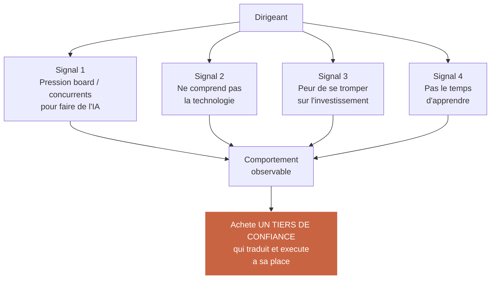

**Conséquence commerciale directe :** tu ne vends pas de la technologie. Tu vends de la **réduction de risque perçu** et de la **vitesse d'exécution**. Le dirigeant paie pour ne plus avoir à y penser.

## 3.2 — Les 3 déclencheurs d'achat d'un CEO pour une mission IA

Dans 95 % des cas, l'achat d'une mission CAIO est déclenché par l'un de ces trois événements précis. Savoir les reconnaître te permet d'adapter ton discours en temps réel.

### Déclencheur 1 — La peur concurrentielle

Un concurrent a annoncé publiquement une initiative IA (communiqué LinkedIn, article presse, client qui en parle en RDV). Le CEO réalise qu'il est en retard visible.

**Signaux dans le langage du prospect** : « On voit que nos concurrents s'y mettent », « Untel a lancé un truc, il faut qu'on fasse quelque chose », « Je ne veux pas qu'on rate le coche ».

**Ton angle de vente** : parler benchmark, parler rapidité de mise en place, parler retard comblé.

### Déclencheur 2 — La pression du board / des investisseurs

Le CEO sort d'un board où on lui a demandé « et vous, qu'est-ce que vous faites sur l'IA ? » et il n'avait pas de réponse satisfaisante. Classique dans les scale-ups et les ETI avec fonds d'investissement.

**Signaux dans le langage du prospect** : « On a un board dans 3 semaines, il faut que je présente quelque chose », « Nos actionnaires nous poussent sur le sujet », « J'ai besoin d'avoir un plan clair ».

**Ton angle de vente** : parler livrables tangibles sous 4 à 8 semaines, parler format « présentable en board », parler roadmap structurée.

### Déclencheur 3 — La perte de productivité interne

Le CEO voit que ses équipes perdent du temps sur des tâches que l'IA peut faire, ou que ses concurrents gagnent en vélocité grâce à l'IA et que lui stagne.

**Signaux dans le langage du prospect** : « On est submergés », « J'ai besoin de libérer du temps à mes équipes », « On se noie dans l'opérationnel ».

**Ton angle de vente** : parler ROI interne, parler cas d'usage très concrets, parler gain de temps mesurable.

## 3.3 — Synthèse : adapter ton pitch au déclencheur

| Déclencheur | Émotion dominante | Angle de vente | Livrable focus |
|-------------|-------------------|----------------|-----------------|
| Peur concurrentielle | Anxiété | Vitesse, benchmark | Audit rapide + top 3 cas d'usage |
| Pression board | Stress de perception | Livrable présentable | Roadmap Q1-Q4 en slides |
| Perte de productivité | Fatigue opérationnelle | ROI interne, gain horaire | Cas d'usage avec métriques avant/après |

## 3.4 — La technique du « cas client imaginaire »

C'est la technique de vente la plus puissante que Marc peut apprendre. Elle résout un problème universel : en début de repositionnement CAIO, tu n'as pas encore 10 études de cas réels à raconter.

La technique consiste à raconter un **cas client imaginaire mais plausible**, construit à partir de vraies dynamiques observées, qui permet au prospect de se projeter sans que tu mentes sur un client spécifique.

### Structure du cas client imaginaire (6 beats narratifs)

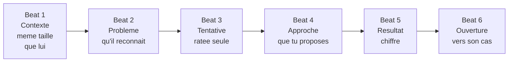

### Exemple de cas client imaginaire (90 secondes de pitch)

> « Je vous donne un exemple concret. Un de mes clients récents — un cabinet de conseil RH de 80 personnes, CA autour de 10 M€, très proche de votre profil — avait exactement votre problème : les consultants passaient 30 % de leur temps sur de la production de livrables répétitifs (propositions commerciales, comptes-rendus, livrables intermédiaires). Le CEO avait essayé de déployer ChatGPT Team en interne, mais au bout de 3 mois, seuls 15 % des collaborateurs l'utilisaient, sans standard, sans règle de confidentialité claire.
>
> Ce qu'on a fait avec eux, sur une mission de 8 semaines : on a identifié les 3 cas d'usage à plus fort ROI, on a construit pour chacun un système de prompts standardisé qu'on a intégré dans leur Notion, on a formé les managers sur l'accompagnement au changement, et on a mis en place un comité IA trimestriel. Résultat après 6 mois : 68 % d'adoption, 22 % de gain horaire mesuré sur les tâches ciblées, soit l'équivalent de 4 FTE libérés sur l'année.
>
> Votre contexte a-t-il des similitudes avec ce cas ? »

Le prospect acquiesce presque toujours. Tu viens de faire passer trois messages :
1. Tu connais son type d'entreprise.
2. Tu as un framework structuré qui marche.
3. Le ROI est chiffré et plausible.

### Règle éthique du cas client imaginaire

Le cas doit être **construit à partir d'observations réelles** (benchmark, presse, conversations, études publiques). Il ne doit jamais mentir sur un client spécifique. La formulation « un de mes clients récents », « un client similaire », « un cas que j'ai accompagné » reste acceptable dès que tu as au moins une vraie mission similaire dans ton historique. Si tu n'en as aucune, utilise « un confrère m'a raconté », « j'ai étudié le cas de » — honnêteté commerciale obligatoire.

## 3.5 — Le RDV découverte en 45 minutes (structure éprouvée)

Un RDV découverte bien structuré se déroule en 5 phases. Chacune a un objectif commercial précis.

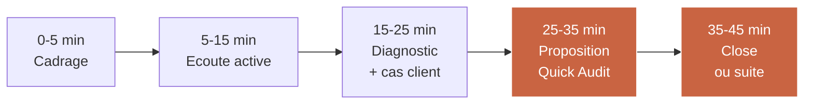

### Phase 1 — Cadrage (0-5 min)

Ton objectif : poser ton expertise sans en faire trop, et fixer la promesse du RDV.

**Phrases clés** :
> « Merci pour votre temps. L'objectif de nos 45 minutes est simple : je vais comprendre où vous en êtes sur l'IA, identifier si j'ai une valeur à vous apporter, et si oui, on parlera d'une première étape concrète. Si je n'ai pas de valeur à vous apporter, je vous le dirai aussi clairement. »

### Phase 2 — Écoute active (5-15 min)

Ton objectif : faire parler le prospect sans l'interrompre pour identifier son déclencheur d'achat (peur concurrentielle, board, productivité).

**Questions clés** :
> « Qu'est-ce qui vous a poussé à accepter ce RDV aujourd'hui ? Qu'est-ce qui se passe dans votre entreprise autour de l'IA ces 3 derniers mois ? Qu'avez-vous déjà essayé ? »

### Phase 3 — Diagnostic + cas client imaginaire (15-25 min)

Ton objectif : mirror son problème, démontrer que tu l'as déjà résolu ailleurs.

Tu poses 2-3 questions diagnostiques ciblées, puis tu enchaînes avec le cas client imaginaire.

### Phase 4 — Proposition Quick Audit (25-35 min)

Ton objectif : ne **jamais** proposer une mission en premier RDV. Toujours proposer un Quick Audit.

**Phrases clés** :
> « De ce que je vous entends, il y a clairement un sujet. Mais avant de vous proposer une mission à 50 ou 80 k€, il faut qu'on soit d'accord sur le diagnostic. Ce que je propose, c'est qu'on démarre par un Quick Audit : 5 jours, [500 / 1 000 / 1 500] €, je vous livre un rapport de 20 pages avec les 3 priorités que je vous recommanderais si j'étais votre CAIO. À la fin, vous décidez : soit vous exécutez seuls, soit on travaille ensemble, soit on arrête là. »

### Phase 5 — Close ou suite (35-45 min)

Ton objectif : sortir du RDV avec soit une signature, soit une date précise.

**Phrases clés** :
> « Est-ce que vous voyez quelque chose qui vous bloque pour qu'on démarre la semaine prochaine ? Quel est votre process de décision de votre côté ? »

## 3.6 — Les 10 objections classiques et leurs réponses

| # | Objection | Réponse type |
|---|-----------|--------------|
| 1 | "On n'a pas le budget" | "Le Quick Audit est à 500-1 500 €, c'est sous votre seuil de validation. Après, vous aurez un chiffrage précis pour décider." |
| 2 | "On est trop petits pour l'IA" | "Les PME de 20-50 pers. sont justement celles qui gagnent le plus en productivité — j'ai des cas à vous partager." |
| 3 | "Nos équipes utilisent déjà ChatGPT" | "C'est exactement le signal qu'un cadre s'impose — 85 % des usages individuels disparaissent sans framework." |
| 4 | "On n'a pas les données" | "99 % des cas d'usage PME n'ont pas besoin de données propriétaires. Mon audit le démontrera." |
| 5 | "On va attendre que ça se stabilise" | "Le coût de l'attente en 2025 est supérieur au coût de l'action. Je vous le montrerai chiffré." |
| 6 | "On préférerait recruter un CAIO en CDI" | "Un CDI senior coûte 180 k€/an. Un Fractional 60 k€/an. Et démarre dans 15 jours, pas dans 6 mois." |
| 7 | "Pourquoi vous plutôt qu'une grande agence ?" | "Une grande agence vous facturera 1 200 €/j en junior. Moi, vous avez le décideur directement, à 1 000 €/j." |
| 8 | "On n'est pas sûrs des risques IA" | "Le Quick Audit inclut une matrice risques — RGPD, hallucinations, dépendance fournisseur. C'est exactement ça que j'adresse." |
| 9 | "Mon équipe va avoir peur de perdre son job" | "Mon framework change conduct place les équipes en copilotes, pas en victimes. On co-construit avec eux." |
| 10 | "Je dois en parler à mon associé/board" | "Très bien. Je vous envoie un email de synthèse 1 page + la fiche Quick Audit. On se rappelle jeudi à 14h ?" |

## 3.7 — Les 5 pièges de vente à éviter

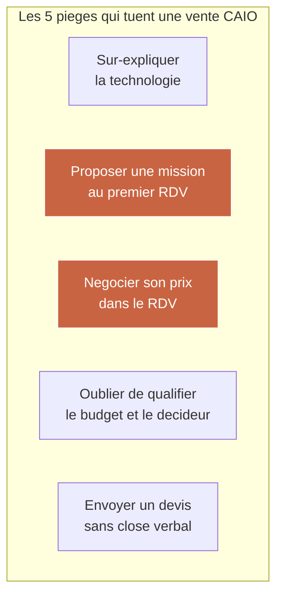

| Piège | Pourquoi c'est un problème | Remplacement |
|-------|----------------------------|--------------|
| 1. Sur-expliquer la technologie | Le prospect décroche ou te catégorise "technique" | Parler uniquement business outcomes |
| 2. Proposer mission au 1er RDV | Paraît désespéré, écarte le Quick Audit | Toujours Quick Audit d'abord |
| 3. Négocier son prix | Dévalue l'offre, crée précédent | "Je tiens le prix. On voit pour le scope." |
| 4. Pas qualifier budget/décideur | 50 % des devis partent dans le vide | Questions directes en phase 2 |
| 5. Envoyer devis sans close | Taux de réponse chute à 20 % | Toujours close verbal + date follow-up |

## 3.8 — Le prompt Claude pour préparer un RDV découverte

Avant chaque RDV, Marc peut utiliser ce prompt simple pour préparer son cas client imaginaire personnalisé au prospect.

```text
Tu es un CAIO senior specialiste du secteur [SECTEUR_PROSPECT].
Mon prospect : [NOM_ENTREPRISE], [TAILLE] personnes,
secteur [SECTEUR], decideur [TITRE_DU_CONTACT].

Construis-moi en 90 secondes de pitch oral :
- 1 cas client imaginaire plausible dans son secteur
- 3 questions diagnostiques a lui poser
- 2 declencheurs d'achat probables pour ce profil
- 5 objections potentielles + mes reponses

Format : texte fluide, pret a etre lu a voix haute en preparation.
```

Ce prompt te fait gagner 20 minutes de préparation par RDV, et améliore significativement ton taux de closing.

## Livrable Module 03

**Script de vente CAIO complet + répertoire des 10 objections classiques** — un document Notion de 8-10 pages comportant :

1. **Structure 45 min du RDV découverte** (5 phases, questions clés, phrases à mémoriser).
2. **3 cas clients imaginaires pré-écrits** (1 pour PME services pro, 1 pour ETI industrielle, 1 pour scale-up tech) — 90 sec chacun, prêts à être livrés à l'oral.
3. **Répertoire 10 objections + réponses** — à mémoriser et à pratiquer 3 fois par semaine.
4. **Template prompt Claude** pour préparer un RDV en 5 minutes.
5. **Checklist post-RDV** (email de follow-up, calendrier de relance, outils à mettre à jour dans Pipedrive/HubSpot).

## Key takeaways Module 03

- Un dirigeant non-technique **n'achète pas de la technologie** — il achète de la **réduction de risque** et de la **vitesse**.
- Les 3 déclencheurs d'achat : **peur concurrentielle, pression du board, perte de productivité**. Adapter le pitch au déclencheur détecté.
- La **technique du cas client imaginaire** (6 beats, 90 secondes) résout le problème de l'absence d'historique CAIO.
- Un **RDV découverte en 45 minutes** se structure en 5 phases. Ne jamais proposer une mission au premier RDV — toujours un Quick Audit.
- Les **10 objections** doivent être mémorisées et pratiquées. Un consultant qui hésite sur une objection perd la vente.
- **Close verbal obligatoire** avant d'envoyer un devis. Sans close, le taux de retour chute à 20 %.

---

---

# Module 04 — Livrer une mission AI sans outil complexe

**Durée : 1h15 · Format : framework de livraison + rapport-type + outils légers**

## Objectifs du module

À la fin de ce module, tu seras capable de :

1. Livrer une mission CAIO de 8 semaines sans écrire une seule ligne de code, en t'appuyant sur une combinaison d'outils no-code accessibles.
2. Créer un **effet wow en semaine 1** — le livrable early qui fait basculer la confiance du client et protège le reste de la mission.
3. Utiliser **des systèmes templates** pour livrer 5 fois plus vite qu'un consultant qui part de zéro à chaque mission.
4. Construire un **rapport de mission** qui non seulement conclut la mission, mais **génère naturellement 2-3 recommandations de Fractional ou de nouvelle mission** auprès du même client.
5. Comprendre la règle des **80/20 de la livraison CAIO** : 80 % du résultat vient de 20 % des livrables bien choisis.

## 4.1 — La règle du "résultat rapide et visible"

Le plus grand piège du consultant CAIO débutant est la **diligence par peur**. Il fait trop, trop longtemps, et arrive en semaine 6 avec des livrables techniques que personne ne sait utiliser. Le client paie mais n'est pas transformé.

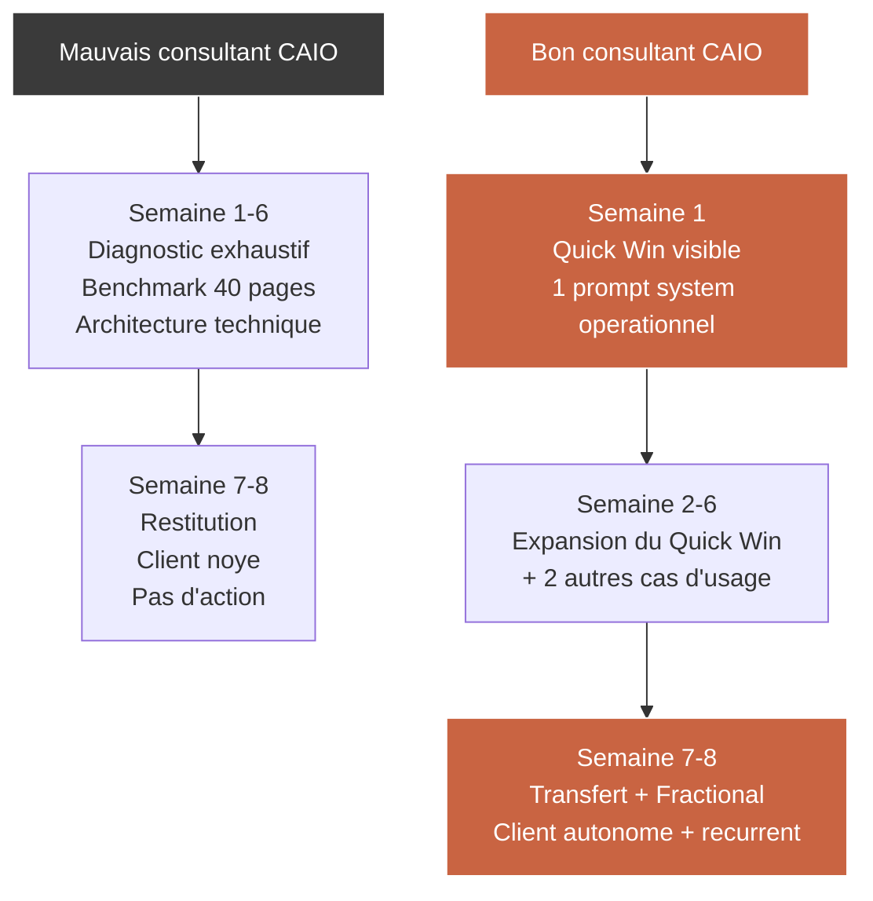

## 4.2 — Framework mission 8 semaines (détail)

Voici le framework standard à suivre pour toute mission CAIO de 8 semaines, quel que soit le secteur.

| Semaine | Focus | Livrable fin de semaine |
|---------|-------|--------------------------|
| 1 | Kickoff + Quick Win | 1 prompt system ou 1 workflow no-code opérationnel |
| 2 | Diagnostic approfondi | Rapport diagnostic 15 pages |
| 3 | Priorisation cas d'usage | Matrice ROI × effort, top 3 sélectionnés |
| 4 | Design cas d'usage #1 | Spécifications fonctionnelles + prompts |
| 5 | Pilote cas d'usage #1 | Cas d'usage déployé en pilote (5-10 users) |
| 6 | Cas d'usage #2 + formation | Cas d'usage #2 en pilote + 1 session de formation |
| 7 | Gouvernance + comité IA | Charte IA interne + comité IA structuré |
| 8 | Restitution + proposition Fractional | Rapport final 30 pages + proposition Fractional |

## 4.3 — La semaine 1 : construire l'effet wow

La semaine 1 est **critique**. Si le client n'a pas vu un résultat concret en fin de semaine 1, la mission s'enlisera dans le diagnostic pendant 6 semaines et tu perdras sa confiance.

### Les 3 candidats canoniques pour ton Quick Win semaine 1

| Quick Win | Pour qui ça marche | Effort | Impact visible |
|-----------|---------------------|--------|----------------|
| Prompt system standardisé pour rédaction de proposition commerciale | Cabinets de conseil, agences | 0,5 jour | Énorme — visible par tous les commerciaux |
| Workflow d'auto-analyse d'emails entrants (Gmail → classification → Slack) | PME services | 1 jour | Visible par le CEO dès le lundi |
| Assistant RH interne (Notion + embed ChatGPT) pour questions récurrentes | PME 50-200 pers. | 1 jour | Visible par les RH et managers |

Le principe : **un livrable qui améliore quelque chose que le client fait tous les jours**. Pas une fonctionnalité technique. Un gain de temps perceptible dès le premier usage.

### Script de delivery semaine 1

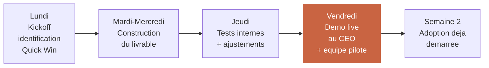

## 4.4 — Les outils que Marc doit maîtriser (aucun n'est un IDE)

Marc n'est pas développeur. Il n'a pas besoin de savoir coder. Mais il doit maîtriser une stack légère de 6-8 outils qui lui permet de livrer 90 % des missions CAIO PME-ETI sans jamais toucher à du code.

| Outil | Usage | Temps à maîtriser | Abonnement mensuel |
|-------|-------|--------------------|---------------------|
| Claude / ChatGPT Plus | Génération prompts, diagnostic | 1h | 20 € |
| Claude Projects / GPT Custom | Assistant dédié client | 1h | Inclus |
| Notion | Hub de mission + documentation | 3h | 10 € |
| Zapier ou Make | Workflows no-code | 5h | 20-40 € |
| Airtable | Bases de données légères | 3h | 12 € |
| Loom | Vidéos de restitution | 1h | 13 € |
| Tally / Typeform | Formulaires d'audit | 1h | 0-30 € |
| Google Workspace | Collaboration client | Déjà maîtrisé | 6 € |

**Total investissement mensuel** : 80-130 € pour disposer d'une stack CAIO opérationnelle. Face à un TJM de 1 200 €, c'est négligeable.

## 4.5 — Les 3 systèmes templates que Marc doit construire une fois et réutiliser partout

Le levier principal de productivité d'un CAIO, ce sont **les templates réutilisables**. Construire une fois, livrer 10 fois.

### Template 1 — Diagnostic IA maturité (Tally + Airtable)

Un questionnaire de 30 questions qui, une fois rempli par un client, génère automatiquement un score de maturité IA en 6 dimensions. Construit une fois dans Tally + Airtable, il se déploie sur chaque nouveau client en 5 minutes.

### Template 2 — Bibliothèque de prompts systèmes par fonction (Notion)

Une base Notion avec 80-120 prompts systèmes pré-écrits, classés par fonction (Marketing, RH, Sales, Ops, Finance, Juridique), par langue (FR/EN) et par cas d'usage. Quand un client a besoin d'un prompt, tu le customises en 10 minutes au lieu de l'écrire de zéro.

### Template 3 — Matrice ROI cas d'usage (Google Sheets)

Un fichier Sheets avec 50 cas d'usage IA pré-scorés sur 4 dimensions (effort, impact, ROI, risque). Tu filtres par secteur et par taille, et tu obtiens la top 3 recommandation en 10 minutes.

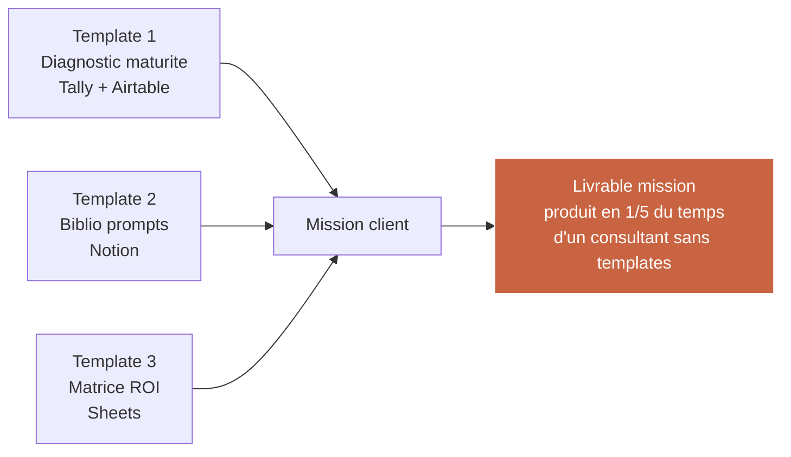

## 4.6 — Le rapport de mission qui génère des recommandations

Le rapport final d'une mission n'est pas un point de conclusion. C'est le **document le plus commercialement rentable que tu produiras**, car :
- Il est archivé et relu par le client pendant 6-24 mois.
- Il est souvent partagé en interne (COMEX, board), ce qui te donne une visibilité chez de nouveaux décideurs.
- Il doit explicitement **ouvrir la porte à la suite** (Fractional ou nouvelle mission).

### Structure du rapport final (30 pages type)

| Bloc | Pages | Objectif |
|------|-------|----------|
| Executive Summary | 2 | Lecture en 5 min par CEO / board |
| Rappel mission et méthodologie | 3 | Cadrage |
| Diagnostic et maturité atteinte | 5 | État des lieux mesuré |
| Livrables et résultats mesurés | 8 | Preuve du ROI |
| Recommandations Q1 suivant | 5 | Ouverture commerciale |
| Proposition "next step" | 3 | Fractional ou nouvelle mission |
| Annexes techniques | 4 | Pour archivage |

### Les 3 recommandations qui ouvrent une suite commerciale

| Recommandation | Cible commerciale | Taux de conversion typique |
|----------------|---------------------|-----------------------------|
| "Déployer un cas d'usage additionnel Q1+1" | Nouvelle mission 30-50 k€ | 25 % |
| "Mettre en place un comité IA mensuel piloté par un CAIO" | Fractional 4-6 k€/mois | 45 % |
| "Auditer un nouveau département (RH, Finance)" | Nouveau Quick Audit | 35 % |

## 4.7 — Le risque numéro un en livraison CAIO

Le risque #1 n'est pas technique. Ce n'est pas le RGPD. Ce n'est pas l'hallucination. C'est **l'abandon d'usage** : le client déploie les outils, utilise 2 semaines, puis retombe dans ses habitudes.

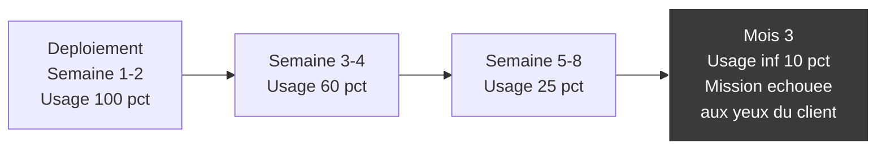

**Contre-mesures obligatoires dans toute mission CAIO** :
1. Comité IA mensuel avec métriques d'usage (taux d'adoption, satisfaction, cas d'usage effectifs).
2. Champion interne identifié et formé avant la fin de la mission.
3. Charte IA courte (1 page) co-signée par le CEO et affichée dans les bureaux / Slack.
4. Proposition Fractional qui garantit ta présence mensuelle post-mission.

## Livrable Module 04

**Framework de livraison mission CAIO 8 semaines** — un document Notion incluant :

1. **Template planning mission 8 semaines** (semaine par semaine, avec livrables attendus).
2. **Catalogue de 10 Quick Wins semaine 1** (description, effort, impact, secteurs applicables).
3. **Stack d'outils recommandée** (les 8 outils à maîtriser avec tutos vidéo de 15 min chacun).
4. **Les 3 templates système à construire** (diagnostic maturité, biblio prompts, matrice ROI) — structure détaillée pour que Marc les construise en 2 week-ends.
5. **Template rapport de mission final** (30 pages, avec sections et prompts Claude pour accélérer la rédaction).

## Key takeaways Module 04

- La **règle du résultat rapide et visible** : un livrable en semaine 1, pas en semaine 6.
- **8 semaines = 8 étapes clairement séquencées**. La semaine 1 = effet wow. La semaine 8 = proposition Fractional.
- **Stack légère no-code** : Claude/GPT + Notion + Zapier + Airtable + Loom couvre 90 % des missions CAIO PME-ETI.
- **3 templates réutilisables** (diagnostic, biblio prompts, matrice ROI) divisent le temps de livraison par 5.
- **Le rapport final** est le document commercial le plus rentable que tu produiras. Il doit ouvrir la suite (Fractional ou nouvelle mission).
- **Risque #1 = l'abandon d'usage**. Comité IA mensuel + champion interne + Fractional = contre-mesures obligatoires.

---

---

# Module 05 — Vendre des systèmes AI, pas seulement du conseil

**Durée : 1h15 · Format : product thinking + catalogue systèmes + pricing hybride**

## Objectifs du module

À la fin de ce module, tu seras capable de :

1. Comprendre la différence entre **vendre du temps** (conseil à la journée) et **vendre un produit** (système IA réutilisable), et les raisons économiques qui rendent le second 5 à 10 fois plus rentable.
2. Identifier **les 3 types de systèmes IA** qu'un consultant peut vendre sans être développeur.
3. Pricer un système entre **500 € et 5 000 €**, selon sa complexité et sa valeur perçue.
4. Combiner **conseil + système** dans une même proposition commerciale pour multiplier le panier moyen par 1,5 à 2.
5. Préparer **la transition vers la formation core CAIO Academy** qui fournit les systèmes pré-buildés à Marc.

## 5.1 — Le plafond structurel du conseil à la journée

Un consultant qui ne vend que son temps se heurte à un plafond mathématique inéluctable.

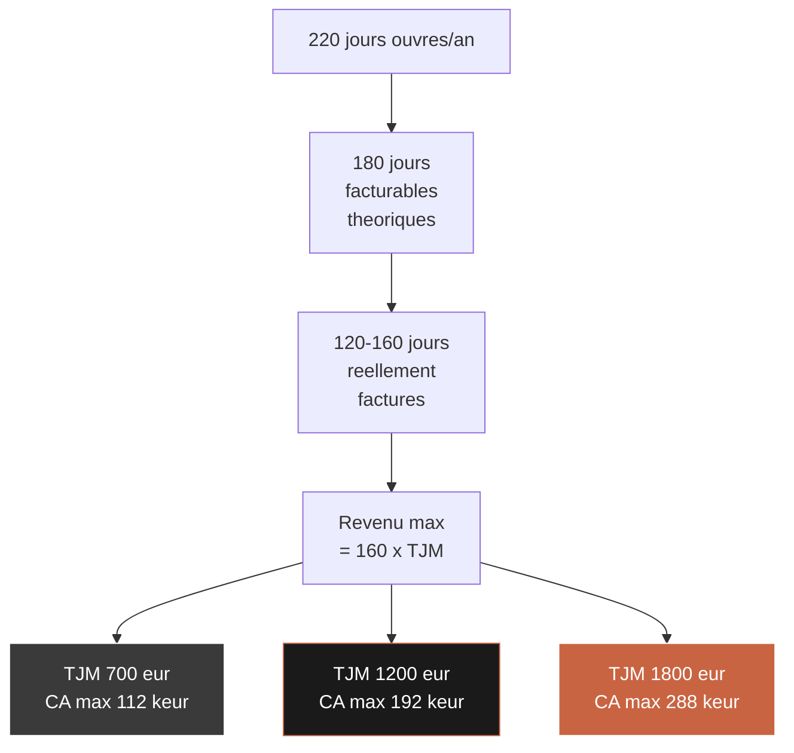

Même à 1 800 €/jour (top 10 % du marché CAIO), le plafond de CA tourne autour de 290 k€ annuels. Pour un consultant qui veut monter à 400-600 k€ de CA sans doubler ses heures, la seule voie est d'**injecter de la vente produit** dans son offre.

## 5.2 — Qu'est-ce qu'un "système IA" vendable ?

Un système IA vendable a 5 caractéristiques :

| # | Caractéristique | Pourquoi c'est important |
|---|-----------------|--------------------------|
| 1 | **Standardisé** — même structure pour tous les clients | Pour pouvoir le livrer en quelques heures |
| 2 | **Documenté** — README + guide utilisateur | Pour que le client l'utilise sans toi |
| 3 | **Personnalisable** — 10-20 % de customisation au déploiement | Pour qu'il s'intègre au contexte client |
| 4 | **Prix fixe** — pas un TJM déguisé | Pour sortir de l'équivalence temps-argent |
| 5 | **Recyclable** — construit une fois, vendu 20 fois | Pour scaler ton CA sans scaler tes heures |

## 5.3 — Les 3 types de systèmes qu'un consultant non-dev peut vendre

### Type 1 — Les systèmes de prompts (500-1 500 €)

Un ensemble de prompts spécialisés par fonction métier, livrés dans un Notion client avec documentation et guide d'usage. Construit en 4-8 heures de travail initial, peut être vendu 500-1 500 € par client, customisé en 2 heures.

**Exemples concrets** :
- Pack de 25 prompts pour automatiser les comptes-rendus commerciaux
- Pack de 15 prompts pour générer des fiches de poste RH
- Pack de 20 prompts pour créer du contenu marketing B2B

### Type 2 — Les workflows no-code (1 500-3 000 €)

Un workflow Zapier / Make qui connecte plusieurs outils client + une brique IA. Construit en 8-16 heures, peut être vendu 1 500-3 000 €.

**Exemples concrets** :
- Workflow "Gmail → ChatGPT → Slack" pour qualifier automatiquement les leads entrants
- Workflow "Notion → Claude → Linear" pour transformer des specs en tickets
- Workflow "CRM → ChatGPT → Docs" pour générer des propositions commerciales

### Type 3 — Les assistants dédiés (2 500-5 000 €)

Un Custom GPT ou un Claude Project pré-configuré pour un usage client précis, livré avec 20-50 docs de référence, un prompt system optimisé, et une documentation d'usage. Construit en 16-32 heures, peut être vendu 2 500-5 000 €.

**Exemples concrets** :
- Assistant "HR Helper" pour répondre aux questions RH récurrentes d'une PME
- Assistant "Proposition Writer" pour rédiger des propositions commerciales à partir d'un brief
- Assistant "Legal Draft" pour rédiger des clauses contractuelles selon un template maison

### Exemple de configuration Claude Projects (pseudo-code)

```text
ASSISTANT : "Proposition Writer for [Client]"
MODEL : Claude 3.5 Sonnet
SYSTEM PROMPT :
  "You are a proposal writer for [Client Company].
   Use ONLY facts from the reference docs below.
   Match the client's tone: professional, concise, benefit-driven.
   Always structure: Context → Challenge → Approach → Deliverables → Investment → Next Steps.
   Never invent numbers. If a fact is missing, ask."
REFERENCE DOCS (50 uploads) :
  - 10 past proposals (success)
  - 5 case studies
  - Pricing grid 2025
  - Brand voice guide
  - Standard T&Cs
```

## 5.4 — Comparatif des 3 types de systèmes

| Critère | Type 1 — Prompts | Type 2 — Workflows | Type 3 — Assistants |
|---------|---------------------|---------------------|----------------------|
| Prix | 500-1 500 € | 1 500-3 000 € | 2 500-5 000 € |
| Temps de construction initial | 4-8h | 8-16h | 16-32h |
| Temps de déploiement par client | 2h | 4h | 6h |
| Marge brute | 90 % | 85 % | 80 % |
| Nombre de ventes / an (typique) | 15-30 | 8-15 | 5-10 |
| Potentiel CA annuel par système | 15-30 k€ | 15-40 k€ | 15-40 k€ |
| Facilité de vente (1-10) | 9 | 6 | 5 |
| Dépendance technique | Faible | Moyenne | Moyenne |

## 5.5 — Mathématiques du modèle hybride conseil + systèmes

Scénario A : consultant 100 % conseil
- 160 jours × 1 200 € = **192 k€**

Scénario B : consultant hybride conseil + systèmes
- 130 jours conseil × 1 300 € = 169 k€
- + 20 systèmes vendus × 1 500 € moyen = 30 k€
- **Total = 199 k€**
- **Jours travaillés : 130 + ~15 équivalents sur systèmes = 145 jours**

Scénario B permet de gagner 7 k€ de plus en travaillant 15 jours de moins — le ratio de liberté change totalement.

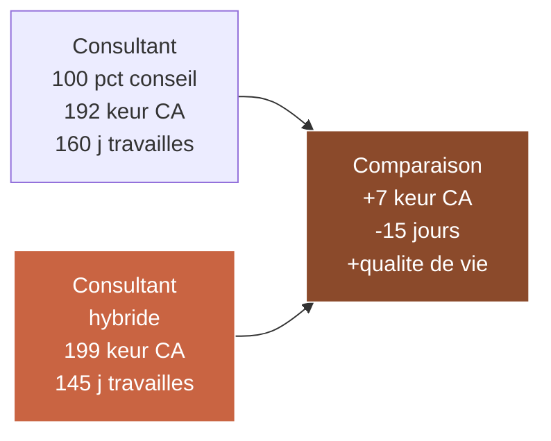

## 5.6 — Comment combiner conseil + système dans une même proposition

La technique la plus puissante commercialement : **inclure systématiquement un système dans chaque mission conseil**.

### Structure de la proposition hybride

| Bloc | Prix | Description |
|------|------|-------------|
| Mission conseil (main) | 55 k€ | 8 semaines d'accompagnement CAIO |
| Système 1 (inclus) | Valeur 1 500 € | Pack de prompts dédiés au métier du client |
| Système 2 (inclus) | Valeur 2 000 € | Workflow Zapier pour automatiser X |
| Système 3 (option) | +2 500 € | Assistant dédié "[Nom client] GPT" |
| Fractional post-mission (option) | 4 500 €/mois | 1 jour/semaine pendant 6 mois |

Le client perçoit **4 à 5 livrables** au lieu d'un seul, ce qui justifie un prix total plus élevé et limite la négociation. Et surtout, les systèmes deviennent des **artefacts tangibles** que le client garde même après la fin de la mission — preuve visible du ROI.

## 5.7 — La passerelle vers la formation CAIO Academy core

À ce stade du Track, Marc a compris le modèle : vendre conseil + systèmes est la voie vers un CA au-delà de 200 k€.

Mais une question pratique reste ouverte : **où Marc trouve-t-il les systèmes à vendre ?**

Trois options :

| Option | Effort | Coût | Résultat |
|--------|--------|------|----------|
| 1. Construire ses systèmes soi-même | 3-6 mois à temps partiel | Temps perdu + apprentissage technique | Incertain |
| 2. Sous-traiter à un développeur | 5-15 k€ par système | Dépendance technique | Moyen |
| 3. **Accéder à une bibliothèque de systèmes pré-buildés via la formation CAIO Academy core** | 0 effort de construction | Coût formation | Prêt à déployer |

La formation core CAIO Academy te donne accès à :
- **3 systèmes IA pré-buildés et documentés** (pack prompts, workflow no-code, assistant dédié).
- **Les prompts systèmes source** que tu customises par client.
- **Les manuels de déploiement** (5-10 pages par système) à white-labeler.
- **La licence commerciale de revente** — tu peux les revendre à tes clients sans frais supplémentaires.

C'est précisément la passerelle que ce Track a vocation à ouvrir. Le Monetization Track te donne la mécanique commerciale ; la formation core te donne les produits.

## Livrable Module 05

**Catalogue de systèmes IA vendables (template)** — un document Notion qui comporte :

1. **Matrice des 3 types de systèmes** (prompts, workflows, assistants) avec prix, effort, cible.
2. **Top 20 idées de systèmes** classées par fonction (Marketing, RH, Sales, Ops, Finance, Juridique) avec prix suggéré.
3. **Template de proposition hybride conseil + système** — pour intégrer systématiquement un système dans chaque mission.
4. **Plan d'onboarding d'un système acheté** (de 0 à déployé chez le client en 1 semaine).
5. **Checklist "système vendable"** — les 5 critères qu'un système doit respecter pour être recyclable.

## Key takeaways Module 05

- Le **conseil à la journée a un plafond mathématique** à 250-290 k€/an. Pour passer au-delà, il faut vendre des produits.
- **Trois types de systèmes** sont accessibles à un consultant non-développeur : prompts (500-1 500 €), workflows no-code (1 500-3 000 €), assistants dédiés (2 500-5 000 €).
- Le **modèle hybride conseil + systèmes** permet de gagner plus en travaillant moins, tout en fidélisant mieux le client.
- **Inclure un système dans chaque proposition de mission** augmente le panier moyen de 1,5 à 2.
- **La passerelle naturelle** vers le CA > 250 k€ est la formation core CAIO Academy, qui fournit les systèmes pré-buildés et documentés prêts à revendre.

---

---

# Module 06 — Acquisition clients : les canaux qui marchent vraiment

**Durée : 1h15 · Format : channel strategy + LinkedIn playbook + templates outreach**

## Objectifs du module

À la fin de ce module, tu seras capable de :

1. Identifier les **3 seuls canaux d'acquisition** qui fonctionnent vraiment pour un consultant CAIO en B2B en 2025.
2. Construire une **machine LinkedIn opérationnelle** qui génère 3 à 5 RDV découverte par semaine.
3. Rédiger des **messages d'outreach** qui obtiennent 15-25 % de taux de réponse (vs 3-5 % pour le cold classique).
4. Transformer tes **anciens clients en machine à recommandations** avec un système simple et éthique.
5. Calibrer ton **temps commercial hebdomadaire** (combien d'heures par semaine consacrer à quoi).

## 6.1 — Les 3 canaux qui comptent pour un CAIO en 2025

Le marketing B2B est saturé. Pour un consultant CAIO, seuls 3 canaux produisent un ROI positif de manière fiable.

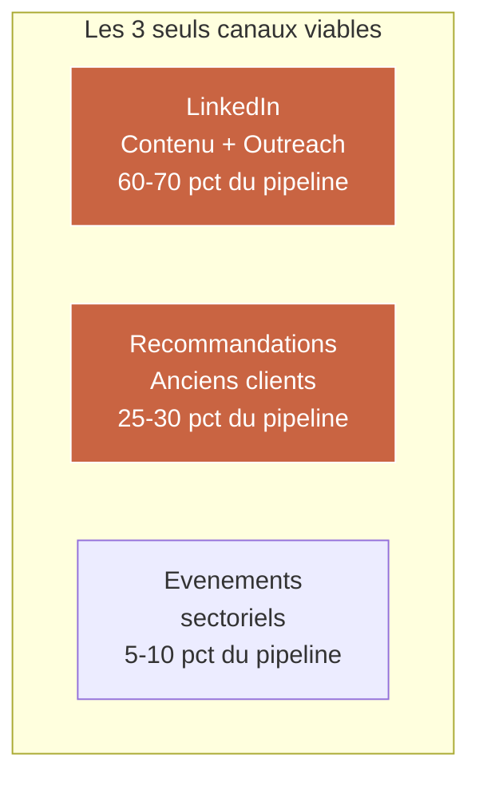

| Canal | % du pipeline | Effort hebdo | CAC typique | Cycle vente |
|-------|---------------|--------------|-------------|--------------|
| LinkedIn (contenu + outreach) | 60-70 % | 6-8h | 250-400 € | 4-8 semaines |
| Recommandations clients | 25-30 % | 1-2h | ~0 € | 2-4 semaines |
| Événements sectoriels | 5-10 % | 20-40h/an | 800-1 500 € | 8-16 semaines |

Les canaux qui **ne fonctionnent PAS** pour un CAIO : Google Ads B2B (trop cher, mauvaise intention), SEO pur (trop lent), Twitter/X (mauvais intent d'achat), plateformes freelance type Malt ou Comet (prix tirés vers le bas).

## 6.2 — LinkedIn : le canal #1 (playbook complet)

LinkedIn est **le canal d'acquisition B2B n°1** pour les consultants indépendants en France et en Europe. La raison est simple : c'est là que les dirigeants de PME et ETI vont plusieurs fois par semaine, et leurs algorithmes priorisent les profils qui postent régulièrement du contenu.

### Les 4 piliers d'une présence LinkedIn CAIO efficace

```mermaid
flowchart LR
    P1[Pilier 1<br/>Profil<br/>optimise] --> R[Resultat<br/>3-5 RDV<br/>decouverte<br/>par semaine]
    P2[Pilier 2<br/>Contenu<br/>regulier] --> R
    P3[Pilier 3<br/>Outreach<br/>cible] --> R
    P4[Pilier 4<br/>Engagement<br/>intelligent] --> R

    style R fill:#c96442,stroke:#fff,color:#fff
```

### Pilier 1 — Le profil CAIO optimisé

Ton profil doit dire en 3 secondes : "Cette personne est un expert IA, pour mon secteur, et elle peut m'aider."

| Élément | Bon pattern | Mauvais pattern |
|---------|-------------|------------------|
| Photo | Professionnelle, fond neutre, sourire | Selfie, filtre, fond domicile |
| Bannière | "CAIO Fractional pour PME services professionnels" + contact | Image générique ou vide |
| Titre | "J'aide les cabinets de conseil à générer 20 % de productivité via l'IA • CAIO Fractional" | "Consultant IA passionné" |
| À propos | 3 paragraphes : qui je suis, pour qui je bosse, comment me contacter | Long CV chronologique |
| Features | 3 à 5 liens : Quick Audit, Calendly, case studies | Rien ou des trucs génériques |

### Pilier 2 — Le contenu régulier (calendrier 4 semaines)

Il faut poster **3 fois par semaine** minimum pendant 12 semaines avant de voir les premiers RDV arriver directement par inbound. C'est la règle.

```mermaid
gantt
    title Calendrier de contenu CAIO sur 4 semaines
    dateFormat YYYY-MM-DD
    section Semaine 1
    Post insight tendance IA       :s1, 2025-01-06, 1d
    Post cas d'usage concret        :s2, 2025-01-08, 1d
    Post prise de position          :s3, 2025-01-10, 1d
    section Semaine 2
    Post temoignage anonymise       :s4, 2025-01-13, 1d
    Post benchmark sectoriel        :s5, 2025-01-15, 1d
    Post question ouverte           :s6, 2025-01-17, 1d
    section Semaine 3
    Post behind the scenes          :s7, 2025-01-20, 1d
    Post erreur commune et solution :s8, 2025-01-22, 1d
    Post retour d'experience        :s9, 2025-01-24, 1d
    section Semaine 4
    Post insight tendance IA        :s10, 2025-01-27, 1d
    Post interview mini client      :s11, 2025-01-29, 1d
    Post recap mensuel              :s12, 2025-01-31, 1d
```

### Les 7 formats de post qui fonctionnent

| Format | Exemple de titre | Taux d'engagement typique |
|--------|-------------------|------------------------------|
| 1. Contrarian | "La plupart des audits IA sont inutiles. Voici pourquoi." | Très haut |
| 2. Case study anonymisé | "Comment j'ai aidé un cabinet de 80 pers. à gagner 22 % de productivité en 8 semaines" | Haut |
| 3. Framework visuel | "3 questions à se poser avant de lancer un projet IA" + carousel | Haut |
| 4. Prise de position | "Non, ChatGPT ne remplacera pas votre consultant juridique" | Haut |
| 5. Insight data | "J'ai analysé 50 audits IA en 2024. Voici les 3 erreurs récurrentes." | Moyen |
| 6. Behind the scenes | "Ce matin, je restitue à un COMEX. Voici comment je prépare." | Moyen |
| 7. Question ouverte | "Quelle est la plus grosse résistance au changement IA dans votre équipe ?" | Variable |

### Pilier 3 — Outreach ciblé (le vrai canal qui convertit)

Le contenu LinkedIn crée de la visibilité mais **ne remplit pas directement ton pipeline**. L'outreach ciblé, oui.

### La méthode d'outreach qui fonctionne en 2025

Objectif : 3-5 RDV découverte par semaine. Volume cible : 50 messages personnalisés par semaine, taux de réponse 15-25 %, taux de conversion réponse → RDV 40-50 %.

```mermaid
flowchart LR
    List[Liste cible<br/>50 prospects<br/>par semaine] --> Sem1[Connexion avec<br/>note personnalisee]
    Sem1 --> Sem2[+7 jours<br/>Message de valeur<br/>sans pitch]
    Sem2 --> Sem3[+14 jours<br/>Question ouverte<br/>business]
    Sem3 --> Sem4[+21 jours<br/>Proposition RDV<br/>Quick Audit]

    style Sem4 fill:#c96442,stroke:#fff,color:#fff
```

### Templates d'outreach (à personnaliser à chaque envoi)

**Message 1 — Note de connexion (150-200 caractères max)**
> "Bonjour [Prénom], je vois que vous êtes [rôle] chez [entreprise] — je travaille principalement avec des [secteur] sur leurs sujets IA. Heureux d'être connecté."

**Message 2 — Valeur (7 jours après acceptation)**
> "Merci pour la connexion [Prénom]. Je viens de publier une analyse sur [sujet pertinent pour son secteur], ça pourrait vous intéresser : [lien]. Bonne lecture."

**Message 3 — Question ouverte (14 jours)**
> "[Prénom], curieux : où en êtes-vous sur l'IA chez [entreprise] ? J'ai l'impression que pour les [secteur] de votre taille, c'est le sujet qui revient le plus dans mes échanges en ce moment."

**Message 4 — Proposition RDV (21 jours)**
> "[Prénom], je propose 30 min pour échanger sur ce que vous auriez à gagner avec une approche IA structurée. Je ne vends rien dans ce RDV — j'écoute, je challenge, je donne mon point de vue. [Lien Calendly]."

### Pilier 4 — Engagement intelligent

L'algorithme LinkedIn récompense **la qualité des interactions, pas juste la quantité**. 30 minutes par jour d'engagement ciblé (commentaires longs sur 5-10 posts de prospects ou d'influenceurs sectoriels) multiplient la portée de tes propres posts par 3-4.

## 6.3 — Les recommandations clients : la machine invisible

Les recommandations sont le canal **le plus rentable** mais le plus négligé. Un client satisfait vaut 3 à 5 nouveaux clients dans les 12 mois — à condition que tu lui demandes activement.

### Le système de recommandations en 4 étapes

| Étape | Quand | Quoi faire |
|-------|-------|-----------|
| 1. Semaine 4 de la mission | Mid-mission | Demander un témoignage écrit (300-500 mots) |
| 2. Semaine 8 (fin de mission) | Restitution | Demander 2-3 introductions nommées |
| 3. Mois +3 | Follow-up post-mission | Check-in email, demande soft de recommandation |
| 4. Mois +6 | Échange régulier | NPS + nouvelle demande |

### Script de demande de recommandation (à envoyer en fin de mission)

> "[Prénom], la mission touche à sa fin et je suis très content du résultat qu'on a construit ensemble. Tu connais mon positionnement — j'aide les [secteur] de [taille] à structurer leur stratégie IA. Qui dans ton réseau pourrait bénéficier d'un échange avec moi ? Si deux ou trois noms te viennent, je me ferais un plaisir que tu nous mettes en contact. En retour, je te ferai un retour détaillé sur chaque conversation."

Taux typique : sur 10 demandes formulées ainsi, tu obtiens 6 à 8 recommandations nommées, dont 40 % deviennent RDV, dont 30 % deviennent clients. Soit **0,9 à 1,2 nouveaux clients par demande**.

## 6.4 — Calibrer ton temps commercial hebdomadaire

Règle d'or : **25-30 % de ton temps doit être commercial** tant que ton pipeline n'est pas saturé. En-dessous de 20 %, tu tombes dans le creux après 2-3 mois.

| Activité | Heures/semaine | % du temps commercial |
|----------|----------------|-----------------------|
| Contenu LinkedIn (création + engagement) | 4-5h | 35 % |
| Outreach (liste + messages + follow-ups) | 3-4h | 25 % |
| RDV découverte (3-5 par semaine) | 3-5h | 30 % |
| Recommandations et follow-up anciens clients | 1-2h | 10 % |
| **Total commercial** | **11-16h** | **100 %** |

## Livrable Module 06

**Templates de messages d'outreach CAIO + Calendrier de contenu LinkedIn 30 jours** — un package Notion comportant :

1. **Pack 4 templates d'outreach LinkedIn** (connexion, valeur, question, RDV) avec instructions de personnalisation.
2. **Calendrier de contenu 30 jours** avec 12 sujets pré-écrits adaptés au positionnement CAIO.
3. **7 formats de posts** avec exemples prêts à l'emploi (contrarian, case study, framework, etc.).
4. **Script de demande de recommandation** en fin de mission.
5. **Matrice de temps commercial hebdomadaire** à appliquer selon sa saturation pipeline.

## Key takeaways Module 06

- Seuls **3 canaux comptent** pour un CAIO en 2025 : LinkedIn (60-70 %), recommandations (25-30 %), événements (5-10 %).
- **LinkedIn = contenu + outreach + engagement**, pas juste un canal de posting. 11-16h/semaine pendant 12 semaines avant premiers résultats stables.
- **Outreach en 4 messages séquencés** (connexion → valeur → question → RDV) atteint 15-25 % de taux de réponse.
- **Les recommandations sont invisibles mais la vraie machine** — 0,9 à 1,2 clients par demande formulée correctement.
- **25-30 % du temps de Marc doit être commercial** tant que le pipeline n'est pas saturé (>3 RDV/semaine stables).

---

---

# Module 07 — Scaler : passer de freelance à micro-agence AI

**Durée : 1h · Format : business model + structure d'équipe + sous-traitance**

## Objectifs du module

À la fin de ce module, tu seras capable de :

1. Reconnaître les **signaux de saturation** qui indiquent qu'il est temps de passer de freelance solo à micro-agence.
2. Identifier les **3 premiers profils à recruter** et dans quel ordre.
3. Comparer les **3 modèles économiques** possibles : agence intégrée, cabinet-réseau, collectif de freelances.
4. Utiliser le **CAIO Registry** pour trouver tes premiers freelances / sous-traitants de qualité.
5. Calculer ton **CA plafond en solo** vs **ton CA cible en micro-agence** (10-15 pers., 1,5-3 M€).

## 7.1 — Les 5 signaux que tu es saturé en solo

Tu es saturé (et donc prêt à scaler) si tu coches 3 des 5 signaux ci-dessous pendant au moins 2 mois consécutifs :

| # | Signal | Seuil |
|---|--------|-------|
| 1 | Tu refuses des missions faute de capacité | >1 mission refusée / mois |
| 2 | Ton TJM est stable à 1 200 €+ | Depuis 3 mois |
| 3 | Tu as 3+ Fractionals actifs | Récurrence >15 k€/mois |
| 4 | Ton pipeline est saturé | >5 RDV découverte/semaine |
| 5 | Tu sens la limite personnelle | Fatigue, refus nouveaux défis |

## 7.2 — Les 3 premiers profils à recruter

L'erreur classique est de recruter un "mini-toi" en premier. C'est contre-productif : tu doubles le coût commercial sans alléger ton bottleneck (livraison).

### Profil 1 — Consultant-exécutant junior (le premier recrutement)

| Dimension | Détail |
|-----------|--------|
| Profil | 3-5 ans d'expérience, junior conseil ou tech, tarif freelance 400-600 €/jour |
| Rôle | Prend en charge 50-70 % de la livraison sur tes missions |
| Facturation au client | Même TJM que toi (1 200 €), pas de discount |
| Marge sur son temps | 600-800 €/jour |
| Statut | Freelance sous-traitant, ou salarié CDI à 45-55 k€ |
| Signal de recrutement | Tu ne tiens plus la charge de livraison |

### Profil 2 — Assistant opérationnel (parfois avant ou en même temps)

| Dimension | Détail |
|-----------|--------|
| Profil | Assistant administratif ou chef de projet junior |
| Rôle | Facturation, planification, CRM, follow-ups, relances |
| Statut | Freelance 20-30h/mois ou CDI mi-temps |
| Coût mensuel | 1 500-2 500 € |
| ROI | Te libère 8-12h/semaine de temps non facturable |

### Profil 3 — Spécialiste technique (freelance sur mission)

| Dimension | Détail |
|-----------|--------|
| Profil | Développeur IA / data engineer 600-900 €/jour |
| Rôle | Implémenter les systèmes complexes (Type 3) que tu vends |
| Statut | Freelance toujours, jamais salarié |
| Marge sur son temps | 300-500 €/jour (tu revends 1 200) |

## 7.3 — Les 3 modèles économiques comparés

```mermaid
flowchart TB
    subgraph Models[Trois modeles pour scaler]
        A[Modele A<br/>Agence integree<br/>10-15 salaries<br/>CA 2-3 Meur]
        B[Modele B<br/>Cabinet-reseau<br/>3-5 associes<br/>CA 1,5-2,5 Meur]
        C[Modele C<br/>Collectif<br/>Core + 10 freelances<br/>CA 800 keur-1,5 Meur]
    end

    style A fill:#1a1a1a,stroke:#c96442,color:#fff
    style B fill:#c96442,stroke:#fff,color:#fff
    style C fill:#8b4a2b,stroke:#fff,color:#fff
```

| Critère | Agence intégrée | Cabinet-réseau | Collectif freelances |
|---------|------------------|-----------------|------------------------|
| Nb de personnes | 10-15 salariés | 3-5 associés + freelances | 1-2 core + 10-20 freelances |
| CA cible | 2-3 M€ | 1,5-2,5 M€ | 800 k€ - 1,5 M€ |
| Structure juridique | SAS | SELAS / SAS | Micro-entreprise ou SASU |
| Capital initial | 100-250 k€ | 30-80 k€ | < 10 k€ |
| Complexité RH | Haute | Moyenne | Faible |
| Flexibilité | Faible | Moyenne | Très haute |
| Rentabilité % | 15-20 % | 25-35 % | 40-55 % |
| Temps à atteindre | 3-5 ans | 2-3 ans | 6-12 mois |
| **Recommandation pour Marc** | Rarement | **Option B cible** | **Option A départ** |

Pour 95 % des consultants CAIO qui démarrent le scaling, **le modèle Collectif est le bon point de départ**. Il permet de garder l'agilité, d'éviter les coûts fixes, et de tester la scalabilité avant de s'engager dans une structure plus lourde.

## 7.4 — Le CAIO Registry : trouver tes premiers freelances de qualité

Le **CAIO Registry** (registry.caio-academy.com, à venir) est le répertoire professionnel des consultants CAIO certifiés. C'est la première base où Marc peut chercher ses sous-traitants quand son pipeline déborde.

Alternatives tant que le Registry n'est pas lancé :
- **Malt** (filtres "AI", "Prompt Engineer", "AI Advisor")
- **Comet** (niveau plus senior, mais cher)
- **Collectif des freelances**
- **LinkedIn** (messages directs à des profils 2-5 ans d'expérience)

### Checklist qualification d'un sous-traitant CAIO

| # | Critère | Oui/Non |
|---|---------|---------|
| 1 | 2+ ans d'expérience terrain en IA ou équivalent | ____ |
| 2 | 2+ études de cas IA concrètes documentées | ____ |
| 3 | TJM cohérent (400-800 €) | ____ |
| 4 | Outils : Notion, Slack, Loom maîtrisés | ____ |
| 5 | Bon français écrit et oral (si clients FR) | ____ |
| 6 | Accepte une période de test payée 3-5 jours | ____ |

## 7.5 — Maths du passage à la micro-agence (modèle Collectif)

```
Année N (solo, saturé) :
  Marc solo → 180 k€ CA, 140 jours facturés, 55 % de marge nette = 99 k€ revenu

Année N+1 (collectif démarré) :
  Marc → 130 jours × 1 400 € = 182 k€ (repositionné haut de gamme)
  3 freelances sous-traitants → 120 jours × 800 € de marge moyenne = 96 k€ de marge brute
  Coûts opérationnels (outils, assistant) : 18 k€
  Revenu net Marc : 99 + 60 = 159 k€ (+60 %)
  Jours facturés : 250 (solo + freelances)
```

L'année N+1 double le CA total avec un revenu net Marc qui augmente de 60 %, tout en préparant une troisième année où Marc peut descendre à 100 jours facturés tout en gardant 150 k€ de revenu.

## 7.6 — Statut juridique : micro-entreprise, SASU, ou EURL ?

Dès que Marc passe à 1 200 €/j, le plafond micro-entreprise à 77 700 € HT/an devient contraignant (atteint en ~65 jours facturés). Le passage à la SASU ou EURL devient nécessaire.

| Dimension | Micro-entreprise | SASU | EURL |
|-----------|------------------|------|------|
| Plafond CA | 77 700 € | Illimité | Illimité |
| Cotisations sociales | 22 % du CA | ~80 % du salaire net | ~45 % du revenu |
| Impôt | IR libératoire ou non | IS (25 %) + IR sur dividende | IR ou IS au choix |
| Comptabilité | Ultra-simple | Bilan annuel obligatoire | Bilan annuel obligatoire |
| Récupération TVA | Non (franchise) | Oui | Oui |
| Cumul ARE Pôle Emploi | Oui (complément ARE) | Oui si salaire 0 | Oui si gérance gratuite |
| Idéal si | CA < 70 k€ | CA > 100 k€ + vente systèmes | CA 80-150 k€ |

Marc visant 150-200 k€ de CA en année 2, **la SASU est presque toujours le bon choix** — elle permet de se verser un salaire + dividendes, de recruter facilement, et d'optimiser fiscalement.

## Livrable Module 07

**Business model micro-agence AI (simulateur)** — un fichier Google Sheets + guide Notion comportant :

1. **Simulateur CA / marge / revenu net** paramétrable (nombre de freelances, TJM moyen, taux d'occupation, marge par freelance).
2. **Checklist de passage solo → collectif** (les 5 signaux + les 10 premières actions).
3. **Templates de contrats freelance** (sous-traitance, NDA, clauses non-débauchage, facturation).
4. **Fiche de qualification freelance** (6 critères + période de test).
5. **Roadmap 12 mois passage collectif** (mois par mois).

## Key takeaways Module 07

- Tu scales **quand 3 des 5 signaux de saturation** sont présents pendant 2 mois consécutifs.
- **Premier recrutement = consultant-exécutant**, pas un "mini-toi" commercial. Ensuite assistant opérationnel, puis spécialiste technique.
- **Le modèle Collectif est le point de départ** pour 95 % des cas — agilité, faible capital, marge >40 %.
- **CAIO Registry + Malt + LinkedIn** sont les canaux de recrutement freelance prioritaires.
- **Revenu net Marc peut monter de 99 k€ à 159 k€ en année N+1** en démarrant un collectif, même avec le même nombre de jours travaillés.
- **Passage SASU** quasi-obligatoire au-delà de 100 k€ de CA annuel.

---

---

# Module 08 — Plan 90 jours : de €500/j à €1 200/j CAIO

**Durée : 1h · Format : plan d'exécution semaine par semaine + tracker + métriques**

## Objectifs du module

À la fin de ce module, tu seras capable de :

1. Exécuter un **plan 90 jours semaine par semaine** dédié au passage de 500 €/j à 1 200 €/j CAIO.
2. Mesurer ta progression avec **5 KPIs hebdomadaires** objectifs.
3. Identifier les **3 moments de bascule** à ne pas rater sur la période.
4. Utiliser le **tracker de progression** pour rester sur ligne de mire.
5. Préparer ton **trimestre suivant** (J91-J180) avec la sécurité d'un premier succès validé.

## 8.1 — Vue d'ensemble du plan 90 jours

```mermaid
flowchart LR
    J0[J0<br/>Tu termines<br/>ce parcours] --> J30[J1-J30<br/>Repositionnement<br/>+ premieres convos]
    J30 --> J60[J31-J60<br/>Premiere mission<br/>ou vente systeme]
    J60 --> J90[J61-J90<br/>Premier client<br/>recurrent ou upsell]
    J90 --> Future[J91+<br/>Scaling]

    style J30 fill:#1a1a1a,stroke:#c96442,color:#fff
    style J60 fill:#c96442,stroke:#fff,color:#fff
    style J90 fill:#c96442,stroke:#fff,color:#fff
```

| Phase | Jours | Focus | Objectif principal |
|-------|-------|-------|---------------------|
| Phase 1 | J1-J30 | Repositionnement + premières conversations | 15 RDV découverte générés |
| Phase 2 | J31-J60 | Première mission ou vente système à nouveau TJM | 1 Quick Audit signé + 1 Mission signée |
| Phase 3 | J61-J90 | Premier client récurrent ou upsell | 1 Fractional signé + 1 système vendu |

## 8.2 — Phase 1 : J1-J30 — Repositionnement

### Semaine 1 (J1-J7)

| Jour | Action | Livrable |
|------|--------|----------|
| J1 | Valider ta matrice opportunités marché | Livrable M01 finalisé |
| J2 | Écrire tes 3 fiches offres | 3 PDF prospect-ready |
| J3 | Refondre ton profil LinkedIn (photo, bannière, titre, à propos) | Profil optimisé |
| J4 | Créer ta liste de 100 comptes cibles | Google Sheet qualifié |
| J5 | Prévenir tes 10 anciens clients du repositionnement | 10 emails envoyés |
| J6 | Écrire ton 1er post LinkedIn CAIO | Post publié |
| J7 | Bilan semaine + planification semaine 2 | Dashboard mis à jour |

### Semaine 2 (J8-J14)

| Jour | Action | Livrable |
|------|--------|----------|
| J8 | Post LinkedIn #2 | Publié |
| J9 | Envoyer 50 connexions LinkedIn personnalisées | 50 messages |
| J10 | Post LinkedIn #3 + répondre commentaires | Engagement haut |
| J11 | Envoyer 20 messages de valeur aux connexions acceptées | 20 messages |
| J12 | Appeler / écrire 5 anciens clients pour recommandations | 5 conversations |
| J13 | Post LinkedIn #4 + engagement 5 posts d'influenceurs | Publié |
| J14 | Bilan + 1 RDV de calibrage avec pair CAIO | Dashboard |

### Semaines 3 et 4 (J15-J30)

Montée en puissance : 3 posts/semaine, 50 connexions/semaine, 30 messages de suivi/semaine, premières propositions de RDV découverte.

**Métriques cibles fin J30** :
- 200+ nouvelles connexions LinkedIn ciblées
- 12+ posts LinkedIn publiés avec 500+ vues moyennes
- 15+ RDV découverte bookés
- 5+ RDV découverte déjà réalisés
- 2+ Quick Audits proposés en RDV
- 0 à 1 Quick Audit signé

## 8.3 — Phase 2 : J31-J60 — Première mission

### Semaines 5-6 (J31-J44)

Focus : **convertir les RDV en Quick Audits signés**. Chaque Quick Audit facturé est une preuve commerciale qui nourrit les suivants.

| Action | Fréquence | Métrique |
|--------|-----------|----------|
| RDV découverte | 4-6 / semaine | >30 % de proposition Quick Audit |
| Posts LinkedIn | 3 / semaine | >1 000 vues moyennes |
| Outreach | 50 connexions + 30 follow-ups / semaine | 15 % de réponse |
| Engagement | 30 min / jour | 5-10 commentaires significatifs |

**Métriques cibles fin J44** :
- 3-5 Quick Audits signés à 500-1 500 € (CA Quick Audit : 2-6 k€)
- 10+ RDV découverte réalisés
- 1 Mission proposée

### Semaines 7-8 (J45-J60)

Focus : **signer la première Mission à 30-55 k€** sur la base d'un Quick Audit converti.

**Métriques cibles fin J60** :
- 1 Mission signée (30-55 k€) — objectif central de la période
- 2-3 Quick Audits additionnels signés
- 1 première proposition de Fractional envoyée (à un ancien client)

## 8.4 — Phase 3 : J61-J90 — Premier client récurrent

### Semaines 9-10 (J61-J74)

Focus : **livrer la Mission avec excellence** (framework Module 04) et **signer ton 1er Fractional** auprès d'un ancien client.

**Métriques cibles fin J74** :
- Mission en cours, semaine 3-4 sur 8
- 1 Fractional signé (3-5 k€/mois, 6-12 mois)
- 1 système vendu à part (1 500-3 000 €)

### Semaines 11-12 (J75-J90)

Focus : **consolider les résultats et préparer J91-J180**.

**Métriques cibles fin J90** :
- 1 Mission en livraison (avec Quick Win réalisé, client satisfait)
- 1 Fractional actif (revenu récurrent démarré)
- 1-2 Quick Audits additionnels dans le pipeline
- 1 système vendu
- **TJM effectif moyen sur les 90 jours : 800-1 100 €**
- **Pipeline qualifié : 50-80 k€ pour J91-J180**

## 8.5 — Tableau de bord 90 jours

```mermaid
flowchart LR
    subgraph KPIs[5 KPIs hebdomadaires]
        K1[K1<br/>RDV<br/>decouverte<br/>bookes]
        K2[K2<br/>RDV<br/>decouverte<br/>realises]
        K3[K3<br/>Quick Audits<br/>signes]
        K4[K4<br/>Missions<br/>proposees]
        K5[K5<br/>CA facture<br/>cumule]
    end

    style K3 fill:#c96442,stroke:#fff,color:#fff
    style K5 fill:#c96442,stroke:#fff,color:#fff
```

| KPI | Fin J30 | Fin J60 | Fin J90 |
|-----|---------|---------|---------|
| K1 — RDV découverte bookés | 15+ | 30+ | 45+ |
| K2 — RDV découverte réalisés | 5+ | 15+ | 28+ |
| K3 — Quick Audits signés | 0-1 | 3-5 | 5-8 |
| K4 — Missions proposées | 0-1 | 2-3 | 4-5 |
| K5 — CA facturé cumulé | 0-1,5 k€ | 8-20 k€ | 45-75 k€ |

## 8.6 — Les 3 moments de bascule critiques

### Bascule 1 — Entre J20 et J30 : "le silence perçu"

Tu as posté 12 fois sur LinkedIn, envoyé 200 messages, et tu n'as pas encore décroché de Quick Audit. Tu commences à douter.

**Réaction à adopter** : c'est le comportement **normal**. Le cycle LinkedIn requiert 4-6 semaines avant les premières conversions. Ne réduis pas le rythme, ne changes pas de stratégie. Continue.

### Bascule 2 — Entre J45 et J55 : "le prix annoncé"

Tu viens d'envoyer ta première proposition de Mission à 55 k€. Le prospect te demande une réduction. Ton instinct te pousse à accepter.

**Réaction à adopter** : tiens le prix. Propose de scopher moins (passer de 55 à 40 k€ en réduisant le périmètre), mais jamais de bradder ton TJM. Chaque discount crée un précédent permanent.

### Bascule 3 — Entre J75 et J85 : "le succès perçu"

Tu as livré ta première mission avec succès, ton Fractional est signé, tu as un bon momentum. Tu es tenté de lever le pied sur le commercial.

**Réaction à adopter** : **surtout pas**. Les 2 semaines qui précèdent J90 sont celles où tu construis le pipeline de J91-J180. Maintiens le rythme commercial à 100 %.

## Livrable Module 08

**Plan 90 jours personnalisé + tracker** — un package Google Sheets + Notion qui inclut :

1. **Plan 90 jours pré-rempli** semaine par semaine, personnalisable à ton profil.
2. **Tracker KPI hebdomadaire** (les 5 KPIs, avec saisie chaque vendredi).
3. **Dashboard de bascule** (les 3 moments critiques + checklists d'action).
4. **Calendrier de contenu 90 jours** (36 sujets de posts LinkedIn pré-écrits).
5. **Pipeline tracker** (Google Sheets type Pipedrive léger) pour suivre les RDV, propositions, signatures.

## Key takeaways Module 08

- **Le passage de 500 €/j à 1 200 €/j se fait en 90 jours** avec un plan structuré semaine par semaine.
- **3 phases distinctes** : repositionnement (J1-J30), première mission (J31-J60), premier récurrent (J61-J90).
- **5 KPIs hebdomadaires** : RDV bookés, RDV réalisés, Quick Audits signés, Missions proposées, CA facturé cumulé.
- **3 moments de bascule** à ne pas rater : le silence perçu (J20-J30), le prix annoncé (J45-J55), le succès perçu (J75-J85).
- **Objectif J90** : Mission en livraison + 1 Fractional actif + pipeline qualifié de 50-80 k€ pour les 90 jours suivants.

---

---

# Conclusion — Ce que Marc maîtrise à la fin du parcours

À la fin du CAIO Monetization Track, Marc a construit **8 livrables tangibles** qu'il peut utiliser dès lundi en clientèle :

1. Une matrice opportunités marché CAIO ciblée sur son profil
2. 3 fiches offres prospect-ready (Quick Audit, Mission, Fractional)
3. Un script de vente CAIO + répertoire de 10 objections
4. Un framework de livraison mission 8 semaines
5. Un catalogue de systèmes IA vendables
6. Des templates d'outreach LinkedIn + calendrier de contenu
7. Un business model micro-agence (simulateur)
8. Un plan 90 jours personnalisé avec tracker

```mermaid
flowchart TB
    subgraph Before[Avant le parcours]
        B1[Consultant 500 eur/j]
        B2[Offre floue]
        B3[Pas de pitch IA]
        B4[Acquisition au hasard]
        B5[Revenus non recurrents]
    end
    subgraph After[Apres le parcours]
        A1[Consultant 1 200 eur/j]
        A2[3 offres packagees]
        A3[Script de vente eprouve]
        A4[Machine LinkedIn operationnelle]
        A5[Fractional recurrent]
    end
    Before --> After

    style A1 fill:#c96442,stroke:#fff,color:#fff
    style A5 fill:#c96442,stroke:#fff,color:#fff
```

### Transformation financière typique à 12 mois

| Dimension | Avant le parcours | Après 90 jours | Après 12 mois |
|-----------|-------------------|----------------|-----------------|
| TJM moyen | 500 € | 1 000 € | 1 300 € |
| Jours facturés / an | 140 | ~35 (sur 90 j) | 130 |
| CA actif | 70 k€ | ~35 k€ (pro rata) | 170 k€ |
| CA récurrent | 0 € | 5 k€ | 55 k€ |
| CA total annualisé | 70 k€ | ~140 k€ | 225 k€ |
| Revenu net (marge 60 %) | 42 k€ | 84 k€ annualisé | 135 k€ |

### La passerelle vers la formation CAIO Academy core

Au Module 05, Marc a compris qu'il peut vendre des systèmes IA en plus du conseil. Le Monetization Track lui a donné :
- la mécanique commerciale complète
- les templates d'offre hybride conseil + système
- les 20 idées de systèmes à vendre

Ce qui manque maintenant, ce sont **les systèmes eux-mêmes** — pré-buildés, documentés, white-labelables, avec licence de revente.

C'est exactement l'objet de la **formation core CAIO Academy** :
- 3 systèmes IA pré-buildés (pack prompts, workflow no-code, assistant dédié)
- Documentation déploiement client prête à l'emploi
- Licence commerciale de revente
- Mises à jour trimestrielles des systèmes
- Accès au CAIO Registry pour trouver collègues et sous-traitants

Le Monetization Track t'a donné le **go-to-market complet**. La formation core te donne le **produit à vendre**. Les deux ensemble ferment la boucle de ton repositionnement CAIO et te mettent sur la trajectoire du CA > 250 k€ en année 2.

---

# Annexes

## Annexe A — Glossaire

| Terme | Définition |
|-------|-----------|
| CAIO | Chief AI Officer — responsable de la stratégie et de l'exécution IA d'une organisation |
| Fractional | Format d'engagement à temps partiel récurrent (1-2 jours/semaine) |
| TJM | Taux journalier moyen — prix facturé pour une journée de consultation |
| Quick Audit | Livrable court (3-5 j) à prix d'entrée pour qualifier commercialement un prospect |
| LTV | Lifetime Value — valeur cumulée d'un client sur toute la relation |
| CAC | Customer Acquisition Cost — coût d'acquisition d'un client |
| NPS | Net Promoter Score — indicateur de satisfaction et de propension à recommander |
| MRR | Monthly Recurring Revenue — revenu récurrent mensuel |
| Outreach | Démarchage commercial direct via canal digital (LinkedIn, email) |
| Cas client imaginaire | Technique de storytelling commercial pour présenter un cas plausible sans identifier un client |
| Escalier tarifaire | Architecture d'offres progressive (niveau 1 → 2 → 3) qui permet au client de monter en gamme |
| White-label | Produit générique customisable sous la marque du revendeur |
| Micro-entreprise | Statut juridique simplifié plafonné à 77 700 €/an de CA en prestation de services en 2025 |
| SASU | Société par actions simplifiée unipersonnelle — statut flexible au-delà du plafond micro |
| Portage salarial | Statut hybride freelance/salarié via société de portage |

## Annexe B — Checklist de repositionnement CAIO (40 items)

### Étape 1 — Fondations (10 items)
- [ ] Matrice opportunités marché remplie
- [ ] Segment prioritaire identifié (A/B/C/D)
- [ ] Positionnement choisi (sectoriel/fonctionnel/généraliste)
- [ ] TJM cible fixé (chiffre précis)
- [ ] 100 comptes cibles qualifiés
- [ ] Statut juridique validé (MicroEntreprise/SASU/EURL/portage)
- [ ] 10 anciens clients prévenus du repositionnement
- [ ] Calendrier commercial hebdo défini (25-30 % du temps)
- [ ] Outils installés (Notion, Calendly, Pipedrive)
- [ ] Compte bancaire pro séparé si SASU/EURL

### Étape 2 — Offre (10 items)
- [ ] Fiche Quick Audit rédigée
- [ ] Fiche Mission rédigée
- [ ] Fiche Fractional rédigée
- [ ] Prix validés (3 niveaux par segment)
- [ ] Template devis Mission
- [ ] Template contrat Fractional
- [ ] Template CGV à jour
- [ ] Script de vente mémorisé
- [ ] 10 réponses objections pratiquées
- [ ] 3 cas clients imaginaires écrits (1 par archétype)

### Étape 3 — Machine d'acquisition (10 items)
- [ ] Profil LinkedIn refondu (photo, bannière, titre, à propos, features)
- [ ] Calendrier de contenu 90 jours planifié
- [ ] 4 templates d'outreach personnalisés
- [ ] Liste 100 connexions à envoyer semaine 1
- [ ] 30 min/jour d'engagement bloquées dans l'agenda
- [ ] Script de demande de recommandation à jour
- [ ] 10 anciens clients sollicités en priorité
- [ ] Événements sectoriels identifiés pour Q1+Q2
- [ ] Pipeline tracker (Sheets ou Pipedrive) opérationnel
- [ ] KPI hebdomadaire mis en place

### Étape 4 — Livraison (10 items)
- [ ] Framework mission 8 semaines imprimé
- [ ] Catalogue 10 Quick Wins semaine 1 prêt
- [ ] Stack outils installée (8 outils)
- [ ] Template diagnostic maturité construit (Tally + Airtable)
- [ ] Bibliothèque prompts construite (80-120 prompts)
- [ ] Matrice ROI construite (Sheets)
- [ ] Template rapport final mission (30 pages)
- [ ] Structure comité IA mensuel (agenda type)
- [ ] Charte IA interne (template 1 page)
- [ ] Proposition Fractional de suite (template)

## Annexe C — Ressources externes recommandées

### Plateformes freelance
- **Malt** — filtres "AI", "AI Strategy", "Prompt Engineer"
- **Comet** — missions senior 800-1 500 €/j
- **Freelance.com** — marché public et grands comptes
- **Collectif des freelances** — entraide et mutualisation

### Outils CAIO essentiels
- **Notion** — hub de mission et documentation
- **Calendly** — prise de RDV automatisée
- **Pipedrive ou HubSpot** — CRM pour le pipeline
- **Loom** — vidéos de restitution asynchrones
- **Zapier / Make** — workflows no-code
- **Tally / Typeform** — questionnaires diagnostic

### Juridique et fiscal
- **Legalstart** — création SASU/EURL
- **Shine Business** — banque pro simple
- **Indy ou Pennylane** — comptabilité freelance
- **URSSAF, ACoss, Bpifrance Création** — ressources institutionnelles françaises

### Lectures et formations complémentaires
- **HBR : "The AI-Savvy Leader"** — base théorique du rôle CAIO
- **MIT Sloan Review : AI Initiative reports** — benchmarks annuels
- **The AI Consultants Guild (Substack)** — communauté de praticiens
- **CAIO Academy core** — formation complémentaire avec systèmes vendables inclus

## Annexe D — Les 5 métriques de santé d'une pratique CAIO

| Métrique | Formule | Cible année 1 | Cible année 2 |
|----------|---------|----------------|-----------------|
| TJM moyen effectif | CA / jours facturés | 1 200 € | 1 500 € |
| Taux de jours facturés | Jours facturés / jours ouvrés | 55-65 % | 60-70 % |
| Part du CA récurrent | CA Fractional / CA total | 25-35 % | 40-50 % |
| Taux de conversion audit → mission | Missions signées / audits | 50-60 % | 65-75 % |
| NPS client | Enquête fin de mission | >8/10 | >9/10 |

---

**Fin du CAIO Monetization Track — 8 modules · 10 heures · 8 livrables · 90 jours pour tripler ton TJM.**

**Agentik {OS} — agentik-os.com**
