# CAIO Academy — AI Strategy Without Code Track

**Formation professionnelle pour dirigeantes et managers non-techniques**
**Avatar : Sophie — Head of Digital / Directrice Transformation**
**Niveau : Cadres supérieurs et membres de comité de direction**
**Durée estimée : 9 heures de contenu réparties sur 7 modules**
**Pré-requis : aucun. Zéro ligne de code. Zéro outil technique.**

---

## Avant-propos — Pourquoi cette formation existe

Il existe aujourd'hui en Europe une catégorie de dirigeantes et de managers que personne ne forme correctement à l'intelligence artificielle. Elles ne sont ni ingénieures, ni data scientists, ni développeuses. Elles sont directrices marketing, DRH, directrices de la transformation, head of digital, responsables d'opérations. Elles ont la responsabilité d'intégrer l'IA dans leur organisation, d'arbitrer des budgets à six ou sept chiffres, de répondre à leur comité de direction sur l'état d'avancement de leur stratégie IA, mais elles n'ont ni le temps ni l'envie d'apprendre à coder, et ce n'est pas leur métier.

Le marché leur propose deux types de formations : d'un côté, des formations techniques trop profondes (Python, machine learning, prompt engineering avancé) qui ne correspondent pas à leur poste ; de l'autre, des conférences d'inspiration ou des livres blancs généralistes qui ne leur donnent aucun outil concret pour décider, arbitrer, piloter. Entre ces deux extrêmes, il y a un vide : la formation pragmatique, stratégique, orientée décision, qui traite l'IA comme ce qu'elle est réellement devenue dans l'entreprise moderne — un levier de transformation qu'on pilote comme on pilote un budget marketing, un plan RH ou une stratégie de croissance.

Cette formation comble ce vide. Elle ne vous apprendra pas à construire un modèle de machine learning. Elle vous apprendra à poser les bonnes questions, identifier les vrais cas d'usage, arbitrer entre les propositions des prestataires, construire une feuille de route crédible devant votre COMEX, mesurer ce qui compte vraiment, rédiger une politique interne qui protège votre organisation, et vous positionner comme la référente IA de votre secteur. En d'autres termes, elle fait de vous une dirigeante AI-literate, capable de piloter la stratégie IA de son organisation avec la même autorité que celle avec laquelle vous pilotez les autres sujets.

Sophie, l'avatar de cette formation, est une Head of Digital dans une ETI de 800 personnes. Elle vient de se voir confier par sa directrice générale un mandat élargi : faire de l'IA un avantage concurrentiel dans les 18 mois. Elle n'est pas technique. Elle n'a pas de CTO qui parle sa langue. Elle a un budget, une feuille de route à écrire, un COMEX qui attend des résultats, et un marché saturé de prestataires qui lui promettent tout et n'importe quoi. Cette formation est construite pour Sophie, et pour toutes les Sophie qui liront ces lignes.

### Ce que vous maîtriserez à la fin de cette formation

| Compétence | Description | Livrable associé |
|-----------|-------------|------------------|
| Identifier les vraies opportunités IA | Cartographier les 5 processus à plus fort ROI dans votre organisation | Canvas opportunités AI |
| Construire un AI Roadmap | Présenter un plan 1-page crédible devant votre COMEX | Template Roadmap 1-page |
| Piloter vos prestataires | Arbitrer, contester, renégocier sans vous faire enfumer | Grille évaluation proposition |
| Mesurer le ROI réel | Construire un rapport mensuel en 2h sans développeur | Template rapport ROI |
| Rédiger une politique AI | Protéger votre organisation des risques juridiques et réputationnels | Template Politique AI Interne |
| Sélectionner des partenaires | Distinguer les vrais experts des vendeurs de vent | Grille évaluation partenaires |
| Vous positionner en référente | Construire votre crédibilité AI dans votre secteur | Kit personal branding CAIO |

### Architecture pédagogique de la formation

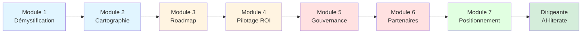

Les trois premiers modules construisent les fondations — comprendre ce qu'est réellement l'IA, identifier où elle apporte de la valeur, et structurer un plan. Les deux suivants installent le pilotage et la gouvernance — mesurer, contrôler, protéger. Les deux derniers transforment la dirigeante interne en référente externe — choisir ses partenaires avec exigence, et construire son autorité publique sur le sujet. L'ensemble constitue un parcours intégré que l'on peut suivre en 9 heures, ou étaler sur plusieurs semaines en appliquant chaque livrable à son organisation réelle.

---

## Module 01 — L'AI pour décideurs : démystification

### Objectifs du module

À l'issue de ce module, vous serez capable de distinguer ce que l'intelligence artificielle fait réellement de ce que les vendeurs prétendent qu'elle fait, d'expliquer en moins de trois phrases les concepts clés (LLM, agent, RAG, automatisation, fine-tuning) à un interlocuteur non-technique, d'identifier les cinq mensonges les plus récurrents dans les propositions commerciales IA, et de poser à n'importe quel fournisseur les questions qui révèleront s'il sait vraiment de quoi il parle ou s'il récite un script.

### 1.1 — Le vocabulaire de base, enfin expliqué sans jargon

L'intelligence artificielle souffre d'un problème de vocabulaire. Les mêmes mots sont utilisés pour désigner des choses très différentes, et les prestataires exploitent ce flou pour vendre plus cher ce qui est moins cher, ou pour promettre ce qu'ils ne peuvent pas livrer. Avant d'arbitrer, il faut poser les définitions. Vous n'avez pas besoin de les connaître dans leurs détails techniques. Vous avez besoin de savoir à quoi elles correspondent concrètement dans votre organisation, ce qu'elles coûtent approximativement, et ce qu'elles peuvent ou ne peuvent pas faire.

Un **LLM** (Large Language Model, grand modèle de langage) est un système entraîné sur d'immenses quantités de texte pour prédire le mot suivant le plus probable dans une phrase. C'est cette mécanique, apparemment simple, qui donne naissance à ChatGPT, Claude, Gemini, Mistral. Un LLM sait reformuler, résumer, traduire, répondre à des questions, rédiger des emails, rédiger du code. Il ne sait pas par défaut accéder aux données propres à votre entreprise, il ne sait pas naviguer sur internet en temps réel sans outil dédié, et il n'a pas de mémoire entre deux conversations. Tout cela peut être ajouté, mais ce sont des couches supplémentaires qui coûtent plus cher.

Un **agent IA** est un LLM auquel on a donné la capacité d'exécuter des actions — envoyer un email, consulter une base de données, remplir un formulaire, appeler une API. L'agent n'est pas un programme figé qui suit un script : il décide lui-même, étape par étape, de l'action à entreprendre pour atteindre un objectif qu'on lui a donné. Un agent peut traiter une facture de bout en bout, qualifier un lead, organiser un calendrier. La frontière entre un agent sophistiqué et un simple workflow automatisé est parfois floue, et c'est là que les prestataires vendent souvent du rêve.

Le **RAG** (Retrieval-Augmented Generation, génération augmentée par la recherche) est la technique qui permet à un LLM d'accéder aux documents propres à votre entreprise. Au lieu de répondre uniquement avec ses connaissances générales, le LLM commence par chercher dans vos documents internes (contrats, procédures, bases de connaissance, emails) les passages pertinents, puis il formule sa réponse en s'appuyant dessus. C'est le RAG qui transforme un chatbot générique en assistant expert de votre entreprise. Sa mise en place demande un travail de qualité de la donnée souvent sous-estimé.

L'**automatisation** est l'ancêtre de l'IA et survit très bien dans la plupart des cas d'usage réels. Automatiser, c'est exécuter une séquence d'étapes prédéfinies sans intervention humaine. L'IA ajoute à cela la capacité de gérer des cas imprévus, d'interpréter des données non structurées (emails, documents scannés, conversations), et de s'adapter au fil du temps. Dans de nombreux processus, la vraie réponse est un mélange : automatiser ce qui est routinier, et n'ajouter de l'IA que sur les points de décision complexes.

Le **fine-tuning** est l'opération qui consiste à réentraîner partiellement un modèle existant sur des données propres à votre organisation pour qu'il adopte votre ton, votre vocabulaire, votre manière de traiter un type de document. Le fine-tuning est souvent présenté comme la solution magique à tous les problèmes de personnalisation. En réalité, dans la plupart des cas, un bon RAG bien documenté atteint les mêmes résultats pour dix fois moins cher.

### 1.2 — Ce que l'IA fait vraiment vs ce que les vendeurs prétendent

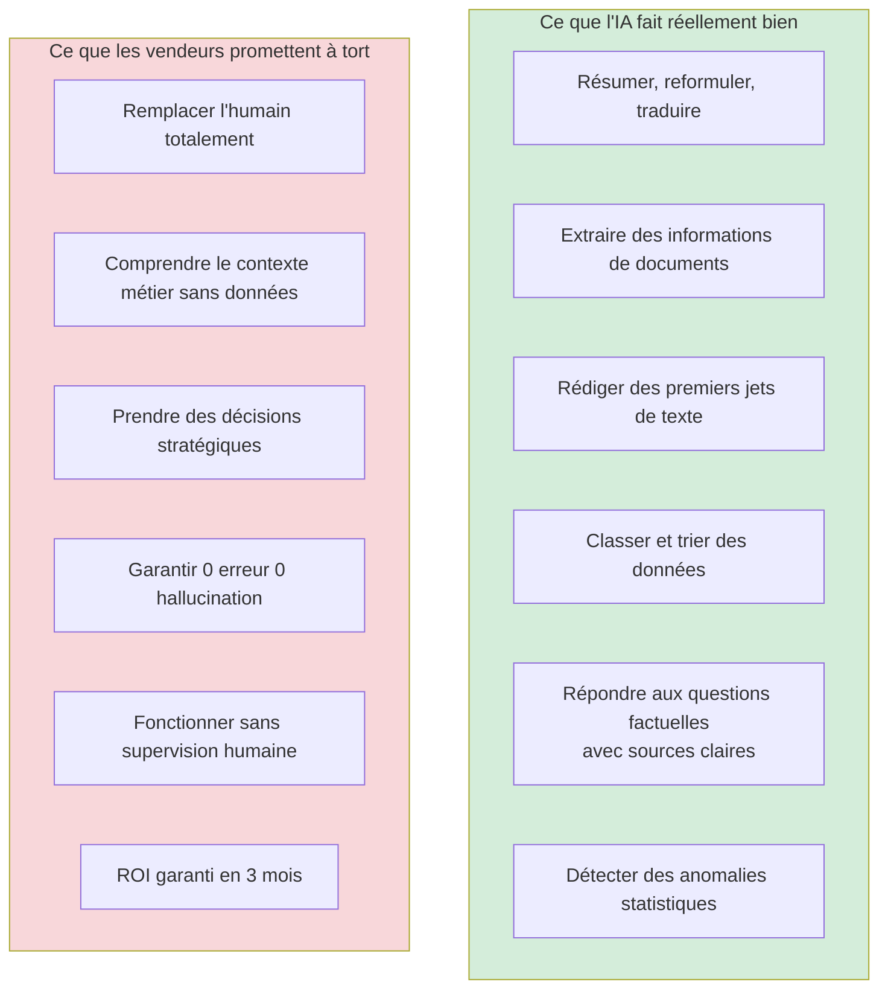

Le fossé entre ce que l'IA fait bien aujourd'hui et ce que les vendeurs promettent est l'endroit où se perdent la majorité des budgets IA. Les capacités réelles, fiables, productives, sont celles qui relèvent du traitement du langage : lire, comprendre, résumer, reformuler, classifier. Ces capacités, correctement déployées, peuvent libérer dix à quarante pour cent du temps de vos équipes sur les tâches de traitement documentaire, de qualification de leads, de rédaction opérationnelle. C'est un gain massif, mesurable, répliquable.

Ce que l'IA ne fait pas bien, en revanche, c'est prendre des décisions stratégiques complexes qui engagent l'entreprise, comprendre votre contexte métier sans qu'on le lui ait explicitement transmis via des documents ou une configuration, fonctionner sans aucune supervision humaine sur des sujets à risque juridique, financier ou réputationnel, et garantir zéro erreur. Tout LLM peut halluciner, c'est-à-dire inventer une information plausible mais fausse. Aucune technologie, aujourd'hui, n'élimine ce risque à cent pour cent. Un bon système d'IA est un système qui rend ces erreurs rares, détectables et rattrapables, pas un système qui prétend ne jamais en faire.

### 1.3 — Les cinq mensonges les plus vendus par les prestataires IA

| # | Mensonge | Ce qu'il cache | Question à poser |
|---|----------|----------------|------------------|
| 1 | « Notre IA est propriétaire » | 95% du temps, c'est un wrapper autour de GPT-4 ou Claude | Quel modèle de fondation utilisez-vous réellement en backend ? |
| 2 | « ROI garanti en 3 mois » | Le ROI dépend de VOS données, pas de leur techno | Quels clients comparables ont atteint ce ROI en 3 mois et quelle est leur taille ? |
| 3 | « Nous avons des millions de données d'entraînement » | Ces données ne sont pas les vôtres et n'aideront pas votre cas | Sur quelles données spécifiques à mon secteur est entraîné ce modèle ? |
| 4 | « L'intégration prend 2 semaines » | L'intégration technique peut-être, l'adoption réelle prend 6-12 mois | Combien de temps avant que 50% de mes équipes utilisent l'outil quotidiennement ? |
| 5 | « Nous sommes 100% conforme RGPD / AI Act » | Une checklist cochée ne vaut pas un audit juridique | Pouvez-vous me fournir votre DPIA et votre analyse de conformité AI Act ? |

Ces cinq mensonges reviennent dans quatre-vingts pour cent des propositions commerciales IA que j'ai pu analyser sur les trois dernières années. Ils ne traduisent pas forcément une malhonnêteté délibérée : souvent, le commercial qui vous les présente y croit lui-même. C'est précisément ce qui les rend dangereux. Votre rôle, en tant que dirigeante, est de poser les questions qui obligent le prestataire à sortir du discours marketing et à rentrer dans le concret.

### 1.4 — La grille d'évaluation d'un prestataire IA

Une grille d'évaluation structurée est l'outil le plus rentable de tout l'arsenal de la dirigeante IA. Elle permet d'objectiver une décision qui serait sinon émotionnelle, de comparer deux propositions sur la même base, et de créer une trace écrite qui protège votre décision en cas d'audit interne ultérieur. La grille ci-dessous évalue un prestataire sur six dimensions, chacune notée de 1 à 5, avec un poids qui reflète l'importance relative du critère.

| Dimension | Poids | Questions clés | Note /5 |
|-----------|-------|----------------|---------|
| Maturité technologique | 15% | Modèle utilisé ? Architecture ? Stack ? | — |
| Références sectorielles | 20% | 3 clients comparables en taille/secteur ? | — |
| Clarté de l'engagement | 20% | SLA ? Pénalités ? Sortie de contrat ? | — |
| Sécurité et conformité | 15% | ISO 27001 ? DPIA ? Hébergement UE ? | — |
| Accompagnement humain | 15% | Temps dédié du Chef de projet ? Formation ? | — |
| Transparence tarifaire | 15% | Coût par utilisateur ? Coûts cachés ? | — |

Un prestataire qui obtient moins de 3,5/5 en moyenne pondérée mérite d'être écarté ou de voir sa proposition profondément retravaillée. Un prestataire au-dessus de 4/5 mérite une seconde réunion de validation approfondie. Entre les deux, la décision dépend de votre contexte et de la criticité du cas d'usage.

### 1.5 — Dix questions à poser à chaque prestataire IA

La qualité de vos questions détermine la qualité des réponses que vous recevrez. Les dix questions suivantes ont été testées sur des centaines de prestataires. Elles ont la propriété particulière de mettre en difficulté ceux qui n'ont pas une maîtrise réelle du sujet, et de faire briller ceux qui savent de quoi ils parlent. Utilisez-les en réunion de premier contact, en les posant au commercial et en écoutant attentivement les hésitations, les renvois au technique, les réponses floues.

1. Quel modèle de fondation exact utilisez-vous en production aujourd'hui, et qu'est-ce qui changerait pour nous si vous le remplaciez demain ?
2. Montrez-moi, sur un cas similaire au mien, le tableau de bord que votre client regarde chaque semaine — pas une démo, un vrai tableau de bord client.
3. Qu'est-ce qui peut faire échouer ce projet, et quelle est la probabilité réelle de ces scénarios ?
4. Quels sont les trois derniers projets que vous avez arrêtés parce qu'ils ne marchaient pas, et pourquoi ?
5. Combien coûte une hallucination critique dans votre système, et comment la détectez-vous avant qu'elle n'atteigne un client ?
6. Quelle part de mes données sort de mon environnement, vers où, et pour combien de temps ?
7. Que se passe-t-il si votre entreprise fait faillite ou est rachetée dans deux ans ?
8. Combien de vos clients ont renouvelé leur contrat après la première année, et quel est le taux de churn ?
9. Si je veux partir, combien de temps et combien d'argent pour récupérer l'ensemble de mes données et de mes modèles ?
10. Quel est le profil exact de la personne qui sera mon interlocutrice opérationnelle à six mois, pas au démarrage ?

### 1.6 — Exercice pratique

Prenez la prochaine proposition commerciale IA qui arrive sur votre bureau. Appliquez la grille d'évaluation section 1.4. Posez par écrit les dix questions de la section 1.5 au prestataire. Comparez leurs réponses écrites à ce qu'ils vous ont dit en réunion. Observez les écarts. Cette simple comparaison vous apprendra plus sur le prestataire que six mois de travail avec lui.

### Points clés du module 01

L'intelligence artificielle n'est ni la magie qu'on vous vend ni la bulle qu'on vous annonce — c'est une technologie utile sur un périmètre précis, inutile en dehors, et dangereuse si elle est mal gouvernée. Les concepts fondamentaux — LLM, agent, RAG, automatisation, fine-tuning — sont suffisamment simples pour être maîtrisés par tout dirigeant en une heure de lecture. Les cinq mensonges récurrents des prestataires sont identifiables à l'avance, et leur parade est une liste de questions structurées. La grille d'évaluation à six dimensions vous protège contre les décisions émotionnelles et construit votre autorité dans les comités d'arbitrage.

### Livrable : Grille d'évaluation prestataire AI

Vous disposez désormais d'un template de grille d'évaluation prestataire AI, utilisable dès lors qu'une proposition commerciale IA arrive sur votre bureau. Cette grille, accompagnée des dix questions diagnostic, constitue votre bouclier de première ligne contre les achats IA mal calibrés. Elle s'intègre naturellement dans le processus achat standard de votre organisation.

---

## Module 02 — Cartographier les opportunités AI de ton organisation

### Objectifs du module

À l'issue de ce module, vous serez capable d'animer un workshop « 5 processus prioritaires » avec votre comité de direction ou votre équipe élargie, de calculer un retour sur investissement IA réaliste sans avoir besoin d'un data scientist, de distinguer une vraie opportunité d'une simple mode passagère, et de produire un canvas d'opportunités AI que vous pourrez directement utiliser comme base de votre feuille de route.

### 2.1 — Le piège des cas d'usage importés

La première erreur des dirigeantes qui démarrent leur stratégie IA est de partir de cas d'usage vus ailleurs. Elles ont assisté à une conférence, lu un article, vu une démo, et elles reviennent avec une conviction : « il nous faut un chatbot client », « il nous faut de la prédiction de churn », « il nous faut un assistant commercial ». Ces cas d'usage ne sont pas mauvais en soi — ils peuvent même être excellents — mais ils ne sont pas issus d'une analyse de votre organisation. Ils sont issus de celle des autres.

Une stratégie IA solide ne commence jamais par la solution. Elle commence par le problème. Et les problèmes les plus rentables à résoudre par l'IA dans votre organisation ne sont presque jamais ceux qu'on voit dans les keynotes. Ils sont prosaïques, invisibles, répétitifs, et enfouis dans le quotidien de vos équipes : le traitement manuel d'une fiche fournisseur, la requalification d'un ticket support mal catégorisé, la relance d'une facture en retard, la préparation d'une réunion commerciale avec un prospect. C'est là que l'IA fait économiser des heures, des jours, des semaines, de manière mesurable et durable.

### 2.2 — Le workshop « 5 processus prioritaires »

Ce workshop s'anime en une demi-journée avec six à douze participants issus de différents services. Il produit en sortie une liste priorisée de cinq processus à cibler en premier dans votre stratégie IA, avec une estimation grossière du ROI potentiel de chacun.

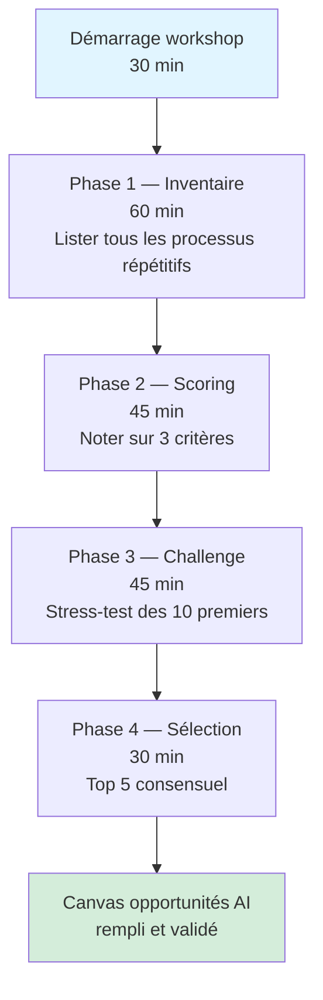

**Phase 1 — Inventaire large.** Chaque participant liste, en silence et sur post-its, tous les processus répétitifs qu'il identifie dans son périmètre, quel que soit leur niveau d'importance apparente. L'objectif est la quantité, pas la qualité. Une équipe de dix personnes produit généralement entre soixante et cent vingt processus candidats. Il est crucial à cette étape de ne filtrer aucune idée, même celle qui semble triviale. Les processus les plus rentables sont souvent ceux auxquels personne ne pense spontanément.

**Phase 2 — Scoring sur trois critères.** Chaque processus est évalué sur trois critères, notés chacun de 1 à 5. Le **volume** mesure la fréquence et la répétitivité : un processus exécuté mille fois par mois a un volume 5, un processus trimestriel a un volume 1. La **douleur** mesure le niveau de frustration, d'erreur ou de retard que ce processus génère aujourd'hui : un processus source constante de rework a une douleur 5, un processus qui tourne bien mais prend du temps a une douleur 2. La **faisabilité IA** mesure la facilité technique de traiter ce processus avec de l'IA : un processus purement textuel avec données bien structurées a une faisabilité 5, un processus qui demande du jugement humain subtil ou des données absentes a une faisabilité 1.

**Phase 3 — Challenge des 10 premiers.** Les dix processus qui obtiennent le meilleur score pondéré sont soumis à un stress-test collectif. Pour chacun, l'équipe répond à cinq questions : qui perdrait du temps à nouveau si on supprimait ce processus ? Combien d'heures par semaine ce processus consomme-t-il réellement ? Quelles données sont nécessaires pour qu'une IA fasse ce travail, et les avons-nous ? Quel est le risque si l'IA se trompe ? Qui sera le sponsor opérationnel du déploiement ?

**Phase 4 — Sélection du top 5.** L'équipe sélectionne par consensus cinq processus parmi les dix challengés. Le consensus est important : un processus qui divise l'équipe est rarement le bon premier projet, même s'il a le meilleur score théorique, parce que son déploiement rencontrera des résistances internes qui compromettront son ROI.

### 2.3 — Le canvas d'opportunités AI

Le canvas ci-dessous est l'artefact principal de votre travail de cartographie. Il se remplit pour chacun des cinq processus sélectionnés et sert de base à toutes les décisions suivantes.

| Champ | Description | Exemple |
|-------|-------------|---------|
| Nom du processus | Description en une phrase | Qualification des leads entrants |
| Volume mensuel | Nombre d'exécutions/mois | ~1200 leads/mois |
| Temps unitaire actuel | Minutes/heure par exécution | 12 min/lead |
| Temps total mensuel | Volume × temps unitaire | 240h/mois |
| Douleur business | Description qualitative | Leads chauds noyés dans le flux |
| Type d'IA pertinent | LLM, classification, RAG, agent | Classification + RAG |
| Données disponibles | Sources existantes | CRM + formulaire web |
| Qualité des données | 1 à 5 | 3 (incomplètes) |
| Risque en cas d'erreur | Faible / Moyen / Fort | Moyen |
| Sponsor opérationnel | Nom et fonction | Marie, Dir. Commerciale |
| ROI estimé an 1 | Euros économisés ou gagnés | 85 k€ |
| Coût estimé an 1 | Investissement total | 30 k€ |
| Ratio ROI/Coût | ROI ÷ Coût | 2,8 |

### 2.4 — Calculer un ROI IA sans être data scientist

Le calcul d'un retour sur investissement IA n'a rien de sorcier. Il repose sur une arithmétique de base, et la difficulté principale n'est pas mathématique : elle est honnête. La plupart des calculs de ROI IA que je vois en comité d'arbitrage sont gonflés, soit par naïveté, soit par volonté de faire passer le projet. Un bon ROI est un ROI prudent. Voici la méthode en cinq lignes.

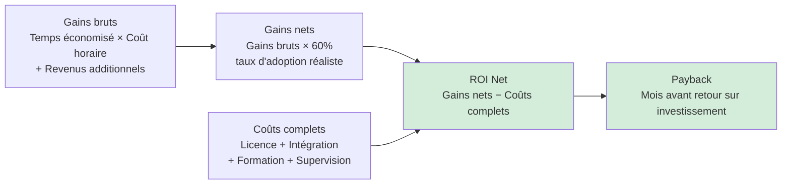

**Gains bruts.** Comptez le temps que vos équipes passent aujourd'hui sur le processus, multiplié par leur coût complet horaire (salaire chargé × 1,5 environ pour intégrer les frais indirects). Ajoutez, si pertinent, les revenus additionnels qui découleraient directement du processus optimisé (par exemple, les ventes additionnelles générées par une meilleure qualification de leads).

**Gains nets.** Appliquez un coefficient d'abattement de quarante pour cent aux gains bruts. Pourquoi ? Parce qu'aucun déploiement IA n'atteint son plein potentiel. Il y a toujours des utilisateurs qui n'adoptent pas l'outil, des cas limites que l'IA traite mal et qui repassent en humain, une supervision qui consomme du temps. Le taux d'adoption réaliste à un an est de soixante pour cent du théorique. Cette prudence vous sauvera la crédibilité au moment du bilan.

**Coûts complets.** Ne comptez pas seulement la licence de l'outil. Ajoutez l'intégration initiale (souvent sous-estimée d'un facteur deux), la formation des équipes (environ deux jours par utilisateur cumulés sur l'année), la supervision humaine permanente (au moins dix pour cent du temps libéré repart en contrôle qualité sur les douze premiers mois), et les coûts d'infrastructure si applicables.

**ROI net et payback.** Le ROI net est simplement la différence entre gains nets et coûts complets. Le payback est le nombre de mois nécessaires avant que les gains nets cumulés dépassent les coûts complets cumulés. Un projet IA sain affiche un payback inférieur à dix-huit mois. Au-delà, la probabilité qu'il soit arrêté en cours pour cause de changement de priorités est trop élevée.

### 2.5 — Distinguer les vraies opportunités des effets de mode

| Signal vrai | Signal mode | Comment distinguer |
|-------------|-------------|--------------------|
| Problème répétitif chronique | « Nos concurrents le font » | La vraie douleur pré-existe à l'apparition de la technologie |
| Les opérationnels en parlent | Seul le COMEX en parle | Descendez sur le terrain interviewer les équipes |
| Données déjà disponibles | « On collectera les données » | Si les données n'existent pas déjà, le projet dérape |
| ROI calculable | ROI « stratégique » non quantifiable | Demandez le calcul en euros, pas en adjectifs |
| Sponsor métier identifié | Pas de sponsor opérationnel clair | Sans sponsor métier, pas d'adoption |
| Cadre de sortie défini | « On verra bien » | Un projet sans kill criteria dure éternellement |

Les projets IA qui échouent ne meurent presque jamais d'un problème technologique. Ils meurent d'un problème organisationnel : pas de sponsor, données inexistantes, ROI fantasmé, absence de critère d'arrêt. Un bon cadrage en amont évite quatre-vingts pour cent des échecs.

### 2.6 — Exercice pratique

Avant la fin de la semaine qui suit ce module, organisez un workshop « 5 processus prioritaires » dans votre organisation. Réunissez six à douze personnes, bloquez trois heures, suivez la méthodologie section 2.2. À la fin, vous aurez cinq canvas remplis. Calculez le ROI de chacun selon la méthode section 2.4. Vous obtiendrez une hiérarchisation qui servira de base au Module 03.

### Points clés du module 02

Partez du problème, jamais de la solution. Animez un workshop collectif d'une demi-journée pour faire remonter les vrais irritants. Scorez sur volume, douleur et faisabilité IA. Calculez un ROI prudent avec quarante pour cent d'abattement. Ne retenez que les processus qui combinent volume, douleur, faisabilité, données disponibles, sponsor opérationnel identifié, et ROI calculé en euros. Cinq processus bien choisis valent mieux que vingt processus dispersés.

### Livrable : Canvas d'opportunités AI

Vous disposez désormais du canvas d'opportunités AI en format Notion, que vous pouvez instancier autant de fois que votre organisation a de processus candidats. Ce canvas, combiné à la méthodologie du workshop et au calcul de ROI en cinq lignes, constitue le socle factuel de toute votre stratégie IA. Il sera l'intrant direct du Module 03 dédié à la construction de votre feuille de route.

---

## Module 03 — Construire sa feuille de route AI

### Objectifs du module

À l'issue de ce module, vous serez capable de produire un AI Roadmap en une page compréhensible par votre COMEX, d'estimer un budget IA annuel sans dépendre de votre DSI, d'anticiper et désamorcer les résistances internes (IT, RH, management intermédiaire), et de défendre votre roadmap en comité avec des réponses préparées aux objections les plus fréquentes.

### 3.1 — Pourquoi la roadmap en une page est la seule qui survit

Dans quatre-vingt-dix pour cent des organisations où j'ai pu observer des stratégies IA en action, il existait un document stratégique IA de trente à quatre-vingts pages, commandé à un cabinet de conseil ou produit en interne, qui servait de référence au démarrage, puis qui était progressivement oublié à partir du troisième mois. Le document était parfait sur le papier, exhaustif, bien structuré, mais personne ne le consultait plus. À sa place, on trouvait sur le bureau du directeur général une version informelle en une page, griffonnée en réunion ou recomposée mentalement, qui elle était consultée quotidiennement.

La leçon est claire. Le format qui guide réellement les décisions est le format qui tient dans le champ de vision immédiat. Votre objectif n'est pas de produire le document le plus complet — c'est de produire le document le plus utilisé. Cela impose une contrainte brutale : une page, pas plus. Cette contrainte n'appauvrit pas le travail stratégique, elle l'oblige à aller à l'essentiel. Tout le travail de cartographie fait au Module 02 alimente cette page, mais la page elle-même ne reproduit pas ce travail, elle le synthétise.

### 3.2 — Les six sections obligatoires de l'AI Roadmap 1-page

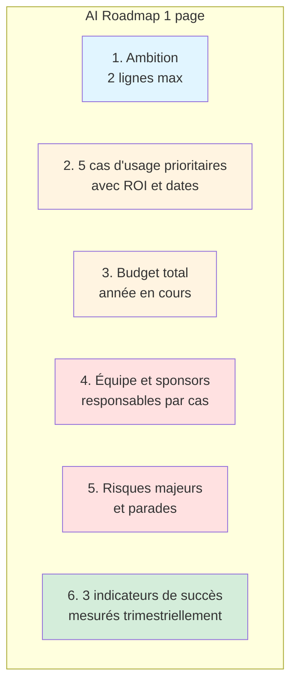

**Section 1 — Ambition stratégique en deux lignes.** Cette section répond à la question : pourquoi investissons-nous dans l'IA maintenant, et que devons-nous gagner en dix-huit mois ? Elle n'est pas une déclaration d'intention générique. Elle cite un chiffre. « Réduire de vingt pour cent le temps de traitement des dossiers clients d'ici décembre 2027, pour redéployer l'équipe sur les dossiers à forte valeur ajoutée. » Ce type de formulation ferme la porte aux débats philosophiques et ouvre celle des arbitrages opérationnels.

**Section 2 — Les cinq cas d'usage prioritaires.** Reprise directe du Module 02. Chaque cas est présenté en une ligne avec son nom, son ROI estimé, son échéance, et son sponsor métier. Cette liste sera contestée en comité. Préparez-vous à justifier chaque choix, et surtout chaque exclusion.

**Section 3 — Budget total de l'année en cours.** Une seule ligne avec le montant total et sa répartition en trois lignes maximum : licences et outils, prestations externes, formation et conduite du changement. Le COMEX ne lit pas un budget en quinze lignes. Il lit un budget en quatre.

**Section 4 — Équipe et sponsors.** Pour chaque cas d'usage prioritaire, un sponsor métier identifié par son prénom et sa fonction, et un responsable opérationnel qui porte la réalisation. Si une case est vide, le projet n'existe pas encore.

**Section 5 — Les trois risques majeurs.** Les risques, pas les problèmes potentiels imaginaires. Trois risques concrets, chacun accompagné de sa parade. Exemples typiques : risque réglementaire (parade : audit AI Act en juin), risque d'adoption (parade : plan de formation et coaching terrain), risque de fournisseur (parade : clause de sortie à douze mois).

**Section 6 — Les trois indicateurs de succès.** Trois, pas plus. Ces trois indicateurs sont ceux que vous présenterez chaque trimestre. Ils sont mesurables, datés, et ont un propriétaire. Exemples : temps moyen de traitement d'un dossier (responsable : directrice des opérations), taux d'adoption quotidien des outils IA (responsable : DRH), économies réalisées en euros (responsable : CFO).

### 3.3 — Exemple intégral d'AI Roadmap 1-page

| Section | Contenu |
|---------|---------|
| **Ambition** | Réduire de 25% le temps de traitement administratif d'ici fin 2027 pour redéployer 8 ETP sur des missions à valeur ajoutée. |
| **Cas #1** | Qualification leads entrants — ROI 85k€ — Livraison T2 2026 — Sponsor : Marie (Commerciale) |
| **Cas #2** | Extraction contrats fournisseurs — ROI 120k€ — Livraison T3 2026 — Sponsor : Paul (Achats) |
| **Cas #3** | Assistant support interne RH — ROI 45k€ — Livraison T3 2026 — Sponsor : Claire (DRH) |
| **Cas #4** | Génération comptes-rendus réunions — ROI 30k€ — Livraison T4 2026 — Sponsor : Luc (COO) |
| **Cas #5** | Veille concurrentielle automatisée — ROI 25k€ — Livraison T1 2027 — Sponsor : Sophie (Digital) |
| **Budget 2026** | 280k€ total : 110k€ outils / 120k€ prestataires / 50k€ formation |
| **Équipe** | Sophie (pilote) + 1 chef de projet interne + 2 prestataires externes |
| **Risque 1** | Adoption terrain — Parade : plan formation 4 jours/équipe + coachs internes |
| **Risque 2** | Qualité des données CRM — Parade : audit et nettoyage préalable T1 2026 |
| **Risque 3** | Conformité AI Act — Parade : DPIA et classification risque avant déploiement |
| **KPI 1** | Temps moyen traitement administratif : -25% d'ici fin 2027 (mesure trimestrielle) |
| **KPI 2** | Taux d'adoption quotidien des outils : >70% à 6 mois par cas d'usage |
| **KPI 3** | Économies nettes cumulées : >200k€ d'ici fin 2026 |

### 3.4 — Estimer un budget IA sans dépendre de son DSI

Une ETI de cinq cents à deux mille personnes qui démarre sérieusement son programme IA devrait prévoir, en rythme de croisière à partir de la deuxième année, un budget annuel compris entre zéro virgule cinq et un virgule cinq pour cent de son chiffre d'affaires consolidé. Ce ratio vous donne un ordre de grandeur immédiatement utilisable, sans avoir besoin d'attendre un chiffrage détaillé de votre DSI. Pour une entreprise à cent millions d'euros de chiffre d'affaires, cela représente un budget IA entre cinq cent mille et un million cinq cent mille euros par an.

La répartition typique de ce budget obéit à une règle de pouce simple, souvent appelée la règle trente-quarante-trente. Trente pour cent part en outils et licences : plateformes IA, outils SaaS intégrés, abonnements aux modèles de fondation. Quarante pour cent part en prestations externes et intégration : cabinets de conseil, intégrateurs, freelances spécialisés. Trente pour cent part en formation, accompagnement au changement, communication interne. Cette répartition surprend les dirigeantes qui s'attendaient à une part plus importante sur les outils. La réalité du terrain montre que la bataille se gagne sur l'adoption, pas sur la technologie.

| Taille entreprise (CA) | Budget IA annuel année 2 | Outils | Prestations | Formation |
|------------------------|--------------------------|--------|-------------|-----------|
| 10 à 50 M€ | 80k€ à 500k€ | 24-150k€ | 32-200k€ | 24-150k€ |
| 50 à 200 M€ | 400k€ à 2M€ | 120k-600k€ | 160k-800k€ | 120k-600k€ |
| 200 M€ à 1 Mrd€ | 1,5M€ à 10M€ | 450k-3M€ | 600k-4M€ | 450k-3M€ |
| Plus de 1 Mrd€ | 5M€ à 50M€+ | 1,5-15M€ | 2-20M€ | 1,5-15M€ |

### 3.5 — Gérer les résistances internes

Aucune roadmap IA ne traverse indemne les deux premiers trimestres de déploiement sans rencontrer trois catégories de résistances internes. Les anticiper et préparer leurs parades fait partie intégrante du travail stratégique. Ignorer cette dimension condamne votre roadmap, même si elle est techniquement excellente.

**Résistance IT / DSI.** Le DSI craint légitimement la perte de contrôle sur le système d'information, la multiplication des outils SaaS non gouvernés (« shadow AI »), les risques de sécurité et de conformité RGPD, et parfois la perception que le programme IA est un contournement de son autorité. La parade consiste à intégrer le DSI dès la conception de la roadmap comme co-propriétaire, à définir avec lui une politique d'outils autorisés et interdits, à lui confier formellement la gouvernance technique, et à lui donner une section dédiée dans le comité de pilotage mensuel. Le DSI allié est votre meilleur atout. Le DSI opposant peut tout bloquer.

**Résistance RH et managériale.** Les salariés craignent pour leurs emplois, parfois ouvertement, plus souvent en silence. Les managers intermédiaires craignent de voir leur rôle redéfini, leurs équipes réduites, leur légitimité érodée. La parade passe par une communication honnête dès le départ : l'IA supprime des tâches, pas des postes, et les gains de productivité seront réinvestis dans de nouvelles missions. Cette promesse n'a de valeur que si elle est tenue. Un seul licenciement communiqué comme « conséquence de l'IA » peut détruire deux ans de confiance. Engagez-vous formellement, par écrit, sur le principe de redéploiement plutôt que de réduction d'effectifs, au moins sur les dix-huit premiers mois.

**Résistance COMEX.** Paradoxalement, la résistance la plus dangereuse vient souvent du comité exécutif lui-même. Les autres directeurs perçoivent le programme IA comme une zone d'ombre dans leur périmètre, une source d'opacité dans leur budget, un risque réputationnel qu'ils ne contrôlent pas. La parade est la transparence radicale : un tableau de bord mensuel accessible à tous les membres du COMEX, des revues trimestrielles avec chiffres durs, et une politique « zéro surprise » dans laquelle toute dérive de plus de dix pour cent est communiquée immédiatement.

### 3.6 — Les objections COMEX les plus fréquentes et leurs réponses

| Objection | Réponse préparée |
|-----------|------------------|
| « C'est trop cher » | Le budget représente 1% du CA, contre 3 à 5% pour nos concurrents leaders. L'absence d'investissement est plus coûteuse. |
| « On n'a pas les compétences en interne » | La roadmap prévoit formation et prestataires externes. Le but n'est pas de recruter 20 data scientists mais de monter en compétence sur 5 cas prioritaires. |
| « C'est trop tôt, attendons que ça mûrisse » | Les retours sur investissement mesurés chez les early adopters comparables sont de 15-30% en 18 mois. Attendre = perdre cet écart. |
| « Comment garantit-on qu'on ne se trompe pas ? » | Chaque cas a un critère d'arrêt et un budget plafonné. On arrête ce qui ne marche pas, on double sur ce qui marche. |
| « Et la conformité ? » | Le Module 5 gouvernance prévoit DPIA, classification AI Act, politique interne. Nous sommes plus en avance que la réglementation. |

### 3.7 — Exercice pratique

Prenez votre canvas d'opportunités AI produit au Module 02. Synthétisez-le en une page selon la grille des six sections obligatoires. Testez le résultat sur un ou deux pairs du COMEX en réunion informelle. Observez leurs questions. Itérez. Quand la page répond aux objections sans que vous ayez besoin de parler, elle est prête pour le COMEX officiel.

### Points clés du module 03

Une page qui sert vaut mieux qu'un dossier qui pèse. Les six sections obligatoires : ambition, cinq cas prioritaires, budget, équipe, risques, indicateurs. Un budget IA cible entre zéro virgule cinq et un virgule cinq pour cent du chiffre d'affaires. Répartition trente-quarante-trente entre outils, prestations, formation. Anticiper et désamorcer trois catégories de résistances : IT, RH, COMEX. Préparer par écrit les réponses aux cinq objections les plus fréquentes.

### Livrable : Template AI Roadmap 1-page

Vous disposez désormais d'un template d'AI Roadmap 1-page, prêt à être rempli avec les conclusions de votre workshop du Module 02. Ce template, combiné à la grille d'objections COMEX, vous place dans une position de force lors de votre prochain comité. Votre roadmap n'est plus un document, c'est un instrument de pilotage.

---

## Module 04 — Mesurer et piloter le ROI AI

### Objectifs du module

À l'issue de ce module, vous serez capable de définir les huit métriques que tout conseil d'administration devrait voir chaque mois sur son programme IA, de construire vous-même un rapport ROI IA mensuel en moins de deux heures sans développeur, d'interpréter un tableau de bord IA pour en tirer les décisions d'arbitrage correctes, et de distinguer les signaux de vraie création de valeur des illusions statistiques ou des effets d'annonce.

### 4.1 — Pourquoi la mesure tue ou fait vivre votre stratégie IA

Les programmes IA meurent par l'absence de mesure autant que par l'absence de résultats. C'est un phénomène contre-intuitif. Beaucoup de dirigeantes pensent qu'il suffit de faire fonctionner les projets pour que leur valeur soit évidente. La réalité est inverse : même un projet IA qui crée objectivement de la valeur va être perçu comme un échec par le COMEX si personne n'en mesure les résultats. À l'opposé, un programme médiocre mais bien mesuré, qui affiche ses succès modestes en continu, obtient les budgets pour devenir excellent.

La mesure sert trois fonctions simultanées. Elle sert d'abord à piloter : elle vous dit quoi continuer, quoi arrêter, quoi doubler. Elle sert ensuite à communiquer : elle transforme une intuition en preuve, et une preuve en légitimité budgétaire. Elle sert enfin à apprendre : sans mesure, les mêmes erreurs se répètent, les mêmes succès ne se répliquent pas. Un programme IA sans mesure dure six à douze mois avant d'être progressivement défunded. Un programme IA avec mesure rigoureuse s'auto-renforce année après année.

### 4.2 — Les huit métriques du board

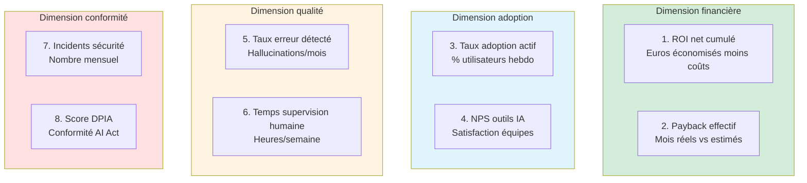

Ces huit métriques forment un ensemble minimal et suffisant. Moins de huit métriques masque une dimension critique. Plus de huit métriques noie le board dans des détails opérationnels qui ne relèvent pas de son niveau. Chaque métrique est reportée mensuellement, accompagnée de sa valeur du mois précédent, de sa cible annuelle, et d'un feu tricolore (vert, orange, rouge) interprétable instantanément.

**ROI net cumulé.** Euros économisés ou gagnés depuis le début du programme, moins coûts complets cumulés. Cet indicateur passe du rouge au vert à un moment précis du cycle, appelé le breakeven. Avant breakeven, votre rôle est de rassurer sur la trajectoire. Après, votre rôle est de protéger contre la complaisance.

**Payback effectif.** Nombre de mois effectifs entre le démarrage d'un cas d'usage et le moment où ses gains cumulés dépassent ses coûts cumulés. Comparaison systématique avec l'estimation initiale. Un écart de moins de vingt pour cent reste dans la normale, plus de cinquante pour cent signale un problème de pilotage.

**Taux d'adoption actif.** Pourcentage d'utilisateurs cibles qui utilisent l'outil IA au moins une fois par semaine. Le seuil critique est soixante pour cent. En-dessous, les gains promis ne se matérialiseront jamais. Au-dessus, le projet est sur la trajectoire saine.

**NPS outils IA.** Score de recommandation nette des outils IA par leurs utilisateurs. Un NPS négatif ou proche de zéro est un signal d'alarme même si les autres métriques sont au vert : l'adoption va se dégrader dans les mois qui viennent.

**Taux d'erreur détecté.** Nombre d'hallucinations ou d'erreurs graves identifiées par mois et rapporté au volume total traité. Une erreur grave est une erreur qui aurait eu des conséquences business, juridiques ou réputationnelles si elle n'avait pas été interceptée par un humain.

**Temps supervision humaine.** Heures hebdomadaires cumulées passées à superviser, corriger, valider la sortie des systèmes IA. Cette métrique doit décroître au fil du temps sans tomber à zéro. Une décroissance trop rapide signale un relâchement du contrôle qualité, une décroissance nulle signale que le système ne s'améliore pas.

**Incidents de sécurité.** Nombre mensuel d'incidents : fuite de données, accès non autorisé, utilisation non conforme. Zéro incident est la seule cible acceptable. Un incident déclenche automatiquement une revue de gouvernance.

**Score DPIA et conformité AI Act.** Pourcentage de cas d'usage actuellement en production qui disposent d'une DPIA à jour et d'une classification de risque AI Act documentée. Cent pour cent est la cible. Tout cas d'usage non conforme doit être documenté ou mis en pause.

### 4.3 — Construire votre rapport ROI mensuel en deux heures

La plupart des dirigeantes pensent qu'un rapport ROI IA demande un data scientist, un développeur et trois semaines de travail. C'est faux. Le rapport ROI mensuel se construit en deux heures avec un tableur standard, à condition que les données de base soient collectées en continu par les sponsors opérationnels. Voici la méthode en cinq étapes.

**Étape 1 (trente minutes).** Collectez les chiffres d'adoption auprès des sponsors de chaque cas d'usage. Envoyez un template standardisé la dernière semaine du mois, avec cinq champs à remplir : nombre d'utilisateurs actifs hebdomadaires, volume de traitements IA, temps humain économisé (estimation), nombre d'erreurs détectées, incidents éventuels. La standardisation est la clé : un template qui change chaque mois n'est jamais rempli.

**Étape 2 (vingt minutes).** Mettez à jour le tableau financier consolidé. Additionnez les gains mensuels (temps économisé × coût horaire complet), soustrayez les coûts mensuels (licences, prestations, infrastructure), et reportez le ROI net mensuel et cumulé dans le tableau principal. Cette étape est mécanique si les données de l'étape 1 ont été bien collectées.

**Étape 3 (trente minutes).** Analysez les anomalies. Pour chaque métrique qui s'écarte de plus de vingt pour cent de sa trajectoire attendue, notez une ligne d'explication. L'analyse est plus importante que les chiffres eux-mêmes : un board ne veut pas lire des tableaux, il veut lire des interprétations.

**Étape 4 (vingt minutes).** Rédigez la synthèse en trois paragraphes maximum : ce qui marche, ce qui ne marche pas, ce qui se passe le mois prochain. Trois paragraphes, pas plus. La discipline de la concision force à hiérarchiser, et la hiérarchisation est l'essence du pilotage.

**Étape 5 (vingt minutes).** Formalisez le rendu visuel. Un seul document d'une ou deux pages, avec le tableau des huit métriques, trois paragraphes de synthèse, et éventuellement un graphique de tendance ROI. Pas de slides fleuries. Pas de charts inutiles. Un rapport qui tient en deux pages et qui est lu vaut mille fois mieux qu'un deck de quarante slides que personne ne consulte.

### 4.4 — Le tableau de bord simplifié en lecture seule

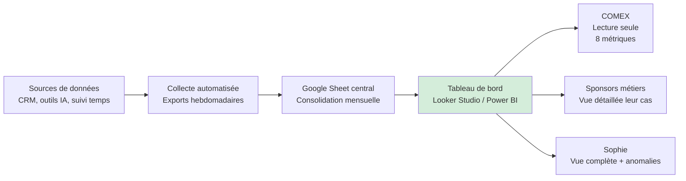

Le tableau de bord IA simplifié n'est pas un projet technique complexe. Il se construit en deux à trois jours avec un outil de visualisation standard connecté à un tableur central. Le principe directeur est la lecture seule pour le COMEX : personne ne modifie les chiffres, personne ne conteste la méthodologie, les chiffres sont ce qu'ils sont. Cette séparation entre producteur de la donnée (vous et vos sponsors) et consommateur de la donnée (le COMEX) est essentielle à la crédibilité du pilotage.

### 4.5 — Les pièges courants de la mesure IA

| Piège | Mécanisme | Parade |
|-------|-----------|--------|
| Vanity metrics | Mesurer ce qui est facile plutôt que ce qui compte | Lister les métriques avant de les mesurer, pas après |
| Gains autoproclamés | Les sponsors surestiment le temps économisé | Tripler les gains par des spot-checks sur des semaines types |
| Silos de données | Chaque outil IA a son propre tableau de bord | Centraliser dans un unique tableau mensuel |
| Biais du survivant | On mesure les projets qui marchent, pas ceux qui ont été arrêtés | Publier aussi les arrêts avec raison et leçon tirée |
| Ajustement rétroactif | Redéfinir la cible à la baisse quand on la rate | Archiver les cibles initiales, impossible à modifier après coup |
| Surmesure | 30 métriques impossibles à interpréter | 8 métriques, pas plus |

### 4.6 — La frustration pédagogique : « je veux le même mais avec mes données »

Au cours de ce module, vous avez vu comment un tableau de bord IA bien conçu centralise les huit métriques du board, comment un rapport mensuel de deux pages se construit en deux heures, et comment l'ensemble se combine en un instrument de pilotage qui transforme votre crédibilité au COMEX. Vous avez aussi probablement ressenti une frustration : celle de voir ce que ça pourrait donner chez vous sans pouvoir encore y accéder en lecture et écriture avec vos propres données. Cette frustration est saine. Elle marque le moment où vous devenez opérationnellement prête à passer à l'étape suivante : soit apprendre à construire vous-même ces outils avec l'offre « Core » de CAIO Academy, soit savoir briefer parfaitement un prestataire pour qu'il le fasse pour vous. Cette formation Strategy sans code vous donne la vision et le cadrage. La suite, vous la choisissez.

### 4.7 — Exercice pratique

Listez les huit métriques de votre programme IA actuel. Si une métrique n'a pas de valeur aujourd'hui, mettez « non mesurée ». Si elle a une valeur, mettez la valeur et la source. Envoyez le tableau résultant à votre directeur général. Son retour — soit « intéressant, parlons-en », soit « nous n'avons pas ces chiffres » — vous dit immédiatement où en est votre organisation.

### Points clés du module 04

Un programme IA sans mesure ne survit pas. Huit métriques suffisent, quatre dimensions les couvrent. Le rapport mensuel se rédige en deux heures avec un tableur et de la discipline. Le tableau de bord est en lecture seule pour le COMEX. Les pièges classiques — vanity metrics, gains autoproclamés, silos, biais du survivant — sont tous évitables par simple rigueur méthodologique.

### Livrable : Template rapport ROI AI mensuel

Vous disposez désormais d'un template de rapport ROI AI mensuel, structuré autour des huit métriques du board, prêt à être alimenté par vos sponsors opérationnels dès le prochain cycle mensuel. Ce template transforme ce qui pourrait être une corvée de trois semaines en un rituel de deux heures. Il ancre la mesure dans votre routine de pilotage et verrouille votre crédibilité face au comité.

---

## Module 05 — AI Governance : protéger et structurer

### Objectifs du module

À l'issue de ce module, vous comprendrez ce que dit réellement l'AI Act européen vulgarisé pour une dirigeante non-juriste, vous saurez rédiger ou piloter la rédaction d'une politique d'usage de l'IA en entreprise adaptée à votre taille et à votre secteur, vous maîtriserez le protocole de gestion d'un incident IA (fuite de données, biais, hallucination publique), et vous disposerez d'un template de politique AI interne utilisable dès la semaine suivant cette formation.

### 5.1 — L'AI Act européen en huit minutes

L'AI Act, adopté par l'Union européenne en 2024 et entré progressivement en vigueur entre 2025 et 2027, est le premier cadre juridique mondial qui encadre l'intelligence artificielle de manière transversale. Son principe directeur est simple à comprendre mais structurant pour votre organisation : plus une application IA présente un risque élevé pour les droits fondamentaux, la sécurité ou la santé des personnes, plus elle est soumise à des obligations strictes. Cette classification par niveau de risque est le cœur du texte.

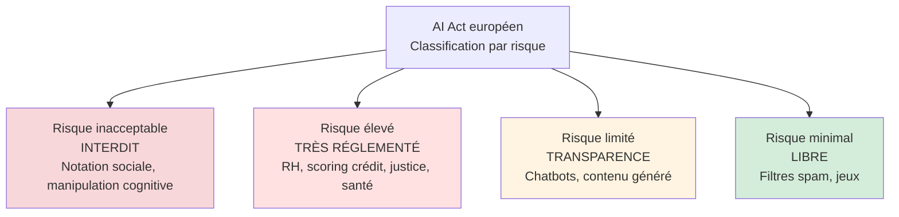

**Risque inacceptable.** Sont purement et simplement interdites en Europe les applications d'IA qui manipulent cognitivement les personnes, qui notent socialement les individus comme dans certains systèmes étrangers, qui procèdent à de la reconnaissance biométrique de masse dans l'espace public sans cadre judiciaire, ou qui exploitent la vulnérabilité de publics spécifiques comme les enfants. Votre organisation est probablement à cent pour cent en dehors de cette catégorie, mais il est utile de connaître son existence pour pouvoir répondre en comité si la question est posée.

**Risque élevé.** Sont soumis à obligations strictes — documentation technique exhaustive, supervision humaine formalisée, déclaration à l'autorité compétente, gestion de la qualité des données d'entraînement, monitoring en production — les systèmes IA utilisés dans huit domaines sensibles : ressources humaines (recrutement, évaluation, promotion), accès au crédit et à l'assurance, justice et forces de l'ordre, éducation, infrastructure critique, santé, migration, et processus démocratiques. Si votre entreprise déploie un outil IA dans l'un de ces domaines, même à titre expérimental, vous tombez dans cette catégorie et vos obligations sont significatives. Le coût de conformité par système à risque élevé se situe typiquement entre cinquante mille et deux cent mille euros la première année.

**Risque limité.** La majorité des cas d'usage IA en entreprise — chatbots clients, assistants internes, génération de contenu, résumé de documents, extraction automatique de champs — relèvent de cette catégorie. Les obligations sont essentiellement des obligations de transparence : informer clairement l'utilisateur qu'il interagit avec une IA, étiqueter le contenu généré par IA, permettre à l'utilisateur de signaler une erreur. Ces obligations sont faibles en coût mais non négociables.

**Risque minimal.** Filtres anti-spam, systèmes de recommandation de produits basiques, IA dans les jeux vidéo. Pas d'obligation spécifique au-delà du droit commun. La plupart de vos cas d'usage en année un et deux relèveront des catégories 3 et 4, pas 2 ou 1.

### 5.2 — Que signifient concrètement ces obligations pour votre organisation

| Obligation AI Act | Traduction opérationnelle | Effort estimé |
|-------------------|---------------------------|---------------|
| Classification de risque | Inventaire IA interne avec niveau attribué à chaque cas | 2-3 jours/an |
| DPIA pour risque élevé | Analyse d'impact Privacy + droits fondamentaux | 1-2 semaines/cas |
| Documentation technique | Fiche système : données, modèle, supervision, limites | 1 semaine/cas |
| Supervision humaine | Protocole écrit : qui valide quoi, quand, comment | 2 jours/cas |
| Transparence utilisateur | Mention explicite « IA », étiquetage contenu | Très faible |
| Monitoring continu | Tableau de bord qualité, alertes, revues trimestrielles | Intégré au tableau de bord ROI |
| Formation personnel | Formation obligatoire usagers IA (AI literacy) | 2h/utilisateur/an |
| Déclaration autorité | Enregistrement dans registre UE pour risque élevé | 1-2 jours administratifs |

### 5.3 — Rédiger une politique d'usage de l'IA en entreprise

La politique d'usage de l'IA est le document interne qui encadre qui peut utiliser l'IA dans votre organisation, pour quoi, avec quelles données, sous quelles conditions. Sans ce document, trois risques se matérialisent : des salariés qui saisissent des données confidentielles dans des outils externes non sécurisés, des outils IA qui prolifèrent sans coordination, et des décisions opérationnelles prises sur la base de sorties IA non validées qui exposent l'organisation à des erreurs.

Une bonne politique AI tient entre dix et vingt pages. Elle se compose de huit sections qui couvrent l'essentiel sans jamais tomber dans le juridisme inutile.

**Section 1 — Préambule et champ d'application.** Deux pages maximum. Expose pourquoi cette politique existe, à qui elle s'applique, à quels types d'outils IA elle se rapporte, sa date d'entrée en vigueur, sa date de révision prévue. Cette section banalise le document : elle en fait une politique normale, pas un manifeste.

**Section 2 — Principes fondamentaux.** Une page. Cinq à sept principes directeurs qui guident toute décision IA dans l'organisation. Exemples : supervision humaine systématique sur décisions à impact, respect de la vie privée par défaut, transparence envers les utilisateurs internes et externes, priorité à la qualité des données, réversibilité des décisions automatisées, équité et absence de biais discriminatoire.

**Section 3 — Gouvernance et rôles.** Deux pages. Décrit qui décide quoi : qui valide un nouveau cas d'usage, qui approuve un nouveau fournisseur, qui pilote les incidents, qui a autorité sur la politique elle-même. Le rôle de CAIO ou de référent IA y est formalisé, avec les limites explicites de son périmètre.

**Section 4 — Outils autorisés et interdits.** Une page actualisée en continu. Liste nominative des outils IA que les salariés peuvent utiliser et de ceux qu'ils ne peuvent pas. Cette liste est révisée tous les trimestres. Sans elle, le « shadow AI » s'installe et devient impossible à contenir.

**Section 5 — Classification des données et usages.** Deux pages. Définit quelles données peuvent passer dans quels outils. Exemple typique : données publiques partout, données internes dans outils agréés uniquement, données clients identifiantes dans outils hébergés UE seulement, données stratégiques jamais dans aucun outil externe.

**Section 6 — Obligations des utilisateurs.** Deux pages. Liste claire, sans jargon, de ce que chaque salarié doit faire et ne pas faire : signaler une erreur IA détectée, ne pas saisir de données sensibles, vérifier les sorties avant décision, suivre la formation obligatoire annuelle, signer un engagement annuel au respect de la politique.

**Section 7 — Gestion des incidents.** Deux pages. Protocole en cas d'incident IA : qui est prévenu, dans quel délai, avec quels circuits de remontée. Cette section doit être opérationnelle — un numéro ou une adresse email dédiée, un template d'alerte, un délai de réponse garanti.

**Section 8 — Sanctions et révisions.** Une page. Précise les conséquences d'un non-respect de la politique, depuis le rappel à l'ordre jusqu'à la sanction disciplinaire selon la gravité. Fixe la fréquence de révision de la politique elle-même (annuelle minimum).

### 5.4 — Protocole de gestion d'un incident IA

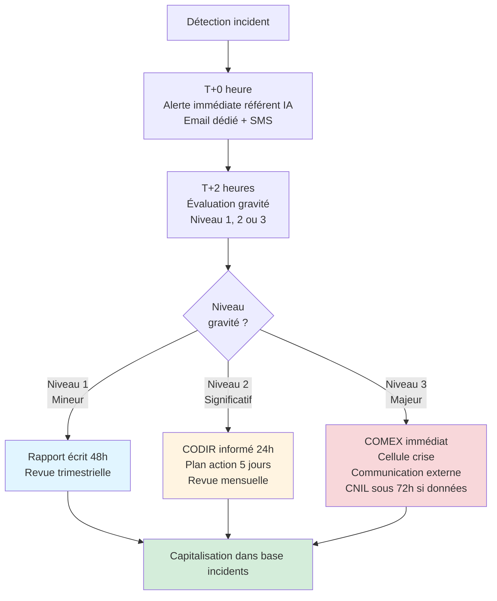

Un incident IA est une situation où un système IA a produit, ou aurait pu produire, une conséquence non souhaitée pour l'organisation, ses clients ou ses salariés. Trois niveaux de gravité sont à distinguer en amont pour ne pas improviser sous pression au moment où l'incident survient.

**Niveau 1 — Incident mineur.** Une erreur IA détectée avant qu'elle n'ait produit de conséquence réelle, ou dont l'impact est circonscrit à un usage interne non critique. Traitement : signalement par le découvreur, rapport écrit sous quarante-huit heures par le sponsor opérationnel, revue trimestrielle par le comité de pilotage.

**Niveau 2 — Incident significatif.** Une erreur IA ayant produit une conséquence interne notable, ou une sortie incorrecte ayant atteint un client sans préjudice grave. Exemples : email automatique envoyé au mauvais destinataire, proposition commerciale erronée corrigée avant acceptation, erreur de classification documentaire affectant une décision de niveau manager. Traitement : information du CODIR sous vingt-quatre heures, plan d'action sous cinq jours ouvrables, revue mensuelle jusqu'à clôture.

**Niveau 3 — Incident majeur.** Fuite de données personnelles ou stratégiques, décision IA ayant causé un préjudice à un client ou un salarié, sortie IA publique embarrassante, biais discriminatoire identifié, non-conformité réglementaire avérée. Traitement : convocation immédiate du COMEX, activation d'une cellule de crise, communication externe préparée sous douze heures, notification à la CNIL sous soixante-douze heures si données personnelles concernées, revue hebdomadaire jusqu'à clôture définitive.

### 5.5 — Trois cas concrets d'incidents et leur gestion

Un chatbot client d'un assureur français a recommandé à un utilisateur en situation de détresse d'appeler un numéro d'urgence erroné. L'erreur a été détectée par l'utilisateur lui-même qui a posté une capture sur les réseaux sociaux. Gestion : niveau 3, retrait immédiat du chatbot, communication de crise sous quatre heures, audit complet du système, redéploiement deux semaines plus tard avec supervision humaine renforcée sur les conversations à risque émotionnel identifiées.

Un outil IA de tri CV dans une ETI industrielle a présenté pendant six mois un biais contre les candidates femmes, découvert par analyse statistique trimestrielle. Gestion : niveau 3, arrêt immédiat du tri automatique, reprise manuelle du stock de six mois de candidatures, audit externe du modèle, information du CSE, politique RH révisée pour imposer supervision humaine systématique sur toutes les décisions de préqualification.

Un assistant IA interne d'une entreprise de services a divulgué des informations internes sensibles à un stagiaire qui lui avait posé une question ouverte. Gestion : niveau 2, restriction immédiate des droits d'accès, cloisonnement renforcé des données sensibles dans l'outil, formation obligatoire sur les limites de l'assistant pour tous les nouveaux arrivants, politique RAG revue pour filtrer les informations confidentielles à la source.

### 5.6 — Exercice pratique

Téléchargez le template de politique AI interne de la section livrable. Adaptez-le en deux heures à la taille et au secteur de votre organisation. Faites-le relire par votre DPO et votre DSI. Soumettez-le à validation du COMEX dans les quinze jours qui suivent cette formation. L'objectif n'est pas la perfection juridique : c'est d'avoir un document en vigueur, même imparfait, plutôt qu'aucun document.

### Points clés du module 05

L'AI Act classe par risque : inacceptable, élevé, limité, minimal. La majorité de vos cas d'usage relève de la catégorie « limité » avec des obligations légères de transparence. Une politique AI interne en huit sections suffit à couvrir quatre-vingts pour cent des besoins de gouvernance. Trois niveaux de gravité d'incident imposent trois protocoles distincts. Un incident non préparé devient une crise ; un incident préparé devient un apprentissage.

### Livrable : Template Politique AI Interne

Vous disposez désormais d'un template de politique AI interne en huit sections, adaptable à votre organisation en deux à quatre heures. Accompagné du protocole de gestion d'incidents en trois niveaux et de la matrice de classification AI Act, ce livrable constitue votre socle de gouvernance. Il protège votre organisation sur les plans juridique, réputationnel et opérationnel.

---

## Module 06 — Choisir et manager ses partenaires AI

### Objectifs du module

À l'issue de ce module, vous saurez rédiger un brief prestataire IA qui filtre dès le départ soixante-dix pour cent des propositions inadaptées, vous identifierez instantanément les red flags dans une proposition commerciale IA, vous maîtriserez les principes de construction d'un réseau de partenaires AI de confiance sur lequel s'appuyer durablement, et vous disposerez d'une grille d'évaluation de proposition AI prête à l'emploi.

### 6.1 — Le brief prestataire parfait

Un brief prestataire IA est un document de trois à cinq pages, envoyé aux prestataires candidats avant même la première réunion commerciale. Son rôle n'est pas de décrire la solution attendue — elle n'existe pas encore, c'est justement ce que vous demandez au prestataire de concevoir. Son rôle est de décrire le problème à résoudre, le contexte, les contraintes, et les critères selon lesquels les propositions seront évaluées. Un bon brief fait économiser des semaines de réunions inutiles en écartant dès la première lecture les prestataires qui ne correspondent pas à votre cadre.

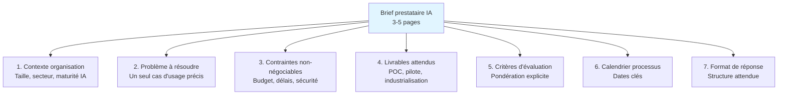

**Section 1 — Contexte de l'organisation.** Une page. Taille de l'entreprise, secteur, niveau de maturité IA actuel, stack technologique existant, historique des précédents projets IA (réussis ou échoués), culture interne vis-à-vis de l'innovation. Un prestataire qui lit cette page sait immédiatement si son ADN correspond ou non.

**Section 2 — Le problème à résoudre.** Une page. Un seul cas d'usage précis, décrit par le problème et non par la solution. Pas de « nous voulons un chatbot » mais « nous voulons réduire le temps de réponse de notre support client de niveau 1, actuellement à douze heures en moyenne, à moins de deux heures, sur un volume de trois mille tickets par mois ». Cette formulation ouvre la porte à plusieurs solutions possibles, ce qui vous permet d'évaluer la créativité et la pertinence des prestataires.

**Section 3 — Contraintes non-négociables.** Une demi-page. Budget plafond, délais maximum, exigences de sécurité (ISO 27001, hébergement UE, conformité AI Act), exigences de transparence (accès au code, documentation), exigences contractuelles (réversibilité, propriété des données et des modèles). Un prestataire qui ne peut pas respecter ces contraintes se disqualifie lui-même — exactement ce que vous voulez.

**Section 4 — Livrables attendus.** Une page. Structure en trois phases : une phase POC (preuve de concept) courte et peu coûteuse, une phase pilote sur un périmètre limité avec critères d'arrêt explicites, une phase industrialisation conditionnée au succès des deux précédentes. Cette structure en trois temps est votre meilleure protection contre les projets qui s'enlisent.

**Section 5 — Critères d'évaluation avec pondération explicite.** Une demi-page. Vous publiez à l'avance comment vous allez noter les propositions. Exemple : compréhension du problème vingt pour cent, qualité de la solution proposée vingt-cinq pour cent, maturité de l'équipe projet vingt pour cent, références comparables quinze pour cent, coûts et transparence tarifaire vingt pour cent. La publication de cette pondération force les prestataires à ajuster leur proposition à vos priorités réelles.

**Section 6 — Calendrier du processus.** Quatre lignes. Date limite de remise des propositions, dates des réunions de soutenance, date de sélection, date de démarrage souhaité. Un calendrier publié et respecté filtre les prestataires qui ne savent pas tenir un engagement.

**Section 7 — Format de réponse attendu.** Une demi-page. Nombre de pages maximum, sections obligatoires, CV des personnes qui interviendront réellement (pas des gens du commercial), trois références clients comparables joignables. La standardisation du format vous permet de comparer à armes égales.

### 6.2 — Les red flags à détecter dans une proposition

| Red flag | Ce que ça révèle | Décision |
|----------|------------------|----------|
| Proposition de 60+ pages sans contenu dense | Inflation pour impressionner, rien de concret | Écarter ou demander version 10 pages |
| Équipe projet nommée ≠ équipe qui intervient réellement | Le prestataire vend Monsieur/Madame Experts et livre des juniors | Exiger dans le contrat l'affectation nominative |
| « Notre IA propriétaire » sans précision technique | Wrapper autour d'un modèle public revendu cher | Demander le modèle de fondation précis |
| Absence de clause de réversibilité | Enfermement du client à 3 ans | Refuser de signer sans clause stricte |
| ROI garanti par écrit | Malhonnêteté ou inconscience | Exiger formule de calcul, conditions, pénalités |
| Trois références non joignables | Références fabriquées ou clients mécontents | Pas de preuve, pas de contrat |
| Prix sans grille unitaire | Facturation opaque, dérives assurées | Grille coûts par profil + par jour |
| Pas de DPIA dans la proposition pour cas RH, crédit, santé | Méconnaissance réglementaire ou négligence | Disqualification immédiate |
| Promesse de délais < 8 semaines pour l'industrialisation | Irréalisme ou mensonge | Fortement pénaliser ou disqualifier |
| Propriété intellectuelle ambiguë sur les modèles | Le prestataire s'approprie votre avantage | Exiger propriété pleine côté client |

Chacun de ces red flags pris isolément pourrait être une maladresse plutôt qu'un vrai signal. Mais la réalité du terrain montre qu'une proposition présentant trois ou plus de ces red flags a plus de soixante-quinze pour cent de probabilité de déboucher sur un projet difficile. Mieux vaut écarter à l'examen qu'à mi-parcours.

### 6.3 — La grille d'évaluation de proposition AI

| Critère | Poids | Description évaluation |
|---------|-------|------------------------|
| Compréhension du problème | 20% | Le prestataire a-t-il reformulé avec pertinence, posé les bonnes questions, identifié les vrais enjeux métier ? |
| Qualité de la solution | 25% | L'architecture proposée est-elle cohérente, réaliste, adaptée à notre maturité ? |
| Équipe et profils engagés | 20% | Qui intervient concrètement, avec quels CV, quel temps dédié, quelle expérience sectorielle ? |
| Références comparables | 15% | Trois cas clients similaires (taille, secteur, cas d'usage) joignables et vérifiables ? |
| Transparence tarifaire | 10% | Grille détaillée par profil, par phase, par option, sans coûts cachés ? |
| Conditions contractuelles | 10% | Réversibilité, propriété données et modèles, SLA, pénalités, sortie ? |

La grille de notation fonctionne avec une note de zéro à cinq par critère, pondérée selon les coefficients ci-dessus. Un score final inférieur à 3,2/5 est éliminatoire. Un score entre 3,2 et 4 impose une négociation structurée pour combler les points faibles. Un score supérieur à 4 ouvre la voie à la finalisation. En cas d'ex-aequo, le critère « équipe et profils engagés » est le critère dirimant : la qualité humaine est le meilleur prédicteur du succès, mieux encore que la qualité technique de la proposition.

### 6.4 — Construire son réseau de partenaires AI de confiance

Un partenaire AI de confiance ne se trouve pas, il se construit. Il émerge au terme d'une ou deux collaborations réussies sur des projets à enjeu, où les deux parties ont appris à se faire confiance, à se challenger, à s'améliorer mutuellement. La bonne stratégie n'est pas de multiplier les prestataires ponctuels, mais de construire à trois ou cinq ans un cercle restreint de quatre à six partenaires complémentaires que vous connaissez intimement et qui vous connaissent intimement.

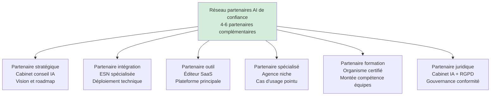

Chaque catégorie de partenaire joue un rôle distinct et non substituable. Le partenaire stratégique vous aide à prendre les décisions structurantes — roadmap, priorisation, arbitrages. Il ne met pas les mains dans le code. Il vous challenge au niveau du COMEX. Le partenaire d'intégration déploie concrètement les solutions, orchestre les équipes techniques, tient les délais. Il est sélectionné sur sa capacité d'exécution, pas sur sa vision. Le partenaire outil est l'éditeur de la plateforme principale que vous utilisez — Microsoft Copilot, Salesforce Einstein, ou une solution spécialisée selon votre secteur. La relation est souvent longue car le coût de changement est élevé.

Le partenaire spécialisé intervient sur un cas d'usage pointu où un expert de niche apporte plus de valeur qu'un généraliste. Exemples : IA juridique, IA médicale, IA industrielle. Le partenaire formation forme vos équipes durablement, certifie les compétences, accompagne la transformation culturelle. Le partenaire juridique enfin, souvent sous-estimé, vous accompagne sur les volets RGPD, AI Act, contrats, propriété intellectuelle. Un litige IA mal préparé coûte dix fois le prix de la consultation préventive.

### 6.5 — Le rituel trimestriel avec vos partenaires

Les meilleures relations partenaires que j'ai observées dans des ETI françaises reposent toutes sur un rituel trimestriel simple : une réunion de deux heures par trimestre avec chaque partenaire stratégique, où l'on parle de la relation, pas du projet. L'ordre du jour est invariant : un bilan des trois derniers mois (livraisons, incidents, satisfaction), une vision des trois prochains mois (roadmap partagée), un échange sur les tensions et les irritants (lus dans les deux sens), une projection long terme sur l'évolution de la relation.

Ce rituel trimestriel coûte huit heures par an et par partenaire. Il économise régulièrement des dizaines d'heures de crises non anticipées. Il crée une relation d'adulte à adulte entre votre organisation et ses partenaires, loin de la dynamique classique client-fournisseur où chacun défend son bout de gras. Les partenaires qui refusent ce rituel se disqualifient eux-mêmes, car il révèle qu'ils ne voient pas la relation dans le temps long.

### 6.6 — Exercice pratique

Listez les cinq derniers prestataires IA avec lesquels votre organisation a travaillé, ou à qui elle a demandé une proposition, au cours des vingt-quatre derniers mois. Pour chacun, notez brièvement : relation saine ou relation dégradée, raison de la sélection initiale, raison de la fin éventuelle de la collaboration. Ce bilan de cinq lignes vous montre les patterns internes de votre organisation dans son choix de partenaires. Il sert de base à la construction d'un réseau de confiance plus pérenne dans les mois à venir.

### Points clés du module 06

Le brief prestataire en sept sections filtre soixante-dix pour cent des propositions inadaptées avant même la première réunion. Dix red flags identifient quatre-vingts pour cent des mauvaises propositions. La grille d'évaluation à six critères avec pondération explicite objectivise le choix. Le réseau de partenaires AI se construit à quatre ou six complémentaires sur trois à cinq ans, pas en dispersant les prestataires. Le rituel trimestriel maintient la relation saine dans la durée.

### Livrable : Grille d'évaluation proposition AI

Vous disposez désormais d'une grille d'évaluation de proposition AI structurée autour de six critères pondérés, accompagnée du template de brief prestataire en sept sections. Ensemble, ces outils transforment votre manière de sélectionner et de manager vos partenaires IA. Vous passez d'une logique d'achat opportuniste à une logique de construction d'un écosystème de confiance durable.

---

## Module 07 — Se positionner comme référente AI dans son secteur

### Objectifs du module

À l'issue de ce module, vous serez capable de concevoir et animer une présence LinkedIn qui construit votre autorité IA dans votre secteur sans y passer plus de trois heures par semaine, de pitcher efficacement pour intervenir dans les conférences de votre industrie, de bâtir votre crédibilité AI sans être technique en vous appuyant sur vos résultats opérationnels et votre capacité de vulgarisation, et de disposer d'un kit de personal branding CAIO non-technique directement applicable.

### 7.1 — Pourquoi devenir référente AI dans son secteur accélère votre carrière et votre organisation

Une dirigeante qui se positionne publiquement comme référente IA de son secteur bénéficie d'un double avantage rarement explicite : elle accélère sa carrière personnelle, et elle accélère la transformation de son organisation. Les deux effets sont liés. Le marché du travail de cadres supérieurs en Europe valorise aujourd'hui massivement le profil de dirigeante AI-literate ayant fait ses preuves opérationnelles et sachant s'exprimer publiquement sur le sujet. Les chasseurs de têtes cherchent ces profils avec dix fois plus d'intensité qu'il y a deux ans, et les rémunérations associées reflètent cette demande.

En interne, la visibilité externe agit comme un accélérateur de crédibilité. Une dirigeante dont les publications LinkedIn sont lues, dont les interventions en conférence sont commentées, dont le nom circule dans les cercles sectoriels, obtient plus facilement ses arbitrages budgétaires, ses validations de roadmap, ses recrutements clés. Le sponsor interne existe déjà — vous, vous-même — mais il est amplifié par la légitimation externe. Cet effet est particulièrement fort dans les organisations où l'IA est encore perçue comme un sujet technique étranger aux directions métier.

La bonne nouvelle est que cette stratégie de positionnement ne demande ni compétences techniques, ni talents littéraires exceptionnels, ni investissement en temps démesuré. Elle demande de la régularité, de la discipline, et une méthode. Cette section vous donne la méthode. La régularité et la discipline, c'est à vous.

### 7.2 — Les cinq formats LinkedIn qui construisent l'autorité IA

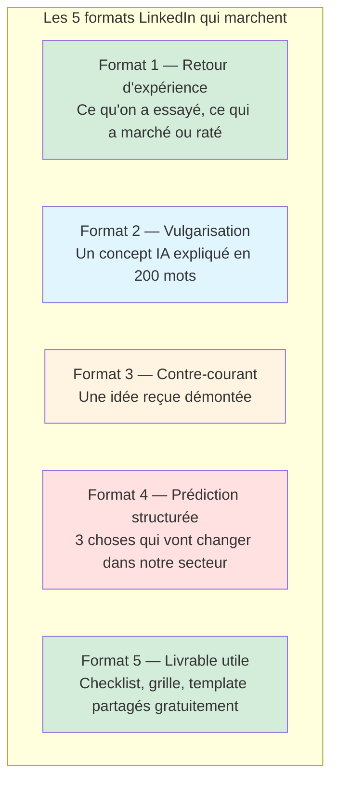

**Format 1 — Le retour d'expérience honnête.** Vous racontez un projet IA concret que vous avez mené ou observé, avec ses succès et ses ratés. Longueur idéale : trois cents à cinq cents mots. Structure : le contexte, ce que vous avez essayé, ce qui a marché, ce qui n'a pas marché, ce que vous en tirez comme leçon applicable. Ce format fonctionne parce qu'il est rare. La plupart des publications IA sur LinkedIn sont soit du marketing masqué, soit des généralités. Un retour d'expérience honnête et nuancé se remarque immédiatement.

**Format 2 — La vulgarisation d'un concept.** Vous expliquez en deux cents à trois cents mots un concept IA technique à un public non-technique. RAG, fine-tuning, agents, embeddings, guardrails : chacun peut faire l'objet d'un post. La règle : pas de jargon non expliqué, une analogie forte tirée de la vie quotidienne, un exemple concret. Ce format est votre démonstration par l'acte que vous maîtrisez le sujet et savez le rendre accessible — deux qualités qui définissent la référente.

**Format 3 — Le contre-courant structuré.** Vous prenez une idée reçue largement partagée dans votre secteur sur l'IA et vous la démontez avec des arguments solides. Attention : pas de provocation gratuite, la démolition doit être étayée. Exemples : « Non, l'IA ne va pas remplacer les recruteurs d'ici cinq ans, voici pourquoi », « Non, le POC IA à trois mois n'est pas la bonne entrée, voici le cadre qui marche vraiment ». Ce format génère le plus d'engagement mais aussi le plus de risques. Il faut être capable de défendre sa position dans les commentaires.

**Format 4 — La prédiction structurée.** Vous annoncez deux ou trois évolutions que vous voyez arriver dans votre secteur sous l'effet de l'IA à un horizon de douze à trente-six mois. Pas de boule de cristal : chaque prédiction est étayée par un signal observable aujourd'hui. Exemples : tendance de recrutement, mouvement concurrentiel, évolution réglementaire. Ce format positionne la dirigeante non seulement comme praticienne mais comme stratège.

**Format 5 — Le livrable utile partagé gratuitement.** Vous mettez à disposition un template, une checklist, une grille d'évaluation que vous avez construits pour votre organisation. Légende en quatre phrases : ce que c'est, à quoi ça sert, comment l'utiliser, lien de téléchargement. Ce format construit votre audience plus vite que tous les autres, parce qu'il génère immédiatement un bénéfice concret pour vos lecteurs.

### 7.3 — Le rythme de publication qui fonctionne

| Rythme | Effort hebdo | Résultats à 6 mois | Résultats à 18 mois |
|--------|--------------|-------------------|---------------------|
| 1 post/semaine | 1-2h | 500-2000 followers qualifiés | 3-8k followers, 1-3 invitations conférence |
| 2 posts/semaine | 2-3h | 1500-4000 followers qualifiés | 5-15k followers, 3-10 invitations conférence |
| 3+ posts/semaine | 4-6h | 3000-8000 followers qualifiés | 10-30k followers, sollicitations presse récurrentes |

Le rythme de deux publications par semaine est le sweet spot pour une dirigeante ayant déjà un temps plein. Il demande deux à trois heures hebdomadaires, il produit des résultats visibles dès six mois, et il est soutenable sur la durée. Le rythme d'une publication par semaine est trop lent pour sortir du bruit ambiant, le rythme de trois par semaine demande une discipline que peu de dirigeantes tiennent sans équipe dédiée.

### 7.4 — Pitcher pour intervenir dans une conférence de son secteur

Une intervention en conférence sectorielle — salon professionnel, conférence annuelle d'un cabinet, keynote d'un événement métier — produit en une heure ce que vingt posts LinkedIn produisent en un an. Elle confère un statut, elle crée du contenu secondaire (replay, articles, interviews), elle multiplie votre visibilité dans un cercle qualifié. Les dirigeantes qui sous-estiment ce levier passent à côté d'un accélérateur majeur.

Obtenir une intervention demande une démarche structurée. Les organisateurs de conférences cherchent en permanence des intervenantes, mais ils cherchent des profils crédibles, différenciants, capables de tenir un contenu pendant trente à soixante minutes sans être ennuyeuses. Un pitch d'intervention réussi tient en une page et se compose de six éléments.

**Un titre incisif.** Pas « L'IA dans le secteur X », mais « Pourquoi les trois cas d'usage IA les plus évidents du secteur X sont aussi les plus risqués ». Le titre promet une tension, une perspective, un angle.

**Un pitch de trois phrases.** La promesse de l'intervention, ce que le public en retirera concrètement, pourquoi vous êtes la personne légitime pour traiter le sujet. Pas de « je parlerai de », mais « à l'issue de cette intervention, les participants sauront distinguer… ».

**Un plan d'intervention en cinq points.** Pas plus. Les organisateurs doivent pouvoir visualiser immédiatement la structure sans lire deux pages de détails.

**Une biographie intervenante de cent-cinquante mots.** Orientée résultats, pas parcours. « Sophie a piloté le déploiement IA de trois ETI françaises, générant un ROI cumulé de trois millions d'euros en dix-huit mois » plutôt que « Sophie est titulaire d'un MBA de l'école X et a occupé des postes de Y et Z ».

**Une preuve sociale vérifiable.** Une ou deux références d'interventions précédentes, avec liens, ou à défaut des articles écrits, des podcasts, des posts viraux. Si vous n'avez aucune preuve sociale externe, commencez par des formats plus petits : webinaires internes, interventions d'une heure dans des écoles, tables rondes associatives. Construisez le CV avant de viser la keynote.

**Une disponibilité claire.** Trois créneaux proposés, pas plus. Les organisateurs jonglent avec des agendas complexes. Une proposition vague est rarement retenue.

### 7.5 — Construire sa crédibilité AI sans être technique

| Pilier | Actions concrètes | Horizon |
|--------|-------------------|---------|
| Preuves opérationnelles | Documenter 3 cas d'usage IA menés chez soi avec chiffres | 12 mois |
| Vulgarisation éditoriale | 50 posts LinkedIn sur 6 mois, mélange des 5 formats | 6 mois |
| Prise de parole publique | 2-3 interventions conférence / an + podcasts | 12 mois |
| Certification externe | Formation reconnue sur IA stratégique (type CAIO Academy) | 6 mois |
| Réseau sectoriel | 5-10 pairs de votre secteur en échanges réguliers | 18 mois |
| Soutien académique | Cours invités école de commerce, jury de concours | 18 mois |

La crédibilité sans être technique se construit en cumulant des preuves non-techniques mais objectives. Chaque cas d'usage IA documenté avec des chiffres réels vaut mille affirmations génériques. Chaque vulgarisation réussie démontre la maîtrise par la capacité à expliquer. Chaque prise de parole publique est une mise à l'épreuve contre des questions ouvertes. Chaque certification atteste d'un investissement structuré. Ensemble, ces preuves dessinent un profil de dirigeante AI-literate qui n'a pas besoin d'être codeuse pour être reconnue comme experte stratégique.

### 7.6 — Le kit de personal branding CAIO non-technique

Le kit se compose de six éléments standardisés qui vous positionnent cohérenciellement sur toutes les surfaces où vous apparaissez.

**Une bio courte de soixante mots** pour LinkedIn, site de conférence, signature email élaborée. Orientée promesse et résultat.

**Une bio longue de deux cent cinquante mots** pour articles, keynotes, entretiens presse. Contextuelle, plus narrative.

**Une photo professionnelle cohérente** utilisée partout à l'identique. Même photo sur LinkedIn, sur vos interventions, dans les articles. La reconnaissance visuelle compte.

**Trois à cinq messages clés permanents** que vous déclinez dans tous vos contenus. Exemples : « L'IA ne remplace pas les dirigeants non-techniques, elle les rend plus puissants », « Un bon projet IA est un projet dont le ROI est calculable avant le démarrage », « La gouvernance IA n'est pas un frein, c'est un accélérateur ». Ces messages sont votre signature éditoriale.

**Une banque de dix histoires réutilisables** — trois cas d'usage détaillés, deux échecs instructifs, deux anecdotes sectorielles, trois métaphores pédagogiques. Ces histoires sont votre matière première, réutilisables en posts, en conférences, en interviews.

**Un calendrier éditorial trimestriel** qui liste les thèmes à traiter par semaine. Préparé à l'avance, il élimine quatre-vingts pour cent de la procrastination et vous permet d'anticiper actualité et saisonnalité de votre secteur.

### 7.7 — Les trois pièges du personal branding à éviter

**Piège 1 — Le discours générique.** Des posts qui pourraient être signés par n'importe quelle autre dirigeante. Parade : prendre position, citer son contexte, partager ses chiffres. Une dirigeante qui ne raconte que des généralités n'est pas une référente, c'est une curatrice.

**Piège 2 — Le mimétisme des gourous américains.** Reprendre les formats, tonalités, claims des consultants IA américains. Parade : trouver sa propre voix, souvent plus sobre, plus étayée, plus européenne. Le marché européen récompense la rigueur et l'honnêteté, pas l'hyperbole.

**Piège 3 — Le surinvestissement au détriment de l'opérationnel.** Passer dix heures par semaine à poster et négliger la roadmap interne. Parade : plafonner le temps de personal branding à trois heures hebdomadaires maximum. La crédibilité externe s'effondre si l'interne ne suit pas.

### 7.8 — Exercice pratique

Rédigez trois posts LinkedIn, un par format parmi les cinq formats de la section 7.2. Ne les publiez pas encore. Faites-les relire par deux personnes : une dirigeante non-technique de votre entourage, et une personne technique IA. Les premiers retours vous diront si vos posts sont compréhensibles. Les seconds vous diront s'ils sont crédibles. Itérez. Publiez le premier post la semaine qui suit. Publiez le deuxième dix jours plus tard. Publiez le troisième trois semaines après. Observez les retours. Ajustez. Recommencez.

### Points clés du module 07

Devenir référente AI accélère carrière personnelle et transformation organisationnelle. Cinq formats LinkedIn éprouvés. Rythme optimal de deux publications hebdomadaires. Pitch conférence en six éléments pour obtenir des interventions. La crédibilité sans être technique repose sur les preuves opérationnelles, la vulgarisation et la prise de parole publique. Kit de personal branding en six composants standardisés. Éviter trois pièges : discours générique, mimétisme américain, surinvestissement externe.

### Livrable : Kit personal branding CAIO non-tech

Vous disposez désormais d'un kit complet de personal branding CAIO non-technique, composé des templates de biographies, d'un canevas de messages clés, d'un calendrier éditorial trimestriel, d'une grille de pitch conférence, et d'un tableau de suivi de votre progression sectorielle. Ce kit est l'arme de transformation qui complète votre stratégie interne par une stratégie externe. Ensemble, les deux vous installent durablement comme la référente IA de votre secteur.

---

## Conclusion de la formation

Vous avez traversé sept modules qui vous ont emmenée du vocabulaire de base de l'intelligence artificielle jusqu'à la construction de votre autorité publique en tant que référente sectorielle. En chemin, vous avez cartographié les opportunités de votre organisation, construit une feuille de route crédible devant votre COMEX, installé un dispositif de pilotage en huit métriques, rédigé une politique interne de gouvernance IA, appris à sélectionner et manager des partenaires de confiance. Ces sept compétences forment un ensemble cohérent. Prises séparément, elles sont utiles. Prises ensemble, elles font de vous une dirigeante AI-literate dans le sens le plus plein du terme.

Vous n'êtes toujours pas codeuse, et c'est très bien. Votre terrain de jeu n'est pas le code. Votre terrain de jeu est la décision, l'arbitrage, la gouvernance, le pilotage, la construction d'écosystèmes humains et technologiques. L'intelligence artificielle n'est pas un outil qu'on apprend à manipuler dans tous ses détails techniques — elle est un domaine qu'on apprend à diriger, exactement comme on dirige le marketing sans être graphiste, les ressources humaines sans être psychologue clinicien, les finances sans être trader. Le leadership IA est un leadership comme les autres. Il demande de la méthode, de la discipline, de l'honnêteté intellectuelle, et un cadre conceptuel solide. Ce cadre, vous l'avez désormais.

### La suite du parcours

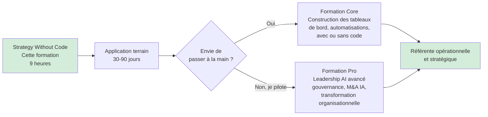

À l'issue de cette formation, deux voies s'ouvrent à vous. La première, si vous ressentez l'envie — au Module 04 probablement, en voyant le tableau de bord en lecture seule — de mettre les mains dans la construction concrète, est celle de la formation Core de CAIO Academy. Elle vous apprend à construire vous-même, avec ou sans code selon les cas, les tableaux de bord, les automatisations, les intégrations qui transforment votre stratégie en réalité opérationnelle immédiate. Elle ne fait pas de vous une ingénieure, elle fait de vous une praticienne autonome.

La seconde voie, si votre trajectoire reste résolument stratégique, est celle de la formation Pro : leadership IA avancé, gouvernance à l'échelle d'un groupe multinational, fusions-acquisitions dans l'écosystème IA, transformation organisationnelle profonde. Elle approfondit ce que cette formation Strategy a ouvert, sans jamais vous demander de coder.

Quel que soit votre choix, vous n'êtes plus la même dirigeante qu'au premier paragraphe de ce document. Vous maîtrisez désormais le langage, les cadres, les outils. Il ne vous reste plus qu'à les appliquer. Le reste suit.

---

**CAIO Academy — AI Strategy Without Code Track**
*Formation conçue pour les dirigeantes et managers non-techniques qui pilotent l'IA dans leur organisation.*
*Durée : 9 heures · 7 modules · 7 livrables opérationnels*
*Prérequis : aucun.*

*Agentik {OS} — agentik-os.com*
