# CAIO Academy — AI Systems Architect Track

**The track to transform your CTO technical expertise into a business, strategic, and commercial lever**

**Target audience:** Thomas — SaaS CTO
**Track length:** 12 hours of structured content
**Systems to build:** 3 (light version included, full versions in the core program)
**Transformation horizon:** 90 days
**Format:** 8 professional training modules, architecture templates, pitch scripts, Fractional CAIO offer ready to deploy

**Agentik {OS} — agentik-os.com**

---

## Preface — Why this track exists

You are a CTO. You know how to code. Better still: you know how to get others to code, how to design a system, pick a stack, arbitrate between technical debt and velocity, hire, mentor, hold a quarterly roadmap. You have probably already shipped one or more SaaS products to production. You have watched several technical waves roll by — mobile, cloud, microservices, serverless. You have felt the AI wave for eighteen months now, and you absorb it the way you absorb them all: through the prism of implementation.

And yet, something is off.

You can see that the economic value of the profession is shifting. The ex-CTOs you know who have repositioned as Chief AI Officer or Head of AI Strategy are not necessarily better engineers than you. They do not know LLMs better, do not code faster, do not deploy more elegant architectures. What they did was **change register**. They stopped selling their ability to deliver and started selling their ability to *orient* — to translate business stakes into agentic architectures, to pitch an AI strategy to an executive committee without jargon, to package their expertise as a Fractional offering billed at 1,500 to 2,500 euros per day.

You have the technical substrate to make the same shift. What you lack is not a new library, a new framework, a new orchestration pattern. What you lack is **the grammar**: how to read an organization as a system, how to map its nodes of inefficiency in 90 minutes, how to present an AI project to a board in a way that the investment decision is made in the room and not three weeks later, how to build a Fractional CAIO offer that sells itself without you needing to chase leads.

This 12-hour track gives you that grammar. Not in theory — as a protocol. At the end, you will have:

- a **self-audit of your current posture** that tells you exactly where you stand between executor, architect, and strategist,
- a **90-minute organization audit grid** that you can deploy at any client,
- a **system architecture template** (Notion + Figma) that your board can read without needing a translator,
- a **light AI monitoring system** deployed and presentable within 3 days,
- a **5-slide CAIO pitch deck** that you can adapt in under an hour for any exec committee,
- a **packaged Fractional CAIO offering** with three formulas, justified pricing, and a profile page ready to publish,
- an **AI System product sheet** that lets you bill a fixed outcome rather than hours,
- a **90-day roadmap** with three viable paths (internal, freelance, founding).

You will not walk out with a certificate. You will walk out with **an operational kit** that lets you, from the week after the last lesson, publicly position yourself as Chief AI Officer and land your first mission without discounting your positioning.

---

## Avatar — Thomas, SaaS CTO

| Dimension | Profile |
|-----------|---------|
| Typical age | 32-45 years old |
| Experience | 8 to 20 years of dev, including at least 3 as CTO or Head of Engineering |
| Usual stack | Node/TypeScript, Python, PostgreSQL, AWS/GCP cloud, Docker, mature CI/CD |
| Relation to AI | Has integrated Claude, GPT-4 or equivalent into at least one product. Knows RAG, embeddings, tool calls. Has shipped an agent to production. |
| Team managed | 3 to 40 developers, often 5 to 15 |
| Current income | 90-160k€ full-time; 700-1100€/day freelance |
| Main frustration | "I ship useful AI internally but the board hears me as an executor, not a strategist" |
| Deep fear | "A business+AI profile will replace me, one who speaks better to my CEO than I do" |
| Accessible dream | Be recognized as a CAIO, bill 1,500-2,500€/day Fractional, or aim for a senior CAIO/CTO role at 180-280k€/year |
| Buying signal | Has already invested in executive coaching, a partial MBA, or strategic programs (BCG Academy, HEC Executive, Reforge) |
| Main block | Knows how to build, does not yet know how to *sell* the system he builds |

Thomas is not a beginner. He does not need anyone to explain what a prompt, a token, or an embedding is. He needs to be shown how to **translate what he already knows into offering, pitch, positioning**. This track starts from that premise and does not waste time on AI technical fundamentals — it assumes them and jumps directly to the strategic level.

---

## Track overview

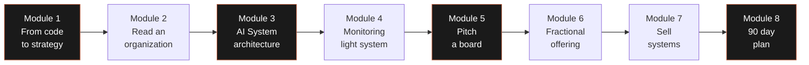

Each module produces a deliverable directly usable in a client context. Modules 1 and 2 are in week 1 (orientation and audit). Modules 3 and 4 are in week 2 (architecture and monitoring). Modules 5 and 6 are in week 3 (pitch and offer). Modules 7 and 8 are in week 4 (sales and plan).

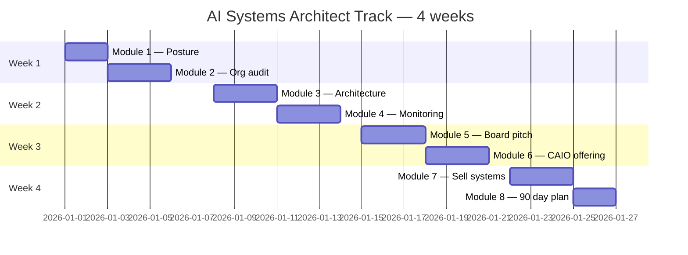

| Module | Duration | Main deliverable | Expected impact |
|--------|----------|------------------|-----------------|
| 01 — From code to strategy | 1h00 | CAIO posture self-audit | Clarity on trajectory |
| 02 — Read an organization as an AI system | 1h30 | 90-minute audit grid + filled example | Ability to audit a client in one session |
| 03 — AI System architecture from A to Z | 2h00 | Architecture template (Notion + Figma) | Diagrams readable by a board |
| 04 — AI Monitoring: your first system | 2h30 | Light template system (Convex + Next.js + Claude) | Live demo in 3 days |
| 05 — Pitch AI to a board | 1h30 | 5-slide deck + 12-minute script | Board convinced in one meeting |
| 06 — Build your Fractional CAIO offering | 1h30 | Packaged offering (3 formulas + pricing + profile page) | Qualified prospects in pipeline |
| 07 — Sell systems, not time | 1h00 | AI System product sheet + pricing | Higher recurring revenue |
| 08 — 90-day plan to the first €10k CAIO | 1h00 | Personal 30/60/90 roadmap | First CAIO cash within 90 days |

---

# Module 01 — From code to strategy

**Duration: 1h00 · Format: structured reading + self-audit at end of module**

## Module objectives

By the end of this module, you will be able to:

1. Articulate the difference between "developing AI" and "driving an AI strategy" in one sentence, without jargon.
2. Map what your board expects from you that you are not yet delivering — and why.
3. Position your current posture on the Executor / Architect / Strategist spectrum.
4. Identify the three shifts of thinking that separate a technical CTO from a strategic CAIO.
5. Fill in your posture self-audit and derive your priority lever for the next three months.

## 1.1 — The gap between "I develop AI" and "I drive an AI strategy"

Most CTOs who will read these pages have already delivered AI to production. A chatbot integrated into the product, a recommendation engine, a RAG pipeline on internal documentation, a lead qualification agent. They master the technical chain: prompt, model, embeddings, vector store, orchestration, evaluation. And yet, when their CEO asks them *"what is our AI strategy over 18 months?"*, they answer with an inventory of tools, a feature roadmap, sometimes an Excel table of prioritized use cases.

That is not a strategy. That is a backlog.

An AI strategy answers higher-order questions:

- **What problem of the organization does AI solve better than any other technology?**
- **What differentiating capability does AI let us build that our competitors cannot replicate in 12 months?**
- **Where is the organizational bottleneck that AI can unlock to unleash 10x value on an existing team?**
- **What is our opportunity cost if we do not invest in that capability now?**
- **What risks (data, compliance, vendor dependency, quality) do we need to map and how do we govern them?**

A technical CTO answers the *how* question. A strategic CAIO answers the *why* question, and asks it before the CEO does.

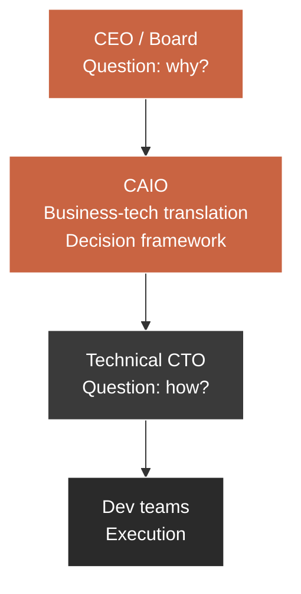

The CAIO sits between CEO and CTO. He speaks both languages. He can shift from tokens-per-second to gross margin without cognitive friction. That is what makes him rare, and therefore expensive.

## 1.2 — Mapping: what your board expects that you are not yet delivering

A B2B SaaS board has five recurring expectations toward its AI lead. Here is the mapping, crossed with what a technical CTO spontaneously delivers.

| Board expectation | Delivered by technical CTO | Expected from CAIO |
|-------------------|----------------------------|--------------------|
| 18-month AI vision | List of prioritized AI features | Strategic narrative in 3 horizons (quick wins, capabilities, moat) |
| Measurable ROI per initiative | Estimated dev time | Impact model (revenue, cost avoided, margin) + testable assumptions |
| Risk mapping | List of potential bugs | Risk matrix (data, legal, dependency, quality, reputation) with mitigations |
| Governance and compliance | "We are GDPR compliant" | AI governance framework (data, models, evaluation, audit trail) |
| Competitive trajectory | "Competitor X shipped feature Y" | Positioning analysis + defensible moat |

The board is not asking you to be an engineer. It is asking you to be a **translator between the technical world and the decision world**. If you deliver only the first column of the table above, you are perceived as an executor, regardless of your official title.

## 1.3 — The three CTO postures toward AI

There are three possible postures for a CTO facing AI. They are not mutually exclusive — you can shift from one to another depending on context — but your income and influence are dictated by the posture in which you spend most of your time.

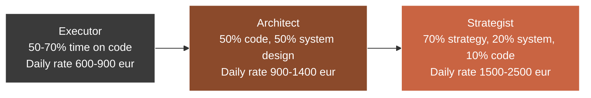

**The Executor.** Codes AI features. Masters API calls, prompts, RAG pipelines. His impact is proportional to his hours. He scales poorly because he sells himself by the hour or by the ticket. Useful, but commoditizable: another technical CTO can replace him with a month of onboarding.

**The Architect.** Designs the system before coding it. Thinks about constraints (budget, team, deadline, scale) and produces a defensible architecture. Lets others code, or codes only the critical part himself. Scales better because his output is multipliable: one architecture serves 5 developers for 18 months. His daily rate is significantly higher because his error would cost 10x more to fix than an execution error.

**The Strategist.** Chooses what deserves to be architected first. Arbitrates between business-tech options. Refuses projects. Asks questions no one else in the room asks. Holds a mandate over 12-24 months, not over one sprint. His daily rate reflects the rarity of his capacity to make the right decision under uncertainty. That is the CAIO.

### The three shifts of thinking

Moving from Executor to Architect, then from Architect to Strategist, requires three shifts:

| Shift | Before | After |
|-------|--------|-------|
| 1. From feature to system | "We ship a chatbot for support" | "We build a conversational capability reusable across support, sales and onboarding" |
| 2. From system to business | "The system processes 10k requests/day" | "The system saves 2.4 FTEs on support, i.e. 144k€/year, for a 36k€/year cost, ROI 4x" |
| 3. From business to positioning | "Our product integrates AI" | "Our moat is proprietary data A accumulated over 5 years that competitors cannot replicate" |

A CAIO constantly operates at level 3. He returns to levels 1 and 2 to check feasibility or guide his teams — but he does not linger there.

## 1.4 — Why this shift is non-negotiable in 2026

Three forces converge and make the CAIO posture non-optional for any ambitious CTO in 2026.

**Force 1: commoditization of AI code.**
AI agents now know how to produce AI code. Claude Code, Cursor, Windsurf, Copilot — they already write 60 to 80% of LLM integration code in minutes. A CTO who stops at "I know how to call the Claude API" makes himself replaceable by a tool within 18 months.

**Force 2: board decision maturity.**
Boards no longer fund "AI labs" blindly. They demand ROI, governance, traceability. The profile that can deliver *those proofs* — not the one that can deliver a cool demo — will capture the budget.

**Force 3: emergence of the CAIO role as a function.**
The CAIO title has left the territory of large corporations and entered that of mid-market SaaS. Companies of 50 to 500 people are hiring or calling on Fractional CAIOs to set a coherent strategy. The market is structuring. If you position yourself now, you are in the wave. If you wait 18 months, you will be behind the wave.

## 1.5 — Deliverable: self-audit of your current posture

Fill in this audit honestly. It will be your compass for the next 7 modules.

| Axis | Question | Score (1-5) | End-of-track target |
|------|----------|-------------|----------------------|
| AI Technical | Can you ship a RAG agent to production in under 3h? | ___ | 5/5 |
| System vision | Can you draw an orchestrated AI architecture (agents, triggers, memory, evaluation) on a whiteboard in 20 min? | ___ | 5/5 |
| Organization audit | Can you identify 5 AI opportunities at a client after a 90-min meeting? | ___ | 4/5 |
| Board pitch | Can you present an AI project to an exec committee in 12 min without jargon, and get a decision in the room? | ___ | 4/5 |
| Packaged offering | Do you have a public CAIO profile page with 3 mission formulas? | ___ | 4/5 |
| Pricing | Do you bill at least one deliverable at fixed price rather than daily rate? | ___ | 3/5 |
| Pipeline | Have you identified 5 qualified CAIO prospects within 90 days? | ___ | 4/5 |

**Interpretation.**

- **Total score < 10.** You are still massively Executor. This track will shift your register. Commit fully to modules 2, 3 and 5 — they will close the largest gaps.
- **Score between 10 and 20.** You are an emerging Architect. Modules 5 to 8 will give you the strategic and commercial lock you lack.
- **Score between 20 and 30.** You are already close to the CAIO register. Modules 6 and 7 will let you monetize what you already know.
- **Score > 30.** You are already CAIO operationally. Use this track to refine your positioning and roadmap.

## Module 1 key points

- Market value shifts from *how* to *why*. CAIO arbitrates, CTO executes.
- A board expects five things: vision, ROI, risks, governance, competitive positioning. Four out of five are not technical.
- Three postures: Executor, Architect, Strategist. Your income is dictated by the one where you spend 70% of your time.
- Three shifts of thinking: feature → system, system → business, business → positioning.
- Three forces make the shift urgent in 2026: code commoditization, board maturity, emergence of the CAIO role.
- Your self-audit is the only map that lets you invest your remaining 11h in the right place.

---

# Module 02 — Read an organization as an AI system

**Duration: 1h30 · Format: detailed framework + downloadable audit grid + filled example on a typical case**

## Module objectives

By the end of this module, you will be able to:

1. Decompose any organization into four analyzable layers: data, process, decision, interface.
2. Run a fast 90-minute audit that identifies at minimum 5 prioritized AI opportunities.
3. Apply an impact/effort grid to separate quick wins, strategic bets, and traps to avoid.
4. Produce an audit deliverable that the client can read without you and act on.
5. Bill a CAIO audit between 2,000 and 6,000 euros by making value tangible.

## 2.1 — The 4-layer framework

Most CTOs who want to do an AI audit get the object wrong. They look at the organization as a tech stack: which CRM, which ERP, which cloud, which database. This approach is insufficient because it fails to see the inefficiency nodes where AI creates real leverage.

The right angle of attack is to read the organization as a **four-layer system**:

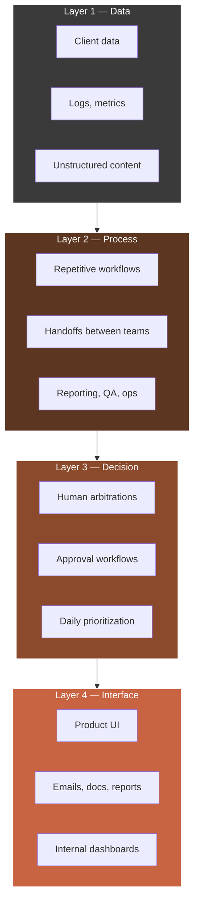

**Layer 1 — Data.** Everything the organization produces, stores, or receives as data: CRM, emails, support tickets, application logs, shared files, Slack, Notion. The quality and accessibility of this layer determine what AI can do. An organization with dirty data or data locked in vendor silos will have a low ceiling.

**Layer 2 — Process.** The repetitive workflows running in the company, often carried by humans executing mechanical tasks. Weekly reporting, manual QA, accounting reconciliation, ticket routing, quote generation, client onboarding. Each repetitive process is a candidate for AI automation.

**Layer 3 — Decision.** The arbitrations humans make daily. Prioritizing a backlog, approving an expense, validating marketing content, choosing a candidate. AI does not automate every decision — it can assist many by preparing data, generating options, or flagging anomalies.

**Layer 4 — Interface.** Everything that goes outward: product UI, client emails, reports, dashboards. AI can transform this layer by personalizing, generating deliverables on demand, making interactive what was static.

### The classic AI audit mistake

The classic mistake is to start with layer 4 (interface) because it is the most visible. "Let's add a chatbot on the site." That is a symptom, not a strategy. A good AI audit always starts with layer 1 (data) and works upward.

| If you start from... | You produce... |
|----------------------|----------------|
| Layer 4 (interface) | Gadgets. AI becomes a veneer. |
| Layer 3 (decision) | Political projects that fail because the data is not ready. |
| Layer 2 (process) | Automations that work but do not scale for lack of data signal. |
| **Layer 1 (data)** | **A durable strategy that irrigates all layers above.** |

## 2.2 — 90-minute fast audit technique

A CAIO audit does not last two weeks. A CAIO audit lasts 90 minutes because that is the time an exec committee or a CEO is willing to give you so that you give them actionable signals. What happens after — proof, PoCs, implementation — that is paid time.

Here is the exact protocol for a 90-minute CAIO audit.

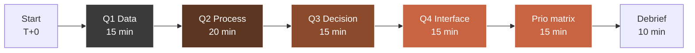

### Phase 1 — Data (15 minutes)

Questions to ask, in this order:

1. What are the three systems where your critical data lives? (typical answer: CRM, product, accounting)
2. How often do these three systems talk to each other, and through what mechanism?
3. What percentage of your data is unstructured (emails, docs, free-text tickets, call transcripts)?
4. Who owns data quality? If no one, that is a major red flag.
5. Do you already have embeddings, a vector store, or annotation? (the answer is almost always "no": that is an opportunity)

### Phase 2 — Process (20 minutes)

1. What are your three most time-expensive repetitive workflows? (ask real time, not theoretical)
2. What is the frequency of these workflows? Daily, weekly, monthly?
3. How many FTEs are mobilized on these tasks, even partially?
4. What fails most often in these workflows? (failures point to high-value automation)
5. Which handoffs between teams create friction? (a human-to-human handoff is often a candidate for orchestration)

### Phase 3 — Decision (15 minutes)

1. What decisions come back weekly in your exec committee?
2. What data is used for these decisions? Or is it mostly intuition?
3. Are there decisions that are made but not documented? (risk of scalable inconsistency)
4. What KPIs actually drive the company, vs what KPIs are just displayed?

### Phase 4 — Interface (15 minutes)

1. Which client deliverables are generated manually and could be generated on demand?
2. Does your product have zones where the user does work the product could do for them?
3. Are your client emails (support, onboarding, renewal) personalized or rigid templates?
4. Do you have internal dashboards that are consumed more than once a week? Which ones?

### Phase 5 — Prioritization matrix (15 minutes)

You take all the opportunities surfaced in the previous 4 phases and place them on a 2-axis matrix: estimated business impact, estimated implementation effort.

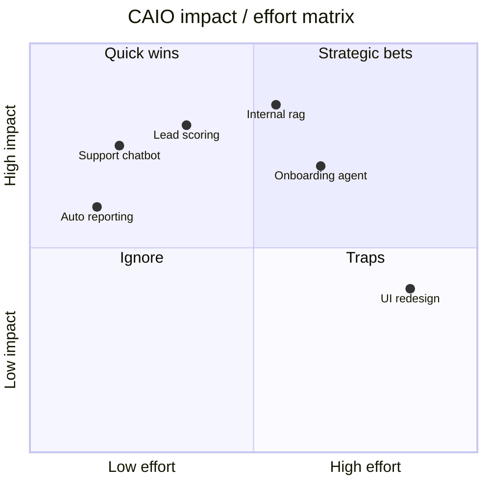

### Phase 6 — Oral debrief (10 minutes)

You debrief the client, live, on 5 to 7 ranked opportunities. You also announce a written deliverable within 72 hours that consolidates everything. This mechanic creates a trust loop: you give value in the room, you send value after the room.

## 2.3 — Prioritize with the CAIO grid

The CAIO grid refines the impact/effort matrix by adding three dimensions often overlooked by generic audits: data risk, vendor dependency, knock-on effect.

| Opportunity | Business impact (€/year) | Effort (person-weeks) | Data risk (1-5) | Vendor dependency (1-5) | Knock-on effect (1-5) | Final score |
|-------------|--------------------------|----------------------|------------------|--------------------------|-----------------------|-------------|
| Internal support chatbot | 120,000 | 4 | 2 | 3 | 4 | 8.2 |
| Auto weekly reporting | 40,000 | 1 | 1 | 2 | 2 | 6.5 |
| B2B lead scoring | 250,000 | 8 | 3 | 2 | 5 | 9.1 |
| Internal doc RAG | 90,000 | 6 | 2 | 2 | 5 | 8.7 |
| Client onboarding agent | 180,000 | 10 | 3 | 3 | 5 | 8.5 |
| Generative UI redesign | 60,000 | 14 | 2 | 4 | 2 | 4.8 |

**Reading.** The final score weights five dimensions. A score > 8 means: launch within 60 days. A score between 6 and 8: plan within the quarter. A score < 6: ignore or reformulate.

**Knock-on effect.** This is the most neglected dimension. A project that opens the way to three other projects (e.g. a doc RAG that then serves support, onboarding, and internal training) is worth more than an isolated project with identical impact.

## 2.4 — Deliverable: downloadable audit grid + filled example

The concrete deliverable of this module is a 6-8 page document you can hand to a client. It follows this structure:

1. **Executive summary** (1 page) — 5 prioritized opportunities, total estimated impact, total estimated investment, estimated 12-month ROI.
2. **4-layer mapping** (1 page) — visual diagram + per-layer notes.
3. **Opportunity details** (3-4 pages) — for each opportunity: description, problem solved, proposed AI solution, cost/deadline estimate, success KPI, risks.
4. **Visual prioritization matrix** (1 page).
5. **90-day action plan** (1 page) — quick wins to launch this month, bets to prepare next quarter.

### Filled example (condensed extract, on a B2B SaaS of 80 people)

| Opportunity | Layer | Current problem | AI solution | €/year impact | Person-weeks effort | Score |
|-------------|-------|------------------|-------------|---------------|--------------------|-------|
| Auto level-1 support reply | 4 | 60% of tickets are repetitive, avg delay 8h | RAG agent + routing, human supervision | 180,000 | 6 | 9.0 |
| B2B lead scoring | 2+1 | Sales lose 40% of their time on unqualified leads | Enrichment pipeline + AI scoring | 220,000 | 8 | 8.9 |
| Client report generation | 4 | 2 FTEs dedicated to monthly reports | Template + supervised generative agent | 90,000 | 4 | 8.4 |
| Early churn detection | 2+3 | 15%/year churn, 60% avoidable if detected early | Model + CS alert + AI playbook | 300,000 | 10 | 9.2 |
| Internal onboarding assistant | 2+4 | New hires mobilize 20h of seniors each | RAG agent on docs + process | 65,000 | 5 | 7.8 |

**Total estimated 12-month investment:** 280,000 €
**Combined 12-month impact:** 855,000 €
**ROI:** 3.05x

This type of deliverable justifies a paid audit between 3,000 and 6,000 euros. The key is not page count but the quality of prioritization and the client's ability to act alone on the document.

## Module 2 key points

- An organization reads in 4 layers: data, process, decision, interface. You always start from layer 1.
- A CAIO audit fits in 90 minutes, structured in 6 strict phases.
- The impact/effort matrix is enriched by three often-forgotten dimensions: data risk, vendor dependency, knock-on effect.
- The audit deliverable sells between 3,000 and 6,000 euros if prioritization is actionable.
- A good audit produces a client who can act without you — which, paradoxically, is the best door for them to buy the next phase from you.

---

# Module 03 — AI System architecture from A to Z

**Duration: 2h00 · Format: architecture theory + diagrams + stack choice + documentation**

## Module objectives

By the end of this module, you will be able to:

1. Design a full AI architecture on paper before writing a line of code.
2. Choose a coherent stack under three constraints: budget, deadline, team.
3. Draw orchestration diagrams (agents, triggers, memory, outputs) readable by a board.
4. Produce architecture documentation that serves both developers and decision-makers.
5. Brief a team or deliver a system yourself using your documented architecture.

## 3.1 — Why design before coding

A technical CTO codes first, documents later (or never). A CAIO does the opposite. This inversion is not stylistic: it is economic. Here is why.

| Dimension | Code first | Design first |
|-----------|-----------|--------------|
| Cost of an error | 10x (must rewrite) | 1x (must redraw) |
| Team convergence time | 2-4 sprints | 1-2 days |
| Ability to pitch to board | Low (nothing to show but code) | High (the diagram is pitchable as-is) |
| Ability to delegate | Low (you are living documentation) | High (the diagram is enough) |
| Team scaling | You are the bottleneck | The team scales without you |

A documented architecture has four cumulative virtues: it reduces the cost of errors, accelerates convergence, makes you pitchable, and lets you delegate. These four virtues are exactly what a Fractional CAIO must embody to justify his daily rate.

## 3.2 — The 7 components of an AI System

Any AI System, regardless of complexity, decomposes into 7 components. If even one is missing, the system has a structural weakness that time will reveal.

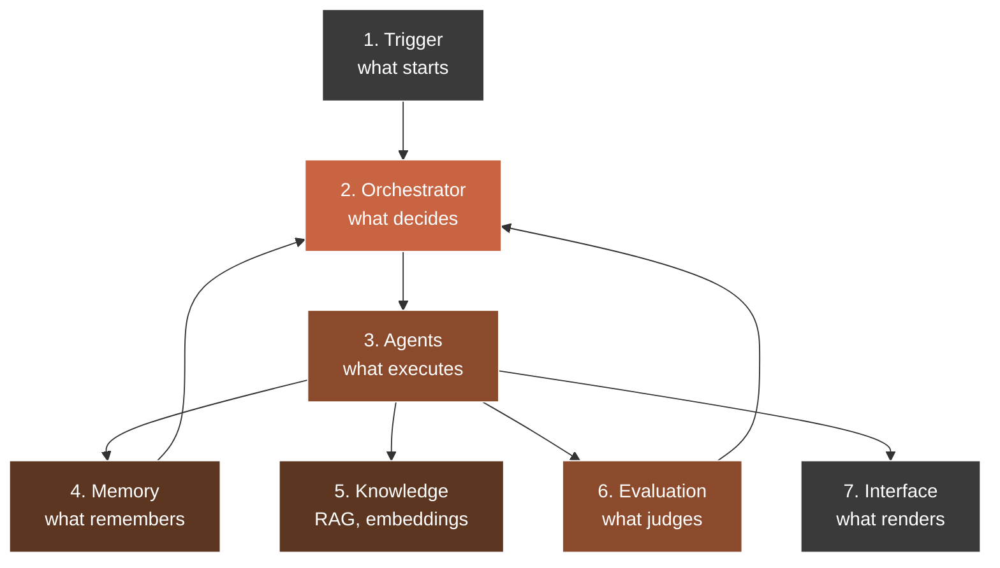

### Component 1 — Trigger

What starts the system. Three possible families:

- **Event-driven:** a webhook (Stripe payment, Clerk signup), a file upload, a user message.
- **Scheduled:** a cron (Trigger.dev), a scheduled job (Convex scheduler).
- **User-driven:** a click in the UI, a command in a Slack bot.

| Trigger type | Recommended Agentik OS tool | Use case |
|--------------|----------------------------|----------|
| External webhook | Next.js route handler | Payment, signup, external event |
| Cron / scheduled | Trigger.dev | Daily reporting, batch sync |
| DB event | Convex scheduler / mutations | Business logic triggered by write |
| User chat | Claude API + streaming | Synchronous conversation |
| File upload | Convex storage + hook | Doc parsing, RAG ingestion |

### Component 2 — Orchestrator

What decides what to do. The orchestrator can be simple (a TypeScript function) or sophisticated (a Claude agent with tool use). Rule of thumb: if your system has fewer than 3 decision branches, a function suffices. Beyond that, an LLM orchestrator with tool calls is more maintainable.

```typescript
// Example Convex + Claude API — simple orchestrator with tool use
import Anthropic from "@anthropic-ai/sdk";
import { action } from "./_generated/server";
import { v } from "convex/values";

export const orchestrate = action({
  args: { userInput: v.string(), sessionId: v.id("sessions") },
  handler: async (ctx, { userInput, sessionId }) => {
    const client = new Anthropic();
    const tools = [
      {
        name: "search_knowledge",
        description: "Search the internal knowledge base",
        input_schema: {
          type: "object",
          properties: { query: { type: "string" } },
          required: ["query"],
        },
      },
      {
        name: "create_ticket",
        description: "Create a support ticket if the question cannot be resolved",
        input_schema: {
          type: "object",
          properties: { summary: { type: "string" }, priority: { type: "string" } },
          required: ["summary", "priority"],
        },
      },
    ];

    const history = await ctx.runQuery(api.sessions.getHistory, { sessionId });

    const response = await client.messages.create({
      model: "claude-opus-4-5",
      max_tokens: 1024,
      tools,
      messages: [...history, { role: "user", content: userInput }],
    });

    // Dispatch tool use ...
    return response;
  },
});
```

### Component 3 — Agents

Agents are execution units. Each has a clear role, a system prompt, a set of tools, and an error policy. The classic CTO temptation is to build one monolithic super-agent. That is a mistake. The rule: one agent = one responsibility.

| Agent type | Responsibility | System prompt size | Tools |
|-----------|----------------|---------------------|-------|
| Researcher | Search the knowledge base | Short (< 500 tokens) | search_kb, search_web |
| Writer | Produce a text deliverable | Medium (500-1500 tokens) | format_doc, cite_source |
| Classifier | Categorize an input | Short | - |
| Router | Decide which agent to call | Short | dispatch_agent |
| Critic | Evaluate an output's quality | Medium | score_output, flag_issue |

### Component 4 — Memory

Two memory types to distinguish:

- **Short-term (session memory).** Current conversation context. Stored plainly in a Convex `messages` table linked to a `session`.
- **Long-term (user memory, project memory).** Persistent facts about the user, organization, past decisions. Stored in structured tables + embeddings.

```typescript
// Convex schema — memory
import { defineSchema, defineTable } from "convex/server";
import { v } from "convex/values";

export default defineSchema({
  sessions: defineTable({
    userId: v.id("users"),
    createdAt: v.number(),
    title: v.string(),
  }).index("by_user", ["userId"]),

  messages: defineTable({
    sessionId: v.id("sessions"),
    role: v.union(v.literal("user"), v.literal("assistant"), v.literal("tool")),
    content: v.string(),
    toolCalls: v.optional(v.array(v.any())),
    createdAt: v.number(),
  }).index("by_session", ["sessionId"]),

  userMemory: defineTable({
    userId: v.id("users"),
    fact: v.string(),
    source: v.string(),
    confidence: v.number(),
    embedding: v.array(v.number()),
    createdAt: v.number(),
  })
    .index("by_user", ["userId"])
    .vectorIndex("by_embedding", {
      vectorField: "embedding",
      dimensions: 1536,
      filterFields: ["userId"],
    }),
});
```

### Component 5 — Knowledge

RAG (Retrieval Augmented Generation) is the backbone of B2B AI systems. A poorly designed RAG produces costly hallucinations. A well-designed RAG produces measurable client trust.

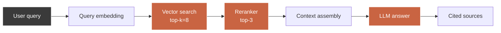

RAG hygiene rules:

| Rule | Impact |
|------|--------|
| Chunk by semantic paragraphs (200-400 tokens) | Top-3 precision +25% |
| Always store source (file, page, url) | Audit trail, no invisible hallucination |
| Add a reranker | Top-3 precision +35% |
| Measure recall on a 50 Q/A reference set | Regression detection at each deploy |
| Cite sources in the answer | User trust +80% |

### Component 6 — Evaluation

This is the component 90% of CTOs forget. An AI System without evaluation is a black box that silently degrades. Three evaluation levels:

1. **Unit eval.** For each agent function, a set of 10-30 test cases with expected output.
2. **Integration eval.** For each complete workflow, a set of 5-10 end-to-end scenarios.
3. **Production eval.** Every production response is logged + scored (LLM-as-a-judge + sampled human feedback).

| Metric | Target | Tool |
|--------|--------|------|
| p95 latency | < 4s | Datadog / custom |
| Token cost / request | < 0.02€ | Claude API response + custom |
| Helpfulness score | > 4.2/5 | LLM-as-a-judge |
| Hallucination rate | < 2% | RAG audit set |
| User thumbs-up rate | > 75% | UI feedback loop |

### Component 7 — Interface

Final rendering toward the user: chat UI, dashboard, email, API, webhook. Nothing magical here — the rule is: the interface must expose the previous 6 components with transparency (show sources, reasoning, confidence).

## 3.3 — Choose your stack based on constraints

A CAIO does not pick a stack because it is cool. He picks it because it satisfies three constraints simultaneously: budget, deadline, team.

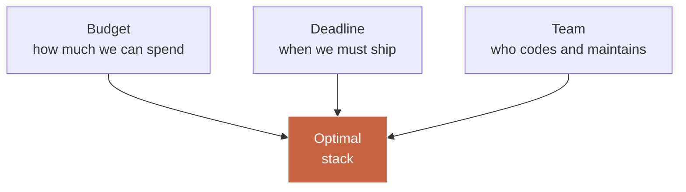

### The CAIO 2026 stack (Agentik OS)

This is the stack we use across all Agentik OS projects in 2026 to maximize velocity and maintainability.

| Layer | Choice | Why |
|-------|--------|-----|
| Frontend | Next.js 16 | App Router, server components, native streaming |
| Styling | Tailwind v4 + shadcn/ui | Coherent design system, accessible components |
| Backend / DB | Convex | Real-time, TypeScript, vector search, scheduler |
| Auth | Clerk | 2FA, orgs, robust webhooks |
| LLM | Claude API (Opus + Sonnet) | Reasoning quality, reliable tool use |
| Local agents | Claude Code + MCP servers | Local multi-agent orchestration |
| External integrations | Composio | 300+ ready connectors (Gmail, Slack, CRM, etc.) |
| Jobs / cron | Trigger.dev | Long-running jobs, retries, observability |
| Deploy | Vercel | Edge functions, preview deploys |
| Monitoring | Datadog or Vercel Analytics | Latency, errors, cost tracking |

### The 3 stack profiles by constraint

| Profile | Constraints | Recommended stack |
|---------|-------------|-------------------|
| Lean SaaS | Budget < 5k€/mo, deadline < 4 wks, team 1-2 devs | Next.js + Convex + Claude API + Clerk |
| Mid-market | Budget 5-20k€/mo, deadline 2-3 mo, team 3-6 devs | + Trigger.dev + Composio + Vercel Edge |
| Enterprise | Budget > 20k€/mo, deadline 6+ mo, team 8-15 devs | + self-hosted vector DB + fine-tuning + governance layer |

## 3.4 — Architecture documentation the board wants to see

A board has no desire to read 40 pages of technical spec. A board wants a document that fits on 6 pages structured like this:

1. **Executive one-pager.** The system summarized in 5 lines + 1 diagram.
2. **Problem solved.** The business problem addressed, quantified.
3. **Visual architecture.** The readable architecture diagram.
4. **Key components.** The 7 components with 1 line each.
5. **Risks and mitigations.** The top 5 risks + their mitigation.
6. **90-day roadmap.** Phases, milestones, expected decisions.

### Executive one-pager template

```markdown
# [System name] — One-pager

**Problem solved.** [1 sentence + 1 business figure]

**Target impact.** [€/year saved or revenue generated]

**High-level architecture.**

[Simplified mermaid diagram — max 7 boxes]

**Board decisions required.**

1. [Decision 1]
2. [Decision 2]

**Investment.** [€ over X months]
**Expected ROI.** [xX over 12 months]
```

This one-pager is sent 72h before the board. It opens the conversation. The 5-slide deck (module 5) frames it in the room.

## 3.5 — Deliverable: system architecture template (Notion + Figma)

The deliverable of this module is a dual template:

- **Notion** for the textual part (one-pager, component spec, decisions, risks).
- **Figma** for architecture diagrams (a modular file with pre-drawn components: agent, orchestrator, memory, knowledge, trigger, evaluation, interface, data store).

The Notion template contains 8 pages:
1. Overview & One-pager.
2. Business problem statement.
3. Architecture diagrams (embed Figma).
4. Component 1 — Trigger (spec).
5. Components 2-7 (specs).
6. Data model (Convex schema template).
7. Risks & mitigations (grid).
8. 90-day roadmap.

The Figma template contains a library of standard Agentik OS components, usable in drag-and-drop, with a 6-color dedicated palette (data, process, decision, interface, evaluation, trigger).

## Module 3 key points

- Design first, code second. An architecture error costs 10x more than a code error.
- 7 components structure any AI System: trigger, orchestrator, agents, memory, knowledge, evaluation, interface.
- Stack choice depends on 3 constraints: budget, deadline, team. The CAIO 2026 stack (Next.js + Convex + Claude + Composio + Trigger.dev) covers 80% of SaaS cases.
- The architecture documentation a board wants fits on 6 pages. A one-pager opens, a 5-slide deck frames, a full doc reassures.
- The deliverable is dual: Notion (textual) + Figma (visual). This is not zealousness: this is what lets you bill the design phase 8,000 to 25,000 euros.

---

# Module 04 — AI Monitoring: your first system

**Duration: 2h30 · Format: guided walkthrough + code + demo deployable in 3 days**

## Module objectives

By the end of this module, you will be able to:

1. Build a basic AI monitoring dashboard with the Agentik OS stack.
2. Identify the 7 key metrics every board should track on a production AI system.
3. Deploy your system in less than 3 days on a Convex + Next.js + Claude API stack.
4. Present this system to the board without losing your audience in technicalities.
5. Use this system as a live demo during your CAIO pitches.

## 4.1 — Why monitoring is your first deliverable

A CAIO never starts a mission by delivering "an agent." He starts by delivering **visibility**. Because until someone knows what is running, what it costs, and what it produces, no rational decision is possible. Monitoring is the political act before the technical act.

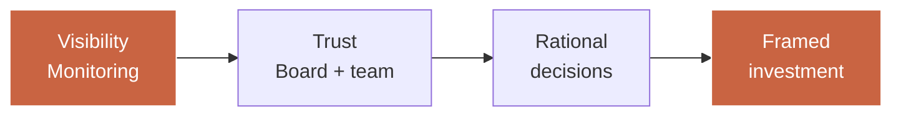

It is also pragmatically the easiest system to ship in 3 days with a wow effect. A well-done dashboard showing in real time the AI requests, their cost, latency, and response quality, triggers an immediate reaction in the board: "OK, now we can pilot."

## 4.2 — The 7 AI metrics every board must track

| # | Metric | Definition | Target | Why it matters |
|---|--------|------------|--------|----------------|
| 1 | Requests / day | Number of calls to the AI system | Stable growth | Adoption signal |
| 2 | Cost / request | Total tokens × price / volume | Decreasing over time | Efficiency signal |
| 3 | p50 / p95 latency | Median and worst-case response time | p95 < 4s | UX signal |
| 4 | Error rate | % failed or fallback requests | < 2% | Stability signal |
| 5 | Helpfulness score | LLM-as-a-judge + thumbs-up | > 4.2/5 | Quality signal |
| 6 | Hallucination rate | % factually wrong responses | < 2% | Risk signal |
| 7 | Monthly ROI | Value generated / total cost | > 3x | Business signal |

A board seeing these 7 metrics each month knows where to invest. A board not seeing them funds blindly or cuts brutally.

## 4.3 — Light monitoring architecture

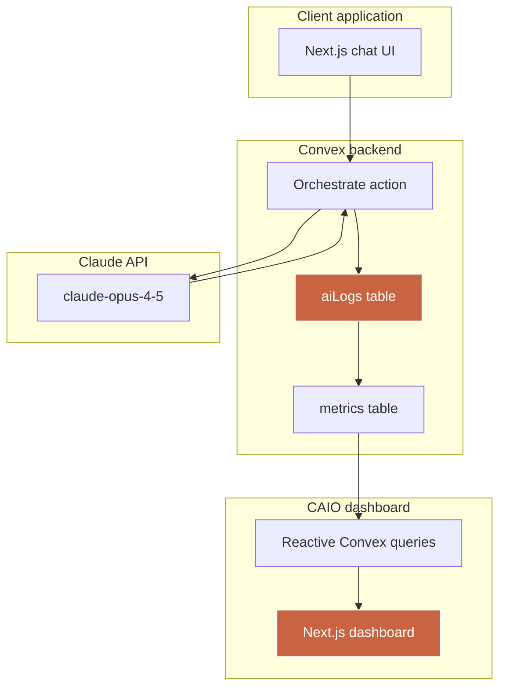

### Convex schema

```typescript
// convex/schema.ts
import { defineSchema, defineTable } from "convex/server";
import { v } from "convex/values";

export default defineSchema({
  aiLogs: defineTable({
    userId: v.id("users"),
    sessionId: v.id("sessions"),
    model: v.string(),
    inputTokens: v.number(),
    outputTokens: v.number(),
    costEur: v.number(),
    latencyMs: v.number(),
    status: v.union(v.literal("ok"), v.literal("error"), v.literal("fallback")),
    prompt: v.string(),
    response: v.string(),
    helpfulnessScore: v.optional(v.number()),
    hallucinationFlag: v.optional(v.boolean()),
    createdAt: v.number(),
  })
    .index("by_user", ["userId"])
    .index("by_session", ["sessionId"])
    .index("by_createdAt", ["createdAt"]),

  dailyMetrics: defineTable({
    date: v.string(), // YYYY-MM-DD
    totalRequests: v.number(),
    totalCostEur: v.number(),
    avgLatencyMs: v.number(),
    p95LatencyMs: v.number(),
    errorRate: v.number(),
    avgHelpfulness: v.number(),
    hallucinationRate: v.number(),
  }).index("by_date", ["date"]),
});
```

### Orchestrate action with logging

```typescript
// convex/orchestrate.ts
import Anthropic from "@anthropic-ai/sdk";
import { action } from "./_generated/server";
import { v } from "convex/values";
import { api, internal } from "./_generated/api";

const MODEL = "claude-opus-4-5";
const INPUT_PRICE_EUR_PER_1M = 14; // adjust to real pricing
const OUTPUT_PRICE_EUR_PER_1M = 70;

export const orchestrate = action({
  args: {
    userId: v.id("users"),
    sessionId: v.id("sessions"),
    userInput: v.string(),
  },
  handler: async (ctx, { userId, sessionId, userInput }) => {
    const client = new Anthropic();
    const startedAt = Date.now();
    let status: "ok" | "error" | "fallback" = "ok";
    let inputTokens = 0;
    let outputTokens = 0;
    let response = "";

    try {
      const history = await ctx.runQuery(api.sessions.getHistory, { sessionId });

      const resp = await client.messages.create({
        model: MODEL,
        max_tokens: 1024,
        messages: [...history, { role: "user", content: userInput }],
      });

      inputTokens = resp.usage.input_tokens;
      outputTokens = resp.usage.output_tokens;
      response = resp.content[0].type === "text" ? resp.content[0].text : "";
    } catch (e) {
      status = "error";
      response = "Internal error — a human will take over.";
    }

    const latencyMs = Date.now() - startedAt;
    const costEur =
      (inputTokens * INPUT_PRICE_EUR_PER_1M + outputTokens * OUTPUT_PRICE_EUR_PER_1M) / 1_000_000;

    await ctx.runMutation(internal.aiLogs.insert, {
      userId,
      sessionId,
      model: MODEL,
      inputTokens,
      outputTokens,
      costEur,
      latencyMs,
      status,
      prompt: userInput,
      response,
      createdAt: Date.now(),
    });

    return { response, costEur, latencyMs, status };
  },
});
```

### aiLogs.insert mutation (internal)

```typescript
// convex/aiLogs.ts
import { internalMutation } from "./_generated/server";
import { v } from "convex/values";

export const insert = internalMutation({
  args: {
    userId: v.id("users"),
    sessionId: v.id("sessions"),
    model: v.string(),
    inputTokens: v.number(),
    outputTokens: v.number(),
    costEur: v.number(),
    latencyMs: v.number(),
    status: v.union(v.literal("ok"), v.literal("error"), v.literal("fallback")),
    prompt: v.string(),
    response: v.string(),
    createdAt: v.number(),
  },
  handler: async (ctx, args) => {
    await ctx.db.insert("aiLogs", args);
  },
});
```

### Daily aggregation via Trigger.dev

```typescript
// trigger/aggregate-daily-metrics.ts
import { schedules } from "@trigger.dev/sdk/v3";
import { ConvexHttpClient } from "convex/browser";
import { api } from "./convex/_generated/api";

export const aggregateDailyMetrics = schedules.task({
  id: "aggregate-daily-metrics",
  cron: "0 1 * * *", // every day at 1am
  run: async () => {
    const convex = new ConvexHttpClient(process.env.CONVEX_URL!);
    const yesterday = new Date(Date.now() - 24 * 60 * 60 * 1000)
      .toISOString()
      .slice(0, 10);

    const logs = await convex.query(api.aiLogs.listByDate, { date: yesterday });

    if (logs.length === 0) return { skipped: true };

    const totalRequests = logs.length;
    const totalCostEur = logs.reduce((s, l) => s + l.costEur, 0);
    const latencies = logs.map((l) => l.latencyMs).sort((a, b) => a - b);
    const avgLatencyMs = latencies.reduce((s, v) => s + v, 0) / totalRequests;
    const p95LatencyMs = latencies[Math.floor(totalRequests * 0.95)];
    const errorRate = logs.filter((l) => l.status === "error").length / totalRequests;
    const helpfulnessScores = logs
      .filter((l) => typeof l.helpfulnessScore === "number")
      .map((l) => l.helpfulnessScore!);
    const avgHelpfulness = helpfulnessScores.length
      ? helpfulnessScores.reduce((s, v) => s + v, 0) / helpfulnessScores.length
      : 0;
    const hallucinationRate =
      logs.filter((l) => l.hallucinationFlag).length / totalRequests;

    await convex.mutation(api.dailyMetrics.upsert, {
      date: yesterday,
      totalRequests,
      totalCostEur,
      avgLatencyMs,
      p95LatencyMs,
      errorRate,
      avgHelpfulness,
      hallucinationRate,
    });

    return { success: true, date: yesterday };
  },
});
```

## 4.4 — Next.js dashboard

The dashboard consumes metrics in real time via reactive Convex queries. It displays 7 main tiles + 2 time-series charts + 1 recent logs table.

```typescript
// app/dashboard/page.tsx (extract)
"use client";
import { useQuery } from "convex/react";
import { api } from "@/convex/_generated/api";
import { Card, CardContent, CardHeader } from "@/components/ui/card";

export default function Dashboard() {
  const metrics = useQuery(api.dailyMetrics.last30Days);
  const today = metrics?.[0];

  if (!today) return <div>Loading…</div>;

  return (
    <div className="grid grid-cols-1 md:grid-cols-4 gap-4 p-8">
      <Card>
        <CardHeader>Requests today</CardHeader>
        <CardContent className="text-3xl">{today.totalRequests}</CardContent>
      </Card>
      <Card>
        <CardHeader>Cost today</CardHeader>
        <CardContent className="text-3xl">{today.totalCostEur.toFixed(2)} €</CardContent>
      </Card>
      <Card>
        <CardHeader>p95 latency</CardHeader>
        <CardContent className="text-3xl">{today.p95LatencyMs} ms</CardContent>
      </Card>
      <Card>
        <CardHeader>Error rate</CardHeader>
        <CardContent className="text-3xl">{(today.errorRate * 100).toFixed(1)}%</CardContent>
      </Card>
      {/* 3 additional tiles + charts */}
    </div>
  );
}
```

## 4.5 — The 7 tiles of the CAIO dashboard

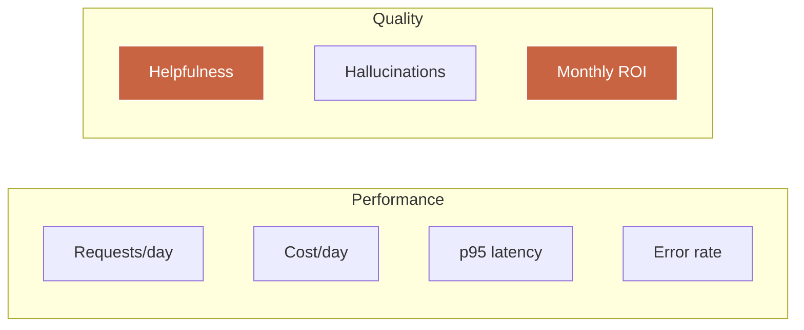

| Tile | Convex source | Alert color |
|------|---------------|-------------|
| Requests/day | `dailyMetrics.totalRequests` | Gray (info) |
| Cost/day | `dailyMetrics.totalCostEur` | Orange if > budget threshold |
| p95 latency | `dailyMetrics.p95LatencyMs` | Red if > 5000 |
| Error rate | `dailyMetrics.errorRate` | Red if > 3% |
| Helpfulness | `dailyMetrics.avgHelpfulness` | Red if < 4.0 |
| Hallucinations | `dailyMetrics.hallucinationRate` | Red if > 3% |
| Monthly ROI | custom calculation (value/cost) | Green if > 3x |

## 4.6 — Present the system to the board without losing the audience

The golden rule: **3 screens max**, **90 seconds per screen**.

| Screen | Content | Time |
|--------|---------|------|
| 1 | Live dashboard with the 7 tiles | 90s |
| 2 | An example of end-to-end traced AI conversation (prompt + response + cost + latency) | 90s |
| 3 | Recent logs table with a hallucination flag + remediation plan | 90s |

What you do not do: you do not show code. Ever. Code exists, it is visible to those who want to dig — but in the meeting, you show the result, not the process.

## 4.7 — Light version limits and bridge to the full version

The system you just built in this module is a **light version**. It is sufficient to:

- do a 5-minute board demo,
- start tracking an existing production AI System,
- lay the monitoring foundation before connecting advanced evaluations.

It does not yet cover:

- multi-agent orchestration with dynamic routing,
- the full ROI dashboard with feature-by-feature business impact modeling,
- automated evaluations (LLM-as-a-judge with golden set, regression tracking),
- Slack/email alerts on quality degradation,
- drill-down by user, segment, feature,
- historical backfill and automatic executive reports.

To build the next 2 systems (agent orchestration + ROI dashboard) from A to Z and have access to all full templates, that is the core program. This module 4 gives you the foundation — the sequel gives you the complete system you can bill between 20,000 and 60,000 euros to a client.

## Module 4 key points

- Monitoring = political act before technical act. You deliver visibility before delivering AI.
- 7 key metrics: volume, cost, latency, error, helpfulness, hallucination, ROI.
- Stack: Convex for logs + aggregation, Trigger.dev for cron, Next.js for dashboard.
- Your light system ships in 3 days and demos in 4 minutes. You reuse it at every client.
- To go further (multi-agent orchestration + full ROI dashboard), the core program is the natural sequel.

---

# Module 05 — Pitch AI to a board

**Duration: 1h30 · Format: deck structure + pitch script + annotated simulation**

## Module objectives

By the end of this module, you will be able to:

1. Build a 5-slide CAIO deck that presents any AI project in 12 minutes.
2. Anticipate and answer the 7 questions every board asks.
3. Frame a pitch simulation with a peer or solo, and iterate quickly on weak spots.
4. Move the investment decision into the room rather than into a second meeting.
5. Fundamentally change your relationship to decision-makers — you move from technician to strategic partner.

## 5.1 — Why this skill is the rarest

Among the 10 skills the CAIO profession requires, the ability to pitch AI to a board is the rarest and most expensive. Simple reason: it is the only one that requires a bilingual brain. A technician who does not speak business cannot pitch. A businessperson who does not speak technical cannot pitch either. The CAIO sits at the intersection.

CTOs who fail their pitches almost always make the same mistakes:

| Mistake | Impact |
|---------|--------|
| Too many slides (> 10) | The board checks out at slide 4 |
| Start with technical | The board does not see the problem solved |
| Untranslated jargon (RAG, embeddings, MCP) | The board feels excluded, therefore defensive |
| No business figure | The board has no anchor to decide |
| No clear ask | The board says "we'll discuss later" and never returns |

The CAIO pitch corrects each of these mistakes.

## 5.2 — The 5-slide CAIO deck

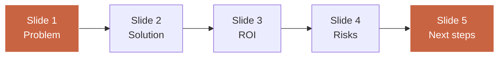

### Slide 1 — Problem (2 minutes)

You open with **the business problem**, not with the AI solution. The problem must be expressed in a short sentence + a figure.

Bad example: "Customer support is slow."
Good example: "Our support handles 4,200 tickets/month, 62% of which are repetitive. Human cost: 185,000 €/year. NPS impact: -8 points on clients waiting over 6h."

### Slide 2 — Solution (3 minutes)

A high-level architecture diagram + 3 key bullets. The diagram must be readable in 15 seconds by a non-tech. No code. No more than 7 boxes.

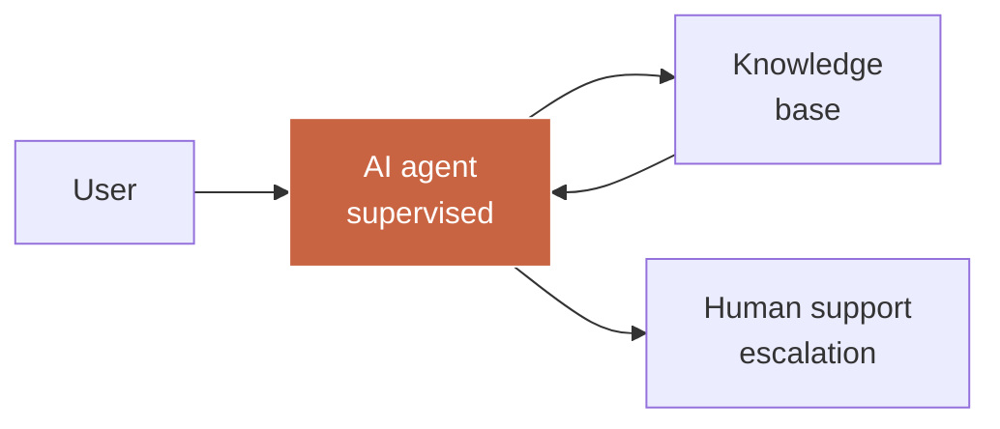

The 3 bullets:

- What the system does autonomously.
- What the system does not do and routes to a human.
- What the system learns over time.

### Slide 3 — ROI (2 minutes)

| Dimension | Year 1 | Year 2 | Year 3 |
|-----------|--------|--------|--------|
| System cost | 72,000 € | 90,000 € | 108,000 € |
| Human savings | 120,000 € | 180,000 € | 220,000 € |
| Revenue gains (upsell via NPS) | 60,000 € | 140,000 € | 240,000 € |
| Cumulative ROI | 2.5x | 4.6x | 6.1x |

This table does the work. The board understands in 30 seconds. You must be able to defend every number if challenged.

### Slide 4 — Risks (3 minutes)

5 risks max, each with its mitigation. No more. No less.

| Risk | Impact | Mitigation |
|------|--------|------------|
| Hallucination charged to client | Complaint, dispute | Human supervision on first 100 tickets, weekly audit set |
| LLM vendor dependency | Lock-in, price hike | Model-agnostic architecture via Anthropic + OpenAI fallback |
| Sensitive data leak | GDPR, reputation | No PII sent to LLM, internal embeddings |
| Quality degradation over time | Satisfaction drop | Quality dashboard, alert at -5% helpfulness |
| Support team rejection | Cultural resistance | Pilot with 2 volunteers, transparency on role |

### Slide 5 — Next steps (2 minutes)

A clear ask. Max three options. A timeline.

| Option | Investment | Deadline | Decision required today |
|--------|-----------|----------|-------------------------|
| 90-day pilot | 45,000 € | T+90 days | GO/NOGO on pilot |
| Full implementation | 180,000 € | T+180 days | GO conditional on pilot results |
| Do nothing | 0 € | — | Opportunity cost 200,000 €/year |

"Do nothing" has a cost. Making it visible is the most effective closing technique.

## 5.3 — The 7 questions every board asks

You must have ready answers for these 7 questions. If you do not, postpone the pitch.

| # | Question | Answer structure |
|---|----------|------------------|
| 1 | What does it actually cost over 3 years, TCO included? | Detailed TCO table + LLM cost sensitivity |
| 2 | What happens if Anthropic/OpenAI shuts down or doubles prices? | Model-agnostic architecture + scenarios |
| 3 | Who is responsible if AI produces an error costing a client? | Responsibility framework + human supervision + audit trail |
| 4 | Are our competitors already doing this? Better or worse? | 3-competitor benchmark + positioning analysis |
| 5 | How many months before we see a measurable result? | 30/60/90 day milestones + KPI per milestone |
| 6 | What do we do with the team this frees up? | Redeployment plan + upskilling |
| 7 | What is stopping us from starting Monday? | Concrete list of prerequisites (data, stack, team) |

These 7 questions are universal. They will vary by sector, but their structure stays the same. Prepare a 3-5 slide annex you can summon on demand to answer each.

## 5.4 — Pitch simulation with annotated real-world examples

### Example 1 — B2B SaaS, 6-person board

**Context.** B2B SaaS vendor, 180 people, 24 M€ ARR. The CEO wants to understand what AI can concretely bring in 2026. Board: CEO, CFO, COO, VP Sales, VP Product, one external board member.

**What worked.**

- Open with business problem: "Our churn is at 14%, 60% avoidable if detected on time."
- Live demo of the monitoring dashboard (module 4) to show visibility already exists.
- 3-year ROI table itemized.
- Clear ask: 60,000 € for a 90-day pilot.

**Result.** GO on the pilot in the room. Decision taken in 42 minutes.

### Example 2 — Scale-up, investor board

**Context.** Fintech scale-up, 90 people, 12 M€ ARR, recent Series B. Board: 3 investors + CEO + outgoing CTO.

**What did not work.**

- Started with the solution slide (architecture diagram) instead of the problem.
- Mentioned "RAG" and "MCP" without translation.
- No revenue impact figure.
- Vague ask ("we would like to explore several paths").

**Result.** Postponed to next board meeting. 3 months lost.

**Correction.** Redesigned the deck following the 5-slide structure exactly. New pitch 6 weeks later. GO on a 3-month pilot + CAIO hire.

## 5.5 — Deliverable: board pitch template (PowerPoint + PDF)

The deliverable of this module is a PowerPoint template (and PDF export) of 5 main slides + 5 annex slides, with:

- a coherent design (Inter typography, neutral palette + terracotta accent),
- placeholders ready to fill,
- presenter notes under each slide giving you the key points to say,
- 3 pitch variants (90-day pilot, full implementation, audit only).

This template reuses at every client in under an hour of customization.

## Module 5 key points

- The CAIO pitch fits in 5 slides + 5 annexes. No more. Ever.
- Structure: Problem → Solution → ROI → Risks → Next steps.
- 7 questions every board asks, to be prepared in advance.
- Never start with technical. Always with the business problem.
- "Doing nothing" has an opportunity cost. Making it visible is the most effective closing technique.
- The reusable template saves you 15 to 20 hours per pitch.

---

# Module 06 — Build your Fractional CAIO offering

**Duration: 1h30 · Format: packaging + pricing + profile page**

## Module objectives

By the end of this module, you will be able to:

1. Package three Fractional CAIO offerings (audit, implementation, oversight) with fixed deliverables and durations.
2. Set your CAIO daily rate justifying it with market, delivered value, and positioning.
3. Create a public CAIO profile page in under an hour, with the 6 essential sections.
4. Position yourself as Chief AI Officer available for missions without having to justify yourself.
5. Pre-qualify your prospects before the first call.

## 6.1 — From CTO to Fractional CAIO

Fractional CAIO is the most profitable format for a senior CTO wanting to monetize his AI expertise without full-time commitment to a single employer. Principle: you are Chief AI Officer for several companies in parallel, 2 to 4 days a week each, for 3 to 12-month missions.

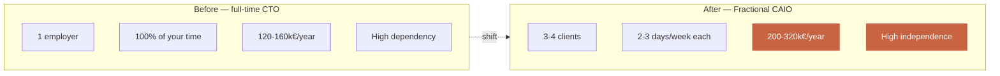

Fractional CAIO has three advantages over salaried CAIO:

| Dimension | Salaried CAIO | Fractional CAIO |
|-----------|---------------|------------------|
| Gross income | 160-240k€/year | 200-360k€/year |
| Variability | Low | Medium |
| Time on one mission | 100% | 30-50% |
| Experience diversity | Low | Very high |
| Concentration risk | High (1 employer) | Low (3-4 clients) |
| Freedom of opinion | Medium | High |

## 6.2 — The 3 packaged CAIO offerings

Do not offer 10. Offer 3. One for each phase of the client cycle.

### Offering 1 — CAIO Flash Audit (entry)

| Item | Detail |
|------|--------|
| Duration | 2 calendar weeks |
| Deliverables | 90-min audit report + 4-layer mapping + opportunity matrix + 90-day plan |
| Pricing | 4,500 € ex-VAT (fixed) |
| Goal | Plant a foot at the client, demonstrate value, open the door to offering 2 |
| Expected conversion to offering 2 | 60-75% |

### Offering 2 — AI System Implementation (core)

| Item | Detail |
|------|--------|
| Duration | 3 to 4 months |
| Deliverables | 1 complete AI system (architecture + code + monitoring + docs) + team training |
| Pricing | 35,000 to 85,000 € ex-VAT depending on complexity |
| Goal | Deliver a measurable business result, build trust for offering 3 |
| Expected conversion to offering 3 | 40-55% |

### Offering 3 — Fractional CAIO oversight (recurring)

| Item | Detail |
|------|--------|
| Duration | 6 to 12-month renewable contract |
| Deliverables | 2 to 3 days/week on AI strategic oversight: board meetings, arbitration, team mentoring, roadmap |
| Pricing | 12,000 to 18,000 € ex-VAT/month |
| Goal | Recurring revenue + long-term strategic position |
| Upsell conversion | 25-40% (additional one-off projects) |

### CAIO commercial funnel

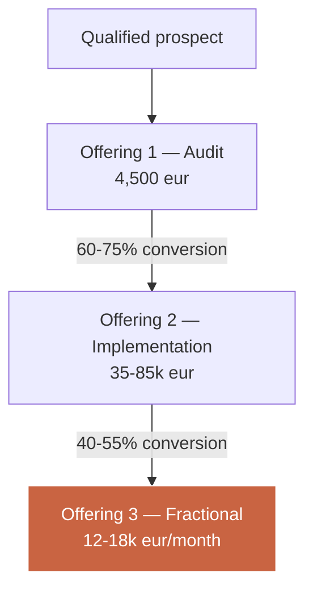

Average lifetime value (LTV) calculation:
- Offering 1 — 4,500 €
- Offering 2 — 60,000 € average (67% conversion) = 40,200 €
- Offering 3 — 15,000 €/month × 9 months average × 47% conversion = 63,450 €

**Average LTV per signed qualified prospect: 108,150 € ex-VAT.**

This metric changes everything. It justifies aggressive customer acquisition cost (2,000 to 4,000 € per qualified prospect) and an ambitious content/positioning strategy.

## 6.3 — Set your CAIO daily rate

Three logics coexist to set a CAIO daily rate. You must know them all to defend your number.

### Logic 1 — Market benchmark

| Level | Europe daily rate (€ ex-VAT) | US daily rate ($ ex-VAT) |
|-------|------------------------------|---------------------------|
| Junior Fractional CAIO (< 2 years strategic AI) | 900-1,200 | 1,200-1,800 |
| Confirmed Fractional CAIO (2-5 years) | 1,200-1,800 | 1,800-2,800 |
| Senior Fractional CAIO (5+ years, public references) | 1,800-2,500 | 2,800-4,500 |
| Star CAIO (recognized author, keynote speaker) | 2,500-4,000+ | 4,500-8,000+ |

### Logic 2 — Delivered value

A project that generates 300,000 €/year for a client can justify 60,000 € billing (20% of year-1 value generated). If you deliver in 8 person-weeks, your implicit daily rate is 1,500 €.

### Logic 3 — Positioning and rarity

A CAIO with a credible public portfolio, articles, a podcast, nameable references, can bill 50-100% above the benchmark for his objective level.

### My recommendation for Thomas (starting SaaS CTO)

- Flash Audit daily rate (fixed): equivalent 1,400 €/day
- Implementation daily rate: 1,300-1,600 €/day depending on complexity
- Fractional oversight daily rate: 1,500-1,800 €/day

90-day objective target: 1,500 € weighted average daily rate.

## 6.4 — Create your CAIO profile page in 1h

A public CAIO profile page does not look like a CV. It looks like a commercial landing page. It contains 6 non-negotiable sections.

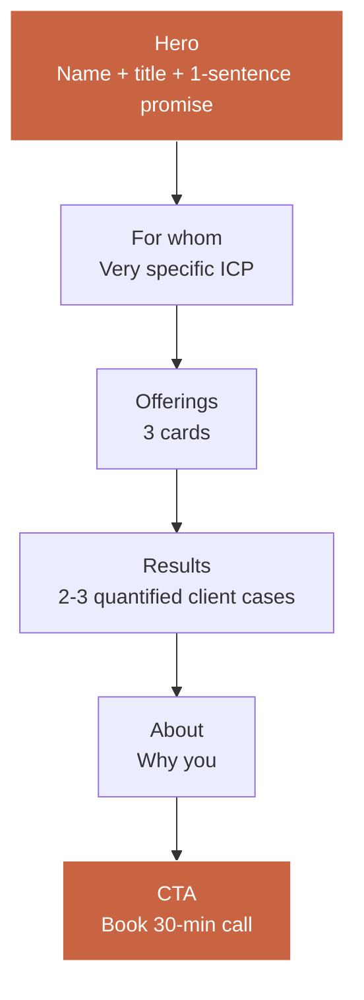

| Section | Target length | Pitfalls to avoid |
|---------|---------------|--------------------|
| Hero | 1 sentence + 1 subtitle | Never "passionate about AI", always "I help [ICP] achieve [quantified result]" |
| For whom | 3-5 ICP bullets | Not generic — sector + size + stage |
| Offerings | 3 priced cards | Display prices if you want to pre-qualify |
| Results | 2-3 quantified client cases | No case study = no credibility |
| About | 150-300 words | No linear CV — focus on the transformation you lived |
| CTA | Calendly/cal.com button | One single CTA, not 3 |

### Example hero for Thomas

> **Thomas — Fractional Chief AI Officer.**
> I help B2B SaaS of 50 to 500 people transform their technical expertise into AI strategy drivable by their board. Specialty: AI monitoring, multi-agent orchestration, quantified ROI.

In one sentence: who I am, who I work with, what I do differently.

## 6.5 — Pre-qualification before the first call

A 300 €/h CAIO call is not given to just anyone. You pre-qualify via an upstream form with 5 mandatory questions.

| Question | What it reveals |
|----------|-----------------|
| Company size (employees, ARR) | ICP fit |
| AI maturity stage (0/1/2/3) | Offering to propose (Audit vs Implem vs Oversight) |
| 2026 AI budget | Ability to pay |
| Decision horizon (< 30d, < 90d, > 90d) | Urgency |
| Who decides (you alone, exec committee, board) | Sales cycle complexity |

Prospects who do not fill this form or answer "I don't know" to 3 of 5 questions do not pass to a call. You save 8 to 12 hours per week.

## 6.6 — Deliverable: Fractional CAIO offering template

The deliverable is a complete kit:

- 1 CAIO profile page in Next.js (to host on your domain),
- 3 one-pager PDFs (Audit, Implementation, Oversight) ready to send,
- 1 Fractional CAIO framework contract (FR) to customize,
- 1 pre-qualification form (Tally or equivalent),
- 1 prospect email sequence (3 emails post-form).

Install time: 1h30 customization, 30 min deployment.

## Module 6 key points

- Package 3 offerings: Audit, Implementation, Oversight. No more.
- LTV per signed qualified prospect: 108,150 € ex-VAT. Changes your acquisition strategy.
- CAIO daily rate defendable by stacking 3 logics: benchmark, delivered value, positioning.
- Profile page = 6 non-negotiable sections. Never a linear CV.
- Pre-qualification = 5 mandatory questions. You save 8-12h/week.

---

# Module 07 — Sell systems, not time

**Duration: 1h00 · Format: pricing theory + product sheet + annotated examples**

## Module objectives

By the end of this module, you will be able to:

1. Identify the structural difference between selling hourly service and selling a fixed-price system.
2. Price an AI System by combining created value and production cost.
3. Create your first "AI System" product sheet that sells without you.
4. Disconnect your income from your hours.
5. Build a portfolio of packaged systems that become your recurring commercial assets.

## 7.1 — Why move from time to system

Selling your time has a hard ceiling: there are 220 working days in a year. If your daily rate is 1,500 €, you mechanically cap at 330,000 € / year, excluding charges. Beyond that, you must either hire (and become a boss), or sell something other than hours.

Selling a system has a ceiling ten times higher. Because a system, once built, can be delivered to several clients with low marginal cost. You amortize the design effort across multiple sales.

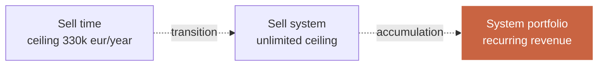

## 7.2 — The difference between service and system

| Dimension | Service (time) | System (product) |
|-----------|----------------|-------------------|
| Unit of sale | Hour, day, month | Defined deliverable |
| Pricing | Daily rate × duration | Fixed price |
| Client risk | Cost drifts with time | Fixed cost |
| Provider risk | Client pays even if slow | Penalty if slow |
| Margin | Linear | Grows with reuse |
| Scalability | Limited | High |
| Client relationship | Dependent (micro-management) | Partnership (result) |

The shift from one to the other happens in stages: first you offer a fixed price for a small deliverable (e.g. audit), then you package a more complete deliverable (e.g. AI System implementation), then you accumulate multiple systems in a catalog.

## 7.3 — System pricing: value vs cost

Two logics are in tension.

### Logic 1 — Value-based pricing

You bill a percentage of created value. Industry standard: 15 to 25% of year-1 value.

Example: a churn detection system saving 300,000 € per year → bill 45,000 to 75,000 €.

### Logic 2 — Cost-plus pricing

You compute your production cost (person-days × internal daily rate + infra + risk) and apply a margin.

Example: 8 person-days × 1,400 € daily rate = 11,200 € direct cost, × 2.5 (margin + risk) = 28,000 €.

### Logic 3 — Hybrid

You take the max of both. If value-based = 60,000 € and cost-plus = 28,000 €, you bill 60,000 € (it is what the client is willing to pay and what it is economically worth).

### System pricing matrix

| System type | Year-1 value (estimated) | Production cost | Target price | Gross margin |
|-------------|--------------------------|-----------------|--------------|--------------|
| AI monitoring light | 30,000 € | 8,400 € | 15,000 € | 44% |
| AI monitoring full | 80,000 € | 24,000 € | 40,000 € | 40% |
| Level-1 support agent | 180,000 € | 36,000 € | 60,000 € | 40% |
| Client onboarding agent | 150,000 € | 33,000 € | 55,000 € | 40% |
| Lead scoring pipeline | 250,000 € | 45,000 € | 80,000 € | 44% |
| Churn detection | 300,000 € | 50,000 € | 90,000 € | 44% |
| ROI CAIO dashboard | 60,000 € | 18,000 € | 30,000 € | 40% |

Rule of thumb: aim for 40-50% gross margin on each system. Below, you get trapped by real maintenance cost. Above, you risk losing the sale.

## 7.4 — Create an AI System product sheet

An AI System product sheet fits on 2 PDF pages. It sells by email, without you in the loop. Here is its structure.

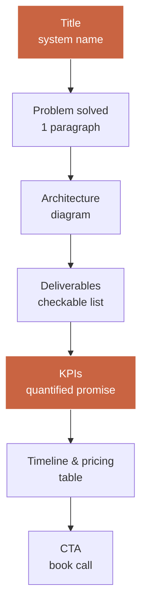

| Section | Length | Example (for a level-1 support agent) |
|---------|--------|----------------------------------------|
| Title | 1 line | "Level-1 Support Agent — Supervised automatic reply" |
| Problem solved | 60-100 words | "60% of your support tickets are repetitive. Your team spends 1,500 h/year answering questions already handled…" |
| Architecture | 1 diagram | Mermaid diagram 5 boxes max |
| Deliverables | 6-10 items | Deployed agent, indexed KB, admin UI, monitoring, docs, 2h team training |
| KPIs | 3-5 metrics | -50% human-handled tickets, NPS +6 points, cost/ticket -65% |
| Timeline & pricing | Table | 6 weeks — 55,000 € ex-VAT — payment 40/30/30 |
| CTA | 1 button | "Book a 30-min qualification call" |

### Annotated example — Product sheet "Level-1 Support Agent"

**Problem solved.** 60% of your support tickets concern 20% of topics. Your team spends 1,500 hours a year answering the same thing. Result: NPS declining, support cost rising, resolution time frustrating your best clients. Our Level-1 Support Agent automatically resolves repetitive tickets, under human supervision, with an expected resolution rate of 62%.

**Deliverables.**
- Conversational agent deployed on your stack (Intercom, Zendesk, custom).
- Knowledge base indexed (RAG) from your existing documentation.
- Admin interface to review and improve answers.
- Monitoring dashboard (volume, cost, latency, quality, escalation rate).
- Technical documentation + support team playbook.
- 2h training for your support team.
- Post-deploy follow-up 4 weeks (1h/week).

**KPIs at 90 days.**
- Automatic resolution ≥ 60% of incoming level-1 tickets.
- Support NPS ≥ +5 points vs baseline.
- Cost per resolved ticket -60% vs baseline.
- Zero hallucination charged to client (contractual guarantee).

**Timeline & pricing.**

| Phase | Duration | Milestones | Payment |
|-------|----------|-----------|---------|
| Design + setup | 2 wks | Architecture validated, RAG indexed | 40% |
| Build + deploy | 3 wks | Agent in prod on 20% traffic | 30% |
| Ramp-up + handover | 1 wk | 100% traffic, team trained | 30% |
| **Total** | **6 wks** | | **55,000 € ex-VAT** |

## 7.5 — Build a system catalog

The 12-month goal is to have a catalog of 5 to 8 packaged systems. Each has its sheet, price, deliverables, KPIs. You sell them individually or bundled.

| Month-12 target catalog | Price | Expected sales over 12 months |
|-------------------------|-------|-------------------------------|
| CAIO Flash Audit | 4,500 € | 12-18 |
| AI monitoring light | 15,000 € | 6-10 |
| AI monitoring full | 40,000 € | 2-4 |
| Level-1 support agent | 55,000 € | 2-3 |
| Onboarding agent | 55,000 € | 1-2 |
| Lead scoring pipeline | 80,000 € | 1-2 |
| Churn detection | 90,000 € | 1 |
| ROI dashboard | 30,000 € | 2-3 |

Projected year-1 catalog revenue (low assumption): 380,000 €.
Projected year-1 catalog revenue (high assumption): 620,000 €.

## 7.6 — Deliverable: blank product sheet + annotated example

The deliverable is:
- 1 AI System product sheet template (Markdown + PDF export).
- 1 filled example (Level-1 Support Agent).
- 1 validation checklist "is my sheet ready to send?" (7 criteria).

## Module 7 key points

- Selling time caps at 330 k€/year. Selling systems has no cap.
- Hybrid pricing: take the max between value-based (15-25% of year-1 value) and cost-plus (× 2.5 production cost).
- Product sheet = 2 pages, 7 sections, sells by email without you.
- 12-month goal: 5 to 8 systems in catalog.
- Projected year-1 catalog revenue: 380,000 to 620,000 € ex-VAT.

---

# Module 08 — Your 90-day plan to the first €10k CAIO

**Duration: 1h00 · Format: roadmap + 3 possible paths + bridge to core program**

## Module objectives

By the end of this module, you will be able to:

1. Execute a 30/60/90-day checklist leading to your first €10k CAIO revenue.
2. Choose between three coherent career paths: internal, freelance, founding.
3. Identify the bottlenecks that block 80% of CTOs at this stage.
4. Decide whether to solo-build the next two systems (orchestration + ROI dashboard) or take the core program to have them turnkey.
5. Sign your personal transformation commitment.

## 8.1 — 30 / 60 / 90 day checklist

### Day 0-30 — Foundations

| Week | Goal | Concrete deliverable |
|------|------|----------------------|
| W1 | Posture + personal audit | Self-audit filled, 3 CTO postures integrated |
| W2 | Audit grid tested on current employer | Mini-audit report on your company (or a volunteer CTO friend) |
| W3 | CAIO profile page online | Public URL `yourname.com/caio` |
| W4 | Light monitoring deployed + announcement LinkedIn post | Public dashboard (or 5-min Loom) + LinkedIn post generating 5-10 DMs |

### Day 31-60 — Acquisition

| Week | Goal | Concrete deliverable |
|------|------|----------------------|
| W5 | 5 discovery conversations with qualified prospects | 5 structured call notes |
| W6 | 1 Flash Audit sold at 4,500 € | First CAIO cash signed |
| W7 | Audit delivery + publishable (anonymized) report | Public case study (LinkedIn + profile page) |
| W8 | System-1 product sheet published (e.g. AI monitoring full) | Sheet sent to 10 post-audit prospects |

### Day 61-90 — Scale

| Week | Goal | Concrete deliverable |
|------|------|----------------------|
| W9 | 2 additional Flash Audits signed | 9,000 € additional |
| W10 | 1 implementation signed (offering 2) | 35-55,000 € additional |
| W11 | 1 Fractional conversation engaged | 6-month contract proposal sent |
| W12 | 90-day review + decision: continue solo or core program | Strategic decision |

### 90-day revenue trajectory

| Period | Cumulative expected revenue (median assumption) |
|--------|-------------------------------------------------|
| End month 1 | 0 € (investment) |
| End month 2 | 4,500 € (first audit) |
| End month 3 | 48,500 € (2 audits + 1 implementation started) |

The first €10k CAIO typically arrives between week 6 and week 9. You reach 40-60k€ cumulative by end month 3 if you execute with discipline.

## 8.2 — The 3 possible paths

You are not required to go 100% freelance. There are 3 coherent post-track paths, each valuing what you just learned.

```mermaid
flowchart LR
    P[Complete<br/>track]
    P --> I[Internal Path<br/>Become CAIO at current employer]
    P --> F[Freelance Path<br/>Fractional 3-4 clients]
    P --> C[Founding Path<br/>Start your AI studio]

    style I fill:#3a3a3a,stroke:#fff,color:#fff
    style F fill:#c96442,stroke:#fff,color:#fff
    style C fill:#8b4a2b,stroke:#fff,color:#fff
```

### Path 1 — Internal: become CAIO at your employer

**Target profile.** You are CTO at a healthy company, the CEO listens, you want to evolve without leaving.

**90-day actions.**
- Week 1: pitch the board "I want to evolve toward the CAIO role, here's why, here's what I deliver in 90 days."
- Weeks 2-12: deliver 2 systems (monitoring + one business system) + 1 board pitch + 1 AI governance plan.
- Salary negotiation at quarter-end based on results: +20 to +40% base, additional equity, new title.

**12-month target income:** 180-240 k€/year (vs 120-160 k€ before).

### Path 2 — Freelance: Fractional CAIO 3-4 clients

**Target profile.** You want independence, diversity, and fast skill growth across multiple sectors.

**90-day actions.**
- Leave or renegotiate current position (notice, side-hustle during transition).
- Deploy the Fractional CAIO offering (module 6).
- Sign 2-3 missions within 90 days.

**12-month target income:** 220-360 k€/year (depending on daily rate and fill rate).

### Path 3 — Founding: create an AI studio

**Target profile.** You want to build an asset, not just sell hours. You have a clear product idea or want to package your systems into SaaS.

**90-day actions.**
- Legal structure (SAS, Ltd, etc.).
- Month 1: 1 Flash Audit to generate cash.
- Months 2-3: first internal MVP of a system you already sell as service, transformed into product.
- Recruit first co-founder or first dev.

**12-month target income:** highly variable — 0 to 500 k€+ depending on product trajectory. The riskiest path and the highest potential.

## 8.3 — The 3 classic bottlenecks and their remedies

| Bottleneck | Why it blocks 80% of CTOs | Remedy |
|------------|----------------------------|--------|
| CTO does not prospect | That is not your job, you code | Block 3h/week for 10 DMs + 5 LinkedIn posts. Discipline, not talent. |
| CTO underprices | Impostor syndrome + fear of losing deal | Your minimum daily rate is written before the call. You never negotiate live. You send a product sheet. |
| CTO keeps selling time | It is what he knows | Each quarter, package one more system. In 12 months, 4 systems in catalog. |

## 8.4 — The bridge to the €2,000 core program

This track gave you:
- The strategic foundation (modules 1, 2, 5, 6, 8).
- A light version of the monitoring system (module 4).
- The architecture and methodology to design other systems (modules 3, 7).

What it did not give you, but the core program does:

| Core module | What you get extra |
|-------------|--------------------|
| Full build of system 2 — multi-agent orchestration | Production-ready template (Claude + MCP + Composio), multi-agent dispatcher, state management, end-to-end tests |
| Full build of system 3 — ROI CAIO dashboard | Feature-level business modeling, executive charts, automatic PDF reports, Slack alerting |
| All full system templates | 8 ready-to-sell product sheets, framework contracts, closing scripts, email sequences |
| Board simulation with coaching | 3 pitch sessions on real cases, individual feedback, deck correction |
| CAIO community access | Network of 80+ active CAIOs, monthly sessions, shared mission opportunities |
| 3-month post-program support | 1 monthly call, async Q&A, review of your first 3 client pitches |

The core program is 2,000 € VAT-included. It is for CTOs who have executed this track and want to accelerate over the next 6 months rather than learn by trial and error.

**Decision to make at end of week 12.** Continue solo over the next 9 months, or join the core program cohort to compress learning time.

## 8.5 — Deliverable: personal 90-day roadmap

The final deliverable is your personal document, filled, containing:

- Your 12 concrete weekly goals (1 per week).
- Your 3 tracking KPIs (qualified prospects, proposals sent, signed revenue).
- Your chosen path (internal / freelance / founding).
- Your post-week-12 decision on the core program.
- Your personal commitment signature (re-read each Monday morning).

### Personal commitment template

```
I, [Name], on [date], commit for the next 90 days to:

1. Execute the 30/60/90 checklist without negotiation.
2. Produce publicly at least 1 deliverable per week.
3. Hold 3 h / week blocked for prospecting.
4. Not discount my minimum daily rate set at: _______ eur / day.
5. Take my decision on the core program no later than [week-12 date].

Signed: ___________________________
```

## Module 8 key points

- The first €10k CAIO arrives between week 6 and 9 if you execute the checklist.
- Three valid paths: Internal (salaried CAIO), Freelance (Fractional), Founding (studio).
- Three classic bottlenecks: prospecting, pricing, time-selling addiction.
- The 2,000 € core program saves you 6 months. It is optional, not mandatory.
- Your signed personal commitment is the real deliverable. The rest is tooling.

---

# Synthesis — What Thomas masters at the end of the track

In 12 structured hours, you moved from a CTO shipping AI to a CAIO driving an AI strategy. Here is what you master now, point by point.

| Skill | Level before | Level after | Concrete proof |
|-------|--------------|-------------|----------------|
| Audit an organization in 90 minutes | 0 | Operational | Audit grid + filled example |
| Pitch an AI system to a board without jargon | 1 | Operational | 5-slide deck + 12-min script |
| Structured Fractional CAIO offering | 0 | Deployed | Profile page + 3 packaged offerings |
| Understand selling system ≠ selling time | 1 | Integrated | Product sheet + catalog in progress |
| Access to 1 light template system | 0 | Deployed | AI monitoring light in prod |
| 4-layer organization reading | 0 | Mastered | Client mapping delivered |
| Full AI system architecture | 2 | Operational | Notion + Figma template |
| Clear 90-day plan | 0 | Signed | Personal roadmap + commitment |

You do not have a certificate. You have **an operational kit** that lets you shift register starting Monday.

---

# Appendix A — CAIO glossary

| Term | Short definition |
|------|-------------------|
| Agent | LLM execution unit with role, system prompt, and tools. |
| Flash Audit | 90-minute CAIO audit producing 5-7 prioritized opportunities. |
| CAIO | Chief AI Officer, strategic AI leader of an organization. |
| Capability | Reusable action potential by the AI system (vs isolated feature). |
| Layer (4 layers) | Data, Process, Decision, Interface — organization-reading framework. |
| Embedding | Vector representation of content for semantic search. |
| Evaluation (eval) | Systematic measurement of AI output quality. |
| Fractional | Part-time mission format (2-3 days/week across multiple clients). |
| Hallucination | AI response factually wrong produced with confidence. |
| LLM-as-a-judge | Use of an LLM to score outputs from another LLM. |
| MCP | Model Context Protocol, interoperability standard between LLM and tools. |
| Memory (short/long) | Session memory vs persistent structured memory + embeddings. |
| AI Monitoring | Real-time dashboard of AI metrics (volume, cost, latency, quality). |
| Orchestrator | Component deciding which agent/tool to call based on context. |
| RAG | Retrieval Augmented Generation — search + generation. |
| Monthly ROI | Ratio of value generated / total operating cost of system. |
| CAIO 2026 stack | Next.js 16 + Convex + Claude API + Clerk + Composio + Trigger.dev + Vercel. |
| Tool use | LLM ability to call external functions during reasoning. |
| Trigger | Event starting an AI system (webhook, cron, user action). |
| Value-based pricing | Billing as a percentage of generated economic value. |
| Vector store | Vector database indexing embeddings for semantic search. |

---

# Appendix B — Full 90-day checklist

### Week 1
- [ ] Posture self-audit filled and signed.
- [ ] Modules 1 and 2 reading completed.
- [ ] Audit grid printed and in your workflow.

### Week 2
- [ ] Dry-run audit done on current employer or volunteer CTO.
- [ ] Mini audit report produced (6-8 pages).
- [ ] Module 3 completed.

### Week 3
- [ ] CAIO profile page designed (Figma).
- [ ] CAIO profile page deployed (Next.js + personal domain).
- [ ] Module 4 started.

### Week 4
- [ ] AI monitoring light deployed on personal domain.
- [ ] Announcement LinkedIn post published (goal 5-10 DMs).
- [ ] Module 5 started.

### Week 5
- [ ] CAIO pitch deck customized.
- [ ] 5 prospect conversations scheduled.
- [ ] Module 6 started.

### Week 6
- [ ] First Flash Audit sold at 4,500 €.
- [ ] Contract signed, deposit received.
- [ ] Module 7 started.

### Week 7
- [ ] Sold audit delivery.
- [ ] Anonymized case study published.
- [ ] Module 8 started.

### Week 8
- [ ] System-1 product sheet finalized.
- [ ] Product sheet sent to 10 post-audit prospects.
- [ ] All modules completed.

### Week 9
- [ ] 2nd and 3rd Flash Audits signed.
- [ ] Cumulative revenue ≥ 13,500 €.

### Week 10
- [ ] 1st implementation signed (offering 2).
- [ ] Deposit received.

### Week 11
- [ ] 1st Fractional conversation engaged.
- [ ] 6-month contract proposal sent.

### Week 12
- [ ] 90-day review written.
- [ ] Core program decision taken.
- [ ] Month 4-6 roadmap laid out.

---

# Appendix C — Additional resources

### Readings

| Book | Author | Why |
|------|--------|-----|
| The Hard Thing About Hard Things | Ben Horowitz | Decision posture under uncertainty. |
| Crossing the Chasm | Geoffrey Moore | Understand technology adoption phases. |
| High Output Management | Andy Grove | Systemic management reflexes. |
| Accelerate | Forsgren, Humble, Kim | Engineering metrics that matter. |
| The Mom Test | Rob Fitzpatrick | Useful client interviews (for CAIO audits). |

### Sources to follow

| Source | Format | Cadence |
|--------|--------|---------|
| Anthropic Engineering Blog | Technical articles | Weekly |
| Simon Willison's blog | Technical LLM notes | Nearly daily |
| Latent Space Podcast | Long-form podcast | Weekly |
| Eugene Yan's blog | Applied ML essays | Monthly |
| Lilian Weng's blog | LLM research | Quarterly |

### Tools to know

| Tool | CAIO use |
|------|----------|
| Claude (API + claude.ai) | Main 2026 LLM |
| Cursor / Claude Code | Agentic IDE |
| Convex | Real-time TypeScript backend |
| Composio | 300+ SaaS integrations |
| Trigger.dev | Long async jobs + cron |
| LangSmith / Langfuse | LLM observability |
| Chroma / Pinecone / Convex vector | Vector stores |
| Vercel | Edge deploy |

---

# Appendix D — FAQ

**Q. How long between the end of the track and my first paying client?**
A. Between 6 and 10 weeks if you execute the 90-day checklist. CTOs who prospect 3h/week starting week 3 typically sign in week 6-8.

**Q. I have no public AI references, how do I handle this?**
A. The AI monitoring light (module 4) deployed on your personal domain is your first reference. You publish an anonymized case study from your dry-run audit (week 2) as second reference. That is enough to sign the first two audits.

**Q. My current employer blocks freelance activity. What do I do?**
A. Negotiate a side-hustle clause or a switch to 4 days/week. Otherwise, follow the Internal Path (section 8.2): become CAIO at your employer before going freelance.

**Q. I am a junior CTO (< 3 years). Is this track for me?**
A. Partially. Modules 1, 2, 4, 5 are directly applicable. Modules 6 and 7 (CAIO offering and pricing) assume 5+ years of experience to be credible at target rates. Consider the Kevin track (From Dev to CAIO) first if you are < 3 years.

**Q. I already work with OpenAI and do not want to switch to Anthropic. Problem?**
A. No. The whole methodology is model-agnostic. Code templates use Claude because it is the Agentik OS 2026 stack and the most solid for tool use in 2026, but you can port everything to GPT-4, Gemini or Llama by swapping the SDK import.

**Q. I am in a large company (> 2000 people). Does the Fractional CAIO offering work?**
A. Yes, but sales cycles are longer (4-8 months). You target divisions or autonomous BUs. To attack this segment, take the core program where this case is detailed in depth.

**Q. Can I teach this track at my company after following it?**
A. No, content is under personal license. You can use templates for your clients. You cannot resell or re-teach.

---

# Conclusion — What awaits you

You close this track with three assets worth more than any certificate:

1. **A bilingual brain.** You shift from a technical vocabulary to a business vocabulary without friction. That is the rarest market skill in 2026.
2. **A deployable operational kit.** Profile page, packaged offering, monitoring in prod, product sheet, pitch deck — all ready to be used at a client starting week 13.
3. **A clear trajectory.** Three coherent paths, an executable 90-day plan, KPIs measurable each week.

The CAIO you will become is not a title. It is an **operational register**. You choose it every week, every meeting, every pitch, by deciding not to slip back into code by default. The track gave you the grammar; daily discipline will make the language.

The only question left: *are you executing?*

If yes, see you in the core program, or in 3 months on your first public case study. If not, reread module 1 once a week until the discomfort forces you to act.

**Agentik {OS} — agentik-os.com**
