# CAIO Academy — AI Systems Architect Track

**Le parcours pour transformer ton expertise technique de CTO en levier business, stratégique et commercial**

**Public cible :** Thomas — CTO SaaS
**Durée du parcours :** 12 heures de contenu structuré
**Systèmes à builder :** 3 (light version incluse, versions complètes en formation core)
**Horizon de transformation :** 90 jours
**Format :** 8 modules de formation professionnelle, templates d'architecture, scripts de pitch, offre Fractional CAIO prête à déployer

**Agentik {OS} — agentik-os.com**

---

## Préface — Pourquoi ce parcours existe

Tu es CTO. Tu sais coder. Mieux : tu sais faire coder les autres, tu sais designer un système, choisir une stack, arbitrer entre la dette technique et la vélocité, recruter, mentorer, tenir un roadmap trimestriel. Tu as probablement déjà livré un ou plusieurs produits SaaS en production. Tu as vu passer plusieurs vagues techniques — mobile, cloud, microservices, serverless. Tu sens celle de l'IA depuis dix-huit mois, et tu l'absorbes comme toutes les autres : par le prisme de l'implémentation.

Et pourtant, quelque chose cloche.

Tu observes que la valeur économique du métier glisse. Les ex-CTOs que tu connais qui se sont repositionnés comme « Chief AI Officer » ou « Head of AI Strategy » ne sont pas forcément meilleurs techniciens que toi. Ils ne connaissent pas mieux les LLMs, ne codent pas plus vite, ne déploient pas des architectures plus élégantes. Ce qu'ils ont fait, c'est **changer de registre**. Ils ont arrêté de vendre leur capacité à livrer pour commencer à vendre leur capacité à *orienter* — à traduire des enjeux business en architectures agentiques, à pitcher une stratégie IA devant un comex sans jargon, à packager leur expertise en offre Fractional facturée 1 500 à 2 500 euros par jour.

Tu as le substrat technique pour faire la même bascule. Ce qui te manque, ce n'est pas une nouvelle librairie, un nouveau framework, un nouveau pattern d'orchestration. Ce qui te manque, c'est **la grammaire** : comment lire une organisation comme un système, comment cartographier ses nœuds d'inefficacité en 90 minutes, comment présenter un projet IA à un board de telle manière que la décision d'investir se prend dans la salle et pas trois semaines plus tard, comment construire une offre CAIO Fractional qui se vende sans que tu aies besoin de courir après des leads.

Ce parcours de 12 heures t'apporte cette grammaire. Pas en théorie — en protocole. À la fin, tu auras :

- un **auto-audit de ta posture actuelle** qui te dit exactement où tu es entre l'exécutant, l'architecte et le stratège,
- une **grille d'audit d'organisation en 90 minutes** que tu pourras déployer chez n'importe quel client,
- un **template d'architecture système** (Notion + Figma) que ton board pourra lire sans avoir besoin d'un traducteur,
- un **système de monitoring IA light** déployé et présentable en 3 jours,
- un **deck de pitch CAIO en 5 slides** que tu pourras adapter en moins d'une heure pour n'importe quel comex,
- une **offre CAIO Fractional packagée** avec trois formules, un pricing justifié, et une page profil prête à mettre en ligne,
- une **fiche produit AI System** qui te permet de facturer un résultat fixe plutôt que des heures,
- une **roadmap 90 jours** avec trois chemins possibles (interne, freelance, création de boîte).

Tu ne sortiras pas de ce parcours avec un certificat. Tu en sortiras avec **un kit opérationnel** qui te permet, dès la semaine suivant la dernière leçon, de te positionner publiquement comme Chief AI Officer et de décrocher ta première mission sans brader ton positionnement.

---

## Avatar — Thomas, CTO SaaS

| Dimension | Profil |
|-----------|--------|
| Âge typique | 32-45 ans |
| Expérience | 8 à 20 ans de dev, dont au moins 3 en tant que CTO ou Head of Engineering |
| Stack habituelle | Node/TypeScript, Python, PostgreSQL, cloud AWS/GCP, Docker, CI/CD mature |
| Rapport à l'IA | A intégré Claude, GPT-4 ou équivalent dans au moins un produit. Connaît le RAG, les embeddings, les tool calls. A déjà mis un agent en prod. |
| Équipe gérée | De 3 à 40 développeurs, souvent 5 à 15 |
| Revenu actuel | 90-160k€ en CDI ; 700-1100€/jour en freelance |
| Frustration principale | « Je livre de l'IA utile en interne mais le board m'entend comme un exécutant, pas comme un stratège » |
| Peur profonde | « On va me remplacer par un profil business+IA qui parlera mieux à mon CEO que moi » |
| Rêve accessible | Être reconnu comme CAIO, facturer 1 500-2 500€/jour en Fractional, ou viser un poste CAIO/CTO senior à 180-280k€/an |
| Signal d'achat | A déjà investi dans du coaching exécutif, un MBA partiel, ou des formations stratégiques (BCG Academy, HEC Executive, Reforge) |
| Blocage principal | Sait construire, ne sait pas encore *vendre* le système qu'il construit |

Thomas n'est pas un débutant. Il n'a pas besoin qu'on lui explique ce qu'est un prompt, un token, ou un embedding. Il a besoin qu'on lui montre comment **traduire ce qu'il sait déjà en offre, en pitch, en positionnement**. Ce parcours part de ce postulat et ne perd pas de temps sur les fondamentaux techniques de l'IA — il les assume et saute directement au niveau stratégique.

---

## Vue d'ensemble du parcours

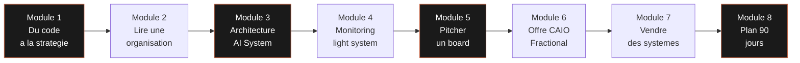

Chaque module produit un livrable directement utilisable dans un contexte client. Les modules 1 et 2 sont en semaine 1 (orientation et audit). Les modules 3 et 4 sont en semaine 2 (architecture et monitoring). Les modules 5 et 6 sont en semaine 3 (pitch et offre). Les modules 7 et 8 sont en semaine 4 (vente et plan).

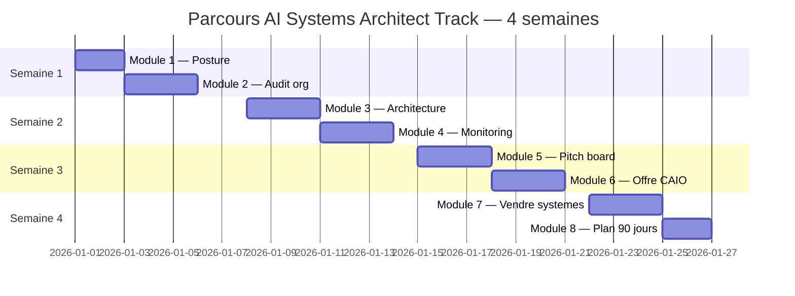

| Module | Durée | Livrable principal | Impact attendu |
|--------|-------|--------------------|----------------|
| 01 — Du code à la stratégie | 1h00 | Auto-audit de posture CAIO | Clarté sur la trajectoire |
| 02 — Lire une organisation comme un système AI | 1h30 | Grille d'audit 90 min + exemple rempli | Capacité à auditer un client en 1 session |
| 03 — Architecture d'un AI System de A à Z | 2h00 | Template d'architecture (Notion + Figma) | Schémas lisibles par un board |
| 04 — Monitoring AI : ton premier système | 2h30 | Système template light (Convex + Next.js + Claude) | Démo live en 3 jours |
| 05 — Pitcher l'AI à un board | 1h30 | Deck 5 slides + script 12 minutes | Board convaincu en une réunion |
| 06 — Construire ton offre CAIO Fractional | 1h30 | Offre packagée (3 formules + pricing + page profil) | Prospects qualifiés en pipeline |
| 07 — Vendre des systèmes, pas du temps | 1h00 | Fiche produit AI System + pricing | Revenus récurrents plus élevés |
| 08 — Plan 90 jours vers le premier €10k CAIO | 1h00 | Roadmap 30/60/90 personnelle | Premier cash CAIO dans les 90 jours |

---

# Module 01 — Du code à la stratégie

**Durée : 1h00 · Format : lecture structurée + auto-audit en fin de module**

## Objectifs du module

À la fin de ce module, tu seras capable de :

1. Articuler la différence entre « développer de l'IA » et « piloter une stratégie IA » en une phrase, sans jargon.
2. Cartographier ce que ton board attend de toi que tu ne livres pas encore — et pourquoi.
3. Situer ta posture actuelle sur le spectre Exécutant / Architecte / Stratège.
4. Identifier les trois déplacements de pensée qui séparent un CTO technique d'un CAIO stratégique.
5. Remplir ton auto-audit de posture et en déduire ton levier prioritaire pour les trois prochains mois.

## 1.1 — Le gap entre « je développe de l'IA » et « je pilote une stratégie AI »

La plupart des CTOs qui liront ces pages ont déjà livré de l'IA en production. Un chatbot intégré au produit, un moteur de recommandation, un pipeline RAG sur la documentation interne, un agent de qualification de leads. Ils maîtrisent la chaîne technique : prompt, modèle, embeddings, vector store, orchestration, évaluation. Et pourtant, quand leur CEO leur demande *« quelle est notre stratégie IA à 18 mois ? »*, ils répondent par un inventaire d'outils, un roadmap feature, parfois un tableau Excel de cas d'usage priorisés.

Ce n'est pas une stratégie. C'est un backlog.

Une stratégie IA répond à des questions d'ordre supérieur :

- **Quel problème de l'organisation l'IA résout-elle mieux qu'aucune autre technologie ?**
- **Quelle capacité différenciante l'IA nous permet-elle de construire, que nos concurrents ne pourront pas répliquer en 12 mois ?**
- **Où est le goulot d'étranglement organisationnel que l'IA peut débloquer pour libérer 10x de valeur sur une équipe existante ?**
- **Quel est notre coût d'opportunité si on n'investit pas dans cette capacité maintenant ?**
- **Quels risques (données, conformité, dépendance vendor, qualité) devons-nous cartographier et comment les gouvernons-nous ?**

Un CTO technique répond à la question *comment*. Un CAIO stratégique répond à la question *pourquoi*, et il la pose avant que le CEO ne la lui pose.

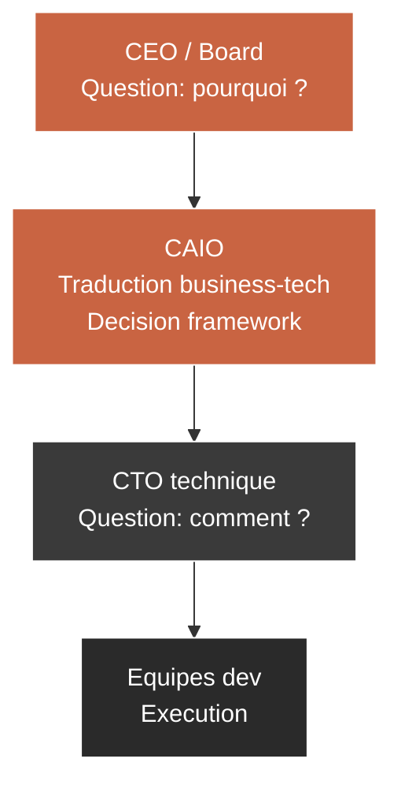

La place du CAIO est entre le CEO et le CTO. Il parle les deux langues. Il peut passer d'un vocabulaire de tokens par seconde à un vocabulaire de marge brute sans friction cognitive. C'est ce qui le rend rare, et donc cher.

## 1.2 — Cartographie : ce que ton board attend que tu ne livres pas encore

Un board de SaaS B2B a cinq attentes récurrentes vis-à-vis de son lead IA. Voici la cartographie, croisée avec ce qu'un CTO technique livre spontanément.

| Attente board | Livré par un CTO technique | Attendu d'un CAIO |
|--------------|----------------------------|-------------------|
| Vision IA à 18 mois | Liste de features IA priorisées | Narratif stratégique en 3 horizons (quick wins, capacités, moat) |
| ROI mesurable par initiative | Temps dev estimé | Modèle d'impact (revenue, coût évité, marge) + hypothèses testables |
| Cartographie des risques | Liste de bugs potentiels | Matrice risques (data, légal, dépendance, qualité, réputation) avec mitigations |
| Gouvernance et conformité | « On est RGPD compliant » | Framework de gouvernance AI (data, modèles, évaluation, audit trail) |
| Trajectoire concurrentielle | « Tel concurrent a sorti telle feature » | Analyse positionnement + moat défendable |

Le board ne te demande pas d'être ingénieur. Il te demande d'être **traducteur entre le monde technique et le monde de la décision**. Si tu livres seulement le premier quadrant du tableau ci-dessus, tu es perçu comme exécutant, quel que soit ton titre officiel.

## 1.3 — Les trois postures du CTO face à l'AI

Il existe trois postures possibles pour un CTO face à l'IA. Elles ne sont pas mutuellement exclusives — tu peux basculer de l'une à l'autre selon le contexte — mais ton revenu et ton influence sont dictés par la posture où tu passes la majorité de ton temps.

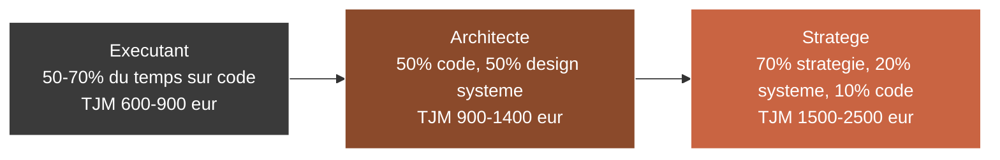

**L'Exécutant.** Il code les features IA. Il maîtrise les appels API, les prompts, les pipelines RAG. Son impact est proportionnel à ses heures. Il scale mal parce qu'il se vend à l'heure ou au ticket. Il est utile, mais commoditisable : un autre CTO technique peut le remplacer avec un mois d'onboarding.

**L'Architecte.** Il dessine le système avant de le coder. Il réfléchit aux contraintes (budget, équipe, délai, scale) et produit une architecture défendable. Il fait coder les autres, ou il code seulement la partie critique. Il scale mieux parce que son output est multipliable : une architecture sert à 5 développeurs pendant 18 mois. Son TJM est significativement plus élevé parce que son erreur coûterait 10x plus cher à corriger qu'une erreur d'exécution.

**Le Stratège.** Il choisit ce qui mérite d'être architecturé en premier. Il arbitre entre des options business-tech. Il refuse des projets. Il pose des questions que personne d'autre dans la salle ne pose. Il a un mandat à 12-24 mois, pas à un sprint. Son TJM reflète la rareté de sa capacité à prendre la bonne décision sous incertitude. C'est le CAIO.

### Les trois déplacements de pensée

Passer d'Exécutant à Architecte, puis d'Architecte à Stratège, exige trois déplacements :

| Déplacement | Avant | Après |
|-------------|-------|-------|
| 1. De la feature au système | « On livre un chatbot pour le support » | « On construit une capacité conversationnelle réutilisable par support, ventes et onboarding » |
| 2. Du système au business | « Le système traite 10k requêtes/jour » | « Le système économise 2,4 ETP sur le support, soit 144k€/an, pour un coût de 36k€/an, ROI 4x » |
| 3. Du business au positionnement | « Notre produit intègre de l'IA » | « Notre moat est la donnée propriétaire A accumulée depuis 5 ans que nos concurrents ne peuvent pas répliquer » |

Un CAIO opère en permanence au niveau 3. Il revient aux niveaux 1 et 2 pour vérifier la faisabilité ou guider ses équipes — mais il ne s'y attarde pas.

## 1.4 — Pourquoi cette bascule est non négociable en 2026

Trois forces convergent et rendent la posture CAIO non optionnelle pour tout CTO ambitieux en 2026.

**Force 1 : La commoditisation du code IA.**
Les agents IA savent désormais produire du code IA. Claude Code, Cursor, Windsurf, Copilot — ils écrivent déjà 60 à 80 % du code d'intégration LLM en quelques minutes. Un CTO qui s'arrête à « je sais appeler l'API Claude » se rend remplaçable par un outil dans les 18 mois.

**Force 2 : La maturité décisionnelle des boards.**
Les boards ne financent plus des « labs IA » à l'aveugle. Ils demandent du ROI, de la gouvernance, de la traçabilité. Le profil qui sait livrer *ces preuves-là* — pas celui qui sait livrer un démo cool — va capter le budget.

**Force 3 : L'émergence du rôle CAIO comme fonction.**
Le titre CAIO a quitté le territoire des grands groupes pour celui du SaaS mid-market. Des boîtes de 50 à 500 personnes recrutent ou font appel à des CAIO Fractional pour poser une stratégie cohérente. Le marché se structure. Si tu te positionnes maintenant, tu es dans la vague. Si tu attends 18 mois, tu seras derrière la vague.

## 1.5 — Livrable : auto-audit de ta posture actuelle

Remplis cet audit honnêtement. Il sera ta boussole pour les 7 modules suivants.

| Axe | Question | Note (1-5) | Cible fin parcours |
|-----|----------|------------|---------------------|
| Technique IA | Peux-tu déployer un agent RAG en prod en moins de 3h ? | ___ | 5/5 |
| Vision système | Peux-tu dessiner une architecture AI orchestrée (agents, triggers, mémoire, évaluation) au tableau en 20 min ? | ___ | 5/5 |
| Audit organisation | Peux-tu identifier 5 opportunités IA chez un client après une réunion de 90 min ? | ___ | 4/5 |
| Pitch board | Peux-tu présenter un projet IA à un comex en 12 minutes sans jargon, et obtenir une décision dans la salle ? | ___ | 4/5 |
| Offre packagée | As-tu une page profil CAIO publique avec 3 formules de mission ? | ___ | 4/5 |
| Pricing | Factures-tu au moins un livrable à prix fixe plutôt qu'en TJM ? | ___ | 3/5 |
| Pipeline | As-tu identifié 5 prospects qualifiés CAIO dans les 90 jours ? | ___ | 4/5 |

**Interprétation.**

- **Score total < 10.** Tu es encore massivement Exécutant. Ce parcours va déplacer ton registre. Engage-toi complètement sur les modules 2, 3 et 5 — ils compenseront les plus grands écarts.
- **Score entre 10 et 20.** Tu es Architecte émergent. Les modules 5 à 8 vont te donner le verrou stratégique et commercial qui te manque.
- **Score entre 20 et 30.** Tu es déjà proche du registre CAIO. Les modules 6 et 7 vont te permettre de monétiser ce que tu sais déjà faire.
- **Score > 30.** Tu es déjà CAIO opérationnellement. Utilise ce parcours pour raffiner ton positionnement et ta roadmap.

## Points clés du Module 1

- La valeur marché bascule du *comment* vers le *pourquoi*. Le CAIO arbitre, le CTO exécute.
- Un board attend cinq choses : vision, ROI, risques, gouvernance, positionnement concurrentiel. Quatre sur cinq ne sont pas techniques.
- Trois postures : Exécutant, Architecte, Stratège. Ton revenu est dicté par celle où tu passes 70 % de ton temps.
- Trois déplacements de pensée : feature → système, système → business, business → positionnement.
- Trois forces rendent la bascule urgente en 2026 : commoditisation du code, maturité des boards, émergence du rôle CAIO.
- Ton auto-audit est la seule carte qui te permet d'investir tes 11h restantes au bon endroit.

---

# Module 02 — Lire une organisation comme un système AI

**Durée : 1h30 · Format : framework détaillé + grille d'audit téléchargeable + exemple rempli sur un cas type**

## Objectifs du module

À la fin de ce module, tu seras capable de :

1. Décomposer n'importe quelle organisation en quatre couches analysables : data, process, décision, interface.
2. Mener un audit rapide de 90 minutes qui identifie au minimum 5 opportunités IA prioritisées.
3. Appliquer une grille impact/effort pour séparer les quick wins, les paris stratégiques, et les pièges à éviter.
4. Produire un livrable d'audit que le client peut lire sans toi et agir dessus.
5. Facturer un audit CAIO entre 2 000 et 6 000 euros en rendant la valeur tangible.

## 2.1 — Le framework des 4 couches

La plupart des CTOs qui veulent faire un audit IA se trompent d'objet. Ils regardent l'organisation comme une pile technique : quel CRM, quel ERP, quel cloud, quelle base de données. Cette approche est insuffisante parce qu'elle ne permet pas de voir les nœuds d'inefficacité où l'IA crée vraiment du levier.

Le bon angle d'attaque, c'est de lire l'organisation comme un **système à quatre couches** :

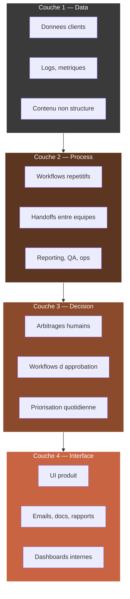

**Couche 1 — Data.** Tout ce que l'organisation produit, stocke ou reçoit sous forme de donnée : CRM, emails, tickets support, logs applicatifs, fichiers partagés, Slack, Notion. La qualité et l'accessibilité de cette couche déterminent ce que l'IA peut faire. Une organisation avec une donnée sale ou enfermée dans des silos vendor-locked aura un plafond bas.

**Couche 2 — Process.** Les workflows répétitifs qui tournent dans la boîte, souvent portés par des humains qui exécutent des tâches mécaniques. Reporting hebdo, QA manuelle, réconciliation comptable, routage de tickets, génération de devis, onboarding client. Chaque process répétitif est un candidat d'automation IA.

**Couche 3 — Décision.** Les arbitrages que les humains font au quotidien. Prioriser un backlog, approuver une note de frais, valider un contenu marketing, choisir un candidat. L'IA n'automatise pas toutes les décisions — elle peut en assister beaucoup en préparant la donnée, en générant des options, ou en flagguant des anomalies.

**Couche 4 — Interface.** Tout ce qui sort vers l'extérieur : UI produit, emails clients, rapports, dashboards. L'IA peut transformer cette couche en personnalisant, en générant des livrables à la demande, en rendant interactif ce qui était statique.

### L'erreur classique de l'audit IA

L'erreur classique consiste à commencer par la couche 4 (interface) parce que c'est la plus visible. « On va ajouter un chatbot sur le site. » C'est un symptôme, pas une stratégie. Un bon audit IA commence toujours par la couche 1 (data) et remonte.

| Si tu pars de... | Tu produis... |
|------------------|---------------|
| Couche 4 (interface) | Des gadgets. L'IA devient un vernis. |
| Couche 3 (décision) | Des projets politiques qui échouent parce que la donnée n'est pas prête. |
| Couche 2 (process) | Des automations qui marchent mais ne scalent pas faute de signal data. |
| **Couche 1 (data)** | **Une stratégie durable qui irrigue toutes les couches au-dessus.** |

## 2.2 — Technique d'audit rapide en 90 minutes

Un audit CAIO ne dure pas deux semaines. Un audit CAIO dure 90 minutes parce que c'est le temps qu'un comex ou un CEO est prêt à te donner pour que tu lui donnes des signaux exploitables. Ce qui se passe après — la preuve, les PoCs, l'implémentation — c'est du temps payant.

Voici le protocole exact d'un audit CAIO 90 minutes.

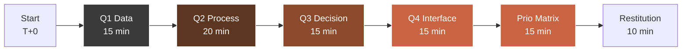

### Phase 1 — Data (15 minutes)

Questions à poser, dans cet ordre :

1. Quels sont les trois systèmes où vit votre donnée critique ? (réponse typique : CRM, produit, comptabilité)
2. À quelle fréquence ces trois systèmes se parlent-ils, et via quel mécanisme ?
3. Quel pourcentage de votre donnée est non structuré (emails, docs, tickets libres, transcripts d'appels) ?
4. Qui est propriétaire de la qualité de la donnée ? Si personne, c'est un red flag majeur.
5. Avez-vous déjà des embeddings, un vector store, ou de l'annotation ? (la réponse est quasi toujours « non » : c'est une opportunité)

### Phase 2 — Process (20 minutes)

1. Quels sont vos trois workflows répétitifs les plus coûteux en temps humain ? (demander le temps réel, pas théorique)
2. Quelle est la fréquence de ces workflows ? Quotidienne, hebdo, mensuelle ?
3. Combien d'ETP (équivalents temps plein) sont mobilisés sur ces tâches, même partiellement ?
4. Qu'est-ce qui rate le plus souvent dans ces workflows ? (les failures pointent vers l'automation à forte valeur)
5. Quels handoffs entre équipes créent de la friction ? (un handoff humain-humain est souvent un candidat d'orchestration)

### Phase 3 — Décision (15 minutes)

1. Quelles décisions reviennent de manière hebdomadaire dans votre comex ?
2. Sur quelles données ces décisions sont-elles prises ? Ou est-ce principalement de l'intuition ?
3. Existe-t-il des décisions qui sont prises mais non documentées ? (risque d'inconsistance scalable)
4. Quels KPIs pilotent réellement la boîte, vs quels KPIs sont juste affichés ?

### Phase 4 — Interface (15 minutes)

1. Quels livrables clients sont générés manuellement et pourraient être générés à la demande ?
2. Votre produit a-t-il des zones où l'utilisateur fait du travail que le produit pourrait faire pour lui ?
3. Vos emails clients (support, onboarding, renewal) sont-ils personnalisés ou templates figés ?
4. Avez-vous des dashboards internes qui sont consommés plus d'une fois par semaine ? Lesquels ?

### Phase 5 — Matrice de priorisation (15 minutes)

Tu prends toutes les opportunités remontées dans les 4 phases précédentes et tu les places dans une matrice à 2 axes : impact business estimé, effort d'implémentation estimé.

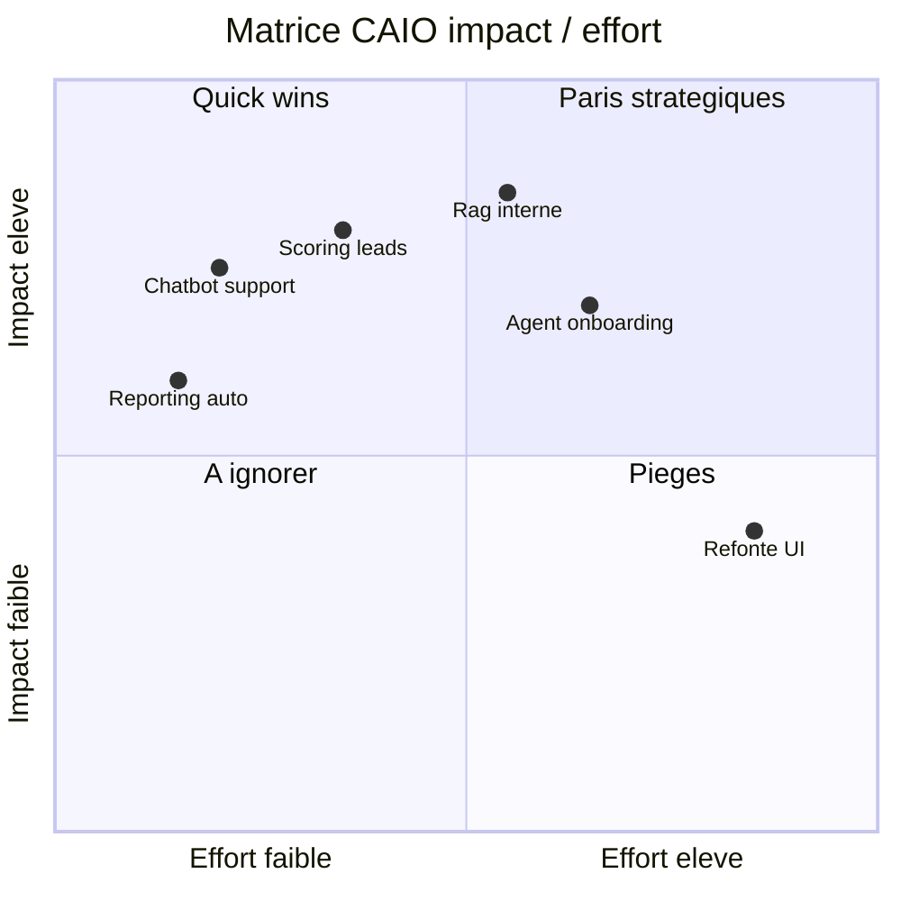

### Phase 6 — Restitution orale (10 minutes)

Tu restitues au client, à chaud, 5 à 7 opportunités hiérarchisées. Tu annonces aussi un livrable écrit dans les 72 heures qui consolide tout. Cette mécanique crée une boucle de confiance : tu donnes de la valeur dans la salle, tu envoies de la valeur après la salle.

## 2.3 — Prioriser avec la grille CAIO

La grille CAIO affine la matrice impact/effort en y ajoutant trois dimensions souvent oubliées par les audits génériques : risque data, dépendance vendor, effet d'entraînement.

| Opportunité | Impact business (€/an) | Effort (sem-homme) | Risque data (1-5) | Dépendance vendor (1-5) | Effet d'entraînement (1-5) | Score final |
|-------------|----------------------|--------------------|-------------------|--------------------------|-----------------------------|-------------|
| Chatbot support interne | 120 000 | 4 | 2 | 3 | 4 | 8.2 |
| Reporting hebdo auto | 40 000 | 1 | 1 | 2 | 2 | 6.5 |
| Scoring lead B2B | 250 000 | 8 | 3 | 2 | 5 | 9.1 |
| RAG documentation interne | 90 000 | 6 | 2 | 2 | 5 | 8.7 |
| Agent onboarding client | 180 000 | 10 | 3 | 3 | 5 | 8.5 |
| Refonte UI générative | 60 000 | 14 | 2 | 4 | 2 | 4.8 |

**Lecture.** Le score final pondère les cinq dimensions. Un score > 8 signifie : à lancer dans les 60 jours. Un score entre 6 et 8 : à planifier dans le trimestre. Un score < 6 : à ignorer ou à reformuler.

**Effet d'entraînement.** C'est la dimension la plus négligée. Un projet qui ouvre la voie à trois autres projets (ex : un RAG documentation qui sert ensuite au support, à l'onboarding et à la formation interne) vaut plus qu'un projet isolé à impact identique.

## 2.4 — Livrable : grille d'audit téléchargeable + exemple rempli

Le livrable concret de ce module est un document de 6-8 pages que tu peux remettre à un client. Il suit cette structure :

1. **Synthèse exécutive** (1 page) — 5 opportunités priorisées, impact total estimé, investissement total estimé, ROI estimé sur 12 mois.
2. **Cartographie des 4 couches** (1 page) — schéma visuel + notes par couche.
3. **Détail des opportunités** (3-4 pages) — pour chaque opportunité : description, problème résolu, solution IA proposée, estimation coût/délai, KPI de succès, risques.
4. **Matrice de priorisation visuelle** (1 page).
5. **Plan d'action 90 jours** (1 page) — quick wins à lancer ce mois, paris à préparer au trimestre suivant.

### Exemple rempli (extrait condensé, sur un SaaS B2B 80 personnes)

| Opportunité | Couche | Problème actuel | Solution IA | Impact €/an | Effort sem-homme | Score |
|-------------|--------|------------------|-------------|-------------|-------------------|-------|
| Réponse support niveau 1 auto | 4 | 60 % des tickets sont répétitifs, délai moyen 8h | Agent RAG + routing, supervision humaine | 180 000 | 6 | 9.0 |
| Scoring lead B2B | 2+1 | Commerciaux perdent 40 % de leur temps sur leads non qualifiés | Pipeline enrichissement + scoring IA | 220 000 | 8 | 8.9 |
| Génération de reports clients | 4 | 2 ETP dédiés à des rapports mensuels | Template + agent génératif supervisé | 90 000 | 4 | 8.4 |
| Detection de churn precoce | 2+3 | Churn 15 %/an, 60 % évitable si détecté à temps | Modèle + alerte CS + playbook IA | 300 000 | 10 | 9.2 |
| Assistant onboarding interne | 2+4 | Nouveaux recrues mobilisent 20h de sénior chacune | Agent RAG sur docs + process | 65 000 | 5 | 7.8 |

**Investissement total estimé sur 12 mois :** 280 000 €
**Impact combiné à 12 mois :** 855 000 €
**ROI :** 3.05x

Ce type de livrable justifie un audit payant entre 3 000 et 6 000 euros. La clé n'est pas le nombre de pages mais la qualité de la priorisation et la capacité du client à agir seul sur le document.

## Points clés du Module 2

- Une organisation se lit en 4 couches : data, process, décision, interface. Tu pars toujours de la couche 1.
- Un audit CAIO tient en 90 minutes, structurée en 6 phases strictes.
- La matrice impact/effort est enrichie par trois dimensions souvent oubliées : risque data, dépendance vendor, effet d'entraînement.
- Le livrable d'audit se vend entre 3 000 et 6 000 euros si la priorisation est actionnable.
- Un bon audit produit un client qui peut agir sans toi — ce qui, paradoxalement, est la meilleure porte d'entrée pour qu'il t'achète la phase suivante.

---

# Module 03 — Architecture d'un AI System de A à Z

**Durée : 2h00 · Format : théorie d'architecture + schémas + choix de stack + documentation**

## Objectifs du module

À la fin de ce module, tu seras capable de :

1. Concevoir sur papier une architecture AI complète avant d'écrire une ligne de code.
2. Choisir une stack cohérente selon trois contraintes : budget, délai, équipe.
3. Dessiner des schémas d'orchestration (agents, triggers, mémoire, outputs) qu'un board peut lire.
4. Produire une documentation d'architecture qui sert à la fois aux développeurs et aux décideurs.
5. Briefer une équipe ou livrer toi-même un système en t'appuyant sur ton architecture documentée.

## 3.1 — Pourquoi concevoir avant de coder

Un CTO technique code d'abord, documente ensuite (ou jamais). Un CAIO fait l'inverse. Cette inversion n'est pas stylistique : elle est économique. Voici pourquoi.

| Dimension | Code first | Design first |
|-----------|-----------|--------------|
| Coût d'une erreur | 10x (il faut réécrire) | 1x (il faut redessiner) |
| Temps de convergence équipe | 2-4 sprints | 1-2 jours |
| Capacité à pitcher au board | Faible (il n'y a rien à montrer sauf le code) | Forte (le schéma est pitchable tel quel) |
| Capacité à déléguer | Faible (tu es la doc vivante) | Forte (le schéma suffit) |
| Scaling de l'équipe | Tu es le goulot | L'équipe scale sans toi |

Une architecture documentée a quatre vertus cumulatives : elle réduit le coût des erreurs, elle accélère la convergence, elle te rend pitchable, et elle te permet de déléguer. Ces quatre vertus sont exactement celles qu'un Fractional CAIO doit incarner pour justifier son TJM.

## 3.2 — Les 7 composants d'un AI System

Tout AI System, quel que soit sa complexité, se décompose en 7 composants. Si un seul manque, le système a une faiblesse structurelle que le temps révélera.

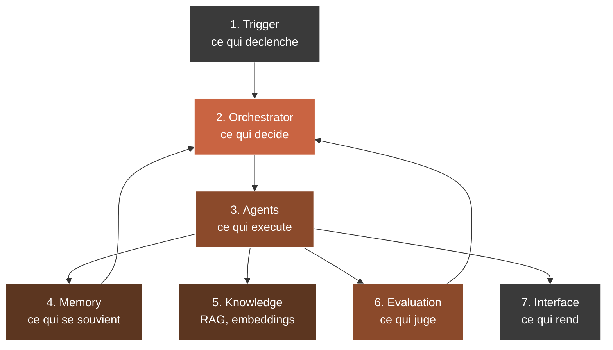

### Composant 1 — Trigger

Ce qui déclenche le système. Trois familles possibles :

- **Event-driven :** un webhook (Stripe payment, Clerk signup), un upload fichier, un message utilisateur.
- **Scheduled :** un cron (Trigger.dev), un scheduled job (Convex scheduler).
- **User-driven :** un clic dans l'UI, une commande dans un Slack bot.

| Type de trigger | Outil Agentik OS recommandé | Cas d'usage |
|----------------|-----------------------------|-------------|
| Webhook externe | Next.js route handler | Paiement, signup, event externe |
| Cron / scheduled | Trigger.dev | Reporting quotidien, sync batch |
| Event DB | Convex scheduler / mutations | Logique métier déclenchée par écriture |
| User chat | Claude API + streaming | Conversation synchrone |
| Upload file | Convex storage + hook | Parsing doc, ingestion RAG |

### Composant 2 — Orchestrator

Ce qui décide quoi faire. L'orchestrator peut être simple (une fonction TypeScript) ou sophistiqué (un agent Claude avec tool use). La bonne règle : si ton système a moins de 3 branches de décision, une fonction suffit. Au-delà, un orchestrator LLM avec tool calls est plus maintenable.

```typescript
// Exemple Convex + Claude API — orchestrator simple avec tool use
import Anthropic from "@anthropic-ai/sdk";
import { action } from "./_generated/server";
import { v } from "convex/values";

export const orchestrate = action({
  args: { userInput: v.string(), sessionId: v.id("sessions") },
  handler: async (ctx, { userInput, sessionId }) => {
    const client = new Anthropic();
    const tools = [
      {
        name: "search_knowledge",
        description: "Cherche dans la base de connaissances interne",
        input_schema: {
          type: "object",
          properties: { query: { type: "string" } },
          required: ["query"],
        },
      },
      {
        name: "create_ticket",
        description: "Cree un ticket support si la question ne peut pas etre resolue",
        input_schema: {
          type: "object",
          properties: { summary: { type: "string" }, priority: { type: "string" } },
          required: ["summary", "priority"],
        },
      },
    ];

    const history = await ctx.runQuery(api.sessions.getHistory, { sessionId });

    const response = await client.messages.create({
      model: "claude-opus-4-5",
      max_tokens: 1024,
      tools,
      messages: [...history, { role: "user", content: userInput }],
    });

    // Dispatch tool use ...
    return response;
  },
});
```

### Composant 3 — Agents

Les agents sont les unités d'exécution. Chacun a un rôle clair, un prompt système, un ensemble de tools, et une politique d'erreur. La tentation classique du CTO est de construire un seul super-agent monolithique. C'est une erreur. La règle : un agent = une responsabilité.

| Agent type | Responsabilité | Prompt system size | Tools |
|-----------|----------------|---------------------|-------|
| Researcher | Chercher dans la knowledge base | Court (< 500 tokens) | search_kb, search_web |
| Writer | Produire un livrable texte | Moyen (500-1500 tokens) | format_doc, cite_source |
| Classifier | Catégoriser un input | Court | - |
| Router | Décider quel agent appeler | Court | dispatch_agent |
| Critic | Évaluer la qualité d'un output | Moyen | score_output, flag_issue |

### Composant 4 — Memory

Deux types de mémoire à distinguer :

- **Short-term (session memory).** Contexte de la conversation courante. Stockée en clair dans une table Convex `messages` liée à une `session`.
- **Long-term (user memory, project memory).** Faits persistants sur l'utilisateur, l'organisation, les décisions passées. Stockée en tables structurées + embeddings.

```typescript
// Convex schema — memory
import { defineSchema, defineTable } from "convex/server";
import { v } from "convex/values";

export default defineSchema({
  sessions: defineTable({
    userId: v.id("users"),
    createdAt: v.number(),
    title: v.string(),
  }).index("by_user", ["userId"]),

  messages: defineTable({
    sessionId: v.id("sessions"),
    role: v.union(v.literal("user"), v.literal("assistant"), v.literal("tool")),
    content: v.string(),
    toolCalls: v.optional(v.array(v.any())),
    createdAt: v.number(),
  }).index("by_session", ["sessionId"]),

  userMemory: defineTable({
    userId: v.id("users"),
    fact: v.string(),
    source: v.string(),
    confidence: v.number(),
    embedding: v.array(v.number()),
    createdAt: v.number(),
  })
    .index("by_user", ["userId"])
    .vectorIndex("by_embedding", {
      vectorField: "embedding",
      dimensions: 1536,
      filterFields: ["userId"],
    }),
});
```

### Composant 5 — Knowledge

Le RAG (Retrieval Augmented Generation) est la colonne vertébrale des systèmes IA B2B. Un RAG mal conçu produit des hallucinations coûteuses. Un RAG bien conçu produit une confiance client mesurable.

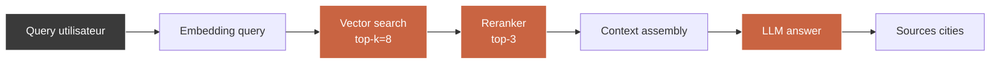

Règles d'hygiène RAG :

| Règle | Impact |
|-------|--------|
| Chunker en paragraphes sémantiques (200-400 tokens) | Précision top-3 +25% |
| Toujours stocker la source (file, page, url) | Audit trail, pas d'hallucination invisible |
| Ajouter un reranker | Précision top-3 +35% |
| Mesurer la recall sur un set de 50 Q/A de référence | Détection régression à chaque deploy |
| Citer les sources dans la réponse | Confiance utilisateur +80% |

### Composant 6 — Evaluation

C'est le composant que 90 % des CTOs oublient. Un AI System sans évaluation est une boîte noire qui se dégrade silencieusement. Trois niveaux d'évaluation :

1. **Unit eval.** Pour chaque fonction agent, un set de 10-30 cas test avec output attendu.
2. **Integration eval.** Pour chaque workflow complet, un set de 5-10 scénarios end-to-end.
3. **Production eval.** Chaque réponse en prod est loggée + scorée (LLM-as-a-judge + feedback humain échantillonné).

| Métrique | Cible | Outil |
|----------|-------|-------|
| Latency p95 | < 4s | Datadog / custom |
| Token cost / requête | < 0.02€ | Claude API response + custom |
| Helpfulness score | > 4.2/5 | LLM-as-a-judge |
| Hallucination rate | < 2% | RAG audit set |
| User thumbs-up rate | > 75% | UI feedback loop |

### Composant 7 — Interface

Le rendu final vers l'utilisateur : chat UI, dashboard, email, API, webhook. Rien de magique ici — la règle est : l'interface doit exposer les 6 composants précédents avec transparence (montrer les sources, le raisonnement, la confiance).

## 3.3 — Choisir sa stack selon les contraintes

Un CAIO ne choisit pas une stack parce qu'elle est cool. Il la choisit parce qu'elle satisfait simultanément trois contraintes : budget, délai, équipe.

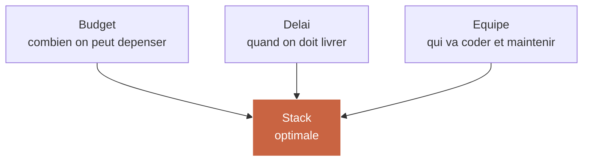

### La stack CAIO 2026 (Agentik OS)

C'est la stack qu'on utilise sur l'ensemble des projets Agentik OS en 2026 pour maximiser la vélocité et la maintenabilité.

| Couche | Choix | Pourquoi |
|--------|-------|----------|
| Frontend | Next.js 16 | App Router, server components, streaming natif |
| Styling | Tailwind v4 + shadcn/ui | Design system cohérent, composants accessibles |
| Backend / DB | Convex | Real-time, TypeScript, vector search, scheduler |
| Auth | Clerk | 2FA, orgs, webhooks robustes |
| LLM | Claude API (Opus + Sonnet) | Qualité raisonnement, tool use fiable |
| Agents locaux | Claude Code + MCP servers | Orchestration multi-agent locale |
| Intégrations externes | Composio | 300+ connecteurs prêts (Gmail, Slack, CRM, etc.) |
| Jobs / cron | Trigger.dev | Long-running jobs, retries, observability |
| Deploy | Vercel | Edge functions, preview deploys |
| Monitoring | Datadog ou Vercel Analytics | Latency, erreurs, cost tracking |

### Les 3 profils de stack selon contraintes

| Profil | Contraintes | Stack recommandée |
|--------|-------------|-------------------|
| Lean SaaS | Budget < 5k€/mois, délai < 4 sem, équipe 1-2 devs | Next.js + Convex + Claude API + Clerk |
| Mid-market | Budget 5-20k€/mois, délai 2-3 mois, équipe 3-6 devs | + Trigger.dev + Composio + Vercel Edge |
| Enterprise | Budget > 20k€/mois, délai 6+ mois, équipe 8-15 devs | + self-hosted vector DB + fine-tuning + governance layer |

## 3.4 — Documentation d'architecture que le board veut voir

Un board n'a pas envie de lire 40 pages de spec technique. Un board veut un document qui tient sur 6 pages structurées ainsi :

1. **One-pager executive.** Le système résumé en 5 lignes + 1 schéma.
2. **Problème résolu.** Le problème business adressé, quantifié.
3. **Architecture visuelle.** Le diagramme d'architecture lisible.
4. **Composants clés.** Les 7 composants avec 1 ligne chacun.
5. **Risques et mitigations.** Les 5 risques principaux + leur mitigation.
6. **Roadmap 90 jours.** Phases, milestones, décisions attendues.

### Template de one-pager exécutive

```markdown
# [Nom du système] — One-pager

**Problème résolu.** [1 phrase + 1 chiffre business]

**Impact cible.** [€/an économisés ou revenue généré]

**Architecture haut niveau.**

[Schéma mermaid simplifié — max 7 boxes]

**Décisions requises du board.**

1. [Décision 1]
2. [Décision 2]

**Investissement.** [€ sur X mois]
**ROI attendu.** [xX sur 12 mois]
```

Ce one-pager, tu l'envoies 72h avant le board. Il ouvre la conversation. Le deck de 5 slides (module 5) la cadre dans la salle.

## 3.5 — Livrable : template d'architecture système (Notion + Figma)

Le livrable de ce module est un template double :

- **Notion** pour la partie textuelle (one-pager, spec composants, décisions, risques).
- **Figma** pour les schémas d'architecture (un fichier modulaire avec des composants pré-dessinés : agent, orchestrator, memory, knowledge, trigger, evaluation, interface, data store).

Le template Notion contient 8 pages :
1. Overview & One-pager.
2. Problem statement business.
3. Architecture diagrams (embed Figma).
4. Composant 1 — Trigger (spec).
5. Composant 2-7 (specs).
6. Data model (Convex schema template).
7. Risks & mitigations (grille).
8. Roadmap 90 jours.

Le template Figma contient une bibliothèque de composants standards Agentik OS, utilisables en drag-and-drop, avec une palette de 6 couleurs dédiées (data, process, decision, interface, evaluation, trigger).

## Points clés du Module 3

- Design first, code second. Une erreur d'architecture coûte 10x plus qu'une erreur de code.
- 7 composants structurent tout AI System : trigger, orchestrator, agents, memory, knowledge, evaluation, interface.
- Le choix de la stack dépend de 3 contraintes : budget, délai, équipe. La stack CAIO 2026 (Next.js + Convex + Claude + Composio + Trigger.dev) couvre 80 % des cas SaaS.
- La documentation d'architecture que le board veut tient sur 6 pages. Un one-pager ouvre, un deck 5 slides cadre, un doc complet rassure.
- Le livrable est double : Notion (textuel) + Figma (visuel). Ce n'est pas du zèle : c'est ce qui te permet de facturer la phase de design 8 000 à 25 000 euros.

---

# Module 04 — Monitoring AI : ton premier système

**Durée : 2h30 · Format : walkthrough guidé + code + démo déployable en 3 jours**

## Objectifs du module

À la fin de ce module, tu seras capable de :

1. Construire un tableau de bord de monitoring AI de base avec la stack Agentik OS.
2. Identifier les 7 métriques clés que tout board devrait suivre sur un système IA en production.
3. Déployer ton système en moins de 3 jours sur un stack Convex + Next.js + Claude API.
4. Présenter ce système au board sans perdre ton audience dans la technique.
5. Utiliser ce système comme démo live pendant tes pitchs CAIO.

## 4.1 — Pourquoi le monitoring est ton premier livrable

Un CAIO ne commence jamais une mission en livrant « un agent ». Il commence en livrant **de la visibilité**. Parce que tant que personne ne sait ce qui tourne, ce que ça coûte, et ce que ça produit, aucune décision rationnelle n'est possible. Le monitoring est l'acte politique avant l'acte technique.

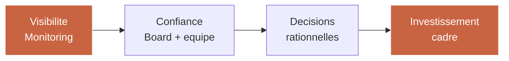

C'est aussi pragmatiquement le système le plus facile à livrer en 3 jours tout en ayant un effet wow. Un dashboard bien fait qui montre en temps réel les requêtes IA, leur coût, leur latence, et la qualité des réponses, ça déclenche dans le board une réaction immédiate : « OK, maintenant on peut piloter ».

## 4.2 — Les 7 métriques AI que tout board doit suivre

| # | Métrique | Définition | Cible | Pourquoi ça compte |
|---|----------|-----------|-------|---------------------|
| 1 | Volume de requêtes / jour | Nombre d'appels au système IA | Croissance stable | Signal d'adoption |
| 2 | Coût / requête | Total tokens × prix / volume | Décroissant dans le temps | Signal d'efficacité |
| 3 | Latence p50 / p95 | Temps de réponse médiane et pire cas | p95 < 4s | Signal d'UX |
| 4 | Taux d'erreur | % requêtes échouées ou fallback | < 2% | Signal de stabilité |
| 5 | Helpfulness score | LLM-as-a-judge + thumbs-up | > 4.2/5 | Signal de qualité |
| 6 | Hallucination rate | % réponses factuellement fausses | < 2% | Signal de risque |
| 7 | ROI mensuel | Valeur générée / coût total | > 3x | Signal business |

Un board qui voit ces 7 métriques chaque mois sait où investir. Un board qui ne les voit pas finance à l'aveugle ou coupe brutalement.

## 4.3 — Architecture du monitoring light

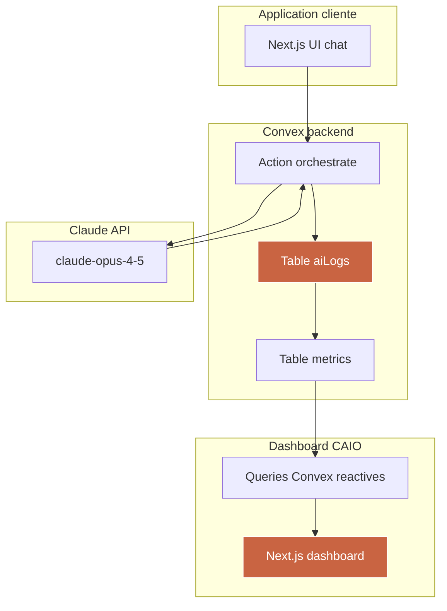

### Schema Convex

```typescript
// convex/schema.ts
import { defineSchema, defineTable } from "convex/server";
import { v } from "convex/values";

export default defineSchema({
  aiLogs: defineTable({
    userId: v.id("users"),
    sessionId: v.id("sessions"),
    model: v.string(),
    inputTokens: v.number(),
    outputTokens: v.number(),
    costEur: v.number(),
    latencyMs: v.number(),
    status: v.union(v.literal("ok"), v.literal("error"), v.literal("fallback")),
    prompt: v.string(),
    response: v.string(),
    helpfulnessScore: v.optional(v.number()),
    hallucinationFlag: v.optional(v.boolean()),
    createdAt: v.number(),
  })
    .index("by_user", ["userId"])
    .index("by_session", ["sessionId"])
    .index("by_createdAt", ["createdAt"]),

  dailyMetrics: defineTable({
    date: v.string(), // YYYY-MM-DD
    totalRequests: v.number(),
    totalCostEur: v.number(),
    avgLatencyMs: v.number(),
    p95LatencyMs: v.number(),
    errorRate: v.number(),
    avgHelpfulness: v.number(),
    hallucinationRate: v.number(),
  }).index("by_date", ["date"]),
});
```

### Action orchestrate avec logging

```typescript
// convex/orchestrate.ts
import Anthropic from "@anthropic-ai/sdk";
import { action } from "./_generated/server";
import { v } from "convex/values";
import { api, internal } from "./_generated/api";

const MODEL = "claude-opus-4-5";
const INPUT_PRICE_EUR_PER_1M = 14; // ajuste selon tarif reel
const OUTPUT_PRICE_EUR_PER_1M = 70;

export const orchestrate = action({
  args: {
    userId: v.id("users"),
    sessionId: v.id("sessions"),
    userInput: v.string(),
  },
  handler: async (ctx, { userId, sessionId, userInput }) => {
    const client = new Anthropic();
    const startedAt = Date.now();
    let status: "ok" | "error" | "fallback" = "ok";
    let inputTokens = 0;
    let outputTokens = 0;
    let response = "";

    try {
      const history = await ctx.runQuery(api.sessions.getHistory, { sessionId });

      const resp = await client.messages.create({
        model: MODEL,
        max_tokens: 1024,
        messages: [...history, { role: "user", content: userInput }],
      });

      inputTokens = resp.usage.input_tokens;
      outputTokens = resp.usage.output_tokens;
      response = resp.content[0].type === "text" ? resp.content[0].text : "";
    } catch (e) {
      status = "error";
      response = "Erreur interne — un humain va reprendre la main.";
    }

    const latencyMs = Date.now() - startedAt;
    const costEur =
      (inputTokens * INPUT_PRICE_EUR_PER_1M + outputTokens * OUTPUT_PRICE_EUR_PER_1M) / 1_000_000;

    await ctx.runMutation(internal.aiLogs.insert, {
      userId,
      sessionId,
      model: MODEL,
      inputTokens,
      outputTokens,
      costEur,
      latencyMs,
      status,
      prompt: userInput,
      response,
      createdAt: Date.now(),
    });

    return { response, costEur, latencyMs, status };
  },
});
```

### Mutation aiLogs.insert (internal)

```typescript
// convex/aiLogs.ts
import { internalMutation } from "./_generated/server";
import { v } from "convex/values";

export const insert = internalMutation({
  args: {
    userId: v.id("users"),
    sessionId: v.id("sessions"),
    model: v.string(),
    inputTokens: v.number(),
    outputTokens: v.number(),
    costEur: v.number(),
    latencyMs: v.number(),
    status: v.union(v.literal("ok"), v.literal("error"), v.literal("fallback")),
    prompt: v.string(),
    response: v.string(),
    createdAt: v.number(),
  },
  handler: async (ctx, args) => {
    await ctx.db.insert("aiLogs", args);
  },
});
```

### Agrégation quotidienne via Trigger.dev

```typescript
// trigger/aggregate-daily-metrics.ts
import { schedules } from "@trigger.dev/sdk/v3";
import { ConvexHttpClient } from "convex/browser";
import { api } from "./convex/_generated/api";

export const aggregateDailyMetrics = schedules.task({
  id: "aggregate-daily-metrics",
  cron: "0 1 * * *", // tous les jours a 1h du matin
  run: async () => {
    const convex = new ConvexHttpClient(process.env.CONVEX_URL!);
    const yesterday = new Date(Date.now() - 24 * 60 * 60 * 1000)
      .toISOString()
      .slice(0, 10);

    const logs = await convex.query(api.aiLogs.listByDate, { date: yesterday });

    if (logs.length === 0) return { skipped: true };

    const totalRequests = logs.length;
    const totalCostEur = logs.reduce((s, l) => s + l.costEur, 0);
    const latencies = logs.map((l) => l.latencyMs).sort((a, b) => a - b);
    const avgLatencyMs = latencies.reduce((s, v) => s + v, 0) / totalRequests;
    const p95LatencyMs = latencies[Math.floor(totalRequests * 0.95)];
    const errorRate = logs.filter((l) => l.status === "error").length / totalRequests;
    const helpfulnessScores = logs
      .filter((l) => typeof l.helpfulnessScore === "number")
      .map((l) => l.helpfulnessScore!);
    const avgHelpfulness = helpfulnessScores.length
      ? helpfulnessScores.reduce((s, v) => s + v, 0) / helpfulnessScores.length
      : 0;
    const hallucinationRate =
      logs.filter((l) => l.hallucinationFlag).length / totalRequests;

    await convex.mutation(api.dailyMetrics.upsert, {
      date: yesterday,
      totalRequests,
      totalCostEur,
      avgLatencyMs,
      p95LatencyMs,
      errorRate,
      avgHelpfulness,
      hallucinationRate,
    });

    return { success: true, date: yesterday };
  },
});
```

## 4.4 — Dashboard Next.js

Le dashboard consomme les metrics en temps réel via les queries Convex réactives. Il affiche 7 tuiles principales + 2 graphiques temporels + 1 table de logs récents.

```typescript
// app/dashboard/page.tsx (extract)
"use client";
import { useQuery } from "convex/react";
import { api } from "@/convex/_generated/api";
import { Card, CardContent, CardHeader } from "@/components/ui/card";

export default function Dashboard() {
  const metrics = useQuery(api.dailyMetrics.last30Days);
  const today = metrics?.[0];

  if (!today) return <div>Loading…</div>;

  return (
    <div className="grid grid-cols-1 md:grid-cols-4 gap-4 p-8">
      <Card>
        <CardHeader>Requêtes aujourd'hui</CardHeader>
        <CardContent className="text-3xl">{today.totalRequests}</CardContent>
      </Card>
      <Card>
        <CardHeader>Coût aujourd'hui</CardHeader>
        <CardContent className="text-3xl">{today.totalCostEur.toFixed(2)} €</CardContent>
      </Card>
      <Card>
        <CardHeader>Latence p95</CardHeader>
        <CardContent className="text-3xl">{today.p95LatencyMs} ms</CardContent>
      </Card>
      <Card>
        <CardHeader>Taux d'erreur</CardHeader>
        <CardContent className="text-3xl">{(today.errorRate * 100).toFixed(1)}%</CardContent>
      </Card>
      {/* 3 tuiles supplémentaires + graphiques */}
    </div>
  );
}
```

## 4.5 — Les 7 tuiles du dashboard CAIO

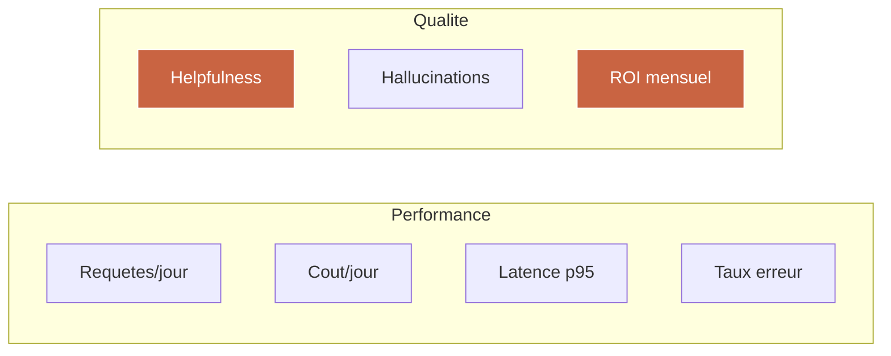

| Tuile | Source Convex | Couleur d'alerte |
|-------|--------------|------------------|
| Requêtes/jour | `dailyMetrics.totalRequests` | Gris (info) |
| Coût/jour | `dailyMetrics.totalCostEur` | Orange si > seuil budget |
| Latence p95 | `dailyMetrics.p95LatencyMs` | Rouge si > 5000 |
| Taux d'erreur | `dailyMetrics.errorRate` | Rouge si > 3% |
| Helpfulness | `dailyMetrics.avgHelpfulness` | Rouge si < 4.0 |
| Hallucinations | `dailyMetrics.hallucinationRate` | Rouge si > 3% |
| ROI mensuel | calcul custom (valeur/cout) | Vert si > 3x |

## 4.6 — Présenter le système au board sans perdre l'audience

La règle d'or : **3 écrans maximum**, **90 secondes par écran**.

| Écran | Contenu | Temps |
|-------|---------|-------|
| 1 | Dashboard live avec les 7 tuiles | 90s |
| 2 | Un exemple de conversation IA tracée end-to-end (prompt + réponse + coût + latence) | 90s |
| 3 | Table de logs récents avec un flag d'hallucination + plan de remédiation | 90s |

Ce que tu ne fais pas : tu ne montres pas de code. Jamais. Le code existe, il est visible pour ceux qui veulent creuser — mais dans la réunion, tu montres le résultat, pas le procédé.

## 4.7 — Limites de la version light et passerelle vers la version complète

Le système que tu viens de builder dans ce module est une **version light**. Il est suffisant pour :

- faire une démo à un board en 5 minutes,
- commencer à tracker un AI System existant en prod,
- poser les bases d'un monitoring avant d'y connecter des évaluations avancées.

Il ne couvre pas encore :

- l'orchestration multi-agents avec routing dynamique,
- le dashboard ROI complet avec modélisation de l'impact business par feature,
- les évaluations automatisées (LLM-as-a-judge avec golden set, tracking de régression),
- les alertes Slack/email sur dégradation qualité,
- le drill-down par user, segment, feature,
- le backfill historique et les rapports exécutifs automatiques.

Pour builder les 2 systèmes suivants (orchestration d'agents + dashboard ROI) de A à Z et avoir accès à tous les templates complets, c'est la formation core. Ce module 4 te donne le socle — la suite te donne le système complet que tu pourras facturer entre 20 000 et 60 000 euros chez un client.

## Points clés du Module 4

- Monitoring = acte politique avant acte technique. Tu donnes de la visibilité avant de livrer de l'IA.
- 7 métriques clés : volume, coût, latence, erreur, helpfulness, hallucination, ROI.
- Stack : Convex pour le log + aggregation, Trigger.dev pour le cron, Next.js pour le dashboard.
- Ton système light se déploie en 3 jours et se démo en 4 minutes. Tu le réutilises chez chaque client.
- Pour aller plus loin (multi-agents orchestration + ROI dashboard complet), la formation core est la suite naturelle.

---

# Module 05 — Pitcher l'AI à un board

**Durée : 1h30 · Format : structure du deck + script de pitch + simulation commentée**

## Objectifs du module

À la fin de ce module, tu seras capable de :

1. Construire un deck CAIO de 5 slides qui présente n'importe quel projet IA en 12 minutes.
2. Anticiper et répondre aux 7 questions que tout board pose.
3. Cadrer une simulation de pitch avec un pair ou en solo, et itérer rapidement sur les points faibles.
4. Déplacer la décision d'investir vers la salle plutôt que vers une deuxième réunion.
5. Fondamentalement changer ton rapport aux décideurs — tu passes de technicien à partenaire stratégique.

## 5.1 — Pourquoi cette compétence est la plus rare

Parmi les 10 compétences que requiert le métier de CAIO, la capacité à pitcher l'IA à un board est la plus rare et la plus chère. Raison simple : c'est la seule qui réclame un cerveau bilingue. Un technicien qui ne parle pas business ne peut pas pitcher. Un business qui ne parle pas technique ne peut pas pitcher non plus. Le CAIO est à l'intersection.

Les CTOs qui ratent leurs pitchs commettent presque toujours les mêmes erreurs :

| Erreur | Impact |
|--------|--------|
| Trop de slides (> 10) | Le board décroche à la slide 4 |
| Démarrer par la technique | Le board ne voit pas le problème résolu |
| Jargon non traduit (RAG, embeddings, MCP) | Le board se sent exclu, donc défensif |
| Pas de chiffre business | Le board n'a pas d'ancre pour décider |
| Pas de demande claire | Le board dit « on en reparle » et ne revient jamais |

Le pitch CAIO corrige chacune de ces erreurs.

## 5.2 — Le deck CAIO en 5 slides

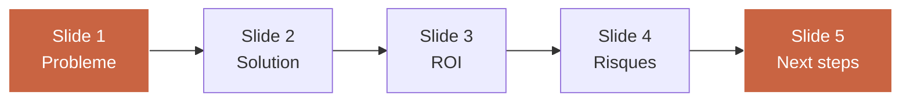

### Slide 1 — Problème (2 minutes)

Tu ouvres avec **le problème business**, pas avec la solution IA. Le problème doit être exprimé en une phrase courte + un chiffre.

Mauvais exemple : « Le support client est lent. »
Bon exemple : « Notre support traite 4 200 tickets/mois, dont 62 % sont répétitifs. Coût humain : 185 000 €/an. Impact NPS : -8 points sur les clients qui attendent plus de 6h. »

### Slide 2 — Solution (3 minutes)

Un schéma d'architecture haut niveau + 3 bullets clés. Le schéma doit être lisible en 15 secondes par un non-tech. Pas de code. Pas plus de 7 boîtes.

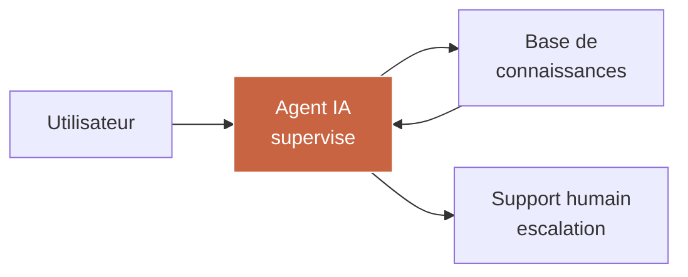

Les 3 bullets :

- Ce que le système fait de manière autonome.
- Ce que le système ne fait pas et renvoie vers un humain.
- Ce que le système apprend au fil du temps.

### Slide 3 — ROI (2 minutes)

| Dimension | An 1 | An 2 | An 3 |
|-----------|------|------|------|
| Coût système | 72 000 € | 90 000 € | 108 000 € |
| Économies humaines | 120 000 € | 180 000 € | 220 000 € |
| Gains revenue (upsell via NPS) | 60 000 € | 140 000 € | 240 000 € |
| ROI cumulatif | 2.5x | 4.6x | 6.1x |

Ce tableau fait le travail. Le board comprend en 30 secondes. Tu dois pouvoir défendre chaque chiffre si on te challenge.

### Slide 4 — Risques (3 minutes)

5 risques max, chacun avec sa mitigation. Pas plus. Pas moins.

| Risque | Impact | Mitigation |
|--------|--------|------------|
| Hallucination facturée client | Réclamation, litige | Supervision humaine sur les 100 premiers tickets, audit set hebdo |
| Dépendance vendor LLM | Lock-in, hausse prix | Architecture model-agnostic via Anthropic + fallback OpenAI |
| Fuite données sensibles | RGPD, réputation | Pas d'envoi de PII au LLM, embeddings internes |
| Dégradation qualité dans le temps | Baisse satisfaction | Dashboard qualité, alerte à -5% helpfulness |
| Rejet par l'équipe support | Freins culturels | Pilote avec 2 volontaires, transparence sur le rôle |

### Slide 5 — Next steps (2 minutes)

Une demande claire. Trois options max. Un calendrier.

| Option | Investissement | Délai | Décision requise aujourd'hui |
|--------|---------------|-------|-----------------------------|
| Pilote 90 jours | 45 000 € | T+90 jours | GO/NOGO sur pilote |
| Implémentation complète | 180 000 € | T+180 jours | GO conditionné résultats pilote |
| Rien faire | 0 € | — | Coût d'opportunité 200 000 €/an |

Le « ne rien faire » a un coût. Le rendre visible est la technique de closing la plus efficace.

## 5.3 — Les 7 questions que tout board pose

Tu dois avoir des réponses prêtes pour ces 7 questions. Si tu ne les as pas, reporte le pitch.

| # | Question | Structure de réponse |
|---|----------|----------------------|
| 1 | Combien ça coûte réellement sur 3 ans, TCO inclus ? | Tableau TCO détaillé + sensibilité sur coût LLM |
| 2 | Qu'est-ce qui arrive si Anthropic/OpenAI ferme ou double ses prix ? | Architecture model-agnostic + scénarios |
| 3 | Qui est responsable si l'IA produit une erreur qui coûte un client ? | Framework responsabilité + supervision humaine + audit trail |
| 4 | Est-ce que nos concurrents font déjà ça ? Mieux ou moins bien ? | Benchmark 3 concurrents + analyse positionnement |
| 5 | Combien de mois avant de voir un résultat mesurable ? | Milestones 30/60/90 jours + KPI par milestone |
| 6 | Qu'est-ce qu'on fait de l'équipe que ça libère ? | Plan de redéploiement + upskilling |
| 7 | Qu'est-ce qui nous bloque de démarrer lundi ? | Liste concrète des pré-requis (données, stack, équipe) |

Ces 7 questions sont universelles. Elles se déclineront différemment selon le secteur, mais leur structure reste la même. Prépare une annexe de 3-5 slides que tu peux convoquer à la demande pour répondre à chacune.

## 5.4 — Simulation de pitch avec exemples réels commentés

### Exemple 1 — SaaS B2B, board de 6 personnes

**Contexte.** Éditeur SaaS B2B, 180 personnes, 24 M€ ARR. Le CEO veut comprendre ce que l'IA peut apporter concrètement en 2026. Board composé du CEO, CFO, COO, VP Sales, VP Product, un external board member.

**Ce qui a marché.**

- Ouverture avec le problème business : « Notre churn est à 14 %, 60 % sont évitables si détectés à temps. »
- Démo live du dashboard monitoring (module 4) pour montrer que la visibilité existe déjà.
- Tableau ROI sur 3 ans chiffré à la ligne.
- Demande claire : 60 000 € pour un pilote 90 jours.

**Résultat.** GO sur le pilote dans la salle. Décision prise en 42 minutes.

### Exemple 2 — Scale-up, board investisseurs

**Contexte.** Scale-up fintech, 90 personnes, 12 M€ ARR, série B récente. Board composé de 3 investisseurs + CEO + CTO sortant.

**Ce qui n'a pas marché.**

- Démarrage par la slide solution (schéma d'architecture) au lieu du problème.
- Mention de « RAG » et « MCP » sans traduction.
- Pas de chiffre sur l'impact revenue.
- Demande floue (« on aimerait explorer plusieurs pistes »).

**Résultat.** Report à la prochaine réunion du board. 3 mois perdus.

**Correction.** Refonte du deck en suivant exactement la structure 5 slides. Nouveau pitch 6 semaines plus tard. GO sur un pilote 3 mois + embauche du CAIO.

## 5.5 — Livrable : template de pitch board (PowerPoint + PDF)

Le livrable de ce module est un template PowerPoint (et export PDF) de 5 slides principales + 5 slides annexes, avec :

- un design cohérent (typographie Inter, palette neutre + accent terracotta),
- des placeholders prêts à remplir,
- des notes de présentateur sous chaque slide qui te donnent les points clés à dire,
- 3 variantes de pitch (pilote 90j, implémentation complète, audit uniquement).

Ce template se réutilise chez chaque client en moins d'une heure de personnalisation.

## Points clés du Module 5

- Le pitch CAIO tient en 5 slides + 5 annexes. Pas plus. Jamais.
- Structure : Problème → Solution → ROI → Risques → Next steps.
- 7 questions que tout board pose, à préparer à l'avance.
- Ne jamais démarrer par la technique. Toujours par le problème business.
- Le « ne rien faire » a un coût d'opportunité. Le rendre visible est la technique de closing la plus efficace.
- Le template réutilisable te fait gagner 15 à 20 heures par pitch.

---

# Module 06 — Construire ton offre CAIO Fractional

**Durée : 1h30 · Format : packaging + pricing + page profil**

## Objectifs du module

À la fin de ce module, tu seras capable de :

1. Packager trois offres CAIO Fractional (audit, implémentation, pilotage) avec livrables et durées fixes.
2. Fixer ton TJM CAIO en le justifiant par le marché, ta valeur délivrée, et ton positionnement.
3. Créer une page profil CAIO publique en moins d'une heure, avec les 6 sections essentielles.
4. Te positionner comme Chief AI Officer disponible en mission sans avoir à te justifier.
5. Pré-qualifier tes prospects avant même le premier call.

## 6.1 — De CTO à CAIO Fractional

Le CAIO Fractional est le format le plus rentable pour un CTO senior qui veut monétiser son expertise IA sans s'engager à plein temps chez un seul employeur. Le principe : tu es Chief AI Officer de plusieurs boîtes en parallèle, entre 2 et 4 jours par semaine chacune, pour des missions de 3 à 12 mois.

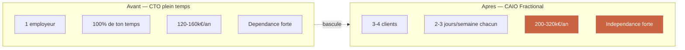

Le CAIO Fractional a trois avantages sur le CAIO salarié :

| Dimension | CAIO salarié | CAIO Fractional |
|-----------|-------------|-----------------|
| Revenu brut | 160-240k€/an | 200-360k€/an |
| Variabilité | Faible | Moyenne |
| Temps sur une mission | 100% | 30-50% |
| Diversité d'expérience | Faible | Très forte |
| Risque concentration | Élevé (1 employeur) | Faible (3-4 clients) |
| Liberté d'opinion | Moyenne | Forte |

## 6.2 — Les 3 offres CAIO packagées

Ne propose pas 10 offres. Propose 3. Une pour chaque phase du cycle client.

### Offre 1 — Audit Flash CAIO (entrée de gamme)

| Item | Détail |
|------|--------|
| Durée | 2 semaines calendaires |
| Livrables | Rapport d'audit 90 min + cartographie 4 couches + matrice opportunités + plan 90 jours |
| Pricing | 4 500 € HT (forfait) |
| Objectif | Poser un pied chez le client, démontrer la valeur, ouvrir la porte à l'offre 2 |
| Conversion attendue vers offre 2 | 60-75 % |

### Offre 2 — Implémentation AI System (cœur de gamme)

| Item | Détail |
|------|--------|
| Durée | 3 à 4 mois |
| Livrables | 1 système AI complet (architecture + code + monitoring + doc) + formation équipe |
| Pricing | 35 000 à 85 000 € HT selon complexité |
| Objectif | Livrer un résultat business mesurable, créer le trust pour l'offre 3 |
| Conversion attendue vers offre 3 | 40-55 % |

### Offre 3 — Pilotage CAIO Fractional (récurrent)

| Item | Détail |
|------|--------|
| Durée | Contrat 6 à 12 mois renouvelable |
| Livrables | 2 à 3 jours/semaine en pilotage stratégique IA : board meetings, arbitrages, mentorat équipe, roadmap |
| Pricing | 12 000 à 18 000 € HT/mois |
| Objectif | Revenus récurrents + position stratégique long terme |
| Conversion vers upsell | 25-40 % (projets ponctuels additionnels) |

### Funnel commercial CAIO

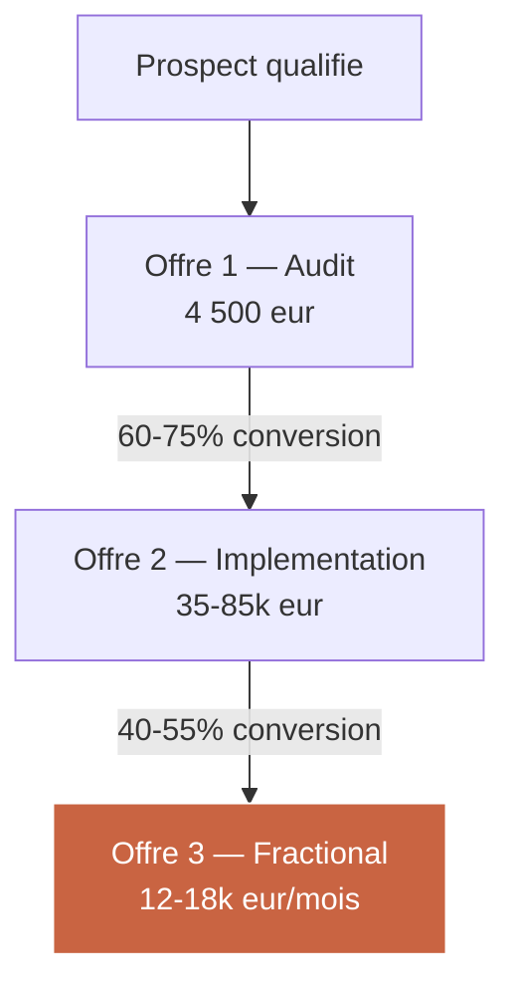

Calcul de valeur vie client moyen (LTV) :
- Offre 1 — 4 500 €
- Offre 2 — 60 000 € moyenne (conversion 67 %) = 40 200 €
- Offre 3 — 15 000 €/mois × 9 mois moyenne × conversion 47 % = 63 450 €

**LTV moyen par prospect qualifié signé : 108 150 € HT.**

Cette métrique change tout. Elle justifie un coût d'acquisition client agressif (2 000 à 4 000 € par prospect qualifié) et une stratégie de contenu/positionnement ambitieuse.

## 6.3 — Fixer son TJM CAIO

Trois logiques coexistent pour fixer un TJM CAIO. Tu dois les connaître toutes pour défendre ton chiffre.

### Logique 1 — Benchmark marché

| Niveau | TJM Europe (€ HT) | TJM US ($ HT) |
|--------|-------------------|----------------|
| CAIO Fractional junior (< 2 ans exp IA stratégique) | 900-1 200 | 1 200-1 800 |
| CAIO Fractional confirmé (2-5 ans) | 1 200-1 800 | 1 800-2 800 |
| CAIO Fractional senior (5+ ans, références publiques) | 1 800-2 500 | 2 800-4 500 |
| CAIO Star (auteur reconnu, keynote speaker) | 2 500-4 000+ | 4 500-8 000+ |

### Logique 2 — Valeur délivrée

Un projet qui génère 300 000 €/an pour un client peut justifier une facturation de 60 000 € (20 % de la valeur générée an 1). Si tu livres en 8 semaines-homme, ton TJM implicite est de 1 500 €.

### Logique 3 — Positionnement et rareté

Un CAIO qui a un portfolio public crédible, des articles, un podcast, des références nommables, peut facturer 50-100 % au-dessus du benchmark de son niveau objectif.

### Ma recommandation pour Thomas (CTO SaaS qui démarre)

- TJM Audit Flash (forfait) : équivalent 1 400 €/jour
- TJM Implémentation : 1 300-1 600 €/jour selon complexité
- TJM Pilotage Fractional : 1 500-1 800 €/jour

Cible objective sur 90 jours : 1 500 € TJM moyen pondéré.

## 6.4 — Créer sa page profil CAIO en 1h

Une page profil CAIO publique ne ressemble pas à un CV. Elle ressemble à une landing page commerciale. Elle contient 6 sections non négociables.

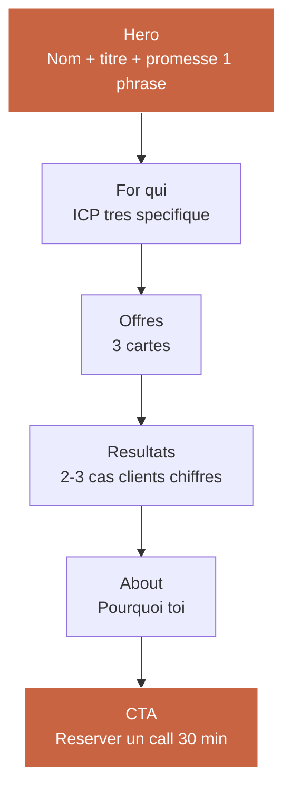

| Section | Longueur cible | Pièges à éviter |
|---------|---------------|-----------------|
| Hero | 1 phrase + 1 sous-titre | Jamais « passionné par l'IA », toujours « j'aide [ICP] à [résultat chiffré] » |
| For qui | 3-5 bullets ICP | Pas générique — secteur + taille + stade |
| Offres | 3 cartes tarifées | Afficher les prix si tu veux pré-qualifier |
| Résultats | 2-3 cas clients chiffrés | Pas de cas client = pas de crédibilité |
| About | 150-300 mots | Pas de CV linéaire — focus sur la transformation que tu as vécue |
| CTA | Bouton calendly/cal.com | Un seul CTA, pas 3 |

### Exemple de hero pour Thomas

> **Thomas — Chief AI Officer Fractional.**
> J'aide les SaaS B2B de 50 à 500 personnes à transformer leur expertise technique en stratégie IA pilotable par leur board. Spécialité : monitoring AI, orchestration multi-agents, ROI chiffré.

En une phrase : qui je suis, pour qui je travaille, ce que je fais différemment.

## 6.5 — Pré-qualification avant le premier call

Un call CAIO à 300 €/h ne se donne pas à n'importe qui. Tu pré-qualifies par un formulaire en amont avec 5 questions obligatoires.

| Question | Ce que ça révèle |
|----------|------------------|
| Taille entreprise (employés, ARR) | Adéquation ICP |
| Stade maturité IA (0/1/2/3) | Offre à proposer (Audit vs Implem vs Pilotage) |
| Budget IA 2026 | Capacité à payer |
| Horizon décision (< 30j, < 90j, > 90j) | Urgence |
| Qui décide (toi seul, comex, board) | Complexité du cycle vente |

Les prospects qui ne remplissent pas ce formulaire ou qui répondent « je ne sais pas » à 3 questions sur 5 ne passent pas en call. Tu gagnes 8 à 12 heures par semaine.

## 6.6 — Livrable : template d'offre CAIO Fractional

Le livrable est un kit complet :

- 1 page profil CAIO en Next.js (à héberger sur ton domaine),
- 3 one-pagers PDF (Audit, Implémentation, Pilotage) prêts à envoyer,
- 1 contrat cadre CAIO Fractional (FR) à personnaliser,
- 1 formulaire de pré-qualification (Tally ou équivalent),
- 1 séquence email prospect (3 emails post-formulaire).

Temps d'installation : 1h30 de personnalisation, 30 min de déploiement.

## Points clés du Module 6

- Packager 3 offres : Audit, Implémentation, Pilotage. Pas plus.
- LTV par prospect qualifié signé : 108 150 € HT. Ça change ta stratégie d'acquisition.
- TJM CAIO défendable en cumulant 3 logiques : benchmark, valeur délivrée, positionnement.
- Page profil = 6 sections non négociables. Jamais un CV linéaire.
- Pré-qualification = 5 questions obligatoires. Tu gagnes 8-12h/semaine.

---

# Module 07 — Vendre des systèmes, pas du temps

**Durée : 1h00 · Format : théorie pricing + fiche produit + exemples commentés**

## Objectifs du module

À la fin de ce module, tu seras capable de :

1. Identifier la différence structurelle entre vendre une prestation horaire et vendre un système à prix fixe.
2. Pricer un AI System en combinant valeur créée et coût de production.
3. Créer ta première fiche produit « AI System » qui se vend sans toi.
4. Déconnecter ton revenu de tes heures.
5. Construire un portefeuille de systèmes packagés qui deviennent tes actifs commerciaux récurrents.

## 7.1 — Pourquoi passer du temps au système

Vendre son temps a un plafond dur : il y a 220 jours ouvrés dans l'année. Si ton TJM est de 1 500 €, tu plafonnes mécaniquement à 330 000 € / an, charges non comprises. Au-delà, il faut soit embaucher (et tu deviens patron), soit vendre autre chose que des heures.

Vendre un système a un plafond dix fois plus haut. Parce qu'un système, une fois construit, peut être livré à plusieurs clients avec un coût marginal faible. Tu amortis l'effort de conception sur plusieurs ventes.

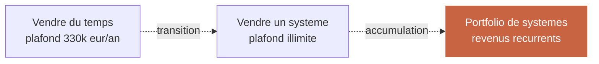

## 7.2 — La différence entre prestation et système

| Dimension | Prestation (temps) | Système (produit) |
|-----------|--------------------|--------------------|
| Unité de vente | Heure, jour, mois | Livrable défini |
| Pricing | TJM × durée | Forfait |
| Risque client | Coût dérive avec le temps | Coût fixe |
| Risque prestataire | Client paie même si lent | Pénalité si lent |
| Marge | Linéaire | Croissante avec la réutilisation |
| Scalabilité | Limitée | Forte |
| Relation client | Dépendante (micro-management) | Partenariat (résultat) |

La bascule de l'un vers l'autre se fait par étapes : d'abord tu proposes un forfait pour un petit livrable (ex : audit), puis tu packages un livrable plus complet (ex : implémentation d'un AI System), puis tu accumules plusieurs systèmes dans un catalogue.

## 7.3 — Pricing d'un système : valeur vs coût

Deux logiques sont en tension.

### Logique 1 — Value-based pricing

Tu factures un pourcentage de la valeur créée. Standard industrie : 15 à 25 % de la valeur an 1.

Exemple : un système de détection de churn qui sauve 300 000 € par an → facturation 45 000 à 75 000 €.

### Logique 2 — Cost-plus pricing

Tu calcules ton coût de production (jours-homme × TJM interne + infra + risque) et tu appliques une marge.

Exemple : 8 jours-homme × 1 400 € TJM = 11 200 € coût direct, × 2.5 (marge + risque) = 28 000 €.

### Logique 3 — Hybrid

Tu prends le max des deux. Si value-based = 60 000 € et cost-plus = 28 000 €, tu factures 60 000 € (c'est ce que le client est prêt à payer et c'est ce que ça vaut économiquement).

### Matrice de pricing système

| Système type | Valeur an 1 (estimée) | Coût production | Prix cible | Marge brute |
|-------------|----------------------|-----------------|------------|-------------|
| Monitoring AI light | 30 000 € | 8 400 € | 15 000 € | 44 % |
| Monitoring AI full | 80 000 € | 24 000 € | 40 000 € | 40 % |
| Agent support niveau 1 | 180 000 € | 36 000 € | 60 000 € | 40 % |
| Agent onboarding client | 150 000 € | 33 000 € | 55 000 € | 40 % |
| Pipeline scoring lead | 250 000 € | 45 000 € | 80 000 € | 44 % |
| Détection churn | 300 000 € | 50 000 € | 90 000 € | 44 % |
| Dashboard ROI CAIO | 60 000 € | 18 000 € | 30 000 € | 40 % |

Règle de pouce : vise 40-50 % de marge brute sur chaque système. En dessous, tu te fais piéger par le coût réel de maintenance. Au-dessus, tu risques de perdre la vente.

## 7.4 — Créer une fiche produit AI System

Une fiche produit AI System tient sur 2 pages PDF. Elle se vend par email, sans toi dans la boucle. Voici sa structure.

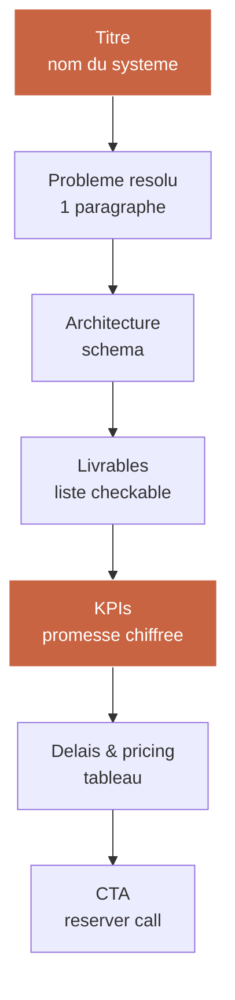

| Section | Longueur | Exemple (pour un Agent support niveau 1) |
|---------|----------|------------------------------------------|
| Titre | 1 ligne | « Agent Support Niveau 1 — Réponse automatique supervisée » |
| Problème résolu | 60-100 mots | « 60 % des tickets de votre support sont répétitifs. Votre équipe passe 1 500 h/an à répondre à des questions qui ont déjà été traitées… » |
| Architecture | 1 schéma | Diagramme mermaid 5 boxes max |
| Livrables | 6-10 items | Agent déployé, base de connaissances indexée, UI admin, monitoring, doc, formation 2h équipe |
| KPIs | 3-5 métriques | -50 % tickets humains traités, NPS +6 points, coût/ticket -65 % |
| Délais & pricing | Tableau | 6 semaines — 55 000 € HT — paiement 40/30/30 |
| CTA | 1 bouton | « Réserver un call de qualification 30 min » |

### Exemple commenté — Fiche produit « Agent Support Niveau 1 »

**Problème résolu.** 60 % de vos tickets de support concernent 20 % des sujets. Votre équipe passe 1 500 heures par an à répondre à la même chose. Résultat : NPS en baisse, coût support en hausse, temps de résolution qui frustre vos meilleurs clients. Notre Agent Support Niveau 1 résout automatiquement les tickets répétitifs, sous supervision humaine, avec un taux de résolution attendu de 62 %.

**Livrables.**
- Agent conversationnel déployé sur votre stack (Intercom, Zendesk, custom).
- Base de connaissances indexée (RAG) à partir de votre documentation existante.
- Interface d'administration pour réviser et améliorer les réponses.
- Dashboard monitoring (volume, coût, latence, qualité, taux d'escalation).
- Documentation technique + playbook support équipe.
- Formation 2h pour votre équipe support.
- Suivi post-deploy 4 semaines (1h/sem).

**KPIs à 90 jours.**
- Résolution automatique ≥ 60 % des tickets entrants niveau 1.
- NPS support ≥ +5 points vs baseline.
- Coût par ticket résolu -60 % vs baseline.
- Zéro hallucination facturée client (garantie contractuelle).

**Délais & pricing.**

| Phase | Durée | Milestones | Paiement |
|-------|-------|-----------|----------|
| Design + setup | 2 sem | Architecture validée, RAG indexé | 40 % |
| Build + deploy | 3 sem | Agent en prod sur 20 % du traffic | 30 % |
| Ramp-up + handover | 1 sem | 100 % traffic, équipe formée | 30 % |
| **Total** | **6 sem** | | **55 000 € HT** |

## 7.5 — Construire un catalogue de systèmes

L'objectif à 12 mois est d'avoir un catalogue de 5 à 8 systèmes packagés. Chacun a sa fiche, son prix, ses livrables, ses KPIs. Tu les vends individuellement ou en bundle.

| Catalogue cible mois 12 | Prix | Vente attendue sur 12 mois |
|-----------------------|------|---------------------------|
| Audit Flash CAIO | 4 500 € | 12-18 |
| Monitoring AI light | 15 000 € | 6-10 |
| Monitoring AI full | 40 000 € | 2-4 |
| Agent support L1 | 55 000 € | 2-3 |
| Agent onboarding | 55 000 € | 1-2 |
| Pipeline scoring lead | 80 000 € | 1-2 |
| Détection churn | 90 000 € | 1 |
| Dashboard ROI | 30 000 € | 2-3 |

Revenu catalogue projeté an 1 (hypothèse basse) : 380 000 €.
Revenu catalogue projeté an 1 (hypothèse haute) : 620 000 €.

## 7.6 — Livrable : fiche produit vierge + exemple commenté

Le livrable est :
- 1 template de fiche produit AI System (Markdown + PDF export).
- 1 exemple rempli (Agent Support Niveau 1).
- 1 checklist de validation « est-ce que ma fiche est prête à envoyer ? » (7 critères).

## Points clés du Module 7

- Vendre du temps plafonne à 330 k€/an. Vendre des systèmes n'a pas de plafond.
- Pricing hybride : prendre le max entre value-based (15-25 % de la valeur an 1) et cost-plus (× 2.5 du coût de production).
- Fiche produit = 2 pages, 7 sections, se vend par email sans toi.
- Objectif 12 mois : 5 à 8 systèmes au catalogue.
- Revenu catalogue projeté an 1 : 380 000 à 620 000 € HT.

---

# Module 08 — Ton plan 90 jours vers le premier €10k CAIO

**Durée : 1h00 · Format : roadmap + 3 chemins possibles + passerelle formation core**

## Objectifs du module

À la fin de ce module, tu seras capable de :

1. Exécuter une checklist 30/60/90 jours qui te mène à ton premier €10k de revenu CAIO.
2. Choisir entre trois chemins de carrière cohérents : interne, freelance, création de boîte.
3. Identifier les goulots d'étranglement qui bloquent 80 % des CTOs à cette étape.
4. Décider si tu veux builder seul les deux systèmes suivants (orchestration + ROI dashboard) ou prendre la formation core pour les avoir clé en main.
5. Signer ton engagement personnel de transformation.

## 8.1 — Checklist 30 / 60 / 90 jours

### Jour 0-30 — Fondations

| Semaine | Objectif | Livrable concret |
|---------|----------|------------------|
| S1 | Posture + audit personnel | Auto-audit rempli, 3 postures du CTO intégrées |
| S2 | Grille d'audit testée sur ton employeur actuel | Mini-rapport d'audit sur ta boîte (ou un ami CTO volontaire) |
| S3 | Page profil CAIO en ligne | URL publique `tonnom.com/caio` |
| S4 | Monitoring light déployé + LinkedIn post d'annonce | Dashboard public (ou Loom 5 min) + post LinkedIn qui génère 5-10 DMs |

### Jour 31-60 — Acquisition

| Semaine | Objectif | Livrable concret |
|---------|----------|------------------|
| S5 | 5 conversations de découverte avec prospects qualifiés | 5 notes de call structurées |
| S6 | 1 Audit Flash vendu à 4 500 € | Premier cash CAIO signé |
| S7 | Delivery audit + rapport publiable (anonymisé) | Case study publique (LinkedIn + page profil) |
| S8 | Fiche produit système 1 publiée (ex: Monitoring AI full) | Fiche PDF envoyée à 10 prospects post-audit |

### Jour 61-90 — Scale

| Semaine | Objectif | Livrable concret |
|---------|----------|------------------|
| S9 | 2 Audits supplémentaires signés | 9 000 € additionnels |
| S10 | 1 implémentation signée (offre 2) | 35-55 000 € additionnels |
| S11 | 1 conversation Fractional engagée | Proposition de contrat 6 mois envoyée |
| S12 | Bilan 90 jours + décision : continuer seul ou formation core | Décision stratégique |

### Trajectoire revenus 90 jours

| Période | Revenus cumulés attendus (hypothèse médiane) |
|---------|----------------------------------------------|
| Fin mois 1 | 0 € (investissement) |
| Fin mois 2 | 4 500 € (premier audit) |
| Fin mois 3 | 48 500 € (2 audits + 1 implémentation démarrée) |

Le premier €10k CAIO arrive typiquement entre la semaine 6 et la semaine 9. Tu atteins 40-60k€ cumulés fin mois 3 si tu exécutes avec discipline.

## 8.2 — Les 3 chemins possibles

Tu n'es pas obligé de devenir 100 % freelance. Il y a 3 chemins cohérents post-parcours, et chacun valorise ce que tu viens d'apprendre.

```mermaid
flowchart LR
    P[Parcours<br/>complete]
    P --> I[Chemin Interne<br/>Devenir CAIO chez son employeur]
    P --> F[Chemin Freelance<br/>Fractional 3-4 clients]
    P --> C[Chemin Fondation<br/>Creer son studio AI]

    style I fill:#3a3a3a,stroke:#fff,color:#fff
    style F fill:#c96442,stroke:#fff,color:#fff
    style C fill:#8b4a2b,stroke:#fff,color:#fff
```

### Chemin 1 — Interne : devenir CAIO chez ton employeur

**Profil visé.** Tu es CTO dans une boîte saine, le CEO t'écoute, tu veux évoluer sans quitter.

**Actions 90 jours.**
- Semaine 1 : pitch board « je veux évoluer vers le rôle CAIO, voici pourquoi, voici ce que je livre en 90 jours ».
- Semaines 2-12 : tu livres 2 systèmes (monitoring + un système métier) + 1 pitch board + 1 plan gouvernance IA.
- Négociation salariale à la fin du trimestre sur la base des résultats : +20 à +40 % de base, equity additionnelle, nouveau titre.

**Revenu cible 12 mois :** 180-240 k€/an (vs 120-160 k€ avant).

### Chemin 2 — Freelance : CAIO Fractional 3-4 clients

**Profil visé.** Tu veux de l'indépendance, de la diversité, et monter en compétence vite sur plusieurs secteurs.

**Actions 90 jours.**
- Quitter ou négocier ton poste actuel (préavis, side-hustle pendant transition).
- Déployer l'offre CAIO Fractional (module 6).
- Signer 2-3 missions dans les 90 jours.

**Revenu cible 12 mois :** 220-360 k€/an (selon TJM et taux remplissage).

### Chemin 3 — Fondation : créer un studio AI

**Profil visé.** Tu veux builder un actif, pas juste vendre des heures. Tu as une idée produit claire ou tu veux packager tes systèmes en SaaS.

**Actions 90 jours.**
- Structure juridique (SAS, Ltd, etc.).
- Mois 1 : 1 Audit Flash pour générer du cash.
- Mois 2-3 : premier MVP interne d'un système que tu vends déjà en prestation, transformé en produit.
- Recrutement premier associé ou premier dev.

**Revenu cible 12 mois :** très variable — 0 à 500 k€+ selon la trajectoire produit. Le chemin le plus risqué et le plus fort potentiel.

## 8.3 — Les 3 goulots classiques et leurs remèdes

| Goulot | Pourquoi ça bloque 80 % des CTOs | Remède |
|--------|-----------------------------------|--------|
| Le CTO ne prospecte pas | Ce n'est pas ton métier, tu codes | Bloque 3h/semaine pour 10 DMs + 5 posts LinkedIn. C'est une discipline, pas un talent. |
| Le CTO brade ses prix | Imposteur syndrome + peur de perdre le deal | Ton TJM minimum est écrit avant le call. Tu ne négocies jamais en live. Tu envoies une fiche produit. |
| Le CTO continue de vendre du temps | C'est ce qu'il connaît | Chaque trimestre, tu packages un système de plus. En 12 mois, 4 systèmes au catalogue. |

## 8.4 — La passerelle vers la formation core à 2 000 €

Ce parcours t'a donné :
- Le socle stratégique (modules 1, 2, 5, 6, 8).
- Une version light du système de monitoring (module 4).
- L'architecture et la méthodologie pour designer d'autres systèmes (module 3, 7).

Ce qu'il ne t'a pas donné, mais que la formation core te donne :

| Module core | Ce que tu gagnes en plus |
|-------------|--------------------------|
| Build complet du système 2 — Orchestration multi-agents | Template prod-ready (Claude + MCP + Composio), dispatcher multi-agent, gestion état, tests end-to-end |
| Build complet du système 3 — Dashboard ROI CAIO | Modélisation business par feature, graphiques exécutifs, rapports PDF automatiques, alerting Slack |
| Tous les templates système complets | 8 fiches produit prêtes à vendre, contrats cadres, scripts de closing, scripts email séquentiels |
| Simulation board avec coaching | 3 sessions de pitch sur cas réels, retours individuels, correction du deck |
| Accès communauté CAIO | Réseau de 80+ CAIOs actifs, sessions mensuelles, opportunités mission partagées |
| Support post-formation 3 mois | 1 call mensuel, Q&A async, revue de tes 3 premiers pitchs clients |

La formation core est à 2 000 € TTC. Elle s'adresse aux CTOs qui ont exécuté ce parcours et qui veulent accélérer sur les 6 mois suivants plutôt que d'apprendre par essai-erreur.

**Décision à prendre à la fin de la semaine 12.** Continuer seul sur les 9 mois suivants, ou intégrer la cohorte formation core pour compresser le temps d'apprentissage.

## 8.5 — Livrable : roadmap 90 jours personnelle

Le livrable final est ton document personnel, rempli, contenant :

- Tes 12 objectifs hebdomadaires concrets (1 par semaine).
- Tes 3 KPIs de suivi (prospects qualifiés, propositions envoyées, revenu signé).
- Ton chemin choisi (interne / freelance / fondation).
- Ta décision post-semaine-12 sur la formation core.
- Ta signature personnelle d'engagement (tu la relis chaque lundi matin).

### Template d'engagement personnel

```
Moi, [Nom], le [date], je m'engage sur les 90 prochains jours à :

1. Executer la checklist 30/60/90 sans negociation.
2. Produire publiquement 1 livrable par semaine minimum.
3. Tenir 3 h / semaine bloquees pour la prospection.
4. Ne pas brader mon TJM minimum fixe a : _______ eur / jour.
5. Prendre ma decision sur la formation core au plus tard le [date semaine 12].

Je signe : ___________________________
```

## Points clés du Module 8

- Le premier €10k CAIO arrive entre semaine 6 et 9 si tu exécutes la checklist.
- Trois chemins valides : Interne (CAIO salarié), Freelance (Fractional), Fondation (studio).
- Trois goulots classiques : prospection, pricing, addiction au temps vendu.
- La formation core à 2 000 € te fait gagner 6 mois. Elle est optionnelle, pas obligatoire.
- Ton engagement personnel signé est le vrai livrable. Le reste est outillage.

---

# Synthèse — Ce que Thomas maîtrise à la fin du parcours

En 12 heures structurées, tu es passé d'un CTO qui livre de l'IA à un CAIO qui oriente une stratégie IA. Voici ce que tu maîtrises maintenant, point par point.

| Compétence | Niveau avant | Niveau après | Preuve concrète |
|-----------|--------------|--------------|-----------------|
| Auditer une organisation en 90 minutes | 0 | Opérationnel | Grille d'audit + exemple rempli |
| Pitcher un système AI à un board sans jargon | 1 | Opérationnel | Deck 5 slides + script 12 min |
| Offre CAIO Fractional structurée | 0 | Déployée | Page profil + 3 offres packagées |
| Comprendre vendre système ≠ vendre temps | 1 | Intégré | Fiche produit + catalogue en cours |
| Accès à 1 système template light | 0 | Déployé | Monitoring AI light en prod |
| Lecture organisation 4 couches | 0 | Maîtrisée | Cartographie client livrée |
| Architecture AI system complète | 2 | Opérationnelle | Template Notion + Figma |
| Plan 90 jours clair | 0 | Signé | Roadmap personnelle + engagement |

Tu n'as pas un certificat. Tu as **un kit opérationnel** qui te permet de basculer de registre dès lundi prochain.

---

# Annexe A — Glossaire CAIO

| Terme | Définition courte |
|-------|-------------------|
| Agent | Unité d'exécution LLM avec rôle, prompt système et tools. |
| Audit Flash | Audit CAIO en 90 minutes produisant 5-7 opportunités priorisées. |
| CAIO | Chief AI Officer, responsable stratégique IA d'une organisation. |
| Capacité | Potentiel d'action réutilisable par le système IA (vs feature isolée). |
| Couche (4 couches) | Data, Process, Décision, Interface — framework de lecture d'organisation. |
| Embedding | Représentation vectorielle d'un contenu pour recherche sémantique. |
| Évaluation (eval) | Mesure systématique de la qualité d'un output IA. |
| Fractional | Format de mission à temps partiel (2-3 jours/sem sur plusieurs clients). |
| Hallucination | Réponse IA factuellement fausse produite avec confiance. |
| LLM-as-a-judge | Utilisation d'un LLM pour scorer les outputs d'un autre LLM. |
| MCP | Model Context Protocol, standard d'interopérabilité entre LLM et outils. |
| Memory (short/long) | Mémoire de session vs mémoire persistante structurée + embeddings. |
| Monitoring AI | Tableau de bord en temps réel des métriques IA (volume, coût, latence, qualité). |
| Orchestrator | Composant qui décide quel agent/tool appeler selon le contexte. |
| RAG | Retrieval Augmented Generation — recherche + génération. |
| ROI mensuel | Ratio valeur générée / coût total de fonctionnement du système. |
| Stack CAIO 2026 | Next.js 16 + Convex + Claude API + Clerk + Composio + Trigger.dev + Vercel. |
| Tool use | Capacité d'un LLM à appeler des fonctions externes en cours de raisonnement. |
| Trigger | Événement déclencheur d'un système IA (webhook, cron, user action). |
| Value-based pricing | Facturation en pourcentage de la valeur économique générée. |
| Vector store | Base vectorielle indexant des embeddings pour recherche sémantique. |

---

# Annexe B — Checklist complète 90 jours

### Semaine 1
- [ ] Auto-audit posture rempli et signé.
- [ ] Lecture des modules 1 et 2 terminée.
- [ ] Grille d'audit imprimée et dans ton workflow.

### Semaine 2
- [ ] Audit blanc fait sur ton employeur actuel ou un CTO volontaire.
- [ ] Mini-rapport audit produit (6-8 pages).
- [ ] Module 3 complété.

### Semaine 3
- [ ] Page profil CAIO designée (Figma).
- [ ] Page profil CAIO déployée (Next.js + domaine personnel).
- [ ] Module 4 commencé.

### Semaine 4
- [ ] Monitoring AI light déployé sur ton domaine personnel.
- [ ] Post LinkedIn d'annonce publié (objectif 5-10 DMs).
- [ ] Module 5 commencé.

### Semaine 5
- [ ] Deck pitch CAIO personnalisé.
- [ ] 5 conversations prospects programmées.
- [ ] Module 6 commencé.

### Semaine 6
- [ ] Premier Audit Flash vendu à 4 500 €.
- [ ] Contrat signé, acompte encaissé.
- [ ] Module 7 commencé.

### Semaine 7
- [ ] Delivery audit vendu.
- [ ] Case study anonymisé publié.
- [ ] Module 8 commencé.

### Semaine 8
- [ ] Fiche produit Système 1 finalisée.
- [ ] Envoi fiche produit à 10 prospects post-audit.
- [ ] Tous les modules complétés.

### Semaine 9
- [ ] 2ème et 3ème Audits Flash signés.
- [ ] Revenu cumulé ≥ 13 500 €.

### Semaine 10
- [ ] 1ère implémentation signée (offre 2).
- [ ] Acompte encaissé.

### Semaine 11
- [ ] 1ère conversation Fractional engagée.
- [ ] Proposition de contrat 6 mois envoyée.

### Semaine 12
- [ ] Bilan 90 jours rédigé.
- [ ] Décision formation core prise.
- [ ] Roadmap mois 4-6 posée.

---

# Annexe C — Ressources complémentaires

### Lectures

| Livre | Auteur | Pourquoi |
|-------|--------|----------|
| The Hard Thing About Hard Things | Ben Horowitz | Posture de décision sous incertitude. |
| Crossing the Chasm | Geoffrey Moore | Comprendre les phases d'adoption technologique. |
| High Output Management | Andy Grove | Reflexes de management système. |
| Accelerate | Forsgren, Humble, Kim | Métriques engineering qui comptent. |
| The Mom Test | Rob Fitzpatrick | Interviews client utiles (pour les audits CAIO). |

### Sources à suivre

| Source | Format | Cadence |
|--------|--------|---------|
| Anthropic Engineering Blog | Articles techniques | Hebdo |
| Simon Willison's blog | Notes LLM techniques | Quasi quotidien |
| Latent Space Podcast | Podcast longue forme | Hebdo |
| Eugene Yan's blog | Essais applied ML | Mensuel |
| Lilian Weng's blog | Research LLM | Trimestriel |

### Outils à connaître

| Outil | Usage CAIO |
|-------|------------|
| Claude (API + claude.ai) | LLM principal 2026 |
| Cursor / Claude Code | IDE agentique |
| Convex | Backend TypeScript temps réel |
| Composio | 300+ intégrations SaaS |
| Trigger.dev | Jobs async longs + cron |
| LangSmith / Langfuse | Observabilité LLM |
| Chroma / Pinecone / Convex vector | Vector stores |
| Vercel | Deploy edge |

---

# Annexe D — FAQ

**Q. Combien de temps entre la fin du parcours et mon premier client payant ?**
R. Entre 6 et 10 semaines si tu exécutes la checklist 90 jours. Les CTOs qui prospectent 3h/sem à partir de la semaine 3 signent typiquement en semaine 6-8.

**Q. Je n'ai pas de références IA visibles publiquement, comment je fais ?**
R. Le monitoring AI light (module 4) déployé sur ton domaine personnel est ta première référence. Tu publies une case study anonymisée de ton audit blanc (semaine 2) comme deuxième référence. Ça suffit pour signer les deux premiers audits.

**Q. Mon employeur actuel me bloque l'activité freelance. Que faire ?**
R. Négocie une clause side-hustle ou un passage à 4 jours/sem. Sinon, suis le Chemin Interne (section 8.2) : tu deviens CAIO chez ton employeur avant de passer freelance.

**Q. Je suis junior CTO (< 3 ans). Est-ce que ce parcours est pour moi ?**
R. Partiellement. Les modules 1, 2, 4, 5 sont directement applicables. Les modules 6 et 7 (offre et pricing CAIO) supposent 5+ ans d'expérience pour être crédibles au tarif cible. Considère d'abord le parcours Kevin (From Dev to CAIO) si tu es < 3 ans.

**Q. Je travaille déjà avec OpenAI et je ne veux pas changer pour Anthropic. Problème ?**
R. Non. Toute la méthodologie est model-agnostic. Les templates de code utilisent Claude parce que c'est la stack Agentik OS 2026 et la plus solide pour le tool use en 2026, mais tu peux tout porter sur GPT-4, Gemini ou Llama en changeant l'import SDK.

**Q. Je suis dans une grosse boîte (> 2000 personnes). Est-ce que l'offre CAIO Fractional fonctionne ?**
R. Oui, mais les cycles de vente sont plus longs (4-8 mois). Tu vises plutôt les divisions ou les BU autonomes. Pour attaquer ce segment, prends la formation core où ce cas est détaillé en profondeur.

**Q. Est-ce que je peux enseigner ce parcours dans ma boîte après l'avoir suivi ?**
R. Non, les contenus sont sous licence personnelle. Tu peux utiliser les templates pour tes clients. Tu ne peux pas revendre ni réenseigner.

---

# Conclusion — Ce qui t'attend

Tu refermes ce parcours avec trois actifs qui valent plus que n'importe quel certificat :

1. **Un cerveau bilingue.** Tu passes d'un vocabulaire technique à un vocabulaire business sans friction. C'est la compétence la plus rare du marché en 2026.
2. **Un kit opérationnel déployable.** Page profil, offre packagée, monitoring en prod, fiche produit, pitch deck — tout est prêt à être utilisé chez un client dès la semaine 13.
3. **Une trajectoire claire.** Trois chemins cohérents, un plan 90 jours exécutable, des KPIs mesurables chaque semaine.

Le CAIO que tu vas devenir n'est pas un titre. C'est un **registre d'opération**. Tu le choisis chaque semaine, chaque réunion, chaque pitch, en décidant de ne pas redescendre dans le code par défaut. Le parcours t'a donné la grammaire ; la discipline quotidienne fera la langue.

La seule question qui te reste : *est-ce que tu exécutes ?*

Si oui, on se voit dans la formation core, ou dans 3 mois sur ta première case study publique. Si non, relis le module 1 une fois par semaine jusqu'à ce que l'inconfort te pousse à agir.

**Agentik {OS} — agentik-os.com**
