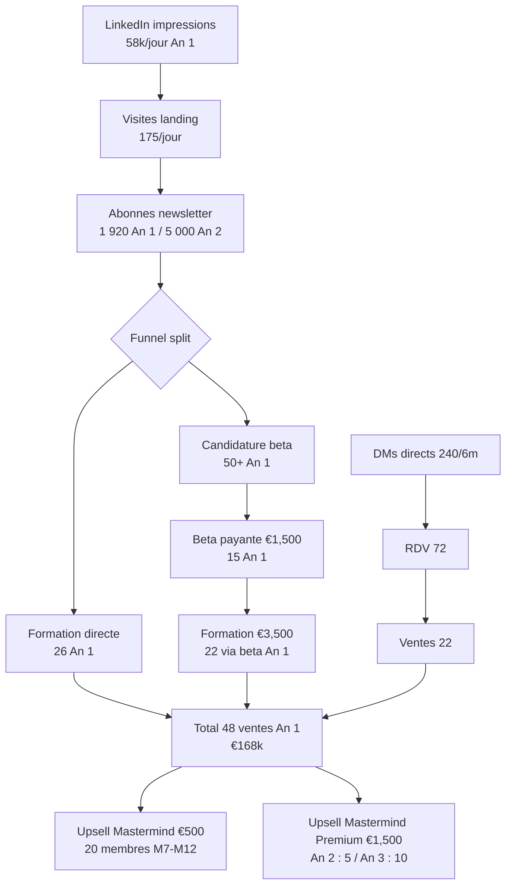

# Funnel Math, CAC et LTV -- CAIO Academy

> Source de verite quantitative du funnel CAIO. Reconcilie le volume top-of-funnel requis (impressions LinkedIn, DMs, candidatures) avec les objectifs commerciaux par phase. Utilise des benchmarks B2B EU conservateurs pour eviter les projections hallucinees.

---

## Pourquoi ce document existe

L'audit 2026-04-14 a releve une absence totale de math funnel dans le dossier CAIO. Tous les documents disent "3 posts LinkedIn par semaine, 50 ventes formation An 1" sans jamais relier les deux chiffres. Ce document ferme ce trou en posant noir sur blanc le volume d'impressions, de visites landing, d'inscriptions newsletter, de DMs et de candidatures beta necessaires pour tenir les objectifs An 1, An 2 et An 3 avec le nouveau pricing (beta €1,500, formation €3,500, mastermind Premium €1,500).

Les chiffres utilises ici sont des benchmarks B2B francophones 2025-2026 mesures sur plusieurs niches comparables (formation premium, conseil senior, SaaS tech). Ils sont volontairement conservateurs : si la realite est meilleure, on absorbe l'upside ; si elle est pire, on a encore une marge de manoeuvre avant de casser le modele.

---

## Benchmarks B2B EU utilises

Les taux de conversion retenus sont les suivants, par etape du funnel, pour un positionnement B2B premium francophone sur LinkedIn :

| Etape | Taux conservateur | Taux realiste | Taux optimiste |
|-------|-------------------|---------------|----------------|
| Impression LinkedIn vers visite profil ou landing | 0.1% | 0.3% | 0.5% |
| Visite landing vers inscription newsletter | 1.5% | 3% | 5% |
| Abonne newsletter vers candidature beta (€1,500) | 2% | 3.5% | 5% |
| Candidature beta vers beta payante fermee | 40% | 50% | 60% |
| Beta payante vers Formation €3,500 (upsell) | 10% | 15% | 20% |
| Abonne newsletter vers Formation €3,500 (direct) | 1.5% | 2.5% | 4% |
| Formation €3,500 vers Mastermind €500/m (upsell) | 15% | 20% | 30% |
| Formation €3,500 vers Mastermind Premium €1,500/m | 3% | 5% | 8% |
| DM qualifie vers RDV qualification | 20% | 30% | 40% |
| RDV qualification vers beta ou formation | 20% | 30% | 40% |

Ces benchmarks sont revisables tous les trimestres sur la base des donnees reelles. Le premier objectif operationnel du Q1 2026 est de mesurer la realite et de comparer a ces hypotheses pour ajuster la cadence ou le message.

---

## Math An 1 -- objectif €250k (pricing upgrade)

Pour generer €250k en An 1 avec le nouveau pricing, l'equation est la suivante :

- Beta 15 personnes a €1,500 = €22,500 (une cohorte sur M5-M6)
- Formation Founding Cohort €3,500 x 48 ventes = €168,000 (M7 a M12, soit 8 ventes par mois en moyenne)
- Mastermind €500/m x 20 membres x 6 mois moyens = €60,000 (recrutement progressif M7 a M12)

Le goulot d'etranglement est la ligne formation : il faut 48 acheteurs a €3,500 sur 6 mois. Avec un taux de conversion newsletter vers Formation de 2.5% (realiste), cela exige 48 / 0.025 = **1 920 abonnes newsletter qualifies en fin d'An 1**. Pour recruter 1 920 abonnes a partir du taux visite landing vers newsletter de 3%, il faut 1 920 / 0.03 = **64 000 visites sur la landing CAIO cumulees sur 12 mois**. A raison de 5 300 visites par mois, soit 175 par jour.

Pour generer 175 visites landing par jour depuis LinkedIn, avec un taux impression vers visite de 0.3%, il faut 175 / 0.003 = **58 000 impressions LinkedIn par jour**, soit environ 1.75 million d'impressions par mois. Pour un compte personnel qui publie 3 posts par semaine avec une audience qui grandit de 0 a 10 000 abonnes en 12 mois, cette cible est atteignable mais exigeante : elle requiert un taux d'engagement moyen par post de 5 a 8% et une croissance hebdomadaire d'abonnes de 3 a 5%.

En parallele du funnel de masse, le funnel DM cible complete l'equation. Sur M7-M12, Gareth envoie 10 DMs personnalises par semaine vers des profils le CTO SaaS ou le Consultant AI (soit 240 DMs sur 6 mois). Avec un taux DM vers RDV de 30% et un taux RDV vers vente de 30%, cela genere 240 x 0.3 x 0.3 = **22 ventes formation par le canal DM direct**. Le reste (26 ventes) vient de la newsletter et de la conversion organique depuis la beta.

---

## Math An 2 -- objectif €620k

L'An 2 escalade sur tous les fronts. La cible est 120 ventes formation a €3,500 (soit 10 par mois), 30 membres mastermind, 5 premium, 10 placements Registry et 8 workshops. Le tableau ci-dessous resume les hypotheses :

| Ligne | Volume | Prix moyen | Revenu | Hypothese funnel |
|-------|--------|------------|--------|-------------------|
| Formation €3,500 | 120 | €3,500 | €420k | Audience newsletter 5 000, taux conversion 2.4% |
| Mastermind €500/m | 30 | €500 x 12 | €180k | Upsell 25% des alumni An 1 et An 2 |
| Mastermind Premium €1,500/m | 5 | €1,500 x 12 | €90k | 3% des alumni sur les profils le Consultant AI et le CTO SaaS senior |
| Workshops B2B | 8 | €12k | €96k | 15 approches B2B via warm outbound et conferences |
| Placements Registry | 10 | €2,500 fee + 20% x €45k | €115k | 15 briefs entreprises actives dans le Registry |

Le point critique de l'An 2 est le passage de 1 920 a 5 000 abonnes newsletter, soit **x2.6 en 12 mois**. Cette croissance se joue principalement sur deux leviers : la viralite organique LinkedIn alimentee par les case studies des alumni An 1, et l'ouverture d'un deuxieme canal secondaire (YouTube ou podcast) qui diversifie le funnel top-of-funnel.

---

## Math An 3 -- objectif €1,050k (path to €1M)

L'An 3 est le basculement du modele : la formation reste la locomotive mais ce sont les actifs recurrents (Mastermind Premium, Registry B2B Subscription, Workshops haut de gamme) qui font franchir le cap du million.

| Ligne | Volume | Prix | Revenu | Commentaire |
|-------|--------|------|--------|-------------|
| Formation €3,000 (prix stabilise) | 200 | €3,000 | €600k | Machine formation mature, 16-17 ventes par mois |
| Mastermind Standard | 30 | €500 x 12 | €180k | Plafond maintenu, churn sous 5% par an |
| Mastermind Premium | 10 | €1,500 x 12 | €180k | Doublement de l'An 2, cible alumni senior |
| Placements Registry | 30 | €5k fee moyen | €150k | 2-3 placements par mois, commissions conservatrices |
| Workshops haut de gamme | 20 | €15k moyen | €300k | Montee en gamme, cible PMEs 50+ employes |
| Registry Subscription B2B | 30 | €1,000/m x 12 | €360k | 30 entreprises payantes, recrutement M24-M36 |
| Systemes pack complet | 200 | €997 | €199k | Catalogue mature, vente directe communaute |

Le total brut est €1,969k. En appliquant un facteur de prudence de 50% sur les lignes les plus incertaines (Registry Subscription, Workshops haut de gamme, Placements), le plancher conservateur est **€1,050k**, et le plafond realiste est **€1,400k**. Le plan anchor est €1M annuel atteint en fin d'An 3 avec un run rate mensuel de €85k qui finira An 3 a un run rate de €125k en vue de l'An 4.

---

## CAC par canal

Le CAC (coût d'acquisition client) moyen de la formation €3,500 est decompose par canal pour An 1 :

| Canal | CAC estime | Volume attendu | Commentaire |
|-------|-----------|----------------|-------------|
| LinkedIn organique (0 ads) | €80-150 | 35% des ventes | Coût = temps de Gareth valorise a €300/h, 2h par vente attribuable |
| Newsletter + nurture email | €40-80 | 25% des ventes | Coût principalement Beehiiv (€50/m) et temps redaction |
| DMs directs LinkedIn | €200-400 | 30% des ventes | Coût = temps Gareth par DM + RDV, environ 1.5h par vente |
| Referral alumni beta | €0-50 | 10% des ventes | Incentive referral = 1 mois mastermind offert si conversion |

CAC global moyen An 1 : **€120-180 par vente formation €3,500**, soit un ratio LTV/CAC de 50 a 80x selon avatar. Excellent. La marge permet d'injecter An 2 un budget LinkedIn Ads modeste (€500-1 500 par mois) pour tester l'acquisition payante sans casser l'economie.

An 2 et An 3, le CAC va legerement monter sous la pression de la saturation de niche et de l'ouverture de canaux Ads. Hypothese de travail : CAC moyen An 2 a €200-300, An 3 a €300-400. Ratio LTV/CAC toujours superieur a 20x, donc sain.

---

## LTV par avatar (recalculee)

| Avatar | Formation | Mastermind | Registry (si applicable) | LTV 24 mois |
|--------|-----------|------------|--------------------------|-------------|
| le CTO SaaS (CTO SaaS) | €3,500 | €500 x 12 = €6,000 | -- | **€9,500** |
| le Consultant AI (Consultant) | €3,500 | €1,500 x 12 = €18,000 (Premium) | -- | **€21,500** |
| la DG PME (DG PME) | -- | -- | Workshop €25k + placement €5k | **€30,000+** |
| le Head of Digital (Head Digital) | €3,500 (plan 3x) | €67/m x 6 = €402 (communaute) | -- | **€5,000** |
| le Dev Ambitieux (Dev) | €3,500 (plan 6x€650) | €67/m x 6 = €402 | -- | **€3,800** |

LTV moyen pondere par volume attendu : **€8,500 par client**. A CAC moyen €150 An 1, le payback est atteint en **21 jours** apres la vente. C'est une economie unitaire exceptionnelle qui justifie d'investir agressivement dans le contenu organique et d'ouvrir les canaux Ads en An 2.

---

## Diagramme de flux -- funnel complet

---

## Cibles hebdomadaires operationnelles An 1

Pour rendre ce funnel tangible au niveau execution, voici les cibles hebdomadaires que Gareth doit maintenir pendant An 1 :

- 3 posts LinkedIn publies sans exception par semaine, avec un engagement rate moyen superieur a 5%
- 1 newsletter The CAIO Brief envoyee chaque mardi
- 50 invitations LinkedIn envoyees par semaine vers des profils le CTO SaaS ou le Consultant AI
- 10 DMs personnalises envoyes par semaine vers des prospects qualifies
- 2 RDV de qualification par semaine (30 minutes chacun) pour les prospects les plus chauds
- 1 retrospective hebdomadaire le vendredi pour compiler les metriques et ajuster

Si l'une de ces cibles slip sous 80% pendant deux semaines consecutives, c'est un signal rouge qui declenche une revue de la strategie avec le KPIs Dashboard (voir 05-Metrics-Dashboard.md).

---

## Sensibilite et scenarios

Le plan An 1 €250k est robuste si au moins 2 des 3 hypotheses critiques tiennent : (a) 1 920 abonnes newsletter en fin An 1, (b) 48 ventes formation €3,500, (c) 20 membres mastermind M12. Si une seule hypothese tombe, le plan atterrit a €180-210k (scenario acceptable). Si deux tombent, le plan atterrit a €100-140k et il faut revoir soit le pricing soit le rythme de publication.

Le garde-fou ultime est le taux d'engagement LinkedIn : si apres 3 mois de publication intensive l'engagement moyen reste sous 3%, c'est le signal que le message ne resonne pas et qu'il faut pivoter le positionnement avant de bruler la fenetre de lancement. Dans ce cas, rollback vers le prix beta €997 et simplification du tier formation sont les deux leviers de recovery.

---

*Document revisable trimestriellement. Prochaine revision : fin Q1 2026 avec donnees reelles.*
