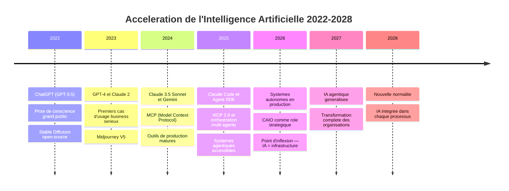
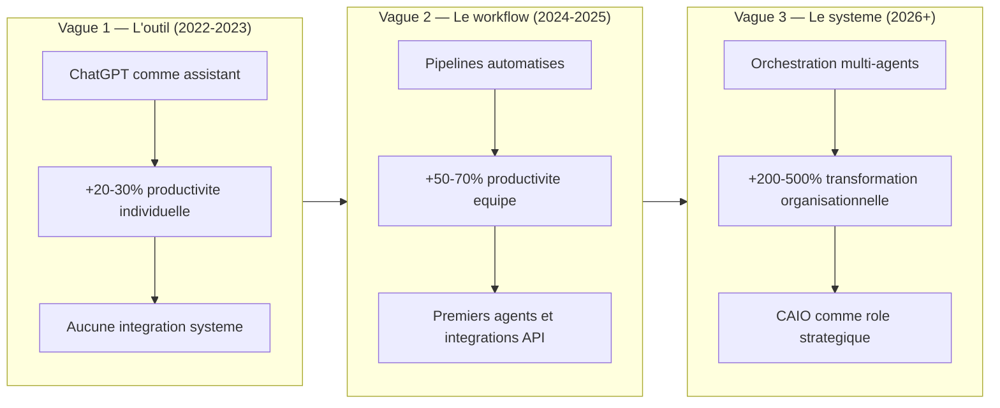
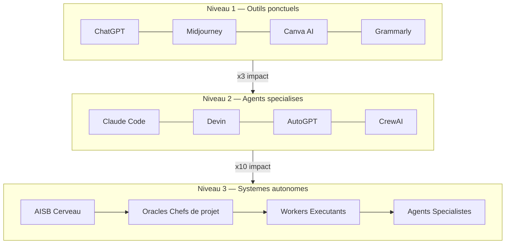
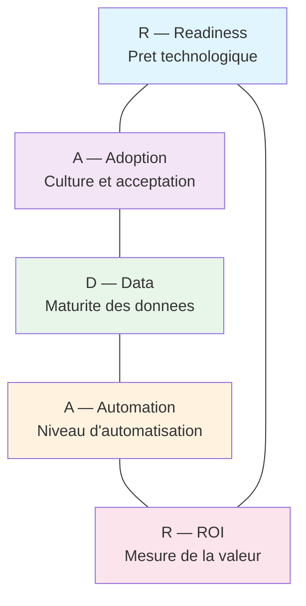
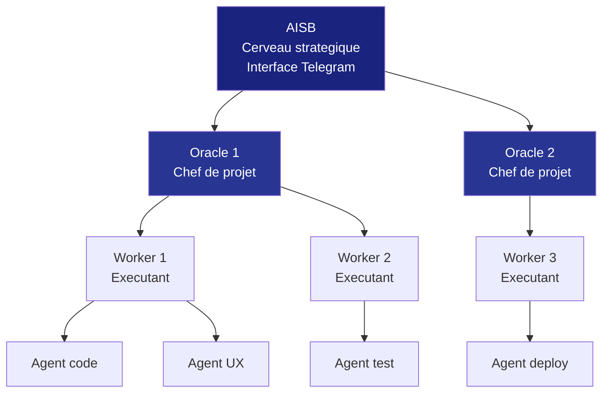

# Module 01 — Intro : La Philosophie IA

> *"Nous ne vivons pas une revolution technologique. Nous vivons une revolution de l'ESPECE."*

La courbe d'acceleration de l'intelligence artificielle redefinit les regles du jeu en 2026. Ce module fondateur pose les bases du mindset CAIO : comprendre pourquoi l'IA ne se resume plus a des outils isoles mais constitue un ecosysteme complet — des modeles de langage aux agents autonomes, en passant par les systemes multi-agents orchestres.

Vous allez decouvrir les 7 shifts fondamentaux qui transforment notre rapport au travail, a l'expertise et a la creation. Vous comprendrez pourquoi 2026 est le point d'inflexion historique. Et vous repartirez avec un framework actionnable pour evaluer — et transformer — la maturite IA de n'importe quelle organisation.

---

## Objectifs du module

A l'issue de ce module, vous serez capable de :

1. **Analyser** la trajectoire d'acceleration IA 2022-2028 et identifier les points d'inflexion strategiques
2. **Adopter** le mindset CAIO : posture, responsabilites, impact organisationnel mesurable
3. **Distinguer** les 3 niveaux de maturite IA (outils, agents, systemes autonomes) et positionner votre organisation
4. **Appliquer** le framework RADAR-IA pour un diagnostic complet de maturite
5. **Comprendre** la philosophie Agentik OS et ses 5 principes fondateurs
6. **Identifier** les cas d'usage a fort impact avec la methode ICE-IA
7. **Cartographier** les transformations industrielles et les reconversions de competences

---

## Lecon 1 — L'acceleration IA 2022-2028 : comprendre la trajectoire

### Objectifs d'apprentissage

- Comprendre la chronologie des avancees majeures en IA depuis 2022
- Identifier les 3 vagues de l'IA en entreprise et leur impact quantifie
- Expliquer pourquoi 2026 constitue un point d'inflexion irreversible
- Analyser les 7 shifts fondamentaux qui redefinissent le travail et la creation

### Les 7 shifts irreversibles

Avant de plonger dans la timeline, il faut comprendre que l'IA ne change pas seulement nos outils — elle redefinit les regles fondamentales du jeu economique et social. Sept transformations irreversibles sont en cours :

| # | Shift | Avant | Apres |
|---|-------|-------|-------|
| 1 | **Connaissance → Navigation** | "Je sais des choses" = valeur | "Je sais quoi demander" = valeur |
| 2 | **Execution → Orchestration** | "Je fais moi-meme" = travail | "Je dirige des agents" = travail |
| 3 | **Expertise → Jugement** | "Je suis expert en X" = valeur | "Je sais evaluer X" = valeur |
| 4 | **Original → Authentique** | "C'est nouveau" = valeur | "C'est authentiquement humain" = valeur |
| 5 | **Scale → Precision** | "Je touche des millions" = succes | "Je touche exactement qui il faut" = succes |
| 6 | **Propriete → Acces** | "Je possede X" = richesse | "J'ai acces a X" = richesse |
| 7 | **Humain → Humain augmente** | "La machine est externe" | "La machine est partie de moi" |

**Le shift le plus important pour un CAIO** est le passage de l'execution a l'orchestration. Le "faire" devient delegable a l'infini. Le "decider quoi faire" et le "juger la qualite de ce qui est fait" deviennent le vrai travail. L'expertise technique se commoditise ; le jugement, le gout et l'ethique deviennent premium.

### La timeline de l'acceleration IA



**Chiffres cles de l'acceleration :**

- **2022** : 100 millions d'utilisateurs de ChatGPT en 2 mois (record absolu d'adoption)
- **2023** : Les modeles GPT-4 et Claude 2 atteignent un taux d'erreur factuelle inferieur a 15% sur les taches business standards
- **2024** : Le cout d'utilisation des API IA chute de 90% en 18 mois. Claude 3.5 Sonnet atteint des performances superieures a GPT-4 sur de nombreux benchmarks
- **2025** : Claude Code permet a un developpeur seul de produire l'equivalent d'une equipe de 5-10 personnes. Le MCP standardise la communication outil-modele
- **2026** : Le taux d'erreur des modeles descend sous 5% pour les taches de production. Le cout d'une stack IA complete est 10-100x inferieur a une equipe traditionnelle

### Les 3 vagues de l'IA en entreprise



**Vague 1 — L'outil (2022-2023)**

L'IA est utilisee comme un assistant ponctuel. Un employe ouvre ChatGPT, pose une question, obtient une reponse. Productivite individuelle en hausse de 20-30%. Mais aucune integration dans les systemes de l'entreprise. Chaque utilisation est manuelle, deconnectee.

*Exemple concret :* Un marketeur utilise ChatGPT pour rediger un email. Il copie-colle le resultat dans son outil d'emailing. Gain : 15 minutes. Mais il refait la meme chose demain, sans memoire ni automatisation.

**Vague 2 — Le workflow (2024-2025)**

L'IA s'integre dans les pipelines de travail via des API. Les premiers agents apparaissent — des IA capables d'enchainer plusieurs etapes de facon autonome. La productivite d'equipe augmente de 50-70%. Le MCP (Model Context Protocol) standardise la communication entre les outils et les modeles.

*Exemple concret :* Un pipeline automatise recoit les demandes clients par email, les analyse avec Claude, redige une reponse personnalisee, l'envoie, et met a jour le CRM. L'humain supervise et intervient uniquement sur les cas complexes.

**Vague 3 — Le systeme (2026+)**

L'IA devient une infrastructure organisationnelle. Des systemes multi-agents orchestres gerent des processus complets de bout en bout. La transformation depasse la productivite pour atteindre la reinvention des metiers. Le CAIO emerge comme role strategique — celui qui architecture, orchestre et mesure l'impact de cette transformation.

*Exemple concret :* Agentik OS — un ecosysteme de 267 agents specialises coordonnes par une hierarchie d'Oracles, permettant a un fondateur seul de gerer 11 projets simultanement, avec 16 audits forensiques automatiques et un temps moyen par ticket de 8-15 minutes (contre 1-3 heures manuellement).

### Pourquoi 2026 est le point d'inflexion

Quatre facteurs convergent pour faire de 2026 le moment ou l'IA passe de "technologie prometteuse" a "infrastructure indispensable" :

1. **Fiabilite de production** : Les modeles atteignent un taux d'erreur inferieur a 5% sur les taches business standards. L'IA n'est plus un jouet — c'est un outil de production fiable.

2. **Outils d'orchestration matures** : Le MCP, Claude Code, les Agent SDK permettent de construire des systemes multi-agents sans etre chercheur en IA. La barre technique baisse drastiquement.

3. **Economie inversee** : Le cout d'une stack IA complete (10-100x inferieur a une equipe) rend irrationnel de ne PAS utiliser l'IA pour les taches automatisables. La question n'est plus "peut-on se permettre l'IA?" mais "peut-on se permettre de ne PAS l'utiliser?"

4. **Preuves de ROI** : Les premiers CAIOs demontrent des resultats mesurables — $50K a $500K d'economie annuelle par organisation. Ce ne sont plus des promesses, ce sont des chiffres.

### Exercice pratique — Diagnostic de position

**Duree estimee : 45 minutes**

**Etape 1 — Cartographiez votre position sur les 3 vagues**

Pour chaque processus de votre organisation (ou d'une organisation que vous connaissez bien), determinez a quelle vague il se situe :

| Processus | Vague actuelle | Vague cible | Gap |
|-----------|---------------|-------------|-----|
| Support client | ? | ? | ? |
| Creation contenu | ? | ? | ? |
| Ventes/prospection | ? | ? | ? |
| Developpement produit | ? | ? | ? |
| Operations internes | ? | ? | ? |

**Etape 2 — Identifiez 3 indicateurs**

Pour chaque processus, identifiez un indicateur concret qui montrerait que vous etes pret pour la vague suivante. Exemples :
- "Nous avons un API key active sur un modele IA" (passage vague 1 → 2)
- "Nous avons au moins un pipeline automatise qui tourne sans intervention humaine" (passage vague 2 → 3)

**Etape 3 — Estimez l'impact**

Pour le processus avec le plus grand gap, estimez :
- Temps actuellement passe par semaine (en heures-homme)
- Temps estime apres transformation IA
- Economie potentielle en euros/dollars par an

### Points cles a retenir

- L'acceleration IA n'est pas lineaire mais exponentielle — chaque annee multiplie les capacites de l'annee precedente
- Les 7 shifts fondamentaux touchent TOUTES les organisations, pas seulement la tech
- 2026 est le point d'inflexion : les 4 facteurs de convergence rendent l'adoption IA non-optionnelle
- La question strategique n'est plus "faut-il adopter l'IA?" mais "a quelle vitesse et comment?"

---

## Lecon 2 — Le mindset CAIO : posture, responsabilites, impact

### Objectifs d'apprentissage

- Definir precisement le role de Chief AI Officer et le distinguer des roles adjacents
- Identifier les 6 responsabilites cles du CAIO
- Adopter la posture CAIO : pensee systemique, mesure, construction durable
- Comprendre les 5 stades du deuil technologique et comment les traverser

### Le CAIO n'est pas un ingenieur IA — C'est un architecte de systemes

La distinction est fondamentale :

| Role | Focus | Output | Valeur |
|------|-------|--------|--------|
| **Ingenieur IA** | Cree des modeles | Code, modeles | Technique |
| **Consultant IA** | Donne des conseils | Rapports, recommandations | Strategique (theorique) |
| **CTO** | Gere la tech | Infrastructure, equipes | Operationnelle |
| **CAIO** | Orchestre la transformation IA | Systemes en production, ROI mesure | Strategique + operationnelle |

Le CAIO est a l'intersection de la strategie et de l'execution. Il ne code pas lui-meme — il orchestre la construction via des agents et des equipes. Il ne donne pas des conseils — il delivre des resultats mesurables.

### Les 6 responsabilites du CAIO

1. **Audit** — Evaluer la maturite IA de l'organisation. Identifier les 20% de processus qui generent 80% de la valeur potentielle IA. Utiliser des frameworks structures (RADAR-IA, ICE-IA) pour produire un diagnostic actionnable, pas une presentation PowerPoint.

2. **Design** — Concevoir l'architecture IA. Choisir les bons modeles, outils, integrations. Dessiner la roadmap de transformation. Chaque decision doit etre justifiee par un rapport cout/benefice clair.

3. **Implementation** — Construire les systemes. Pas coder soi-meme — orchestrer la construction via des agents IA et des equipes humaines. Superviser la qualite. S'assurer que chaque composant fonctionne en production, pas en demo.

4. **Orchestration** — Faire tourner les systemes en production. Monitoring, alerting, amelioration continue. Un systeme qui marche en demo mais pas en production n'a aucune valeur. Le CAIO est responsable de la fiabilite operationnelle.

5. **Leadership strategique** — Communiquer avec la C-Suite. Traduire les capacites IA en impact business comprehensible. Convaincre, aligner, mobiliser. Le CAIO est un pont entre la technique et le business.

6. **ROI mesurable** — Chaque action a un impact chiffre. Pas de "ca pourrait etre utile" — mais "$X economise ce mois-ci" ou "Y heures liberees cette semaine". Le CAIO pense en euros, pas en features.

### La posture CAIO

La posture CAIO repose sur quatre principes directeurs :

**Penser en systemes, pas en taches.** Un outil IA isole a un impact limite. Un systeme d'outils orchestres a un impact exponentiel. Le CAIO ne cherche pas "quel outil utiliser pour cette tache" mais "comment construire un systeme qui gere cette categorie de taches automatiquement".

**Mesurer tout.** Temps, cout, qualite, revenus — tout doit etre mesure. Sans mesure, pas de preuve. Sans preuve, pas de credibilite. Sans credibilite, pas de transformation. Le CAIO installe des metriques AVANT de lancer un projet, pas apres.

**Construire pour durer.** Pas des demos, des systemes de production. La difference entre une demo et un systeme de production, c'est 6 mois de travail sur la fiabilite, les edge cases, le monitoring et la maintenance. Le CAIO pense long-terme.

**Etre un chercheur, pas un sycophante.** Challenger les hypotheses. Dire "ca ne marchera pas" quand c'est le cas, meme si c'est l'idee du CEO. Le CAIO apporte de la rigueur intellectuelle, pas de la complaisance. C'est exactement ce qui distingue un role strategique d'un role d'execution.

### Les 5 stades du deuil technologique

Face a l'IA, les professionnels traversent un processus psychologique comparable au deuil. Comprendre ces stades permet au CAIO d'accompagner la transformation :

| Stade | Manifestation | Population | Duree typique |
|-------|--------------|------------|---------------|
| **1. Deni** | "L'IA ne peut pas faire ce que je fais" | ~20% (en baisse) | 6-24 mois |
| **2. Colere** | "C'est injuste, j'ai passe 20 ans a apprendre ca" | ~25% | Variable |
| **3. Marchandage** | "L'IA fait le basique, moi le noble" | ~30% | 6-12 mois |
| **4. Depression** | "A quoi bon ? Tout sera automatise" | ~15% | Variable |
| **5. Acceptation** | "L'IA est un outil, je suis le maitre de l'outil" | ~10% | Permanent |

Le role du CAIO est d'accelerer le passage de chaque membre de l'organisation vers l'acceptation — sans bruler les etapes. Cela passe par l'education, la demonstration concrete, et l'accompagnement personnalise.

### Exercice pratique — Manifeste CAIO personnel

**Duree estimee : 30 minutes**

Redigez votre "manifeste CAIO" en repondant a ces 10 questions. Chaque reponse doit tenir en 1-2 phrases :

1. Qu'est-ce que je crois sur l'IA et son impact sur les organisations ?
2. Quelle est ma vision a 3 ans pour l'IA dans mon domaine ?
3. Quelle est ma valeur unique en tant que CAIO (ce que l'IA ne peut pas faire a ma place) ?
4. Quels sont les 3 principes non-negociables de mon approche ?
5. Comment je mesure le succes de mes interventions ?
6. Quel type de systemes je veux construire ?
7. Comment je gere les resistances au changement ?
8. Quelle est ma position sur l'ethique de l'IA ?
9. Comment je reste a jour dans un domaine qui evolue aussi vite ?
10. En une phrase : pourquoi je suis un meilleur CAIO que 99% des gens ?

### Points cles a retenir

- Le CAIO orchestre des systemes complets — il ne code pas et ne se contente pas de conseiller
- Les 6 responsabilites forment un cycle : Audit → Design → Implementation → Orchestration → Leadership → ROI → retour a l'Audit
- La posture CAIO = pensee systemique + mesure + construction durable + rigueur intellectuelle
- Comprendre les 5 stades du deuil technologique est essentiel pour accompagner la transformation humaine

---

## Lecon 3 — La chaine outils, agents, systemes autonomes

### Objectifs d'apprentissage

- Distinguer les 3 niveaux de maturite IA : outils ponctuels, agents specialises, systemes autonomes
- Comprendre les caracteristiques, forces et limites de chaque niveau
- Cartographier la progression naturelle et son impact multiplicateur
- Analyser un cas reel de systeme autonome (Agentik OS)

### Les 3 niveaux de maturite IA



**Niveau 1 — Les outils ponctuels**

Exemples : ChatGPT, Midjourney, Canva AI, Grammarly, DeepL

Caracteristiques :
- Utilisation manuelle, un outil a la fois
- Aucune integration entre les outils
- Pas de memoire entre les sessions
- L'humain est present a chaque etape

*Impact mesurable :* Gain de temps individuel de 15-30 minutes par jour, soit +20-30% de productivite sur les taches concernees.

*Limite fondamentale :* Ne scale pas. Chaque utilisation requiert une intervention humaine. Si vous avez 50 taches repetitives, vous devez manuellement ouvrir l'outil 50 fois. C'est la "vague 1" de la lecon precedente — utile, mais pas transformateur.

**Niveau 2 — Les agents specialises**

Exemples : Claude Code, Devin, AutoGPT, CrewAI

Caracteristiques :
- Autonomie sur une tache definie (ecrire du code, analyser un document, gerer un pipeline)
- Acces a des outils externes (filesystem, API, navigateur web)
- Memoire de session (contexte maintenu pendant la tache)
- L'humain definit l'objectif, l'agent execute

*Impact mesurable :* Remplacement de taches complexes entieres. 2-8 heures economisees par tache. Un developpeur avec Claude Code produit l'equivalent de 5-10 developpeurs.

*Limite fondamentale :* Chaque agent est isole. Pas de coordination entre agents. Si un projet necessite 10 taches differentes, il faut lancer 10 agents separement et coordonner manuellement leurs outputs.

**Niveau 3 — Les systemes autonomes**

Exemple : Agentik OS (267 agents, 4 niveaux d'architecture)

Caracteristiques :
- Orchestration multi-agents hierarchique
- Communication inter-agents automatique
- Memoire persistante cross-sessions
- Pipeline complet : de la commande humaine au deploiement en production
- L'humain donne une directive de haut niveau, le systeme decompose et execute

*Impact mesurable :* Transformation organisationnelle. 1 personne gere 11 projets simultanement. Temps moyen par ticket : 8-15 minutes (contre 1-3 heures manuellement). 16 audits forensiques automatiques avec scoring /100.

*Limite fondamentale :* Complexite de setup initiale significative. Mais une fois en place, le systeme est reproductible et auto-ameliorant.

### La progression naturelle et son effet multiplicateur

```
Outils      →    Agents      →    Systemes     →    Autonomie
(heures)         (jours)          (semaines)        (permanent)
+20-30%          +200-500%        +500-1000%        Exponentiel
```

Chaque niveau multiplie l'impact du precedent. Ce n'est pas une addition — c'est une multiplication. Passer du niveau 1 au niveau 2, c'est passer de "je gagne 30 minutes par jour" a "je remplace des journees entieres de travail". Passer du niveau 2 au niveau 3, c'est passer de "je suis plus productif" a "j'ai transforme mon organisation".

### L'architecture d'un systeme autonome : cas Agentik OS

Voici le flux reel d'un systeme de niveau 3, tel qu'il fonctionne en production :

```
Commande humaine (Telegram) : "Fix les 36 tickets Linear sur DentistryGPT"
  ↓
AISB (cerveau Telegram) → identifie le projet, enrichit le prompt, dispatche un Oracle
  ↓
Oracle → decompose en 36 sous-taches, dispatche 36 workers sequentiels
  ↓
Worker 1 → analyse ticket, screenshot before, corrige, screenshot after, commente, done
  ↓
Worker 2 → idem... (le build doit passer entre chaque worker)
  ↓
... (36 workers sequentiels avec verification entre chaque)
  ↓
Oracle → verifie tout, quadruple audit (code + UX + flow + perf), push, deploy, rapport
  ↓
AISB → notification Telegram : "36/36 done, deployed, 4 audits 100/100"
```

**Les chiffres reels d'Agentik OS :**
- 11 projets geres simultanement par 1 personne
- 267 agents specialises actifs
- 130+ skills reutilisables
- 16 audits forensiques automatiques
- Temps moyen par ticket : 8-15 minutes

### Exercice pratique — Architecture ideale

**Duree estimee : 45 minutes**

**Etape 1 :** Identifiez 5 processus repetitifs dans votre organisation. Pour chacun, determinez :

| Processus | Niveau actuel | Niveau cible | Heures/semaine actuelles | Heures/semaine cible |
|-----------|--------------|-------------|-------------------------|---------------------|
| | | | | |
| | | | | |
| | | | | |
| | | | | |
| | | | | |

**Etape 2 :** Pour le processus avec le plus grand ecart, dessinez l'architecture ideale :
- Quels agents vous faudrait-il ? (Nommez-les par fonction)
- Quels niveaux de hierarchie ? (Qui supervise qui ?)
- Quels garde-fous ? (Comment eviter les erreurs catastrophiques ?)
- Quel serait le flux de bout en bout ?

**Etape 3 :** Estimez le ROI. Si un agent specialise coute ~$200/mois en API et que le processus actuel mobilise un employe a $4000/mois pendant 25% de son temps : quel est le ROI annuel ?

### Points cles a retenir

- Les 3 niveaux (outils → agents → systemes) ont un effet multiplicateur, pas additif
- Le passage d'un niveau au suivant requiert un changement de paradigme, pas juste de technologie
- Un systeme autonome bien concu peut permettre a 1 personne de faire le travail de 10
- La complexite initiale de setup est le prix a payer pour un avantage competitif massif et durable

---

## Lecon 4 — Framework d'evaluation de la maturite IA : RADAR-IA

### Objectifs d'apprentissage

- Maitriser le framework RADAR-IA en 5 dimensions
- Savoir evaluer chaque dimension de 1 a 5 avec des criteres objectifs
- Interpreter le score total et identifier le profil de l'organisation
- Construire un plan d'action adapte au profil

### Le framework RADAR-IA



Le framework RADAR-IA permet d'evaluer la maturite IA d'une organisation sur 5 dimensions complementaires. Chaque dimension est notee de 1 (debutant) a 5 (avance), pour un score total sur 25.

### Grille d'evaluation detaillee

**R — Readiness (Pret technologique)**

| Score | Etat | Indicateurs concrets |
|-------|------|---------------------|
| 1 | Aucun outil IA utilise | Pas d'abonnement ChatGPT, Claude ou equivalent |
| 2 | Quelques utilisations individuelles | 2-3 employes utilisent ChatGPT a titre personnel |
| 3 | Outils IA adoptes par plusieurs equipes | Licences payantes, usage regulier |
| 4 | Stack IA integre dans les workflows | API connectees, pipelines semi-automatises |
| 5 | Infrastructure IA en production | Systemes multi-agents, orchestration automatisee |

**A — Adoption (Culture et acceptation)**

| Score | Etat | Indicateurs concrets |
|-------|------|---------------------|
| 1 | Resistance generalisee | "L'IA va nous remplacer", refus d'utiliser |
| 2 | Curiosite sans action | "C'est interessant" mais personne ne change ses habitudes |
| 3 | Adoption selective | Quelques champions internes, formation ponctuelle |
| 4 | Culture IA emergente | Formation systematique, IA dans les processus RH |
| 5 | Culture IA installee | L'IA est un reflexe, pas une option. Chaque employe l'utilise |

**D — Data (Maturite des donnees)**

| Score | Etat | Indicateurs concrets |
|-------|------|---------------------|
| 1 | Donnees non structurees | Excel partout, pas de base de donnees centralisee |
| 2 | Donnees partiellement organisees | CRM en place, mais beaucoup de donnees dispersees |
| 3 | Donnees centralisees | Data warehouse, processus de collecte definis |
| 4 | Data pipeline propre | ETL automatise, qualite monitoree |
| 5 | Data-driven par defaut | Donnees temps-reel, gouvernance etablie, IA-ready |

**A — Automation (Niveau d'automatisation)**

| Score | Etat | Indicateurs concrets |
|-------|------|---------------------|
| 1 | Processus 100% manuels | Tout est fait a la main, email par email |
| 2 | Quelques automatisations simples | Zapier/Make pour 2-3 taches |
| 3 | Automatisations significatives | 20-30% des taches repetitives automatisees |
| 4 | Pipelines autonomes | Workflows complets sans intervention humaine |
| 5 | Systemes auto-ameliorants | L'IA optimise ses propres processus |

**R — ROI (Mesure de la valeur)**

| Score | Etat | Indicateurs concrets |
|-------|------|---------------------|
| 1 | Pas de mesure | Aucune idee de l'impact de l'IA |
| 2 | Mesure anecdotique | "On gagne du temps" sans chiffres |
| 3 | Mesure partielle | KPIs sur quelques projets IA |
| 4 | Dashboard ROI | Mesure systematique cout/benefice de chaque initiative IA |
| 5 | ROI temps-reel | Dashboard live, optimisation continue basee sur les donnees |

### Interpretation du score

| Score total | Profil | Priorite strategique |
|-------------|--------|---------------------|
| **5-10** | Phase de sensibilisation | Education, premiers outils, quick wins visibles |
| **11-15** | Phase de construction | Automatisation des processus cles, formation systematique |
| **16-20** | Phase de scaling | Orchestration multi-agents, ROI systematique |
| **21-25** | Phase de leadership | Innovation, avantage competitif, transformation sectorielle |

### Plans d'action par profil

**Profil Debutant (5-10) — "Decouvrir ce qui marche"**
- Semaine 1-2 : Un outil IA par semaine pendant 4 semaines (ChatGPT, Claude, Midjourney, Notion AI)
- Semaine 3-4 : Identifier les 3 taches les plus repetitives de l'equipe
- Mois 2 : Automatiser la premiere tache avec un outil IA
- Mois 3 : Mesurer le gain et communiquer les resultats

**Profil Intermediaire (11-15) — "Construire les fondations"**
- Mois 1 : Audit complet des processus automatisables (methode ICE-IA, Lecon 6)
- Mois 2-3 : Deployer 2-3 pipelines IA automatises sur les quick wins identifies
- Mois 4-5 : Former l'ensemble des equipes aux outils IA deployes
- Mois 6 : Installer un dashboard ROI et mesurer l'impact

**Profil Avance (16-20) — "Orchestrer et scaler"**
- Mois 1-2 : Deployer un premier agent autonome sur un processus critique
- Mois 3-4 : Construire l'architecture multi-agents (type Oracle/Worker)
- Mois 5-6 : Mesurer le ROI sur 30 jours, iterer

**Profil Leader (21-25) — "Innover et transformer"**
- Transformer son avantage en offre de consulting/service
- Documenter et standardiser les best practices
- Construire un ecosysteme sectoriel

### Exercice pratique — Audit RADAR-IA

**Duree estimee : 60 minutes**

**Etape 1 :** Remplissez le framework RADAR-IA pour votre organisation (ou une organisation fictive que vous connaissez bien).

| Dimension | Score (1-5) | Justification (1 phrase) |
|-----------|------------|------------------------|
| Readiness | | |
| Adoption | | |
| Data | | |
| Automation | | |
| ROI | | |
| **TOTAL** | **/25** | |

**Etape 2 :** Identifiez votre profil et le plan d'action correspondant.

**Etape 3 :** Pour la dimension avec le score le plus bas, definissez 3 actions concretes a realiser dans les 30 prochains jours.

**Etape 4 :** Partagez votre score et votre plan dans la communaute Kommu.

**Templates fournis :**
- Grille RADAR-IA (PDF imprimable)
- Calculateur de score (spreadsheet)
- Plan d'action par profil (template Notion)

### Points cles a retenir

- RADAR-IA couvre 5 dimensions complementaires : Readiness, Adoption, Data, Automation, ROI
- Le score total (/25) determine le profil et la strategie adaptee
- La dimension la plus faible est le goulot d'etranglement — c'est la que concentrer les efforts
- Le framework doit etre rempli tous les trimestres pour mesurer la progression

---

## Lecon 5 — La philosophie Agentik OS : delegation intelligente

### Objectifs d'apprentissage

- Comprendre les 5 principes fondateurs d'Agentik OS
- Analyser l'architecture a 4 niveaux (AISB → Oracles → Workers → Agents)
- Distinguer delegation aveugle et delegation intelligente
- Appliquer les principes a votre propre contexte

### Les 5 principes fondateurs

**Principe 1 — Qualite systematique**

Chaque output est audite automatiquement. 16 audits forensiques couvrent le code, l'UX, le flow, la performance, la securite, l'accessibilite, le SEO, les donnees, l'API, le copy, la DX, le motion, l'automatisation et la logique. Chaque audit produit un score normalise /100.

Pas de "ca a l'air bon" — des preuves. Pas de jugement subjectif — des metriques. Pas de confiance aveugle — de la verification systematique.

*Application pratique :* Dans votre organisation, definissez des criteres de qualite mesurables pour chaque type d'output IA. Un email genere par IA doit passer un checklist de 5 points avant envoi. Un rapport doit etre verifie sur 3 dimensions. La qualite ne se negocie pas.

**Principe 2 — Autonomie controlee**

Les agents prennent des decisions sans attendre d'approbation. Mais dans un cadre defini : perimetre d'action, criteres de succes, garde-fous explicites.

> *"Un agent qui pose une question est un agent casse."*

Ce principe est contre-intuitif. On pourrait croire qu'un agent "prudent" qui demande confirmation est meilleur. En realite, un agent qui s'arrete pour demander bloque toute la chaine. Le vrai enjeu est de definir un cadre suffisamment clair pour que l'agent puisse decider seul — et suffisamment strict pour qu'il ne puisse pas causer de degats.

*Application pratique :* Pour chaque tache deleguee a un agent IA, definissez explicitement :
- Le perimetre (ce qu'il peut faire et ne peut pas faire)
- Les criteres de succes (comment savoir que c'est "bien fait")
- Les garde-fous (dans quels cas il doit s'arreter)

**Principe 3 — Orchestration hierarchique**



4 niveaux hierarchiques, chaque niveau communique uniquement avec le niveau adjacent :

| Niveau | Role | Responsabilite |
|--------|------|---------------|
| **AISB** | Cerveau strategique | Recoit les commandes, classifie, dispatche |
| **Oracles** | Chefs de projet | Decomposent, planifient, verifient |
| **Workers** | Executants | Realisent les taches unitaires |
| **Agents** | Specialistes | Competences specifiques (code, UX, test...) |

**Principe 4 — Runtime truth (La verite du runtime)**

> *"Le code ment. Les commentaires mentent. Seul le runtime dit la verite."*

Ce principe est fondamental dans tout systeme IA. Ne faites jamais confiance a ce qu'un agent "dit" avoir fait. Verifiez avec des preuves concretes : screenshots, logs, tests qui passent, URLs qui repondent. Avant la 3eme tentative de correction sur un meme probleme, exigez une preuve runtime.

*Application pratique :* Pour chaque livrable IA, definissez une methode de verification independante :
- Un email genere → le lire reellement, pas juste valider le prompt
- Un code genere → le compiler et l'executer, pas juste le relire
- Un rapport genere → verifier les chiffres avec les sources, pas juste la coherence interne

**Principe 5 — Recherche, pas sycophantie**

L'IA doit challenger, questionner, iterer. Pas dire "oui" a tout. Un systeme IA bien configure agit comme un senior engineer digital : il lit le code, observe le runtime, forme une hypothese raisonnee, et a le cran de dire "ca ne marchera pas" quand c'est le cas.

Ce principe s'applique aussi au CAIO lui-meme. Votre role n'est pas de valider ce que l'IA produit — c'est de le challenger, de trouver les failles, d'exiger mieux.

### Exercice pratique — Design de systeme

**Duree estimee : 45 minutes**

Dessinez l'architecture de votre propre systeme d'orchestration IA ideal en repondant a ces questions :

1. **Quel serait votre "AISB" ?** (Le point d'entree — Telegram, Slack, email ?)
2. **Quels "Oracles" vous faudrait-il ?** (Un par projet ? Un par departement ?)
3. **Quels "Workers" ?** (Quelles taches unitaires devez-vous automatiser ?)
4. **Quels "Agents specialistes" ?** (Code, contenu, analyse, support client ?)
5. **Quels garde-fous ?** (A quel moment un humain doit intervenir ?)

Dessinez le flux sur papier ou en Mermaid. Partagez dans la communaute Kommu.

### Points cles a retenir

- Les 5 principes d'Agentik OS forment un systeme coherent : qualite + autonomie + hierarchie + verite + rigueur
- L'autonomie controlee est le principe le plus contre-intuitif mais le plus transformateur
- "Runtime truth" est la regle d'or : ne faites jamais confiance sans verification
- Un systeme bien orchestre permet des performances impossibles pour un humain seul

---

## Lecon 6 — Cartographier les cas d'usage IA a fort impact

### Objectifs d'apprentissage

- Maitriser la methode ICE-IA (Impact, Confiance, Effort) pour prioriser les cas d'usage
- Identifier les 7 domaines de valeur immediate
- Realiser un audit complet des processus automatisables
- Construire un plan d'action pour les quick wins identifies

### La methode ICE-IA

Pour chaque processus potentiellement automatisable, evaluez 3 criteres sur une echelle de 1 a 10 :

| Critere | Score 1-10 | Ce qu'on mesure |
|---------|-----------|-----------------|
| **I** — Impact | 1-10 | Combien de temps/argent economise ? Combien de valeur creee ? |
| **C** — Confiance | 1-10 | L'IA peut-elle le faire avec >90% de fiabilite aujourd'hui ? |
| **E** — Effort (inverse) | 1-10 | 10 = tres facile a implementer, 1 = tres complexe |

**Score ICE = I x C x E.** Priorite absolue aux scores les plus eleves.

*Pourquoi cette formule fonctionne :* Un processus peut avoir un impact enorme (I=10) mais si l'IA n'est pas fiable pour le faire (C=2) ou si c'est extremement complexe a mettre en place (E=2), le score ICE sera 40 — faible. A l'inverse, un processus a impact moyen (I=6) mais facile et fiable (C=8, E=9) aura un score de 432 — excellent quick win.

### Les 7 domaines de valeur immediate

| Rang | Domaine | ICE moyen | Exemples de cas d'usage |
|------|---------|-----------|------------------------|
| 1 | **Support client** | 720 | Chatbot, FAQ automatique, triage des tickets, reponses personnalisees |
| 2 | **Creation de contenu** | 680 | Blog, social media, newsletter, video scripts, documentation |
| 3 | **Ventes** | 650 | Prospection automatisee, qualification, follow-up, scoring |
| 4 | **Operations** | 600 | Reporting automatise, data entry, processus administratifs |
| 5 | **Developpement** | 580 | Code generation, testing, debugging, deployment, code review |
| 6 | **Marketing** | 560 | SEO, analyse de marche, A/B testing, publicite automatisee |
| 7 | **Strategie** | 400 | Analyse concurrentielle, previsions, aide a la decision |

### Le processus d'audit en 5 etapes

**Etape 1 — Inventaire.** Listez tous les processus repetitifs qui prennent plus de 2 heures par semaine. Soyez exhaustif — interrogez chaque equipe, chaque role. Les processus les plus automatisables sont souvent ceux que les gens font "depuis toujours" sans les remettre en question.

**Etape 2 — Scoring.** Appliquez ICE-IA a chaque processus. Soyez honnete sur le critere Confiance (C) — beaucoup de gens surestiment les capacites de l'IA sur les taches qui requierent du jugement nuance.

**Etape 3 — Tri.** Classez par score ICE decroissant. Le top 5 sont vos "quick wins".

**Etape 4 — Selection.** Prenez les 3-5 premiers. Pour chacun, definissez : entree (quelles donnees arrivent ?), sortie attendue (quel resultat ?), critere de succes (comment savoir si c'est reussi ?), timeline (en combien de temps peut-on implementer ?).

**Etape 5 — Validation.** Avant d'investir du temps et de l'argent, validez chaque quick win avec un prototype rapide. 2-4 heures de test suffisent pour valider ou invalider la faisabilite.

### Exemple concret — Audit d'une agence marketing

| Processus | I | C | E | ICE | Action recommandee |
|-----------|---|---|---|-----|--------------------|
| Rapports clients mensuels | 8 | 9 | 8 | 576 | Pipeline IA + templates automatises |
| Posts LinkedIn | 7 | 8 | 9 | 504 | Agent de contenu avec calendrier editorial |
| Prospection email | 9 | 7 | 7 | 441 | Agent de prospection IA + CRM |
| Design de visuels | 6 | 7 | 8 | 336 | Midjourney + templates de marque |
| Veille concurrentielle | 5 | 6 | 7 | 210 | Agent de scraping + synthese hebdomadaire |

**Resultat :** En automatisant les 3 premiers processus, cette agence peut liberer ~20 heures/semaine (soit un mi-temps) tout en ameliorant la qualite et la regularite des outputs.

### Les transformations industrielles majeures

L'impact de l'IA varie enormement selon les secteurs. Voici la matrice d'impact par timing :

| Timing | Impact faible | Impact moyen | Impact extreme |
|--------|--------------|-------------|----------------|
| **Immediat (2024-26)** | Artisanat, luxe manuel | Retail, logistique | Call centers, data entry, traduction |
| **Proche (2026-30)** | Construction, agriculture | Finance, assurance, immobilier | Juridique, media, marketing |
| **Moyen (2030-35)** | Soins, artisanat premium | Education, consulting, RH | Dev software, design, recherche |
| **Long (2035+)** | Art live, sports | Leadership, relations, politique | Territoire inconnu |

Pour chaque secteur en "impact extreme", des nouveaux metiers emergent :
- Traduction → **Specialiste en adaptation culturelle**
- Support client → **Specialiste d'escalade et empathie**
- Code boilerplate → **Architecte IA et orchestrateur de dev**
- Marketing content → **Gardien de voix de marque**
- Journalisme → **Investigateur de verite**

### Les 5 patterns de reconversion

| Pattern | Avant | Apres | Competences cles |
|---------|-------|-------|-----------------|
| Executant → Superviseur IA | Je FAIS le travail | Je SUPERVISE l'IA qui fait | Detection d'erreurs, feedback loop, quality control |
| Specialiste → Orchestrateur | Je suis EXPERT dans mon domaine | J'ORCHESTRE l'IA dans mon domaine | Prompt engineering, workflow design, collaboration humain-IA |
| Technique → Humain | Je fais un travail TECHNIQUE | Je fais le travail HUMAIN que l'IA ne peut pas | Intelligence emotionnelle, relation, communication avancee |
| Generaliste → Specialiste IA | Je fais un peu de tout | Je suis EXPERT en IA dans un domaine | Deep AI knowledge, implementation, change management |
| Employe → Entrepreneur IA | Je travaille POUR quelqu'un | J'utilise l'IA pour lancer MON business | Entrepreneurship, AI tool mastery, marketing |

### Exercice pratique — Audit ICE-IA complet

**Duree estimee : 90 minutes**

**Etape 1 :** Listez au moins 10 processus repetitifs dans votre organisation (ou une organisation fictive). Utilisez cette matrice :

| # | Processus | Frequence | Heures/semaine | Equipe concernee |
|---|-----------|-----------|----------------|-----------------|
| 1 | | | | |
| 2 | | | | |
| ... | | | | |
| 10 | | | | |

**Etape 2 :** Appliquez le scoring ICE-IA a chacun :

| # | Processus | I | C | E | ICE | Rang |
|---|-----------|---|---|---|-----|------|
| 1 | | | | | | |
| ... | | | | | | |

**Etape 3 :** Pour les 3 premiers quick wins, redigez un mini-plan d'action :
- Entree : quelles donnees/inputs ?
- Sortie : quel resultat attendu ?
- Critere de succes : comment mesurer ?
- Timeline : en combien de temps implementer ?
- Cout estime : API IA + temps de setup ?
- ROI estime : economie annuelle ?

**Etape 4 :** Partagez votre audit dans la communaute Kommu.

**Templates fournis :**
- Grille ICE-IA (spreadsheet)
- Template de plan d'action quick win
- Checklist d'audit IA (PDF)
- Matrice de transformation industrielle

### Points cles a retenir

- La methode ICE-IA (Impact x Confiance x Effort) permet de prioriser objectivement les cas d'usage
- Les 7 domaines de valeur immediate donnent un point de depart structure
- Le processus d'audit en 5 etapes transforme une intuition en plan d'action chiffre
- Chaque industrie est touchee — la question est le timing et l'amplitude, pas le "si"
- Les 5 patterns de reconversion montrent que l'humain ne disparait pas — il evolue

---

## Synthese du module

### Ce que cette formation vous apporte

A l'issue de ce module fondateur, vous disposez de :

| Acquis | Outil/Framework | Application |
|--------|----------------|-------------|
| Vision strategique de la trajectoire IA 2022-2028 | Timeline + 3 vagues + 7 shifts | Communiquer l'urgence et l'opportunite au comite de direction |
| Mindset CAIO | 6 responsabilites + 4 principes de posture | Se positionner comme architecte de la transformation IA |
| Comprehension de la chaine outils → agents → systemes | 3 niveaux de maturite | Evaluer ou se situe votre organisation et ou elle doit aller |
| Framework d'evaluation RADAR-IA | Grille 5 dimensions /25 | Audit trimestriel de maturite IA |
| Philosophie Agentik OS | 5 principes fondateurs | Construire des systemes IA fiables et autonomes |
| Methodologie d'audit ICE-IA | Grille Impact x Confiance x Effort | Identifier et prioriser les quick wins |

### La suite du parcours

Ce module pose les fondations philosophiques et strategiques. Les modules suivants vous permettront de passer a l'action :

- **Module T1-02 — Stack System Builder : MCP & API Mastery** : Maitriser les outils concrets pour construire des systemes IA
- **Module T1-03 — Agent Design & Orchestration** : Concevoir et deployer des agents autonomes
- **Module T1-04 — Multi-Agent Systems** : Construire des systemes multi-agents orchestres

---

## Ressources complementaires

- Communaute Kommu pour echanger sur vos audits et partager vos scores RADAR-IA
- Template RADAR-IA et grille ICE-IA (Google Sheets)
- Livre blanc : "L'acceleration IA 2024-2028" (PDF)
- Module suivant : Stack System Builder (MCP & API Mastery)

---

## Glossaire

| Terme | Definition |
|-------|-----------|
| **CAIO** | Chief AI Officer — role strategique responsable de la transformation IA d'une organisation |
| **MCP** | Model Context Protocol — standard de communication entre outils et modeles IA |
| **Agent IA** | Programme IA capable d'executer des taches de facon autonome avec acces a des outils |
| **Systeme multi-agents** | Ensemble d'agents IA coordonnes qui collaborent pour accomplir des taches complexes |
| **RADAR-IA** | Framework d'evaluation de maturite IA en 5 dimensions (Readiness, Adoption, Data, Automation, ROI) |
| **ICE-IA** | Methode de priorisation des cas d'usage IA (Impact x Confiance x Effort) |
| **Orchestration** | Coordination automatisee de plusieurs agents ou systemes pour accomplir un objectif |
| **Runtime truth** | Principe selon lequel seule l'execution reelle (logs, tests, screenshots) fait foi |
| **RLHF** | Reinforcement Learning from Human Feedback — methode d'entrainement des modeles IA |
| **Sycophantie** | Tendance de l'IA a valider l'utilisateur plutot qu'a le challenger |
