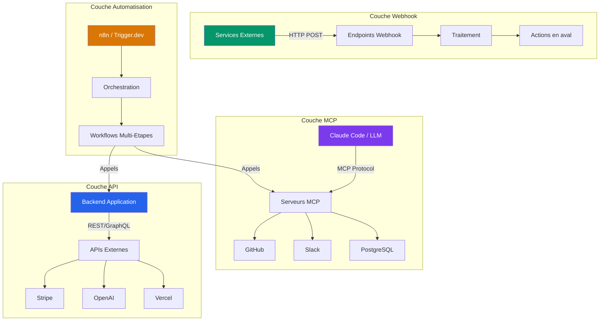
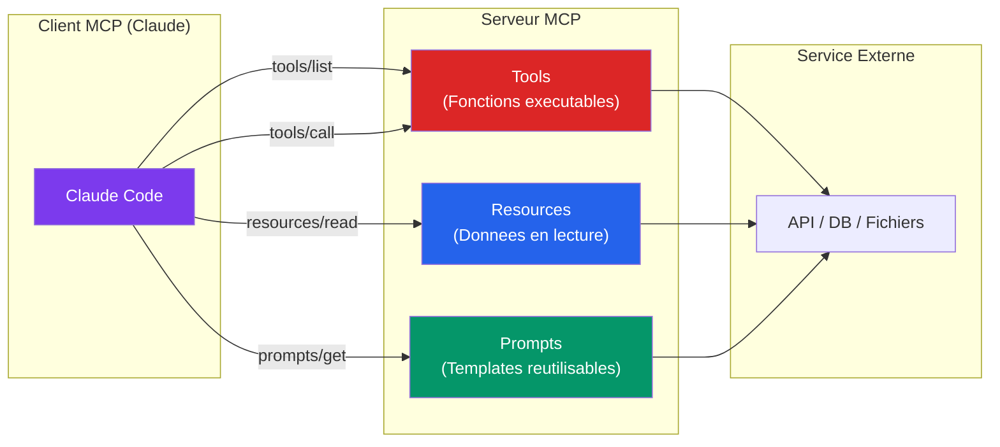
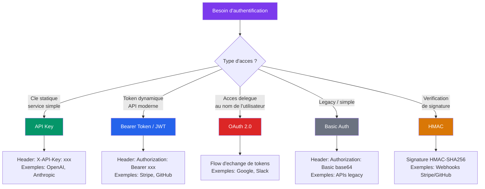
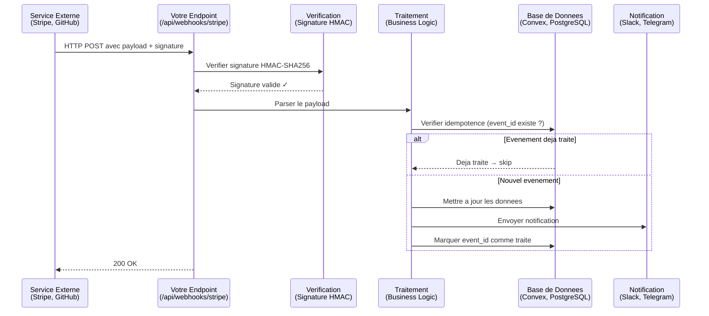
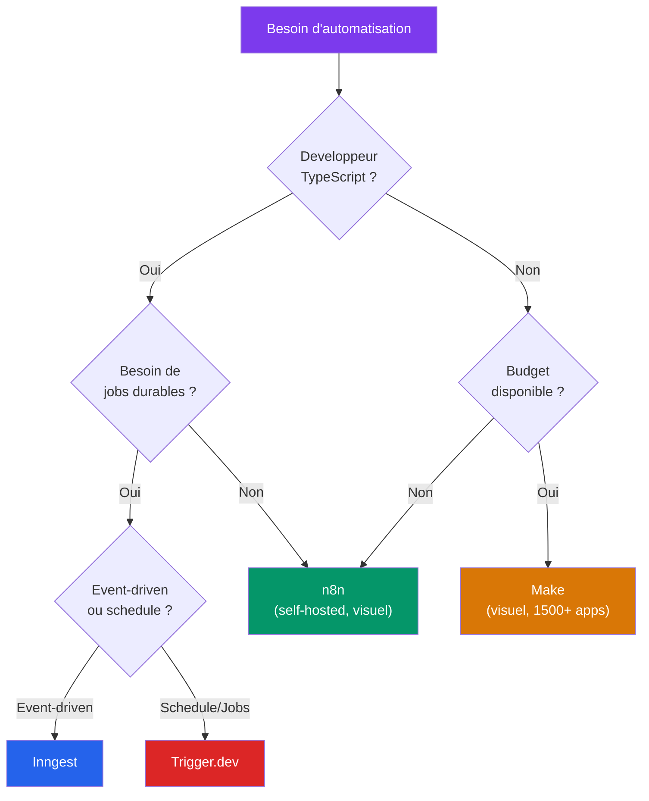
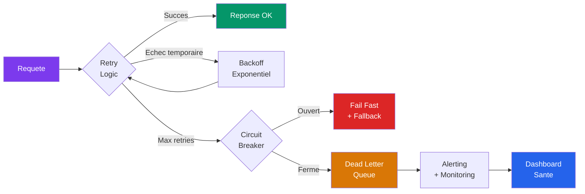

# Stack System Builder (MCP & API Mastery)

> **Connecte l'IA a n'importe quel service, construis n'importe quelle integration, automatise n'importe quel workflow.**

Le Model Context Protocol est le standard emergent qui connecte les modeles d'IA a vos outils existants. Ce module technique couvre MCP en profondeur, les REST APIs, les webhooks, OAuth 2.0, GraphQL, et les plateformes d'automatisation pour construire n'importe quelle integration production-grade.

Les modeles IA sont puissants en isolation. Les modeles IA connectes sont inarretables. Claude seul est un assistant intelligent. Claude connecte a GitHub, Slack, Gmail, Notion et votre base de donnees devient un membre d'equipe autonome. Le secret du CAIO : 80% de la valeur vient de la connexion des outils, pas des outils eux-memes. Chaque nouvel outil cree N nouvelles opportunites d'integration.

---

## Objectifs du module

A l'issue de ce module, vous serez capable de :

- Comprendre et utiliser les 5 methodes de connexion IA (MCP, REST, GraphQL, Webhooks, Plateformes)
- Configurer et maitriser les serveurs MCP essentiels (Composio, GitHub, Playwright, PostgreSQL, etc.)
- Construire des serveurs MCP custom en TypeScript et Python
- Integrer n'importe quelle API REST avec authentification, pagination et rate limiting
- Construire des recepteurs webhooks securises avec verification de signature
- Utiliser Composio comme hub central pour 200+ applications
- Deployer des workflows sur n8n, Trigger.dev, Make et Inngest
- Maitriser les patterns d'integration production-grade (retry, circuit breaker, monitoring)
- Construire une plateforme d'integration complete et deployee

---

## Lecon 1 — L'etat d'esprit integration : les 5 methodes de connexion IA

### Ce que vous allez apprendre

Vue d'ensemble des approches d'integration avec matrice de decision : quand utiliser quoi selon le contexte technique, le cas d'usage, et le niveau d'urgence. Vous comprendrez pourquoi les integrations sont la competence numero un pour les builders IA.

### Pourquoi les integrations sont le vrai superpouvoir

L'economie de l'integration suit une loi exponentielle. Avec 2 outils connectes, vous avez 1 integration possible. Avec 10 outils, vous en avez 45. Avec 50 outils, vous en avez 1 225. Chaque nouvel outil que vous maitrisez multiplie votre potentiel de valeur.

Le CAIO qui sait connecter les outils entre eux est celui qui cree le plus de valeur pour son organisation. La majorite des praticiens IA savent utiliser ChatGPT ou Claude. Tres peu savent construire des pipelines ou l'IA agit de maniere autonome a travers vos systemes existants.

### Matrice de decision des 5 methodes

| Methode | Complexite | Temps de setup | Vitesse | Cas d'usage ideal | Limite |
|---------|-----------|----------------|---------|-------------------|--------|
| **MCP** | Moyenne | 30min-2h | Rapide | Connexion IA-native (Claude Code) | Standard emergent |
| **REST API** | Faible-Moyenne | 1-4h | Moyenne | CRUD, integrations service-a-service | Synchrone, pas temps reel |
| **GraphQL** | Moyenne-Haute | 2-8h | Moyenne | Requetes de donnees complexes, frontend flexible | Overhead de schema |
| **Webhooks** | Faible | 30min-1h | Instantanee | Notifications, evenements temps reel | Unidirectionnel |
| **Plateformes** | Tres faible | 10-30min | Rapide | Prototypage rapide, no-code | Cout a l'echelle, dependance |

### Comment evaluer une approche d'integration

Suivez cet arbre de decision :

1. Le service a un serveur MCP existant ? → **Utilisez MCP** (le plus rapide pour l'IA)
2. Pas de MCP mais une bonne REST API ? → **Construisez une integration directe**
3. Besoin d'evenements en temps reel ? → **Webhooks**
4. Juste du prototypage ? → **Zapier/Make/n8n**
5. Besoin de requetes complexes avec donnees imbriquees ? → **GraphQL si disponible**

### L'architecture d'integration en 4 couches



L'architecture d'integration d'un systeme IA repose sur quatre couches complementaires. La **couche MCP** gere les connexions AI-native entre le modele et les services externes. La **couche API** assure les appels directs aux services via REST ou GraphQL. La **couche Webhook** ecoute les evenements en temps reel emis par les services tiers. Enfin, la **couche Automatisation** orchestre les workflows complexes qui traversent les trois couches precedentes.

### Points cles a retenir

- Les integrations sont le multiplicateur de valeur #1 pour un CAIO
- MCP est le standard pour les connexions IA-native, mais ce n'est pas la seule methode
- Le choix de la methode depend du cas d'usage, pas de la preference personnelle
- Un bon architecte d'integration maitrise les 5 methodes

### Exercice pratique

Pour 3 integrations que vous voulez construire dans votre contexte professionnel, identifiez la methode optimale en utilisant la matrice de decision. Justifiez votre choix par ecrit en 2-3 phrases pour chaque integration. Partagez votre analyse avec le groupe.

---

## Lecon 2 — MCP en profondeur : architecture, primitives et transports

### Ce que vous allez apprendre

Architecture complete du Model Context Protocol. Les 3 primitives (Tools, Resources, Prompts). Les 3 types de transports (stdio, HTTP+SSE, Streamable HTTP). Configuration dans `.mcp.json`, variables d'environnement, et debugging.

### Qu'est-ce que MCP et pourquoi ca change tout

MCP = Model Context Protocol = "USB pour l'IA". C'est un standard ouvert, pas specifique a Anthropic, qui definit comment un modele IA communique avec des services externes. Avant MCP, chaque integration etait custom. Avec MCP, il y a un protocole commun.

Pourquoi MCP est superieur aux appels API bruts :

- **Standardisation** : un seul protocole pour toutes les connexions
- **Decouverte** : le modele peut decouvrir les outils disponibles automatiquement
- **Composabilite** : les serveurs MCP se combinent naturellement
- **Securite** : gestion des permissions integree au protocole
- **Contexte** : le modele recoit des descriptions d'outils qui l'aident a decider quand les utiliser

### Les 3 primitives MCP



**1. Tools — Fonctions que le LLM peut appeler**

Les Tools sont des fonctions executables avec des parametres types et des descriptions. Le modele decide quand appeler quel outil en fonction du contexte de la conversation.

Exemple concret : `create_issue(title, body, labels)` pour GitHub. Quand l'utilisateur dit "cree un ticket pour le bug d'authentification", le modele comprend qu'il doit utiliser cet outil et remplit les parametres automatiquement.

Chaque outil est defini par :
- Un **nom** unique en snake_case
- Une **description** claire que le modele utilise pour decider quand l'appeler
- Un **schema d'entree** (parametres types avec JSON Schema)
- Un **handler** (la fonction qui s'execute cote serveur)

**2. Resources — Donnees accessibles en lecture**

Les Resources exposent des donnees que l'IA peut lire : fichiers, enregistrements de base de donnees, configurations. Elles utilisent des URI standardisees.

Exemple : `github://repos/owner/repo/issues` pour lister les issues d'un repo. Le modele peut lire ces resources pour construire du contexte avant d'agir.

La difference entre un Tool et une Resource : un Tool **fait** quelque chose (effet de bord), une Resource **donne** de l'information (lecture seule).

**3. Prompts — Templates reutilisables**

Les Prompts sont des templates de prompts avec arguments. Ils composent le prompt optimal pour une tache donnee.

Exemple : `code-review(diff, guidelines)` pour un review structure. Au lieu d'ecrire un prompt a chaque fois, le serveur MCP fournit un template optimise.

Quand utiliser les Resources vs les Tools :
- **Resources** : quand le modele a besoin de LIRE des donnees pour construire du contexte
- **Tools** : quand le modele a besoin d'AGIR sur un systeme externe

### Les 3 transports MCP

| Transport | Protocole | Cas d'usage | Quand l'utiliser |
|-----------|-----------|-------------|------------------|
| **stdio** | JSON-RPC via stdin/stdout | Processus locaux | Serveur MCP sur la meme machine (filesystem, DB locale) |
| **HTTP+SSE** | HTTP POST + Server-Sent Events | Serveurs distants | Serveur MCP distant, mises a jour en streaming |
| **Streamable HTTP** | HTTP bidirectionnel | Reseau moderne | Nouveau standard, remplace progressivement SSE |

Le transport **stdio** est le plus courant : le client MCP lance un processus local et communique via stdin/stdout. C'est le transport par defaut de Claude Code.

Le transport **HTTP+SSE** permet de connecter des serveurs distants. Le client envoie des requetes HTTP et recoit des reponses en streaming via Server-Sent Events.

Le transport **Streamable HTTP** est le nouveau standard qui simplifie les communications reseau bidirectionnelles.

### Configuration dans Claude Code

Il y a trois niveaux de configuration pour les serveurs MCP :

**Niveau projet** (`.mcp.json` a la racine du projet) :

```json
{
  "mcpServers": {
    "github": {
      "command": "npx",
      "args": ["-y", "@modelcontextprotocol/server-github"],
      "env": { "GITHUB_TOKEN": "ghp_..." }
    },
    "filesystem": {
      "command": "npx",
      "args": ["-y", "@modelcontextprotocol/server-filesystem", "/chemin/vers/dossier"]
    }
  }
}
```

**Niveau global** (`~/.claude/settings.json`) :

```json
{
  "mcpServers": {
    "composio": {
      "command": "npx",
      "args": ["-y", "composio-core", "mcp"],
      "env": { "COMPOSIO_API_KEY": "..." }
    }
  }
}
```

**Champs de configuration :**
- `command` : la commande a executer (npx, node, python, etc.)
- `args` : les arguments de la commande
- `env` : les variables d'environnement (cles API, tokens)
- `type` : le type de transport (stdio par defaut, http, sse)

**Variables d'environnement et gestion des secrets :**

Ne stockez JAMAIS les cles API en dur dans les fichiers de configuration commites dans Git. Utilisez des variables d'environnement ou un gestionnaire de secrets. Le fichier `.mcp.json` doit etre dans le `.gitignore` si il contient des secrets.

### Tool search pour les gros serveurs MCP

Quand un serveur MCP expose plus de 100 outils (comme Composio avec 2000+ actions), charger tous les schemas en memoire est couteux. La solution : **ToolSearch**.

Activez `toolSearch: true` dans la configuration du serveur. Au lieu de charger tous les outils au demarrage, le modele utilise l'outil `ToolSearch` pour rechercher et charger les schemas a la demande.

Convention de nommage des outils MCP : `mcp__<serveur>__<outil>` (exemple : `mcp__github__search_repositories`).

### Debugging MCP

- **MCP Inspector** : outil visuel pour tester les serveurs MCP. Lance une interface web ou vous pouvez appeler chaque outil et voir les reponses.
- **Logs dans Claude Code** : observez les appels d'outils dans la sortie de Claude Code
- **Test manuel** : appelez les endpoints directement avec curl ou un script

Erreurs courantes et solutions :
- "Server not found" → verifiez le chemin de la commande
- "Permission denied" → verifiez les variables d'environnement
- "Timeout" → le serveur met trop de temps a demarrer, augmentez le timeout
- "Tool not found" → verifiez le nom exact de l'outil avec `tools/list`

### MCP dans les sous-agents

Chaque agent Claude Code peut avoir ses propres serveurs MCP. La configuration se fait dans le frontmatter de l'agent :

```yaml
mcpServers: [github, postgresql]
```

L'agent ne voit que les serveurs MCP declares dans sa configuration. C'est le principe de moindre privilege : donnez a chaque agent exactement les outils dont il a besoin, rien de plus.

Pattern recommande : un "agent social media" avec acces a LinkedIn + Twitter + Instagram via Composio, un "agent support" avec acces a Linear + Slack + Gmail.

### Points cles a retenir

- MCP standardise les connexions IA-service comme USB a standardise les peripheriques
- Tools pour agir, Resources pour lire, Prompts pour templater
- stdio pour le local, HTTP pour le distant
- ToolSearch est essentiel pour les gros serveurs (+100 outils)
- Principe de moindre privilege pour les agents

### Exercice pratique

Configurez 3 serveurs MCP dans votre Claude Code : GitHub, Playwright et un filesystem server. Pour chacun :
1. Ecrivez la configuration dans `.mcp.json`
2. Verifiez la connexion avec un appel simple
3. Testez un outil de chaque serveur
4. Documentez les resultats dans un fichier markdown

---

## Lecon 3 — Le catalogue des serveurs MCP essentiels

### Ce que vous allez apprendre

Configuration pratique et cas d'usage detailles des serveurs MCP incontournables : Composio (200+ apps), Playwright (navigateur), PostgreSQL, GitHub, Chrome DevTools, Context7, claude-mem et Linear.

### Le catalogue complet

| Serveur | Ce qu'il fait | Nb d'outils | Installation |
|---------|--------------|-------------|-------------|
| **Composio** | 200+ integrations d'apps (Slack, Gmail, LinkedIn, etc.) | 2000+ | `composio-mcp` |
| **Playwright** | Automatisation navigateur, screenshots, tests | 15+ | `@anthropic/mcp-playwright` |
| **PostgreSQL** | Requetes directes a la base de donnees | 10+ | `mcp-server-postgresql` |
| **Filesystem** | Acces aux fichiers cross-projet | 8+ | `@modelcontextprotocol/server-filesystem` |
| **GitHub** | Issues, PRs, code, repos | 30+ | `@modelcontextprotocol/server-github` |
| **Chrome DevTools** | Debugging navigateur | 10+ | `mcp-chrome-devtools` |
| **Context7** | Documentation a jour des librairies | 3 | `@context7/mcp` |
| **claude-mem** | Memoire semantique persistante cross-sessions | 6 | `claude-mem` |
| **Linear** | Gestion de projet, tickets, sprints | 20+ | `mcp-linear` |
| **Notion** | Gestion documentaire | 15+ | Via Composio |
| **Slack** | Messagerie d'equipe | 30+ | Via Composio |
| **Gmail** | Envoi/lecture d'emails | 20+ | Via Composio |

### Composio — Le meta-connecteur

Composio est le serveur MCP le plus puissant car il connecte 200+ applications via une seule integration. Au lieu de configurer 10 serveurs MCP separes, vous en configurez 1.

**Installation et configuration :**

```bash
# Installer Composio CLI
npm install -g composio-core

# Ajouter a Claude Code
# Dans .mcp.json :
{
  "composio": {
    "command": "npx",
    "args": ["-y", "composio-core", "mcp"],
    "env": { "COMPOSIO_API_KEY": "votre-cle-api" }
  }
}
```

**Connecter des applications :**

```bash
composio add github
composio add slack
composio add gmail
composio add google-calendar
composio connections list
```

Chaque connexion gere automatiquement l'authentification OAuth. Vous n'avez pas a implementer les flows OAuth vous-meme.

### Playwright — Automatisation navigateur

Cas d'usage concrets avec Playwright via MCP :
- Screenshots de pages web pour l'audit UX
- Remplissage automatique de formulaires
- Scraping de donnees structurees
- Tests end-to-end automatises
- Capture de preuves visuelles (before/after)
- Navigation dans des dashboards authentifies

### Context7 — Documentation toujours a jour

Context7 resout un probleme fondamental : les modeles IA sont entraines sur des donnees datees. Quand vous utilisez une librairie recente (Next.js 16, Convex, shadcn/ui), le modele peut halluciner des APIs depreciees.

Context7 interroge la documentation officielle en temps reel et fournit la version a jour au modele.

### claude-mem — Memoire persistante

claude-mem permet au modele de se souvenir entre les sessions. Il stocke les observations dans une base SQLite + Chroma (recherche vectorielle).

Outils principaux :
- `search(query)` : chercher dans la memoire
- `timeline(observation_id)` : voir le contexte chronologique
- `get_observations(ids)` : recuperer les details complets

### Points cles a retenir

- Composio est le point d'entree recommande pour la majorite des integrations
- Playwright est essentiel pour tout ce qui touche au navigateur
- Context7 evite les hallucinations sur les APIs recentes
- claude-mem permet la continuite entre les sessions

### Exercice pratique

Configurez Composio et connectez au moins 3 applications (Gmail, Slack, Google Calendar). Pour chaque connexion :
1. Completez l'authentification OAuth
2. Testez un appel d'outil simple
3. Construisez un mini-workflow qui enchaine 2 applications

---

## Lecon 4 — Construire un serveur MCP custom en TypeScript

### Ce que vous allez apprendre

Architecture complete d'un serveur MCP : declaration d'outils avec JSON Schema, implementation des handlers, ajout de Resources et Prompts, test avec MCP Inspector, publication sur npm.

### Quand construire votre propre serveur MCP

- Pas de serveur MCP existant pour le service dont vous avez besoin
- Le serveur existant ne couvre pas votre cas d'usage specifique
- Vous voulez une integration plus fine avec de la logique metier custom
- Vous voulez publier et partager avec la communaute
- Vous avez une API interne que vous voulez exposer au LLM

### Architecture d'un serveur MCP TypeScript

```
my-mcp-server/
  src/
    index.ts          # Point d'entree + declaration des outils
    tools/            # Handlers pour chaque outil
      get-weather.ts
      search-data.ts
    resources/        # Handlers pour les resources
      config.ts
    prompts/          # Templates de prompts
      analysis.ts
  package.json
  tsconfig.json
  README.md
```

### Implementation pas a pas

**Etape 1 : Initialiser le projet**

```bash
mkdir my-mcp-server && cd my-mcp-server
npm init -y
npm install @modelcontextprotocol/sdk
npm install -D typescript @types/node
```

**Etape 2 : Declarer le serveur et les outils**

```typescript
import { Server } from "@modelcontextprotocol/sdk/server";

const server = new Server({
  name: "my-custom-server",
  version: "1.0.0",
});

// Declarer les outils disponibles
server.setRequestHandler("tools/list", async () => ({
  tools: [{
    name: "get_weather",
    description: "Get current weather for a city. Use when the user asks about weather conditions.",
    inputSchema: {
      type: "object",
      properties: {
        city: { type: "string", description: "City name (e.g., Paris, New York)" },
        units: { type: "string", enum: ["celsius", "fahrenheit"], description: "Temperature unit" }
      },
      required: ["city"]
    }
  }]
}));

// Implementer le handler
server.setRequestHandler("tools/call", async (request) => {
  if (request.params.name === "get_weather") {
    const { city, units = "celsius" } = request.params.arguments;
    const result = await fetchWeather(city, units);
    return {
      content: [{ type: "text", text: JSON.stringify(result, null, 2) }]
    };
  }
  throw new Error(`Unknown tool: ${request.params.name}`);
});
```

**Etape 3 : Ajouter des Resources**

```typescript
server.setRequestHandler("resources/list", async () => ({
  resources: [{
    uri: "weather://config",
    name: "Weather Configuration",
    description: "Current weather service configuration",
    mimeType: "application/json"
  }]
}));

server.setRequestHandler("resources/read", async (request) => {
  if (request.params.uri === "weather://config") {
    return {
      contents: [{
        uri: "weather://config",
        mimeType: "application/json",
        text: JSON.stringify({ provider: "openweathermap", units: "celsius" })
      }]
    };
  }
});
```

**Etape 4 : Ajouter des Prompts**

```typescript
server.setRequestHandler("prompts/list", async () => ({
  prompts: [{
    name: "weather-report",
    description: "Generate a structured weather report for a city",
    arguments: [{
      name: "city",
      description: "City to report on",
      required: true
    }]
  }]
}));
```

### Serveur MCP avec Python (FastMCP)

FastMCP est la facon la plus simple de construire des serveurs MCP en Python. Les outils se declarent par decorateurs et les schemas sont generes automatiquement a partir des type hints.

```python
from fastmcp import FastMCP

mcp = FastMCP("my-weather-server")

@mcp.tool()
def get_weather(city: str, units: str = "celsius") -> dict:
    """Get current weather for a city."""
    # Implementation ici
    return {"city": city, "temp": 22, "units": units}

@mcp.resource("weather://config")
def get_config() -> str:
    """Current weather service configuration."""
    return '{"provider": "openweathermap"}'
```

Quand utiliser Python vs TypeScript :
- **TypeScript** : ecosysteme npm, integration naturelle avec le stack web, meilleur support SDK MCP
- **Python** : data science, ML, quand votre backend est deja en Python

### Tester et debugger les serveurs MCP

**MCP Inspector** : outil de test visuel qui permet d'appeler chaque outil et de voir les reponses en temps reel.

```bash
npx @modelcontextprotocol/inspector my-mcp-server
```

**Bonnes pratiques de gestion d'erreurs :**
- Retournez des messages d'erreur clairs et actionables
- Logguez les erreurs cote serveur pour le debugging
- Utilisez des codes d'erreur standardises
- Ne laissez jamais une erreur silencieuse

### Publier votre serveur MCP

```bash
npm login
npm publish --access public
```

Ensuite, n'importe qui peut l'utiliser :

```bash
npx -y @votre-org/mon-serveur-mcp
```

**Standards de documentation pour la publication :**
- README avec description claire du serveur
- Liste de tous les outils avec descriptions
- Exemples de configuration
- Instructions d'installation
- Changelog

### Points cles a retenir

- Un serveur MCP custom est la solution quand aucun serveur existant ne couvre votre besoin
- Le SDK officiel simplifie enormement la creation
- Nommez vos outils de maniere descriptive : `get_user_by_email` pas `getUser`
- Les descriptions sont cruciales : le modele les utilise pour decider quand appeler l'outil
- Testez toujours avec MCP Inspector avant de deployer

### Exercice pratique

Construisez un serveur MCP custom qui se connecte a une vraie API de votre choix (meteo, crypto, actualites, ou un service interne). Votre serveur doit avoir :
- Au moins 3 outils avec des descriptions claires
- Au moins 1 resource
- Une gestion d'erreurs propre
- Une documentation README
- Une configuration testable dans Claude Code

---

## Lecon 5 — Maitriser les REST APIs : fondamentaux HTTP et authentification

### Ce que vous allez apprendre

Fondamentaux HTTP (methodes, codes de statut, headers), les 5 methodes d'authentification (API Key, Bearer Token, OAuth 2.0, Basic Auth, HMAC), et comment lire n'importe quelle documentation d'API en 10 minutes.

### Fondamentaux HTTP (rappel en 5 minutes)

**Methodes HTTP :**
- `GET` : lire une ressource (idempotent)
- `POST` : creer une ressource
- `PUT` : remplacer une ressource entiere (idempotent)
- `PATCH` : modifier partiellement une ressource
- `DELETE` : supprimer une ressource (idempotent)

**Codes de statut :**
- `2xx` : succes (200 OK, 201 Created, 204 No Content)
- `3xx` : redirection (301 Moved, 304 Not Modified)
- `4xx` : erreur client (400 Bad Request, 401 Unauthorized, 403 Forbidden, 404 Not Found, 429 Too Many Requests)
- `5xx` : erreur serveur (500 Internal Error, 502 Bad Gateway, 503 Service Unavailable)

**Headers importants :**
- `Content-Type: application/json` : format du body
- `Authorization: Bearer <token>` : authentification
- `Accept: application/json` : format de reponse souhaite
- `X-RateLimit-Remaining` : requetes restantes
- `X-RateLimit-Reset` : timestamp de reset

### Les 5 methodes d'authentification



| Methode | Comment ca marche | Securite | Quand c'est utilise |
|---------|------------------|----------|---------------------|
| **API Key** | Cle statique dans le header ou query | Faible | APIs simples (OpenAI, Anthropic) |
| **Bearer Token** | JWT ou token opaque dans Authorization | Moyenne | La plupart des APIs modernes (Stripe) |
| **OAuth 2.0** | Flux d'echange de tokens multi-etapes | Haute | Acces delegue par l'utilisateur (Google, GitHub) |
| **Basic Auth** | Base64 de username:password | Faible | APIs legacy |
| **HMAC** | Requetes signees avec cle secrete | Haute | Webhooks (Stripe, GitHub) |

### OAuth 2.0 en profondeur

OAuth 2.0 est le protocole d'authentification le plus complexe mais aussi le plus courant pour les APIs modernes.

**Flow Authorization Code (apps web) :**
1. L'utilisateur est redirige vers le serveur d'autorisation
2. Il s'authentifie et consent au partage de donnees
3. Le serveur renvoie un `authorization_code`
4. Votre backend echange le code contre un `access_token`
5. Vous utilisez le token pour les appels API

**Flow Client Credentials (serveur-a-serveur) :**
1. Votre serveur envoie `client_id` + `client_secret`
2. Le serveur d'autorisation renvoie un `access_token`
3. Pas d'interaction utilisateur necessaire

**Refresh tokens :**
- Les access tokens expirent (souvent 1h)
- Le refresh token permet d'obtenir un nouveau access token sans re-authentification
- Stockez les refresh tokens de maniere securisee

**Scopes (permissions granulaires) :**
- `read:user` : lire le profil
- `repo` : acces complet aux repos
- `write:discussion` : ecrire des discussions
- Demandez le minimum de scopes necessaires (moindre privilege)

### Lire une documentation d'API comme un pro

Methode en 4 etapes pour maitriser n'importe quelle API en 10 minutes :

1. **Section authentification en premier** : comment entrer (API Key ? OAuth ?)
2. **Catalogue des endpoints** : ce que vous pouvez faire (GET /users, POST /orders)
3. **Exemples requete/reponse** : a quoi ca ressemble concrètement
4. **Rate limits** : combien de requetes par minute/heure

### Construction d'integrations API robustes en TypeScript

**Checklist pour chaque integration :**
- Authentification configuree et tokens securises dans des variables d'environnement
- Retry avec backoff exponentiel (max 3-5 retries)
- Timeout configure (30s par defaut)
- Logging structure de chaque requete/reponse
- Gestion differenciee des erreurs 4xx (erreur client, ne pas retry) et 5xx (erreur serveur, retry)
- Rate limiting respecte (lecture des headers)
- Pagination geree (cursor-based de preference)
- Caching des reponses quand possible

**Les 3 patterns de pagination :**

1. **Offset** : `?page=2&limit=20` — Simple mais fragile si des elements sont ajoutes/supprimes pendant la pagination
2. **Cursor** : `?cursor=abc123&limit=20` — Robuste, performant, recommande pour la majorite des cas
3. **Keyset** : `?after_id=123&limit=20` — Pour les tres grands datasets avec tri

### Points cles a retenir

- OAuth 2.0 est incontournable pour les APIs modernes : maitrisez-le
- Toujours lire la doc d'authentification en premier
- Retry uniquement les erreurs 5xx et les timeouts, jamais les 4xx
- Demandez le minimum de scopes OAuth (moindre privilege)

### Exercice pratique

Integrez l'API Stripe et l'API GitHub dans un meme projet TypeScript :
1. Authentifiez-vous avec les deux APIs (Bearer pour Stripe, OAuth pour GitHub)
2. Listez les produits Stripe et les repos GitHub
3. Implementez retry avec backoff exponentiel
4. Gerez la pagination sur les deux APIs
5. Ajoutez un logging structure

---

## Lecon 6 — Webhooks et architecture event-driven

### Ce que vous allez apprendre

Push vs pull, construction de recepteurs webhooks securises (Next.js, Vercel serverless), verification de signature HMAC, idempotence, debugging avec ngrok. Patterns concrets pour Stripe, GitHub et Clerk.

### Push vs Pull : pourquoi les webhooks sont superieurs

**Pull (polling)** : votre application demande regulierement au service "quelque chose a change ?" — gaspillage de resources, latence, requetes inutiles.

**Push (webhook)** : le service vous notifie quand quelque chose change — efficace, temps reel, zero requete gaspillee.

### Architecture webhook



### Construire un recepteur webhook en Next.js

Les 5 etapes obligatoires pour chaque recepteur webhook :

**1. Creer la route API**

```typescript
// src/app/api/webhooks/stripe/route.ts
export async function POST(req: Request) {
  // Implementation ci-dessous
}
```

**2. Lire le body brut (pas le JSON parse)**

Le body doit etre lu en texte brut pour la verification de signature. Si vous parsez le JSON d'abord, la signature ne correspondra pas.

```typescript
const body = await req.text();
```

**3. Verifier la signature avec le secret**

```typescript
const sig = req.headers.get("stripe-signature")!;
const event = stripe.webhooks.constructEvent(
  body, sig, process.env.STRIPE_WEBHOOK_SECRET!
);
```

**4. Parser le payload**

```typescript
const data = event.data.object;
```

**5. Traiter l'evenement de maniere idempotente**

Verifier si l'evenement a deja ete traite avant d'agir.

### Securite des webhooks

**Verification de signature HMAC-SHA256 :**

La signature prouve que le webhook vient bien du service attendu et n'a pas ete modifie en transit. Le service signe le body avec un secret partage, vous verifiez la signature avec le meme secret.

**Patterns de verification par service :**

| Service | Header de signature | Algorithme | Librairie |
|---------|-------------------|------------|-----------|
| **Stripe** | `stripe-signature` | HMAC SHA256 | `stripe.webhooks.constructEvent()` |
| **GitHub** | `x-hub-signature-256` | HMAC SHA256 | Verification manuelle crypto |
| **Clerk** | `svix-signature` | Svix (Ed25519) | `svix.Webhook.verify()` |
| **Linear** | `linear-signature` | HMAC SHA256 | Verification manuelle crypto |
| **Shopify** | `x-shopify-hmac-sha256` | HMAC SHA256 | Verification manuelle crypto |

**Idempotence — Pourquoi c'est critique :**

Un webhook peut etre envoye plusieurs fois (retry en cas de timeout, erreur reseau). Votre handler doit produire le meme resultat que l'evenement arrive 1 ou 5 fois.

Pattern recommande : stockez l'ID de l'evenement dans votre base de donnees. Avant de traiter, verifiez si cet ID existe deja. Si oui, retournez 200 sans rien faire.

**Protections supplementaires :**
- Allowlisting d'IP : n'acceptez les webhooks que des IPs connues du service
- Protection contre le replay : validez le timestamp du webhook (rejetez si > 5min)
- HTTPS obligatoire : ne servez jamais de webhooks en HTTP

### Patterns webhook courants

| Service | Evenements principaux | Cas d'usage |
|---------|----------------------|-------------|
| **Stripe** | `payment_intent.succeeded`, `customer.subscription.updated`, `checkout.session.completed` | Traitement des paiements, gestion des abonnements |
| **GitHub** | `push`, `pull_request`, `issues`, `workflow_run` | CI/CD, notifications, automatisation |
| **Clerk** | `user.created`, `user.updated`, `user.deleted` | Synchronisation utilisateurs vers votre DB |
| **Linear** | `Issue.create`, `Issue.update`, `Comment.create` | Automatisation de tickets, notifications |
| **Shopify** | `orders/create`, `products/update` | Automatisation e-commerce |

### Debugger les webhooks

**ngrok : exposer localhost a internet pour les tests**

```bash
ngrok http 3000
# Donne une URL publique : https://abc123.ngrok.io
# Configurez cette URL comme endpoint webhook dans le dashboard du service
```

**webhook.site : inspecter les payloads entrants**

Allez sur webhook.site, obtenez une URL temporaire, configurez-la comme endpoint webhook. Vous verrez tous les payloads entrants en temps reel.

**Logique de retry :**
- Stripe : 3 jours, backoff exponentiel
- GitHub : 1 jour, retry immediat + backoff
- Clerk : 3 jours, backoff exponentiel

**Dead letter queues :**
Les evenements qui echouent apres tous les retries doivent etre stockes pour inspection manuelle. Configurez un alerting quand la queue depasse un seuil.

### Workflows event-driven

Architecture avancee : **Webhook → Queue → Worker → Action**

1. Le webhook arrive et est immediatement mis en queue (reponse 200 immediate)
2. Un worker consomme la queue et traite l'evenement
3. Le worker declenche les actions en aval

Outils pour cette architecture :
- **Trigger.dev** : traitement durable de webhooks avec retry automatique
- **Inngest** : step functions event-driven avec execution durable
- **BullMQ** : queues Redis pour Node.js

Pattern de chaining : webhook A declenche l'action B qui envoie le webhook C. Exemple : Stripe payment → mise a jour DB → notification Slack → email de confirmation.

### Points cles a retenir

- Toujours verifier la signature des webhooks — c'est non-negotiable
- L'idempotence est critique : un webhook peut arriver plusieurs fois
- Utilisez ngrok pour le developpement local
- Repondez 200 rapidement, traitez en arriere-plan si necessaire

### Exercice pratique

Construisez un recepteur webhook complet pour Stripe et GitHub :
1. Creez les routes API dans Next.js
2. Implementez la verification de signature pour les deux services
3. Gerez l'idempotence avec stockage des event IDs
4. Traitez les evenements `checkout.session.completed` (Stripe) et `push` (GitHub)
5. Deployez sur Vercel et testez avec de vrais webhooks

---

## Lecon 7 — Composio : le meta-connecteur pour 200+ apps

### Ce que vous allez apprendre

Installation complete, connexion d'applications via OAuth, construction de workflows automatises multi-apps. Exemples concrets : auto-posting social, reporting client, capture de leads, syndication de contenu.

### Pourquoi Composio est un game-changer

Sans Composio, pour connecter 4 services differents (Slack, Gmail, Calendar, Notion), vous devez :
- Construire 4 integrations separees
- Gerer 4 authentifications OAuth differentes
- Maintenir 4 serveurs MCP distincts
- Estimer 40+ heures de developpement

Avec Composio :
- 1 serveur MCP, 200+ apps
- 1 flow d'authentification centralise
- Actions pre-construites et testees
- Setup en 30 minutes

### Installation et configuration detaillee

```bash
# 1. Installer le CLI Composio
npm install -g composio-core

# 2. Se connecter
composio login

# 3. Ajouter des applications
composio add github
composio add slack
composio add gmail
composio add google-calendar
composio add notion
composio add linkedin

# 4. Verifier les connexions
composio connections list

# 5. Configurer dans Claude Code (.mcp.json)
```

### Les integrations disponibles (top 30)

| Categorie | Applications | Nb d'actions |
|-----------|-------------|-------------|
| **Communication** | Slack, Gmail, Discord, Telegram | 100+ |
| **Social** | LinkedIn, Twitter/X, Instagram, Reddit | 50+ |
| **Productivite** | Notion, Google Drive, Google Docs, Dropbox | 80+ |
| **Gestion de projet** | Linear, Asana, Jira, Monday | 60+ |
| **Dev & Code** | GitHub, GitLab, Vercel | 40+ |
| **CRM & Sales** | HubSpot, Salesforce, Pipedrive | 40+ |
| **Calendrier** | Google Calendar, Cal.com, Calendly | 30+ |
| **Finance** | Stripe, QuickBooks, Xero | 30+ |

### Construire des workflows avec Composio

**Workflow 1 : Auto-posting sur les reseaux sociaux**

1. Ecrire un post dans Google Docs
2. Composio lit le contenu
3. Claude optimise le texte pour chaque plateforme
4. Poster sur LinkedIn (version professionnelle)
5. Poster sur Twitter/X (version courte)
6. Poster sur Reddit (version communautaire)

**Workflow 2 : Reporting client automatise**

1. Recuperer les commits GitHub de la semaine
2. Recuperer les tickets Linear completes
3. Generer un rapport avec Claude
4. Creer une page Notion avec le rapport
5. Envoyer par Gmail au client

**Workflow 3 : Capture de leads automatisee**

1. Un formulaire est soumis sur votre site
2. Webhook declenche le workflow
3. Composio cree un contact dans HubSpot
4. Envoie un email de bienvenue via Gmail
5. Cree un evenement Google Calendar pour le suivi
6. Notification Slack a l'equipe commerciale

**Workflow 4 : Syndication de contenu**

1. Nouveau post de blog publie
2. Composio lit le contenu
3. Adapter pour LinkedIn → publier
4. Adapter pour Twitter → publier
5. Adapter pour Reddit → publier
6. Notification Slack du resultat

### Composio + agents Claude Code

Chaque agent peut utiliser Composio via MCP. Le pattern recommande est de creer des agents specialises avec des outils Composio specifiques :

- **Agent "social media"** : acces LinkedIn + Twitter + Instagram via Composio
- **Agent "support client"** : acces Linear + Slack + Gmail
- **Agent "contenu"** : acces Notion + Google Docs + WordPress
- **Agent "commercial"** : acces HubSpot + Calendar + Gmail

### Points cles a retenir

- Composio remplace des dizaines d'integrations par une seule
- L'OAuth est gere automatiquement par Composio
- Combinez Composio avec des agents specialises pour maximiser la valeur
- Chaque workflow Composio peut etre declenche par un webhook ou un cron

### Exercice pratique

Connectez 5 apps via Composio et construisez 2 workflows automatises complets :

**Workflow A** : Pipeline de contenu (Google Docs → optimisation Claude → LinkedIn + Twitter)
**Workflow B** : Gestion de leads (Webhook → HubSpot → Gmail → Slack notification)

Documentez chaque etape et testez le workflow de bout en bout.

---

## Lecon 8 — Plateformes d'automatisation : n8n, Trigger.dev, Make, Inngest

### Ce que vous allez apprendre

Comparatif detaille des meilleures plateformes d'automatisation. Configuration et premier workflow sur chacune. Matrice de decision selon le besoin.

### n8n — Automatisation open-source self-hosted

**Pourquoi n8n :**
- Gratuit et illimite en self-hosted
- 400+ integrations pre-construites
- Editeur visuel de noeuds : construction de workflows en drag-and-drop
- Noeuds code : ecrivez du JavaScript custom quand vous en avez besoin
- Serveur MCP n8n : declenchez des workflows depuis Claude Code

**Installation self-hosted sur VPS :**

```bash
docker run -d --name n8n \
  -p 5678:5678 \
  -v ~/.n8n:/home/node/.n8n \
  n8nio/n8n
```

**Cas d'usage ideaux :**
- Workflows generaux multi-services
- Equipes mixtes (developpeurs + non-developpeurs)
- Budget zero avec workflows illimites
- Controle total sur les donnees (self-hosted)

### Trigger.dev — Background jobs natifs TypeScript

**Pourquoi Trigger.dev :**
- Type-safe, TypeScript natif
- Execution durable (survit aux echecs, redemarrages)
- Definitions de taches avec retries et queues
- Scheduling cron integre
- Integration native avec Next.js

**Cas d'usage ideaux :**
- Jobs background IA (generation d'images, traitement de donnees)
- Taches planifiees (rapports quotidiens, nettoyage)
- Workflows multi-etapes avec garantie d'execution
- Traitement de webhooks durable

### Make (ex-Integromat) — Workflows visuels avances

**Pourquoi Make :**
- 1500+ integrations d'applications
- Logique de branchement complexe (if/else, iterateurs, aggregateurs)
- Scenarios : builder visuel de workflows
- Excel-like pour les transformations de donnees

**Cas d'usage ideaux :**
- Workflows conditionnels complexes
- Equipes non-techniques
- Prototypage rapide avant de coder
- Automatisations marketing

### Inngest — Step functions event-driven

**Pourquoi Inngest :**
- Architecture 100% event-driven
- Execution durable (survit aux echecs)
- Step functions avec retries automatiques
- Fan-out (1 evenement → N actions paralleles)

**Cas d'usage ideaux :**
- Workflows event-driven complexes
- Pipelines avec etapes conditionnelles
- Systemes qui doivent survivre aux pannes
- Orchestration de micro-services

### Matrice de decision



| Besoin | Meilleur outil | Raison |
|--------|---------------|--------|
| Gratuit, illimite, self-hosted | **n8n** | Open-source, pas de limite |
| TypeScript, jobs de production | **Trigger.dev** | Type-safe, execution durable |
| Visuel, branchement complexe | **Make** | 1500+ apps, no-code avance |
| Simple, setup rapide | **Zapier** | 6000+ apps, Zaps simples |
| Event-driven, durable | **Inngest** | Step functions, fan-out |
| AI-native, multi-outils | **Composio** | 200+ apps via MCP |

### Points cles a retenir

- Il n'y a pas de "meilleur outil" universel — le choix depend de votre contexte
- n8n est le choix par defaut pour les developpeurs soucieux de la souverainete des donnees
- Trigger.dev est ideal pour les jobs IA background en production
- Combinez les plateformes : n8n pour l'orchestration, Trigger.dev pour les jobs lourds

### Exercice pratique

Construisez le meme workflow dans n8n ET Trigger.dev : "Chaque lundi a 9h, generer un rapport de performance hebdomadaire et l'envoyer par email." Comparez l'experience de developpement, la fiabilite, et la maintenabilite.

---

## Lecon 9 — GraphQL : quand et comment l'utiliser

### Ce que vous allez apprendre

Quand choisir GraphQL plutot que REST. Fondamentaux (Queries, Mutations, Subscriptions). Integrations pratiques avec l'API GitHub GraphQL et l'API Storefront Shopify.

### GraphQL vs REST — Quand utiliser quoi

**REST** est le bon choix pour :
- Operations CRUD standard
- Requetes simples et previsibles
- La majorite des APIs (Stripe, OpenAI, Vercel)

**GraphQL** est le bon choix pour :
- Donnees imbriquees complexes (arbre de relations)
- Quand le frontend a besoin de flexibilite sur les champs recuperes
- APIs specifiques qui le proposent (GitHub, Shopify, Hasura)

### Fondamentaux GraphQL

**Queries (lecture) :**
```graphql
query {
  repository(owner: "anthropics", name: "claude-code") {
    name
    description
    stargazerCount
    issues(first: 5, states: OPEN) {
      nodes {
        title
        createdAt
        author { login }
      }
    }
  }
}
```

**Mutations (ecriture) :**
```graphql
mutation {
  createIssue(input: {
    repositoryId: "R_123",
    title: "Bug report",
    body: "Description du bug"
  }) {
    issue { id title }
  }
}
```

**Subscriptions (temps reel) :**
Les subscriptions permettent de recevoir des mises a jour en temps reel via WebSocket. Moins courant mais tres puissant pour les dashboards live.

### Integrations GraphQL pratiques

**API GitHub GraphQL** (cas d'usage le plus courant) :
- Requetes complexes sur les repos, issues, PRs en un seul appel
- Evite le probleme de sur-fetching de l'API REST
- Explorer avec l'outil GitHub GraphQL Explorer

**API Storefront Shopify :**
- Requetes de produits avec variantes, images, prix
- Panier et checkout cote client
- Optimise pour les performances frontend

**Hasura :**
- GraphQL instantane sur n'importe quelle base PostgreSQL
- Subscriptions temps reel out-of-the-box
- Permissions granulaires par role

### Points cles a retenir

- GraphQL est un outil specialise, pas un remplacement de REST
- Utilisez-le quand l'API le propose et que vos requetes sont complexes
- L'API GitHub GraphQL est la plus utile au quotidien pour un developpeur

### Exercice pratique

Ecrivez 3 requetes GraphQL sur l'API GitHub :
1. Recuperer les 10 derniers commits d'un repo avec l'auteur et le message
2. Lister les issues ouvertes avec leurs labels et assignees
3. Creer une issue via mutation

---

## Lecon 10 — Patterns d'integration production-grade

### Ce que vous allez apprendre

Les 5 patterns essentiels pour des integrations fiables : retry avec backoff exponentiel, circuit breaker, dead letter queues, health checks, et monitoring. Securite des integrations et documentation.

### Pattern 1 : Retry avec backoff exponentiel

Quand un appel API echoue (timeout, erreur 5xx), ne retentez pas immediatement. Espacez les tentatives de maniere exponentielle :

```
Tentative 1 : immediate
Tentative 2 : attendre 1s
Tentative 3 : attendre 2s
Tentative 4 : attendre 4s
Tentative 5 : attendre 8s
Apres 5 echecs : envoyer en dead letter queue
```

**Regles importantes :**
- Ne retentez JAMAIS les erreurs 4xx (c'est une erreur client, retry ne changera rien)
- Retentez les erreurs 5xx et les timeouts
- Ajoutez du jitter (variation aleatoire) pour eviter les "thundering herds"
- Definissez un nombre maximum de retries (3-5 generalement)

### Pattern 2 : Circuit breaker

Le circuit breaker protege votre application quand un service externe est en panne :

```
FERME (normal) → erreurs consecutives > seuil → OUVERT (stop les appels)
OUVERT → attendre 30s → SEMI-OUVERT (tester avec 1 requete)
SEMI-OUVERT → succes → FERME / echec → OUVERT (pour 60s)
```

**Pourquoi c'est important :**
- Sans circuit breaker, votre app continue d'envoyer des requetes a un service down
- Ca gaspille des ressources et ralentit votre application
- Avec un circuit breaker, vous echouez rapidement et proprement

### Pattern 3 : Dead letter queue

Les messages qui echouent apres tous les retries doivent etre stockes, pas perdus :
- Stockage dans une table dediee ou une queue (BullMQ, SQS)
- Alerting quand la queue depasse un seuil (ex: > 10 messages)
- Interface d'inspection pour le debugging
- Possibilite de re-traiter manuellement

### Pattern 4 : Health checks et monitoring

**Endpoint `/health` pour chaque integration :**

```typescript
app.get("/health", async (req, res) => {
  const checks = {
    stripe: await checkStripe(),
    github: await checkGitHub(),
    database: await checkDatabase(),
  };
  const healthy = Object.values(checks).every(c => c.status === "ok");
  res.status(healthy ? 200 : 503).json(checks);
});
```

**Monitoring continu :**
- Verification toutes les 60s
- Alerting Telegram/Slack si un service est down
- Dashboard de sante des integrations (vert/jaune/rouge)
- Suivi de la latence et du taux d'erreurs

### Pattern 5 : Documentation et maintenance

Chaque integration doit etre documentee :
- **Quoi** : quel service, quels endpoints
- **Pourquoi** : quel probleme business ca resout
- **Comment** : configuration, authentification, deployment
- **Qui** : qui maintient cette integration
- **Quand** : date de creation, derniere mise a jour, deprecations prevues

### Pipeline d'integration production-grade



### Bonnes pratiques de securite

- **Gestion des secrets** : variables d'environnement, jamais dans le code, jamais en Git
- **Rotation des tokens** : changez les cles API regulierement (tous les 90 jours minimum)
- **Principe du moindre privilege** : chaque integration n'a que les permissions necessaires
- **Signature des requetes** : utilisez HMAC pour les communications sensibles
- **Logs d'audit** : tracez qui a fait quoi, quand, avec quelles permissions

### Rate limiting et throttling

- Lisez les headers de rate limit : `X-RateLimit-Remaining`, `X-RateLimit-Reset`
- Implementez du throttling cote client (limitez vos propres requetes)
- Utilisez des queues pour gerer les pics de charge
- Cachez les reponses pour reduire les appels API
- Respectez les limites : les services qui detectent des abus peuvent bannir votre compte

### Points cles a retenir

- Retry + Circuit Breaker + Dead Letter Queue = trio de base pour la production
- Un health check par integration, verification toutes les 60s
- La documentation est un investissement, pas un cout
- La securite n'est pas optionnelle en production

### Exercice pratique

Prenez une de vos integrations existantes et ajoutez les 5 patterns de production :
1. Retry avec backoff exponentiel (max 5 tentatives)
2. Circuit breaker (seuil : 5 erreurs consecutives)
3. Dead letter queue (stockage + alerting)
4. Health check endpoint
5. Documentation complete

Deployez et monitorez pendant 24h. Documentez les resultats.

---

## Projet Final — Construire une plateforme d'integration complete

### Objectif

Construire une plateforme d'integration production-grade qui demontre la maitrise de tous les concepts du module.

### Exigences du projet

Votre plateforme doit inclure :

1. **5 serveurs MCP** configures et fonctionnels, dont au moins 1 construit sur mesure (serveur custom)
2. **3 integrations REST API** avec authentification correcte, gestion d'erreurs et rate limiting
3. **2 recepteurs de webhooks** avec verification de signature et traitement idempotent
4. **1 workflow Composio** connectant 3 services ou plus
5. **1 workflow n8n ou Trigger.dev** pour l'automatisation en arriere-plan
6. **Dashboard de monitoring** affichant l'etat de sante de toutes les integrations (vert/jaune/rouge)
7. **Documentation** complete pour chaque integration (quoi, pourquoi, comment, qui)
8. **Le tout deploye en production** avec alerting (Telegram ou Slack)

### Criteres d'evaluation

| Critere | Poids | Description |
|---------|-------|-------------|
| Fonctionnalite | 30% | Toutes les integrations fonctionnent correctement |
| Fiabilite | 25% | Retry, circuit breaker, idempotence implementes |
| Securite | 20% | Secrets geres, signatures verifiees, moindre privilege |
| Documentation | 15% | Chaque integration documentee clairement |
| Monitoring | 10% | Health checks, alerting, dashboard |

### Livrables

- Code source dans un repo Git
- README avec instructions d'installation
- Dashboard de monitoring accessible en ligne
- Documentation de chaque integration
- Video demo de 5 minutes montrant les workflows en action

---

## Ce que cette formation apporte

A la fin de ce module, vous maitrisez :

- **L'architecture MCP** : primitives, transports, configuration, debugging
- **La construction de serveurs MCP custom** : TypeScript et Python, publication npm
- **Les integrations REST API** : authentification (API Key, Bearer, OAuth 2.0), pagination, rate limiting
- **Les webhooks securises** : verification de signature, idempotence, debugging
- **Composio** : meta-connecteur pour 200+ applications
- **Les plateformes d'automatisation** : n8n, Trigger.dev, Make, Inngest
- **GraphQL** : quand et comment l'utiliser
- **Les patterns production-grade** : retry, circuit breaker, dead letter queue, monitoring, documentation

Vous etes desormais capable de connecter n'importe quel outil a n'importe quel autre outil — via MCP, API, webhook, ou plateforme d'automatisation — et de construire des integrations production-grade qui tournent de maniere autonome.

---

## Ressources complementaires

- Module precedent : Les Fondamentaux de l'IA Agentique
- Module suivant : Claude Master Class
- Documentation MCP officielle (via Context7)
- Catalogue Composio des 200+ integrations
- Templates de serveurs MCP sur GitHub
- Repository template de serveur MCP (starter TypeScript)
- Boilerplate d'integration API (TypeScript, avec auth, retry, rate limiting)
- Template de recepteur webhook (Next.js, avec verification de signature)
- Template de dashboard de sante des integrations

---

## Resume des heures par lecon

| Lecon | Focus | Heures estimees |
|-------|-------|-----------------|
| 1 | Etat d'esprit integration et 5 methodes | 2h |
| 2 | MCP en profondeur (architecture, primitives, transports) | 4h |
| 3 | Catalogue des serveurs MCP essentiels | 2h |
| 4 | Construire un serveur MCP custom (TypeScript + Python) | 4h |
| 5 | Maitriser les REST APIs (auth, pagination, rate limiting) | 4h |
| 6 | Webhooks et architecture event-driven | 3h |
| 7 | Composio : meta-connecteur 200+ apps | 3h |
| 8 | Plateformes d'automatisation (n8n, Trigger.dev, Make, Inngest) | 4h |
| 9 | GraphQL : quand et comment | 2h |
| 10 | Patterns d'integration production-grade | 3h |
| Projet | Plateforme d'integration complete | 4h |
| **TOTAL** | **11 lecons + projet** | **35h** |
