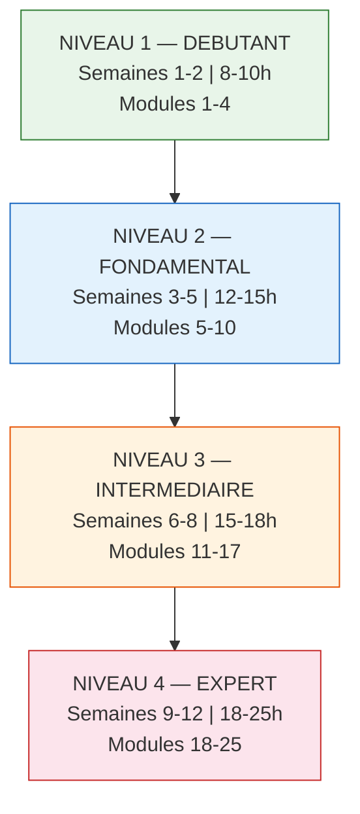
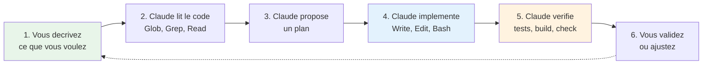
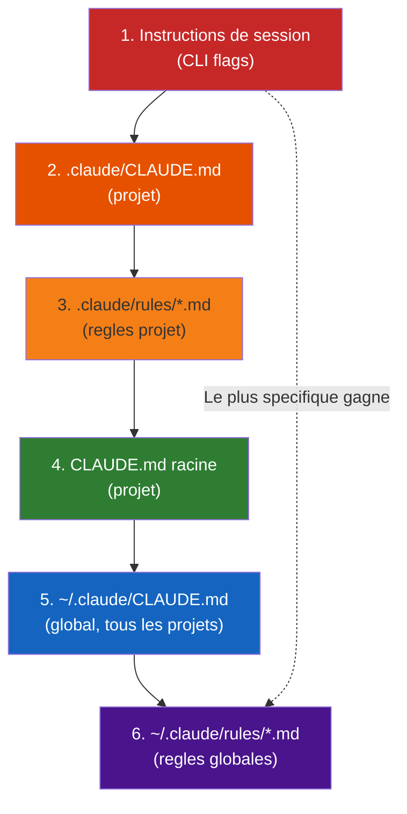
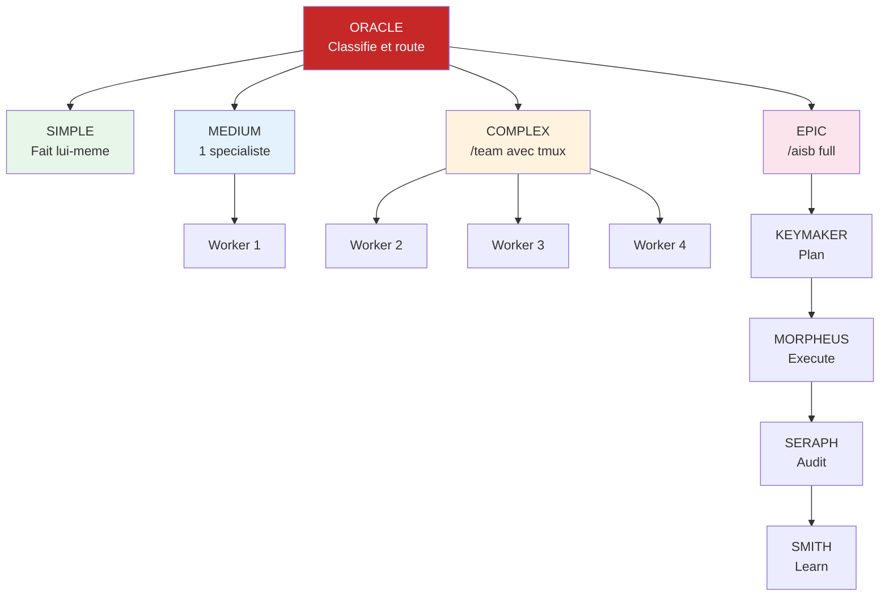
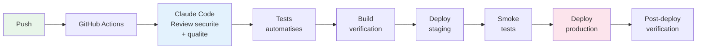

# Claude Master Class

De debutant absolu a expert systeme en 12 semaines. Ce module couvre l'ensemble de l'ecosysteme Claude : du CLI Claude Code pour le developpement assiste par IA, a l'API Claude pour l'integration programmatique, en passant par les agents autonomes et l'orchestration multi-agents.

---

## Identite de la formation

| Champ | Valeur |
|-------|--------|
| Nom | **Claude Code Masterclass — De Zero a Systeme Autonome** |
| Sous-titre | La formation la plus complete au monde sur Claude Code |
| Createur | Gareth Simono — Fondateur d'Agentik OS (265+ agents, 190+ skills en production) |
| Public cible | Debutants complets, developpeurs, entrepreneurs tech, CAIOs, freelances |
| Pre-requis | Savoir utiliser un ordinateur. C'est tout. On commence vraiment a zero. |
| Promesse | En 12 semaines, passer de "c'est quoi Claude Code ?" a "j'ai mon propre ecosysteme d'agents autonomes qui travaillent pour moi 24/7" |

---

## Architecture de la formation — 4 niveaux



---

## Objectif du module

A l'issue de ce module, vous maitriserez Claude Code en profondeur, saurez concevoir des workflows autonomes avec agents specialises, et serez capable d'orchestrer des systemes multi-agents en production. Vous aurez les competences pour construire votre propre ecosysteme — skills, hooks, agents custom, MCP, pipelines CI/CD, monitoring — le tout deploye et fonctionnel.

---

# NIVEAU 1 — DEBUTANT

*"Je decouvre Claude Code" — Semaines 1-2 | 8-10 heures*

---

## Lecon 1 — Qu'est-ce que Claude Code ?

### Ce que vous allez apprendre

Comprendre ce qu'est Claude Code, pourquoi c'est fondamentalement different de ChatGPT, Copilot ou Cursor, et ce que ca permet de faire. Voir le potentiel avant d'apprendre les details.

### Contenu detaille

**L'IA avant Claude Code — Le probleme :**

Les outils existants ont chacun une limitation fondamentale :

- **ChatGPT** : conversation isolee, pas d'acces a vos fichiers, pas d'execution de code
- **Copilot** : autocompletion de code, pas d'autonomie, pas de vision systeme
- **Cursor/Windsurf** : IDE augmente, mais toujours controle par l'humain etape par etape

Le probleme fondamental : ces outils **assistent**. Claude Code **agit**.

**Claude Code — L'agent de developpement :**

Claude Code est le CLI officiel d'Anthropic pour le developpement agentic. Le mot "agentic" signifie que Claude prend des decisions, execute, verifie et corrige — en boucle.

**Les 6 super-pouvoirs de Claude Code :**

1. **Acces direct au filesystem** — lire, ecrire, editer n'importe quel fichier
2. **Execution de commandes shell** — bash, git, npm, docker, python, tout
3. **Recherche intelligente dans le code** — grep, glob, navigation semantique
4. **Spawning d'agents specialises** — sous-agents paralleles pour les taches complexes
5. **Memoire persistante** — se souvient entre les sessions
6. **Extensibilite infinie** — skills, hooks, MCP, agents custom

**Comparaison honnete avec les alternatives :**

| Feature | ChatGPT | Copilot | Cursor | Claude Code |
|---------|---------|---------|--------|-------------|
| Acces fichiers | Non | Fichier actif | Projet | Filesystem complet |
| Execution shell | Non | Non | Limite | Complet |
| Agents autonomes | Non | Non | Non | Oui (paralleles) |
| Memoire persistante | Limite | Non | Limite | Oui (multi-session) |
| Skills reutilisables | Non | Non | Non | Oui (190+) |
| Hooks automatisation | Non | Non | Non | Oui (16+ events) |
| MCP (connecteurs) | Non | Non | Non | Oui (illimite) |
| Multi-model | Non | Non | Oui | Oui |
| Terminal natif | Non | Non | Non | Oui |
| Open source | Non | Non | Non | Oui (CLI) |

**Qui utilise Claude Code et pourquoi :**

- **Developpeurs solo** qui veulent la productivite d'une equipe
- **Startups** qui veulent aller vite sans recruter
- **CAIOs** qui construisent des systemes pour leurs clients
- **Entreprises** qui automatisent des workflows complexes
- Le cas Agentik OS : 1 personne, 265 agents, clients multiples

### Exercice pratique

Regardez les demonstrations de Claude Code en action : construire une landing page en 5 minutes, debugger un bug complexe de maniere autonome, deployer un site en production avec une seule phrase, lancer 5 agents en parallele pour tester un site entier. Ecrivez en 3 phrases ce que vous aimeriez construire avec Claude Code.

---

## Lecon 2 — Installation et premier lancement

### Ce que vous allez apprendre

Installer Claude Code sur votre machine, reussir votre premiere interaction, et comprendre l'interface du terminal.

### Contenu detaille

**Pre-requis systeme :**

- macOS, Linux ou Windows (via WSL2)
- Node.js 18+ (installation pas a pas pour chaque OS)
- Terminal : iTerm2 (Mac), Windows Terminal (Windows), tout terminal Linux
- Git (installation pas a pas)
- Un editeur de texte (VS Code recommande, optionnel)

**Installation en 3 etapes :**

```bash
# 1. Installer Claude Code
npm install -g @anthropic-ai/claude-code

# 2. Verifier l'installation
claude --version

# 3. Se connecter
claude login
```

**Authentification — 3 methodes :**

1. **claude login** — connexion avec compte Claude.ai (le plus simple)
2. **API key** — pour usage programmatique : `export ANTHROPIC_API_KEY=sk-ant-...`
3. **Cloud providers** — AWS Bedrock, Google Vertex AI, Microsoft Foundry

**Premiere session :**

```bash
mkdir mon-premier-projet
cd mon-premier-projet
claude
```

Ce que vous voyez :
- **La zone de prompt** (en bas) — ou vous tapez
- **Les tool calls** (au milieu) — les actions de Claude
- **Les resultats** (output)
- **Le status bar** (en haut) — modele, cout, contexte

**Commandes speciales essentielles :**

| Commande | Action |
|----------|--------|
| `/help` | Aide complete |
| `/cost` | Cout de la session |
| `/status` | Statut de session |
| `/compact` | Compacter le contexte |
| `/clear` | Nouvelle session |

**Raccourcis clavier essentiels :**

| Raccourci | Action |
|-----------|--------|
| `Ctrl+C` | Interrompre Claude |
| `Escape` | Annuler le menu actuel |
| `Tab` | Autocompletion |
| `Ctrl+L` | Nettoyer l'ecran |
| `Ctrl+Z` | Annuler la derniere modification de fichier |

**Les permissions — comprendre le systeme :**

Claude Code peut tout faire sur votre machine. Les permissions sont le garde-fou entre l'intention et l'execution. Par defaut, Claude demande la permission avant les actions sensibles. Vous approuvez ou refusez.

### Exercice pratique

Installez Claude Code. Lancez une session. Demandez a Claude de creer 3 fichiers differents. Observez les permissions, les tool calls, les resultats. Familiarisez-vous avec l'interface.

---

## Lecon 3 — Les 10 outils fondamentaux (Core Tools)

### Ce que vous allez apprendre

Comprendre les 10 outils fondamentaux de Claude Code et savoir quand chacun est utilise.

### Contenu detaille

**Le cycle de travail Claude Code :**



**Les 10 outils fondamentaux :**

| Outil | Usage | Quand | Exemple |
|-------|-------|-------|---------|
| **Read** | Lire des fichiers | Explorer le code, comprendre le contexte | "Lis le package.json et dis-moi les dependances" |
| **Write** | Creer des fichiers | Nouveaux fichiers, reecritures completes | "Cree un composant React Button.tsx" |
| **Edit** | Modifier des fichiers | Corrections ciblees (old_string → new_string) | "Change la couleur du bouton de bleu a rouge" |
| **Bash** | Executer des commandes | npm, git, python, curl, docker, tout | "Installe les dependances et lance le build" |
| **Glob** | Trouver des fichiers | Recherche par pattern, decouvrir la structure | "Trouve tous les fichiers TypeScript" |
| **Grep** | Chercher dans le contenu | Trouver ou une fonction est utilisee | "Cherche toutes les utilisations de useEffect" |
| **Agent** | Deleguer a un sous-agent | Taches complexes, recherches profondes | "Analyse tout le code et fais un rapport qualite" |
| **WebSearch** | Recherche web | Trouver des solutions, documentation | "Cherche comment configurer Tailwind v4" |
| **WebFetch** | Telecharger une page | Lire de la documentation en ligne | "Va lire la doc de shadcn/ui" |
| **NotebookEdit** | Modifier des notebooks | Jupyter notebooks (.ipynb) | "Ajoute une cellule d'analyse" |

**Points cles :**

- **Read** peut lire des images (PNG, JPG), des PDFs, des notebooks Jupyter — pas seulement du code
- **Edit** est prefere a Write pour les modifications : il envoie seulement le diff
- **Bash** peut executer n'importe quelle commande avec un timeout configurable (max 600s)
- **Agent** est la cle de la scalabilite : chaque sous-agent a son propre contexte

### Exercice pratique

Donnez 10 instructions differentes a Claude Code. Pour chacune, identifiez quel outil est utilise. Exemples : "Lis le README", "Installe express", "Trouve tous les .tsx", "Cherche les TODO dans le code", "Cree un fichier test.js". Tenez un journal d'observation.

---

## Lecon 4 — Votre premier projet complet

### Ce que vous allez apprendre

Construire un projet complet de A a Z avec Claude Code, en utilisant tous les outils de base.

### Contenu detaille

**Choisir un projet adapte :**

Suggestions : portfolio personnel, to-do app, blog statique, landing page. Criteres : assez simple pour un debutant, assez complet pour toucher tous les outils.

Le projet guide de ce module : **une landing page responsive avec formulaire de contact**.

**Scaffolding avec Claude Code :**

```
"Cree un projet Next.js avec TypeScript et Tailwind CSS"
```

Observez Claude : npm create, configuration, structure de fichiers. Comprenez ce que Claude a fait et pourquoi.

**Construire page par page :**

1. Page d'accueil : hero section, features, CTA
2. Page contact : formulaire, validation
3. Layout : navbar, footer
4. A chaque etape : observer les outils, comprendre le flow

**Gerer les erreurs :**

Claude fait des erreurs — c'est normal. Comment corriger efficacement :
- Etre specifique : "Le bouton ne s'affiche pas, voici ce que je vois..."
- Donner du contexte : referencer les fichiers, composants, patterns existants
- Savoir quand interrompre (`Ctrl+C`) et rediriger

**Lancer, tester, deployer :**

```bash
npm run dev     # Voir le resultat en local
npm run build   # Build de production
# Deployer sur Vercel ou autre
```

### Exercice pratique

Construisez une landing page complete avec hero, features, pricing et footer. Deployez-la en ligne. Prenez des screenshots avant/apres vos corrections. Temps cible : 30 minutes.

---

# NIVEAU 2 — FONDAMENTAL

*"Je maitrise les outils core" — Semaines 3-5 | 12-15 heures*

---

## Lecon 5 — Le systeme CLAUDE.md et l'ingenierie de contexte

### Ce que vous allez apprendre

Hierarchie des fichiers d'instructions, structure d'un CLAUDE.md efficace, rules files modulaires. Optimiser ce que Claude recoit a chaque session.

### Contenu detaille

**Qu'est-ce que CLAUDE.md et pourquoi c'est crucial :**

CLAUDE.md = les instructions permanentes pour Claude dans votre projet. Sans CLAUDE.md, Claude ne connait pas votre projet, vos conventions, vos preferences. Avec CLAUDE.md, Claude travaille **exactement** comme vous voulez, a chaque session.

Analogie : CLAUDE.md est le brief qu'on donne a un nouveau developpeur le jour 1.

**La hierarchie des CLAUDE.md (priorite haute → basse) :**



La regle de priorite : **le plus specifique gagne**. Les instructions de session ecrasent tout. Les regles globales sont le niveau de base.

**Structure d'un CLAUDE.md efficace :**

```markdown
# Nom du Projet

## Overview
Description du projet, objectif, public cible.

## Tech Stack
- Framework, langage, base de donnees
- Versions specifiques

## Project Structure
src/
  app/          # Pages et routes
  components/   # Composants reutilisables
  lib/          # Utilitaires et helpers

## Key Commands
- `npm run dev` — Serveur de dev
- `npm run build` — Build production
- `npm test` — Tests

## Rules
- TypeScript strict
- Mobile-first
- Pas de CSS custom, Tailwind uniquement
```

**Les rules files — Regles modulaires :**

Fichiers dans `~/.claude/rules/` (global) ou `.claude/rules/` (projet). Chaque fichier = une regle ou un ensemble de regles liees. Auto-chargees a chaque session.

Convention de nommage : `00-critical.md`, `10-style.md`, `20-testing.md`.

```markdown
<!-- .claude/rules/no-pixels.md -->
# CSS Rule
Never use pixel units. Always use rem or Tailwind classes.
```

**L'erreur #1 :** Un CLAUDE.md de 500 lignes que Claude ne lit pas entierement. La regle : chaque instruction doit etre actionnable et necessaire. Si Claude n'en a pas besoin a chaque session, mettez-la dans un rule file conditionnel.

**Context engineering — Optimiser ce que Claude recoit :**

- Le budget contexte : chaque token compte
- Garder le CLAUDE.md < 50KB
- Deplacer les details dans des rules files (charges a la demande)
- Progressive disclosure : resume en haut, details en dessous
- **NE PAS mettre** : historique git, docs d'API, code source
- **METTRE** : conventions, architecture, decisions, contraintes

**Iterer sur son CLAUDE.md :**

- Commencer minimal, ajouter au fur et a mesure
- A chaque fois que Claude fait une erreur repetee → ajouter une regle
- A chaque fois que Claude demande une info qu'il devrait savoir → l'ajouter
- Review trimestriel : supprimer les regles obsoletes

### Exercice pratique

Creez un CLAUDE.md pour votre projet principal. Incluez : overview, commands, architecture, 5 regles critiques. Creez au moins 3 rules files. Testez : Claude suit-il les regles quand vous lui demandez de coder ?

---

## Lecon 6 — Prompt engineering pour Claude Code

### Ce que vous allez apprendre

Patterns de prompt qui marchent (direct, contextuel, exploratoire, delegatif). Techniques avancees. Anti-patterns a eviter.

### Contenu detaille

**Les principes fondamentaux :**

- **Specificite > Generalite** : "Ajoute un bouton de connexion dans la navbar qui ouvre un modal Clerk" > "Ajoute l'auth"
- **Contexte > Instruction** : referencer les fichiers, composants, patterns existants
- **Objectif > Methode** : dire QUOI pas COMMENT (sauf quand la methode compte)
- **Decomposer > Empiler** : une tache a la fois pour les sujets complexes

**Les 7 patterns de prompt qui marchent :**

| Pattern | Exemple | Quand l'utiliser |
|---------|---------|------------------|
| **Direct** | "Corrige le bug dans auth.ts ligne 45" | Tache simple, localisee |
| **Contextuel** | "En suivant le pattern de UserCard.tsx, cree TeamCard.tsx" | Coherence avec l'existant |
| **Exploratoire** | "Explore le dossier src/lib/ et explique-moi l'architecture" | Decouverte, comprehension |
| **Iteratif** | "Le bouton est trop large sur mobile. Ajuste a max-width 200px" | Corrections progressives |
| **Architectural** | "On doit ajouter un systeme de notifications. Propose 3 approches." | Design, decisions |
| **Delegatif** | "Lance un agent pour auditer la securite du projet" | Taches complexes/paralleles |
| **Batch** | "Renomme toutes les fonctions camelCase en snake_case dans src/utils/" | Operations repetitives |

**Les anti-patterns a eviter :**

- "Fais-moi un site web" — trop vague
- Coller du code sans contexte — Claude peut lire les fichiers
- Demander 10 choses en un seul prompt — decomposer
- Repeter la meme instruction si ca ne marche pas — changer d'approche
- "Tu peux..." — oui il peut, dites-lui de le FAIRE

**Techniques avancees :**

- **Chain of thought** : "Reflechis etape par etape avant d'implementer"
- **Role playing** : "Tu es un expert securite. Audite ce code."
- **Contrainte negative** : "Ne modifie PAS le fichier config.ts"
- **Validation integree** : "Apres le changement, lance les tests pour verifier"
- **Multi-step** : "1. Lis le composant. 2. Identifie les problemes. 3. Propose des solutions. 4. Implemente."

**Context engineering avance :**

- Donner les bons fichiers de reference : "Regarde src/components/Button.tsx pour le style"
- Specifier les contraintes : "Utilise Tailwind uniquement, pas de CSS custom"
- Donner des exemples : "Le format attendu est comme dans tests/example.test.ts"
- La technique du "before/after" : "Actuellement ca fait X, je veux que ca fasse Y"

### Exercice pratique

Ecrivez 10 prompts pour 10 taches differentes, executez-les, notez le resultat (succes/echec), et ameliorez les prompts qui ont echoue. Experimentez les 7 patterns sur un meme projet.

---

## Lecon 7 — Les permissions et la securite

### Ce que vous allez apprendre

Comprendre le systeme de permissions, le configurer finement, et travailler en securite.

### Contenu detaille

**Pourquoi les permissions existent :**

Claude Code peut TOUT faire sur votre machine. Les permissions sont le garde-fou entre l'intention et l'execution.

**Les modes de permission :**

| Mode | Comportement | Quand l'utiliser |
|------|-------------|------------------|
| `default` | Demande pour les actions sensibles | Usage normal |
| `acceptEdits` | Accepte auto les edits de fichiers | Confiance sur les modifications |
| `dontAsk` | Refuse auto les permissions | Mode lecture seule |
| `bypassPermissions` | Accepte tout (sauf .git, .claude) | Agents autonomes (avec precaution) |
| `plan` | Mode lecture seule, exploration | Design et analyse |

**Configurer les permissions finement :**

```json
{
  "permissions": {
    "allow": [
      "Bash(npm *)",
      "Bash(git *)",
      "Write(src/**)",
      "WebFetch(domain:github.com)"
    ],
    "deny": [
      "Bash(rm -rf *)",
      "Write(.env*)"
    ]
  }
}
```

**Patterns de permissions avancees :**

- Patterns de fichiers : `Write(src/**/*.ts)` — ecriture uniquement sur les .ts dans src
- Patterns de commandes : `Bash(pnpm *)` — seulement pnpm
- Patterns MCP : `mcp__github__*` — tous les outils GitHub MCP
- Patterns d'agents : `Agent(code-reviewer)` — seulement le code-reviewer

**Bonnes pratiques de securite :**

- Ne jamais mettre de secrets dans CLAUDE.md
- Utiliser des variables d'environnement pour les tokens/cles
- Ne pas donner `bypassPermissions` sauf pour les agents de confiance
- Verifier les commandes Bash avant d'approuver (surtout `rm`, `git push`, `curl`)
- Utiliser `.claude/settings.local.json` pour les settings locaux (gitignored)

### Exercice pratique

Configurez un ensemble de permissions pour votre projet qui autorise le dev normal mais bloque les actions dangereuses. Testez les limites : essayez des commandes qui devraient etre bloquees.

---

## Lecon 8 — Git et versionning avec Claude Code

### Ce que vous allez apprendre

Utiliser Git efficacement avec Claude Code : branches, commits, PRs, worktrees, multi-compte.

### Contenu detaille

**Claude Code et Git — Integration native :**

Claude detecte automatiquement les repos Git. Il voit le status, les branches, l'historique. Il peut committer, brancher, merge, pusher. Le `gitStatus` est charge a chaque session.

**Workflow Git recommande :**

- Toujours travailler sur une branche feature
- Commits atomiques : une fonctionnalite par commit
- Messages de commit descriptifs (Claude les genere bien)
- PR avec description complete

**Commandes Git via Claude Code :**

- "Fais un commit avec un message descriptif"
- "Cree une branche feature/login et switch dessus"
- "Montre-moi le diff depuis le dernier commit"
- "Cree une Pull Request sur GitHub"
- Best practices : ne jamais force push sans demander, toujours nouveau commit vs amend

**Git Worktrees — Travail parallele isole :**

Un worktree est une copie isolee du repo dans un dossier temporaire. Utile pour travailler sur 2 features en parallele sans conflit.

```bash
claude --worktree feature-name    # CLI
claude --isolation worktree       # Session isolee
```

Cas d'usage : lancer un agent de test dans un worktree pendant que vous developpez dans le main.

**Multi-compte Git :**

Configurer differents comptes Git par projet avec SSH keys differentes. Le pattern `.gitconfig` avec `includeIf`. Exemple Agentik OS : 4 comptes Git differents selon le projet.

### Exercice pratique

Creez une branche, faites 3 commits avec Claude Code, et creez une PR sur GitHub. Experimentez avec un worktree.

---

## Lecon 9 — Selection de modele et gestion des couts

### Ce que vous allez apprendre

Quel modele utiliser quand, comment optimiser ses couts, plans de facturation.

### Contenu detaille

**Les modeles disponibles dans Claude Code :**

| Modele | Force | Vitesse | Cout |
|--------|-------|---------|------|
| **Opus 4.6** | Raisonnement profond, code complexe, analyse | Plus lent | $$$ |
| **Sonnet 4.6** | Equilibre qualite/vitesse | Moyen | $$ |
| **Haiku 4.5** | Taches simples, rapide | Rapide | $ |

**Quand utiliser quel modele :**

- **Opus** : code complexe, debugging difficile, architecture, decisions, agents critiques
- **Sonnet** : developpement quotidien, features, refactoring
- **Haiku** : exploration de code, recherches simples, agents de lecture
- Regle d'or : commencer par Sonnet, escalader vers Opus quand la tache est complexe

**Changer de modele :**

```bash
claude --model sonnet        # CLI
# Dans settings.json : "model": "sonnet"
# Par agent : model: haiku dans la definition de l'agent
# Par skill : model: opus dans le frontmatter
```

**Gerer les couts :**

- `/cost` — voir le cout de la session actuelle
- Token tracker dans le status bar
- Strategies d'optimisation :
  - Utiliser Haiku pour les agents d'exploration
  - Limiter le contexte (ne pas lire des fichiers inutiles)
  - `/compact` pour liberer du contexte au lieu de relancer
  - Decomposer les grosses taches en petites sessions

**Plans de facturation :**

- Claude Pro ($20/mois) : 5x plus d'usage
- Claude Max ($100/mois) : 20x plus
- Claude Max ($200/mois) : unlimited
- API directe : pay-per-token (pour les usages programmatiques)

### Exercice pratique

Faites la meme tache avec Opus, Sonnet et Haiku. Comparez qualite/vitesse/cout. Definissez votre strategie.

---

## Lecon 10 — La fenetre de contexte — comprendre et optimiser

### Ce que vous allez apprendre

Comprendre le concept de contexte, savoir quand il sature, et comment l'optimiser. Compaction automatique et extended thinking.

### Contenu detaille

**Qu'est-ce que le contexte ?**

Le contexte = la "memoire de travail" de Claude pendant UNE session. Tout consomme du contexte : votre CLAUDE.md, vos messages, les resultats des outils, le code lu. Limite : 200K tokens (environ 500 pages de texte). Quand le contexte est plein, Claude oublie le debut de la conversation.

**Ce qui consomme du contexte (et combien) :**

- CLAUDE.md + rules files : charges au demarrage (quelques milliers de tokens)
- Chaque message envoye et chaque reponse : cumule
- Chaque fichier lu (Read) : ajoute au contexte
- Chaque resultat de recherche (Grep/Glob) : ajoute
- Les descriptions de skills et outils MCP

**Signes que le contexte sature :**

- Claude "oublie" des instructions du debut de la conversation
- Les reponses deviennent repetitives ou generiques
- Claude re-demande des infos qu'il avait deja
- Message systeme : compaction automatique

**Strategies d'optimisation :**

| Strategie | Effet |
|-----------|-------|
| `/compact` | Resume la conversation, libere du contexte |
| `/clear` | Recommence a zero (CLAUDE.md recharge) |
| Sessions courtes | 1 feature = 1 session |
| Read cible | Ne pas lire des fichiers inutiles |
| Sous-agents | Chacun a son propre contexte |
| Decomposition | Session 1 : recherche. Session 2 : implementation. |

**La compaction automatique :**

A ~95% de capacite, Claude compacte automatiquement : il resume les anciens messages pour garder les recents. Les instructions CLAUDE.md et rules sont TOUJOURS preservees.

**Extended Thinking / Ultra Think :**

Pour les taches qui necessitent un raisonnement profond, Claude "pense plus longtemps" avant de repondre. Consomme plus de tokens mais donne de meilleurs resultats. Utile pour : debugging complexe, architecture, decisions critiques.

### Exercice pratique

Observez votre consommation de contexte sur 3 sessions differentes. Identifiez les points de saturation. Appliquez les strategies d'optimisation : `/compact`, sessions ciblees, Read partiel.

---

# NIVEAU 3 — INTERMEDIAIRE

*"Je cree mes propres outils" — Semaines 6-8 | 15-18 heures*

---

## Lecon 11 — Creer des Skills : capacites reutilisables

### Ce que vous allez apprendre

Anatomie d'un SKILL.md, frontmatter complet, variables, multi-fichiers. Creer, tester et deployer des skills professionnelles.

### Contenu detaille

**Qu'est-ce qu'un Skill ?**

Un skill est un fichier Markdown qui donne a Claude Code une capacite specialisee, invocable par l'utilisateur via `/nom-du-skill`. C'est comme une "application" pour Claude Code. Un playbook qu'on donne a un employe pour une tache specifique.

Exemples : `/deploy`, `/audit`, `/blog-write`, `/test`, `/report`

Skills vs Prompts : une skill est structuree, testable, partageable.

**Anatomie d'une skill — Le fichier SKILL.md :**

```yaml
---
name: deploy-production
description: Deploy the current project to Vercel production with verification
user-invocable: true
allowed-tools: Bash, Read, Glob
model: inherit
argument-hint: "[--skip-tests]"
---

# Deploy to Production

## Steps
1. Run `pnpm build` to verify the build
2. If build fails, show the error and stop
3. Run `vercel --prod --yes --token "$VERCEL_TOKEN"`
4. Wait for deployment URL
5. Verify the deployment is live with a fetch
6. Report success or failure
```

**Tous les champs du frontmatter :**

| Champ | Type | Description |
|-------|------|-------------|
| `name` | string | Nom unique (lowercase, hyphens, max 64 chars) |
| `description` | string | Quand utiliser cette skill (Claude l'utilise pour auto-invoquer) |
| `disable-model-invocation` | bool | true = seulement invocable par l'utilisateur |
| `user-invocable` | bool | false = seulement invocable par Claude |
| `allowed-tools` | string | Outils autorises (comma-separated) |
| `model` | string | sonnet, opus, haiku, inherit |
| `effort` | string | low, medium, high, max |
| `context` | string | fork = sous-agent isole |
| `agent` | string | Type de sous-agent (Explore, Plan, etc.) |
| `argument-hint` | string | Affiche dans l'autocompletion |
| `hooks` | object | Hooks specifiques a cette skill |

**Variables disponibles dans les skills :**

```
$ARGUMENTS      # Tous les arguments en string
$ARGUMENTS[0]   # Premier argument
$0, $1, $2      # Raccourcis
${CLAUDE_SESSION_ID}   # ID de session
${CLAUDE_SKILL_DIR}    # Dossier de la skill
```

**Ou placer les skills :**

- `~/.claude/skills/nom-skill/SKILL.md` — global (tous les projets)
- `.claude/skills/nom-skill/SKILL.md` — projet specifique
- `~/.claude/commands/nom.md` — legacy (fonctionne toujours)
- `.claude/commands/nom.md` — legacy projet

**Skills avancees — Techniques :**

- **Multi-fichiers** : SKILL.md + support.md + templates/
- **Skill qui invoque d'autres skills** : orchestration
- **Skill conditionnelle** : "Si le projet utilise Next.js, fais X. Si Vue, fais Y."
- **Skill avec validation** : hooks dans le frontmatter pour valider le resultat
- **Skill partageable** : publier sur GitHub, installer avec `/follow`

### Exercice pratique

Creez 5 skills pour votre projet : deploy, test, lint, format, audit. Chacune avec frontmatter complet. Testez-les 3 fois chacune. Ameliorez a chaque iteration.

---

## Lecon 12 — Les Hooks : automatisation evenementielle

### Ce que vous allez apprendre

Les 16+ types d'evenements, hooks command/prompt/agent/http, codes de sortie, matchers. Cas concrets : logging, notifications, validation automatique.

### Contenu detaille

**Qu'est-ce qu'un Hook ?**

Un hook est un script qui s'execute automatiquement quand un evenement specifique se produit dans Claude Code. C'est l'equivalent des GitHub Actions pour l'IA.

**Les 16+ types d'evenements :**

| Evenement | Quand | Peut bloquer ? |
|-----------|-------|----------------|
| `SessionStart` | Debut de session | Oui |
| `InstructionsLoaded` | Chargement CLAUDE.md | Non |
| `UserPromptSubmit` | Avant que Claude traite le message | Oui |
| `PreToolUse` | Avant l'execution d'un outil | Oui |
| `PermissionRequest` | Dialogue de permission | Oui |
| `PostToolUse` | Apres succes d'un outil | Oui |
| `PostToolUseFailure` | Apres echec d'un outil | Non |
| `Notification` | Notification envoyee | Non |
| `SubagentStart` | Debut de sous-agent | Non |
| `SubagentStop` | Fin de sous-agent | Non |
| `Stop` | Claude finit de repondre | Oui |
| `StopFailure` | Erreur API en fin de tour | Non |
| `TaskCompleted` | Tache terminee | Oui |
| `ConfigChange` | Changement de config | Oui |
| `PreCompact` | Avant compaction | Non |
| `PostCompact` | Apres compaction | Non |
| `SessionEnd` | Fin de session | Non |

**Types de hooks :**

**Command hook** (le plus courant) :
```json
{
  "type": "command",
  "command": "echo 'Fichier modifie: ${toolInput.file_path}' >> /tmp/changes.log",
  "timeout": 600
}
```

**Prompt hook** (Claude evalue) :
```json
{
  "type": "prompt",
  "prompt": "Verifie que ce changement respecte les conventions du projet"
}
```

**Agent hook** (sous-agent verifie) :
```json
{
  "type": "agent",
  "prompt": "Verifie que les tests passent apres ce changement",
  "timeout": 60
}
```

**HTTP hook** (appel externe) :
```json
{
  "type": "http",
  "url": "http://localhost:8080/webhook",
  "headers": { "Authorization": "Bearer $TOKEN" }
}
```

**Les codes de sortie :**

- `exit 0` : l'action continue. Le stdout est ajoute au contexte de Claude.
- `exit 2` : l'action est BLOQUEE. Le stderr est retourne a Claude comme feedback.
- Autre : l'action continue, le stderr est logue en verbose.

**Matchers — Filtrer les evenements :**

```json
"matcher": "Bash"          // Exact match
"matcher": "Edit|Write"    // Multiple (pipe)
"matcher": "mcp__github__.*"  // Regex
"matcher": ""              // Match ALL (vide)
```

**Configuration dans settings.json :**

```json
{
  "hooks": {
    "SessionStart": [{
      "type": "command",
      "command": "echo 'Session demarree' | tee -a ~/.claude/sessions.log"
    }],
    "PostToolUse": [{
      "matcher": "Write|Edit",
      "hooks": [{
        "type": "command",
        "command": "echo '$(date): ${toolInput.file_path}' >> /tmp/claude-changes.log"
      }]
    }],
    "SessionEnd": [{
      "type": "command",
      "command": "bash ~/.claude/lib/session-end-hook.sh"
    }]
  }
}
```

**Cas concrets :**

- Logger chaque fichier modifie (audit trail)
- Envoyer une notification Telegram quand un deploy est fait
- Charger du contexte automatiquement au demarrage
- Bloquer les modifications sur certains fichiers critiques
- Sauvegarder un resume de session a la fin
- Valider le code avant chaque commit
- Enregistrer les metriques de session (duree, outils utilises, couts)

### Exercice pratique

Configurez 4 hooks : SessionStart (log), PostToolUse sur Write (notification), PreToolUse sur Bash pour bloquer `rm -rf`, SessionEnd (resume).

---

## Lecon 13 — Le systeme d'agents et sous-agents specialises

### Ce que vous allez apprendre

Agents built-in (Explore, Plan), agents custom avec agent.md, invocation, agents en parallele, memoire d'agent persistante, communication inter-agents.

### Contenu detaille

**Sous-agents — Le concept :**

Un sous-agent = un Claude specialise avec son propre contexte et ses propres outils. Chaque agent a des instructions specifiques, des outils restreints, un role clair. Analogie : une equipe ou chaque membre a une specialite.

**Les agents built-in :**

| Agent | Modele | Outils | Usage |
|-------|--------|--------|-------|
| `Explore` | Haiku | Lecture seule | Exploration rapide du codebase |
| `Plan` | Herite | Lecture seule | Planification, design |
| `general-purpose` | Herite | Tous | Taches complexes multi-etapes |

**Creer un agent custom :**

Structure de fichiers :
```
.claude/agents/code-reviewer/
  agent.md
```

Fichier `agent.md` :
```yaml
---
name: code-reviewer
description: Reviews code for quality, security, and best practices
tools: Read, Grep, Glob, Bash
model: sonnet
permissionMode: default
maxTurns: 20
memory: project
---

# Code Reviewer Agent

You are an expert code reviewer. When invoked:
1. Read the files that changed (use git diff)
2. Check for security vulnerabilities
3. Check for code quality issues
4. Check for performance problems
5. Generate a structured report
```

**Tous les champs du frontmatter agent :**

| Champ | Description |
|-------|-------------|
| `name` | Identifiant unique |
| `description` | Quand deleguer a cet agent |
| `tools` | Outils autorises (allowlist) |
| `disallowedTools` | Outils interdits (denylist) |
| `model` | Modele a utiliser |
| `permissionMode` | Mode de permissions |
| `maxTurns` | Nombre max de tours |
| `skills` | Skills a pre-charger |
| `mcpServers` | Serveurs MCP accessibles |
| `hooks` | Hooks specifiques |
| `memory` | Scope memoire (user, project, local) |
| `background` | true = toujours en background |
| `effort` | Niveau d'effort |
| `isolation` | worktree = isole dans un worktree Git |

**Invoquer un agent :**

- **Automatique** : Claude decide selon la description
- **Explicite** : "Utilise l'agent code-reviewer pour verifier ce code"
- **@mention** : `@code-reviewer regarde les changements d'auth`
- **CLI** : `claude --agent code-reviewer`

**Agents en parallele :**

Lancer plusieurs agents simultanement. Chacun travaille de maniere independante. `run_in_background: true` — vous continuez a travailler pendant. Notification quand l'agent termine.

Cas d'usage : lancer un testeur, un reviewer et un security scanner en parallele.

**Memoire d'agent persistante :**

- `memory: user` → `~/.claude/agent-memory/nom-agent/` (global)
- `memory: project` → `.claude/agent-memory/nom-agent/` (versionne)
- `memory: local` → `.claude/agent-memory-local/nom-agent/` (gitignored)

L'agent peut lire/ecrire dans son dossier memoire. MEMORY.md : les 200 premieres lignes sont chargees dans le contexte. Un agent qui apprend les patterns du projet au fil du temps.

**Communication inter-agents :**

`SendMessage(to: "agent-name")` — envoyer un message a un agent en cours. L'agent repond dans son contexte. Pattern : orchestrateur → specialistes → rapport.

### Exercice pratique

Creez 3 agents custom : un reviewer (lecture seule), un fixer (edition), et un tester (bash). Faites-les travailler sur le meme code. Testez la communication entre eux.

---

## Lecon 14 — MCP (Model Context Protocol) : connecter Claude au monde

### Ce que vous allez apprendre

Configurer des serveurs MCP, tool search pour les gros serveurs, construire un serveur custom, nommage des outils MCP.

### Contenu detaille

**MCP — Le standard universel :**

MCP = Model Context Protocol = "USB pour l'IA". Permet a Claude de se connecter a des services externes (APIs, BDD, outils). Standard ouvert, pas specifique a Anthropic. 3 primitives : Tools (fonctions), Resources (donnees), Prompts (templates).

**Types de serveurs MCP :**

| Type | Protocole | Cas d'usage |
|------|-----------|-------------|
| `stdio` | JSON-RPC stdin/stdout | Processus locaux |
| `http` | HTTP POST | Serveurs distants |
| `sse` | Server-Sent Events | Mises a jour en streaming |

**Configurer un serveur MCP :**

Dans `.mcp.json` (projet) ou `~/.mcp.json` (global) :

```json
{
  "mcpServers": {
    "github": {
      "type": "stdio",
      "command": "npx",
      "args": ["-y", "@modelcontextprotocol/server-github"],
      "env": { "GITHUB_TOKEN": "ghp_..." }
    }
  }
}
```

**Les serveurs MCP essentiels :**

| Serveur | Ce qu'il fait |
|---------|---------------|
| **Composio** | 200+ apps (Slack, Gmail, LinkedIn, etc.) |
| **PostgreSQL** | Requetes BDD directes |
| **Filesystem** | Acces fichiers cross-projet |
| **GitHub** | Issues, PRs, code |
| **Memory/Search** | Memoire persistante, recherche semantique |
| **Context7** | Documentation a jour de librairies |

**Tool Search — Pour les gros serveurs MCP :**

Quand un serveur MCP a 100+ outils (ex: Composio), au lieu de charger tous les schemas, on utilise le lazy loading avec `"toolSearch": true`. L'outil `ToolSearch` cherche et charge les schemas a la demande.

**Construire un MCP server custom :**

SDK TypeScript : `@modelcontextprotocol/sdk`. Structure minimale :
1. Creer un Server
2. Declarer les tools (nom, description, inputSchema)
3. Implementer les handlers (tools/list, tools/call)
4. Publier sur npm pour le partager

**Nommage des outils MCP :**

```
mcp__<serveur>__<outil>
mcp__github__search_repositories
mcp__composio__SLACK_SEND_MESSAGE
```

Claude peut appeler ces outils directement. Permissions configurables : `"allow": ["mcp__github__*"]`.

### Exercice pratique

Configurez 3 serveurs MCP (un service de votre choix + un custom basique). Faites un workflow qui les utilise tous.

---

## Lecon 15 — La memoire persistante

### Ce que vous allez apprendre

Les types de memoire dans Claude Code, auto-memory, memoire d'agent persistante, plugin claude-mem, strategies de memorisation.

### Contenu detaille

**Les types de memoire dans Claude Code :**

- **CLAUDE.md** : memoire explicite, manuelle, versionnee
- **Auto-memory** : memoire automatique, semantique, locale
- **Agent memory** : memoire par agent, persistante
- **Rules files** : regles permanentes

**Auto-memory — Comment ca marche :**

Claude enregistre automatiquement les interactions importantes. Stockage : SQLite + Chroma (vector DB) en local. Recherche semantique : retrouver des infos par sens, pas par mot-cle.

**Memoire d'agent persistante (3 scopes) :**

- `user` : `~/.claude/agent-memory/<agent>/` (global)
- `project` : `.claude/agent-memory/<agent>/` (projet, versionne)
- `local` : `.claude/agent-memory-local/<agent>/` (projet, gitignored)

MEMORY.md : index de la memoire, 200 premieres lignes chargees automatiquement. L'agent peut creer d'autres fichiers (reports, logs, donnees).

**Plugin claude-mem — Memoire avancee :**

Plugin SQLite + Chroma pour la recherche semantique cross-sessions. Hooks automatiques : SessionStart, PostToolUse, SessionEnd. Outils MCP : `search(query)`, `get_observations(ids)`, `timeline(id)`. Web UI : `http://localhost:37777`.

**Strategies de memoire :**

- **A memoriser** : decisions d'architecture, preferences, patterns recurrents
- **A NE PAS memoriser** : code specifique (il change), historique Git (il existe deja)
- Pattern recommande : CLAUDE.md pour les guidelines + auto-memory pour l'historique + agent memory pour les specialistes

### Exercice pratique

Configurez la memoire pour votre projet, faites 3 sessions separees, et verifiez que le contexte persiste correctement.

---

## Lecon 16 — Integrations IDE et commandes avancees

### Ce que vous allez apprendre

Claude Code dans VS Code et JetBrains. Commandes built-in completes, raccourcis, keybindings custom, flags CLI.

### Contenu detaille

**Extension VS Code :**

- Chat dans la sidebar : conversation avec Claude dans VS Code
- @mentions : referencer des fichiers, fonctions, symboles
- Actions de code : Claude dans le menu contextuel
- Terminal integre : Claude Code directement dans le terminal VS Code

**Plugin JetBrains :**

Support : IntelliJ, PyCharm, WebStorm, CLion. Memes fonctionnalites que VS Code.

**Terminal pur vs IDE — Quand utiliser quoi :**

- **Terminal** : taches systeme, agents paralleles, automations, deploiements
- **IDE** : modifications visuelles, exploration de code, debugging avec context visuel
- Recommandation : maitriser le terminal d'abord, ajouter l'IDE ensuite

**Commandes built-in completes :**

| Commande | Action |
|----------|--------|
| `/help` | Aide complete |
| `/compact` | Compacter le contexte |
| `/clear` | Nouvelle session |
| `/memory` | Voir/editer la memoire |
| `/cost` | Cout de la session |
| `/context` | Usage du contexte |
| `/debug` | Debug de session |
| `/hooks` | Parcourir les hooks |
| `/agents` | Gerer les agents |
| `/permissions` | Configurer les permissions |
| `/skills` | Lister les skills |
| `/settings` | Voir les settings actifs |
| `/status` | Statut de session |
| `/theme` | Changer le theme |

**Skills bundlees (built-in) :**

- `/batch <instruction>` — modifications paralleles dans le codebase
- `/simplify [focus]` — review de code et corrections
- `/loop [interval] <commande>` — repeter sur intervalle
- `/debug [description]` — troubleshooting de session
- `/claude-api` — charger la reference API Claude

**Raccourcis clavier complets :**

| Raccourci | Action |
|-----------|--------|
| `Ctrl+C` | Interrompre Claude |
| `Escape` | Quitter le menu actuel |
| `Ctrl+L` | Nettoyer l'ecran |
| `Ctrl+R` | Recherche dans l'historique |
| `Ctrl+O` | Toggle verbose (debug) |
| `Ctrl+B` | Mettre en background |
| `Ctrl+Z` | Annuler modif fichier |
| `Tab` | Autocompletion |

**Keybindings custom :**

```json
// ~/.claude/keybindings.json
{
  "keyBindings": [{
    "key": "ctrl+shift+d",
    "command": "dispatch",
    "context": "prompt",
    "args": { "skill": "deploy" }
  }]
}
```

**Flags CLI complets :**

```bash
claude                        # Session interactive
claude "prompt"               # One-shot
claude --model sonnet         # Choisir le modele
claude --agent code-reviewer  # Utiliser un agent
claude --worktree feature     # Isoler dans un worktree
claude --disable-auto-memory  # Sans memoire auto
claude --debug                # Mode debug complet
claude --api-key sk-ant-...   # API key directe
echo "prompt" | claude -p -   # Stdin
```

### Exercice pratique

Configurez 3 keybindings custom et utilisez toutes les commandes built-in au moins une fois. Testez Claude Code dans VS Code en parallele du terminal.

---

# NIVEAU 4 — EXPERT

*"Je construis mes propres systemes" — Semaines 9-12 | 18-25 heures*

---

## Lecon 17 — Architectures multi-agents

### Ce que vous allez apprendre

Patterns pipeline, fan-out, hierarchique, swarm. Le pattern ORACLE d'Agentik OS. Teams natifs. Concevoir un ecosysteme d'agents.

### Contenu detaille

**Les 5 patterns d'architecture multi-agents :**

| Pattern | Description | Cas d'usage |
|---------|-------------|-------------|
| **Single agent** | Un Claude, toutes les taches | Petits projets |
| **Pipeline** | Agent A → Agent B → Agent C | Workflows lineaires |
| **Fan-out** | 1 orchestrateur → N specialistes paralleles | Bug hunting, audits |
| **Hierarchique** | CEO → Managers → Specialistes | Systemes complexes (Agentik OS) |
| **Swarm** | Agents autonomes, communication peer-to-peer | Exploration exploratoire |

**Le pattern ORACLE (Agentik OS) :**



L'Oracle est un agent qui ne code JAMAIS — il decompose, dispatche, verifie :

```
Mission → Classification → Decomposition → Dispatch workers → Monitor → Verify → Report
```

Regles de l'Oracle :
- Ne jamais ecrire de code
- Toujours verifier le travail des workers
- Re-dispatcher si le resultat ne passe pas l'audit
- Reporter le resultat final

**Fresh context — Chaque agent recoit exactement ce dont il a besoin :**

```markdown
## Mission: {1-2 ligne resume}
## Context: {projet, stack, URL}
## Current Task: {fichiers specifiques, lignes, changements exacts}
## Done Criteria: {condition mesurable}
## Verify Command: {commande exacte pour prouver que c'est fait}
```

**L'exemple Agentik OS — 265+ agents :**

- 6 departements : Dev, QA, Security, Marketing, Creative, Strategy
- Hierarchie : CEO → CTO/CMO/CPO → Leads → Specialistes
- Orchestration : ORACLE classifie et route
- Resultat : 1 personne opere un systeme qui fait le travail de 20+

**Teams natifs — Multi-agent cooperatif :**

```bash
claude --team researcher,coder,reviewer  # Lancer une equipe
```

Chaque membre travaille en parallele. Communication via `SendMessage`. Guardian pattern : un agent verifie le travail des autres.

**Concevoir un ecosysteme d'agents :**

1. Identifier les roles : quels types de taches ?
2. Definir les specialistes : un agent = une responsabilite
3. Concevoir les flows : qui parle a qui, dans quel ordre
4. Definir les interfaces : quels inputs/outputs entre agents
5. Tester iterativement : commencer avec 3 agents, ajouter au fur et a mesure

### Exercice pratique

Concevez et implementez une architecture de 5 agents pour un cas d'usage de votre choix (ex: pipeline de contenu, systeme de QA, workflow de support client). Testez la communication inter-agents.

---

## Lecon 18 — Systemes d'automatisation avances

### Ce que vous allez apprendre

Pipelines de contenu automatises, publication sur les reseaux sociaux, bots Telegram, systemes auto-reparateurs, monitoring avec dashboard custom.

### Contenu detaille

**Cron jobs — La base de l'automatisation VPS :**

```bash
# Toutes les heures : verifier l'etat des deploiements
0 * * * * claude -p "Check all project deployments and alert on failures" >> /var/log/claude-monitor.log
```

Syntaxe cron complete. `crontab -e` pour editer, `crontab -l` pour lister. Logging : rediriger stdout/stderr vers des fichiers.

**Pipeline de contenu automatise (cas reel Agentik OS) :**

Le pipeline `auto-publish.sh` en action :

1. Selectionner le sujet
2. Claude genere l'article
3. Generer l'image (Gemini Imagen)
4. Creer le fichier blog
5. Build Next.js
6. Deploy Vercel
7. Poster LinkedIn/Twitter/Reddit (Composio)
8. Notification Telegram

Gestion des erreurs : retry 3x, fallback, alertes. Resultat : publication quotidienne sans intervention humaine.

**Poster sur les reseaux sociaux automatiquement :**

Via Composio + OAuth : LinkedIn, Reddit, Twitter. Tracker `.social-posted.json` pour eviter les doublons. Formats specifiques par plateforme (LinkedIn long-form, Twitter thread, Reddit post). Scheduling a des heures optimales.

**Bots Telegram avec Claude Code :**

Architecture :
1. Bot Telegram (Python/Node) ecoute les messages
2. Messages enrichis avec le contexte projet
3. Claude Code execute la tache
4. Resultat renvoye sur Telegram

Cas d'usage : commander des deploys, lancer des audits, recevoir des rapports — tout depuis son telephone.

**Self-healing — Systemes auto-reparateurs :**

Pattern : monitoring → detection d'anomalie → diagnostic automatique → fix → verification → notification.

Exemple : si un deploy echoue, le systeme detecte l'echec, analyse les logs, identifie la cause, tente un fix automatique, re-deploy, notifie le resultat.

Garde-fous :
- Health checks automatiques toutes les 5 minutes
- Actions automatiques : restart service, clear cache, scale up
- Alertes graduees : warning → critical → auto-fix → notification
- Circuit breaker : arreter de retry si ca echoue 3 fois

### Exercice pratique

Construisez un pipeline automatise complet : generation de contenu + publication + notification. Configurez-le en cron sur votre machine.

---

## Lecon 19 — Agents autonomes et God Mode

### Ce que vous allez apprendre

Agents autonomes qui travaillent pendant des heures sans intervention. Le concept de God Mode. Garde-fous essentiels.

### Contenu detaille

**Le concept d'agent autonome :**

Autonome = il decide, execute, verifie, corrige, itere — sans intervention humaine. Difference avec un agent normal : pas de feedback humain dans la boucle.

Risques : il faut des garde-fous (permissions, limites, monitoring).

Cas d'usage : tests exhaustifs, audits de code, generation de contenu, migrations.

**Le pattern d'agent de dev autonome :**

- Lancement en background
- Ecrit du code, build, teste, fixe, itere
- Fichier de status pour suivre le progres
- Architecture : Agent natif avec `run_in_background: true` et `mode: bypassPermissions`

**L'agent de test persistant :**

Boucle de test continue : teste → detecte un bug → fixe → re-teste → repeat. Checkpoints : sauvegarde l'etat apres chaque action (survit aux limites de contexte). Multi-session : peut reprendre d'ou il s'est arrete. Notifications Telegram : progres et resultats.

**God Mode — Orchestration autonome complete :**

Claude DEVIENT le decideur : planifie, execute, verifie, itere indefiniment jusqu'a la completion de la mission. Zero intervention humaine requise.

- Heartbeat : monitoring de sante, kill switch si besoin
- Reporting Telegram : updates reguliers
- Quand l'utiliser : taches que vous voulez lancer et oublier
- Quand NE PAS l'utiliser : taches sensibles, consequences irreversibles

**Garde-fous pour les agents autonomes :**

| Garde-fou | Effet |
|-----------|-------|
| `maxTurns` | Limiter le nombre de tours |
| Permissions restreintes | Pas de force push, pas de delete en cascade |
| Hook `SubagentStop` | Etre notifie quand l'agent s'arrete |
| Kill switch | Pouvoir arreter a tout moment |
| Logging complet | Tracer toutes les actions pour review |

### Exercice pratique

Creez un agent autonome qui fait un audit complet de votre projet (securite, qualite, performance) et genere un rapport. L'agent tourne en background pendant que vous faites autre chose.

---

## Lecon 20 — CI/CD et deploiement en production

### Ce que vous allez apprendre

Claude Code dans GitHub Actions, pipeline de deploy complet, gestion des secrets, securite des agents en production, backup et recovery.

### Contenu detaille

**Claude Code dans GitHub Actions :**

```yaml
- name: Claude Code Review
  uses: anthropic/claude-code@v1
  with:
    prompt: "Review cette PR et laisse un commentaire"
    repository: ${{ github.repository }}
```

Cas d'usage : review automatique de PR, fix de lint, generation de docs, release notes.

**Pipeline de deploy complet :**



1. Push → GitHub Actions
2. Claude Code review (securite + qualite)
3. Tests automatises (Playwright)
4. Build verification
5. Deploy staging
6. Smoke tests
7. Deploy production
8. Post-deploy verification

**Securite des secrets :**

- JAMAIS de secrets dans CLAUDE.md ou le code
- Variables d'environnement : `.env.local` (gitignored)
- Tags `<private>` pour le contenu sensible (pas enregistre en memoire)
- Rotation des cles API
- Audit des dependances : `npm audit`

**Securite des agents :**

- Principe du moindre privilege : chaque agent a le minimum d'outils necessaires
- Isolation : worktrees pour les agents qui modifient du code
- Review : hooks PostToolUse pour verifier les modifications
- Logs : tracer toutes les actions pour audit

**Securite du VPS :**

- SSH key-only (pas de password)
- Firewall : iptables/ufw
- Fail2ban : bloquer les tentatives de brute force
- Updates regulieres
- User non-root pour tout

**Backup et Recovery :**

- Git comme backup principal du code
- Backup BDD automatique (cron)
- Snapshots VPS
- Procedure de recovery documentee
- Test de recovery regulier

**Multi-provider :**

- AWS Bedrock : `claude --bedrock`
- Google Vertex AI : `claude --vertex-ai`
- Pour les entreprises avec des contraintes cloud specifiques

### Exercice pratique

Configurez un pipeline GitHub Actions complet pour votre projet avec : lint, build, test, deploy staging, deploy prod. Ajoutez une etape Claude Code pour le code review automatique.

---

## Lecon 21 — Projet final : votre ecosysteme complet

### Ce que vous allez apprendre

Construire et deployer votre propre mini-ecosysteme a la maniere d'Agentik OS.

### Cahier des charges du projet final

1. **CLAUDE.md complet** : instructions projet detaillees avec rules files
2. **5 skills custom** : deploy, test, audit, report, publish
3. **4 hooks** : SessionStart (log), PostToolUse (logging), Stop (notification), SessionEnd (resume)
4. **3 agents custom** : reviewer (lecture), builder (edition), tester (execution)
5. **2 MCP servers** : Composio + 1 custom ou specifique
6. **1 pipeline automatise** : cron job qui fait une tache utile automatiquement
7. **1 dashboard de monitoring** : avec au moins 2 services monitores
8. **1 bot Telegram** : pour recevoir des notifications et envoyer des commandes
9. **Deploye en production** : Vercel pour le frontend, VPS pour les crons et agents

**Evaluation :**

- Le systeme tourne en autonomie pendant 24h sans intervention
- Les notifications arrivent sur Telegram
- Le dashboard montre des donnees a jour
- Les agents produisent des resultats utiles
- Le code est propre, documente, securise

---

## Lecon 22 — Aller plus loin : l'ecosysteme Claude

### Ce que vous allez apprendre

Claude Agent SDK, Claude API, skills partageables, veille et updates, devenir formateur.

### Contenu detaille

**Claude Agent SDK :**

Pour construire des agents HORS de Claude Code. Python et TypeScript SDKs. Architecture : model + tools + orchestration loop. Deploiement : serveurs, serverless, edge. Quand l'utiliser : quand vous voulez un agent integre dans votre propre produit.

**Claude API :**

- `@anthropic-ai/sdk` (TypeScript) / `anthropic` (Python)
- Messages API, tool use, streaming, structured outputs
- Vision (images), PDF parsing
- Batch API pour le traitement en masse
- Prompt caching pour optimiser les couts

**L'ecosysteme de skills partageables :**

- Partager ses skills sur GitHub
- `/follow URL` pour installer les skills d'un autre
- Contribuer a la communaute
- Les repositories de skills populaires

**Veille et updates :**

- Suivre les releases de Claude Code (changelog)
- La communaute : forums, Discord, GitHub Issues
- Les nouveautes a surveiller : cloud IDE, mobile, collaboration temps-reel
- Adapter son ecosysteme aux nouvelles features

---

## Recapitulatif de la formation

| Niveau | Semaines | Modules | Heures | Competences acquises |
|--------|----------|---------|--------|---------------------|
| Debutant | 1-2 | 1-4 | 8-10h | Installation, premiers projets, outils de base |
| Fondamental | 3-5 | 5-10 | 12-15h | CLAUDE.md, prompt engineering, permissions, git, modeles, contexte |
| Intermediaire | 6-8 | 11-16 | 15-18h | Skills, hooks, agents, MCP, memoire, IDE, commandes |
| Expert | 9-12 | 17-22 | 18-25h | Multi-agents, automatisation, agents autonomes, CI/CD, securite, projet complet |
| **TOTAL** | **12** | **22** | **53-68h** | **Expert Claude Code autonome** |

---

## Ce que cette formation apporte

- Expertise approfondie de Claude Code CLI et de l'API Claude
- Design de workflows autonomes avec agents specialises
- Competences en architecture multi-agents et orchestration
- Maitrise du systeme de hooks, commandes et skills
- Capacite a construire des systemes autonomes en production

---

## Ressources complementaires

- Module suivant : Prompt et Context Engineering
- Documentation Claude Code officielle
- Repository d'exemples de skills et agents
- Communaute Kommu pour partager vos creations
- Cheat sheet PDF : toutes les commandes, raccourcis, patterns en 2 pages
- Office hours mensuels : Q&A live avec le formateur
- Updates trimestriels : nouveaux modules pour les nouvelles features
