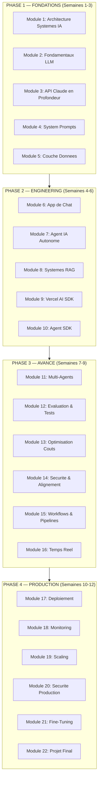
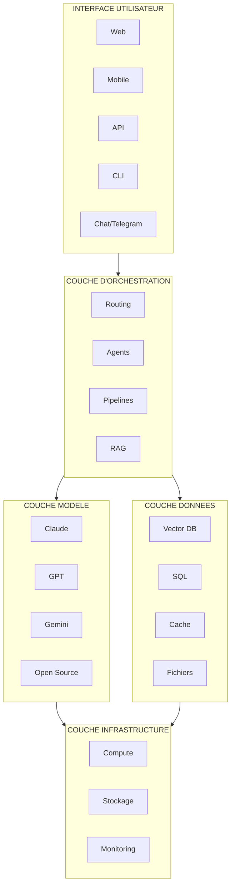
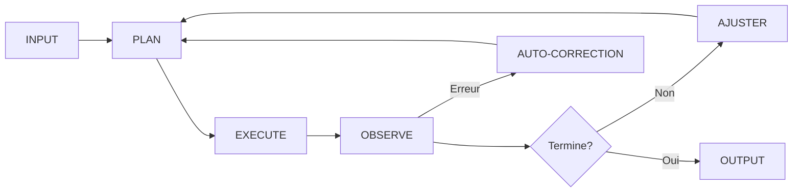
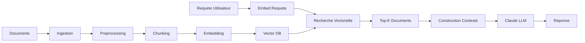
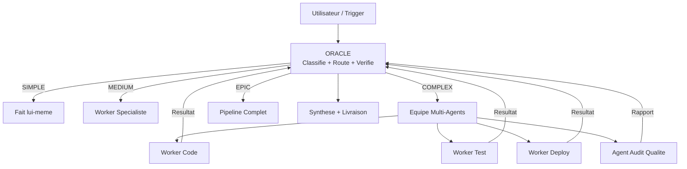
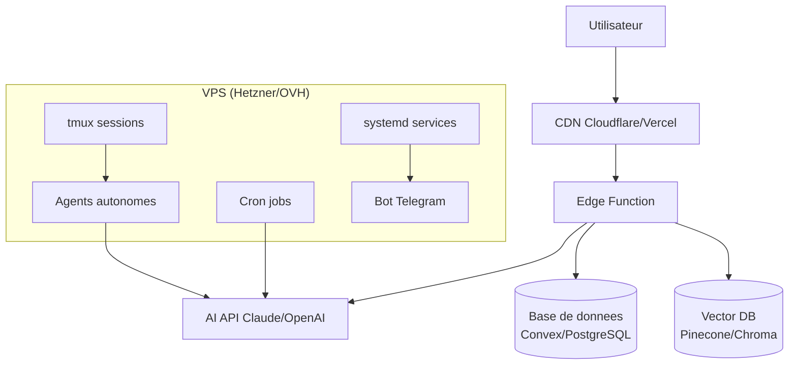
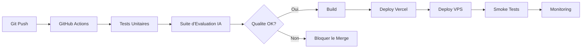
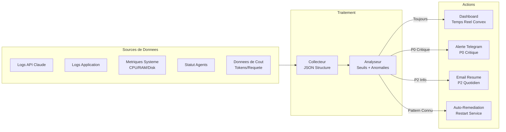
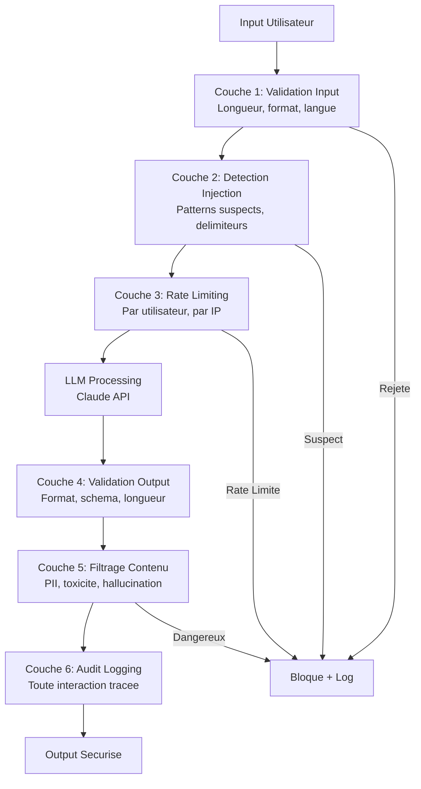

# Building AI Systems : VPS & Production

Les systemes IA autonomes ont besoin d'une infrastructure qui tourne 24/7. Ce module couvre l'architecture complete des systemes IA en production : de l'API Claude au deploiement VPS, en passant par le RAG, les agents, l'evaluation, le monitoring et le scaling.

> **Promesse** : En 12 semaines, tu sais architecturer, construire et deployer un systeme IA en production — d'un simple chatbot a une plateforme multi-agents avec RAG, evaluation et monitoring.

> **Credibilite** : Construit par le fondateur qui a architecture Agentik OS : 267 agents autonomes, 190+ skills, servant de vrais clients en production.

---

## Architecture de la formation — 4 Phases



---

## Objectif du module

A l'issue de ce module, vous saurez :

- Architecturer un systeme IA complet avec ses 4 composants fondamentaux
- Maitriser l'API Claude (messages, streaming, tool use, vision, caching, batch)
- Construire des applications de chat production-grade avec streaming et persistance
- Creer des agents IA autonomes capables de planifier, executer et s'auto-corriger
- Implementer des systemes RAG complets (ingestion, chunking, retrieval, generation)
- Orchestrer des systemes multi-agents avec communication et coordination
- Evaluer et tester la qualite des outputs IA de maniere systematique
- Deployer sur VPS avec SSH, Docker, tmux, systemd
- Monitorer, alerter et debugger les systemes IA en production
- Scaler les couts, la performance et les donnees

---

# ═══════════════════════════════════════════════
# PHASE 1 — FONDATIONS
# "Je comprends le design des systemes IA"
# Semaines 1-3 | 10-14 heures
# ═══════════════════════════════════════════════

## Lecon 1 — Architecture des systemes IA : vue d'ensemble et decisions de design

### Objectifs d'apprentissage

- Distinguer un systeme IA d'un logiciel traditionnel
- Identifier les 4 composants de tout systeme IA
- Evaluer les trade-offs architecturaux pour un projet donne
- Reconnaitre les anti-patterns courants

### Les 4 composants de tout systeme IA



1. **Modele** — Quel LLM ? Quelle taille ? Quel cout ?
2. **Donnees** — D'ou vient le contexte ? Comment est-il structure ?
3. **Orchestration** — Qui decide quoi faire ? Comment les agents communiquent ?
4. **Interface** — Comment l'utilisateur interagit ? API ? Chat ? Telegram ?

### Systeme IA vs logiciel traditionnel

- Logiciel traditionnel : input deterministe → output deterministe
- Systeme IA : input probabiliste → output probabiliste → boucle de feedback
- Les systemes IA sont plus complexes : non-determinisme, difficulte d'evaluation, gestion des couts, latence
- Les systemes IA valent le coup : ils gerent l'ambiguite, scalent le travail cognitif, et s'ameliorent avec le temps

### Types de systemes par complexite

| Type | Complexite | Exemple | Cout/mois | Quand l'utiliser |
|------|-----------|---------|-----------|------------------|
| Single-prompt | Faible | Chatbot FAQ | $10-50 | Une question → une reponse |
| Pipeline | Moyenne | Blog automatise | $50-200 | Traitement sequentiel multi-etapes |
| RAG (Retrieval-Augmented) | Moyenne-Haute | Assistant base de connaissances | $100-300 | Repondre a partir de donnees specifiques |
| Agent autonome | Haute | Code reviewer | $200-500 | Prise de decision autonome |
| Multi-agents | Tres haute | Agentik OS (267 agents) | $500-2000 | Workflows orchestres complexes |
| Systeme autonome | Extreme | Moteur de contenu auto-pilot | $1000+ | Fonctionnement 24/7 sans intervention |

### Framework de decision architecturale

Questions a se poser avant de commencer :

- Le systeme tourne-t-il 24/7 ou a la demande ?
- Combien d'utilisateurs simultanes ?
- Quelle latence acceptable ? (<1s ? <10s ? <1min ?)
- Quel budget mensuel maximum ?
- Quelles donnees sensibles sont manipulees ?
- Commencer simple, ajouter de la complexite seulement quand c'est necessaire
- Le test "est-ce que j'ai vraiment besoin d'IA pour ca ?" (parfois un regex suffit)

### Anti-patterns courants

- **Over-engineering** : construire un systeme multi-agents quand un seul prompt suffit
- **Sous-evaluation** : livrer sans mesurer la qualite
- **Ignorer les couts** : cramer les credits API sans conscience budgetaire
- **Pas de fallbacks** : le systeme plante completement quand le modele est down
- **Prompt spaghetti** : des system prompts de 10 000 mots que personne ne peut maintenir

### Exercice pratique

Dessinez l'architecture de votre prochain systeme IA. Identifiez les 4 composants, les decisions de design, les 3 principaux trade-offs, et estimez le cout mensuel.

---

## Lecon 2 — Fondamentaux LLM pour les builders de systemes

### Objectifs d'apprentissage

- Comprendre le fonctionnement des LLM au niveau necessaire pour le system design
- Connaitre le paysage des modeles en 2026
- Maitriser la strategie multi-modeles et l'economie des tokens

### Comment les LLM fonctionnent (modele mental de l'ingenieur)

- **Prediction de tokens** : etant donne une sequence, predire le prochain token
- **Context window** : la "memoire de travail" (combien le modele peut voir d'un coup)
- **Temperature** : le curseur d'aleatoire (0 = deterministe, 1 = creatif)
- **Top-p / Top-k** : controler la distribution de probabilite
- Pourquoi c'est important pour le system design : reproductibilite, caching, cout

### Le paysage des modeles en 2026

| Modele | Fournisseur | Contexte | Ideal pour | Cout API |
|--------|-------------|----------|------------|----------|
| Claude Opus 4.6 | Anthropic | 200K (1M dispo) | Raisonnement complexe, code, analyse | $$$ |
| Claude Sonnet 4.6 | Anthropic | 200K | Dev quotidien, taches equilibrees | $$ |
| Claude Haiku 4.5 | Anthropic | 200K | Taches rapides, classification | $ |
| GPT-4.1 | OpenAI | 1M | Usage general, ecosysteme large | $$ |
| o3 / o4-mini | OpenAI | 200K | Raisonnement, maths, logique | $$$ / $ |
| Gemini 3 Pro | Google | 2M | Contexte ultra-long, multimodal | $$ |
| Gemini 3 Flash | Google | 1M | Rapide, pas cher, bonne qualite | $ |
| Llama 4 | Meta | 128K | Self-hosted, vie privee | Gratuit (compute) |
| Mistral Large | Mistral | 128K | Conformite EU, self-hosted | $$ / Gratuit |
| DeepSeek R2 | DeepSeek | 128K | Raisonnement, open-source | $ |

### Strategie multi-modeles

- Pourquoi utiliser plusieurs modeles : optimisation des couts, matching des capacites, fallbacks
- **Pattern de routage** : taches simples → modele pas cher, complexes → modele premium
- **Chaines de fallback** : si le modele A echoue, essaie le modele B
- **Pattern de consensus** : demande a 3 modeles, prends la reponse majoritaire
- **Suivi des couts** : mesurer et optimiser les depenses par type de tache

### Economie des tokens

- Input tokens vs output tokens (prix differents)
- **Prompt caching** : reutiliser le prefixe, economiser 90% sur les appels repetes
- **Batch API** : 50% moins cher pour les taches non urgentes
- Gestion du context window : contexte plus petit = moins cher + plus rapide
- La formule de cout : `tokens x prix_par_token x requetes_par_jour x 30`

### Capacites et limites des modeles

- Ce que les modeles font BIEN : generation de texte, analyse, classification, code, traduction, resume
- Ce que les modeles font MAL : maths (utilise des outils), donnees temps reel (utilise la recherche), comptage, matching exact de chaines
- **Tool use** : etendre les capacites du modele avec des fonctions
- **Structured outputs** : forcer la conformite JSON/schema
- **Vision** : comprehension d'images (Claude, GPT-4o, Gemini)

### Exercice pratique

Pour le systeme que vous avez designe a la Lecon 1, choisissez le(s) modele(s) optimal(aux). Calculez le cout mensuel estime a l'echelle attendue.

---

## Lecon 3 — L'API Claude et le SDK Anthropic en profondeur

### Objectifs d'apprentissage

- Maitriser l'API Messages (creation, streaming, parametres)
- Implementer le tool use (function calling) avec validation
- Utiliser les structured outputs, la vision et le prompt caching
- Comprendre le Batch API et l'extended thinking

### Setup du SDK et authentification

```typescript
import Anthropic from "@anthropic-ai/sdk";

const client = new Anthropic({
  apiKey: process.env.ANTHROPIC_API_KEY,
});
```

- SDK TypeScript : `@anthropic-ai/sdk`
- SDK Python : `anthropic`
- Authentification : cles API depuis console.anthropic.com
- Gestion des variables d'environnement

### L'API Messages — Interaction principale

```typescript
const response = await client.messages.create({
  model: "claude-sonnet-4-6-20250514",
  max_tokens: 4096,
  system: "You are a helpful assistant.",
  messages: [
    { role: "user", content: "Explain quantum computing in 3 sentences." }
  ],
});
```

Parametres cles :
- **system** : instructions persistantes (l'ADN de votre systeme)
- **messages** : historique de conversation
- **max_tokens** : controler la longueur de la reponse
- **stop_sequences** : conditions d'arret personnalisees
- **temperature** : controle de la creativite (0 = deterministe, 1 = creatif)
- Parsing de la reponse : content blocks, stop_reason, usage

### Reponses en streaming

```typescript
const stream = client.messages.stream({
  model: "claude-sonnet-4-6-20250514",
  max_tokens: 4096,
  messages: [{ role: "user", content: "Write a story." }],
});

for await (const event of stream) {
  if (event.type === "content_block_delta") {
    process.stdout.write(event.delta.text);
  }
}
```

- Pourquoi streamer : meilleure UX (l'utilisateur voit la reponse se construire)
- Server-Sent Events (SSE) pour les web apps
- Streaming token par token vs par chunks
- Gestion des erreurs dans les streams

### Tool use (function calling)

```typescript
const tools = [
  {
    name: "get_weather",
    description: "Get current weather for a location",
    input_schema: {
      type: "object" as const,
      properties: {
        location: { type: "string", description: "City name" },
      },
      required: ["location"],
    },
  },
];

const response = await client.messages.create({
  model: "claude-sonnet-4-6-20250514",
  max_tokens: 1024,
  tools,
  messages: [{ role: "user", content: "What's the weather in Paris?" }],
});
```

La boucle de tool use : requete → tool_use → executer → tool_result → continuer. Claude peut appeler plusieurs tools en meme temps (appels paralleles).

Bonnes pratiques : descriptions claires, valeurs par defaut sensees, validation des inputs, gestion des erreurs quand un tool echoue.

### Structured outputs

- Forcer Claude a retourner du JSON valide
- Application de schema pour un parsing fiable
- Contraintes enum pour les taches de classification
- Objets imbriques pour les structures de donnees complexes
- Validation : toujours valider meme avec l'application de schema

### Vision (comprehension d'images)

```typescript
const response = await client.messages.create({
  model: "claude-sonnet-4-6-20250514",
  max_tokens: 1024,
  messages: [{
    role: "user",
    content: [
      { type: "image", source: { type: "base64", media_type: "image/png", data: base64Image } },
      { type: "text", text: "Describe this image in detail." },
    ],
  }],
});
```

Formats supportes : PNG, JPEG, GIF, WebP. Cas d'usage : analyse de documents, comprehension de screenshots, lecture de graphiques.

### Prompt caching — L'optimisation #1

Si votre system prompt fait 5000 tokens et que vous envoyez 100 requetes/heure, le cache economise 495,000 tokens/heure (99% de reduction sur les prefixes).

```json
{
  "system": [
    { "type": "text", "text": "...", "cache_control": { "type": "ephemeral" } }
  ]
}
```

- Cacher les longs system prompts ou documents de reference
- Economiser jusqu'a 90% sur les appels repetes avec le meme prefixe
- Quand l'utiliser : systemes RAG, agents avec de longues instructions, traitement par lots

### Batch API

- Traiter des milliers de requetes a 50% de reduction
- Asynchrone : soumettre le batch, poll pour les resultats
- Cas d'usage : generation de contenu a l'echelle, traitement de donnees, evaluation

### Extended thinking

- Laisser Claude "reflechir" avant de repondre (chain-of-thought)
- Meilleur pour le raisonnement complexe, les maths, les problemes multi-etapes
- Budget de tokens pour la reflexion vs la reponse

### Vercel AI SDK — Integration React optimisee

Le Vercel AI SDK fournit une couche d'abstraction unifiee pour integrer les LLM dans les applications Next.js. Il gere le streaming, les structured outputs, et le multi-provider de maniere transparente.

**Fonctions principales :**

| Fonction | Utilisation | Streaming |
|----------|------------|-----------|
| `streamText` | Chat, generation longue | Oui |
| `generateText` | Generation complete, batch | Non |
| `generateObject` | JSON type avec schema Zod | Non |
| `streamObject` | JSON en streaming progressif | Oui |

**Cote serveur (Route API) :**

```typescript
import { streamText } from "ai";
import { anthropic } from "@ai-sdk/anthropic";

export async function POST(req: Request) {
  const { messages } = await req.json();
  const result = streamText({
    model: anthropic("claude-sonnet-4-6-20250514"),
    system: "Tu es un assistant utile.",
    messages,
    tools: {
      searchWeb: {
        description: "Recherche sur le web",
        parameters: z.object({ query: z.string() }),
        execute: async ({ query }) => { /* ... */ },
      },
    },
  });
  return result.toDataStreamResponse();
}
```

**Cote client (Hook React) :**

```typescript
"use client";
import { useChat } from "@ai-sdk/react";

export function Chat() {
  const { messages, input, handleInputChange, handleSubmit, isLoading } = useChat({
    api: "/api/chat",
  });
  // Rendre l'UI du chat avec streaming automatique
}
```

**Structured outputs avec schema Zod :**

```typescript
import { generateObject } from "ai";
import { z } from "zod";

const { object } = await generateObject({
  model: anthropic("claude-sonnet-4-6-20250514"),
  schema: z.object({
    sentiment: z.enum(["positive", "negative", "neutral"]),
    confidence: z.number().min(0).max(1),
    summary: z.string(),
  }),
  prompt: "Analyse ce retour client: ...",
});
```

**Setup multi-provider :**

Le Vercel AI SDK permet de changer de fournisseur en une ligne :
- Claude pour le raisonnement complexe
- GPT pour les embeddings
- Gemini pour la vision et le contexte ultra-long
- Fallbacks automatiques si un provider est down

### Exercice pratique

Construisez une classe wrapper API complete avec : messages basiques, streaming, tool use (3 tools), structured outputs, vision, et gestion des erreurs. Mesurez le cout avant/apres le cache. Reconstruisez ensuite l'interface avec le Vercel AI SDK et comparez la complexite du code.

---

## Lecon 4 — System Prompts & Prompt Engineering a l'echelle

### Objectifs d'apprentissage

- Structurer un system prompt production-grade
- Maitriser les techniques de prompt engineering pour les systemes
- Gerer la complexite des prompts a l'echelle
- Tester et evaluer les prompts systematiquement

### Architecture des system prompts

Le system prompt est l'"ADN" de votre systeme IA. Structure recommandee :

```
# Role & Identite
Tu es [ROLE]. Tu travailles pour [ENTREPRISE].

# Instructions Principales
Quand un utilisateur te demande de [TACHE] :
1. D'abord, [Etape 1]
2. Ensuite, [Etape 2]
3. Enfin, [Etape 3]

# Format de Sortie
Reponds toujours dans ce format :
- [CHAMP 1] : [description]
- [CHAMP 2] : [description]

# Contraintes
- JAMAIS [chose a eviter]
- TOUJOURS [chose a toujours faire]
- En cas de doute, [comportement par defaut]

# Exemples
Utilisateur : [exemple d'input]
Assistant : [exemple d'output]
```

Trade-off longueur vs performance : plus court = plus rapide + moins cher, plus long = plus de controle. Versioning : traiter les system prompts comme du code (Git, changelogs, tests).

### Techniques de prompt engineering pour les systemes

| Technique | Ce que ca fait | Quand l'utiliser |
|-----------|---------------|------------------|
| **Few-shot** | Fournir 2-5 exemples | Classification, formatage |
| **Chain-of-thought** | "Reflechis etape par etape" | Raisonnement complexe |
| **Role assignment** | "Tu es un expert en..." | Taches specifiques a un domaine |
| **Constraint anchoring** | "JAMAIS X, TOUJOURS Y" | Securite, coherence |
| **Output templating** | "Reponds dans ce format JSON" | Structured outputs |
| **Self-verification** | "Verifie ta reponse avant de repondre" | Taches critiques en precision |
| **Decomposition** | "Decompose en sous-taches" | Problemes complexes multi-etapes |

### Gerer la complexite des prompts

- **Prompts modulaires** : decouper en sections reutilisables
- **Sections conditionnelles** : inclure/exclure selon le contexte
- **Prompts dynamiques** : injecter le contexte pertinent au runtime
- **Registre de prompts** : stockage centralise pour tous les prompts
- **A/B testing** : comparer les versions de prompts avec des metriques

### Echecs courants et corrections

- Le modele ignore les instructions → Placer les instructions critiques au debut ET a la fin
- Format de sortie inconsistant → Ajouter des exemples de format stricts + validation
- Hallucination → Ajouter "utilise uniquement les informations du contexte fourni"
- Trop verbeux → Ajouter "sois concis, maximum 3 phrases"
- Mauvais ton → Ajouter des exemples du ton souhaite
- Refuse des requetes valides → Ajuster les contraintes, ajouter des permissions explicites

### Test et evaluation des prompts

- Creer une suite de tests pour chaque system prompt (10-50 cas de test)
- Evaluation automatisee : executer les tests a chaque changement de prompt
- Tests de regression : s'assurer que les changements ne cassent pas les fonctionnalites existantes
- Evaluation humaine : echantillonner les outputs pour une revue qualite
- Le changelog de prompts : documenter chaque changement et pourquoi

### Exercice pratique

Ecrivez un system prompt production pour un agent de support client. Incluez : role, instructions, format, contraintes, 5 exemples. Creez 20 cas de test et executez-les.

---

## Lecon 5 — Couche donnees : bases de donnees, vecteurs & connaissances

### Objectifs d'apprentissage

- Choisir le bon type de stockage pour chaque type de donnees IA
- Comprendre les bases de donnees vectorielles et les embeddings
- Construire une base de connaissances avec pipeline d'ingestion
- Implementer la memoire de conversation (court et long terme)

### Types de donnees dans les systemes IA

| Type de donnees | Stockage | Cas d'usage |
|----------------|----------|-------------|
| Donnees structurees | PostgreSQL, Convex | Donnees utilisateur, transactions, config |
| Texte non structure | Vector DB + object storage | Documents, articles, connaissances |
| Embeddings | Vector DB (Pinecone, Chroma, Weaviate) | Recherche semantique, RAG |
| Historique de conversation | Base de donnees + cache | Memoire de chat, contexte |
| Outputs du modele | Base de donnees + logging | Evaluation, debugging |
| Fichiers | Object storage (S3, R2) | PDF, images, uploads |

### Les bases de donnees vectorielles

- **Qu'est-ce que les embeddings** : convertir du texte en nombres qui capturent le sens
- **Recherche semantique** : trouver du contenu similaire par le sens, pas par mots-cles
- Options de vector DB :
  - **Pinecone** : manage, scalable, production-ready
  - **Chroma** : open-source, leger, ideal pour le prototypage
  - **Weaviate** : open-source, riche en fonctionnalites, recherche hybride
  - **Qdrant** : open-source, base sur Rust, rapide
  - **pgvector** : extension PostgreSQL (integrer dans ta DB existante)

### Modeles d'embedding

- OpenAI `text-embedding-3-small` / `text-embedding-3-large`
- Voyage AI embeddings (optimises pour le code, le juridique, etc.)
- Open-source : `nomic-embed-text`, `bge-large`
- Dimensions : 256 (rapide, petit) a 3072 (precis, grand)
- Les embeddings specifiques a la tache surpassent les generaux

### Construire une base de connaissances

- Pipeline d'ingestion : upload → chunk → embed → stocker
- Strategies de chunking : taille fixe, semantique, recursif, sensible au document
- Metadata : toujours stocker la source, la date, le type avec les embeddings
- Indexation : HNSW, IVF, flat — trade-offs entre vitesse et precision
- Mises a jour : comment garder la base de connaissances a jour

### Memoire de conversation

- **Court terme** : contexte de session courante (en memoire ou cache)
- **Long terme** : memoire persistante entre les sessions (base de donnees)
- **Fenetre glissante** : garder les N derniers messages
- **Memoire par resume** : resumer et compresser periodiquement
- **Memoire par retrieval** : chercher dans les conversations passees par pertinence

### Convex comme backend de systeme IA

- Queries reactives (mises a jour UI en temps reel)
- TypeScript-natif (type-safe de la DB a l'UI)
- Actions pour les appels API externes (inference du modele)
- Fonctions planifiees pour le traitement en arriere-plan
- Stockage de fichiers integre

### Exercice pratique

Configurez une base de donnees vectorielle (Chroma ou pgvector), creez un pipeline d'embedding pour 100 documents, et construisez une fonction de recherche semantique.

---

# ═══════════════════════════════════════════════
# PHASE 2 — ENGINEERING FONDAMENTAL
# "Je sais construire des applications alimentees par l'IA"
# Semaines 4-6 | 12-16 heures
# ═══════════════════════════════════════════════

## Lecon 6 — Construire une application de chat production-grade

### Objectifs d'apprentissage

- Architecturer une application de chat complète avec frontend et backend
- Implementer le streaming avec affichage progressif
- Ajouter le tool use, la persistance et l'authentification
- Gerer le rate limiting et les erreurs gracieusement

### Architecture du chat

```
Frontend (Next.js)
  useChat() → /api/chat → Claude API
  Streaming SSE ←

Backend (Convex)
  conversations table
  messages table
  users table (Clerk)
```

### Les 7 elements d'un chat production-grade

1. **Streaming avec affichage progressif** — L'utilisateur voit la reponse se construire token par token
2. **Persistance des conversations** (Convex/PostgreSQL) — Les conversations survivent aux sessions
3. **Authentification** (Clerk) — Isolation des donnees par utilisateur
4. **Tool use dans le chat** (actions concretes) — Le modele peut agir, pas juste parler
5. **Rate limiting** (Upstash Redis) — Protection contre les abus
6. **Gestion d'erreurs gracieuse** — L'utilisateur ne voit jamais un crash brut
7. **Interface responsive** (mobile + desktop) — Fonctionne partout

### Frontend : Interface de chat React

- Liste de messages avec affichage en streaming
- Input avec bouton d'envoi et raccourcis clavier
- Rendu Markdown pour les reponses IA
- Coloration syntaxique du code
- Etats de chargement et gestion des erreurs
- Layout responsive mobile

```typescript
"use client";
import { useChat } from "@ai-sdk/react";

export function Chat() {
  const { messages, input, handleInputChange, handleSubmit, isLoading } = useChat({
    api: "/api/chat",
  });
  // Rendre l'UI du chat...
}
```

### Backend : Routes API Next.js avec streaming

- Server-sent events pour les reponses en streaming
- Integration du Vercel AI SDK (package `ai`)
- `streamText()` pour streamer les reponses Claude
- Gestion de l'historique de conversation
- Rate limiting par utilisateur

### Ajouter le tool use au chat

- Definir les tools que le chat peut utiliser (recherche, calcul, consultation de donnees)
- Execution des tools cote serveur
- Affichage des appels de tools et resultats dans l'UI
- Conversations multi-tours avec tool use

### Persistance et authentification

- Sauvegarder les conversations dans Convex
- Charger l'historique de conversation
- Sidebar avec la liste des conversations
- Recherche dans les conversations
- Clerk pour l'authentification utilisateur
- Isolation des conversations par utilisateur
- Suivi et limites d'utilisation

### Exercice pratique

Construisez et deployez une application de chat complete avec streaming, 3 tools (recherche web, generation d'image, envoi d'email), persistance des conversations (Convex), et authentification (Clerk). Deployez sur Vercel.

---

## Lecon 7 — Construire un agent IA autonome avec tool use

### Objectifs d'apprentissage

- Comprendre l'architecture d'un agent (plan-execute-observe)
- Implementer la boucle agent avec auto-correction
- Designer des tools atomiques et composables
- Gerer la memoire de l'agent (court, moyen, long terme)

### La boucle agent (plan-execute-observe)



Le cycle fondamental :
1. **PLAN** — Analyser la tache, decomposer en etapes
2. **EXECUTE** — Appeler les outils necessaires
3. **OBSERVE** — Analyser les resultats
4. **DECIDE** — Continuer, ajuster, ou terminer
5. Retour a 1 si pas termine

### Implementation de la boucle agent

```typescript
async function agentLoop(task: string, tools: Tool[], maxSteps = 10) {
  const messages = [{ role: "user", content: task }];

  for (let step = 0; step < maxSteps; step++) {
    const response = await client.messages.create({
      model: "claude-sonnet-4-6-20250514",
      tools,
      messages,
    });

    if (response.stop_reason === "end_turn") {
      return extractFinalAnswer(response);
    }

    for (const block of response.content) {
      if (block.type === "tool_use") {
        const result = await executeTool(block.name, block.input);
        messages.push(
          { role: "assistant", content: response.content },
          { role: "user", content: [{ type: "tool_result", tool_use_id: block.id, content: result }] }
        );
      }
    }
  }
}
```

### Planification et decomposition

- Laisser l'agent decomposer les taches en sous-taches
- Prompts de planification : "Avant d'executer, decris ton plan en 3-5 etapes"
- Re-planification : "Si ton plan ne fonctionne pas, revise-le"

### Design de tools atomiques

Chaque tool doit faire UNE chose :
- `read_file(path)` — pas `read_and_parse_file(path, format)`
- `search_web(query)` — pas `search_and_summarize(query)`
- `send_email(to, subject, body)` — pas `draft_and_send_email(context)`

Pourquoi : le modele compose les tools. Si chaque tool est atomique, il peut les combiner de maniere creative.

Categories essentielles : recherche, lecture, ecriture, calcul, communication.

### Auto-correction et recuperation d'erreurs

- L'agent doit detecter ses propres erreurs
- Reessayer avec une approche differente (pas la meme chose 3 fois)
- Escalade : quand demander l'aide d'un humain
- Garde-fous : nombre maximum d'etapes, timeout, limites de cout
- Le pattern "detection de blocage" : si pas de progres en 3 etapes, changer d'approche

### Memoire de l'agent

Types de memoire :
- **Court terme** : contexte de la conversation (fenetre)
- **Moyen terme** : scratchpad (fichiers temporaires)
- **Long terme** : base de donnees vectorielle (ChromaDB, claude-mem)

Implementation : base de donnees + recherche vectorielle + injection de contexte.

### Exercice pratique

Construisez un agent avec 5 tools (recherche web, lecture/ecriture de fichiers, calculatrice, requete base de donnees) qui peut rechercher un sujet de maniere autonome et produire un rapport. L'agent doit gerer les erreurs et retry automatiquement.

---

## Lecon 8 — Systemes RAG : de l'ingestion a la generation

### Objectifs d'apprentissage

- Architecturer un pipeline RAG complet (8 etapes)
- Maitriser les strategies de chunking et leurs trade-offs
- Implementer la recherche hybride (semantique + lexicale)
- Evaluer la qualite d'un systeme RAG

### Pipeline RAG complet



Les 8 etapes du pipeline :

1. **Ingestion** : Charger les documents (PDF, Markdown, HTML, CSV, DOCX)
2. **Preprocessing** : Nettoyer, normaliser, deduplicater
3. **Chunking** : Decouper en morceaux de 500-1000 tokens
4. **Embedding** : Vectoriser chaque chunk (voyage-3, text-embedding-3-small)
5. **Stockage** : Inserer dans la vector DB avec metadata
6. **Retrieval** : Chercher les K chunks les plus pertinents
7. **Context construction** : Assembler le prompt avec les chunks
8. **Generation** : Envoyer a Claude pour la reponse

### Strategies de chunking (critique pour la qualite)

| Strategie | Comment ca marche | Ideal pour |
|-----------|------------------|------------|
| **Taille fixe** | Decouper tous les N caracteres/tokens | Simple, previsible |
| **Recursif** | Decouper par paragraphes, puis phrases | Usage general |
| **Semantique** | Decouper aux frontieres de sujet | Documents techniques |
| **Sensible au document** | Respecter headers, sections, pages | Docs structures |
| **Fenetre glissante** | Chunks qui se chevauchent | Continuite du contexte |

- Taille de chunk : 500-1000 tokens est le sweet spot
- Chevauchement : 10-20% entre les chunks preserve le contexte
- Toujours stocker les metadata du chunk : source, page, section, date

### Strategies de retrieval

| Strategie | Comment ca marche | Quand l'utiliser |
|-----------|------------------|------------------|
| **Recherche semantique** | Similarite vectorielle (cosinus) | Approche par defaut |
| **Recherche par mots-cles** | BM25, TF-IDF | Correspondances exactes, termes techniques |
| **Hybride** | Semantique + mots-cles combines | Meilleure qualite (recommande) |
| **Re-ranking** | Recuperer N, re-classer en top K | Exigences haute qualite |
| **Multi-query** | Generer plusieurs variantes de requete | Questions complexes |
| **HyDE** | Generer une reponse hypothetique, chercher avec | Quand les requetes sont vagues |

### Recherche hybride (le meilleur des 2 mondes)

Combiner la recherche semantique (vectors) et lexicale (BM25) :
- Semantique trouve les concepts similaires
- Lexicale trouve les mots exacts
- Le reranker (Cohere, cross-encoder) trie les resultats combines

### Construction du contexte

- Combien de chunks inclure (3-10 est typique)
- Ordre : le plus pertinent d'abord
- Suivi des citations : dire au LLM de citer ses sources
- Gestion du context window : ne pas deborder
- Le test "golden retrieval" : est-ce que la reponse existe dans les chunks recuperes ?

### Evaluation RAG

- Qualite du retrieval : Recall@K, Precision@K
- Qualite de la generation : est-ce que la reponse est correcte et bien sourcee ?
- Fidelite : est-ce que la reponse reste fidele au contexte recupere (pas d'hallucination) ?
- Framework RAGAS : evaluation RAG automatisee

### Patterns RAG avances

- **Chunking parent-enfant** : recuperer l'enfant, injecter le parent pour le contexte
- **Decomposition de requete** : decomposer les questions complexes en sous-requetes
- **Self-RAG** : laisser le modele decider quand recuperer
- **Corrective RAG** : verifier la qualite du retrieval, re-recuperer si necessaire
- **RAG multi-modal** : retrieval images + texte

### Exercice pratique

Construisez un systeme RAG complet pour une base de connaissances de 500+ documents. Implementez : ingestion, chunking, embedding, recherche hybride, et evaluation avec 30 questions/reponses connues. Deployez comme API.

---

## Lecon 9 — Systemes multi-agents et Claude Agent SDK

### Objectifs d'apprentissage

- Concevoir des architectures multi-agents (pipeline, fan-out, hierarchique)
- Implementer le pattern ORACLE pour l'orchestration
- Maitriser la communication inter-agents et la coordination
- Resoudre les defis de coordination (race conditions, deadlocks, couts)

### Le Claude Agent SDK

SDK officiel pour construire des agents autonomes deployables partout (Python et TypeScript) :

```
Agent SDK
  |-- Model (Claude API — choix du modele par tache)
  |-- Tools (fonctions personnalisees exposees a l'agent)
  |-- Orchestration (boucle plan-execute-observe)
  |-- Memory (historique, etat persistant, scratchpad)
  +-- Deployment (serveur HTTP, serverless, background worker)
```

**Construire un agent avec le SDK :**
1. Definir l'agent : modele, tools, system prompt, contraintes
2. Implementer les tools comme des fonctions avec schemas d'input/output
3. Configurer la boucle de conversation : utilisateur → agent → tool → resultat → agent → reponse
4. Gestion de la memoire : quoi garder entre les sessions, quoi oublier
5. Deployer : API HTTP pour un acces synchrone, background worker pour l'autonomie

**Communication agent-a-agent :**
- Passage de messages entre agents via messagerie directe
- Etat partage dans un store commun (base de donnees, fichiers)
- Le pattern orchestrateur : un agent "manager" coordonne les agents "workers"
- Event-driven : les agents reagissent aux evenements emis par d'autres agents

### Patterns d'architecture multi-agents

| Pattern | Comment ca marche | Quand l'utiliser |
|---------|------------------|------------------|
| **Pipeline** | Agent A → Agent B → Agent C | Traitement sequentiel |
| **Fan-out** | Orchestrateur → N agents paralleles | Sous-taches independantes |
| **Hierarchique** | Manager → Leads → Specialistes | Organisations complexes |
| **Swarm** | Communication pair-a-pair | Taches exploratoires |
| **Debat** | Deux agents debattent, un troisieme decide | Decisions a enjeux eleves |

### Le pattern ORACLE en production



L'Oracle ne code jamais. Il decompose, dispatche, verifie. Chaque worker est specialise et autonome.

Le flux ORACLE en detail :
1. **Reception** : une tache arrive (utilisateur, cron, webhook, autre agent)
2. **Classification** : evaluer la complexite (SIMPLE → EPIC)
3. **Decomposition** : decouper en sous-taches atomiques
4. **Dispatch** : envoyer chaque sous-tache au bon specialiste avec un contexte frais
5. **Surveillance** : monitorer la progression, detecter les blocages
6. **Synthese** : agreger les resultats, verifier la coherence
7. **Livraison** : retourner le resultat final au demandeur

Principes du pattern ORACLE :
- **Classification** : SIMPLE → MEDIUM → COMPLEX → EPIC
- **Routage** : associer les taches au meilleur agent specialiste
- **Contexte frais** : chaque agent recoit exactement le contexte dont il a besoin
- **Detection de blocage** : si un agent boucle, changer d'approche
- **Journal des decisions** : tracer toutes les decisions de routage pour le debugging

### Designer des agents specialistes

- Un agent = une responsabilite (Principe de Responsabilite Unique)
- Contrats d'input/output clairs
- Ensembles de tools definis (chaque agent ne voit que les tools pertinents)
- Metriques de performance par agent
- Exemple : Agentik OS a 267 specialistes repartis en 6 departements

### Communication entre agents

- **Messagerie directe** : un agent envoie a un autre
- **Etat partage** : les agents lisent/ecrivent dans un store commun
- **Event-driven** : les agents reagissent aux evenements d'autres agents
- **Blackboard** : espace de travail partage ou les agents contribuent

### Deployer des agents comme des services

- API HTTP : l'agent comme endpoint REST
- WebSocket : interaction agent en temps reel
- Background worker : l'agent tourne de maniere autonome
- Declenchement cron : l'agent tourne sur un planning
- Serverless : l'agent scale a zero quand il est inactif

### Defis de coordination

- **Race conditions** : deux agents modifiant la meme ressource → locks
- **Deadlocks** : agents en attente les uns des autres → timeouts
- **Explosion des couts** : agents qui s'emballent → budgets
- **Controle qualite** : s'assurer que les outputs respectent les standards → agents gardiens

### Exercice pratique

Implementez un systeme multi-agents avec 3 agents : un chercheur, un redacteur, et un editeur. Le systeme produit un article de blog optimise SEO de bout en bout. L'orchestrateur assigne les taches, les agents travaillent en parallele quand c'est possible.

---

# ═══════════════════════════════════════════════
# PHASE 3 — PATTERNS AVANCES
# "Je maitrise les architectures IA complexes"
# Semaines 7-9 | 12-16 heures
# ═══════════════════════════════════════════════

## Lecon 10 — Evaluation, testing et garde-fous

### Objectifs d'apprentissage

- Comprendre pourquoi l'evaluation est la partie la plus difficile des systemes IA
- Construire une suite d'eval complete (automatisee + LLM-as-judge + humaine)
- Implementer des garde-fous en entree et en sortie
- Se defendre contre le prompt injection

### Pourquoi l'evaluation est critique

- Les outputs IA sont non-deterministes — meme input, output different
- "Ca a l'air bien" n'est pas une metrique
- Sans eval, tu livres a l'aveugle
- Developpement guide par l'eval : ecrire les evals D'ABORD, ensuite ameliorer

### Types d'evaluation

| Type | Ce que ca mesure | Comment |
|------|-----------------|---------|
| **Evals automatisees** | Exactitude, format, factualite | Checks bases sur le code |
| **LLM-as-judge** | Qualite, pertinence, utilite | Utiliser Claude pour evaluer Claude |
| **Evaluation humaine** | Nuance, preference, cas limites | Revue manuelle |
| **A/B testing** | Preference utilisateur a l'echelle | Comparer deux versions en live |
| **Tests de regression** | Est-ce que les changements ont casse quelque chose ? | Executer la suite d'eval a chaque changement |

### Construire une suite d'eval

- **Cas de test** : 50-200 paires input/output-attendu
- **Checks automatises** : validation de format, presence de mots-cles, limites de longueur
- **LLM-as-judge** : une instance Claude separee note la qualite de 1 a 5
- **Reponses de reference** : reponses ecrites par des humains pour la comparaison
- **Cas limites** : inputs deliberement pieges pour tester la robustesse

### Metriques d'evaluation

| Metrique | Ce que ca mesure | Formule |
|----------|-----------------|---------|
| **Accuracy** | Reponses correctes / total | correct / total |
| **Fidelite** | Reste fidele au contexte | fidele / total (LLM judge) |
| **Pertinence** | La reponse repond a la question | pertinent / total (LLM judge) |
| **Toxicite** | Contenu nocif | toxique / total (classifieur) |
| **Latence** | Temps de reponse | p50, p95, p99 |
| **Cout** | Depense par requete | total_tokens x prix |

### Evaluation continue

- Executer les evals a chaque changement de prompt et de modele
- Dashboard : suivre les metriques dans le temps
- Alertes : notifier quand la qualite baisse
- Prevention de regression : bloquer les deploiements qui reduisent la qualite
- Frameworks : Braintrust, LangSmith, Promptfoo, RAGAS

### Garde-fous en entree

- **Moderation de contenu** : detecter et bloquer les inputs nocifs
- **Detection d'injection** : prevenir les attaques par prompt injection
- **Rate limiting** : limites par utilisateur, par IP
- **Validation d'input** : limites de longueur, verification de format, detection de langue
- **Detection de PII** : identifier et gerer les informations personnelles

### Garde-fous en sortie

- **Filtrage de contenu** : detecter les outputs nocifs, biaises ou inappropries
- **Detection d'hallucination** : verifier les affirmations contre les faits connus
- **Validation de format** : s'assurer que l'output correspond au schema attendu
- **Score de confiance** : signaler les reponses a faible confiance pour revue humaine
- **Circuit breaker** : si le taux d'erreur depasse un seuil, couper l'acces

### Defense contre le prompt injection

- Qu'est-ce que le prompt injection : un input utilisateur qui ecrase les instructions systeme
- Types : direct ("ignore les instructions precedentes"), indirect (injecte via le contenu recupere)
- Defenses :
  - Assainissement des inputs : supprimer les patterns suspects
  - Isolation par delimiteurs : separer clairement le contenu systeme/utilisateur
  - Validation de l'output : verifier que l'output correspond aux attentes
  - Modeles separes : utiliser un modele pour verifier l'output d'un autre
  - Constitutional AI : le modele s'auto-evalue selon des principes

### Patterns human-in-the-loop

- Seuils de confiance : repondre automatiquement au-dessus de 0.8, escalader en-dessous
- Files d'attente de revue : les humains revoient les outputs signales avant l'envoi
- Boucles de feedback : les corrections utilisateur ameliorent les futures reponses
- Workflows d'approbation : un humain approuve avant que l'IA execute des actions

### Exercice pratique

Construisez un systeme d'evaluation pour votre agent. Creez 50 cas de test avec reponses attendues. Automatisez l'execution et le scoring. Implementez des garde-fous en entree et en sortie. Testez avec 20 inputs adversariaux.

---

## Lecon 11 — Optimisation des couts, caching et performance

### Objectifs d'apprentissage

- Implementer le prompt caching pour economiser 80-90%
- Maitriser le routage de modeles et le batch processing
- Optimiser la latence (streaming, edge, pre-calcul)
- Monitorer les couts en production avec alerting

### Strategies de prompt caching

- Le `cache_control` de Claude : cacher le prefixe statique du system prompt
- Economies sur cache hit : 90% sur les portions cachees
- Quoi cacher : system prompts, documents de reference, definitions de tools
- Quoi NE PAS cacher : input utilisateur dynamique, historique de conversation
- Gestion des TTL : combien de temps les caches vivent

### Techniques d'optimisation des couts

| Technique | Economies | Effort |
|-----------|----------|--------|
| Utiliser des modeles moins chers pour les taches simples | 60-80% | Faible |
| Prompt caching | Jusqu'a 90% sur le contenu cache | Faible |
| Batch API pour les taches non urgentes | 50% | Faible |
| Reduire la taille du contexte | 30-50% | Moyen |
| Pre-filtrer avec un classifieur pas cher | 40-60% | Moyen |
| Cacher les reponses courantes (Redis) | 30-50% | Moyen |
| Rate limiting intelligent | 20-40% | Faible |

### Optimisation de la latence

- **Streaming** : latence percue = temps jusqu'au premier token
- **Selection du modele** : Haiku < Sonnet < Opus en latence
- **Requetes paralleles** : fan out vers plusieurs modeles simultanement
- **Deploiement edge** : plus proche des utilisateurs = plus rapide
- **Pre-calcul** : generer les reponses courantes a l'avance

### Rate limiting et throttling

- Limites de taux API par fournisseur
- Mise en file d'attente cote client
- Retry avec exponential backoff
- Circuit breaker : arreter d'appeler une API defaillante
- Degradation gracieuse : reponses de fallback quand rate limite

### Monitoring des couts en production

- Suivre les tokens par requete, par utilisateur, par fonctionnalite
- Dashboards de couts quotidiens/hebdomadaires/mensuels
- Alertes de budget (Telegram, email)
- Limites de cout par utilisateur
- Le probleme d'attribution des couts : quelle fonctionnalite coute le plus ?

### Exercice pratique

Implementez le prompt caching et le monitoring des couts pour les systemes construits dans les lecons precedentes. Configurez des alertes Telegram quand les depenses quotidiennes depassent les seuils.

---

## Lecon 12 — Workflows, pipelines et systemes temps reel

### Objectifs d'apprentissage

- Construire des workflows IA multi-etapes complexes
- Implementer des pipelines durables avec Trigger.dev et Inngest
- Ajouter des fonctionnalites temps reel (SSE, WebSockets, Convex reactif)
- Gerer les erreurs et le monitoring dans les pipelines

### Patterns de workflow

| Pattern | Structure | Exemple |
|---------|-----------|---------|
| **Sequentiel** | Etape A → B → C | Pipeline de generation de contenu |
| **Parallele** | A + B + C → fusion | Recherche multi-sources |
| **Conditionnel** | Si X → A, sinon → B | Routage base sur l'intention |
| **Boucle** | Repeter jusqu'a condition | Raffinement iteratif |
| **Map-reduce** | Decouper → traiter chaque → combiner | Analyse de documents par lots |

### Construire avec Trigger.dev

- Execution durable : survit aux pannes, reprend la ou ca s'est arrete
- Step functions : chaque etape tourne independamment
- Retries : retry automatique avec backoff
- Queues : gerer l'execution concurrente
- Scheduling : cron jobs pour les workflows recurrents

### Construire avec Inngest

- Event-driven : workflows declenches par des evenements
- Step functions avec gestion d'erreurs integree
- Fan-out : execution d'etapes en parallele
- Sleep et wait : mettre le workflow en pause jusqu'a condition remplie
- Human-in-the-loop : attendre l'approbation humaine

### Pipeline de generation de contenu (exemple reel)

1. Selection du sujet (cron programme)
2. Recherche (Claude + recherche web)
3. Generation de plan (Claude)
4. Redaction de l'article (Claude Opus)
5. Optimisation SEO (Claude + mots-cles)
6. Generation d'image (Gemini Imagen)
7. Build & deploiement (Next.js + Vercel)
8. Distribution sociale (Composio)
9. Notification (Telegram)

### Gestion des erreurs dans les pipelines

- Politiques de retry : quelles etapes reessayer, combien de fois
- Dead letter queues : stocker les items echoues pour revue manuelle
- Compensation : annuler les etapes precedentes si une etape ulterieure echoue
- Alerting : notifier sur les echecs du pipeline
- Monitoring : suivre la sante et le debit du pipeline

### Patterns d'architecture temps reel

- **Server-Sent Events (SSE)** : streaming unidirectionnel (API → client)
- **WebSockets** : communication bidirectionnelle en temps reel
- **Subscriptions Convex** : queries reactives sur la base de donnees
- **Long-polling** : fallback pour les environnements sans support WebSocket

### Dashboards temps reel

- Queries reactives Convex : l'UI se met a jour automatiquement quand les donnees changent
- Monitoring du statut des agents : quels agents tournent, leur progression
- Metriques live : temps de reponse, taux d'erreur, couts
- Flux de notifications : alertes temps reel dans le navigateur

### Exercice pratique

Construisez un pipeline de generation de contenu complet qui tourne sur un planning, gere les erreurs gracieusement, et envoie des notifications Telegram. Ajoutez un dashboard temps reel montrant la sante du pipeline.

---

# ═══════════════════════════════════════════════
# PHASE 4 — PRODUCTION & SCALE
# "Je deploie et scale des systemes IA"
# Semaines 10-12 | 12-16 heures
# ═══════════════════════════════════════════════

## Lecon 13 — Deploiement VPS : SSH, Docker, tmux, systemd

### Objectifs d'apprentissage

- Provisionner et securiser un VPS pour les charges de travail IA
- Maitriser tmux pour les sessions persistantes
- Configurer systemd pour les services 24/7
- Utiliser Docker pour l'isolation des environnements

### Provisionnement d'un VPS

1. Choisir un fournisseur (Hetzner, OVH, DigitalOcean)
2. Commander un VPS (8 vCPU, 16GB RAM, 200GB SSD = ~$40/mois)
3. Securiser SSH (cle uniquement, port custom, fail2ban)
4. Installer les outils (Node.js, Docker, tmux, Claude Code)

### SSH — Securisation

```bash
# Generer une cle SSH (sur votre machine locale)
ssh-keygen -t ed25519 -C "votre@email.com"

# Copier la cle publique sur le serveur
ssh-copy-id -p 42820 hacker@72.61.197.216

# Durcir la config SSH (/etc/ssh/sshd_config)
Port 42820
PermitRootLogin no
PasswordAuthentication no
PubkeyAuthentication yes
```

- fail2ban pour bloquer les tentatives de brute-force
- UFW firewall pour limiter les ports ouverts

### tmux — Le multiplexeur de terminal

Pourquoi tmux est essentiel pour l'IA :
- Les agents tournent dans des sessions persistantes
- Vous pouvez avoir 10+ sessions en parallele
- Les sessions survivent aux deconnexions SSH
- Vous pouvez monitorer les agents en temps reel

```bash
# Creer une session nommee
tmux new -s oracle-main

# Detacher (Ctrl+B puis D)
# Reattacher
tmux attach -t oracle-main

# Split horizontal
Ctrl+B puis %

# Split vertical
Ctrl+B puis "
```

### systemd — Services persistants

Pour les bots et services qui doivent tourner 24/7 :

```ini
[Unit]
Description=AISB Telegram Bot
After=network.target

[Service]
User=hacker
WorkingDirectory=/home/hacker/VibeCoding/work/agentik-monitor/bot
ExecStart=/usr/bin/python3 main.py
Restart=always
RestartSec=5

[Install]
WantedBy=multi-user.target
```

```bash
# Activer et demarrer le service
sudo systemctl enable aisb-bot
sudo systemctl start aisb-bot

# Verifier le statut
sudo systemctl status aisb-bot

# Voir les logs
journalctl -u aisb-bot -f
```

### Docker pour l'isolation

- Isoler chaque service dans un conteneur
- Reproductibilite : meme environnement partout
- Scaling facile avec docker-compose
- Gestion des ressources (limites CPU, RAM)

### Architecture de deploiement



### Deploiement Vercel (pour le frontend)

- Bonnes pratiques de deploiement Next.js
- Gestion des variables d'environnement
- Edge functions pour l'inference IA a faible latence
- Preview deployments pour les tests

### CI/CD pour les systemes IA



- Workflow GitHub Actions : test → eval → build → deploy
- Executer la suite d'evaluation sur chaque PR
- Bloquer les merges qui reduisent les metriques qualite
- Rollouts par etapes : deploiements canary pour les changements de prompts
- Procedures de rollback : revenir rapidement quand ca part en vrille

### Exercice pratique

Provisionnez un VPS. Securisez SSH (cle uniquement, port custom, fail2ban). Installez Claude Code. Deployez un bot Telegram qui repond aux commandes. Configurez-le en service systemd. Verifiez qu'il survive aux redemarrages.

---

## Lecon 14 — Monitoring, observabilite et alerting

### Objectifs d'apprentissage

- Definir quoi monitorer dans un systeme IA (latence, erreurs, couts, qualite)
- Implementer le logging structure pour les systemes IA
- Construire un dashboard de monitoring temps reel
- Configurer l'alerting multi-niveaux

### Pipeline de monitoring et alerting



### Quoi monitorer dans les systemes IA

| Metrique | Seuil d'alerte | Action |
|----------|---------------|--------|
| Latence API (p95) | >10s | Verifier le modele/network |
| Taux d'erreur | >5% | Diagnostiquer les erreurs |
| Tokens/heure | >budget | Verifier les requetes |
| Score qualite | <baseline - 10% | Investiguer la degradation |
| Taux de cache hit | <50% | Optimiser le caching |
| RAM VPS | >85% | Nettoyer ou upgrader |
| Disk | >90% | Rotation des logs |
| Uptime service | <99.5% | Relancer le service |
| Taux de completion agents | <90% | Diagnostiquer les agents |

### Logging pour les systemes IA

- **Logging requete/reponse** (avec redaction de PII)
- **Logging des appels de tools** : quels tools appeles, avec quels inputs
- **Logging des decisions** : pourquoi le systeme a fait ce choix ?
- **Logging de performance** : timing pour chaque etape
- **Logging des couts** : tokens utilises par requete
- Format de logging structure : JSON avec des champs coherents

### Construire un dashboard de monitoring

- Metriques temps reel avec les queries reactives Convex
- Donnees historiques avec visualisation de series temporelles
- Integration des alertes : Telegram, Slack, PagerDuty
- Tracker de couts : depenses quotidiennes, hebdomadaires, mensuelles par fonctionnalite
- Tracker qualite : scores d'eval dans le temps

### Strategie d'alerting

- **P0 (critique)** : Service down → Telegram immediate + son
- **P1 (important)** : Taux d'erreur eleve → Telegram dans 5 min
- **P2 (info)** : Budget approchant → Email quotidien

Regles d'alerting :
- Niveaux de severite : info → warning → critique → astreinte
- Prevention de la fatigue d'alertes : ne pas alerter sur tout
- Runbook par alerte : quoi faire quand tu es page
- Chemins d'escalade : ingenieur → lead → astreinte
- Post-mortems : documenter et apprendre des incidents

### Debugger les systemes IA

- Reproduire le probleme : input exact → output exact
- Verifier le prompt : est-ce que le system prompt etait correct ?
- Verifier le contexte : est-ce que les bonnes informations ont ete recuperees ?
- Verifier le modele : est-ce que le bon modele a ete appele ?
- Verifier les tools : est-ce que les appels de tools ont retourne les resultats attendus ?
- Tracer le pipeline complet : input → chaque etape → output

### Exercice pratique

Configurez un dashboard de monitoring pour votre VPS. Implementez 3 alertes Telegram : service down, taux d'erreur eleve, espace disque faible. Creez un runbook pour chaque alerte.

---

## Lecon 15 — Scaling, securite et optimisation des couts en production

### Objectifs d'apprentissage

- Scaler horizontalement les systemes IA
- Implementer le caching a chaque niveau
- Durcir la securite (OWASP pour l'IA, protection des donnees)
- Optimiser les couts a l'echelle

### Strategies de scaling

| Defi | Solution |
|------|----------|
| Trop de requetes | Queue + workers, rate limiting, caching |
| Trop cher | Routage de modeles, caching, traitement par lots |
| Trop lent | Deploiement edge, streaming, pre-calcul |
| Trop de donnees | Ingestion par chunks, indexation incrementale |
| Trop complexe | Microservices, agents specifiques par domaine |

### Scaling horizontal

- Serveurs API stateless (scale horizontalement derriere un load balancer)
- Pools de workers pour le traitement en arriere-plan
- Connection pooling sur la base de donnees
- CDN pour les assets statiques et les reponses cachees

### Caching a chaque niveau

- **Cache de reponses** : les requetes identiques retournent des reponses cachees
- **Cache semantique** : les requetes similaires retournent des reponses cachees (similarite vectorielle)
- **Cache d'embeddings** : ne pas re-embed le meme document
- **Cache de resultats LLM** : cacher les reponses Claude pour des inputs identiques

### Scaling des couts

- Routage de modeles : utiliser le modele le moins cher qui fonctionne pour chaque tache
- Traitement par lots : accumuler les requetes, traiter en masse (50% d'economies)
- Budget de tokens par utilisateur/fonctionnalite
- Downgrade automatique sous charge (Opus → Sonnet → Haiku)

### Scaling des donnees

- Indexation incrementale : ne traiter que les documents nouveaux/modifies
- Partitionnement : decouper la vector DB par domaine/client
- Archivage : deplacer les anciennes donnees vers le stockage froid
- Nettoyage : supprimer les embeddings et metadata obsoletes

### Securite OWASP pour les systemes IA — Defense en profondeur



Les 7 vecteurs d'attaque specifiques a l'IA :

- **Injection de prompt** (la nouvelle SQL injection) — Defense en profondeur
- **Fuite de contexte** (system prompt dans la sortie) — Validation output
- **Exfiltration de donnees** (le modele envoie des PII) — Filtrage sortie
- **Abus de tool use** (le modele execute des commandes dangereuses) — Sandboxing
- **Empoisonnement des donnees** (documents malveillants dans le RAG) — Validation ingestion
- **Deni de portefeuille** (provoquer des appels API couteux) — Rate limiting + budgets
- **Extraction de modele** (voler ton system prompt) — Obfuscation + monitoring

### Protection des donnees

- Gestion des PII : detecter, masquer ou rejeter les informations personnelles
- Politiques de retention des donnees : combien de temps garder les logs de conversation
- Chiffrement : au repos et en transit
- Controle d'acces : qui peut voir quelles donnees
- Conformite : considerations RGPD, CCPA, HIPAA

### Optimisation des couts — Tableau recapitulatif

| Technique | Reduction | Effort |
|-----------|----------|--------|
| Prompt caching | 80-90% | Faible |
| Batch API | 50% | Moyen |
| Routage de modeles (Haiku/Sonnet/Opus) | 70% | Moyen |
| Caching des reponses (Redis) | 30-50% | Moyen |
| Rate limiting intelligent | 20-40% | Faible |

### Exercice pratique

Optimisez les couts de votre systeme IA. Implementez prompt caching, routage de modeles, et caching Redis. Mesurez la reduction de cout sur 7 jours. Implementez les 5 defenses OWASP pour l'IA.

---

## Lecon 16 — Fine-tuning & modeles personnalises (quand c'est necessaire)

### Objectifs d'apprentissage

- Savoir quand fine-tuner vs quand utiliser le prompting/RAG
- Comprendre le processus de fine-tuning (donnees, entrainement, evaluation)
- Connaitre les options open-source (LoRA, QLoRA, Unsloth)

### Fine-tuning vs prompting vs RAG

| Approche | Ideal pour | Cout | Effort | Flexibilite |
|----------|-----------|------|--------|-------------|
| **Prompting** | La plupart des taches | Faible | Faible | Haute |
| **RAG** | Taches specifiques aux connaissances | Moyen | Moyen | Haute |
| **Fine-tuning** | Style/format/domaine | Eleve | Eleve | Faible |

### Quand fine-tuner

- Format de sortie coherent que le prompting ne peut pas atteindre
- Langage specifique a un domaine (medical, juridique, technique)
- Reduire la latence (modele fine-tune plus petit vs modele general plus gros)
- Optimisation des couts a echelle massive
- **Quand NE PAS** : si prompting + RAG peut resoudre le probleme, ne fine-tune pas

### Processus de fine-tuning

1. **Preparation des donnees** : paires input/output (minimum 100, idealement 1000+)
2. **Format** : JSONL avec tableau de messages
3. **Entrainement** : utiliser l'API de fine-tuning du fournisseur (OpenAI, Together AI)
4. **Evaluation** : comparer le modele fine-tune vs le modele de base sur la suite d'eval
5. **Iteration** : ajuster les donnees, re-entrainer, re-evaluer

### Fine-tuning de modeles open-source

- **LoRA/QLoRA** : fine-tuning efficace (entraine de petits adaptateurs, pas le modele complet)
- **Unsloth** : fine-tuning 2x plus rapide avec 60% de memoire en moins
- **Hugging Face** : hub de modeles, infrastructure d'entrainement
- **Together AI / Modal** : fine-tuning cloud
- **Deploiement** : vLLM, Ollama, ou inference cloud

### Exercice pratique

Creez un dataset de 200 paires input/output pour un cas d'usage specifique. Evaluez d'abord avec du prompting + RAG. Si les resultats sont insuffisants, fine-tunez un modele open-source avec LoRA. Comparez les metriques.

---

## Lecon 17 — Projet final : construire & deployer un systeme IA complet

### Objectifs d'apprentissage

- Integrer toutes les competences acquises dans un projet de bout en bout
- Deployer un systeme production-grade qui tourne 7 jours sans intervention
- Documenter l'architecture, les decisions et le runbook

### Exigences du projet

1. **Document d'architecture** : diagramme systeme, choix de modeles, flux de donnees, estimation des couts
2. **Application principale** : Next.js + Convex + Clerk avec fonctionnalites alimentees par l'IA
3. **Systeme RAG** : base de connaissances de 200+ documents, recherche semantique, evaluation qualite
4. **Systeme d'agents** : au moins 3 agents avec tool use, planification et auto-correction
5. **Suite d'evaluation** : 50+ cas de test, evals automatisees, dashboard qualite
6. **Deploiement production** : Vercel + VPS pour les background workers
7. **Monitoring** : latence, erreurs, couts, qualite — avec alerting Telegram
8. **Securite** : garde-fous entree/sortie, auth, rate limiting
9. **Documentation** : decisions d'architecture, docs API, runbook
10. **Video de demo** : walkthrough de 5 minutes du systeme en action

### Criteres d'evaluation

- Le systeme tourne de maniere fiable pendant 7 jours sans intervention manuelle
- Les scores d'evaluation atteignent les seuils de qualite definis
- Les couts sont suivis et dans le budget
- Le monitoring detecte les pannes simulees
- La securite resiste a 10 cas de test adversariaux
- Le code est propre, documente et maintenable

---

## Resume de la formation

| Phase | Semaines | Lecons | Heures | Focus |
|-------|----------|--------|--------|-------|
| Fondations | 1-3 | 1-5 | 10-14h | Architecture, LLM, API, prompts, donnees |
| Engineering Fondamental | 4-6 | 6-9 | 12-16h | Apps chat, agents, RAG, multi-agents |
| Patterns Avances | 7-9 | 10-12 | 12-16h | Evaluation, optimisation, workflows, temps reel |
| Production & Scale | 10-12 | 13-17 | 12-16h | VPS, monitoring, scaling, securite, projet final |
| **TOTAL** | **12** | **17** | **46-62h** | **Builder de systemes IA production-grade** |

---

## Points cles a retenir

- **Commencer simple** : un seul prompt avant un agent, un agent avant un systeme multi-agents
- **Evaluer tot, evaluer souvent** : sans metriques, vous livrez a l'aveugle
- **Le prompt caching est votre meilleur ami** : 80-90% d'economies pour un effort minimal
- **Les agents doivent etre atomiques** : une responsabilite, des tools clairs, des contrats d'I/O
- **Le monitoring n'est pas optionnel** : si vous ne mesurez pas, vous ne savez pas
- **La securite est une couche, pas un ajout** : defense en profondeur des le debut
- **Le VPS est le socle des systemes 24/7** : tmux + systemd + monitoring = infrastructure fiable

---

## Ce que cette formation apporte

- Infrastructure production-ready pour charges de travail IA
- Competences en deploiement, securisation et administration systeme
- Patterns d'orchestration de processus IA en continu
- Monitoring et observabilite des systemes autonomes
- Template d'infrastructure reproductible base sur Agentik OS
- Maitrise de bout en bout : de l'architecture a la production

---

## Bonus & Ressources

- Template de demarrage complet : Next.js + Convex + Clerk + Claude API + RAG + Agent
- Templates de decisions d'architecture
- Template de suite d'eval (50 cas de test + scripts d'automatisation)
- Template de dashboard de monitoring (Next.js + Convex)
- Tableur de calcul des couts
- Checklist securite (50 items)
- Communaute Telegram pour les builders de systemes IA
- Sessions mensuelles de revue d'architecture
- Acces a vie et mises a jour

> **Upsell** : Tu veux qu'on construise ton systeme IA ? Agentik {OS} propose des services AI Build ($15K-45K) pour les systemes IA production personnalises, et des CAIO Partnerships ($4K-15K/mois) pour un leadership IA continu. agentik-os.com/pricing
