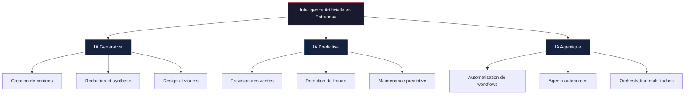
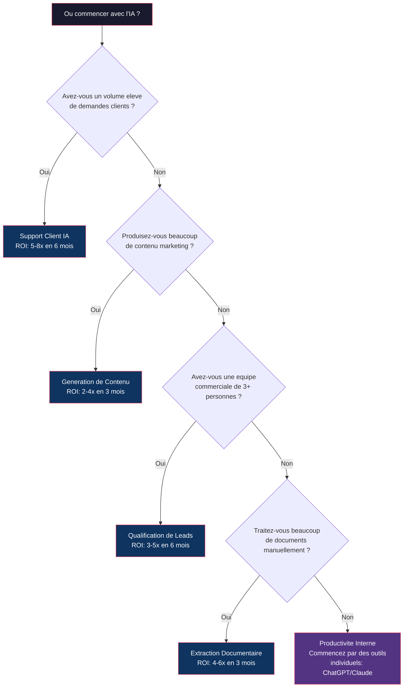
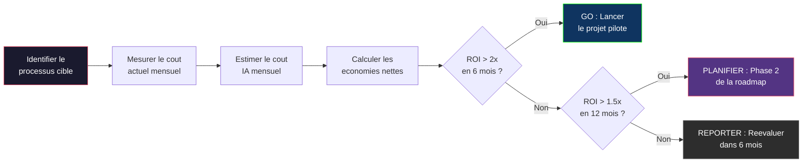
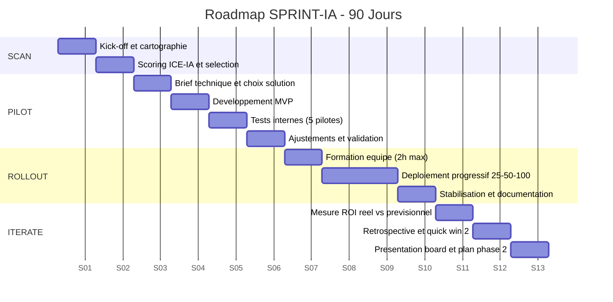
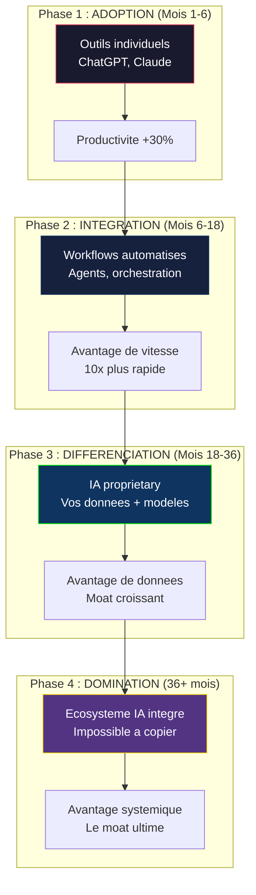

# AI for Business Owners

La formation definitive pour les dirigeants d'entreprise qui veulent comprendre l'IA assez profondement pour prendre des decisions strategiques — sans ecrire une seule ligne de code. Vous n'avez pas besoin de savoir coder pour transformer votre entreprise avec l'IA — vous avez besoin de savoir poser les bonnes questions, evaluer les bonnes solutions, et mesurer les bons resultats.

---

## Objectif du module

A l'issue de ce module, vous saurez evaluer une solution IA en 15 minutes, construire un business case chiffre pour convaincre votre board, recruter ou evaluer un prestataire IA sans vous faire enfumer, et piloter une roadmap IA a 90 jours avec des KPIs concrets. Vous maitriserez aussi les principes du One-Person Business augmente par l'IA et la strategie de monetisation progressive qui permet de passer de 0 a 100K EUR/mois.

---

## Lecon 1 — L'IA demystifiee : ce que les dirigeants doivent savoir

### Ce que vous allez apprendre

Les concepts fondamentaux de l'IA traduits en langage business. Pas de jargon technique — uniquement ce qui compte pour prendre des decisions eclairees. Comprendre pourquoi 2026 est le point d'inflexion et comment positionner votre entreprise avant vos concurrents.

### Contenu detaille

**Le vocabulaire IA que tout dirigeant doit maitriser :**

| Terme technique | Traduction business | Pourquoi ca compte |
|----------------|--------------------|--------------------|
| LLM (Large Language Model) | Moteur de langage | Comprend et genere du texte comme un humain |
| Fine-tuning | Personnalisation du modele | Adapter l'IA a votre metier specifique |
| RAG (Retrieval Augmented Generation) | IA + vos donnees | L'IA repond avec VOS documents, pas Internet |
| Agent IA | Employe numerique autonome | Execute des taches complexes sans supervision |
| Prompt engineering | L'art de poser la bonne question | La qualite de la question determine la qualite de la reponse |
| Token | Unite de facturation IA | Ce qui determine votre facture mensuelle |
| Hallucination | Invention plausible mais fausse | Le risque #1 a maitriser |
| MCP (Model Context Protocol) | Connecteur universel | Comment l'IA se branche a vos outils existants |
| IA Generative | Creation de contenu | Texte, images, video — votre departement creatif IA |
| IA Predictive | Prevision et anticipation | Anticipe les tendances, les ventes, les risques |
| IA Agentique | Execution autonome | L'IA qui agit, decide, et enchaine les actions |

**Les 3 types d'IA qui comptent pour le business :**



**Les 3 niveaux de comprehension pour un dirigeant :**

1. **Niveau 1 — Consommateur** : Vous utilisez ChatGPT pour des taches ponctuelles. Valeur : gain individuel de 30 min/jour. Vous etes 70% des dirigeants actuels.
2. **Niveau 2 — Architecte** : Vous concevez des workflows IA pour votre equipe. Valeur : gain d'equipe de 5-10h/semaine. Vous etes 20% des dirigeants actuels.
3. **Niveau 3 — Stratege** : Vous integrez l'IA dans votre modele economique. Valeur : avantage concurrentiel durable. Vous etes 10% des dirigeants — et c'est la que vous devez etre.

**Ce que l'IA fait bien vs. ce qu'elle fait mal (en 2026) :**

| L'IA excelle | L'IA echoue |
|-------------|-------------|
| Synthese de documents volumineux | Jugement ethique nuance |
| Redaction de premiers jets | Creativite radicalement nouvelle |
| Analyse de donnees structurees | Relations humaines authentiques |
| Automatisation de taches repetitives | Decisions politiques sensibles |
| Support client de niveau 1-2 | Negociations complexes |
| Veille concurrentielle systematique | Vision strategique long-terme |
| Scoring et qualification de leads | Empathie et connexion humaine |
| Transcription et compte-rendus | Responsabilite juridique |

**Les 5 mythes IA que les dirigeants doivent abandonner :**
- Mythe 1 : "L'IA va remplacer tous mes employes" → Realite : elle augmente les meilleurs, elimine les taches a faible valeur
- Mythe 2 : "C'est trop cher pour une PME" → Realite : un stack IA complet coute 200-500€/mois
- Mythe 3 : "Il faut des data scientists" → Realite : les outils no-code/low-code sont matures
- Mythe 4 : "Mes donnees ne sont pas pretes" → Realite : commencez avec ce que vous avez, iterez
- Mythe 5 : "C'est une mode passagere" → Realite : c'est la plus grande revolution depuis Internet

**Pourquoi 2026 est le point d'inflexion :**
- Les modeles IA sont devenus production-ready (assez fiables pour du vrai travail)
- Les outils d'orchestration ont muri (enchainer des actions IA en workflows)
- L'arbitrage de cout est massif : une equipe IA coute 1/10eme d'une equipe humaine
- Les entreprises qui adoptent maintenant prennent 2-3 ans d'avance
- Les entreprises qui attendent paieront 10x plus cher pour rattraper

**Etude de cas — PME de services B2B (45 employes) :**

Une entreprise de conseil en RH basee a Lyon a deploye trois outils IA en janvier 2026. Resultats apres 90 jours : reduction de 35% du temps de redaction de propositions commerciales, augmentation de 22% du taux de reponse aux appels d'offres (meilleure qualite de redaction), et economie de 2 800€/mois en sous-traitance de contenu. Investissement total : 380€/mois en licences IA. ROI : 7.4x en trois mois.

### Exercice pratique

**Auto-evaluation de maturite IA :**

Listez 10 taches que vous faites chaque semaine. Pour chacune, notez : temps passe, valeur ajoutee (haute/moyenne/basse), automatisable par l'IA (oui/partiellement/non). Identifiez les 3 premieres a deleguer a l'IA.

Ensuite, repondez a ces 5 questions de maturite :
1. Combien d'outils IA votre equipe utilise-t-elle au quotidien ? (0 / 1-2 / 3-5 / 5+)
2. Avez-vous un budget dedie a l'IA ? (Non / En reflexion / Oui < 1K€/mois / Oui > 1K€/mois)
3. Votre equipe a-t-elle recu une formation IA ? (Non / Informelle / Formelle / Certifiante)
4. L'IA fait-elle partie de votre strategie d'entreprise ? (Non / Discussion / Plan / Execution)
5. Mesurez-vous le ROI de vos initiatives IA ? (Non / Approximativement / KPIs definis / Dashboard)

Score : 0-5 = Debutant, 6-10 = Explorateur, 11-15 = Architecte, 16-20 = Stratege.

---

## Lecon 2 — La carte des opportunites IA dans votre business

### Ce que vous allez apprendre

Comment scanner systematiquement chaque departement de votre entreprise pour identifier les opportunites IA a fort ROI. La methode SCAN-IA en 4 etapes et le framework de priorisation 2x2.

### Contenu detaille

**La methode SCAN-IA (Systematique, Chiffree, Actionnable, Naturelle) :**

Etape 1 — **Systematique** : Cartographier tous les processus par departement
Etape 2 — **Chiffree** : Quantifier le temps et le cout de chaque processus
Etape 3 — **Actionnable** : Scorer chaque processus sur la matrice automatisation
Etape 4 — **Naturelle** : Prioriser par facilite d'adoption (resistance au changement)

**Matrice des opportunites par departement :**

| Departement | Cas d'usage prioritaire | ROI typique | Complexite | Timeline |
|-------------|------------------------|-------------|------------|----------|
| **Commercial** | Qualification de leads automatisee | 3-5x en 6 mois | Moyenne | 4-6 sem. |
| **Marketing** | Generation de contenu multi-canal | 2-4x en 3 mois | Faible | 2-3 sem. |
| **Support** | Chatbot + triage intelligent | 5-8x en 6 mois | Moyenne | 6-8 sem. |
| **Finance** | Rapprochement bancaire automatise | 2-3x en 4 mois | Elevee | 8-12 sem. |
| **RH** | Pre-screening CV + onboarding | 3-5x en 6 mois | Faible | 3-4 sem. |
| **Operations** | Extraction de donnees documentaires | 4-6x en 3 mois | Moyenne | 4-6 sem. |
| **Legal** | Revue de contrats assistee | 3-4x en 6 mois | Elevee | 8-12 sem. |
| **Direction** | Tableaux de bord decisionnels IA | 2-3x en 6 mois | Moyenne | 6-8 sem. |

**Arbre de decision : ou commencer avec l'IA dans votre entreprise ?**



**Le framework de priorisation 2x2 :**

```
         Impact eleve
              |
   QUICK WINS |  PROJETS STRATEGIQUES
   (Faire     |  (Planifier sur
    maintenant)|   6-12 mois)
--------------+------------------
   IGNORER    |  EXPERIMENTATIONS
   (Faible    |  (Tester en mode
    priorite) |   pilot)
              |
         Impact faible
    Effort faible -------- Effort eleve
```

**Les 5 signaux qu'un processus est "IA-ready" :**
1. Il est repetitif (>3 fois/semaine)
2. Il suit des regles definies (meme implicites)
3. Il consomme des donnees textuelles ou structurees
4. Il a un output mesurable (document, decision, action)
5. Son execution actuelle est lente ou couteuse

**Opportunites IA par industrie :**

| Industrie | Quick Win #1 | Quick Win #2 | Projet strategique |
|-----------|-------------|-------------|-------------------|
| SaaS / Tech | Support client IA | Generation de docs | QA automatisee |
| E-commerce | Descriptions produits | Personnalisation | Prevision de stock |
| Services pro | Generation de propositions | Recherche juridique | Reporting client |
| Sante | Communication patients | Planification | Documentation clinique |
| Immobilier | Annonces automatisees | Analyse de marche | Qualification leads |
| Agences | Production de contenu | Optimisation campagnes | Livraison client IA |
| Industrie | Controle qualite | Maintenance predictive | Optimisation supply chain |

**Etude de cas — E-commerce mode (12 employes) :**

Un site de pret-a-porter feminin a deploye l'IA sur trois fronts : generation automatique de descriptions produits (2 000 fiches produites en 3 semaines au lieu de 4 mois), chatbot support client (62% des tickets resolus sans intervention humaine), et emails marketing personnalises (taux d'ouverture passe de 18% a 31%). Investissement : 450€/mois. Economies : 4 200€/mois en prestataires + 2 postes non remplaces au depart d'un stagiaire. Impact sur le CA : +14% en 90 jours grace a une meilleure conversion email.

### Exercice pratique

Choisissez 2 departements de votre entreprise. Pour chacun, listez 5 processus repetitifs, appliquez les 5 signaux "IA-ready", et calculez le ROI potentiel en heures/semaine et euros/mois. Presentez votre top 3 avec un mini business case incluant : probleme actuel, solution IA proposee, cout estime, ROI attendu a 6 mois.

---

## Lecon 3 — L'economie de l'IA : ce que ca coute vraiment

### Ce que vous allez apprendre

Decomposition complete des couts IA : licences, API, infrastructure, formation, maintenance. Comment construire un budget IA realiste et defendre un business case devant un board. La comparaison entre equipe traditionnelle et systeme IA.

### Contenu detaille

**Les 5 categories de couts IA :**

| Categorie | Description | Fourchette mensuelle (PME) | Fourchette mensuelle (ETI) |
|-----------|-------------|---------------------------|---------------------------|
| **Licences SaaS** | ChatGPT Team, Claude Pro, outils specialises | 100-500€ | 500-5 000€ |
| **Couts API** | Appels aux modeles (tokens consommes) | 50-300€ | 300-3 000€ |
| **Infrastructure** | Serveurs, stockage, hebergement | 0-200€ | 200-2 000€ |
| **Formation** | Upskilling equipes, certifications | 200-1 000€ (amortis) | 1 000-10 000€ (amortis) |
| **Maintenance** | Monitoring, mises a jour, support | 100-500€ | 500-5 000€ |
| **TOTAL** | | **450-2 500€/mois** | **2 500-25 000€/mois** |

**Comparaison : equipe traditionnelle vs. systeme IA :**

| Fonction | Equipe traditionnelle (annuel) | Systeme IA (annuel) | Economies |
|----------|-------------------------------|--------------------|-----------| 
| CTO + 3 devs | 400-600K€ | 96-180K€ | 70-85% |
| Equipe marketing (4) | 250-400K€ | 60-120K€ | 75-90% |
| Support client (3) | 120-200K€ | 24-60K€ | 85-95% |
| Equipe contenu (3) | 180-300K€ | 36-96K€ | 80-90% |
| QA (2) | 150-250K€ | 36-60K€ | 80-90% |

**Comparaison tache par tache :**

| Tache | Temps humain/mois | Cout humain | Cout IA equivalent | Ratio |
|-------|-------------------|-------------|-------------------|-------|
| Redaction 20 articles blog | 40h | 2 000€ | 150€ (API + revision) | 13x |
| Tri de 500 CV | 25h | 1 250€ | 30€ (API) | 42x |
| Support client L1 (500 tickets) | 80h | 3 200€ | 200€ (chatbot) | 16x |
| Rapports financiers hebdo | 8h | 600€ | 20€ (automatisation) | 30x |
| Veille concurrentielle | 15h | 900€ | 50€ (scraping IA) | 18x |

**Le modele de pricing des APIs IA (ce que votre CTO ne vous explique pas) :**

```
Cout par requete = (tokens_input x prix_input) + (tokens_output x prix_output)

Exemples (avril 2026) :
- GPT-4o : $2.50/M input, $10.00/M output
- Claude Sonnet 4 : $3.00/M input, $15.00/M output
- Claude Opus 4 : $15.00/M input, $75.00/M output
- Gemini 2.5 Pro : $1.25/M input, $10.00/M output

1 million de tokens = 750 000 mots = 1 500 pages
```

**Les 5 modeles de tarification que vous allez rencontrer :**

1. **Par utilisateur** (Jasper, Copy.ai) : cout previsible, scale avec l'equipe
2. **A l'usage** (OpenAI API, Claude API) : payez ce que vous consommez
3. **Forfait mensuel** (la plupart des SaaS) : cout fixe, fonctionnalites definies
4. **Par projet** (developpement custom) : investissement ponctuel
5. **Retainer** (CAIO partnership) : leadership strategique continu, 4-15K€/mois

**Diagramme de calcul du ROI IA :**



**Comment eviter les gouffres financiers :**
- Ne payez pas l'offre enterprise quand le starter suffit
- Ne construisez pas du custom quand le off-the-shelf existe
- N'embauchez pas un employe IA full-time quand un CAIO partnership revient moins cher
- N'achetez pas 10 outils quand 3 couvrent 90% de vos besoins
- Le gaspillage #1 : payer pour des outils IA que personne n'utilise

**Le template de business case IA (5 slides) :**
1. **Probleme** : Quel processus coute combien aujourd'hui ? (chiffres)
2. **Solution** : Quelle solution IA, quel fournisseur, quelle timeline ?
3. **Investissement** : Setup + 12 mois de fonctionnement
4. **ROI** : Payback period, economies annuelles, gains qualitatifs
5. **Risques** : Top 3 risques + mitigations concretes

**Etude de cas — Cabinet comptable (22 personnes) :**

Budget IA : 890€/mois (Claude Pro pour 8 comptables + automatisation OCR pour factures). Gains mesures a 6 mois : 380 heures/mois de saisie eliminee, reduction des erreurs de rapprochement de 89%, 3 clients supplementaires pris en charge sans embauche. Economie nette : 12 400€/mois. Payback : 23 jours.

### Exercice pratique

Construisez un business case complet pour votre quick win #1 identifie en Lecon 2. Utilisez le template 5 slides. Incluez des chiffres reels de votre entreprise. Presentez-le a un collegue et notez ses objections — ce sont vos angles morts.

**Template de calcul rapide :**
- Cout mensuel actuel du processus : ____€ (heures x taux horaire)
- Cout mensuel IA estime : ____€ (licence + API + maintenance)
- Economie mensuelle nette : ____€
- Cout d'implementation one-shot : ____€
- Payback period : ____ mois (cout implementation / economie mensuelle)
- ROI a 12 mois : ____x ((economie x 12 - cout implementation) / cout implementation)

---

## Lecon 4 — Recruter et s'associer pour l'IA : evaluer les talents

### Ce que vous allez apprendre

Comment evaluer un prestataire IA, recruter un profil IA, ou choisir un partenaire technologique — sans competence technique. Les 7 red flags et les 7 green flags. Le modele CAIO et pourquoi c'est souvent la meilleure option.

### Contenu detaille

**Les 5 options pour obtenir des capacites IA :**

| Option | Cout annuel | Controle | Vitesse | Pour qui ? |
|--------|------------|---------|---------|------------|
| **DIY avec outils** | 0-6K€ | Total | Rapide | Automatisations simples |
| **Recruter un CAIO interne** | 80-150K€ | Total | Lent (3-6 mois recrutement) | ETI, scaleups |
| **CAIO freelance / partnership** | 48-180K€ | Eleve | Rapide (2-4 semaines) | PME, startups |
| **Cabinet de conseil IA** | 50-200K€ | Moyen | Moyen (1-2 mois setup) | Grands groupes |
| **DIY avec formation CAIO** | 5-15K€ | Total | Variable | Fondateurs tech-curious |

**Le modele CAIO (Chief AI Officer) explique :**

Le CAIO est le nouveau role strategique qui fait le pont entre la technologie IA et la strategie business. Contrairement a un CTO qui gere l'infrastructure technique, le CAIO se concentre sur : ou l'IA cree de la valeur business, comment mesurer le ROI, quels projets prioriser, et comment accompagner le changement. Pour la plupart des PME, un CAIO en partnership (externe) est plus rentable qu'une embauche interne, car il apporte l'experience de multiples deploiements sans le cout fixe d'un cadre superieur.

**Les 7 red flags d'un prestataire IA :**

1. Il promet des resultats sans avoir vu vos donnees
2. Il ne peut pas expliquer sa methodologie en termes simples
3. Il n'a aucune reference verifiable dans votre secteur
4. Il insiste sur un modele specifique sans justification
5. Il ne parle jamais de maintenance et de monitoring post-livraison
6. Son devis n'inclut pas de phase pilot/MVP
7. Il ne pose aucune question sur vos processus actuels

**Les 7 green flags d'un bon partenaire IA :**

1. Il commence par un audit (meme gratuit) avant de proposer
2. Il explique les limites de l'IA pour votre cas specifique
3. Il propose un MVP en 2-4 semaines avec des metriques de succes
4. Il partage des cas similaires avec des chiffres de ROI
5. Il prevoit un plan de formation pour vos equipes
6. Il inclut un SLA de maintenance dans son offre
7. Il accepte un modele de remuneration lie aux resultats

**Grille d'evaluation d'un candidat CAIO (entretien en 5 questions) :**

| Question | Bonne reponse | Mauvaise reponse |
|----------|---------------|-----------------|
| "Comment auditeriez-vous notre entreprise ?" | Processus structure en phases, commence par les donnees | "Je vais installer ChatGPT partout" |
| "Quel ROI peut-on attendre sur 6 mois ?" | Fourchette prudente avec hypotheses explicites | Chiffre precis sans contexte |
| "Quelle est votre stack technique ?" | Explication adaptee a votre niveau | Jargon incomprehensible |
| "Comment gerez-vous les hallucinations ?" | Guardrails, validation humaine, monitoring | "Ca n'arrive plus avec les nouveaux modeles" |
| "Montrez-moi un projet similaire" | Etude de cas detaillee avec metriques | "C'est confidentiel" (pour tout) |

**Les competences cles a evaluer :**
- Vision strategique (pas juste technique)
- Capacite a communiquer avec des non-techniques
- Experience en gestion de projet (pas juste en IA)
- Comprehension de votre secteur d'activite
- Track record mesurable (ROI demonstre)
- Methodologie structuree (audit → pilot → rollout → mesure)

**L'engagement typique d'un CAIO partnership :**

| Mois | Activite | Livrable |
|------|----------|----------|
| Mois 1 | Audit IA complet | Rapport d'opportunites + matrice de priorisation |
| Mois 2-3 | Construction du MVP #1 | Premiere automatisation en production + metriques |
| Mois 4-6 | Deploiement + formation equipe | 2-3 systemes IA operationnels + equipe formee |
| Mois 7+ | Optimisation continue | Dashboard ROI + nouveaux projets identifies |

### Exercice pratique

Redigez une fiche de poste CAIO adaptee a votre entreprise (taille, secteur, budget). Incluez : mission, competences requises, KPIs a 6 mois, remuneration. Puis evaluez 3 profils LinkedIn de consultants IA avec la grille des 7 green/red flags.

**Questions a poser avant de signer :**
- "Quelle est votre approche pour les 30 premiers jours ?"
- "Pouvez-vous me montrer un systeme que vous avez construit qui tourne en production ?"
- "Que se passe-t-il avec les systemes si on arrete de travailler ensemble ?"
- "Comment mesurez-vous le ROI concretement ?"
- "Quel est votre stack technique ?" (Claude Code, MCP, agents = bon signe en 2026)

---

## Lecon 5 — Strategie IA : construire ta roadmap a 90 jours

### Ce que vous allez apprendre

La methode SPRINT-IA pour construire et executer une roadmap IA en 90 jours. De l'audit initial au premier ROI mesurable, semaine par semaine. Comment embarquer votre equipe et gerer la conduite du changement.

### Contenu detaille

**La roadmap SPRINT-IA en 4 phases :**

| Phase | Semaines | Objectif | Livrable |
|-------|----------|----------|----------|
| **S**can | S1-S2 | Audit complet + priorisation | Matrice d'opportunites scoree |
| **P**ilot | S3-S6 | MVP sur le quick win #1 | Prototype fonctionnel + metriques |
| **R**ollout | S7-S10 | Deploiement equipe + formation | Processus en production |
| **I**terate | S11-S13 | Mesure, optimisation, scale | Dashboard ROI + plan phase 2 |

**Timeline de mise en oeuvre a 90 jours :**



**Semaine par semaine — le plan detaille :**

```
Semaine 1  : Kick-off + cartographie des processus
Semaine 2  : Scoring ICE-IA + selection du quick win
Semaine 3  : Brief technique + choix de la solution
Semaine 4  : Developpement MVP (prestataire ou interne)
Semaine 5  : Tests internes (5 utilisateurs pilotes)
Semaine 6  : Ajustements + validation du business case reel
Semaine 7  : Formation equipe (2h max, pratique)
Semaine 8  : Deploiement progressif (25% → 50% → 100%)
Semaine 9  : Monitoring quotidien + support utilisateurs
Semaine 10 : Stabilisation + documentation des processus
Semaine 11 : Mesure ROI reel vs. previsionnel
Semaine 12 : Retrospective + identification quick win #2
Semaine 13 : Presentation board + plan phase 2
```

**Les KPIs de votre roadmap IA :**

| KPI | Objectif S6 | Objectif S13 | Comment mesurer |
|-----|-------------|--------------|-----------------|
| Heures economisees/semaine | 5-10h | 15-30h | Tracking temps avant/apres |
| Cout mensuel IA | <500€ | <1 000€ | Factures API + licences |
| Taux d'adoption equipe | >60% | >85% | Nombre d'utilisateurs actifs/total |
| Erreurs evitees | Baseline | -30% | Incidents avant/apres |
| Satisfaction equipe | Baseline | >4/5 | Survey trimestriel |
| ROI cumule | 1.5x | 3-5x | (Economies + revenus) / cout total |

**Quick wins que n'importe quel business peut implementer en semaine 1 :**
- ChatGPT/Claude pour la redaction d'emails, comptes rendus, recherche
- Planification IA (Cal.com, Reclaim.ai)
- Support client IA (Intercom, Crisp avec IA)
- Redaction de contenu IA (Claude pour blogs, LinkedIn, newsletters)
- Transcription IA (Descript, Otter.ai pour les reunions)

**Conduite du changement — Embarquer votre equipe :**
1. Commencez par les champions (trouvez les 1-2 personnes enthousiastes)
2. Montrez, ne racontez pas (demos de resultats, pas de lecons sur le potentiel)
3. Rendez-le facile (installez les outils, creez des templates, fournissez la formation)
4. Adressez les peurs honnetement ("l'IA remplace des taches, pas des personnes — si tu l'utilises")
5. Celebrez les victoires publiquement

**Les 5 erreurs fatales de la roadmap IA :**
1. Commencer par un projet trop ambitieux (chatbot client avant interne)
2. Ne pas mesurer l'avant (pas de baseline = pas de ROI)
3. Imposer sans former (adoption = 0 sans accompagnement)
4. Sous-estimer la maintenance (un modele IA se degrade sans monitoring)
5. Ne pas celebrer les quick wins (le momentum est crucial)

**Etude de cas — Agence de communication (18 personnes) :**

Roadmap SPRINT-IA executee en 13 semaines. Quick win #1 : generation de premiers jets de propositions commerciales (gain de 15h/semaine pour l'equipe commerciale). Quick win #2 : creation de visuels pour les reseaux sociaux (division par 3 du temps de production). Resultat a J+90 : 28h/semaine economisees, cout IA de 620€/mois, 3 nouveaux clients pris en charge sans recrutement. Le directeur general presente au board un ROI de 4.8x et obtient un budget de 2 500€/mois pour la phase 2.

### Exercice pratique

Construisez votre roadmap SPRINT-IA personnalisee. Remplissez le template semaine par semaine avec vos dates, vos responsables, et vos KPIs. Identifiez les 3 risques principaux et leur plan de mitigation. Faites valider par votre equipe de direction.

---

## Lecon 6 — Ethique, legal et gestion des risques IA

### Ce que vous allez apprendre

Le cadre reglementaire IA en 2026 (EU AI Act, RGPD, sectoriels), les risques juridiques concrets, et comment construire une politique IA d'entreprise qui protege sans paralyser.

### Contenu detaille

**Le paysage reglementaire IA en 2026 :**

| Reglementation | Perimetre | Impact dirigeant | Echeance |
|---------------|-----------|-----------------|----------|
| **EU AI Act** | Classification des systemes IA par risque | Obligation de conformite selon la categorie | Applicable depuis 2025 |
| **RGPD** | Donnees personnelles traitees par l'IA | Consentement, droit a l'explication, DPO | En vigueur |
| **AI Liability Directive** | Responsabilite en cas de dommage IA | Le deployer est responsable, pas le fournisseur | 2026 |
| **Sectoriels** (sante, finance, RH) | Contraintes specifiques par secteur | Certifications et audits supplementaires | Variable |

**Les 4 niveaux de risque EU AI Act :**

```
INTERDIT          → Scoring social, manipulation subliminale
                    → Ne pas deployer. Point final.

HAUT RISQUE       → RH (recrutement), credit scoring, sante
                    → Obligations : transparence, audit, humain dans la boucle

RISQUE LIMITE     → Chatbots, deepfakes, systemes emotionnels
                    → Obligation de transparence (informer l'utilisateur)

RISQUE MINIMAL    → Filtres spam, jeux video, recommandations
                    → Pas d'obligation specifique
```

**La checklist juridique IA pour dirigeants (12 points) :**

1. Vos donnees d'entrainement respectent-elles le RGPD ?
2. Les utilisateurs savent-ils qu'ils interagissent avec une IA ?
3. Avez-vous un processus de validation humaine pour les decisions critiques ?
4. Vos contrats fournisseurs couvrent-ils la propriete intellectuelle des outputs ?
5. Votre DPO a-t-il ete consulte avant le deploiement ?
6. Avez-vous documente votre analyse d'impact (AIPD) ?
7. Les biais algorithmiques sont-ils testes et monitores ?
8. Vos employes ont-ils signe une charte IA interne ?
9. Les donnees clients sont-elles anonymisees avant traitement IA ?
10. Avez-vous un plan de reponse en cas d'incident IA ?
11. Votre assurance RC couvre-t-elle les dommages lies a l'IA ?
12. Avez-vous designe un responsable IA (CAIO ou equivalent) ?

**Gestion des risques IA — les 5 risques majeurs :**

| Risque | Probabilite | Impact | Mitigation |
|--------|------------|--------|------------|
| Hallucinations IA | Elevee | Moyen-Eleve | Validation humaine, guardrails, monitoring |
| Fuite de donnees sensibles | Moyenne | Critique | Politique d'usage, anonymisation, DLP |
| Dependance fournisseur | Moyenne | Eleve | Multi-fournisseur, abstraction, export data |
| Biais algorithmique | Moyenne | Eleve | Tests reguliers, diversite des donnees, audit |
| Non-conformite reglementaire | Faible-Moyenne | Critique | CAIO/DPO, veille juridique, audit annuel |

**Template de politique IA d'entreprise (structure) :**
- **Principes** : Transparence, equite, responsabilite, securite, confidentialite
- **Gouvernance** : Qui decide quoi (comite IA, CAIO, DPO)
- **Usages autorises** : Liste blanche des cas d'usage valides
- **Usages interdits** : Decisions RH automatiques, donnees sensibles sans consentement
- **Monitoring** : Frequence d'audit, metriques de biais, incidents
- **Formation** : Programme obligatoire pour tous les utilisateurs IA
- **Escalade** : Processus en cas de doute ou d'incident

**Ce que vos employes peuvent et ne peuvent pas faire avec l'IA :**

| Autorise | Interdit |
|----------|----------|
| Rediger des brouillons avec IA | Coller des donnees clients dans ChatGPT public |
| Rechercher des informations publiques | Prendre des decisions RH basees uniquement sur l'IA |
| Analyser des donnees anonymisees | Partager des informations confidentielles avec des outils IA non approuves |
| Generer du contenu marketing | Publier du contenu IA sans relecture humaine |
| Automatiser des taches repetitives internes | Utiliser l'IA pour du scoring social ou de la surveillance |

### Exercice pratique

Redigez la V1 de votre politique IA d'entreprise en utilisant le template fourni. Faites-la relire par votre DPO ou avocat. Identifiez les 3 risques juridiques les plus urgents pour votre cas specifique et definissez un plan d'action pour chacun.

---

## Lecon 7 — Le One-Person Business augmente par l'IA

### Ce que vous allez apprendre

Comment l'IA transforme le modele du One-Person Business et permet a un dirigeant seul (ou avec une equipe reduite) de generer des revenus comparables a ceux d'une equipe de 10-20 personnes. Les 4 piliers du business augmente par l'IA : Brand, Content, Offer, Marketing.

### Contenu detaille

**Le paradigme du One-Person Business IA en 2026 :**

Un business que VOUS controlez entierement, optimise pour la liberte de temps, lieu et decision. Marges de profit de 90-95% sur les produits digitaux. 2-4 heures de travail par jour une fois etabli. Potentiel de 1M€/an avec une seule personne augmentee par l'IA.

**Les 4 piliers du One-Person Business augmente :**

| Pilier | Sans IA | Avec IA | Multiplicateur |
|--------|---------|---------|---------------|
| **Brand** | 10-15h/semaine de creation de contenu personnel | 3-5h/semaine (IA genere les drafts, vous affinez) | 3x |
| **Content** | 1 article/semaine, 3 posts LinkedIn | 5 articles/semaine, 15 posts, 1 video | 5x |
| **Offer** | 1 offre, delivery manuelle | 3-5 offres, delivery automatisee | 3-5x |
| **Marketing** | Funnel manuel, 50 contacts/semaine | Funnel automatise, 500 contacts/semaine | 10x |

**La progression d'offres pour un dirigeant-entrepreneur :**

```
NIVEAU 1 : SERVICES (Revenus immediats)
   Consulting/Coaching : 100-500€/heure
   Done-for-you : 1 000-10 000€/projet
   Audit IA : 3 000-7 000€

NIVEAU 2 : PRODUITS DIGITAUX (Scale)
   Cours en ligne : 100-2 000€
   Templates/Ressources : 20-200€
   Membership/Communaute : 20-100€/mois

NIVEAU 3 : SAAS / PLATEFORME (Exit)
   Outils SaaS : 10-500€/mois
   Marketplace : Commission-based
   API : Usage-based
```

**Le content flywheel augmente par l'IA :**

1 newsletter par semaine → l'IA decoupe en 5+ tweets, 3 posts LinkedIn, 2 reels Instagram, 1 video YouTube. Temps humain : 3h pour la newsletter + 1h de curation IA. Output : 10+ pieces de contenu. Avant l'IA : 15h pour le meme output.

**Etude de cas — Consultant en strategie devenu One-Person Business IA :**

Marc, 42 ans, consultant en strategie B2B. Avant l'IA : 120K€/an en facturant 150€/h, plafonne a 800h facturables. Apres transformation IA : lance une formation en ligne a 997€ (vendue 15 fois/mois = 15K€/mois), garde 5 clients consulting a 2 000€/mois chacun (10K€/mois), et cree un membership a 67€/mois (200 membres = 13.4K€/mois). Total : 38K€/mois avec 25h de travail/semaine. L'IA gere : generation de contenu (newsletter + posts), support membres (chatbot FAQ), qualification de leads (formulaire IA), et reporting financier.

### Exercice pratique

Cartographiez votre propre "offre augmentee" :
1. Listez vos 3 expertises principales
2. Pour chacune, definissez un service (immediat), un produit digital (scalable), et un outil/plateforme (exit potentiel)
3. Estimez le revenu potentiel mensuel de chaque offre
4. Identifiez les 3 taches que l'IA peut automatiser dans la delivery de chaque offre

---

## Lecon 8 — Construire un avantage concurrentiel durable avec l'IA

### Ce que vous allez apprendre

Comment transformer l'adoption de l'IA en un avantage concurrentiel impossible a repliquer. La strategie de monetisation progressive, le concept de "moat IA", et la vision a 5 ans.

### Contenu detaille

**Les 3 types d'avantages concurrentiels IA :**

1. **Avantage de vitesse** : L'IA vous permet d'executer 10x plus vite que les concurrents. Mais cet avantage est temporaire — vos concurrents finiront par adopter les memes outils.

2. **Avantage de donnees** : Vos donnees business + IA = des insights que les concurrents ne peuvent pas repliquer. Plus vous accumulez de donnees, plus votre IA devient performante. C'est un avantage qui se renforce dans le temps.

3. **Avantage de systeme** : Vos processus IA sont si integres dans votre business qu'ils sont impossibles a copier sans reconstruire toute l'entreprise. C'est le moat ultime.

**Matrice de maturite IA et avantage concurrentiel :**



**La strategie de monetisation progressive (inspiree du modele CAIO Academy) :**

| Phase | Mois | Revenu cible | Strategie |
|-------|------|-------------|-----------|
| Autorite | 1-3 | 2-5K€/mois | Construire la credibilite, premiers abonnes |
| Beta | 4-6 | 8-18K€/mois | Valider le modele, premieres cohortes |
| Lancement | 7-9 | 20-40K€/mois | Scale, product-market fit |
| Flywheel | 10-12 | 40-80K€/mois | Ecosysteme auto-alimente |

**Comment rester a jour sans se noyer :**
- Suivez 5 sources cles (liste curatee fournie dans les ressources)
- Passez 30 minutes/semaine sur les news IA (pas plus)
- Testez un nouvel outil par mois
- Rejoignez une communaute IA (Telegram, Discord, ou groupe LinkedIn)
- Revue strategique trimestrielle : qu'est-ce qui a change ? Qu'est-ce qu'on devrait adopter ?

**Les tendances IA 2026-2028 a surveiller :**
- **IA Agentique** : l'IA qui agit de facon autonome (agents Claude Code, workflows autonomes)
- **Multimodal** : texte + image + video + audio dans un seul prompt
- **Employes IA** : des travailleurs IA persistants gerant des responsabilites continues
- **IA Verticale** : des outils IA specifiques par industrie pour chaque niche
- **La tendance** : l'IA passe d'outil a membre de l'equipe

**Etude de cas — De PME regionale a leader national en 18 mois :**

Une entreprise de formation professionnelle (35 personnes) a deploye l'IA dans 5 departements en 18 mois. Resultat : capacite de formation multipliee par 4 (de 200 a 800 apprenants/trimestre) sans embauche. Le contenu est genere par IA et valide par les experts metier. Le support apprenant est gere par un chatbot specialise (85% de resolution sans humain). Le marketing produit 60 pieces de contenu/mois (au lieu de 12). Les concurrents regionaux, tous en mode "attente", ont perdu 30% de part de marche en un an. L'investissement IA total sur 18 mois : 42 000€. Le chiffre d'affaires supplementaire genere : 890 000€.

### Exercice pratique

**Construisez votre plan d'avantage concurrentiel IA a 18 mois :**

1. **Ou etes-vous aujourd'hui ?** (Phase 1, 2, 3, ou 4 de la matrice de maturite)
2. **Ou voulez-vous etre dans 18 mois ?** (Phase cible)
3. **Quelles donnees proprietaires pouvez-vous alimenter a l'IA ?** (Historique client, processus metier, expertise sectorielle)
4. **Quel est votre "moat IA" potentiel ?** (Ce que les concurrents ne pourront pas copier)
5. **Budget et ressources necessaires** pour y arriver
6. **3 milestones intermediaires** avec des KPIs mesurables

---

## Ce que cette formation apporte

- Comprehension profonde de l'IA sans jargon technique — vous parlez IA avec assurance
- Capacite a identifier et prioriser les opportunites IA dans chaque departement
- Maitrise des couts reels et construction de business cases chiffres
- Grille d'evaluation pour recruter ou choisir un partenaire IA sans se faire enfumer
- Roadmap IA actionnable a 90 jours avec KPIs et milestones
- Politique IA d'entreprise conforme au cadre legal 2026
- Strategies de One-Person Business augmente par l'IA
- Vision strategique pour construire un avantage concurrentiel durable

---

## Ressources complementaires

- Module suivant : AI for C-Level — Le CAIO au Service de la C-Suite
- Template de business case IA (5 slides, Google Slides)
- Grille SCAN-IA et calculateur de ROI (Google Sheets)
- Modele de politique IA d'entreprise (Google Docs)
- Checklist juridique IA dirigeant (PDF imprimable)
- Communaute Kommu pour echanger avec d'autres dirigeants en transformation IA
- Liste curatee de 5 sources IA a suivre chaque semaine
- Template de roadmap SPRINT-IA personnalisable (Notion)
- Grille d'evaluation prestataire/CAIO (PDF imprimable)
