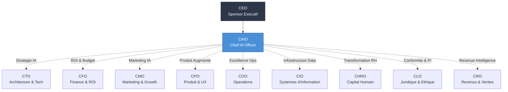
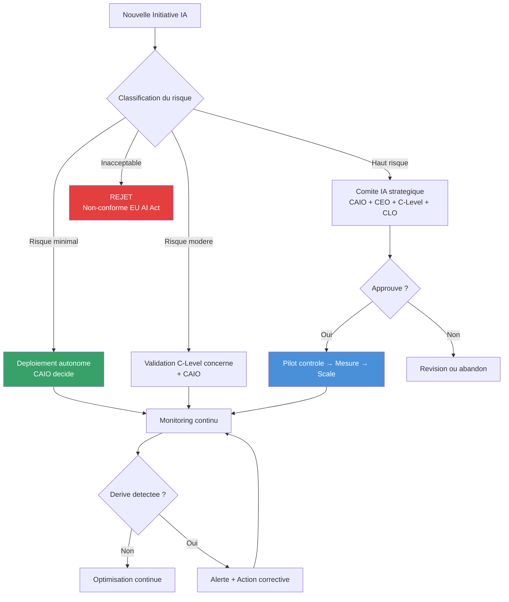
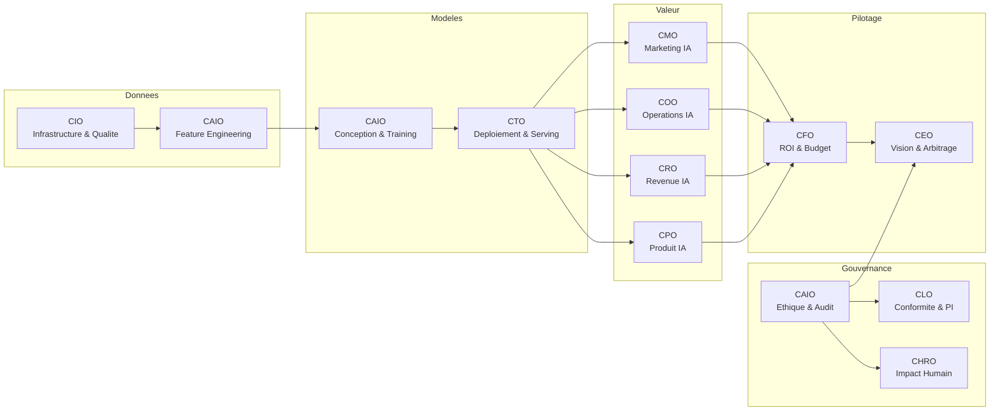
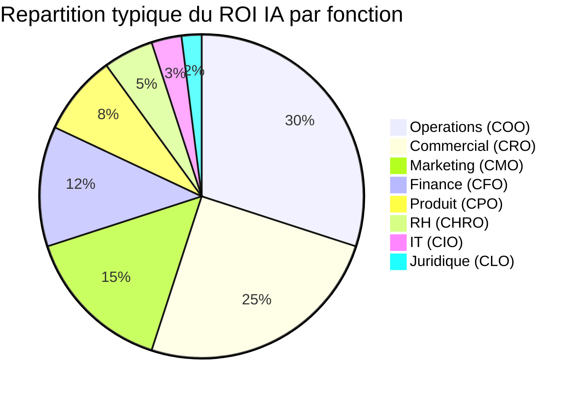
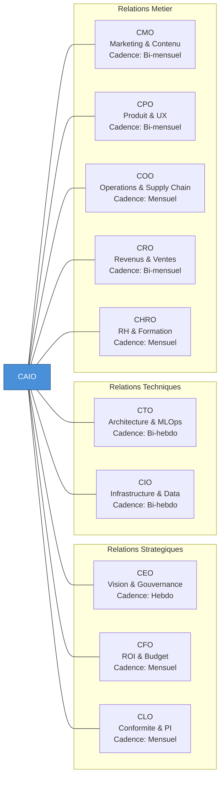

# AI for C-Level : Le CAIO au Service de la C-Suite

11 modules specialises couvrant la relation CAIO avec chaque membre du comite de direction. Le CAIO n'est pas un role isole — c'est un multiplicateur de force pour chaque fonction executive. Ce module vous donne les cles pour parler le langage de chaque C-Level, identifier leurs douleurs specifiques, et proposer des solutions IA qui generent un ROI mesurable dans leur perimetre.

---

## Objectif du module

A l'issue de ce module, vous saurez adapter votre discours IA a chaque membre de la C-Suite, concevoir des solutions IA specifiques a chaque fonction executive, orchestrer une transformation IA transversale sans creer de silos, et devenir le partenaire strategique indispensable du comite de direction.

---

## Positionnement du CAIO dans l'organigramme

Le CAIO occupe une position unique dans l'organisation — transversale, strategique, et orientee impact. Comprendre ce positionnement est essentiel pour chaque lecon de ce module.



**Principe fondamental** : Le CAIO rapporte directement au CEO. Les entreprises qui placent le CAIO sous le CTO ou le COO diluent systematiquement l'impact strategique du role. Le CAIO doit avoir un acces direct au CEO, sans intermediaire hierarchique, pour jouer pleinement son role de conseiller strategique et de gardien de la gouvernance IA.

**Structure de positionnement recommandee :**

| Element | Recommandation |
|---------|---------------|
| Rattachement hierarchique | Direct au CEO |
| Participation comite de direction | Permanente, avec droit de vote |
| Acces au conseil d'administration | Presentation trimestrielle minimum |
| Budget | Ligne budgetaire autonome, validee par le CEO |
| Pouvoir de veto | Sur les projets presentant des risques ethiques ou reputationnels IA |
| Perimetre | Transversal a toutes les fonctions de l'entreprise |

**Le CAIO n'est PAS :**
- Un CTO bis (il ne gere pas l'infrastructure)
- Un consultant interne (il a un mandat executif)
- Un data scientist senior (il pense strategie, pas modeles)
- Un chef de projet IA (il orchestre, il ne developpe pas)

**Le CAIO EST :**
- Un traducteur entre la technologie et le business
- Un architecte de la transformation IA a l'echelle de l'entreprise
- Un gardien de la gouvernance ethique et de la conformite
- Un catalyseur d'innovation qui identifie les opportunites IA dans chaque fonction
- Un arbitre des tensions inter-departementales liees a l'IA

---

## Lecon 1 — Le CAIO au service du CEO : leadership strategique IA

### Ce que vous allez apprendre

Comment positionner l'IA comme levier strategique devant le CEO. Les conversations cles que le CAIO doit initier avec le CEO, et comment traduire les capacites IA en vision d'entreprise. Le modele de confiance progressif et les 90 premiers jours.

### Contenu detaille

**Ce que le CEO attend du CAIO :**

Le CEO ne veut pas entendre parler de tokens, de modeles ou d'architectures. Il veut des reponses a 5 questions :

1. Comment l'IA nous donne un avantage concurrentiel durable ?
2. Quel est le ROI global de notre investissement IA ?
3. Quels risques l'IA fait-elle peser sur l'entreprise ?
4. Comment l'IA change notre modele economique a 3 ans ?
5. Sommes-nous en avance ou en retard sur nos concurrents ?

Le CAIO accomplit trois missions fondamentales aupres du CEO :

| Mission | Description | Exemple concret |
|---------|-------------|-----------------|
| **Traduction** | Convertir les capacites IA en opportunites business | "Le traitement du langage naturel peut reduire de 40% le temps de reponse client" |
| **Anticipation** | Identifier les tendances IA qui impacteront le secteur | "Les agents autonomes vont transformer notre modele de service dans 18 mois" |
| **Protection** | Signaler les risques et les limites de l'IA | "Ce projet d'IA generative presente un risque reputationnel si le cadre ethique n'est pas en place" |

**Le modele de confiance CEO-CAIO (4 phases) :**

La confiance ne se decrete pas — elle se construit par etapes :

| Phase | Periode | Ce que le CAIO doit faire | Resultat |
|-------|---------|--------------------------|----------|
| **Credibilite** | Mois 1-3 | Quick wins, analyses factuelles, zero promesses exagerees | Le CEO respecte la competence du CAIO |
| **Demonstration** | Mois 3-6 | Premiers pilotes avec resultats mesurables, transparence totale | Le CEO a confiance dans la capacite d'execution |
| **Partenariat** | Mois 6-12 | Consultation sur M&A, strategie concurrentielle, orientations produit | Le CEO s'appuie sur le CAIO pour les decisions majeures |
| **Integration** | 12+ mois | IA integree dans le processus decisionnaire du CEO | Le CAIO est un membre permanent et influent du comite de direction |

**Le framework VISION-IA pour le CEO :**

| Dimension | Question strategique | Livrable CAIO | Frequence |
|-----------|---------------------|---------------|-----------|
| **V**aleur | Ou l'IA cree-t-elle le plus de valeur ? | Dashboard ROI par departement | Mensuel |
| **I**nnovation | Quels nouveaux produits/services l'IA rend possibles ? | Pipeline d'innovation IA | Trimestriel |
| **S**trategie | Comment l'IA redefinit notre positionnement ? | Analyse concurrentielle IA | Semestriel |
| **I**ntegration | L'IA est-elle integree dans notre culture ? | Score de maturite IA organisationnel | Trimestriel |
| **O**perations | Les systemes IA tournent-ils de maniere fiable ? | Rapport de sante operationnelle IA | Hebdomadaire |
| **N**avigation | Quels virages strategiques anticiper ? | Veille technologique et reglementaire | Mensuel |

**Les 3 niveaux d'impact IA que le CEO doit comprendre :**

1. **Optimisation** — L'IA ameliore l'efficacite des processus existants. Retours rapides, risques maitises. Mais s'arreter la, c'est utiliser un moteur de F1 pour alimenter une voiture de ville.
2. **Transformation** — L'IA repense les modeles operationnels. Equipes augmentees, decision en temps reel, supply chain autonome. Requiert une maturite organisationnelle.
3. **Disruption** — L'IA cree de nouveaux marches ou detruit les existants. Produits AI-natifs, plateformes autonomes. Le plus risque mais le plus remunerateur.

Le CAIO equilibre le portefeuille entre ces 3 horizons selon le secteur, la position concurrentielle et l'appetit au risque du CEO.

**Le modele de maturite IA (5 niveaux) :**

| Niveau | Nom | Caracteristiques | Actions prioritaires |
|--------|-----|------------------|---------------------|
| 1 | Exploratoire | Projets pilotes isoles, pas de strategie IA | Nommer un CAIO, lancer le diagnostic |
| 2 | Opportuniste | Plusieurs projets en production, mais en silos | Creer le centre d'excellence, definir la gouvernance |
| 3 | Systematique | Strategie IA formalisee, gouvernance, donnees structurees | Deployer a l'echelle, former l'organisation |
| 4 | Transformationnel | IA integree dans les processus core, culture data-driven | Optimiser, industrialiser, developper l'AI-first |
| 5 | AI-Native | L'IA est au coeur du modele operationnel | Maintenir l'avance, disrupter avant d'etre disrupte |

**Le rapport CAIO → CEO (template mensuel) :**

```
1. RESUME EXECUTIF (3 lignes max)
   → Impact du mois en €, en heures, en satisfaction

2. ROI GLOBAL
   → Investissement total vs. valeur generee
   → Tendance : en hausse / stable / en baisse

3. TOP 3 REALISATIONS
   → Projet, impact, metriques

4. TOP 3 RISQUES
   → Risque, probabilite, impact, mitigation

5. PROCHAINES ETAPES (30 jours)
   → Priorites, ressources necessaires, decisions requises

6. VISION 90 JOURS
   → Ou on sera dans 3 mois si on maintient le cap
```

**Les 3 erreurs du CAIO face au CEO :**
- Parler technique au lieu de parler business (le CEO se desinteresse)
- Promettre sans mesurer (le CEO perd confiance)
- Agir en silo sans aligner les autres C-Levels (le CEO voit de la friction)

**Scenario — Le conseil demande une presentation IA :**

Le CAIO structure la presentation en 3 actes : (1) "Ou en sommes-nous ?" — diagnostic honnete et benchmark concurrentiel. (2) "Ou allons-nous ?" — vision 3 ans, feuille de route, priorites. (3) "De quoi avons-nous besoin ?" — budget, talents, gouvernance, soutien du conseil. Chaque slide communique un message unique, appuye par des donnees. Le CAIO anticipe les 20 questions les plus probables et prepare des reponses structurees.

**Cadence de communication CAIO-CEO :**

| Frequence | Format | Contenu | Duree |
|-----------|--------|---------|-------|
| Quotidien | Briefing ecrit automatise | Synthese IA du jour, alertes, decisions en attente | 5 min lecture |
| Hebdomadaire | Reunion 1:1 | Avancement projets, decisions a prendre, signaux marche | 45 min |
| Mensuel | Revue strategique | Scorecard IA complet, pipeline, budget, risques | 90 min |
| Trimestriel | Preparation du conseil | Deck conseil, narratif, Q&A anticipe | Demi-journee |
| Semestriel | Revue de la feuille de route | Bilan d'avancement, ajustement des priorites | Demi-journee |
| Annuel | Planification strategique | Bilan complet, mise a jour feuille de route 3 ans | Journee complete |

**Le Playbook des 90 premiers jours CAIO-CEO :**

- **Jours 1-30** — Ecouter, observer, diagnostiquer. Rencontrer chaque C-Level. Auditer les projets IA existants. Identifier 5 quick wins et 3 risques urgents. S'immerger dans la vision du CEO.
- **Jours 31-60** — Structurer, planifier, lancer. Presenter le diagnostic. Proposer la feuille de route 12 mois. Lancer 2-3 pilotes. Installer le briefing executif quotidien.
- **Jours 61-90** — Delivrer, mesurer, institutionnaliser. Premiers resultats concrets. Premier scorecard IA pour le Board. Lancer la formation C-Suite. Publier la politique IA.

**Paysage reglementaire pour le CEO :**

| Reglementation | Impact pour le CEO |
|----------------|-------------------|
| AI Act europeen | Audit obligatoire des systemes IA a haut risque, sanctions jusqu'a 35M€ ou 7% CA |
| RGPD / CNIL | Consentement, droit a l'explication, sanctions jusqu'a 4% CA mondial |
| Directives sectorielles | Contraintes specifiques sur l'explicabilite et la validation des modeles |
| ISO/IEC 42001 | Certification volontaire, avantage concurrentiel, prerequis pour certains marches |

**Scenario — Un concurrent lance un produit IA :**

Le CAIO active un protocole en 3 phases : (1) evaluation technique en 48h (menace reelle ou effet d'annonce ?), (2) benchmark interne — ecarts precis a combler, forces a exploiter, (3) 3 options strategiques au CEO : reponse rapide (3 mois), acceleration interne (6 mois), acquisition startup (9-12 mois). En parallele : elements de langage pour clients, analystes et equipes internes.

**Scenario — Crise IA — chatbot genere une reponse inappropriee :**

Le systeme de veille detecte la viralite en 30 minutes. Le CAIO coordonne 3 actions simultanees : (1) chatbot bascule en mode degrade (reponses pre-approuvees), (2) communique redige et valide en 1h, (3) briefing CEO + directeur communication. Contact direct avec le client concerne. Rapport d'incident transparent a 2 semaines. La crise se transforme en demonstration de maturite.

### Exercice pratique

Redigez votre premier rapport mensuel CAIO → CEO en utilisant le template fourni. Utilisez des donnees reelles ou fictives de votre organisation. Faites-le tenir sur une page A4 maximum — le CEO ne lira pas plus.

---

## Lecon 2 — CAIO × CTO : gouvernance technique et architecture IA

### Ce que vous allez apprendre

Comment collaborer avec le CTO sans marcher sur ses plates-bandes. La repartition des responsabilites, les decisions architecturales IA critiques, et le modele de maturite de la collaboration.

### Contenu detaille

**La frontiere CAIO / CTO :**

| Responsabilite | CAIO | CTO | Co-decision |
|---------------|------|-----|-------------|
| Choix des modeles IA | ✅ Lead | Consulte | |
| Architecture infrastructure | Consulte | ✅ Lead | |
| Strategie donnees pour l'IA | | | ✅ Joint |
| Securite des systemes IA | Consulte | ✅ Lead | |
| Roadmap produit IA | ✅ Lead | Consulte | |
| Budget tech IA | | | ✅ Joint |
| Recrutement equipe IA | ✅ Lead | Consulte | |
| Integration avec le SI existant | Consulte | ✅ Lead | |
| Monitoring et observabilite IA | | | ✅ Joint |

**Architecture AI-Native — Les 6 patterns fondamentaux :**

| Pattern | Description | Cas d'usage |
|---------|-------------|-------------|
| **Gateway IA** | Point d'entree unique pour toutes les requetes d'inference | Multi-modele, fallback, load balancing |
| **Pipeline asynchrone** | Traitement IA decouple de la requete utilisateur | Enrichissement de contenu, analyse de documents |
| **Cache semantique** | Cache base sur la similarite semantique des requetes | Reduction des couts d'inference de 40-60% |
| **Circuit breaker IA** | Detection et isolation des defaillances de modeles | Resilience face aux pannes de providers |
| **Feature store temps reel** | Calcul et stockage de features pour inference en ligne | Personnalisation, detection de fraude |
| **Orchestrateur d'agents** | Coordination de multiples agents IA | Workflows multi-etapes, raisonnement chaine |

**Le modele de maturite CAIO-CTO :**

| Niveau | Caracteristiques | Indicateurs |
|--------|-----------------|-------------|
| Exploration | IA vue comme experimentation, projets isoles | Moins de 3 modeles en production |
| Integration | Pipelines partages, donnees centralisees | Feature store operationnel, MLOps basique |
| Optimisation | IA embarquee dans l'architecture, metriques unifiees | Deploiement continu de modeles, A/B testing IA |
| Transformation | IA comme principe de conception, innovation systemique | Produits IA-natifs, avantage concurrentiel mesurable |

**Decisions architecturales critiques :**

| Decision | Options | Criteres CAIO | Criteres CTO |
|----------|---------|--------------|--------------|
| Cloud vs. On-premise | AWS/GCP/Azure vs. serveurs locaux | Cout, flexibilite, conformite | Securite, latence, controle |
| Build vs. Buy | Dev interne vs. SaaS IA | Time-to-market, differentiation | Dette technique, maintenance |
| Modele proprietaire vs. Open Source | GPT-4/Claude vs. Llama/Mistral | Performance, cout, dependance | Portabilite, customisation |
| API vs. Fine-tuning | Modele generique vs. specialise | Precision metier, cout long-terme | Complexite, infrastructure |

**Optimisation des couts d'inference :**

| Strategie | Reduction de cout | Impact qualite | Complexite |
|-----------|------------------|---------------|------------|
| Routage intelligent multi-modeles | 30-50% | Minimal si bien calibre | Moyenne |
| Cache semantique | 40-60% | Aucun pour requetes similaires | Moyenne |
| Quantification des modeles | 50-75% | Faible (1-3% degradation) | Elevee |
| Optimisation des prompts | 20-40% | Aucun si bien fait | Faible |
| Batching des requetes | 20-30% | Augmentation de la latence | Faible |

**Le comite IA (gouvernance conjointe CAIO-CTO) :**

```
Frequence : Bi-mensuel (toutes les 2 semaines)
Participants : CAIO, CTO, DPO, 1 representant metier
Duree : 1h max

Agenda type :
- [10 min] Revue des systemes IA en production (incidents, metriques)
- [15 min] Pipeline de projets IA (avancement, blocages)
- [15 min] Decisions architecturales en attente
- [10 min] Veille technologique (nouveaux modeles, outils)
- [10 min] Actions et prochaines etapes
```

**Outils de developpement IA — Matrice de decision :**

| Critere | Claude Code | GitHub Copilot | Cursor |
|---------|------------|----------------|--------|
| Comprehension du projet | Complete | Locale (fichiers ouverts) | Etendue (projet courant) |
| Autonomie d'execution | Elevee | Aucune (suggestions) | Moyenne |
| Cas d'usage optimal | Taches complexes, multi-fichiers | Completion quotidienne | Exploration et refactorisation |
| Orchestration multi-agents | Oui | Non | Non |

**MLOps — Le cycle de vie des modeles en production :**

| Etape | Activites | Outils recommandes | Responsable |
|-------|-----------|-------------------|-------------|
| Collecte et preparation | Ingestion, nettoyage, labelisation | dbt, Great Expectations, Label Studio | Data Engineering |
| Feature engineering | Calcul, stockage et serving de features | Feast, Tecton, Hopsworks | Data Engineering + CAIO |
| Entrainement | Experimentations, hyperparametres, tracking | W&B, MLflow, Optuna | ML Engineering |
| Validation | Tests de qualite, tests de biais, benchmarks | pytest, Evidently, Deepchecks | CAIO + QA |
| Deploiement | Packaging, serving, scaling | Seldon, BentoML, TorchServe | CTO + ML Engineering |
| Monitoring | Metriques de performance, derive, latence | Evidently, Arize, Datadog | CTO + CAIO |
| Reentrainement | Declenchement, donnees fraiches, validation | Airflow, Kubeflow, Prefect | CAIO |

**Monitoring et detection de derive :**

Un service qui retourne HTTP 200 avec un bon temps de reponse peut neanmoins delivrer des predictions de mauvaise qualite. La derive est silencieuse.

| Type de derive | Symptome | Detection | Action |
|---------------|----------|-----------|--------|
| Derive de donnees | Distribution des entrees change | Tests statistiques (KS, PSI) | Reentrainement |
| Derive de concept | Relation entree-sortie change | Monitoring qualite | Revision du modele |
| Derive de performance | Latence ou debit se degradent | Monitoring APM | Scaling ou optimisation |
| Derive de feedback | Utilisateurs corrigent plus souvent | Analyse boucles retro | Reentrainement cible |

**CI/CD augmente par l'IA :**

| Etape CI/CD | Augmentation IA | Impact |
|-------------|----------------|--------|
| Pre-commit | Formatage et lint intelligents | -80% commentaires de style |
| Pull request | Revue de code automatisee | -50% temps de revue senior |
| Tests | Generation de tests unitaires | +30% couverture |
| Securite | Analyse de vulnerabilites contextuelle | +60% vulnerabilites detectees |
| Deploy | Validation automatique post-deploiement | -70% temps detection incidents |

**Scenario — Migration architecture AI-native pour SaaS B2B :**

Plateforme CRM 50K utilisateurs. Phase 1 (mois 1-3) : AI Gateway + pipeline de donnees + premier cas d'usage (resume de conversations, -42% temps de traitement). Phase 2 (mois 4-8) : scoring predictif de desabonnement (-38% churn). Phase 3 (mois 9-12) : recommandations d'actions commerciales via orchestrateur d'agents. NPS 42 → 58 (+16 points).

### Exercice pratique

Preparez l'agenda de votre premier comite IA CAIO-CTO. Identifiez les 3 decisions architecturales les plus urgentes pour votre organisation. Pour chacune, redigez un memo avec les options, les criteres de choix, et votre recommandation.

---

## Lecon 3 — CAIO × CMO : marketing propulse par l'IA

### Ce que vous allez apprendre

Les cas d'usage IA les plus rentables en marketing. Comment passer d'un marketing artisanal a un marketing systematique propulse par l'IA. Contenu, publicite, analytics, SEO, GEO, personnalisation.

### Contenu detaille

**Pourquoi le marketing est la fonction la plus impactee par l'IA :**

| Facteur | Impact IA |
|---------|-----------|
| Volume de contenu necessaire | De dizaines a des centaines de contenus par semaine |
| Complexite du ciblage | Millions de signaux comportementaux en temps reel |
| Pression sur le ROI | Optimisation des budgets avant execution |
| Fragmentation des canaux | Orchestration cross-canal unifiee |
| Vitesse d'iteration | Cycles de test reduits de semaines a des heures |

**Les 10 cas d'usage IA marketing par ROI decroissant :**

| # | Cas d'usage | ROI moyen | Temps de setup | Complexite |
|---|------------|-----------|---------------|------------|
| 1 | Pipeline de contenu SEO automatise | 5-10x | 2-3 semaines | Faible |
| 2 | Personnalisation email a grande echelle | 4-8x | 3-4 semaines | Moyenne |
| 3 | Analyse de sentiment et social listening | 3-6x | 1-2 semaines | Faible |
| 4 | Generation de visuels publicitaires | 3-5x | 1 semaine | Faible |
| 5 | Scoring et qualification de leads | 4-7x | 4-6 semaines | Elevee |
| 6 | Chatbot marketing conversationnel | 3-5x | 4-6 semaines | Moyenne |
| 7 | A/B testing automatise par IA | 2-4x | 2-3 semaines | Moyenne |
| 8 | Veille concurrentielle automatisee | 2-3x | 2 semaines | Faible |
| 9 | Analyse predictive du churn | 3-6x | 6-8 semaines | Elevee |
| 10 | Attribution multi-touch IA | 2-4x | 6-8 semaines | Elevee |

**Impact de l'IA sur les KPIs fondamentaux du CMO :**

| KPI | Impact typique | Mecanisme |
|-----|---------------|-----------|
| CAC (Cout d'Acquisition Client) | -15% a -35% | Ciblage plus precis, creatives optimisees |
| ROAS (Return on Ad Spend) | +20% a +50% | Encheres intelligentes, allocation dynamique |
| CLV (Customer Lifetime Value) | +10% a +25% | Personnalisation, retention proactive |
| Taux de conversion | +15% a +40% | Personnalisation web, tests multivarles |
| Cout de production contenu | -40% a -70% | Generation assistee, automatisation |
| Time-to-market campagne | -50% a -75% | Workflows automatises, generation creative |

**Le workflow de contenu IA en 5 etapes :**

```
1. RECHERCHE     → Agent IA analyse les top 10 SERP + questions People Also Ask
2. BRIEF         → IA genere un brief editorial (titre, angle, mots-cles, structure)
3. REDACTION     → LLM produit le premier jet (80% qualite)
4. REVISION      → Humain revise, ajoute expertise, verifie les faits
5. DISTRIBUTION  → IA adapte le contenu pour chaque canal (LinkedIn, email, tweet)

Temps total : 45 min vs. 4h en mode 100% humain
```

**SEO + GEO (Generative Engine Optimization) :**

Le SEO classique reste fondamental, mais la GEO est la discipline emergente la plus critique. Il faut etre cite par les systemes d'IA (Google AI Overviews, ChatGPT Search, Perplexity) en plus d'etre bien positionne dans les resultats classiques.

| Dimension | SEO Classique | GEO (Moteurs IA) |
|-----------|--------------|-------------------|
| Objectif | Classement dans les SERP | Citation dans les reponses IA |
| Facteurs cles | Backlinks, technique, contenu | Citabilite, autorite thematique, fraicheur |
| Format optimal | Pages longues, structure H1-H6 | Question-reponse, donnees factuelles sourcees |
| Schema markup | Rich snippets | Extraction facile par les LLMs |

**Scenario — Optimiser un budget publicitaire de 1M€ :**

Le CAIO deploie : (1) un pipeline de generation de creatives IA (50+ variantes/semaine vs. 10 auparavant), (2) des encheres intelligentes alimentees par les donnees first-party, (3) une allocation budgetaire dynamique pilotee par un Marketing Mix Model. Resultat : ROAS de 3.2 → 4.5+, economie nette de 200K€, equipe liberee pour la strategie.

**Le modele de maturite IA marketing :**

| Niveau | Description | Indicateurs |
|--------|-------------|-------------|
| 1 — Experimental | IA ponctuelle, pas de strategie globale | Quelques outils isoles, pas de metriques |
| 2 — Operationnel | Workflows integres, segmentation automatisee | Gains de productivite significatifs, formation en cours |
| 3 — Strategique | IA informe les decisions strategiques | Forecast fiable, allocation dynamique, culture data-driven |
| 4 — Autonome | Pans entiers du marketing autonomes | Personnalisation temps reel, production a grande echelle |

**Marketing Automation augmente par l'IA :**

| Dimension | Automation classique | Automation IA |
|-----------|---------------------|---------------|
| Parcours | Regles fixes, lineaires | Branchement dynamique, adaptation temps reel |
| Scoring | Criteres demographiques statiques | Scoring predictif comportemental |
| Timing | Delais fixes | Optimisation individuelle du moment d'envoi |
| Contenu | Templates generiques | Personnalisation dynamique par profil |
| Frequence | Cadence fixe | Ajustement automatique anti-lassitude |

**Personnalisation web en temps reel :**

| Signal | Personnalisation |
|--------|-----------------|
| Premiere visite vs retour | Contenu d'accueil vs contenu d'approfondissement |
| Source de trafic | Message adapte au contexte (pub, organique, email, social) |
| Comportement navigation | Recommandations basees sur les pages visitees |
| Segment predictif | Offres ciblees selon la probabilite de conversion |
| Stade du funnel | Contenu educatif vs comparatif vs transactionnel |
| Geolocalisation | Contenu localise, devises adaptees |

**Le stack marketing IA recommande (2026) :**

| Fonction | Outil IA | Budget mensuel |
|----------|----------|----------------|
| Contenu long-forme | Claude + workflow custom | 100-300€ |
| Visuels | Midjourney, DALL-E 3, Flux | 30-100€ |
| SEO technique | Surfer SEO + IA | 100-200€ |
| Email marketing | ActiveCampaign + IA | 100-500€ |
| Social media | Buffer AI, Taplio | 50-200€ |
| Analytics | GA4 + Looker + Claude | 0-200€ |
| Pub | Meta Advantage+ / Google PMax | Variable |

**Scenario — Lancer une marque sur un nouveau marche avec l'IA :**

Marque de cosmetiques francaise → marche allemand. (1) Intelligence marche augmentee (analyse concurrentielle, tendances, sentiment — en quelques jours vs. semaines). (2) Adaptation de marque (pas juste traduction — adaptation ton, positionnement, arguments aux codes culturels allemands). (3) Acquisition digitale pilotee par IA (campagnes programmatiques, contenu SEO local, engagement social). Resultat : cout d'entree -70% vs. approche traditionnelle.

### Exercice pratique

Concevez un pipeline de contenu IA pour votre entreprise. Choisissez 1 canal prioritaire. Definissez le workflow en 5 etapes, les outils, le budget, et les KPIs. Produisez 1 contenu pilote.

---

## Lecon 4 — CAIO × CFO : ROI, budgets et modelisation financiere IA

### Ce que vous allez apprendre

Comment parler le langage du CFO : TCO, payback period, NPV, et unit economics de l'IA. Les previsions financieres augmentees, l'automatisation des processus financiers, et la detection de fraude.

### Contenu detaille

**La transformation de la fonction finance :**

| Dimension | Finance Traditionnelle | Finance Augmentee par l'IA |
|-----------|----------------------|---------------------------|
| Previsions | Trimestrielles, statiques | Continues, dynamiques, multi-scenarios |
| Cloture comptable | 10-15 jours | 2-3 jours (virtual close) |
| Detection de fraude | Echantillonnage 5-10% | Temps reel, 100% des transactions |
| Conformite | Manuelle, reactive | Automatisee, proactive, continue |
| Analyse des couts | Retrospective, agregee | Predictive, a la transaction |
| Tresorerie | Previsions hebdomadaires | Previsions intra-journalieres |

**Les 5 metriques financieres IA que le CFO exige :**

| Metrique | Definition | Objectif CAIO | Comment calculer |
|----------|-----------|---------------|-----------------|
| **TCO** | Cout total sur 3 ans | Minimiser sans sacrifier la qualite | Setup + licences + API + maintenance + formation |
| **Payback period** | Temps pour recuperer l'investissement | <6 mois pour les quick wins | Investissement initial / economies mensuelles |
| **NPV** | Valeur actuelle des flux futurs | Positive des le mois 6 | Somme des flux actualises - investissement |
| **Unit economics** | Cout par unite traitee par l'IA | <10% du cout humain equivalent | Cout API / nombre de taches executees |
| **ROAI** | ROI specifique IA | >300% sur 12 mois | (Valeur generee - cout IA) / cout IA x 100 |

**Previsions financieres — Precision IA vs. traditionnelle :**

| Horizon | Methode Traditionnelle (MAPE) | Methode IA (MAPE) | Amelioration |
|---------|-------------------------------|--------------------|--------------| 
| 1 mois | 8-12% | 3-5% | 50-60% |
| 3 mois | 15-20% | 7-10% | 45-55% |
| 6 mois | 20-30% | 12-16% | 35-45% |
| 12 mois | 25-40% | 15-22% | 30-40% |

**Automatisation des processus financiers :**

| Processus | Avant IA | Apres IA | Gain |
|-----------|---------|---------|------|
| Traitement factures (AP) | 8-12 ETP, 3-5% erreurs | 70-85% automatique, <1% erreurs | -80% temps |
| Allocation paiements (AR) | Matching manuel | 85-95% matching automatique | -90% temps |
| Reconciliation bancaire | Plusieurs heures/jour | Quelques minutes, >95% auto | -80% temps |
| Cloture mensuelle | 10-15 jours | 2-3 jours | -80% delai |
| Detection de fraude | Echantillonnage 2-5% | 100% transactions en temps reel | ROI 5-15x |

**Framework ROI IA en finance sur 3 ans :**

| Categorie | KPI | Valeur annuelle estimee |
|-----------|-----|------------------------|
| Efficacite operationnelle | ETP economises | 500K€ - 2M€ |
| Qualite previsionnelle | MAPE ameliore | Meilleure allocation des ressources |
| Reduction des risques | Fraudes evitees | 1 - 5M€ selon le secteur |
| Working capital | Jours de BFR liberes | Valeur de la tresorerie liberee |
| Transformation culturelle | Temps analyse vs. reporting | De 30/70 a 70/30 |

**Scenario — Detection d'une fraude de 2M€ :**

Le CAIO deploie un systeme multicouche : (1) analyse continue de la base fournisseurs (fournisseurs fictifs, adresses partagees), (2) surveillance transactionnelle temps reel (factures sous seuils d'approbation, fractionnement), (3) analyse comportementale des acheteurs (deviations par rapport au comportement normal). En 3 mois : 3 tentatives bloquees (180K€), 47 anomalies detectees, 320K€ recuperes.

**Modele financier IA sur 12 mois (template) :**

```
INVESTISSEMENT INITIAL (Mois 0-2)
├── Audit et diagnostic          : 5 000 - 15 000€
├── Setup technique              : 3 000 - 10 000€
├── Formation equipes            : 2 000 - 8 000€
└── TOTAL SETUP                  : 10 000 - 33 000€

COUTS RECURRENTS (mensuels)
├── Licences SaaS IA             : 300 - 2 000€
├── Couts API (tokens)           : 100 - 1 500€
├── Maintenance et monitoring    : 200 - 1 000€
├── Formation continue           : 100 - 500€
└── TOTAL MENSUEL                : 700 - 5 000€

ECONOMIES GENEREES (mensuelles, progressif)
├── Mois 1-3 (ramp-up)          : 1 000 - 5 000€
├── Mois 4-6 (croisiere)        : 3 000 - 15 000€
├── Mois 7-12 (optimise)        : 5 000 - 25 000€
└── TOTAL ECONOMIES AN 1         : 36 000 - 180 000€

PAYBACK PERIOD                   : 2 - 6 mois
ROAI AN 1                        : 200 - 600%
```

**Planification de scenarios IA :**

L'IA permet de passer de 3-5 scenarios manuels (construits sur des semaines) a des centaines de simulations automatisees en minutes. Methode de Monte Carlo + stress testing.

| Scenario | Variables modifiees | Impact CA | Impact EBITDA | Probabilite |
|----------|---------------------|-----------|---------------|-------------|
| Base | Aucune | Reference | Reference | 45% |
| Croissance acceleree | Demande +20%, prix stable | +18% | +22% | 15% |
| Recession legere | PIB -1.5%, demande -10% | -12% | -18% | 20% |
| Choc fournisseur | Couts +25%, delais +30j | -3% | -15% | 10% |
| Disruption marche | Nouveau concurrent, prix -15% | -20% | -30% | 10% |

**Optimisation du Working Capital par l'IA :**

- **DSO** (delai paiement clients) — Scoring predictif de retard par client, relances automatiques ciblees, escompte dynamique
- **DPO** (delai paiement fournisseurs) — Timing optimal de chaque paiement, dynamic discounting
- **DIO** (rotation stocks) — Prevision de demande pour reduire stocks de securite
- Impact combine : liberation de tresorerie equivalente a plusieurs mois de resultat net

**Scenario — Acceleration de la cloture comptable de 15 jours a 3 jours :**

Phase 1 (S1-6) : Reconciliation automatisee — taux matching 78% des le premier mois, temps passe de 4 jours a 1.5 jour. Phase 2 (S7-12) : Ecritures recurrentes automatisees — de 3 jours a 4 heures. Phase 3 (S13-20) : Reporting automatise avec commentaires narratifs par LLM. Le CFO recoit un draft complet le 3eme jour ouvrable au lieu du 20eme. Ajustements post-cloture -85%.

**Scenario — Reforecast de crise en 48h :**

Choc tarifaire annonce un vendredi. Lundi matin : le systeme ingere les nouvelles donnees. Lundi apres-midi : 3 scenarios d'impact (central -180bp marge / pessimiste -78M€ / rebond -22M€). Mardi : modelisation de 5 options de mitigation quantifiees. Mardi soir : dossier complet de 40 pages. Mercredi 14h : presentation au comite. 48h d'avance sur les concurrents. Le cours de bourse se stabilise.

### Exercice pratique

Construisez un modele financier IA complet. Calculez le payback period et le ROAI. Presentez-le au format que votre CFO utilise habituellement.

---

## Lecon 5 — CAIO × CPO : produit augmente par l'IA

### Ce que vous allez apprendre

Comment l'IA transforme un produit existant en produit augmente. Les patterns d'integration IA, le Canvas Produit IA, le cycle de vie specifique des fonctionnalites IA, et la gestion de l'incertitude dans l'UX.

### Contenu detaille

**Le paradigme AI-First :**

L'approche AI-First ne consiste pas a ajouter l'IA comme une couche supplementaire — c'est concevoir le produit autour des capacites de l'IA des le depart. Un outil de comptabilite qui categorise automatiquement 95% des transactions n'est pas un outil avec de l'IA — c'est un produit fondamentalement different.

**Les 6 patterns d'integration IA dans un produit :**

| Pattern | Description | Exemple | Impact utilisateur |
|---------|-------------|---------|-------------------|
| **Suggestion intelligente** | L'IA propose, l'humain dispose | Autocompletion, suggestions de reponse | Moyen |
| **Triage automatique** | L'IA categorise et route | Classification de tickets | Eleve |
| **Resume et synthese** | L'IA condense l'information | Brief de reunion, resume de conversation | Eleve |
| **Detection proactive** | L'IA alerte sur des situations | Anomalies, alertes de churn | Eleve |
| **Generation assistee** | L'IA produit un premier jet | Redaction d'emails, creation de rapports | Tres eleve |
| **Agent conversationnel** | L'IA dialogue pour accomplir une tache | Support client, assistant de configuration | Tres eleve |

**Le Canvas Produit IA (CAIO-CPO) :**

| Composante | Questions cles | Responsable |
|------------|----------------|-------------|
| Probleme utilisateur | Quelle douleur ? Quelle frequence ? | CPO |
| Solution IA envisagee | Quel type d'IA ? Quelle maturite ? | CAIO |
| Donnees requises | Disponibles ou a collecter ? Qualite ? Volume ? | CAIO |
| Valeur differentielle | Quel delta vs. solution sans IA ? | CPO + CAIO |
| Risques identifies | Biais ? Scenarios d'echec ? Reputation ? | CAIO |
| Metriques de succes | Comment mesure-t-on le succes ? | CPO + CAIO |
| Cout total | Infrastructure, maintenance, expertise ? | CAIO |
| Avantage competitif | Defendable ? Reproductible par les concurrents ? | CPO |

**Le cycle de vie specifique d'une fonctionnalite IA :**

| Phase | Duree | Activites | Role CAIO |
|-------|-------|-----------|-----------|
| Exploration | 2-4 semaines | Proof of concept, evaluation des donnees | Valide la faisabilite technique |
| Prototypage | 4-8 semaines | MVP IA, tests internes | Supervise le developpement du modele |
| Beta controlee | 4-6 semaines | Deploiement limite, collecte de feedback | Monitore la performance reelle |
| Lancement | 2-4 semaines | Deploiement progressif (5% → 25% → 100%) | Assure stabilite et scalabilite |
| Optimisation continue | Permanent | Monitoring, retraining, amelioration | Pilote l'amelioration du modele |

**Framework de priorisation CAIO-CPO :**

| Critere | Poids | Evalue par |
|---------|-------|-----------|
| Impact utilisateur | 25% | CPO |
| Valeur business | 20% | CPO |
| Faisabilite IA | 20% | CAIO |
| Avantage competitif | 15% | CPO + CAIO |
| Risque maitrise | 10% | CAIO |
| Cout total de possession | 10% | CAIO |

**Gerer l'incertitude dans l'interface :**

L'incertitude est LA caracteristique distinctive des fonctionnalites IA. Un bouton produit toujours le meme resultat. Une reponse IA peut varier. Le design doit integrer cette realite — indicateurs de confiance, mecanismes de feedback, options de correction manuelle. L'objectif : une confiance calibree ou l'utilisateur fait confiance a l'IA la ou elle est fiable.

**Scenario — Lancement d'un assistant IA dans un SaaS B2B :**

Le CPO et le CAIO lancent un assistant de redaction de comptes-rendus. Niveau 1 (APIs existantes, 6-8 semaines), Niveau 2 (fine-tuning, 3-4 mois), Niveau 3 (agent autonome, 9-12 mois). Deploiement a 5% des utilisateurs, monitoring precision (objectif 75% acceptation). Premiere iteration : 62%. Apres personnalisation par equipe : 81%.

**La roadmap IA integree (CPO-CAIO) :**

| Horizon | Focus produit | Focus IA | Exemple |
|---------|--------------|---------|---------|
| Court terme (0-3 mois) | Quick wins a forte valeur percue | APIs IA existantes, modeles pre-entraines | Resume automatique conversations |
| Moyen terme (3-9 mois) | Fonctionnalites differenciantes | Fine-tuning modeles, pipelines dedies | Recommandation personnalisee multi-criteres |
| Long terme (9-18 mois) | Avantage competitif structurel | Modeles proprietaires, boucles feedback | Agent autonome de gestion de compte |

**Metriques de valeur IA pour le produit :**

| Categorie | Metrique | Seuil typique |
|-----------|---------|---------------|
| Performance IA | Precision / Recall / F1 | Variable selon cas |
| Performance IA | Latence d'inference | <500ms pour temps reel |
| Performance IA | Taux d'hallucination | <2% applications critiques |
| Experience utilisateur | Taux adoption fonctionnalite IA | >60% utilisateurs eligibles |
| Experience utilisateur | Taux acceptation suggestions IA | >40% comme baseline |
| Experience utilisateur | Score confiance percue | >7/10 |
| Impact business | Gain de productivite | >20% temps economise |
| Impact business | Impact sur la retention | Amelioration mesurable vs. cohorte sans IA |
| Ethique | Taux de biais detecte par segment | Pas de disparite significative |

**L'economie unitaire d'une fonctionnalite IA :**

Chaque fonctionnalite IA a un cout unitaire : inference (appels API ou GPU), stockage, maintenance modele, support humain pour les cas limites. Un chatbot a 0.02€/conversation est viable si chaque conversation evite un ticket a 8€. Un systeme de recommandation a 0.005€/requete qui n'ameliore que marginalement le taux de clic peut ne pas justifier l'investissement.

**Ethique produit — Le cadre CAIO-CPO :**

4 piliers fondamentaux :
- **Transparence** — L'utilisateur sait quand il interagit avec de l'IA
- **Equite** — Pas de discrimination entre groupes d'utilisateurs
- **Responsabilite** — Quelqu'un est accountable quand l'IA se trompe
- **Proportionnalite** — Niveau d'automatisation adapte au contexte et aux consequences

**Scenario — Personnalisation IA dans un e-commerce :**

Plateforme 200K visiteurs/mois, 15K clients actifs. Audit des donnees (18 mois historique — suffisant, navigation — mal structuree, 4-6 semaines nettoyage). 3 paliers : (1) Recommandations "achats similaires" (4 semaines), (2) Personnalisation comportementale (6 semaines apres), (3) Personnalisation contextuelle temps reel. Design : composant "Pour vous" avec explication transparente (+23% taux de clic). Resultats : panier moyen +18%, retour 7 jours +12%, precision recommandations 34%.

**Scenario — Gestion de crise de confiance liee a une fonctionnalite IA :**

Plateforme de services financiers, scoring credit IA. Biais geographique detecte par la presse (scores 12% plus bas pour certains quartiers). Reponse : (1) Audit d'equite confirme le biais (donnees historiques discriminatoires). (2) Correctif technique immediat — variable geographique neutralisee. (3) Communication transparente. (4) Comite d'ethique IA permanent. (5) Mecanisme de recours explicite. Le NPS recupere en 3 mois et depasse de +8 points.

### Exercice pratique

Choisissez un produit. Identifiez 3 features IA potentielles via les 6 patterns. Scorez-les avec le framework de priorisation. Pour la feature #1, redigez l'hypothese et le plan de test.

---

## Lecon 6 — CAIO × COO : operations et automatisation des processus

### Ce que vous allez apprendre

Process mining, automatisation intelligente (RPA + IA), supply chain augmentee, maintenance predictive, workforce management, et service client IA.

### Contenu detaille

**L'echelle d'automatisation IA (5 niveaux) :**

| Niveau | Technologie | Capacite | Exemple |
|--------|------------|----------|---------|
| L1 — Macro | Scripts, macros | Taches simples et repetitives | Consolidation de rapports |
| L2 — RPA | UiPath, Automation Anywhere | Taches structurees multi-systemes | Factures standardisees |
| L3 — RPA + IA | RPA + OCR/NLP | Donnees semi-structurees | Factures manuscrites |
| L4 — Agent IA | LLM + outils + memoire | Decisions contextuelles | Agent de triage tickets |
| L5 — Orchestration | Plateforme bout en bout | Processus entiers autonomes | Order-to-cash automatise |

**Process Mining — Radiographier les operations reelles :**

Le process mining revele ce qui se passe vraiment, pas ce que les gens pensent qu'il se passe. Quand un directeur logistique affirme que son processus prend 3 jours, le process mining peut reveler 5 jours avec une variabilite enorme.

| Metrique | Definition | Cible |
|----------|-----------|-------|
| Taux de conformite | % cas suivant le processus standard | > 85% |
| Temps de cycle median | Duree de bout en bout | Reduction 30-50% |
| Taux de retravail | % cas avec boucles repetitives | < 5% |
| Nombre de variantes | Chemins differents observes | Reduction 60% |

**Supply Chain — Les 7 leviers IA :**

1. **Prevision de la demande** — Precision 60-70% → 85-95%. Chaque point gagne = millions d'economies.
2. **Optimisation des stocks** — -20-30% stock moyen avec amelioration du taux de service.
3. **Planification dynamique** — Replanification en minutes au lieu d'heures.
4. **Optimisation du transport** — -15-25% kilometres, trafic temps reel.
5. **Visibilite temps reel** — Tour de controle supply chain, alertes proactives.
6. **Gestion fournisseurs** — Scoring continu vs. evaluation annuelle statique.
7. **Durabilite** — Empreinte carbone par scenario logistique, conformite CSRD.

**Maintenance predictive — Resultats mesures :**

| Metrique | Avant IA | Apres IA | Amelioration |
|----------|---------|---------|-------------|
| OEE | 65% | 82% | +17 points |
| Temps d'arret non planifie | 12% | 3% | -75% |
| Cout maintenance / unite | 100 (base) | 65 | -35% |
| MTBF | 500h | 850h | +70% |

**Service client IA — Architecture 4 couches :**

| Couche | Fonction | Impact |
|--------|----------|--------|
| Deflection intelligente | Chatbot LLM, base de connaissances dynamique | 60-80% resolution L1 |
| Routage intelligent | Classification par intention, urgence, emotion | -40% transferts internes |
| Augmentation agents | Suggestions temps reel, resume historique, analyse sentiment | +37% capacite |
| Intelligence post-interaction | Quality monitoring 100%, detection tendances | Amelioration continue |

**Scenario — Order-to-Delivery de 7 jours a 2 jours :**

Process mining sur 600K commandes → identification precise des goulots. Automatisation reception commande (0.5 jour → 15 min). Optimisation allocation stock multi-depot (1 jour → 2h). Sequencement picking ML + optimisation transport dynamique (5.5 jours → 1.5 jour). Resultat : 7 jours → 1.8 jour, satisfaction +35%, cout logistique -18%, CA additionnel +4.2M€.

**Workforce Management augmente par l'IA :**

| Capacite | Description | Impact |
|----------|-------------|--------|
| Prevision charge de travail | ML multi-variables au quart d'heure | Ecart moyen -40% vs. moyennes historiques |
| Planification optimisee | Algorithmes sous contraintes multi-dimensions | Exploration de millions de combinaisons |
| Affectation dynamique temps reel | Reaffectation selon variations, absences, priorites | Couverture operationnelle maintenue |
| Prediction absenteisme | Detection risques 2-3 jours a l'avance | Maintien couverture sans interimaires urgents |

**Les plateformes cles de l'excellence operationnelle :**

| Domaine | Outils Leaders |
|---------|---------------|
| Process Mining | Celonis, Minit, QPR |
| Automatisation | UiPath, Automation Anywhere, Power Automate |
| Monitoring Ops | Datadog, New Relic, Dynatrace |
| Service Management | ServiceNow, Zendesk AI |
| Supply Chain | Blue Yonder, o9, Kinaxis |
| Workforce | UKG, NICE, Legion |
| Qualite/IoT | Sight Machine, Uptake |

**Le principe du "One Page COO" :**

Tableau de bord d'une page consulte chaque matin en 5 minutes, repondant a 5 questions :

1. **Ou en sommes-nous ?** — Indicateurs cles vs. objectifs (vert/jaune/rouge)
2. **Qu'est-ce qui va mal ?** — Alertes et anomalies detectees par l'IA
3. **Pourquoi ?** — Analyse causale automatisee (root cause analysis)
4. **Que va-t-il se passer ?** — Previsions a 24h, 7j, 30j
5. **Que recommande l'IA ?** — Actions prescriptives priorisees

**Scenario — Controle qualite — Reduction de 80% des defauts :**

Fabricant de composants electroniques, 2500 PPM (defaut toutes les 400 pieces). Architecture 3 couches : (1) Detection par Computer Vision — 12 cameras, precision >99.2%, inference <50ms/piece. (2) Prevention par ML — correlation continue parametres production / defauts, ajustement automatique. (3) Amelioration — analyse causale automatisee, Pareto automatise. Resultat : 2500 PPM → 480 PPM (-81%). ROI atteint en 8 mois. Investissement 750K€, economies recurrentes 2.8M€/an.

**Scenario — Service client 70% d'automatisation :**

Operateur telecom, 200K contacts/mois, 800 agents. Phase 1 (M1-2) : classification NLP → -40% transferts. Phase 2 (M3-5) : chatbot LLM → 45% resolution autonome. Phase 3 (M6-8) : agent augmente → AHT -35%. Phase 4 (M9-12) : proactivite → churn -25%. Resultats : contacts humains -70%, CSAT 3.6 → 4.3, cout/contact 8.50€ → 2.80€, temps reponse 4h → 12min. 450 agents redéployes sur missions a haute valeur.

**Scenario — Prediction disruptions supply chain :**

Groupe agroalimentaire, 1200 fournisseurs / 45 pays. Systeme d'alerte precoce multi-signaux (donnees internes + meteo + geopolitique + maritime + financier + sanitaire). 3 familles de modeles (risque fournisseur, disruption logistique, volatilite demande). Matrice de reponse automatisee (vert/jaune/orange/rouge). Resultat : 12/15 disruptions detectees 10+ jours a l'avance. Cout moyen disruption : 2M€ → 400K€. 18M€ economises sur 18 mois. ROI 15x.

### Exercice pratique

Choisissez 1 processus operationnel. Cartographiez-le en 5-10 etapes. Identifiez le niveau d'automatisation actuel et cible. Concevez le plan et estimez le ROI sur 6 mois.

---

## Lecon 7 — CAIO × CIO : infrastructure, donnees et securite IA

### Ce que vous allez apprendre

Comment aligner la strategie IA avec l'infrastructure IT existante. Data Lakehouse, securite Zero-Trust pour l'IA, AIOps, modernisation du legacy, et gouvernance des donnees.

### Contenu detaille

**Pourquoi le CIO est le partenaire naturel du CAIO :**

85% des echecs de projets IA proviennent de problemes d'infrastructure, de qualite des donnees ou d'integration — pas des algorithmes. Le CIO detient les cles. Les entreprises qui formalisent la collaboration CAIO-CIO atteignent 74% de taux de succes des projets IA, contre 31% en silos.

**Les 4 piliers de l'infrastructure IA :**

| Pilier | Responsabilite CIO | Contribution CAIO |
|--------|-------------------|-------------------|
| **Donnees** | Stockage, pipelines, qualite, integrite | Definition des besoins IA, feature engineering |
| **Compute** | Serveurs, GPU, cloud | Estimation des besoins par projet |
| **Securite** | Chiffrement, acces, audit | Classification des donnees IA, menaces specifiques |
| **Integration** | APIs, connecteurs, middleware | Specification des flux IA |

**Decision d'hebergement — Cloud vs. On-premise vs. Hybride :**

| Critere | Cloud | On-Premise | Hybride |
|---------|-------|-----------|---------|
| Elasticite | Excellente | Limitee | Bonne |
| Souverainete des donnees | Depend du fournisseur | Totale | Controlee |
| Cout initial | Faible (OPEX) | Eleve (CAPEX) | Modere |
| Latence d'inference | Variable | Minimale | Minimale (inference locale) |
| Conformite RGPD | Complexe | Maitrisee | Flexible |
| **Recommandation** | PME, startups | Defense, sante | La plupart des cas |

**Securite IA — Menaces specifiques :**

| Menace | Description | Contre-mesure |
|--------|-------------|---------------|
| Attaques adversariales | Modification imperceptible des entrees | Entrainement adversarial, ensemble de modeles |
| Empoisonnement des donnees | Donnees corrompues dans l'entrainement | Tracabilite complete du lignage des donnees |
| Extraction de modeles | Reproduction par interrogation des APIs | Rate limiting, monitoring d'acces |
| Prompt injection | Detournement via instructions malveillantes | Filtrage sophistique, isolation des contextes |

**Zero-Trust applique a l'IA :**

| Couche | Composant IT (CIO) | Composant IA (CAIO) |
|--------|--------------------|--------------------|
| Identite | IAM, SSO, MFA | Authentification agents IA, tokens modeles |
| Reseau | Micro-segmentation, TLS | Isolation des pipelines ML |
| Donnees | Encryption at-rest/in-transit | Validation distributions, detection poisoning |
| Applications | WAF, API security | Model firewalls, prompt filtering |
| Monitoring | SIEM, SOC | Detection de derive, alertes anomalies |

**AIOps — L'IA au service des operations IT :**

L'AIOps transforme le NOC d'un centre reactif en un centre predictif et autonome. Reduction de 40-60% des incidents traites manuellement. Classification automatique des tickets en secondes (precision >90%). Auto-remediation de 30% du volume total d'incidents.

**La checklist securite IA pour le CIO :**

1. Donnees d'entrainement chiffrees au repos et en transit ?
2. Acces aux modeles IA authentifies et autorises (RBAC) ?
3. Prompts utilisateurs logges et auditables ?
4. Donnees envoyees aux APIs externes anonymisees ?
5. WAF protege les endpoints IA publics ?
6. Modeles scannes pour les injections de prompt ?
7. Plan de DR pour les systemes IA critiques ?
8. Couts API plafonnes pour eviter les explosions ?

**Qualite des donnees — Le defi #1 de l'IA en entreprise :**

Les organisations perdent en moyenne 12.9M$ par an en raison de donnees de mauvaise qualite. Pour l'IA, l'impact est encore plus severe. Le CAIO et le CIO etablissent un programme couvrant 6 dimensions :

| Dimension | Question | Responsable |
|-----------|----------|-------------|
| Completude | Toutes les donnees necessaires sont presentes ? | CIO + CAIO |
| Exactitude | Les donnees refletent la realite ? | CIO |
| Coherence | Memes donnees identiques entre systemes ? | CIO |
| Fraicheur | Donnees suffisamment recentes ? | CIO |
| Unicite | Y a-t-il des doublons ? | CIO |
| Conformite | Formats et regles metiers respectes ? | CAIO |

**Gouvernance conjointe CAIO-CIO — 5 piliers :**

1. **Comite IA-IT** — CAIO, CIO, data governance, metiers. Mandat de decision reel.
2. **Referentiel d'architecture IA** — Patterns approuves, technologies validees, standards.
3. **Processus d'approbation** — Evaluation d'impact technique, financiere et ethique.
4. **Tableau de bord commun** — Visibilite temps reel sur projets IA.
5. **Politique de risques IA** — Biais, conformite, impacts, resilience.

**Data Lakehouse — Convergence pour l'IA :**

Le Data Lakehouse fusionne Data Lake (stockage massif, formats varies) et Data Warehouse (requetes performantes, ACID, gouvernance). Pour l'IA : pas de copies multiples, latence reduite, gouvernance unifiee. Technologies : Databricks, Apache Iceberg, Delta Lake. C'est typiquement le premier projet conjoint CAIO-CIO.

**Modernisation du legacy :**

85% des entreprises ont des systemes legacy (mainframes COBOL, monolithes, BD proprietaires) qui portent la logique metier de decades. Le CAIO identifie les cas d'usage IA necessitant ces donnees. Le CIO propose des strategies : exposition via APIs (strangler fig pattern), encapsulation conteneurs, migration progressive. L'IA elle-meme accelere la modernisation : des LLMs documentent automatiquement le code COBOL, identifient les dependances, et generent des equivalents modernes.

**Plateformes de reference CAIO-CIO :**

| Categorie | Outils | Role CIO | Role CAIO |
|-----------|--------|----------|-----------|
| Plateforme ML | Databricks, Vertex AI, SageMaker | Infrastructure, comptes, reseau | Configuration, modeles, experimentations |
| Orchestration MLOps | MLflow, Kubeflow, ZenML | Kubernetes, CI/CD infrastructure | Pipelines ML, registre de modeles |
| Feature Store | Feast, Tecton | Stockage, performance | Definition features, qualite |
| Monitoring IA | Evidently, WhyLabs, Arize | Integration alerting | Seuils de derive, metriques |
| Data Quality | Great Expectations, Soda | Integration pipelines | Regles de qualite, seuils |
| Securite IA | Robust Intelligence, HiddenLayer | Integration SOC | Configuration protections |
| AIOps | Dynatrace, Datadog, BigPanda | Deploiement, observabilite | Modeles detection, correlation |

**ITSM augmente par l'IA :**

- Classification automatique des tickets : de plusieurs minutes a quelques secondes, precision >90%
- Suggestion de resolution : acceleration temps de resolution premiere ligne de 40%
- Auto-remediation : jusqu'a 30% du volume total d'incidents sans intervention humaine
- Prediction d'incidents : de reactif a proactif

**Plan d'incident IA — Runbook :**

Le plan de reponse aux incidents doit couvrir les incidents specifiques IA : modele biaise en production, pipeline d'entrainement compromis, fuite de donnees via un modele. Le runbook inclut : criteres de detection, seuils d'escalade, procedures de rollback de modele, protocoles de communication, post-mortem.

### Exercice pratique

Evaluez votre infrastructure sur les 4 piliers (donnees, compute, securite, integration). Attribuez un score de 1 a 5 pour chacun. Identifiez les 2 chantiers prioritaires pour etre "IA-ready" et estimez le budget.

---

## Lecon 8 — CAIO × CHRO : transformation des competences et recrutement

### Ce que vous allez apprendre

Comment l'IA transforme les RH — du recrutement a la formation, en passant par la gestion des talents. L'imperatif ethique absolu, la conformite EU AI Act pour les RH, et les modeles predictifs de retention.

### Contenu detaille

**L'imperatif ethique — Socle non-negociable :**

Contrairement a l'optimisation d'une supply chain, les decisions RH augmentees par l'IA touchent directement la vie des individus. Un algorithme de scoring biaise ne produit pas juste une inefficience — il perpetue des discriminations systemiques. Le tandem CAIO-CHRO porte une responsabilite particuliere.

**EU AI Act — Systemes RH classes "Haut Risque" :**

| Systeme IA RH | Classification | Obligations | Echeance |
|---------------|---------------|-------------|----------|
| Tri automatise de CV | Haut risque | Evaluation conformite, documentation, supervision humaine | Aout 2026 |
| Scoring predictif candidats | Haut risque | Transparence, tracabilite, droit a l'explication | Aout 2026 |
| Evaluation automatisee performance | Haut risque | Supervision humaine obligatoire, journalisation | Aout 2026 |
| Prediction du risque de depart | Haut risque | Proportionnalite, minimisation, consentement | Aout 2026 |
| Analyse des emotions en entretien video | **INTERDIT** | Retrait immediat | Fevrier 2025 |
| Scoring social des employes | **INTERDIT** | Interdiction absolue | Fevrier 2025 |

**Les 5 piliers de la gouvernance IA-RH :**

| Pilier | Responsabilite CAIO | Responsabilite CHRO |
|--------|---------------------|---------------------|
| Transparence algorithmique | Documentation technique, explicabilite | Communication aux employes |
| Equite verifiable | Audits statistiques de biais | Definition des criteres d'equite |
| Proportionnalite ethique | Evaluation risques techniques | Evaluation impact humain |
| Supervision humaine effective | Formation a la litteratie algorithmique | Organisation du travail |
| Amelioration continue | Monitoring modeles, detection derive | Retour d'experience utilisateurs |

**Recrutement augmente par l'IA :**

| Dimension | Technologie IA | Impact | Prerequis ethique |
|-----------|---------------|--------|-------------------|
| Screening CV | NLP, scoring predictif | Temps -75%, faux negatifs <5% | Audit de biais trimestriel |
| Matching candidat-poste | Graphe de competences | Vivier +40%, diversite +30% | Contraintes d'equite dans l'optimisation |
| Qualite d'embauche predictive | ML supervise | Qualite +25%, turnover precoce -25% | Non-discrimination dans les features |

**Modeles predictifs d'attrition :**

Le cout d'un depart : 50-200% du salaire annuel. Les modeles predisent le risque de depart a 3-6-12 mois en integrant anciennete, progression salariale, frequence changements de manager, temps depuis la derniere promotion, patterns d'engagement.

**Attention critique** : Un modele d'attrition calcule une probabilite statistique — il n'explique pas pourquoi quelqu'un veut partir. Le risque d'action manageriale basee sur une correlation mal interpretee est reel. Toujours : humain dans la boucle.

**Formation — De la taille unique au parcours adaptatif :**

| Dimension | Approche traditionnelle | Approche IA |
|-----------|------------------------|-------------|
| Parcours | Catalogues standardises | Adaptive learning individualise |
| Coaching | Reserve aux cadres superieurs (300-500€/h) | Coaching IA accessible a tous |
| Prospective | Reactive ("on a besoin de X maintenant") | Proactive ("dans 18 mois, il nous faudra 50 architectes cloud") |

**Le plan de conduite du changement IA :**

```
Phase 1 — SENSIBILISATION (Semaine 1-2)
├── Presentation C-Suite : vision et impact strategique
├── Demo live pour toutes les equipes (30 min)
└── FAQ anonyme (recolter les peurs et les questions)

Phase 2 — FORMATION (Semaine 3-6)
├── Formation de base pour tous (2h, obligatoire)
├── Formation avancee par metier (1 jour, volontaire)
└── Champions IA dans chaque equipe (formation de 3 jours)

Phase 3 — ACCOMPAGNEMENT (Semaine 7-12)
├── Permanence IA hebdomadaire
├── Communaute interne #ia-help
└── Mesure d'adoption et ajustements

Phase 4 — AUTONOMIE (Mois 4+)
├── Champions IA autonomes
├── Innovations bottom-up
└── Reconnaissance et partage des success stories
```

**Gestion des talents — Approche augmentee :**

| Dimension | Traditionnel | Augmente par l'IA | Gain |
|-----------|-------------|-------------------|------|
| Evaluation de performance | Entretien annuel subjectif | Feedback continu, donnees multidimensionnelles | Engagement managers +40% |
| Detection hauts potentiels | Identification manageriale | Modele predictif multi-criteres | Precision +50%, diversite vivier +25% |
| Cartographie competences | Referentiel statique bisannuel | Graphe dynamique alimente en continu | Couverture +60% |
| Plans de succession | Analyse manuelle, comite restreint | Simulation algorithmique, matching poste-profil | Temps comblement -35% |
| Mobilite interne | Candidature spontanee | Recommandation proactive, matching bidirectionnel | Mobilite +30%, retention +20% |

**Retention et engagement — Modeles predictifs d'attrition :**

| Levier | Technologie IA | Donnees utilisees | Impact | Garde-fou ethique |
|--------|---------------|-------------------|--------|-------------------|
| Prediction attrition | ML supervise (XGBoost) | Anciennete, progression, engagement | Identification risques 3-6 mois en avance | Pas de decision automatisee |
| Analyse sentiment | NLP, topic modeling | Enquetes pulse, verbatims anonymes | Detection foyers desengagement | Anonymisation stricte, groupe >10 |
| Detection burnout | Analyse comportementale | Heures, absences, interactions | Intervention precoce, arrets -30% | Confidentialite medicale |
| Remuneration competitive | Benchmarking automatise | Donnees salariales externes | Equite salariale | Transparence des criteres |
| Engagement personnalise | Recommandation parcours | Aspirations, competences, reseau | eNPS +15 points | Volontariat, respect preferences |

**IA au service de la Diversite, Equite et Inclusion (DEI) :**

Les entreprises dans le quartile superieur en diversite ethnique surperforment financierement de 36% (McKinsey). L'IA peut traquer les indicateurs de diversite a travers tous les processus RH : promotions, augmentations, acces formation, attributions projets, evaluations, departs. Detecte des patterns de discrimination systemique invisibles a l'analyse humaine. Analyse du langage inclusif dans les descriptions de poste et communications internes.

**La matrice de transformation des competences :**

| Profil actuel | Evolution avec l'IA | Formation | Timeline |
|--------------|--------------------|---------| ---------|
| Redacteur | Redacteur + prompt engineer | 2-3 jours | 1 mois |
| Analyste donnees | Analyste augmente (IA + visualisation) | 1 semaine | 2 mois |
| Support client L1 | Superviseur de chatbot + cas complexes | 3-5 jours | 2 mois |
| Comptable | Controleur de processus automatises | 1 semaine | 3 mois |
| Chef de projet | Orchestrateur d'agents IA | 2 semaines | 3 mois |
| Developpeur junior | Developpeur augmente (copilot) | 1 semaine | 1 mois |

**Les competences IA a recruter vs. a developper :**
- **Recruter** : Data engineer, ML engineer, prompt engineer senior
- **Developper** : Analystes metier, chefs de projet, support, marketing
- **Externaliser** : Architecture IA initiale, audit de securite, fine-tuning modeles

**Scenario — Crise de confiance liee a un algorithme de scoring biaise :**

Systeme IA de scoring de credit attribue des scores 12% plus bas aux demandeurs de certains quartiers. Cause : les donnees historiques reflétaient des biais passes. Reponse : (1) Front technique — correction immediate, modele corrige en 2 semaines. (2) Front utilisateur — communication transparente aux conseillers et clients. (3) Front organisationnel — audit d'equite trimestriel, comite d'ethique IA, mecanisme de recours. Resultat : NPS recupere en 3 mois et depasse de +8 points grace a la confiance renforcee.

### Exercice pratique

Realisez un audit des competences IA de votre equipe. Pour chaque membre, evaluez : niveau actuel (1-5), potentiel d'evolution, formation necessaire. Identifiez vos 3 "champions IA" et concevez leur parcours sur 3 mois.

---

## Lecon 9 — CAIO × CLO : cadre juridique et ethique de l'IA

### Ce que vous allez apprendre

La dynamique duale : deployer l'IA au service du droit ET gouverner l'IA par le droit. Contract Intelligence, propriete intellectuelle a l'ere generative, EU AI Act, e-discovery, et LegalTech.

### Contenu detaille

**La dynamique duale CAIO-CLO :**

Le CLO n'est pas seulement un consommateur de solutions IA — il en est aussi le regulateur interne. Le CAIO traduit la complexite technique en termes juridiques ; le CLO traduit les exigences legales en specifications techniques.

| Premier Pilier : IA pour le Juridique | Second Pilier : Droit pour la Gouvernance IA |
|---------------------------------------|----------------------------------------------|
| Revue de contrats automatisee | Conformite EU AI Act |
| Recherche juridique augmentee | Protection des donnees (RGPD) |
| E-discovery et analyse documentaire | Propriete intellectuelle |
| Prediction de litiges | Responsabilite civile |
| Rédaction assistee | Ethique et equite algorithmique |

**Contract Intelligence — Impact mesure :**

| Phase du cycle | Capacite IA | Benefice |
|----------------|-------------|----------|
| Creation et redaction | Generation, suggestion de clauses | -70% temps de redaction |
| Negociation | Analyse des positions, suggestion de compromis | -40% cycle negociation |
| Revue et approbation | Detection risques, scoring automatique | -80% temps de revue |
| Execution et suivi | Alertes echeances, detection non-conformite | -95% echeances manquees |
| Renouvellement | Analyse predictive, optimisation conditions | +25% conditions de renouvellement |

**Propriete intellectuelle — Strategie de protection :**

| Categorie PI | Risque lie a l'IA | Strategie |
|-------------|-------------------|-----------|
| Droit d'auteur | Violation par les donnees d'entrainement | Audit des sources, documentation intervention humaine |
| Brevets | Inventivite contestee | Processus adapte, documentation contribution humaine |
| Marques | Generation de contenus contrefaisants | Filtres de sortie, monitoring augmente |
| Secrets commerciaux | Fuite via les prompts | Politique d'utilisation IA externes, modeles prives |

**EU AI Act — Classification par niveau de risque :**

| Niveau | Exemples | Obligations | Sanctions |
|--------|---------|-------------|-----------|
| Inacceptable | Notation sociale, manipulation subliminale | Interdiction totale | Jusqu'a 35M€ ou 7% CA |
| Haut risque | Recrutement IA, scoring credit | Documentation, supervision, audit | Jusqu'a 15M€ ou 3% CA |
| Risque limite | Chatbots, deepfakes | Transparence | Proportionnelles |
| Risque minimal | Filtres anti-spam, recommandations | Bonnes pratiques volontaires | Aucune |

**E-Discovery et contentieux :**

Les systemes de Technology Assisted Review (TAR) atteignent un rappel >90%, surpassant la revue humaine. Reduction de 60-80% des couts de discovery. Prediction de litiges avec 75-85% de precision.

**Le framework ethique IA d'entreprise (FAIR) :**

```
F — Fairness (Equite)
    → Pas de discrimination par genre, age, origine, handicap
    → Tests de biais avant deploiement et monitoring continu

A — Accountability (Responsabilite)
    → Un humain responsable pour chaque systeme IA
    → Tracabilite des decisions IA (logs, audit trail)

I — Interpretability (Interpretabilite)
    → Les utilisateurs comprennent pourquoi l'IA decide X
    → Documentation des modeles et de leurs limites

R — Reliability (Fiabilite)
    → Taux d'erreur mesure et accepte par les parties prenantes
    → Fallback humain pour les cas critiques
```

**Scenario — Due diligence augmentee pour une acquisition de 120M€ :**

47K documents analyses en 5 jours (vs. 3 semaines manuel). Couverture 100% (vs. 40%). Decouverte d'une clause de changement de controle sur un contrat representant 18% du CA de la cible. Cout licence IA : 85K€. Risque evite : 45M€. Economie finale sur le prix d'acquisition : 28M€.

**Metriques juridiques augmentees par l'IA :**

| Categorie | Indicateur | Traditionnel | Avec IA |
|-----------|-----------|-------------|---------|
| Productivite | Contrats traites par juriste/mois | 15-25 | 80-150 |
| Qualite | Clauses non conformes detectees | 70-85% | 95-99% |
| Rapidite | Temps moyen reponse demande juridique | 5-10 jours | 1-3 jours |
| Couts | Depenses juridiques / CA | 1.5-3% | 0.8-1.5% |
| Satisfaction | NPS clients internes | 30-50 | 60-80 |

**Outils LegalTech — Ecosysteme :**

| Categorie | Leaders du marche | Cas d'usage |
|-----------|-------------------|-------------|
| CLM (gestion contractuelle) | Ironclad, Agiloft, Icertis | Cycle de vie complet des contrats |
| Revue documentaire | Kira Systems, Luminance | Due diligence, compliance, audit |
| E-Discovery | Relativity, Everlaw | Contentieux, enquetes internes |
| Recherche juridique | Westlaw Edge, Lexis+ AI, CoCounsel | Jurisprudence, analyse |
| Automatisation | Josef, Checkbox | Self-service juridique |

**Checklist de conformite par type de contrat IA :**

| Clause | SaaS IA | API IA | Prestataire IA | Open Source |
|--------|---------|--------|---------------|-------------|
| PI des outputs | Verifier | Verifier | Negocier | Verifier licence |
| Usage des donnees d'input | Critique | Critique | Critique | N/A |
| SLA disponibilite | Exiger | Exiger | Contractualiser | N/A |
| Clause de reversibilite | Exiger | Prevoir | Exiger | N/A |
| Localisation des donnees | Specifier (EU) | Specifier (EU) | Specifier (EU) | Verifier serveur |

**Les sanctions reelles (pour convaincre le CLO de prioriser) :**
- RGPD : jusqu'a 4% du CA mondial (Meta : 1.2Md€ en 2023)
- EU AI Act : jusqu'a 35M€ ou 7% du CA mondial
- AI Liability Directive : responsabilite du deployer (pas du fournisseur)
- Reputation : un scandale de biais IA = mois de couverture negative

**Gouvernance IA — Registre des systemes :**

L'EU AI Act impose la tenue d'un registre. Chaque systeme documente : identifiant unique (CAIO), finalite et perimetre (Metier + CLO), classification de risque (CLO + CAIO), donnees utilisees (CAIO + DPO), mesures de controle (CAIO), evaluation conformite (CLO), historique incidents (CAIO + CLO).

**Comite d'ethique de l'IA :**

Composition : juristes, technologues, ethiciens, representants employes, experts externes. Mandat : avis contraignants sur les projets IA les plus sensibles. Le CAIO apporte l'expertise technique. Le CLO evalue la conformite juridique. Revision de chaque nouveau systeme IA avant deploiement.

### Exercice pratique

Prenez votre contrat SaaS IA principal. Identifiez les 3 clauses manquantes ou problematiques. Redigez un avenant pour les corriger.

---

## Lecon 10 — CAIO × CRO : revenus et croissance propulses par l'IA

### Ce que vous allez apprendre

Comment l'IA accelere la croissance du chiffre d'affaires. Lead scoring predictif, intelligence conversationnelle, automatisation du cycle de vente, prevision de revenu, retention, et Revenue Operations.

### Contenu detaille

**Le Revenue AI Stack :**

| Couche | Fonction | Exemples |
|--------|----------|----------|
| Donnees | Collecte et unification | CDP, data warehouse, enrichissement |
| Intelligence | Analyse et prediction | Scoring, prevision, segmentation |
| Engagement | Interaction automatisee | Sequences, chatbots, personnalisation |
| Orchestration | Coordination multi-canal | Workflows, routing, timing |
| Mesure | Attribution et optimisation | Analytics, A/B testing, reporting |

**Le funnel de vente augmente par l'IA :**

| Etape funnel | Sans IA | Avec IA | Gain |
|-------------|---------|---------|------|
| **Prospection** | 50 contacts/jour | 200+ contacts/jour (enrichis et scores) | 4x volume |
| **Qualification** | 30 min/lead (SDR) | 2 min/lead (scoring IA) | 15x vitesse |
| **Demo/Presentation** | Generique | Personnalisee par IA (cas d'usage client) | +40% conversion |
| **Proposition** | 2-4h redaction | 30 min (IA + template) | 5x vitesse |
| **Negotiation** | Intuition du commercial | IA suggere le pricing optimal | +15% deal size |
| **Closing** | Follow-up manuel | Sequences automatisees intelligentes | +25% taux closing |
| **Upsell** | Opportuniste | Predictif (IA identifie les signaux) | +30% expansion |

**Lead scoring — IA vs. traditionnel :**

Le scoring traditionnel utilise des regles statiques (taille, secteur, titre). Le scoring IA integre des centaines de signaux dynamiques : comportement web, engagement email, interactions sociales, signaux d'intention tiers, technographies. Les modeles s'ameliorent continuellement par apprentissage sur les conversions reelles.

**Precision des previsions par l'IA :**

| Source | Methode | Precision |
|--------|---------|-----------|
| Commerciaux | Estimation intuitive | 40-50% |
| Managers | Ajustement par experience | 50-60% |
| Methode traditionnelle combinee | Aggregation hierarchique | 55-65% |
| **IA predictive** | Analyse objective multi-signaux | **85-95%** |

**Intelligence conversationnelle :**

Les plateformes (Gong, Chorus) analysent automatiquement les appels : themes cles, signaux d'achat, mentions concurrents, competences du commercial, adherence au playbook. Les managers gagnent une visibilite sans precedent sans ecouter chaque appel.

**Customer Success et retention :**

Les modeles de churn detectent les risques 60-90 jours avant materialisation. Signaux : baisse d'utilisation, diminution engagement communications, augmentation tickets support, depart du champion interne, patterns de comportement de support.

**Les metriques CRO que l'IA doit impacter :**

```
ACQUISITION
├── Nombre de MQLs / mois              → Cible : +50-100%
├── Cout par MQL                        → Cible : -30-50%
└── Taux MQL → SQL                      → Cible : +20-30%

CONVERSION
├── Taux SQL → Opportunite              → Cible : +15-25%
├── Duree moyenne du cycle de vente     → Cible : -20-30%
└── Win rate                            → Cible : +10-20%

EXPANSION
├── Net Revenue Retention (NRR)         → Cible : >110%
├── Taux d'upsell/cross-sell            → Cible : +25-40%
└── Churn rate                          → Cible : -20-30%
```

**Scenario — Prevision de crise en 48h :**

Choc tarifaire annonce. Le moteur de simulation produit 3 scenarios d'impact en 24h, modelise 5 options de mitigation le lendemain. Le CRO presente au comite de direction avec 48h d'avance sur les concurrents. Le cours de bourse se stabilise tandis que les concurrents perdent 8-12%.

**Automatisation du cycle de vente :**

- **Prospection IA** — Identification des prospects les plus pertinents, meilleur canal, moment optimal, messages personnalises a grande echelle. Un SDR equipe d'IA gere 3-5x plus de contacts avec meilleure personnalisation.
- **Preparation de reunions** — Briefing automatique : historique interactions, profils participants, actualites entreprise, points de douleur probables, objections anticipees. 30-60 min de recherche → quelques secondes.
- **Generation de propositions** — Assemblage automatique des sections pertinentes, cas clients du meme secteur, clauses pre-remplies. De plusieurs heures a quelques minutes.
- **Timing de relance optimal** — Analyse des patterns historiques de reponse par contact individuel. +20-40% taux de reponse vs. calendrier arbitraire.

**Outillage Revenue Intelligence :**

| Categorie | Outils | Valeur |
|-----------|--------|--------|
| Conversation Intelligence | Gong, Chorus | Analyse auto des appels, coaching |
| Intent Data | 6sense, Bombora | Detection signaux d'achat |
| Enrichissement | ZoomInfo, Clay | Donnees contact et firmographiques |
| ABM | Demandbase, Terminus | Orchestration comptes cibles |
| Revenue Intelligence | Clari, Aviso | Visibilite pipeline et forecast |
| Engagement commercial | Outreach, Salesloft | Sequences multi-canal optimisees |
| CRM augmente | Salesforce Einstein, HubSpot AI | Scoring, recommandations, prevision |

**Customer Success et retention par l'IA :**

Le health score client agrege des dizaines d'indicateurs : adoption produit, engagement relationnel, satisfaction declaree, valeur commerciale, signaux de risque. L'IA identifie les opportunites d'expansion : un client dont l'utilisation d'une fonctionnalite a augmente de 200% est probablement pret pour le tier superieur.

**Optimisation des territoires et quotas :**

L'IA optimise l'allocation en tenant compte simultanement : potentiel de marche par zone, charge de travail actuelle, competences et experience, historique de performance, proximite geographique. Quotas calcules sur le potentiel reel de chaque territoire — plus d'equite et de performance.

**Attribution du revenu par l'IA :**

| Modele | Description | Complexite IA |
|--------|-------------|---------------|
| Dernier contact | 100% au dernier touchpoint | Aucune |
| Premier contact | 100% au premier touchpoint | Aucune |
| Lineaire | Repartition egale | Faible |
| En U | Ponderation debut/fin | Moyenne |
| Algorithmique | Base sur les donnees | Elevee |
| Markov | Chaines probabilistes | Tres elevee |

**Le playbook de prospection IA en 4 etapes :**
1. **Build** — IA compile la liste de prospects ideaux (ICP matching)
2. **Enrich** — IA enrichit chaque prospect (technographie, actualites, signaux d'achat)
3. **Personalize** — IA redige un message unique par prospect (douleur specifique)
4. **Sequence** — IA orchestre les follow-ups (timing, canal, contenu adaptatif)

**Scenario — Tarification dynamique par IA :**

Au lieu d'une grille de prix rigide, un moteur analyse la disposition a payer, la pression concurrentielle, l'urgence du besoin, la valeur strategique du compte, la taille du deal. Le bon niveau de discount est suggere pour maximiser la probabilite de closing sans sacrifier la marge. Resultat : augmentation simultanee du taux de conversion et de la marge moyenne.

### Exercice pratique

Analysez votre funnel de vente. Pour chaque etape, notez volume et taux de conversion. Identifiez les 2 etapes ou l'IA aurait le plus d'impact. Concevez le workflow IA et estimez le gain sur 6 mois.

---

## Lecon 11 — Cohesion C-Suite : orchestrer la transformation IA collective

### Ce que vous allez apprendre

Comment le CAIO orchestre la transformation IA de maniere transversale sans creer de guerres de territoire. Integration dans l'equipe dirigeante, matrice RACI, gestion des resistances, plan des 100 premiers jours, et rituels de cohesion.

### Contenu detaille

**Le defi de l'integration — Les chiffres :**

54% des CAIO quittent leur poste avant la fin de la 2e annee. Dans 78% des cas, la raison n'est pas l'absence de resultats techniques mais l'incapacite a s'integrer dans la dynamique de l'equipe dirigeante.

**Les sources de resistance :**

| Source | Manifestation | Mecanisme |
|--------|--------------|-----------|
| Territoire technique | "L'IA, c'est de l'informatique, c'est mon domaine" | Protection du perimetre CTO/CIO |
| Expertise percue | "Je connais deja l'IA, on n'a pas besoin d'un specialiste" | Effet Dunning-Kruger |
| Peur du budget | "Pourquoi creer un budget IA alors que le mien existe ?" | Competition pour les ressources |
| Perte de visibilite | "C'est moi qui presentais l'innovation au Board" | Statut et reconnaissance |

**La matrice RACI IA × C-Suite (extraits cles) :**

| Domaine IA | CAIO | CEO | CTO | CIO | CFO | CMO | COO | CHRO | CLO |
|-----------|------|-----|-----|-----|-----|-----|-----|------|-----|
| Strategie IA globale | R/A | C | C | C | C | I | I | I | I |
| Architecture technique IA | C | I | R/A | C | I | I | I | I | I |
| Budget IA consolide | R | C | C | C | A | I | I | I | I |
| IA marketing | C | I | I | I | I | R/A | I | I | I |
| IA operations | C | I | I | C | I | I | R/A | I | I |
| Ethique et gouvernance IA | R/A | C | C | C | I | I | I | C | C |
| Compliance IA (AI Act) | C | I | I | C | I | I | I | I | R/A |
| Formation et upskilling IA | C | I | I | I | C | I | I | R/A | I |
| Securite systemes IA | C | I | C | R/A | I | I | I | I | C |

**Principe fondamental** : Le CAIO est massivement Responsible (il fait le travail) et Consulted (on lui demande son avis), mais la responsabilite finale est souvent partagee avec le C-level du domaine concerne. Tenter de concentrer trop de "A" declenche les resistances.

**Les 3 niveaux de confiance a construire :**

1. **Confiance de competence** (30 jours) — "Est-ce qu'il sait de quoi il parle ?" → Quick wins visibles
2. **Confiance d'intention** (60 jours) — "Est-ce qu'il est la pour aider ou pour prendre le pouvoir ?" → Service desinteresse aux autres C-levels
3. **Confiance de jugement** (90+ jours) — "Est-ce que je peux lui deleguer des decisions IA ?" → Coherence promesses/resultats

**Plan des 100 premiers jours du CAIO :**

```mermaid
gantt
    title Plan 100 Jours du CAIO
    dateFormat  X
    axisFormat %s

    section Phase 1 : Ecouter
    Rencontres individuelles C-Suite    :a1, 0, 14
    Audit projets IA existants          :a2, 7, 21
    Cartographie douleurs et opportunites :a3, 14, 28
    Rapport diagnostic CEO              :a4, 25, 30

    section Phase 2 : Prouver
    Lancement pilote 1                  :b1, 30, 45
    Resultats pilote + presentation COMEX :b2, 45, 55
    Lancement pilote 2                  :b3, 50, 60

    section Phase 3 : Structurer
    Formalisation strategie IA 18 mois  :c1, 60, 75
    Gouvernance IA etablie              :c2, 65, 80
    Presentation Board                  :c3, 75, 85
    Bilan 100 jours + plan annee 1      :c4, 85, 100
```



**Le comite IA strategique (gouvernance transversale) :**

```
COMPOSITION
├── CAIO (president)
├── CEO (sponsor executif)
├── CTO (architecture)
├── CFO (budget)
├── 1-2 representants metier (rotation trimestrielle)
└── DPO (conformite, invite permanent)

FREQUENCE : Mensuel (1h30 max)

AGENDA TYPE
├── [15 min] Dashboard de maturite IA (score global + par departement)
├── [20 min] Review des projets IA en cours (status, blocages)
├── [20 min] Arbitrages inter-departements
├── [15 min] Pipeline de nouveaux projets (priorisation)
├── [10 min] Veille reglementaire et concurrentielle
└── [10 min] Decisions et actions
```

**Les 5 tensions inter-C-Level que le CAIO doit arbitrer :**

| Tension | Partie A | Partie B | Role du CAIO |
|---------|----------|----------|-------------|
| Budget IA | CFO ("trop cher") | CEO ("il faut investir") | Business case chiffre avec ROI progressif |
| Donnees | CIO ("securite d'abord") | CMO ("acces rapide") | Gouvernance data avec niveaux d'acces |
| Vitesse vs. qualite | COO ("deployer vite") | CLO ("verifier d'abord") | Framework de risque par categorie |
| Build vs. buy | CTO ("on peut le faire") | CFO ("on achete, c'est moins cher") | Analyse TCO sur 3 ans |
| People | CHRO ("les employes ont peur") | CEO ("il faut avancer") | Plan de conduite du changement |

**Le score de maturite IA organisationnel (sur 100) :**

| Dimension | Poids | Indicateurs |
|-----------|-------|------------|
| Strategie IA alignee | 20% | Vision documentee, roadmap active, sponsor C-Level |
| Adoption equipes | 20% | % utilisateurs actifs, NPS interne IA |
| ROI mesure | 20% | ROAI global, payback period, economies documentees |
| Infrastructure data | 15% | Qualite data, pipelines, gouvernance |
| Gouvernance et ethique | 15% | Politique IA, conformite, audits |
| Innovation continue | 10% | Projets pilotes lances, experimentations |

**La roadmap IA cross-fonctionnelle (template 12 mois) :**

| Trimestre | Departement prioritaire | Projet phare | KPI cible | Budget |
|-----------|------------------------|-------------|-----------|--------|
| Q1 | Marketing + Commercial | Pipeline contenu + prospection IA | +50% MQLs | 15K€ |
| Q2 | Operations + Support | Automatisation processus + chatbot | -40% tickets L1 | 25K€ |
| Q3 | Finance + RH | Reporting auto + recrutement augmente | -60% temps reporting | 20K€ |
| Q4 | Produit + Tech | Features IA dans le produit | +15% retention | 30K€ |

**Systeme de relations CAIO × chaque C-Level :**

| Relation | Cadence | Format | Sujets cles |
|----------|---------|--------|-------------|
| CAIO × CEO | Hebdo 30min + Mensuel 60min | 1-a-1, deck pour le mensuel | Progression strategie, arbitrages, Board |
| CAIO × CTO | Bi-hebdo 45min + Trimestriel 2h | Technique et operationnel | Roadmap technique, plateformes, qualite |
| CAIO × CIO | Bi-hebdo 30min + Mensuel 60min | Focus donnees et infrastructure | Acces donnees, cloud, securite, couts |
| CAIO × CFO | Mensuel 60min + Trimestriel 90min | Metriques financieres, business cases | ROI, budget, risques financiers |
| CAIO × CMO | Bi-mensuel 45min | Oriente cas d'usage et resultats | Personnalisation, analytics, contenu |
| CAIO × COO | Mensuel 45min | Oriente processus et efficacite | Automatisation, supply chain, service client |
| CAIO × CHRO | Mensuel 45min | Ethique et transformation | Formation, recrutement, conduite changement |
| CAIO × CLO | Mensuel 45min | Conformite et PI | EU AI Act, contrats, ethique |
| CAIO × CRO | Bi-mensuel 45min | Revenue intelligence | Pipeline, previsions, retention |

**Les 3 commandements du CAIO orchestrateur :**
1. **Aligner avant d'executer** — Chaque projet IA doit avoir un sponsor C-Level
2. **Mesurer avant de scaler** — Pas de deploiement sans pilot valide
3. **Former avant de deployer** — L'adoption est le goulot d'etranglement #1

**La barriere du langage — Traduction executive :**

Le CAIO doit maitriser la "traduction executive" — convertir un concept technique en impact business adapte a chaque interlocuteur :

| Ce que dit le CAIO | Ce qu'entend le CFO | Ce qu'il faudrait dire |
|--------------------|---------------------|----------------------|
| "On va deployer un LLM fine-tune sur nos donnees" | "Ca va couter cher" | "On va creer un assistant qui connait parfaitement notre metier" |
| "Le modele a 92% de precision" | "Donc il se trompe 8% du temps ?" | "Sur 100 decisions, il en prend 92 correctement — mieux que notre processus a 74%" |
| "Il faut investir dans le MLOps" | "Encore un outil technique" | "Il faut que nos modeles restent performants, sinon ils se degradent" |
| "On a un probleme de data drift" | Decrochage complet | "Notre modele a perdu en precision parce que le comportement clients a change" |
| "On doit gerer le RAG" | "Des hallucinations ?" | "On connecte l'IA a nos bases pour qu'elle reponde avec nos informations reelles" |

**La competition budgetaire — Strategie progressive :**

L'IA n'a historiquement pas de ligne budgetaire propre. Les investissements sont disperses entre departements. La strategie optimale :

1. **Phase 1** — Budget d'amorcage modeste accorde par le CEO
2. **Phase 2** — Resultats rapides qui justifient un investissement croissant
3. **Phase 3** — Negociation de la consolidation une fois que la valeur est prouvee et les allies acquis

| Ligne budgetaire | Proprietaire actuel | Part typique |
|-----------------|--------------------|--------------| 
| Infrastructure cloud IA | CTO/CIO | 30-40% |
| Licences outils IA | CTO/CIO | 15-20% |
| Data engineering | CTO | 10-15% |
| Consultants IA | CEO/Strategie | 10-15% |
| Formation IA | CHRO | 5-10% |
| Marketing IA (outils) | CMO | 5-10% |

**Le clash culturel — Comment le naviguer :**

Le CAIO vient souvent d'un univers ou la vitesse prime, l'experimentation est valorisee, l'echec est celebre. Il atterrit dans un environnement ou les decisions se prennent par consensus politique, le budget est un jeu de territoire, et la prise de risque est asymetrique. Le CAIO doit apprendre la patience strategique ; l'equipe doit apprendre l'urgence technologique. Le point de rencontre : le pragmatisme oriente resultats.

**Preparation avant l'arrivee du CAIO — Checklist CEO :**

Le CEO rencontre chaque C-Level individuellement :

| C-level | Message personnalise | Preoccupation a adresser |
|---------|---------------------|-------------------------|
| CTO | "Le CAIO va te liberer de la strategie IA pour que tu te concentres sur l'architecture" | Perte de territoire technique |
| CIO | "Le CAIO va rationaliser la demande IA pour reduire la pression sur ton infra" | Surcharge et perte de controle |
| CFO | "Le CAIO va structurer les business cases IA pour allouer le capital avec confiance" | Investissements non maitrises |
| CMO | "Le CAIO va t'aider a exploiter l'IA pour la personnalisation et l'analytics" | Complexite technique |
| COO | "Le CAIO va identifier les processus ou l'IA a le plus d'impact immediat" | Disruption des operations |
| CHRO | "Le CAIO va co-construire le plan de transformation des competences" | Impact sur l'emploi |
| CLO | "Le CAIO va integrer la compliance IA des la conception" | Risques juridiques |

**Le plan 90 jours — Detail semaine par semaine :**

**Phase 1 — Ecouter et comprendre (Jours 1-30) :**

| Semaine | Activites | Livrables |
|---------|-----------|-----------|
| S1 | Rencontres CEO, CTO, CIO, CFO. Tour des bureaux. Immersion culture | Journal d'observations |
| S2 | Rencontres CMO, COO, CHRO, CLO. Audit projets IA existants | Cartographie initiatives IA |
| S3 | Rencontres directeurs departement. Sessions terrain avec equipes | Cartographie douleurs et opportunites |
| S4 | Synthese et premier feedback CEO. Quick win identifie | Rapport diagnostic (confidentiel CEO) |

**Pieges a eviter en Phase 1 :**
- Critiquer publiquement les initiatives IA existantes (meme si elles sont mauvaises)
- Proposer une reorganisation avant d'avoir ecoute
- S'isoler dans l'analyse sans creer de liens humains
- Faire des promesses avant d'avoir compris le contexte
- Prendre parti dans les conflits existants entre C-levels

**Phase 2 — Contribuer et prouver (Jours 31-60) :**

| Semaine | Activites | Livrables |
|---------|-----------|-----------|
| S5 | Lancement pilote 1. Presentation diagnostic au COMEX | Diagnostic IA partage avec recommandations |
| S6 | Execution pilote. Construction equipe IA noyau | Premiers resultats intermediaires |
| S7 | Quick win livre. Debut pilote 2. Premiere newsletter IA interne | Business case documente pilote 1 |
| S8 | Resultats pilote 1 presentes au COMEX | Presentation avec metriques d'impact |

**Phase 3 — Structurer et perenniser (Jours 61-100) :**

| Semaine | Activites | Livrables |
|---------|-----------|-----------|
| S9 | Formalisation strategie IA 18 mois. Gouvernance IA etablie | Document strategie IA v1.0 |
| S10 | Pipeline projets priorise. Budget IA consolide propose | Pipeline avec business cases |
| S11 | Presentation strategie au Board. Rituels d'equipe lances | Deck Board + feedback integre |
| S12-14 | Revue des 100 jours avec CEO. Plan phase 2 (mois 4-12) | Bilan 100 jours + plan annee 1 |

**Criteres de succes a chaque jalon :**

| Jalon | Criteres |
|-------|----------|
| 90 jours | Diagnostic termine, 3 quick wins lances, scorecard produit, cadence installee |
| 6 mois | 2+ pilotes en production avec resultats mesurables, formation C-Suite lancee, politique IA validee |
| 12 mois | ROI mesurable et positif, maturite IA augmentee d'un niveau, strategie validee par le conseil |
| 24 mois | IA integree dans les processus core, culture data-driven (>60% adoption), avantage concurrentiel reconnu |

**Scenario — Le CAIO fait face a une resistance du CTO :**

Le CTO challenge systematiquement les choix techniques du CAIO et controle etroitement l'acces aux equipes d'ingenierie. Strategie : (1) Ne pas forcer — transformer l'adversaire en allie. (2) Identifier un projet ou le CTO a un probleme que le CAIO peut resoudre (dette technique, performance, incidents). (3) Proposer une co-construction plutot qu'une imposition. (4) Celebrer le CTO dans les succes ("grace a l'infrastructure du CTO, nous avons pu..."). (5) Etablir un rituel bi-hebdomadaire technique ou les deux partagent leur expertise. En 60 jours, le CTO passe de protecteur de territoire a co-constructeur.

**Scenario — Le Board demande un ROI global de l'IA :**

Le CAIO structure le ROI en 4 axes : (1) Efficacite operationnelle — heures economisees, couts reduits, erreurs evitees. (2) Impact business — revenus attribuables, retention amelioree, time-to-market accelere. (3) Reduction des risques — fraudes evitees, conformite assuree, incidents prevenus. (4) Transformation strategique — maturite IA, adoption, decisions data-driven. Chaque axe avec des metriques concretes et des tendances. Le tout tient sur 2 pages maximum avec codes couleur.

### Exercice pratique

Concevez votre comite IA strategique : composition, frequence, agenda type. Redigez le premier dashboard de maturite IA de votre organisation (score sur 100). Proposez une roadmap IA cross-fonctionnelle sur 12 mois avec 4 projets phares.

---

## Diagramme de flux decisionnaire CAIO



---

## Gouvernance IA — Flux cross-fonctionnel



---

## ROI par fonction — Vue d'ensemble



---

## Synthese — Les 11 relations CAIO × C-Suite en un coup d'oeil



### Tableau comparatif — Ce que chaque C-Level attend du CAIO

| C-Level | Question principale | Livrable cle du CAIO | Quick win typique | Horizon ROI |
|---------|---------------------|---------------------|-------------------|-------------|
| CEO | "L'IA nous donne-t-elle un avantage ?" | Scorecard IA + feuille de route 3 ans | Briefing executif automatise | 6-12 mois |
| CTO | "Comment integrer l'IA dans notre architecture ?" | AI Gateway + standards MLOps | Cache semantique (-40% couts) | 1-3 mois |
| CMO | "Comment multiplier notre impact marketing ?" | Pipeline contenu + personnalisation | Generation contenu SEO (+60% trafic) | 2-4 mois |
| CFO | "Quel est le vrai ROI de l'IA ?" | Modele financier + KPIs valides | Reconciliation bancaire auto | 1-3 mois |
| CPO | "Comment augmenter notre produit ?" | Canvas Produit IA + roadmap | Assistant IA dans le produit | 3-6 mois |
| COO | "Comment optimiser nos operations ?" | Process mining + automatisation | RPA sur processus fort volume | 1-3 mois |
| CIO | "Comment preparer notre infra pour l'IA ?" | Data Lakehouse + gouvernance data | Cash forecasting augmente | 2-4 mois |
| CHRO | "Comment transformer les competences ?" | Plan formation + gouvernance ethique | Chatbot RH informatif | 1-2 mois |
| CLO | "Comment rester conforme ?" | Registre IA + checklist EU AI Act | Revue contrats automatisee | 1-3 mois |
| CRO | "Comment accelerer la croissance ?" | Revenue AI Stack + scoring predictif | Lead scoring IA | 1-3 mois |
| Cohesion | "Comment faire travailler tout le monde ensemble ?" | Matrice RACI + comite IA | Newsletter IA interne | 1 mois |

### Les objections les plus frequentes par C-Level — et comment y repondre

| C-Level | Objection typique | Reponse du CAIO |
|---------|-------------------|-----------------|
| CEO | "L'IA, c'est un effet de mode" | "Les entreprises qui ont deploye l'IA strategiquement surperforment de 20-30% leurs pairs. Voici les donnees sectorielles." |
| CTO | "On peut faire ca nous-memes sans CAIO" | "Absolument, et c'est ensemble qu'on ira le plus vite. Mon role est de liberer votre equipe des decisions strategiques IA pour qu'elle se concentre sur l'execution technique." |
| CFO | "C'est trop cher pour un ROI incertain" | "Commencons par un pilote a 10K€ avec un payback period de 3 mois. Si ca ne marche pas, on arrete. Si ca marche, on scale." |
| CMO | "L'IA va tuer la creativite" | "L'IA prend en charge les 80% de taches mecaniques pour que votre equipe se concentre sur les 20% de travail creatif a forte valeur." |
| COO | "On ne peut pas se permettre de perturber les operations" | "On commence par le process mining — zero perturbation, juste de la visibilite. Les optimisations viendront ensuite, processus par processus." |
| CIO | "Ca va surcharger mon infrastructure" | "Je vais travailler avec votre equipe pour dimensionner precisement les besoins et optimiser les couts. Le cache semantique seul peut reduire la charge de 40-60%." |
| CHRO | "Les employes vont avoir peur" | "C'est exactement pour ca qu'on doit co-construire le plan de changement. La transparence et la formation sont les meilleurs antidotes a la peur." |
| CLO | "Les risques juridiques sont trop eleves" | "C'est pour ca que vous devez etre implique des le debut. Avec l'EU AI Act, ne rien faire est le risque le plus eleve." |
| CRO | "Mon equipe n'a pas le temps d'apprendre de nouveaux outils" | "Le scoring IA reduit le temps de qualification de 30 min a 2 min par lead. C'est du temps gagne, pas du temps perdu." |
| CPO | "L'IA n'est pas assez fiable pour le produit" | "C'est vrai a 100% — et c'est pour ca qu'on deploie progressivement, qu'on mesure, et qu'on ne ship que quand les metriques sont au vert." |

### Implementation — Le systeme CAIO-C-Suite en 90 jours

```mermaid
gantt
    title Systeme CAIO-C-Suite 90 Jours
    dateFormat  X
    axisFormat %s

    section Diagnostic
    Rencontres individuelles     :a1, 0, 15
    Audit IA existant            :a2, 7, 25
    Rapport diagnostic CEO       :a3, 25, 30

    section Quick Wins
    Pilote 1 (COO ou CFO)       :b1, 30, 50
    Pilote 2 (CMO ou CRO)       :b2, 40, 60
    Newsletter IA interne        :b3, 45, 50

    section Gouvernance
    Comite IA mensuel installe   :c1, 50, 60
    Matrice RACI validee         :c2, 55, 65
    Politique IA publiee         :c3, 60, 75

    section Strategie
    Roadmap IA 12 mois           :d1, 65, 80
    Presentation Board           :d2, 75, 85
    Bilan 90 jours + Plan N+1   :d3, 85, 90
```



### Les 10 regles d'or du CAIO dans la C-Suite

1. **Ecouter avant de parler** — Les 30 premiers jours, posez des questions, ne proposez pas de solutions
2. **Parler business, pas technique** — Chaque phrase doit contenir un impact mesurable en euros, en heures, ou en satisfaction
3. **Servir avant de diriger** — Aidez chaque C-Level a resoudre SES problemes avec l'IA, pas les votres
4. **Mesurer tout** — Ce qui n'est pas mesure n'existe pas pour le CFO et le Board
5. **Quick wins d'abord** — Un robot deploye en 4 semaines qui economise 200h/mois > une presentation de 50 slides
6. **Ne jamais surprendre** — Chaque C-Level doit etre informe avant le COMEX de tout sujet qui le concerne
7. **Celebrer les autres** — "Grace a l'infrastructure du CTO..." "Avec la vision du CMO..." "Le CFO nous a aide a..."
8. **Etre transparent sur les echecs** — Un CAIO qui ne dit jamais "ca n'a pas marche" perd toute credibilite
9. **Construire des ponts, pas des murs** — Chaque projet IA doit impliquer au moins 2 departements
10. **Penser systeme** — L'impact maximal vient de l'integration, pas de l'optimisation en silo

### Checklist de lancement — Le CAIO est-il pret ?

| Element | Status | Responsable |
|---------|--------|-------------|
| Rattachement hierarchique direct au CEO | ☐ | CEO |
| Budget d'amorcage pre-approuve | ☐ | CFO + CEO |
| Place au comite executif confirmee | ☐ | CEO |
| Acces aux donnees strategiques | ☐ | CIO |
| Cartographie initiatives IA existantes | ☐ | CTO + CIO |
| Mandat ecrit co-signe par le CEO | ☐ | CEO + CHRO |
| Agenda 10 premiers jours planifie | ☐ | CHRO |
| Communication interne preparee | ☐ | CEO + CHRO |
| 3 quick wins pre-identifies | ☐ | CAIO |
| Comite IA strategique date | ☐ | CAIO + CEO |

---

## Ce que cette formation apporte

- Maitrise du langage et des enjeux specifiques de chaque C-Level face a l'IA
- Capacite a concevoir des solutions IA adaptees a chaque fonction executive
- Frameworks operationnels pour chaque relation CAIO × C-Level
- Competence de gouvernance transversale et d'arbitrage inter-departements
- Templates prets a l'emploi : rapports, business cases, roadmaps, comites
- Positionnement du CAIO comme partenaire strategique indispensable de la C-Suite
- Comprehension approfondie de la conformite EU AI Act par domaine
- Capacite a mesurer et communiquer le ROI IA a chaque audience

---

## Annexe — Ecosysteme d'outils IA par fonction

### Stack technologique complet CAIO-C-Suite

| Fonction | Categorie | Outils de reference | Budget mensuel indicatif |
|----------|-----------|--------------------|-----------------------|
| **CEO** | Briefing executif | Claude, Perplexity, Gamma | 200-500€ |
| **CEO** | Meeting intelligence | Otter.ai, Fireflies, Loom AI | 50-200€ |
| **CEO** | Veille concurrentielle | Crayon, Klue, Perplexity Pro | 100-500€ |
| **CTO** | Developpement augmente | Claude Code, GitHub Copilot, Cursor | 200-1000€ |
| **CTO** | MLOps | MLflow, W&B, Kubeflow | 500-5000€ |
| **CTO** | Monitoring IA | Evidently, Arize, WhyLabs | 200-2000€ |
| **CMO** | Contenu | Claude, Jasper, Surfer SEO | 200-800€ |
| **CMO** | Visuels | Midjourney, DALL-E 3, Canva AI | 50-200€ |
| **CMO** | Email marketing | ActiveCampaign, Klaviyo AI | 100-500€ |
| **CMO** | Analytics | GA4, Looker, Amplitude | 0-500€ |
| **CMO** | Social | Buffer AI, Taplio, Hootsuite AI | 50-200€ |
| **CFO** | FP&A augmente | Anaplan, Pigment, Planful | 1000-5000€ |
| **CFO** | Automatisation AP/AR | HighRadius, Esker, Basware | 500-3000€ |
| **CFO** | Detection fraude | Featurespace, NICE Actimize | 1000-10000€ |
| **CFO** | Tresorerie | Kyriba, TIS, CashAnalytics | 500-3000€ |
| **CFO** | Spend analytics | Sievo, Coupa AI | 500-3000€ |
| **CPO** | Analytics produit | Amplitude AI, Mixpanel, Heap | 200-2000€ |
| **CPO** | A/B testing | LaunchDarkly, Statsig, Eppo | 200-1000€ |
| **CPO** | Recherche utilisateur | Dovetail, UserTesting + IA | 100-500€ |
| **COO** | Process mining | Celonis, Minit, QPR | 2000-20000€ |
| **COO** | Automatisation | UiPath, Automation Anywhere | 1000-10000€ |
| **COO** | Supply chain | Blue Yonder, o9, Kinaxis | 5000-50000€ |
| **COO** | Service client | ServiceNow AI, Zendesk AI | 500-5000€ |
| **COO** | Maintenance predictive | Sight Machine, Uptake | 2000-20000€ |
| **CIO** | Plateforme ML | Databricks, Vertex AI, SageMaker | 2000-20000€ |
| **CIO** | AIOps | Dynatrace, Datadog AI, BigPanda | 1000-10000€ |
| **CIO** | Data quality | Great Expectations, Soda, Monte Carlo | 500-5000€ |
| **CIO** | Securite IA | Robust Intelligence, HiddenLayer | 1000-5000€ |
| **CHRO** | Recrutement augmente | SmartRecruiters AI, Eightfold | 500-5000€ |
| **CHRO** | Formation adaptive | Degreed, Cornerstone + IA | 200-2000€ |
| **CHRO** | Engagement | Culture Amp, Lattice AI | 200-1000€ |
| **CHRO** | Coaching IA | CoachHub AI, BetterUp | 100-500€ |
| **CLO** | CLM (contrats) | Ironclad, Agiloft, Icertis | 500-5000€ |
| **CLO** | Revue documentaire | Luminance, Kira Systems | 1000-10000€ |
| **CLO** | E-Discovery | Relativity, Everlaw | 2000-20000€ |
| **CLO** | Recherche juridique | Westlaw Edge, Lexis+ AI | 500-3000€ |
| **CRO** | Conversation intelligence | Gong, Chorus | 500-5000€ |
| **CRO** | Intent data | 6sense, Bombora | 500-5000€ |
| **CRO** | Revenue intelligence | Clari, Aviso | 500-5000€ |
| **CRO** | Engagement commercial | Outreach, Salesloft | 200-2000€ |

### Metriques cles par relation CAIO × C-Level

| Relation | Metrique #1 | Metrique #2 | Metrique #3 | Frequence mesure |
|----------|-------------|-------------|-------------|-----------------|
| CAIO × CEO | % CA impacte par l'IA | Score maturite IA organisationnel | Satisfaction C-Suite collaboration IA | Trimestriel |
| CAIO × CTO | Velocite deploiement modeles | Temps mise en production | Fiabilite systemes IA (uptime) | Hebdomadaire |
| CAIO × CMO | CAC ameliore par l'IA | Volume contenu x productivite | Taux conversion personnalisee | Mensuel |
| CAIO × CFO | ROAI portfolio IA | Precision previsionnelle (MAPE) | ETP economises | Mensuel |
| CAIO × CPO | Adoption features IA | Taux acceptation suggestions | Impact retention | Bi-mensuel |
| CAIO × COO | % processus automatises | OEE (Overall Equipment Effectiveness) | Temps de cycle median | Mensuel |
| CAIO × CIO | Disponibilite donnees pour modeles | Cout unitaire infra IA | Score qualite donnees | Mensuel |
| CAIO × CHRO | Taux adoption outils IA par employes | Progression competences IA | Conformite EU AI Act RH | Trimestriel |
| CAIO × CLO | Nombre systemes IA documentes | Contrats revises par IA/mois | Incidents conformite IA | Mensuel |
| CAIO × CRO | Precision forecast revenue | Pipeline genere par IA | Churn predit et evite | Mensuel |

### Glossaire IA pour la C-Suite

| Terme | Definition pour un C-Level | Analogie business |
|-------|---------------------------|-------------------|
| **LLM** (Large Language Model) | Modele d'IA capable de comprendre et generer du texte | Un assistant ultra-competent qui a lu toute l'information du monde |
| **Fine-tuning** | Personnalisation d'un modele IA pour votre cas d'usage | Former un nouvel employe aux specificites de votre entreprise |
| **RAG** (Retrieval Augmented Generation) | Connecter l'IA a vos propres donnees | Donner a l'assistant acces a votre intranet et vos bases de donnees |
| **Hallucination** | L'IA invente une information fausse avec assurance | Un consultant qui bluff quand il ne connait pas la reponse |
| **Data drift** | Les donnees en production different de celles d'entrainement | Votre etude de marche de 2022 ne reflete plus le marche de 2026 |
| **Feature engineering** | Transformer des donnees brutes en variables exploitables | Transformer des chiffres de vente bruts en tendances et ratios actionables |
| **MLOps** | Pratiques pour deployer et maintenir des modeles IA en production | L'equivalent du DevOps pour l'IA — les process qui gardent les systemes fiables |
| **Inference** | Utiliser un modele IA pour produire une prediction ou un resultat | Le moment ou l'IA "travaille" — analyse un document, genere un texte, fait une recommandation |
| **Scoring** | Attribuer un score numerique a un element par l'IA | Comme une note de credit, mais calculee par IA sur des centaines de variables |
| **Agent IA** | Systeme IA autonome capable d'executer des taches complexes | Un assistant digital qui peut enchainer des actions sans supervision constante |
| **Token** | Unite de texte traitee par un modele de langage | Environ 0.75 mot. Le "carburant" des modeles — chaque token a un cout |
| **Prompt engineering** | L'art de formuler des instructions efficaces pour l'IA | Savoir poser la bonne question pour obtenir la bonne reponse |
| **A/B testing IA** | Tester deux versions d'une fonctionnalite IA en conditions reelles | Comme un test de packaging en supermarche, mais automatise a grande echelle |
| **Biais algorithmique** | Discrimination systematique dans les resultats de l'IA | Comme un recruteur qui, sans le vouloir, favorise toujours le meme profil |
| **Zero-Trust** | Architecture de securite ou rien n'est fait confiance par defaut | Chaque acces est verifie, meme a l'interieur de l'entreprise |
| **Process mining** | Analyse automatisee des processus reels a partir des traces numeriques | Comme une radiographie de vos operations qui revele ce qui se passe vraiment |

### Calendrier type du CAIO — Semaine standard

| Jour | Matin | Apres-midi |
|------|-------|------------|
| **Lundi** | Briefing CEO (30 min) + Revue metriques IA | Atelier equipe IA interne |
| **Mardi** | Session technique CAIO-CTO (45 min) | Projets IA en cours — suivi |
| **Mercredi** | Reunion CAIO-CIO (30 min) | Session CMO ou CPO (bi-mensuel) |
| **Jeudi** | Deep work — Strategie et veille technologique | CFO review (mensuel) ou COO/CRO session |
| **Vendredi** | Revue de la semaine + preparation semaine suivante | Temps reserve pour rencontres ad hoc, formation, innovation |

---

## Etude de cas finale — Deploiement IA transversal dans une ETI de 800M€

### Contexte

Meridian Group, ETI europeenne de 800M€ de CA, presente dans 12 pays, 3500 employes. Le CEO recrute un CAIO apres avoir constate que les concurrents integrent l'IA de maniere agressive. L'entreprise a deja quelques initiatives IA eparses (chatbot support basique, quelques dashboards BI) mais aucune strategie coordonnee.

### Diagnostic (Mois 1)

Le CAIO decouvre :
- **CTO** : 3 projets IA en cours, aucun en production, pas de pipeline MLOps
- **CFO** : Cloture comptable a 15 jours, reconciliation 100% manuelle, previsions au tableur
- **CMO** : 4 articles/mois, trafic stagnant, pas de personnalisation
- **COO** : Order-to-delivery a 7 jours, process non cartographies, 35% du temps sur taches repetitives
- **CIO** : Donnees cloisonnees entre 5 systemes, pas de Data Lakehouse, dette technique importante
- **CHRO** : Recrutement 100% manuel, 30% turnover, pas de plan formation IA
- **CLO** : Aucun inventaire des risques IA, contrats SaaS non audites
- **CRO** : Lead scoring manuel, previsions a 50% de precision, cycle de vente de 90 jours
- **CPO** : Produit SaaS sans aucune fonctionnalite IA, concurrents avec personnalisation avancee

Score de maturite IA : **18/100** (Niveau 1 — Exploratoire)

### Plan d'action (Mois 2-3)

Le CAIO presente au COMEX une roadmap progressive en 4 trimestres :

| Trimestre | Departements | Projets | Investissement | ROI projete |
|-----------|-------------|---------|---------------|-------------|
| Q1 | Finance + Operations | Reconciliation auto + process mining | 35K€ | 180K€/an |
| Q2 | Commercial + Marketing | Lead scoring IA + pipeline contenu | 25K€ | 320K€/an |
| Q3 | RH + IT | Formation IA + Data Lakehouse | 45K€ | 150K€/an (efficacite) |
| Q4 | Produit + Juridique | Feature IA produit + registre conformite | 30K€ | 400K€/an (retention) |

### Resultats a 12 mois

| Metrique | Avant | Apres | Variation |
|----------|-------|-------|-----------|
| Score maturite IA | 18/100 | 52/100 | +34 points |
| Cloture comptable | 15 jours | 4 jours | -73% |
| Trafic organique | 50K visites/mois | 130K visites/mois | +160% |
| Order-to-delivery | 7 jours | 2.5 jours | -64% |
| Precision previsions revenus | 50% | 82% | +32 points |
| Cycle de vente moyen | 90 jours | 62 jours | -31% |
| Turnover | 30% | 22% | -8 points |
| NPS produit | 38 | 54 | +16 points |
| Investissement total IA | 0 | 135K€ | — |
| ROI mesure (annualise) | — | 1.05M€ | 778% ROAI |

### Lecons cles

1. **Le process mining a ete le game-changer** — Il a revele des inefficacites que personne ne soupconnait, justifiant immediatement l'investissement IA.
2. **Le quick win CFO a debloque les budgets** — La reconciliation automatisee en 3 semaines a convaincu le CFO de soutenir tous les projets suivants.
3. **La formation a ete le facteur #1 d'adoption** — Les equipes qui ont ete formees ont adopte a 85%. Celles qui ne l'ont pas ete : 25%.
4. **Le comite IA mensuel a elimine les conflits** — Les arbitrages se font en seance, pas dans les couloirs.
5. **Le CTO est devenu le plus grand allie** — Apres un mois de mefiance, la co-construction du AI Gateway l'a transforme en champion de l'IA.

### Ce que le Board retient

"En 12 mois, avec un investissement de 135K€, le CAIO a genere plus de 1M€ de valeur annualisee, ameliore la satisfaction client de 42%, reduit le cycle de vente d'un tiers, et positionne Meridian Group comme le leader IA de son secteur. Le CAIO est desormais un membre permanent du comite de direction."

---

## Ressources complementaires

- Module precedent : AI for Business Owners
- Module suivant : AI CAIO Roles — Implementation & Audit
- Template de rapport mensuel CAIO → CEO (Google Docs)
- Dashboard de maturite IA organisationnel (Google Sheets)
- Modele financier IA sur 12 mois (Google Sheets)
- Checklist juridique IA par type de contrat (PDF)
- Matrice RACI complete CAIO × C-Suite (Google Sheets)
- Communaute Kommu pour echanger avec d'autres CAIOs et C-Levels
