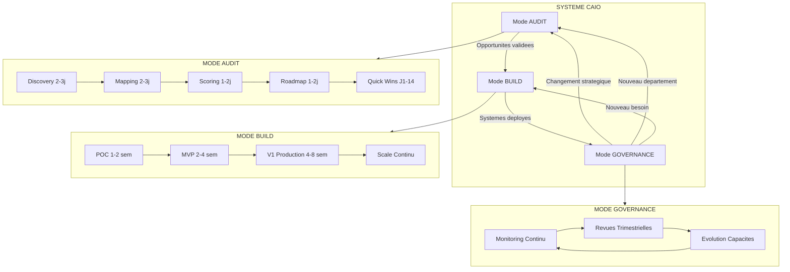
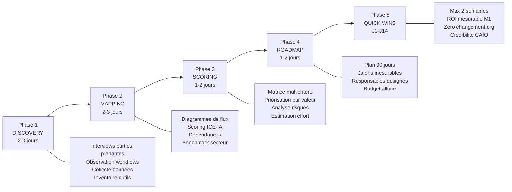
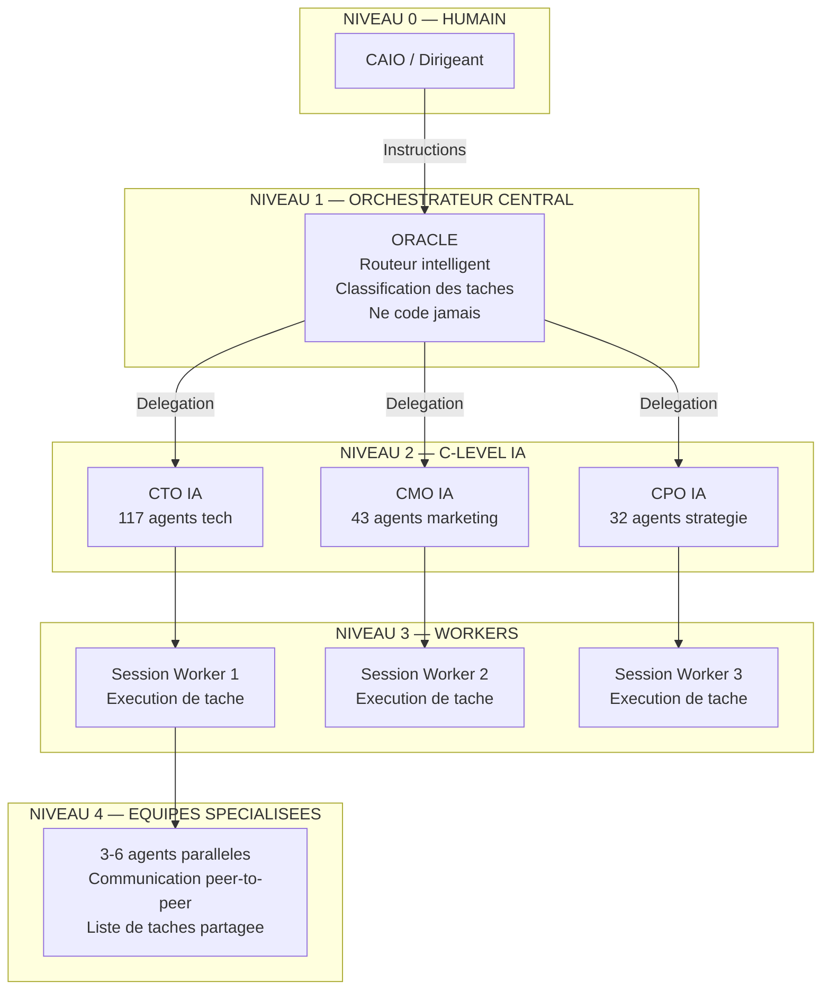
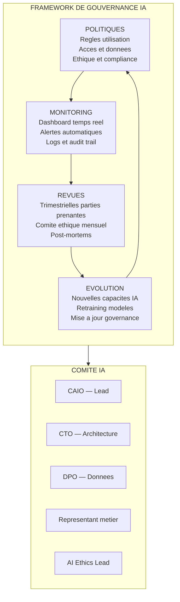

# AI CAIO Roles : Implementation & Audit

Comment structurer le role de CAIO dans une organisation : perimetre de responsabilite, methodologie d'audit, implementation des systemes IA, mesure du ROI, et gouvernance continue.

---

## Objectif du module

A l'issue de ce module, vous aurez une methodologie d'audit IA structuree et reproductible, la capacite a implementer des systemes IA de l'idee a la production, un framework de gouvernance IA pour l'amelioration continue, et une comprehension operationnelle de l'architecture d'orchestration multi-agents.

---

## Lecon 1 — Definir le perimetre CAIO : audit vs build vs governance

### Contenu detaille

Le CAIO porte quatre casquettes simultanement : **Conseiller Strategique**, **Leader Technique**, **Champion Culturel** et **Gardien Ethique**. La ponderation entre ces dimensions varie selon la maturite IA de l'organisation. Aucune ne peut etre negligee sans compromettre l'edifice.

**Les 3 modes operatoires du CAIO :**

| Mode | Quand | Livrable | Duree typique |
|------|-------|----------|---------------|
| **Audit** | Premiere intervention, nouveau client | Rapport d'opportunites + roadmap | 1-2 semaines |
| **Build** | Apres validation de l'audit | Systemes IA fonctionnels | 3-8 semaines |
| **Governance** | Systemes en production | Monitoring, optimisation, evolution | Continu |

**Matrice de decision par situation :**

| Situation | Mode recommande | Justification |
|-----------|----------------|---------------|
| Nouveau client, premiere rencontre | Audit (toujours) | Reveler les opportunites que le client ne voit pas |
| Client convaincu, budget valide | Build | Passer directement a l'implementation |
| Systemes deployes, besoin de suivi | Governance | Monitoring, optimisation, evolution |
| Changement de direction/strategie | Audit (re-evaluation) | Realigner l'IA sur la nouvelle strategie |
| Nouveau departement a transformer | Audit + Build | Diagnostic specifique puis implementation |
| Incident ethique ou reglementaire | Governance urgente | Activation du protocole d'incident |
| Scaling de 3 a 30 projets | Build + Governance | Industrialisation des processus |

**La regle d'or :** Toujours commencer par un audit, meme si le client "sait ce qu'il veut". L'audit revele des opportunites que le client ne voit pas et evite le syndrome du "POC-palooza" — une multiplication de preuves de concept sans strategie.

**Les 4 casquettes du CAIO et leur ponderation selon la maturite :**

| Dimension | Phase 1 : Exploration (0-12 mois) | Phase 2 : Industrialisation (12-36 mois) | Phase 3 : Transformation (36+ mois) |
|-----------|-----------------------------------|------------------------------------------|--------------------------------------|
| Conseiller Strategique | 40% | 30% | 25% |
| Leader Technique | 30% | 35% | 20% |
| Champion Culturel | 25% | 20% | 30% |
| Gardien Ethique | 5% | 15% | 25% |

**Allocation du temps du CAIO (repartition cible) :**

| Categorie | % du Temps | Activites Concretes |
|-----------|------------|---------------------|
| Strategique | 30% | Vision IA, roadmap, alignement C-Suite, preparation board |
| Operationnel | 25% | Revue portefeuille, stage-gates, resolution problemes |
| Relationnel | 20% | 1:1 C-Level, coaching equipe, networking externe |
| Innovation | 15% | Veille technologique, POC, hackathons |
| Gouvernance | 10% | Comite ethique, conformite reglementaire, audits |

**Diagnostic des desequilibres courants :**

| Desequilibre | Symptome | Correction |
|-------------|----------|------------|
| Trop operationnel (> 40%) | Le CAIO est le « super data scientist » | Deleguer, recruter un AI Engineering Manager |
| Trop strategique (> 45%) | Les projets stagnent, l'equipe se sent abandonnee | Instaurer des rituels operationnels |
| Pas assez d'innovation (< 10%) | L'entreprise prend du retard technologique | Bloquer du temps sacre, deleguer le reporting |
| Pas assez de gouvernance (< 5%) | Un incident ethique ou reglementaire survient | Structurer un comite, nommer un AI Ethics Lead |

### Exercice pratique

Pour 3 situations client differentes, identifiez le mode operatoire optimal et justifiez votre choix. Incluez : la repartition des 4 casquettes, l'allocation du temps recommandee, et les desequilibres a surveiller.

---

## Lecon 2 — Methodologie d'audit IA en 5 phases

### Contenu detaille

L'audit IA est le fondement de toute intervention CAIO. C'est un diagnostic complet qui revele les opportunites cachees, les goulots d'etranglement, et les risques ignores. La methodologie en 5 phases ci-dessous est reproductible pour toute organisation, de la PME de 20 personnes au grand groupe.

**Phase 1 — Discovery (2-3 jours)**

Objectif : comprendre l'organisation, ses processus, ses douleurs.

Activites :
- Interviews des parties prenantes (CEO, CTO, ops managers, equipes terrain)
- Observation directe des workflows actuels (shadow sessions)
- Collecte des donnees existantes (volumes, couts, temps, taux d'erreur)
- Identification des outils deja utilises (SaaS, Excel, processus manuels)
- Evaluation de la maturite data (qualite, accessibilite, gouvernance)

**Script d'interview Discovery (20 questions essentielles) :**

*Bloc 1 — Comprendre le contexte (5 questions) :*
1. "Decrivez une journee type dans votre departement."
2. "Quelles taches prennent le plus de temps chaque semaine ?"
3. "Quels processus generent le plus d'erreurs ou de frustrations ?"
4. "Si vous pouviez automatiser une seule chose, laquelle ?"
5. "Quel budget tech est disponible pour les 12 prochains mois ?"

*Bloc 2 — Evaluer la maturite (5 questions) :*
6. "Utilisez-vous deja des outils d'IA ? Lesquels ? Depuis quand ?"
7. "Comment evaluez-vous la qualite de vos donnees ?"
8. "Avez-vous un data engineer ou un data scientist dans l'equipe ?"
9. "Quels sont vos KPIs principaux et comment les mesurez-vous ?"
10. "Avez-vous deja tente un projet IA ? Quel a ete le resultat ?"

*Bloc 3 — Identifier les opportunites (5 questions) :*
11. "Quels processus sont les plus repetitifs et predictibles ?"
12. "Ou perdez-vous le plus de temps entre la demande client et la livraison ?"
13. "Quels sont vos couts operationnels les plus importants ?"
14. "Quels concurrents utilisent l'IA et comment ?"
15. "Quels sont les processus ou la decision humaine n'ajoute pas de valeur ?"

*Bloc 4 — Anticiper les resistances (5 questions) :*
16. "Comment votre equipe reagirait-elle a l'introduction d'outils IA ?"
17. "Y a-t-il des preoccupations sur la securite des donnees ?"
18. "Quels changements recents ont ete bien/mal recus par les equipes ?"
19. "Qui sont les leaders informels dans chaque departement ?"
20. "Quelles contraintes reglementaires devons-nous respecter ?"

**Phase 2 — Mapping (2-3 jours)**

Objectif : cartographier tous les processus et identifier les opportunites IA.

Activites :
- Diagramme de flux pour chaque processus cle (BPMN simplifie)
- Scoring ICE-IA (Impact, Confiance, Effort) pour chaque processus
- Identification des dependances et des goulots d'etranglement
- Benchmark avec les meilleures pratiques du secteur
- Cartographie des flux de donnees entre systemes

**Grille de scoring ICE-IA :**

| Critere | Note 1 | Note 3 | Note 5 |
|---------|--------|--------|--------|
| **Impact** | Gain marginal (<5% productivite) | Gain modere (10-30%) | Gain majeur (>30% ou nouveau revenu) |
| **Confiance** | Technologie experimentale | Cas d'usage valides ailleurs | Technologie maitrisee, preuves secteur |
| **Effort** | >6 mois, equipe dediee | 2-4 mois, 1-2 personnes | <1 mois, outils existants |

Score final = Impact x Confiance x Effort (max 125). Seuil de selection : >= 45.

**Phase 3 — Scoring (1-2 jours)**

Objectif : prioriser les opportunites par valeur attendue.

Matrice de scoring multicritere :

| Critere | Poids | Description |
|---------|-------|-------------|
| Impact financier | 30% | Economies ou revenus generes (quantifie en EUR) |
| Rapidite d'implementation | 20% | Temps pour deployer (semaines) |
| Risque technique | 15% | Complexite, dependances, qualite data |
| Impact organisationnel | 15% | Changement de processus/roles necessaire |
| Scalabilite | 10% | Peut-on etendre a d'autres equipes/departements ? |
| Quick win potential | 10% | Resultat visible rapidement pour la credibilite ? |

**Template de scoring (a remplir pour chaque opportunite) :**

| Opportunite | Impact (30%) | Rapidite (20%) | Risque tech (15%) | Impact org (15%) | Scalabilite (10%) | Quick win (10%) | **Score** |
|-------------|-------------|----------------|-------------------|-----------------|------------------|----------------|-----------|
| [Nom] | _/5 | _/5 | _/5 | _/5 | _/5 | _/5 | **_/5.0** |

**Phase 4 — Roadmap (1-2 jours)**

Objectif : plan d'action concret a 90 jours avec jalons mesurables.

Structure de la roadmap :
- **Phase 1 (J1-30) : Quick wins (3 max)**
  - Actions a ROI rapide et risque faible
  - Objectif : construire la credibilite du CAIO
  - Chaque action : responsable, budget, KPI de succes, deadline
- **Phase 2 (J31-60) : Systemes core (2 max)**
  - Projets de transformation a impact moyen-terme
  - Premiers projets necessitant changement organisationnel
- **Phase 3 (J61-90) : Scale (1-2 departements)**
  - Extension des succes a d'autres equipes
  - Mise en place de la gouvernance

**Template de roadmap 90 jours :**

| Semaine | Action | Responsable | Budget | KPI de succes | Statut |
|---------|--------|-------------|--------|---------------|--------|
| S1-S2 | Quick Win #1 : [description] | [nom] | [EUR] | [metrique mesurable] | [ ] |
| S3-S4 | Quick Win #2 : [description] | [nom] | [EUR] | [metrique mesurable] | [ ] |
| S5-S6 | Quick Win #3 : [description] | [nom] | [EUR] | [metrique mesurable] | [ ] |
| S7-S8 | Systeme Core #1 : [description] | [nom] | [EUR] | [metrique mesurable] | [ ] |
| S9-S10 | Systeme Core #2 : [description] | [nom] | [EUR] | [metrique mesurable] | [ ] |
| S11-S12 | Scale : [description] | [nom] | [EUR] | [metrique mesurable] | [ ] |

**Phase 5 — Quick Wins (J1-14)**

Objectif : prouver la valeur immediatement.

Regles non-negociables :
- Max 2 semaines de mise en place
- ROI mesurable des le premier mois
- Necessitent zero changement organisationnel
- Impressionnent les decideurs
- Utilisent des outils matures (pas de technologie experimentale)

Exemples de quick wins par secteur :

| Secteur | Quick Win | Temps | ROI attendu |
|---------|-----------|-------|-------------|
| E-commerce | Chatbot support client automatise | 5 jours | -40% tickets L1 |
| Cabinet comptable | Classification automatique de documents | 7 jours | -60% temps de tri |
| Agence marketing | Generation de variations de copie publicitaire | 3 jours | +200% vitesse production |
| SaaS | Resume automatique des tickets support | 5 jours | -30% temps analyse |
| Industrie | Detection d'anomalies sur images produit | 10 jours | -50% taux de defauts echappes |

### Exercice pratique

Realisez un audit IA complet (les 5 phases) pour une entreprise fictive de 20 personnes dans le e-commerce. Livrable : rapport d'audit de 5 pages incluant les grilles de scoring remplies, la roadmap 90 jours, et 3 quick wins concrets.

**Templates fournis :**
- Guide d'interview Discovery (20 questions ci-dessus)
- Grille de scoring ICE-IA
- Template de scoring multicritere
- Template de roadmap 90 jours
- Modele de rapport d'audit (structure en 5 sections)

---

## Lecon 3 — Architecture du systeme CAIO : orchestration multi-agents

### Contenu detaille

Le CAIO ne deploie pas des outils isoles. Il construit un **systeme vivant** d'intelligence artificielle — un ecosysteme d'agents specialises qui agissent, apprennent et se coordonnent de maniere autonome. Cette lecon couvre l'architecture technique que tout CAIO doit maitriser pour passer de l'IA-outil a l'IA-infrastructure.

**Architecture hierarchique en 5 niveaux :**

**Pipeline d'orchestration en 5 phases (ORACLE → SMITH) :**

| Phase | Agent | Role | Livrable |
|-------|-------|------|----------|
| 1. Routage | ORACLE | Classifier et router la tache | Decision de delegation |
| 2. Planification | KEYMAKER | Decomposer en sous-taches | Plan DAG avec dependances |
| 3. Execution | MORPHEUS | Executer avec equipes paralleles | Code, contenu, analyses |
| 4. Audit | SERAPH | Verifier la qualite | Rapport d'audit avec score |
| 5. Apprentissage | SMITH | Extraire les patterns appris | Memoire consolidee |

**Regle d'or de l'architecture :** Personne ne saute un niveau. L'orchestrateur ne code jamais. Les workers ne reportent pas directement au CAIO. Chaque agent a une responsabilite unique.

**Classification des taches par complexite :**

| Niveau | Signaux | Action | Exemple |
|--------|---------|--------|---------|
| SIMPLE | Verification rapide, read-only | Oracle execute seul | "Quel est le statut du deploiement ?" |
| MEDIUM | Multi-fichier, pattern connu | 1 worker specialise | "Corriger le bug d'authentification" |
| COMPLEX | Multi-domaine, 30min+ | Equipe de 3-6 agents | "Refondre le dashboard complet" |
| EPIC | Cross-departement, heures+ | Pipeline complet a 5 phases | "Auditer et transformer le marketing" |

**Deux patterns de delegation :**

| Critere | Sous-Agents (subagents) | Equipes d'Agents (teams) |
|---------|------------------------|-------------------------|
| Communication inter-agents | Non (rapport unique vers l'appelant) | Oui (peer-to-peer en temps reel) |
| Liste de taches partagee | Non | Oui (auto-coordination) |
| Cout en tokens | Plus faible | Plus eleve |
| Ideal pour | Taches focalisees et independantes | Travail complexe necessitant collaboration |
| Nombre d'agents recommande | 1-3 | 3-8 |

**Prevention des conflits — File Ownership :**

Dans un systeme multi-agents, chaque fichier appartient a un seul agent. Le CAIO definit les frontieres de propriete dans chaque prompt de delegation :
- Chaque agent recoit la liste explicite des fichiers qu'il possede
- Les fichiers des autres agents sont declares "ne pas modifier"
- Pour les projets critiques, les worktrees Git isolent completement chaque agent

### Exercice pratique

Concevez l'architecture d'agents pour une entreprise SaaS de 50 personnes. Definissez : la hierarchie sur 4 niveaux, les agents necessaires par departement, les patterns de delegation, et les regles de propriete de fichiers.

---

## Lecon 4 — Implementation : du pilot au systeme en production

### Contenu detaille

**Selectionner le bon premier projet :**

Criteres du projet pilote ideal :
- Impact visible par la direction (les decideurs voient le resultat)
- Risque technique faible (technologie maitrisee, pas experimentale)
- Donnees disponibles et de qualite (pas de data cleaning de 3 mois)
- Champion interne enthousiaste (un sponsor metier engage)
- Resultat mesurable en moins de 30 jours (KPI quantifie avant/apres)

**Pipeline d'implementation POC → Production :**

```mermaid
flowchart LR
    subgraph G0["G0 — IDEATION"]
        I1[Probleme valide]
        I2[Sponsor identifie]
        I3[Donnees evaluees]
    end

    subgraph G1["G1 — FEASIBILITY"]
        F1[POC 1-2 semaines]
        F2[Demo fonctionnelle]
        F3[ROI confirme]
    end

    subgraph G2["G2 — DEVELOPMENT"]
        D1[MVP 2-4 semaines]
        D2[5 utilisateurs actifs]
        D3[Architecture scalable]
    end

    subgraph G3["G3 — PRODUCTION"]
        P1[V1 4-8 semaines]
        P2[0 downtime 7 jours]
        P3[Monitoring en place]
    end

    subgraph G4["G4 — SCALE"]
        S1[Adoption > 60%]
        S2[ROI realise]
        S3[Documentation complete]
    end

    G0 -->|Go / Kill| G1
    G1 -->|Go / Pivot / Kill| G2
    G2 -->|Go / Kill| G3
    G3 -->|Go / Kill| G4

    style G0 fill:#e1f5fe
    style G1 fill:#e8f5e9
    style G2 fill:#fff3e0
    style G3 fill:#fce4ec
    style G4 fill:#f3e5f5
```

**Criteres de passage par stage-gate :**

| Gate | Nom | Criteres de passage | Decideur |
|------|-----|---------------------|----------|
| G0 | Ideation | Probleme valide, sponsor identifie, donnees evaluees | CAIO |
| G1 | Feasibility | POC reussi, metriques techniques atteintes, ROI confirme | CAIO + Sponsor |
| G2 | Development | MVP valide par les utilisateurs, architecture scalable, tests passes | CAIO + CTO |
| G3 | Production | SLA definis, monitoring en place, formation faite, rollback planifie | CAIO + COO |
| G4 | Scale | Adoption > 60%, ROI realise, documentation complete | CAIO + CEO |

**Kill Criteria (definis des le G0) :**

| Critere de Kill | Seuil | Action |
|-----------------|-------|--------|
| POC non concluant apres 8 semaines | Performance < 70% de la cible | Kill ou pivot radical |
| Budget depasse de > 50% | Cout > 1.5x estimation initiale | Revue go/no-go avec CFO |
| Sponsor business desinteresse | Pas de participation aux revues pendant 1 mois | Escalation CEO puis kill |
| Donnees insuffisantes apres 3 mois | Quality score < 60% | Kill ou pivoter vers un cas data-ready |
| Modele non performant apres 3 iterations | Metriques stagnantes | Kill, post-mortem, lessons learned |

**Gestion des risques :**

| Risque | Probabilite | Impact | Mitigation |
|--------|-----------|--------|-----------|
| Qualite IA insuffisante | Moyen | Eleve | Tests rigoureux, humain dans la boucle (HITL) |
| Adoption faible | Eleve | Eleve | Formation, champions internes, UX simple |
| Depassement budget | Moyen | Moyen | Jalons clairs, scope fige par phase, kill criteria |
| Regression | Faible | Eleve | Monitoring continu, rollback automatique |
| Model drift en production | Moyen | Moyen | Detection de drift automatique, seuils d'alerte, retraining |
| Dependance fournisseur (lock-in) | Moyen | Eleve | Standards ouverts, evaluation portabilite |
| Incident ethique | Faible | Critique | Ethics by design, AIA des le G0, comite ethique |

**Framework de selection technologique :**

| Critere | Poids | Questions Cles |
|---------|-------|----------------|
| Maturite technologique | 20% | Depuis quand en production ? Clients references ? |
| Securite et compliance | 20% | SOC2 ? ISO 27001 ? RGPD ready ? |
| Roadmap et vision | 15% | Alignement avec notre strategie ? R&D investissement ? |
| Integration | 15% | APIs ouvertes ? Compatibilite stack existant ? |
| Support et SLA | 10% | Temps de reponse ? Equipe dediee ? |
| Pricing et TCO | 10% | Modele tarifaire ? Couts caches ? Scalabilite des couts ? |
| Lock-in et portabilite | 10% | Export des modeles ? Standards ouverts ? |

### Exercice pratique

Planifiez l'implementation d'un chatbot support client : selection du projet avec les criteres G0, POC en 1 semaine, MVP en 3 semaines, plan de scaling. Definissez les kill criteria et la matrice de risques.

---

## Lecon 5 — Gouvernance IA : politiques, monitoring, amelioration continue

### Contenu detaille

La gouvernance IA est le systeme immunitaire de la transformation. Sans elle, l'organisation est vulnerable aux incidents ethiques, aux violations reglementaires et a la perte de confiance. Le CAIO met en place un ensemble de frameworks interconnectes couvrant l'ethique, la reglementation, le cycle de vie des modeles et l'evaluation des fournisseurs.

**Framework de gouvernance IA en 4 piliers :**

**Comite IA :**
- Composition : CAIO (lead), CTO, representant metier, DPO, AI Ethics Lead
- Frequence : Mensuel (extraordinaire sur incident)
- Decisions : nouveaux projets, budget, escalades, incidents ethiques
- Livrables : compte-rendu + plan d'action + decisions documentees

**Framework ethique IA — 6 principes fondamentaux :**

| Principe | Description | Mesure Concrete |
|----------|-------------|-----------------|
| **Equite** | Les modeles ne discriminent pas | Bias audit systematique avant deploiement |
| **Transparence** | Les decisions IA sont explicables | Explainability report par modele |
| **Vie Privee** | Les donnees personnelles sont protegees | Privacy Impact Assessment (PIA) |
| **Securite** | Les modeles resistent aux attaques | Red teaming, adversarial testing |
| **Responsabilite** | Un humain est toujours responsable | RACI par modele, escalation path defini |
| **Durabilite** | L'empreinte carbone IA est maitrisee | Carbon footprint tracking par workload |

**EU AI Act — Matrice de Risque :**

| Niveau de Risque | Exemples | Obligations | Action CAIO |
|-----------------|----------|-------------|-------------|
| **Inacceptable** | Scoring social, manipulation subliminale | Interdit | Ne pas developper, auditer l'existant |
| **Haut Risque** | Recrutement IA, scoring credit, diagnostic medical | Documentation technique, monitoring continu, audit externe | Registre detaille, budget audit |
| **Risque Limite** | Chatbots, deepfakes, emotion recognition | Obligations de transparence | Disclosure aux utilisateurs |
| **Risque Minimal** | Recommandations contenu, spam filters | Pas d'obligations specifiques | Code de conduite volontaire |

**Checklist de conformite EU AI Act (Systemes Haut Risque) :**
- [ ] Systeme de management de la qualite documente
- [ ] Documentation technique complete et a jour
- [ ] Conservation des logs pendant toute la duree de vie du systeme
- [ ] Transparence et information aux deployeurs
- [ ] Supervision humaine effective
- [ ] Robustesse, exactitude et cybersecurite
- [ ] Data governance pour les jeux d'entrainement
- [ ] Enregistrement dans la base de donnees EU
- [ ] Evaluation de conformite (auto-evaluation ou organisme notifie)

**Monitoring en production :**

| Metrique | Frequence | Seuil d'alerte | Action |
|----------|-----------|---------------|--------|
| Disponibilite | Temps reel | < 99.5% | Notification immediate + escalation |
| Temps de reponse | Temps reel | > 5s | Investigation performance |
| Taux d'erreur | Horaire | > 5% | Review des logs + rollback si >10% |
| Model drift | Quotidien | > 5% degradation | Escalation MLOps, revue modele |
| Satisfaction utilisateur | Hebdo | < 4/5 | Ajustement UX + retraining |
| Cout API | Quotidien | > budget +20% | Optimisation, cache, model switching |
| Bias detection | Mensuel | Tout ecart significatif | Audit ethique + retraining |

**Cycle de vie complet d'un modele IA :**

| Phase | Activites | Gate de validation |
|-------|-----------|-------------------|
| Design | Problem framing, data assessment, approche | Design Review |
| Development | Feature engineering, training, evaluation, bias testing | Model Review |
| Validation | A/B testing, shadow mode, user acceptance testing | Validation Gate |
| Deployment | Containerisation, CI/CD, monitoring setup, rollback plan | Deployment Gate |
| Operations | Performance monitoring, drift detection, retraining triggers | Operational Review (mensuelle) |
| Retirement | Deprecation plan, data archiving, documentation | Retirement Gate |

### Exercice pratique

Redigez la charte de gouvernance IA pour une organisation fictive. Definissez : comite IA (composition, frequence), framework ethique (6 principes avec mesures concretes), checklist EU AI Act, et tableau de monitoring avec seuils d'alerte.

---

## Lecon 6 — Mesurer le ROI IA : metriques et reporting

### Contenu detaille

Le CAIO est mesure sur sa capacite a creer de la valeur. Son scorecard est un melange de metriques quantitatives (ROI, adoption, production) et qualitatives (credibilite board, satisfaction sponsors). Cette lecon couvre le systeme complet de mesure et de reporting.

**Les 4 axes de mesure :**

| Axe | Metriques | Exemple concret |
|-----|-----------|-----------------|
| **Temps** | Heures economisees, time-to-delivery | -60% temps de redaction de contenu |
| **Couts** | Cout par unite, economies totales | 150K EUR/an economises sur le support |
| **Revenus** | Leads generes, conversion, upsell | +35% taux de conversion landing pages |
| **Qualite** | Taux d'erreur, satisfaction, NPS | Taux d'erreur 5% → 0.5% |

**Scorecard du CAIO (revue trimestrielle avec le CEO) :**

| Dimension | Metrique | Cible Annuelle | Source |
|-----------|----------|----------------|--------|
| Strategie | % du board deck approuve sans revision majeure | > 80% | Post-board feedback |
| Execution | Nombre de modeles passes en production | +50% vs N-1 | Model registry |
| Valeur | ROI moyen du portefeuille IA | > 3x sur 18 mois | Finance |
| Adoption | % d'employes utilisant un outil IA quotidiennement | > 50% a 12 mois | Analytics |
| Talent | Turnover equipe IA | < 12% | HR |
| Innovation | Nombre de POC lances depuis les hackathons | > 5 par an | PMO |
| Gouvernance | Zero incident ethique majeur | 0 | Incident register |
| Culture | AI Champions actifs | > 1 pour 40 employes | Tracking reseau |

**Metriques operationnelles (dashboard quotidien) :**

| Categorie | Metrique | Formule | Cible |
|-----------|----------|---------|-------|
| Adoption | AI Adoption Rate | (Utilisateurs actifs IA / Total employes) x 100 | > 50% a 18 mois |
| ROI | AI Portfolio ROI | (Valeur generee - Investissement) / Investissement | > 200% a 24 mois |
| Vitesse | Time-to-Production | Date deploiement - Date intake | < 4 mois (moyenne) |
| Qualite | Model Accuracy Retention | Performance actuelle / Performance au deploiement | > 95% |
| Efficience | Cost per Prediction | Cout infrastructure / Nombre predictions | Decroissant par trimestre |
| Scale | Models in Production | Nombre de modeles actifs en production | +30% par an |
| Pipeline | POC-to-Production Rate | Modeles en prod / POC lances | > 40% |

**Dashboard de suivi mensuel (structure) :**

1. Resume executif (3 lignes max : tendance, alerte, victoire)
2. KPIs du mois (4-6 metriques cles avec tendance)
3. ROI cumule depuis le debut du programme
4. Comparaison objectifs vs realise (avec ecarts expliques)
5. Top 3 prochaines actions prioritaires
6. Risques et mitigations actives

**Reporting au board :**
- Frequence : Trimestriel
- Format : 12-15 slides max, 30 minutes
- Contenu : resultats business (pas technique), ROI, roadmap, decisions requises
- Ton : business, pas technique — "reduction de 30% du temps de traitement" plutot que "modele NLP fine-tune"

**Les 7 regles de la presentation au board :**
1. Parler business, pas techno
2. Quantifier tout (chaque initiative a un chiffre de ROI)
3. Comparer aux concurrents
4. Montrer le risque de ne rien faire
5. Etre honnete sur les echecs
6. Demander des decisions claires
7. Limiter a 15 slides

**Modele de maturite IA (5 niveaux) :**

| Niveau | Nom | Indicateurs |
|--------|-----|-------------|
| 1 | **Ad Hoc** | < 3 projets IA, pas de CAIO, pas de budget dedie |
| 2 | **Emergent** | 3-10 projets, CAIO nomme, budget > 100K EUR |
| 3 | **Operationnel** | 10-30 projets, modeles en production, CoE actif |
| 4 | **Avance** | 30-100 projets, ROI mesure, adoption > 50% |
| 5 | **Transforme** | > 100 applications IA, IA dans chaque decision |

### Exercice pratique

Construisez un dashboard ROI IA complet pour 6 mois avec des donnees fictives realistes. Incluez : les 4 axes de mesure, le scorecard CAIO, et preparez une presentation board de 12 slides.

---

## Lecon 7 — Automatisation et scheduling : l'IA qui agit sans supervision

### Contenu detaille

Le CAIO ne se contente pas de deployer des outils interactifs. Il construit des **systemes autonomes** qui operent 24/7 — des pipelines d'automatisation qui collectent, analysent, decidissent et agissent sans intervention humaine. Cette lecon couvre les patterns d'automatisation enterprise et le scheduling.

**Les 3 modes de scheduling IA :**

| Mode | Intervalle min | Machine requise | Persistance | Ideal pour |
|------|---------------|-----------------|-------------|------------|
| Cloud Schedule | 1 heure | Non (infra cloud) | Permanente | Rapports quotidiens, audits hebdo |
| Desktop Schedule | 1 minute | Oui | Permanente | Monitoring local, CI/CD |
| Loop en session | 1 minute | Oui (session active) | Session | Surveillance temps reel |

**Patterns d'automatisation enterprise :**

*Pattern 1 — Morning Briefing du CAIO (Cloud, quotidien 7h) :*
Collecte les 24 dernieres heures d'activite de tous les projets. Synthetise : nouveaux commits, PRs ouvertes, tests echoues, deploiements, alertes monitoring. Livre un brief executif de 1 page via Slack et Telegram.

*Pattern 2 — Audit de securite continu (Cloud, hebdomadaire) :*
Scanne les dependances de tous les repositories pour des vulnerabilites (CVE score >= 7). Cree une issue pour chaque vulnerabilite critique. Poste un resume dans le canal securite.

*Pattern 3 — Monitoring KPIs metier (Loop, toutes les 30 min) :*
Verifie les KPIs de la plateforme : taux de conversion, latence API, erreurs 500, MRR. Si un KPI sort de la plage normale, alerte immediatement avec contexte et recommandation.

*Pattern 4 — Pipeline de contenu automatise (Cloud, quotidien) :*
De l'ideation a la publication : trend spotting → redaction → revue qualite (scoring 100 points) → optimisation SEO → publication → promotion multi-plateforme. Duree totale : 15-25 minutes.

**Systeme de hooks — automatisation et controle :**

Les hooks interceptent chaque evenement du cycle de vie d'un agent et y associent une action automatique :

| Evenement | Declenchement | Usage Enterprise |
|-----------|---------------|-----------------|
| PreToolUse | Avant execution d'un outil | Validation, blocage actions dangereuses |
| PostToolUse | Apres execution reussie | Logging, tests automatiques, formatage |
| SessionStart | Demarrage d'une session | Injection de contexte, initialisation |
| Stop | Agent termine sa reponse | Validation finale, gate qualite |

Exemples concrets :
- **Hook RGPD** : bloque l'acces aux repertoires contenant des donnees personnelles
- **Hook audit** : journalise toutes les modifications de fichiers en JSONL immuable
- **Hook qualite** : bloque si les tests echouent apres modification de code
- **Hook alerting** : notification Slack/Telegram sur erreur critique

**Maturite progressive de l'automatisation :**

| Niveau | Mois | Capacites |
|--------|------|-----------|
| 1 — Assiste | 0-3 | 1 agent par tache, humain valide chaque etape |
| 2 — Semi-autonome | 3-6 | Equipes 3-5 agents, scheduling quotidien, premier pipeline |
| 3 — Autonome | 6-12 | Architecture complète, God Mode, dashboard monitoring |
| 4 — IA Enterprise | 12+ | 200+ agents, scheduling cloud 24/7, auto-amelioration |

### Exercice pratique

Concevez un systeme d'automatisation pour une agence marketing : definissez 4 pipelines automatises (contenu, reporting, monitoring, securite), les hooks de controle, et le calendrier de scheduling. Incluez les seuils d'alerte et les procedures d'escalation.

---

## Lecon 8 — Le CAIO comme agent de changement

### Contenu detaille

La transformation IA echoue dans 70% des cas non pas a cause de la technologie, mais a cause de l'humain. Les resistances au changement, la peur du remplacement, le scepticisme des managers intermediaires et l'inertie organisationnelle sont les vrais ennemis du CAIO.

**Gestion du changement organisationnel — les 5 phases (Kubler-Ross adapte) :**

1. **Deni** : "L'IA ne nous concerne pas" → Montrer des exemples concrets du secteur
2. **Resistance** : "Ca va remplacer nos emplois" → Expliquer l'augmentation vs le remplacement
3. **Exploration** : "Peut-etre que ca pourrait aider pour..." → Encourager les experimentations
4. **Engagement** : "J'utilise l'IA tous les jours" → Formaliser les bonnes pratiques
5. **Integration** : "Comment on faisait avant ?" → Mesurer et celebrer

**Reseau d'AI Champions :**

Le reseau d'AI Champions est le systeme nerveux de la transformation. Les champions sont les relais du CAIO dans chaque departement — des collaborateurs motives, credibles aupres de leurs pairs, et suffisamment formes pour identifier les cas d'usage et accompagner l'adoption.

| Element | Detail |
|---------|--------|
| Profil | Employes motives par l'IA, credibles dans leur departement, leaders informels |
| Selection | Nomination par le manager + validation CAIO, sur base du volontariat |
| Formation | 2 jours intensifs + demi-journee mensuelle + acces plateforme self-service |
| Mission | Identifier cas d'usage, evangeliser, remonter les freins, tester les outils |
| Reconnaissance | Badge AI Champion, visibilite interne, acces aux evenements, bonus objectif IA |
| Ratio | Minimum 1 champion pour 50 employes, ideal 1 pour 30 |

**Surmonter les resistances :**

| Resistance | Cause racine | Solution |
|-----------|-------------|---------|
| "C'est trop complique" | Peur de la technologie | Formation pratique (pas theorique), UX simple |
| "Mon job va disparaitre" | Peur du remplacement | Montrer l'augmentation (+50% productivite, meme role) |
| "La qualite n'est pas assez bonne" | Attentes irrealistes | Demonstrer sur des cas concrets, iterer |
| "On n'a pas le budget" | Resistance deguisee | Montrer le ROI en < 90 jours |
| "C'est une menace pour mon equipe" | Resistance politique | Alignement CEO, montrer la valeur departementale |
| "Encore un outil a apprendre" | Surcharge cognitive | Integration dans les outils existants, UX irreprocable |

**Programme de litteratie IA (4 niveaux) :**

| Niveau | Nom | Cible | Duree | Objectif Mesurable |
|--------|-----|-------|-------|--------------------|
| Bronze | AI Aware | 100% employes | 4 heures | Passer un quiz de comprehension (> 70%) |
| Silver | AI User | 50% employes | 2 jours | Utiliser 3 outils IA dans son travail quotidien |
| Gold | AI Practitioner | 15% employes | 5 jours | Creer un workflow IA fonctionnel pour son equipe |
| Platinum | AI Builder | 5% employes | Continu | Deployer un modele en production |

**Plan de communication structure :**

| Audience | Message | Canal | Frequence |
|----------|---------|-------|-----------|
| Board | IA comme levier strategique, ROI, risques maitrises | Board deck, memo executif | Trimestrielle |
| C-Suite | Progres, alignement, decisions requises | Comite executif, 1:1 | Hebdomadaire |
| Middle Management | Impact concret, changements, support disponible | Workshops, presentations | Mensuelle |
| Equipes operationnelles | "Voici comment l'IA vous aide", demos, formations | Intranet, demos live | Bi-mensuelle |

**Celebrer les victoires :**
- Newsletter interne mensuelle : "Le coup de genie IA du mois"
- Reconnaissance publique des early adopters
- Metriques partagees : "Cette semaine, l'IA a economise 40h a l'equipe"
- Hackathon IA semestriel : equipes cross-fonctionnelles, 48h, jury C-Level

### Exercice pratique

Creez un plan de gestion du changement IA pour une equipe de 15 personnes resistante. Incluez : diagnostic des resistances (utiliser le tableau), plan d'action sur 30 jours, programme de formation (4 niveaux), plan de communication, et metriques de succes.

---

## Lecon 9 — Les 90 premiers jours du CAIO et le scaling

### Contenu detaille

Les 90 premiers jours du CAIO sont decisifs. C'est la fenetre durant laquelle les impressions se forment, les alliances se construisent, et le ton de la transformation est donne.

**Les 90 premiers jours — 4 phases :**

| Phase | Semaines | Activites Cles | Livrables |
|-------|----------|----------------|-----------|
| **Ecouter** | S1-S4 | Tour d'ecoute C-Level, audit existant IA, inventaire projets | Diagnostic IA (forces, faiblesses, opportunites) |
| **Diagnostiquer** | S4-S6 | Evaluation maturite, gap analysis competences, benchmark concurrents | Rapport diagnostic avec score de maturite |
| **Planifier** | S6-S10 | Vision IA, identification 3-5 quick wins, structure organisationnelle | Vision IA + Roadmap 12 mois + 5 quick wins |
| **Lancer** | S10-S13 | Lancer 2-3 quick wins, recruter roles cles, installer rituels | Quick wins en cours, equipe en place, premiere newsletter IA |

**Les 5 regles des 90 premiers jours :**

1. **Ecouter avant de parler** — Comprendre la culture, l'histoire, les echecs passes
2. **Quick wins avant grand plan** — Credibilite d'abord, vision ensuite
3. **Allies avant restructuration** — Identifier 3-5 allies C-Level avant de proposer des changements
4. **Donnees avant modeles** — Evaluer l'etat des donnees avant de promettre des resultats IA
5. **Communication avant execution** — Tout le monde doit savoir pourquoi un CAIO a ete recrute

**Feuille de route 3 ans — Trois Horizons :**

| Horizon | Temporalite | Focus | % Budget | Objectif |
|---------|------------|-------|----------|----------|
| **H1 — Optimiser** | 0-12 mois | Efficacite operationnelle, quick wins | 70% | ROI rapide, credibilite |
| **H2 — Differencier** | 12-24 mois | Avantage competitif, produits augmentes | 20% | Differenciation marche |
| **H3 — Disrupter** | 24-36 mois | Nouveaux business models, innovation radicale | 10% | Positionnement futur |

**Scaler de 3 a 30 projets — les defis :**

| Defi | Solution |
|------|----------|
| Processus artisanaux qui ne scalent plus | Plateforme MLOps, standardisation pipelines |
| Equipe fondatrice submergee | Modele Hub & Spoke, AI Product Managers |
| Chaque projet reinvente la roue | Catalogue de composants reutilisables, feature store |
| Budget qui explose | Stage-gate, priorisation, kill criteria |
| Gouvernance inexistante | Comite ethique, AIA, model registry |
| Adoption qui stagne | Reseau AI Champions, programme de formation |

**Recuperer une transformation IA echouee :**

| Phase | Duree | Actions | Piege a Eviter |
|-------|-------|---------|----------------|
| Autopsie | 2 semaines | Analyser chaque projet echoue, interviewer sans jugement | Chercher des coupables |
| Transparence | 1 semaine | Diagnostic honnete au CEO et board, chiffrer les pertes | Minimiser les echecs |
| Quick Wins de Confiance | 4 semaines | 1-2 projets haute visibilite, faible risque, livrer en 30 jours | Projets trop ambitieux |
| Refondation | 3 mois | Restructurer equipe, nettoyer portefeuille, relancer 3-5 projets | Reproduire les memes erreurs |

**Gestion budgetaire du portefeuille IA :**

| Poste | % Budget Total | Description |
|-------|---------------|-------------|
| Infrastructure & Compute | 25-30% | Cloud GPU, plateformes MLOps, stockage |
| Equipe & Talent | 35-40% | Salaires, contractors, formation |
| Licences & Outils | 10-15% | Plateformes IA, APIs, outils de developpement |
| Innovation & R&D | 10-15% | POC, hackathons, partenariats academiques |
| Gouvernance & Compliance | 5-10% | Audits, outils d'ethique, certification |

**Regle du 70/20/10 :** 70% sur les projets Core (optimiser), 20% sur les projets Adjacent (differencier), 10% sur les projets Transformational (disrupter).

### Exercice pratique

Vous etes recrute comme CAIO dans une entreprise de 200 personnes qui a deja echoue une premiere transformation IA. Le board est sceptique, l'equipe data est demoralisee, et 3 POC sont en echec. Redigez votre plan des 90 premiers jours incluant : autopsie structuree, 3 quick wins identifies, roadmap 12 mois, et plan de scaling.

---

## Lecon 10 — Le CAIO de demain : agents autonomes et AGI

### Contenu detaille

La prochaine revolution pour le CAIO n'est pas un meilleur modele — c'est l'avenement des **agents autonomes**. Des systemes IA capables d'executer des workflows complets, de prendre des decisions complexes, et de collaborer entre eux dans des ecosystemes orchestres.

**Evolution du role du CAIO :**

| Dimension | Aujourd'hui (2024-2026) | Demain (Agents Autonomes) |
|-----------|------------------------|--------------------------|
| Portefeuille | Gere des projets IA | Gere des flottes d'agents |
| Equipe | Data Scientists + ML Engineers | Agent Architects + Agent Operators |
| Gouvernance | Ethique par modele | Ethique par agent (autonomie, limites, supervision) |
| Risque | Le modele se trompe | L'agent agit de maniere autonome et non souhaitee |
| Mesure | Accuracy, ROI | Agent productivity, task completion, cost per action |
| Architecture | Model-centric | Agent-centric (orchestration, memoire, outils) |

**Les nouvelles questions strategiques :**

- Quel niveau d'autonomie accorder a chaque agent ?
- Comment superviser des centaines d'agents operant 24/7 ?
- Qui est responsable quand un agent prend une mauvaise decision ?
- Comment eviter les comportements emergents non souhaites ?
- Comment mesurer le ROI d'un agent vs d'un employe humain ?

**Matrice de preparation AGI :**

| Dimension | Action Immediate (2024-2026) | Moyen Terme (2026-2028) | Long Terme (2028+) |
|-----------|------------------------------|--------------------------|---------------------|
| Strategie | Integrer le scenario AGI dans la planification | Simuler l'impact AGI par business unit | Pivoter le business model si necessaire |
| Talent | Former aux systemes multi-agents | Recruter profils AI Safety & Alignment | Repenser la relation humain-IA |
| Gouvernance | Principes d'autonomie IA | Frameworks de supervision a grande echelle | Standards internationaux |
| Infrastructure | Orchestration d'agents | Monitoring autonomes | Infrastructure post-AGI resiliente |

**Les 11 pieges du CAIO (checklist de vigilance permanente) :**

| # | Piege | Prevention |
|---|-------|------------|
| 1 | Syndrome du POC Perpetuel | Stage-gates stricts, kill criteria des le depart |
| 2 | Tour d'Ivoire IA | Hub & Spoke, AI Champions, co-creation avec les BU |
| 3 | Technology Push | Problem-first approach, business case obligatoire |
| 4 | Absence de Sponsor Business | Pas de G0 sans sponsor identifie et engage |
| 5 | Sous-Estimation des Donnees | Data readiness assessment avant tout projet |
| 6 | Perfectionnisme Technique | « Good enough » mindset, deployer tot, iterer en production |
| 7 | Oubli du Change Management | Budget change management = 15-20% du budget projet |
| 8 | Dependance Fournisseur Unique | Multi-cloud, standards ouverts, portabilite comme critere |
| 9 | Ethique comme Afterthought | Ethics by design, AIA des le G0, comite ethique actif |
| 10 | Reporting sans Action | Chaque metrique a un seuil d'alerte et une action associee |
| 11 | CAIO Operationnel | Recruter un Head of AI Engineering, deleguer l'execution |

**Les 10 principes du CAIO orchestrateur :**

1. **Separation des responsabilites** — Aucun agent ne fait tout. Planifier, executer, auditer et apprendre sont des roles distincts.
2. **Hierarchie stricte** — Les messages montent et descendent dans la chaine. Pas de sauts de niveaux.
3. **Verification avant completion** — Jamais de "c'est fait" sans preuve.
4. **Propriete des fichiers** — Chaque fichier appartient a un seul agent.
5. **Hooks pour la gouvernance** — Toute action critique passe par un hook de validation.
6. **MCP pour l'integration** — Protocole universel pour les systemes metiers.
7. **Scheduling pour la continuite** — Les taches recurrentes ne dependent pas de la presence humaine.
8. **Logs pour la conformite** — Chaque action tracee en JSONL immuable.
9. **Alerting intelligent** — Notifications sur anomalies reelles uniquement, pas de spam.
10. **Apprentissage continu** — Chaque tache completee rend la suivante meilleure.

### Exercice pratique

Redigez un memo strategique au board (5 pages max) presentant : l'evolution du role CAIO vers les agents autonomes, les risques et opportunites, la matrice de preparation AGI pour votre organisation, et une recommandation d'investissement sur 3 ans.

---

## Ce que cette formation apporte

- Methodologie d'audit IA structuree et reproductible en 5 phases
- Architecture d'orchestration multi-agents (hierarchie 5 niveaux, pipeline ORACLE→SMITH)
- Capacite a implementer des systemes IA du POC a la production avec stage-gates
- Framework de gouvernance IA complet (ethique, EU AI Act, monitoring, cycle de vie)
- Outils de mesure du ROI et de reporting au board (scorecard, dashboard, presentation)
- Systemes d'automatisation et scheduling pour l'IA enterprise 24/7
- Plan de gestion du changement avec reseau d'AI Champions
- Vision strategique du CAIO de demain (agents autonomes, preparation AGI)
