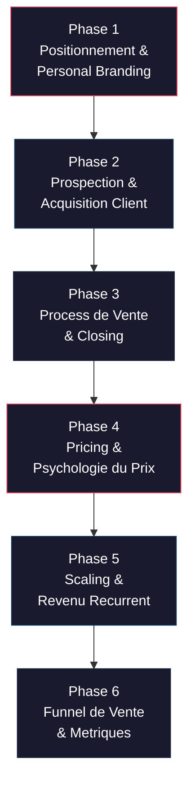
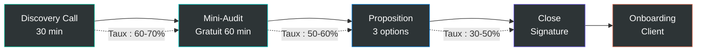
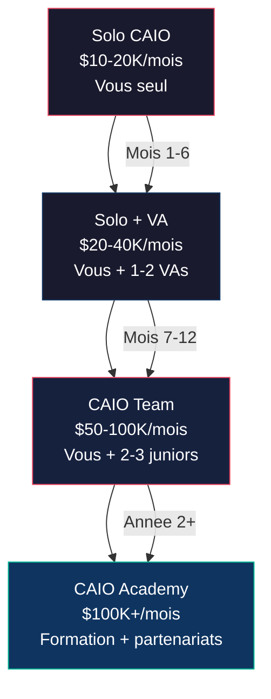
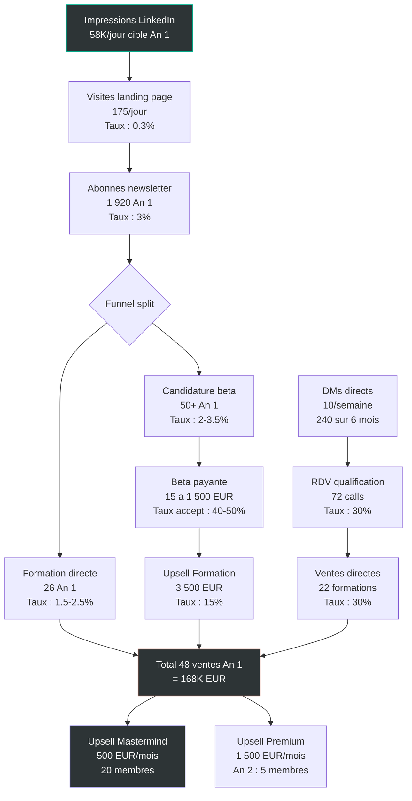

# CAIO Sales Master Class

Transformer ses competences IA en business rentable. Positionnement, prospection, closing, pricing, et construction d'un revenu recurrent en tant que Chief AI Officer freelance ou consultant.

---

## Objectif du module

A l'issue de ce module, vous aurez un positionnement clair et differenciant en tant que CAIO, un pipeline de prospection actif avec scripts et templates, un process de vente complet avec gestion des objections, un modele de pricing rentable et scalable fonde sur la psychologie du prix, et un plan de scaling de solo a cabinet CAIO avec unit economics valides.

---

## Vue d'ensemble du parcours de vente CAIO

---

## Lecon 1 — Le role de CAIO : comprendre ce que tu vends

### Contenu detaille

**Pourquoi ce role existe maintenant (et pas avant) :**

La convergence de 3 forces a cree une fenetre d'opportunite sans precedent :
1. **Modeles production-ready** : Claude, GPT-4, Gemini — les modeles sont sortis du labo et entrent en production
2. **Outils d'orchestration matures** : MCP, Claude Code, Composio — on peut construire des systemes complexes sans equipe de 10 devs
3. **Arbitrage de cout massif** : un CAIO remplace une equipe entiere pour 1/5eme du cout

**Timeline de l'evolution :**
- 2023 : ChatGPT hype — tout le monde parle d'IA, personne ne livre
- 2024 : Premiers outils serieux — les builders commencent a construire
- 2025 : Orchestration mature — les systemes IA tournent en production
- 2026 : **Le CAIO devient un poste standard** — les entreprises comprennent qu'elles ont besoin de ce role

**Definition precise du CAIO vs les autres roles :**

| Role | Facturation | Scalabilite | Ce qu'il vend | Plafond de revenu |
|------|-----------|-------------|---------------|-------------------|
| Freelance dev | $50-150/h | Faible | Son temps | $8-15K/mois (limite par les heures) |
| Consultant IA | $200-500/h | Moyenne | Ses conseils | $15-25K/mois (limite par le temps) |
| **CAIO** | **$4-15K/mois** | **Haute** | **Un systeme qui tourne** | **$50-100K+/mois (pas de plafond)** |
| Agence IA | $10-50K/projet | Moyenne | Un livrable ponctuel | Variable (feast or famine) |

**La difference fondamentale :** Le CAIO ne vend pas du temps ou des conseils — il vend un systeme qui genere de la valeur en continu. Le client paie un abonnement parce que le systeme produit des resultats chaque mois. C'est la difference entre vendre une heure de coaching et vendre un employe qui travaille 24/7.

**Le CAIO n'est PAS un role tech — c'est un role business qui utilise la tech.** Analogie : le CAIO est au CTO ce que le CEO est au manager — il voit le systeme, pas les taches.

**Les 6 responsabilites du CAIO :**

1. **Audit de la maturite IA** — Ou en est l'entreprise ? Quels processus sont automatisables ? Quel est le ROI potentiel ?
2. **Design de l'architecture IA** — Quel systeme construire ? Quels outils utiliser ? Comment tout s'integre ?
3. **Implementation des systemes** — Construire le systeme, le configurer, le deployer en production
4. **Orchestration en production** — Monitoring, maintenance, amelioration continue
5. **Leadership strategique (C-Suite)** — Presenter la roadmap IA au board, aligner la strategie IA avec la strategie business
6. **Mesure du ROI** — Prouver la valeur en chiffres, chaque mois, pour justifier l'investissement

**L'opportunite financiere — Les vrais chiffres :**

Cout d'une equipe traditionnelle vs systeme IA :

| Equipe traditionnelle | Cout annuel | CAIO equivalent | Economie |
|----------------------|-------------|-----------------|----------|
| CTO + 3 devs | $400-600K/an | $8-15K/mois | 70-85% |
| Equipe marketing 4 pers | $250-400K/an | $5-10K/mois | 75-90% |
| Equipe QA 2 pers | $150-250K/an | $3-5K/mois | 80-90% |
| Equipe support 5 pers | $200-350K/an | $4-8K/mois | 80-90% |

**Grille de revenus CAIO :**

| Offre | Prix | Clients simultanes | Revenu mensuel |
|-------|------|-------------------|----------------|
| Audit | $3-7K one-shot | 2-3/mois | $6-21K |
| Build | $15-45K one-shot | 1-2/trimestre | $5-15K (lisse) |
| Partnership | $4-15K/mois | 3-5 | $12-75K |
| **Combine** | | | **$23-111K/mois** |

### Exercice pratique

Ecrivez votre "elevator pitch CAIO" en 30 secondes. Template : "J'aide [CIBLE] a [RESULTAT] grace a des systemes IA qui [MECANISME]. En moyenne, mes clients [PREUVE]."

**Exemples par niche :**
- SaaS : "J'aide les SaaS de 10-50 employes a reduire leurs couts dev de 60% grace a des systemes IA qui automatisent le testing, le deploiement et le monitoring. En moyenne, mes clients economisent $15K/mois en 90 jours."
- E-commerce : "J'aide les e-commerces a automatiser le support client grace a des systemes IA qui resolvent 80% des tickets sans intervention humaine. En moyenne, mes clients divisent leur equipe support par 3."
- Agences : "J'aide les agences marketing a produire 10x plus de contenu grace a des systemes IA qui generent, editent et publient automatiquement. En moyenne, mes clients doublent leur output sans embaucher."

**Templates fournis :**
- Description de poste CAIO (a montrer aux prospects)
- Tableau comparatif cout equipe vs CAIO (personnalisable)
- Script d'elevator pitch (3 variantes par niche)

---

## Lecon 2 — Positionnement et personal branding CAIO

### Contenu detaille

**La formule de positionnement par niche :**

"J'aide les [NICHE] de [TAILLE] a [RESULTAT MESURABLE] en [TIMEFRAME]"

**10 exemples par niche :**
- SaaS : "J'aide les SaaS de 10-50 employes a reduire leurs couts dev de 60% en 90 jours"
- E-commerce : "J'aide les e-commerces a automatiser le support client pour -80% de tickets"
- Agences : "J'aide les agences marketing a produire 10x plus de contenu sans embaucher"
- Sante : "J'aide les cliniques a automatiser la prise de rendez-vous et le suivi patient"
- Immobilier : "J'aide les agences immobilieres a qualifier les leads automatiquement"
- Fintech : "J'aide les fintechs a automatiser la compliance et le KYC en divisant les delais par 5"
- Education : "J'aide les organismes de formation a personnaliser le parcours de chaque apprenant avec l'IA"
- Logistique : "J'aide les entreprises de logistique a optimiser les tournees et reduire les couts de 30%"
- Legal : "J'aide les cabinets d'avocats a automatiser la recherche juridique et la redaction de documents"
- RH : "J'aide les DRH a automatiser le screening des candidatures et le suivi des collaborateurs"

### Les 4 piliers de la presence en ligne

**Pilier 1 — LinkedIn (canal de vente #1) :**

C'est le terrain de jeu principal du CAIO. 80% de vos clients viendront de LinkedIn.

**Optimisation du profil :**
- **Headline** : "CAIO | J'aide les [NICHE] a [RESULTAT] avec l'IA" — pas de titre vague, pas de "passione par l'IA"
- **Photo** : Professionnelle, arriere-plan neutre, sourire
- **Banner** : Proposition de valeur + lien site web
- **About** : Structure PAS (Probleme, Agitation, Solution) en 3 paragraphes + CTA
- **Featured** : Votre meilleur cas d'etude, votre calendrier de booking, votre lead magnet

**Strategie de contenu LinkedIn :**

| Jour | Type de contenu | Objectif | Exemple |
|------|----------------|----------|---------|
| Lundi | Cas concret | Prouver l'expertise | "J'ai construit un systeme de monitoring IA pour une PME de 80 personnes en 3 jours. Voila l'architecture." |
| Mercredi | Prise de position | Creer le debat | "Le CTO qui ne sait pas pitcher une strategie IA a son board sera remplace dans 18 mois." |
| Vendredi | Stack breakdown | Eduquer | "Voici la stack complete que j'utilise pour construire un systeme IA en production." |

**Framework de contenu en 3 piliers :**
1. **Show** (40%) : Resultats clients avant/apres, cas d'etude chiffres, screenshots de dashboards
2. **Teach** (40%) : Tutoriels, frameworks, methodologies, templates actionables
3. **Tell** (20%) : Insights industrie, predictions, prises de position sur le marche IA

**Calendrier editorial type sur 4 semaines :**

| Semaine | Lundi (Show) | Mercredi (Tell) | Vendredi (Teach) |
|---------|-------------|-----------------|------------------|
| S1 | Cas client : monitoring IA | "Le CAIO va changer l'organigramme" | Stack 2026 : Next.js + Convex + Claude |
| S2 | Before/after systeme IA | "Les certifications IA generiques sont inutiles" | Tutoriel : orchestration en 30 min |
| S3 | Resultats chiffres client | "Le CAIO n'est pas un CTO qui code de l'IA" | Template : audit IA en 60 min |
| S4 | Retour d'experience beta | "5 erreurs des entreprises qui recrutent en IA" | Framework : pricing CAIO en 3 niveaux |

**Comment recycler 1 contenu en 5 formats :**
1. Post LinkedIn (500 mots)
2. Thread Twitter/X (10 tweets)
3. Video YouTube (5-10 min)
4. Email newsletter (800 mots)
5. Article blog SEO (1 500 mots)

**Pilier 2 — Site web personnel :**

Structure minimale mais efficace :
- **Page d'accueil** : Proposition de valeur en 1 phrase + 3 cas d'etude + CTA booking
- **Page services** : 3 offres claires (audit, build, partnership) avec prix affiches
- **Page cas d'etude** : 3-5 resultats clients documentes avec before/after
- **Lien de reservation** : Calendly/Cal.com pour les discovery calls

**Pilier 3 — Twitter/X :** Thought leadership, build in public, communaute IA builders

**Pilier 4 — Communaute (Discord/Telegram) :** Canal gratuit pour nurturing, canal premium pour clients

### Construire un portfolio quand tu n'as pas encore de clients

1. **Construis tes propres produits** — 2-3 SaaS MVPs qui demontrent tes capacites
2. **Offre 5 audits gratuits** — Documente tout, transforme en cas d'etude
3. **Contribue a l'open source** — MCP servers, skills Claude Code, outils IA
4. **Fais ton propre cas d'etude** — Documente comment tu as construit ta pratique CAIO

### Exercice pratique

Optimisez votre profil LinkedIn en 1 heure avec le template fourni. Redigez 5 posts d'avance selon le calendrier editorial. Programmez-les pour la semaine avec Typefully ou Buffer.

---

## Lecon 3 — Trouver ses premiers clients : les 5 canaux

### Contenu detaille

### Profil Client Ideal (ICP) — Les 6 criteres

Avant de prospecter, definissez votre ICP avec precision :

| Critere | Ideal | Acceptable | Red flag |
|---------|-------|------------|----------|
| Taille | 10-50 employes | 2-200 employes | Pre-revenue ou +500 employes |
| Revenue | $500K-$10M ARR | $100K-$50M ARR | Pas de revenu ou tres gros corporate |
| Equipe tech | 0-5 devs | 0-20 devs | +50 devs (pas besoin de vous) |
| Decision maker | Fondateur/CEO | CTO/COO | Middle managers |
| Budget | $5-15K/mois | $3-50K/mois | "On explore juste" |
| Douleur | "On doit aller plus vite" | "L'IA nous interesse" | "On veut juste voir" |

### Canal 1 — LinkedIn outbound (le plus efficace pour debuter)

**Strategie :** Ciblez les fondateurs qui postent des offres d'emploi dev (ils ont un besoin de capacity et un budget).

**Sequence de prospection en 3 etapes sur 2 semaines :**

**Message de connexion (J0) :**
> "Bonjour [Prenom], j'ai vu que vous cherchez un dev [technologie]. Curieux : avez-vous evalue ce qu'un systeme IA pourrait faire a la place ? Je viens d'aider une entreprise similaire a diviser ses couts dev par 3. Si ca vous interesse, je peux partager l'etude de cas."

**Message de valeur (J+3, si connexion acceptee) :**
> "Merci pour la connexion [Prenom]. Comme promis, voici l'etude de cas : [LIEN]. En resume : [ENTREPRISE SIMILAIRE] depensait $25K/mois en dev. Avec un systeme IA, ils sont passes a $8K/mois et livrent 2x plus vite. Si vous voulez qu'on regarde si ca s'applique a [NOM ENTREPRISE], je vous offre un audit de 30 minutes. Voici mon lien de booking : [CALENDLY]."

**Follow-up (J+10, si pas de reponse) :**
> "[Prenom], je ne voudrais pas etre insistant. Juste une question : est-ce que l'automatisation IA est un sujet pour [NOM ENTREPRISE] en ce moment ? Si non, aucun souci. Si oui, mon offre d'audit gratuit tient toujours."

**Objectif :** 20 messages/jour = 2-3 calls/semaine = 1-2 clients/mois

### Canal 2 — Contenu inbound

- **Blog SEO** : Articles optimises type "Comment reduire ses couts [DOMAINE] de 60% avec l'IA"
- **YouTube** : Tutoriels montrant des resultats concrets avec les outils IA
- **Newsletter (The CAIO Brief)** : Insights IA hebdomadaires, systemes decortiques, opportunites de marche

### Canal 3 — Reseau chaud

Message type a votre reseau :
> "Salut [Prenom], je me lance en tant que CAIO (Chief AI Officer externalize). En gros, j'aide les PMEs a construire des systemes IA qui tournent en autonome — automatisation, monitoring, orchestration d'agents. Tu connais des entreprises dans ton reseau qui galèrent avec [PROBLEME SPECIFIQUE] ? Je cherche 3 entreprises pilotes pour mon offre d'audit."

### Canal 4 — Partenariats strategiques

| Partenaire | Pourquoi | Comment |
|-----------|----------|---------|
| Agences web | Ils ont les clients, pas l'expertise IA | Proposez un white-label ou une commission de 15-20% |
| Comptables / conseillers d'entreprise | Ils voient les budgets et les douleurs operationnelles | Offrez un audit gratuit a leurs meilleurs clients |
| Incubateurs / accelerateurs | Ils ont des startups a transformer | Proposez des workshops de groupe |
| Cabinets de recrutement tech | Ils voient les besoins en IA | Positionnez-vous comme alternative a un recrutement |

### Canal 5 — Plateformes freelance (pour debuter)

- Toptal, Malt, Upwork, Comet (profil "AI Consultant" ou "AI Systems Architect")
- Accepter 2-3 missions a prix reduit pour construire le portfolio et les cas d'etude
- Objectif : sortir des plateformes en 3-6 mois grace au reseau construit

### Framework de qualification BANT-AI

Avant chaque call de qualification, scorez le prospect :

| Critere | Question | Vert | Orange | Rouge |
|---------|----------|------|--------|-------|
| **B**udget | "Quel est votre budget tech actuel ?" | $5K+/mois | $1-5K/mois | "On n'a pas de budget" |
| **A**utorite | "Qui decide des investissements tech ?" | "Moi" / "Mon co-fondateur" | "Mon manager + moi" | "Il faut passer par les achats" |
| **N**eed | "Quel est votre plus gros bottleneck ?" | Probleme operationnel precis | "L'IA nous interesse" | "On veut juste explorer" |
| **T**imeline | "Quand avez-vous besoin de resoudre ca ?" | "Ce mois-ci / ce trimestre" | "Cette annee" | "Pas de deadline" |
| **AI**-readiness | "Quels outils IA utilisez-vous ?" | "Quelques outils, on veut aller plus loin" | "ChatGPT pour des trucs basiques" | "Rien du tout" |

**Scoring :** Minimum 3 verts pour poursuivre. 2 rouges = ne pas investir plus de temps.

### Exercice pratique

Choisissez votre canal principal. Envoyez 20 messages cette semaine. Trackez dans le spreadsheet fourni : envoyes, reponses, calls booques, propositions envoyees, clients signes.

**Templates fournis :**
- 3 templates de connexion LinkedIn (par niche)
- Sequence email froide (3 emails sur 2 semaines)
- Tracker de prospection (spreadsheet)
- Script de qualification BANT-AI

---

## Lecon 4 — Le process de vente CAIO en 4 etapes

### Contenu detaille

### Pipeline de vente CAIO

### Etape 1 — Discovery Call (30 minutes)

**Structure minute par minute :**

| Minute | Phase | Ce que vous faites | Ce que vous dites |
|--------|-------|-------------------|-------------------|
| 0-3 | Rapport | Creer la connexion humaine | "Comment avez-vous entendu parler de moi ? Qu'est-ce qui vous a motive a prendre ce call ?" |
| 3-13 | Decouverte de la douleur | Comprendre LE probleme | "Quel est le plus gros goulot d'etranglement dans votre business en ce moment ? Combien ca vous coute ?" |
| 13-18 | Etat actuel | Mapper la situation | "Combien de personnes travaillent sur ce processus ? Combien d'heures par semaine ? Quel est le cout total ?" |
| 18-23 | Vision | Peindre le futur | "Imaginez : ce processus tourne en autonome, 24/7, pour 1/5eme du cout. Qu'est-ce que ca changerait ?" |
| 23-28 | Proposition | Recommander le premier pas | "Je recommande de commencer par un audit de 2 semaines. Ca me permet de valider les hypotheses et de vous livrer une roadmap concrete." |
| 28-30 | Next steps | Booker le suivi | "Je vous envoie une proposition demain. On se reparle vendredi pour en discuter ?" |

**Les 10 questions cles a poser :**
1. "Quel processus vous prend le plus de temps chaque semaine ?"
2. "Combien de personnes sont dediees a ce processus ?"
3. "Quel est le cout mensuel de cette equipe ?"
4. "Avez-vous deja essaye d'automatiser ca ? Qu'est-ce qui a marche ou echoue ?"
5. "Si ce processus tournait en autonome demain, combien d'argent ou de temps gagneriez-vous ?"
6. "Qui d'autre dans l'entreprise est impacte par ce probleme ?"
7. "Quel est votre budget pour resoudre ce type de probleme ?"
8. "Quand avez-vous besoin que ca soit resolu ?"
9. "Qu'est-ce qui vous empecherait de prendre une decision cette semaine ?"
10. "Si je vous demontre un ROI de 5x sur votre investissement, est-ce que c'est un go ?"

### Etape 2 — Audit gratuit (mini)

En 30-60 minutes, analysez GRATUITEMENT :
- 3 processus cles de l'entreprise
- Estimation du potentiel d'automatisation (en heures et en euros)
- Chiffrage approximatif des economies
- **Livrable : 1 page avec 3 recommandations concretes + estimation ROI**

**Pourquoi gratuit ?** C'est votre meilleur outil de conversion. Le client voit la valeur avant de payer. Il se dit : "Si l'audit gratuit est deja aussi bon, qu'est-ce que le service complet doit etre." Et psychologiquement, il vous est redevable (principe de reciprocite de Cialdini).

### Etape 3 — Proposition

**Structure de proposition gagnante (7 sections) :**

1. **Contexte** — Ce que vous avez appris pendant l'audit : "Votre entreprise depense actuellement $X/mois sur [PROCESSUS]. 3 personnes y consacrent 120h/semaine cumulees."
2. **Probleme** — Chiffre la douleur : "Ce processus vous coute $300K/an et ne scale pas."
3. **Solution** — Ce que vous proposez : "Un systeme IA qui automatise 80% de ce processus, supervise par votre equipe existante."
4. **Resultats attendus** — Chiffre le gain : "Economie estimee de $180K/an. ROI de 5x des le premier trimestre."
5. **Investissement** — 3 options (voir pricing) : Audit, Build, Partnership
6. **Timeline** — Jalons concrets : "Semaine 1-2 : audit. Semaine 3-6 : build. Semaine 7+ : production."
7. **Garantie** — Eliminer le risque : "Si l'audit ne revele pas $50K d'opportunites d'economies annuelles, je vous rembourse integralement."

### Etape 4 — Close

**Les 5 techniques de closing du CAIO :**

1. **Le choix (assumptive close)** : "Souhaitez-vous commencer par l'audit la semaine prochaine ou la suivante ?" — Ne demande pas SI, mais QUAND.

2. **Le recap ROI** : "Recapitulons : $3K d'investissement pour $15K d'economies identifiees. Ca fait un ROI de 5x. Ca vous parait logique ?" — Rend la decision irrationnelle a refuser.

3. **L'urgence naturelle** : "Je prends 3 nouveaux clients par trimestre. En ce moment il me reste 1 place pour Q2." — La rarete est reelle si vous gerez bien votre pipeline.

4. **Le trial close** : "Sur une echelle de 1 a 10, a quel point etes-vous convaincu que ca peut fonctionner ?" — Si 7+, closez. Si <7, demandez : "Qu'est-ce qu'il faudrait pour passer a 10 ?"

5. **La technique du calepin** : Listez visuellement les avantages vs le cout sur papier. Le rapport visuel 10 avantages pour 1 seul cout rend la decision evidente.

### Gerer les objections courantes

| Objection | Ce que le client pense vraiment | Votre reponse |
|-----------|-------------------------------|---------------|
| "L'IA n'est pas prete" | "J'ai peur que ca ne marche pas" | "Dis-moi quelles taches tu penses que l'IA ne peut pas gerer. Je te montre des exemples reels en production." |
| "C'est trop cher" | "Je ne vois pas encore le ROI" | "Combien depenses-tu pour [equipe/outils/outsourcing] ? Mon systeme coute 1/5eme. L'audit te donne les chiffres exacts." |
| "On a essaye ChatGPT" | "On a ete decus par l'IA" | "C'est comme comparer une calculatrice a un departement comptable. Je construis des systemes en production, pas des prompts." |
| "Et si ca marche pas ?" | "J'ai peur de perdre de l'argent" | "On commence par un audit a $3K avec garantie de resultat. Si les opportunites ne sont pas la, tu as un rapport complet. Zero risque." |
| "On peut pas faire ca nous-memes ?" | "Pourquoi te payer toi ?" | "Tu pourrais. Mais tu preferes passer 6 mois a apprendre, ou avoir un systeme en production dans 3 semaines ?" |
| "Je dois en parler a mon associe" | "J'ai besoin de validation externe" | "Excellent. Qu'est-ce que ton associe aurait besoin de voir pour etre convaincu ? Je peux preparer un document specifique." |
| "C'est pas le bon moment" | "Ce n'est pas une priorite" | "Je comprends. Juste une question : combien ca vous coute par mois de ne pas avoir ce systeme ? $15K ? $20K ? Chaque mois d'attente est un mois de depenses evitables." |

### Exercice pratique

Simulez un discovery call complet avec un partenaire. Enregistrez-vous. Auto-evaluez sur 10 criteres :
1. Ai-je pose des questions ouvertes (pas oui/non) ?
2. Ai-je ecoute plus que parle (ratio 70/30) ?
3. Ai-je chiffre la douleur du client ?
4. Ai-je peint une vision concrete du futur ?
5. Ai-je propose une next step claire ?
6. Ai-je gere au moins une objection ?
7. Ai-je utilise une technique de closing ?
8. Le client a-t-il accepte un next step ?
9. Le call a-t-il dure 30 minutes max ?
10. Ai-je cree un sentiment d'urgence naturel ?

---

## Lecon 5 — Pricing et psychologie du prix : l'art de facturer ce que vous valez

### Pourquoi cette lecon est la plus importante du module

**"Price is what you pay, value is what you get." — Warren Buffett**

Le prix n'est pas un chiffre. C'est une emotion. La plupart des CAIOs sous-facturent parce qu'ils pensent comme des techniciens au lieu de penser comme des entrepreneurs. Cette lecon va changer fondamentalement votre rapport au prix en vous revelant les mecanismes psychologiques qui gouvernent TOUTE decision d'achat.

### Le prix est une decision emotionnelle, pas rationnelle

Ce que vous croyez :
> Client voit le prix → Calcule la valeur → Decide (rationnel, logique)

Ce qui se passe vraiment :
> Client voit le prix → RESSENT quelque chose → Decide (emotion, instinct, biais)

**Le cerveau reptilien decide en 0.1 seconde. Puis le cerveau rationnel JUSTIFIE la decision.** Votre job n'est pas de convaincre le cerveau rationnel. Votre job est de creer la bonne emotion AVANT que le prix soit revele.

### Les 3 types de valeur

1. **Valeur fonctionnelle** — "Qu'est-ce que ca fait ?" → Features, gain de temps, resultats mesurables
2. **Valeur emotionnelle** — "Comment ca me fait sentir ?" → Status, confiance, tranquillite d'esprit
3. **Valeur sociale** — "Qu'est-ce que les autres vont penser ?" → Signal social, appartenance, exclusivite

**La plupart des CAIOs ne vendent que la valeur 1. Les CAIOs premium vendent les 3.**

### La grille tarifaire CAIO

| Offre | Prix | Contenu | Pour qui | Valeur percue |
|-------|------|---------|----------|---------------|
| **Audit IA** | $3-7K | Analyse + roadmap + 3 quick wins | Prospects curieux | "Ce rapport vaut $50K d'economies" |
| **Build IA** | $15-45K | Construction des systemes identifies | Clients convaincus | "Ce systeme remplace 3 employes" |
| **Partnership** | $4-15K/mois | CAIO dedie, amelioration continue | Clients long-terme | "Mon CAIO personnel pour le prix d'un stagiaire" |
| **Workshop** | $2-5K | Formation 1-2 jours pour equipe | Entreprises qui veulent internaliser | "Toute mon equipe forme en 2 jours" |

### Pricing par la valeur (JAMAIS par l'heure)

**Formule fondamentale :**

> **Votre Prix = Cout actuel du client x 30-50%**

Le client paie 30-50% de ce qu'il depense actuellement. Il economise 50-70%. Tout le monde gagne.

**Exemple detaille :**
- Le client depense $25K/mois en equipe support (5 personnes a $5K/mois)
- Votre systeme IA coute $5K/mois a operer (infrastructure + maintenance)
- Economie client : $20K/mois
- Votre prix : $8K/mois (40% de l'economie, soit 32% du cout actuel)
- Le client economise $12K/mois NET
- **Le client paie $8K pour economiser $12K. Decision irrationnelle a refuser.**

**Comment decouvrir le budget du client :**
- "Combien depensez-vous actuellement pour [PROCESSUS] ?" — Direct, professionnel
- "Si vous pouviez resoudre [PROBLEME] pour 10% de ce que ca vous coute aujourd'hui, ca vaudrait combien ?" — Fait calculer le client lui-meme
- "Quel est le cout de NE PAS resoudre ce probleme pendant 12 mois ?" — Active la loss aversion

### Les 12 biais psychologiques du prix

#### Biais 1 : L'Ancrage (Impact : majeur)

**Le premier chiffre vu influence TOUS les jugements suivants.**

Quand vous presentez vos offres :
- MAUVAIS : "Mon audit coute $5K"
- BON : "Mon package Partnership coute $15K/mois. Si vous voulez commencer plus leger, l'audit est a seulement $5K."

Apres avoir entendu $15K/mois, le cerveau percoit $5K comme une somme derisoire.

**Application CAIO :**
- Sur votre page pricing : affichez le tier le plus cher en premier (a gauche)
- En presentation : commencez par le package premium
- Dans vos emails : "Les entreprises depensent $400K/an pour une equipe dev. Mon systeme : $96K/an."
- En negociation : annoncez un prix 20-30% au-dessus de votre objectif

#### Biais 2 : L'Effet Leurre / Decoy Effect (Impact : majeur)

**Ajouter une option "leurre" pousse les clients vers l'option que VOUS voulez vendre.**

**Structure optimale des 3 tiers CAIO :**

| Tier | Role | Prix | Features | % clients |
|------|------|------|----------|-----------|
| **Audit** (entree) | Point d'entree, ancrage bas | $3-5K | Analyse + roadmap + 3 quick wins | 15-20% |
| **Build** (cible) | La ou vous voulez la majorite | $15-25K | Systeme complet + 3 mois support | 60-70% |
| **Partnership** (ancrage) | Ancrage haut + decoy | $10-15K/mois | CAIO dedie + amelioration continue | 15-20% |

**La regle du saut de prix :**
- Audit → Build : +200-400% en prix pour +500% de valeur percue (le build semble un deal incroyable)
- Build → Partnership : prix mensuel qui semble modeste vs le one-shot (mais sur 12 mois, c'est 2-3x plus cher)

#### Biais 3 : L'Aversion a la Perte / Loss Aversion (Impact : majeur)

**Les gens detestent PERDRE 2x plus qu'ils aiment GAGNER.**

| Message "gain" (faible impact) | Message "perte" (2x plus fort) |
|-------------------------------|-------------------------------|
| "Avec mon systeme, gagnez $15K/mois" | "Sans mon systeme, vous perdez $15K/mois" |
| "Automatisez 80% de vos taches" | "80% de votre temps est gaspille sans automatisation" |
| "Gagnez un avantage competitif" | "Votre concurrent IA vous depasse pendant que vous hesitez" |

**Application en closing :** Au lieu de dire "Voici ce que vous allez gagner", dites "Voici ce que vous perdez chaque mois en ne faisant rien." Le cout de l'inaction doit etre visible et chiffre.

#### Biais 4 : Le Pouvoir du Gratuit (Impact : majeur)

**"Gratuit" n'est pas un prix. C'est un declencheur emotionnel.**

C'est pourquoi l'audit gratuit (mini-audit de 30-60 min) est votre meilleur outil de conversion :
- Il elimine 100% du risque percu
- Il declenche le principe de reciprocite (Cialdini) : le client se sent redevable
- Il cree l'Endowment Effect : le client "possede" deja une partie de votre travail
- Il demonstre votre competence AVANT la demande de paiement

**Attention :** Le gratuit doit etre delimite. 30-60 minutes d'audit, pas 3 jours. Sinon vous devaluez votre travail.

#### Biais 5 : L'Heuristique Prix-Qualite (Impact : eleve)

**Plus c'est cher, plus ca semble bon. Le prix EST un signal de qualite.**

Dans la tete du client :
- $500/mois → "Hmm, c'est un petit consultant"
- $5K/mois → "OK, c'est un vrai professionnel"
- $15K/mois → "C'est du premium, il doit etre vraiment bon"

**Etude CalTech/Stanford :** Le meme vin vendu $5 est note 3/5 par les testeurs. Le meme vin vendu $45 est note 4.5/5 par les MEMES testeurs. Le prix change litteralement la perception de qualite.

**Regle CAIO :** Si vous vendez du premium, facturez du premium. Un prix bas envoie le signal "je ne suis pas si bon que ca".

#### Biais 6 : Le Charm Pricing / Le 9 Magique (Impact : eleve)

**$4,997 "semble" significativement moins cher que $5,000.**

| Contexte CAIO | Prix recommande | Pourquoi |
|---------------|-----------------|---------|
| Audit (B2B) | $5,000 | Chiffre rond = premium, B2B |
| Formation en ligne | $497 ou $997 | Charm pricing = B2C, maximise conversions |
| Partnership mensuel | $5,000/mois | Rond = serieux, professionnel |
| Workshop | $2,997 | Charm = semble plus accessible |

**Regle :** B2C et formations → charm pricing (.97, .99). B2B et consulting → chiffres ronds.

#### Biais 7 : Le Framing / Cadrage (Impact : eleve)

**Le meme prix presente differemment change la perception.**

Votre Partnership a $8K/mois peut etre presente comme :
- A) "$96,000 par an" → "Cher..."
- B) "$8,000 par mois" → "Hmm, OK..."
- C) "$266 par jour" → "C'est rien pour un CAIO !"
- D) "Moins cher qu'un dev junior a temps plein" → "Evidemment !"

**Le prix n'a PAS change. La perception, SI.**

**Meilleurs framings pour le CAIO :**
- **Comparaison familiere** : "Le prix d'un stagiaire pour un expert senior"
- **Par jour** : "$266/jour" au lieu de "$8K/mois"
- **ROI** : "Pour chaque $1 investi, recuperez $5"
- **Economie** : "Economisez $180K/an vs une equipe traditionnelle"
- **Cout de l'inaction** : "Ne rien faire vous coute $15K/mois"

#### Biais 8 : Le Bundling (Impact : eleve)

**Un bundle semble TOUJOURS plus valuable que la somme de ses parties.**

Au lieu de vendre :
- Audit : $5K
- Build : $25K
- 3 mois de support : $15K
- Total : $45K

Vendez : "Le Package Transformation Totale — Valeur $45K — Prix bundle : $35K (economie de $10K !)"

Resultat : le client paie $35K au lieu de $5K (s'il avait achete seulement l'audit). Vous faites 7x plus de revenu par client.

#### Biais 9-12 : Social Proof, Rarete, Chiffres ronds vs precis, Endowment Effect

**Social Proof :** "Rejoint par 200+ professionnels IA" sous votre prix. Les logos clients a cote de votre pricing.

**Rarete (reelle, jamais fausse) :** "3 places restantes ce trimestre." La rarete doit etre VRAIE. Les faux compteurs detruisent la confiance.

**Chiffres ronds vs precis :** $5,000 pour le B2B premium. $4,997 pour les formations B2C.

**Endowment Effect :** L'audit gratuit cree la possession psychologique. Le client a "ses" recommandations, "sa" roadmap. Abandonner = perdre ce qu'il a deja.

### Le Syndrome de l'Imposteur et le sous-pricing

Si 100% de vos prospects disent oui, **vous facturez trop peu**.

Le taux de closing ideal est 30-50%. Si personne ne dit "c'est cher", vous sous-facturez. Si tout le monde dit oui instantanement, votre prix est probablement a 30-50% de ce qu'il devrait etre.

**La spirale du sous-pricing :**
1. "Je ne suis pas si bon que ca..." (syndrome de l'imposteur)
2. "Je vais mettre un prix bas pour etre competitif"
3. Vous attirez des clients cheap qui demandent beaucoup
4. Vous vous epuisez pour pas grand-chose
5. "Le freelance, c'est nul"
6. **FAUX. C'est votre pricing qui est nul.**

### Negociation — les regles d'or

1. **Ne JAMAIS baisser le prix** — Ajoutez de la valeur a la place. "Je ne peux pas baisser a $3K, mais je peux inclure un mois de support supplementaire."
2. **"Flex" sur le scope, pas sur le tarif** — "Pour $3K, je peux faire l'audit de 2 processus au lieu de 3."
3. **Savoir dire non** — Un client rouge (budget insuffisant, attentes irrealistes) vous coutera plus qu'il ne rapportera. Referez-le a un junior.
4. **Le silence est votre arme** — Apres avoir annonce votre prix, TAISEZ-VOUS. Le premier qui parle perd.

### Exercice pratique

Construisez votre grille tarifaire CAIO. Pour chaque offre : contenu detaille, prix, livrable, duree, garantie. Testez votre pricing sur 3 personnes et notez leurs reactions.

---

## Lecon 6 — Scaler : de freelance solo a cabinet CAIO

### Contenu detaille

### La progression naturelle

**Detail par etape :**

| Etape | Revenu | Equipe | Focus | Heures/semaine par client |
|-------|--------|--------|-------|--------------------------|
| Solo | $10-20K/mois | Vous seul | Delivery + vente | 8-15h |
| Solo + VA | $20-40K/mois | Vous + 1-2 VAs | Delivery, VA fait l'admin | 4-8h |
| Team | $50-100K/mois | Vous + 2-3 CAIOs juniors | Vente + supervision | 2-4h |
| Academy | $100K+/mois | Formation + partenariats | Scaling illimite | 0-2h |

### Automatiser la livraison avec l'IA

Les systemes que vous construisez pour les clients peuvent aussi tourner pour VOUS :
- **Reporting automatise** : Vos clients recoivent un dashboard temps reel — pas besoin de creer des rapports manuels
- **Monitoring automatise** : Alertes si quelque chose casse — intervention reactive, pas proactive
- **Onboarding automatise** : Templates standardises pour chaque nouveau client — 80% du setup est identique
- **Objectif :** 2-4h/semaine par client en mode partnership (au lieu de 10-15h sans automatisation)

### Deleguer avec des sous-traitants

| Ce que vous deleguez | A qui | Budget mensuel | Quand |
|---------------------|-------|----------------|-------|
| Admin, scheduling, emails | VA generaliste (Philippines, Latam) | $500-800/mois | Des le premier client |
| Reporting, monitoring | VA technique | $800-1,500/mois | A partir de 3 clients |
| Implementation (builds) | Dev IA junior | $1,500-3,000/mois | A partir de 5 clients |
| Vente, qualification | SDR (Sales Dev Rep) | $2,000-3,500/mois | A partir de $40K/mois de revenu |

**Recrutement :**
- VA generaliste : OnlineJobs.ph, RemoteOK, Latam Remote
- Dev IA junior : freelance Upwork/Malt, ou recrutement direct via LinkedIn
- Formez-les avec VOS templates et VOS processus — c'est votre avantage competitif

### Unit economics du scaling

| Etape | Revenu/mois | Couts equipe | Couts infra | Marge nette | Marge % |
|-------|------------|-------------|-------------|-------------|---------|
| Solo (3 clients) | $15K | $0 | $500 | $14,500 | 97% |
| Solo + VA (5 clients) | $35K | $1,500 | $1,000 | $32,500 | 93% |
| Team (8 clients) | $70K | $8,000 | $2,000 | $60,000 | 86% |
| Academy (scaling) | $120K | $15,000 | $5,000 | $100,000 | 83% |

**Points de levier pour le scaling :**
- **Productiser votre audit** : Creer un outil self-service ($997) qui fait 80% du travail
- **Creer des templates vendables** : Vos systemes IA packages a $497-$997
- **Construire un cours** : $497-$997 par etudiant, scalable a l'infini
- **Programme d'affiliation** : 15-33% de commission recurring pour chaque referral
- **White-label** : Licencier vos systemes a d'autres CAIOs

### Plan business CAIO sur 12 mois

| Mois | Objectif revenu | Nombre clients | Actions principales | Investissements |
|------|----------------|---------------|-------------------|-----------------|
| 1-3 | $4K/mois | 1 | Prospection intensive, 1 audit gratuit/semaine, 20 DMs/jour | $0 (sueur) |
| 4-6 | $12K/mois | 3 | Referrals actifs, contenu LinkedIn quotidien, process de vente rode | $500/mois (VA) |
| 7-9 | $25K/mois | 5 | Premier VA embauche, templates standardises, debut formation junior | $1,500/mois (equipe) |
| 10-12 | $50K/mois | 5-7 | Deuxieme VA, junior en production, debut scaling academique | $3,000/mois (equipe) |

### Le flywheel CAIO

Le cercle vertueux qui accelere avec le temps :

1. **Construire des systemes** pour vos clients
2. **Montrer des resultats** (cas d'etude, chiffres, temoignages)
3. **Attirer de nouveaux clients** grace a la preuve sociale
4. **Standardiser vos systemes** en templates reutilisables
5. **Vendre les templates** ($497-997, revenu passif)
6. **Former d'autres CAIOs** ($2K-3.5K, scaling humain)
7. **Communaute de CAIOs** qui referent des clients
8. **Scale infini** sans plafond de temps

### Exercice pratique

Creez votre plan business CAIO sur 12 mois. Pour chaque trimestre : objectif de revenus, nombre de clients cible, actions de prospection, investissements prevus, metriques de suivi.

**Templates fournis :**
- Business plan CAIO 12 mois (spreadsheet)
- Job description VA (generaliste + technique)
- Framework de delegation (quoi deleguer, quand, a qui)
- Template de contrat CAIO Partnership

---

## Lecon 7 — Architecture du funnel de vente CAIO

### Contenu detaille

### Le funnel complet : de l'impression LinkedIn au paiement

### Benchmarks de conversion B2B EU (conservateurs)

| Etape du funnel | Taux conservateur | Taux realiste | Taux optimiste |
|----------------|-------------------|---------------|----------------|
| Impression LinkedIn → visite landing | 0.1% | 0.3% | 0.5% |
| Visite landing → inscription newsletter | 1.5% | 3% | 5% |
| Abonne newsletter → candidature beta | 2% | 3.5% | 5% |
| Candidature beta → beta payante | 40% | 50% | 60% |
| Beta payante → formation (upsell) | 10% | 15% | 20% |
| Abonne newsletter → formation (direct) | 1.5% | 2.5% | 4% |
| Formation → mastermind (upsell) | 15% | 20% | 30% |
| DM qualifie → RDV qualification | 20% | 30% | 40% |
| RDV qualification → vente | 20% | 30% | 40% |

### Les 5 avatars et leurs parcours d'achat

Chaque avatar decouvre CAIO Academy par un chemin different et franchit les etapes de conversion a des rythmes differents.

**Avatar 1 — Le CTO SaaS :**
- Point d'entree : Post LinkedIn technique (cas concret d'architecture IA)
- Declencheur d'achat : Son board lui demande une roadmap IA et il improvise
- Timeline : 8-13 semaines de la premiere impression a l'achat formation
- Messages qui resonnent : "Ce que ta stack ne t'a pas appris" / "Le board ne veut pas du code. Il veut une strategie a 18 mois."

**Avatar 2 — Le Consultant Independant IA :**
- Point d'entree : LinkedIn organique ou plateformes freelance (Malt, Comet)
- Declencheur d'achat : Son TJM stagne a $500/jour alors que d'autres facturent le double
- Timeline : 7-10 semaines (le plus rapide a convertir — la douleur est quotidienne)
- Messages qui resonnent : "Multiplie ton TJM par 2 en 90 jours" / "Tu vends du temps. Apprends a vendre des systemes."

**Avatar 3 — Le DG de PME :**
- Point d'entree : Recommandation de pair (jamais par marketing direct)
- Declencheur d'achat : Son concurrent direct a implemente un systeme IA
- Timeline : 12-20 semaines (confiance lente, budget eleve)
- Messages qui resonnent : "Votre concurrent IA vous depasse" / "Pas besoin de coder. Besoin de decider."

**Avatar 4 — Le Head of Digital :**
- Point d'entree : LinkedIn organique ou podcast management
- Declencheur d'achat : Reunion de CODIR ou elle ne maitrise pas les enjeux IA
- Timeline : 12-20 semaines (ralentie par les cycles d'approbation internes)
- Messages qui resonnent : "Pilote l'IA sans savoir coder" / "Arretez de dependre de prestataires qui vous gardent dans le flou."

**Avatar 5 — Le Dev Ambitieux :**
- Point d'entree : Twitter/X, Discord, communautes dev
- Declencheur d'achat : Aspiration — voir un pair faire la transition vers un role strategique
- Timeline : 4-8 mois (budget limite, conversion lente mais ambassadorat immediat)
- Messages qui resonnent : "De dev a CAIO en 12 mois" / "Tu as les skills tech. On te donne la legitimite business."

### Lead magnets par avatar

| Avatar | Lead magnet | Format | Taux conversion estime |
|--------|-----------|--------|----------------------|
| CTO SaaS | CAIO Readiness Score | Quiz interactif (5 min) | 8-12% |
| Consultant IA | Matrice de monetisation IA | Template actionnable (PDF) | 10-15% |
| DG PME | Pas de lead magnet classique | Contenu de fond + recommandation | N/A |
| Head of Digital | Kit de presentation IA pour decideurs | Deck 10 slides pret a l'emploi | 12-18% |
| Dev Ambitieux | Templates de code et cheatsheets | Via Discord (gratuit) | 15-20% |

### Exercice pratique

Identifiez votre avatar principal parmi les 5. Ecrivez votre sequence de nurture en 3 emails specifiques a cet avatar. Creez votre lead magnet (version MVP, pas parfaite).

---

## Lecon 8 — Metriques, CAC et LTV : les maths du business CAIO

### Contenu detaille

### Pourquoi vous devez maitriser ces chiffres

Sans math funnel, vous naviguez a l'aveugle. "3 posts LinkedIn par semaine" ne veut rien dire si vous ne savez pas combien d'impressions, de visites, d'inscriptions et de ventes ca genere. Cette lecon vous donne la rigueur quantitative pour piloter votre business.

### CAC (Cout d'Acquisition Client) par canal

| Canal | CAC estime An 1 | Volume attendu | Temps par vente |
|-------|-----------------|----------------|-----------------|
| LinkedIn organique | $80-150 | 35% des ventes | 2h (valorise a $300/h) |
| Newsletter + nurture | $40-80 | 25% des ventes | 1h (principalement redaction) |
| DMs directs LinkedIn | $200-400 | 30% des ventes | 1.5h (DMs + RDV) |
| Referral alumni | $0-50 | 10% des ventes | Quasi nul |

**CAC global moyen An 1 : $120-180 par vente formation.**

Avec une formation a $3,500, le ratio LTV/CAC est de 20-30x. C'est une economie unitaire exceptionnelle.

### LTV (Lifetime Value) par avatar sur 24 mois

| Avatar | Formation | Mastermind | Extras | LTV 24 mois |
|--------|-----------|------------|--------|-------------|
| CTO SaaS | $3,500 | $500/m x 12 = $6,000 | — | **$9,500** |
| Consultant IA | $3,500 | $1,500/m x 12 = $18,000 | — | **$21,500** |
| DG PME | — | — | Workshop $25K + placement $5K | **$30,000+** |
| Head of Digital | $3,500 | $67/m x 6 = $402 | — | **$5,000** |
| Dev Ambitieux | $3,500 | $67/m x 6 = $402 | — | **$3,800** |

**LTV moyen pondere : $8,500 par client. A CAC moyen $150, le payback est atteint en 21 jours.**

### Objectifs de revenu sur 3 ans

| Annee | Objectif | Principales sources | Abonnes newsletter requis |
|-------|---------|--------------------|-----------------------------|
| An 1 | $250K | 48 formations ($168K) + 20 masterminds ($60K) + 1 beta ($22K) | 1,920 |
| An 2 | $620K | 120 formations ($420K) + 35 masterminds ($270K) + workshops ($96K) | 5,000 |
| An 3 | $1M+ | Formations ($600K) + masterminds ($360K) + placements + workshops | 10,000+ |

### Cibles hebdomadaires operationnelles

Pour rendre ces objectifs concrets, voici vos cibles hebdomadaires non-negociables :

| Activite | Cible hebdomadaire | Metrique de suivi |
|---------|-------------------|-------------------|
| Posts LinkedIn | 3 minimum | Engagement rate > 5% |
| Newsletter The CAIO Brief | 1 chaque mardi | Taux ouverture > 35% |
| Invitations LinkedIn | 50 vers profils ICP | Taux acceptation > 30% |
| DMs personnalises | 10 vers prospects qualifies | Taux reponse > 20% |
| RDV de qualification | 2 (30 min chacun) | Taux conversion RDV → vente > 30% |
| Retrospective vendredi | 1 (30 min) | Toutes metriques compilees |

**Signal rouge :** Si l'une de ces cibles tombe sous 80% pendant 2 semaines consecutives, c'est un signal rouge qui necessite une revue immediate de la strategie.

### Exercice pratique

Creez votre propre spreadsheet de suivi avec : cibles hebdomadaires, metriques reelles, ecart, et actions correctives. Remplissez-le pendant 4 semaines pour etablir vos benchmarks personnels.

---

## Lecon 9 — Le playbook de lancement Beta

### Contenu detaille

### Pourquoi une beta fermee avant le lancement public

CAIO Academy ne se lance pas avec un grand evenement et un compte a rebours sur Twitter. Elle se lance avec 15 personnes triees sur le volet, un programme en beta fermee, et un processus d'iteration rapide. Cette approche est dictee par une conviction : mieux vaut 15 membres satisfaits qui deviennent ambassadeurs que 150 prospects tiedes qui se desabonnent au bout d'un mois.

### Le plan en 3 phases sur 12 semaines

**Phase 1 — Autorite (Semaines 1-4) :**

Objectif : Positionner votre expertise sur LinkedIn, lancer la newsletter, atteindre les premiers signaux d'audience qualifiee.

| Semaine | Livrables | KPIs cibles |
|---------|----------|-------------|
| S1 | Bio LinkedIn reecrite + newsletter lancee + 1er post | 20 abonnes NL, 500 impressions |
| S2 | 3 posts + 1ere edition NL + Discord ouvert | 35 abonnes, 2K impressions |
| S3 | 3 posts + 15 DMs + 1 article de fond | 60 abonnes, 5 conversations DM |
| S4 | Evaluation phase 1 + ajustement strategie | **150 abonnes NL (gate vers phase 2)** |

**Phase 2 — Recrutement Beta (Semaines 5-8) :**

Objectif : Recruter 15 beta-testeurs, les embarquer dans le programme, collecter du feedback intensif.

| Semaine | Livrables | KPIs cibles |
|---------|----------|-------------|
| S5 | Post annonce beta + landing page + 30 DMs | 30+ candidatures |
| S6 | Selection 15 testeurs + onboarding + call lancement | 15/15 actifs, 12 presents au call |
| S7 | Feedback intensif + iteration curriculum | 80% completion modules 1-2, NPS 8+ |
| S8 | Cloture beta + temoignages + curriculum consolide | **10 temoignages, NPS 8+ (gate vers phase 3)** |

**Phase 3 — Soft Launch (Semaines 9-12) :**

Objectif : Ouvrir les offres payantes, lancer le teaser certification, constituer la waitlist mastermind.

| Semaine | Livrables | KPIs cibles |
|---------|----------|-------------|
| S9 | Page de vente + systeme Stripe + ouverture tier mensuel | 10 inscriptions payantes |
| S10 | Teaser certification + page pre-inscription | 30 pre-inscriptions |
| S11 | Waitlist mastermind + premiere campagne Ads (optionnel) | 15 candidatures mastermind |
| S12 | Bilan complet + planning mois 4-6 | **25 membres payants, 50 pre-inscriptions cert, 20 waitlist MM** |

### Tableau de bord KPIs — Vue hebdomadaire complete

| Sem | Newsletter | Discord | LinkedIn imp. | DMs | Membres payants | Pre-cert | Waitlist MM |
|-----|-----------|---------|---------------|-----|----------------|----------|-------------|
| S1 | 20 | — | 500 | — | — | — | — |
| S2 | 35 | 10 | 2,000 | — | — | — | — |
| S3 | 60 | 15 | 4,000 | 15 | — | — | — |
| S4 | 150 | 25 | 7,000 | 25 | — | — | — |
| S5 | 175 | 30 | 10,000 | 50 | — | — | — |
| S6 | 200 | 45 | 13,000 | 55 | — | — | — |
| S7 | 220 | 50 | 16,000 | 55 | — | — | — |
| S8 | 250 | 55 | 20,000 | 55 | — | — | — |
| S9 | 275 | 60 | 25,000 | 60 | 10 | — | — |
| S10 | 300 | 65 | 30,000 | 65 | 15 | 30 | — |
| S11 | 330 | 70 | 35,000 | 70 | 20 | 40 | 15 |
| S12 | 350 | 75 | 40,000 | 75 | 25 | 50 | 20 |

### Triggers de risque et reponses

| Trigger | Signal | Reponse |
|---------|--------|---------|
| Newsletter < 100 abonnes S4 | Message ne resonne pas | Doubler les DMs (30/sem), article de fond supplementaire, demander aux abonnes de partager |
| < 30 candidatures beta S5 | Pas assez de reach | Prolonger 1 semaine, 2eme post recrutement, activer les DMs S3-S4 |
| NPS < 7 pendant beta | Contenu ou experience en cause | Call d'urgence avec participants critiques, iterer contenu immediatement |
| < 5 inscriptions payantes S9 | Funnel de conversion brise | Analyser taux de clic et conversion, optimiser page de vente, tester prix de lancement |
| 0 pre-inscription cert S10 | Message certification ne resonne pas | Conversations individuelles avec beta-testeurs, ajuster positionnement |

### Exercice pratique

Creez votre propre roadmap de lancement beta sur 12 semaines en adaptant ce plan a votre niche et votre situation. Pour chaque semaine : 3 livrables concrets et 2 KPIs mesurables.

---

## Ce que cette formation apporte

- Positionnement clair et differenciant en tant que CAIO avec une identite qui attire les bons clients
- Pipeline de prospection actif avec scripts copy-paste et templates pour les 5 canaux d'acquisition
- Process de vente complet en 4 etapes avec gestion des 7 objections les plus courantes
- Modele de pricing fonde sur la psychologie du prix — 12 biais cognitifs maitrises pour facturer ce que vous valez
- Unit economics valides : CAC, LTV, et metriques de funnel pour piloter votre business avec rigueur
- Plan de scaling de solo a cabinet CAIO avec unit economics a chaque etape
- Playbook de lancement beta sur 12 semaines avec KPIs hebdomadaires et triggers de risque
- Architecture de funnel de vente par avatar avec sequences de nurture specifiques a chaque profil
