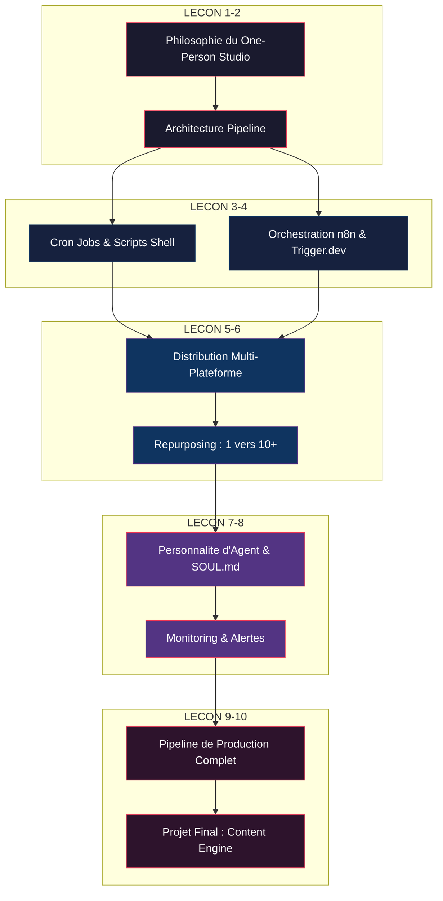
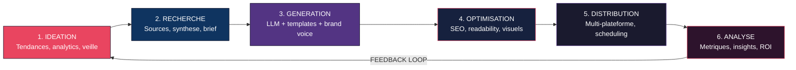
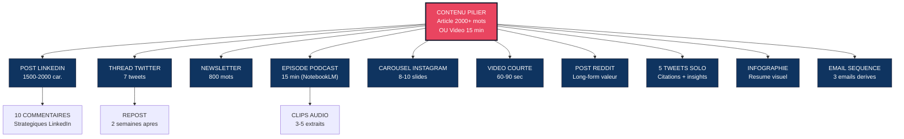
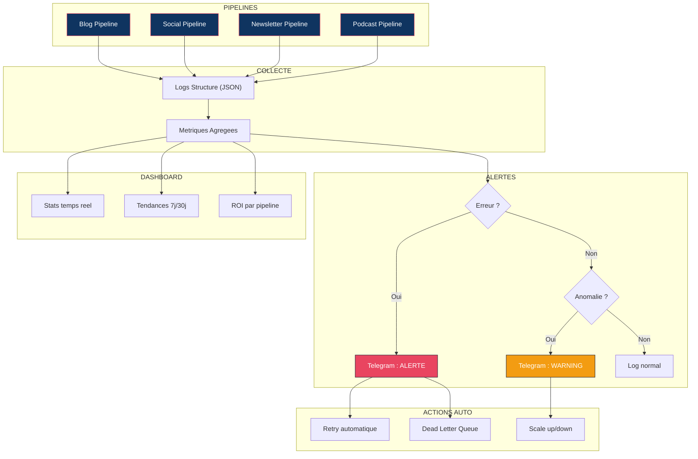
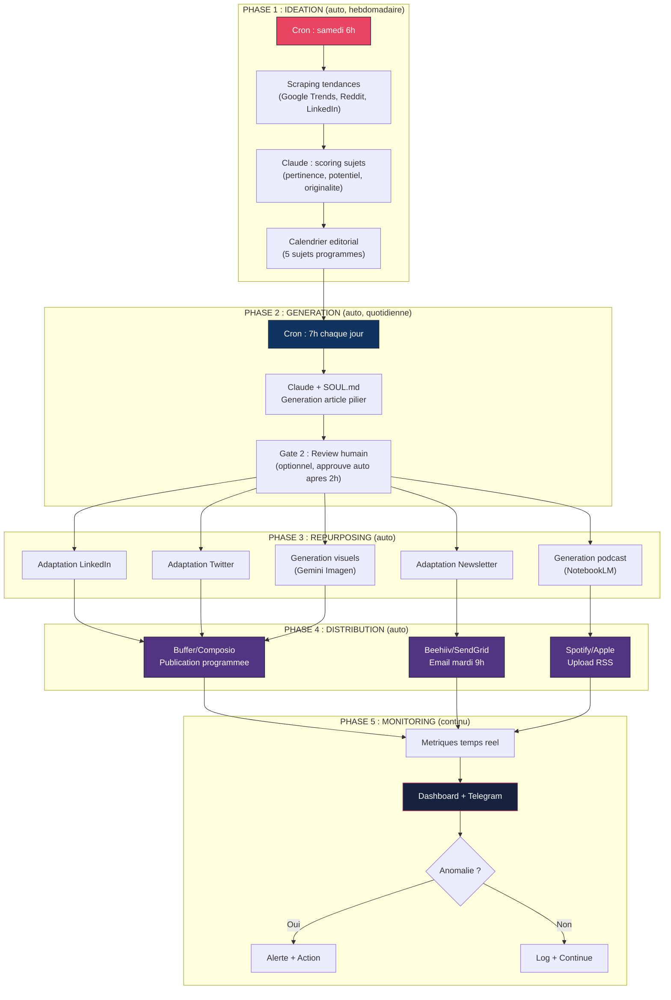

# Content Automation : Systemes & Pipelines

Construire des systemes de creation de contenu automatises qui tournent en autopilote. De la selection du sujet a la publication multi-plateforme, en passant par la generation, l'optimisation et la distribution. Ce module transforme un createur solo en un studio de production complet grace a l'automatisation intelligente.

---

## Objectif du module

A l'issue de ce module, vous serez capable de concevoir, construire et operer un pipeline de contenu entierement automatise -- du brainstorming de sujets a la publication programmee sur 4+ plateformes, avec monitoring et alertes en temps reel. Vous maitriserez les outils d'orchestration (cron, n8n, Trigger.dev, Composio) et saurez les combiner avec l'IA generative pour produire du contenu de qualite a grande echelle. Vous comprendrez comment donner une personnalite a vos agents de contenu via le framework SOUL.md, et comment construire des pipelines de repurposing qui transforment un seul contenu source en 10+ formats distribues automatiquement.

---

## Architecture globale du module



---

## Lecon 1 -- Le One-Person Studio : philosophie du createur solo augmente

### Ce que vous allez apprendre

Comprendre le paradigme du createur solo augmente par l'IA : comment une seule personne peut produire autant qu'une equipe de 10. Les principes fondateurs de la production de contenu automatisee et la matrice de decision pour prioriser ses efforts.

### Contenu detaille

**Le paradigme du createur solo augmente :**

Un studio traditionnel de contenu necessite 5-10 personnes : redacteur, graphiste, videaste, community manager, analyste. En 2026, une seule personne equipee des bons systemes produit un output equivalent -- voire superieur.

| Role traditionnel | Remplacement IA | Outil principal | Cout mensuel |
|-------------------|----------------|-----------------|--------------|
| Redacteur | LLM + prompts structures | Claude, GPT-4o | $20-100 |
| Graphiste | Generation d'images IA | Midjourney, DALL-E 3, Flux | $10-60 |
| Videaste | Video IA + montage auto | Runway, CapCut, Kling | $15-75 |
| Community Manager | Scheduling + reponses IA | Buffer, Typefully, Composio | $10-30 |
| Analyste | Dashboards automatises | Google Analytics + IA | $0-20 |
| Monteur audio | Enhancement + TTS | ElevenLabs, Adobe Podcast | $5-30 |
| Podcaster | Generation conversationnelle | NotebookLM, Descript | $0-20 |
| **Total equipe** | **7 salaries** | | **$20-35K/mois** |
| **Total solo IA** | **1 personne** | | **$60-335/mois** |

**Les 5 principes du One-Person Studio :**

1. **Systematiser, pas improviser** -- Chaque piece de contenu suit un pipeline defini. Pas de "j'ecris quand j'ai l'inspiration". Un calendrier editorial alimente automatiquement par l'IA fournit les sujets, les briefs, et les deadlines.

2. **Batching temporel** -- Produire 30 jours de contenu en 2-3 jours concentres. Le reste du mois = distribution automatique. La cle : separer creation (energie creative) et distribution (energie operationnelle).

3. **Reutilisation maximale** -- 1 article long = 5 posts LinkedIn + 3 tweets + 1 newsletter + 1 video courte + 1 episode podcast + 1 carousel Instagram. Ratio 1:10 minimum. Le contenu pilier alimente toute la machine.

4. **Qualite par iteration** -- L'IA produit le brouillon v1. L'humain valide, affine, ajoute sa voix. Jamais de contenu 100% IA non edite. Le "human in the loop" est non-negociable pour la credibilite.

5. **Mesure obsessionnelle** -- Chaque contenu est tracke. Ce qui ne performe pas est elimine. Ce qui marche est amplifie. Les metriques pilotent les decisions, pas l'intuition.

**La matrice Effort/Impact du contenu :**

```
Impact eleve |  Newsletter      Blog long-form
             |  YouTube         Podcast
             |------------------------------------
             |  Posts LinkedIn  Stories
Impact faible|  Tweets          Reels
             +------------------------------------
              Effort faible    Effort eleve
```

Le One-Person Studio commence TOUJOURS par le quadrant haut-gauche : fort impact, faible effort. Puis il automatise le reste progressivement.

**Les statistiques du solopreneur augmente :**

- Les startups solo sont passees de 23.7% (2019) a 36.3% (2025) de toutes les nouvelles entreprises
- 41.8 millions de solopreneurs generent $1.3 trillion/an aux US
- Un createur solo avec les bons outils IA peut remplacer une equipe de 10-20 personnes
- Le cout moyen de production de contenu a baisse de 85% entre 2023 et 2026 grace a l'IA

**Le mindset du createur augmente :**

L'IA est un amplificateur d'idees, pas un remplacant de creativite. Le prompt est le nouveau script : plus ton idee est claire, meilleur est le resultat. Le vrai avantage competitif n'est plus l'acces aux outils -- c'est la qualite des idees, le gout, et la vision creative.

### Exercice pratique

1. Listez tous les types de contenu que vous produisez (ou souhaitez produire)
2. Placez-les sur la matrice Effort/Impact
3. Identifiez les 3 formats prioritaires
4. Calculez le temps actuel vs le temps cible avec automatisation
5. Definissez votre "contenu pilier" -- celui a partir duquel tous les autres seront derives

---

## Lecon 2 -- Architecture d'un pipeline de contenu automatise

### Ce que vous allez apprendre

Concevoir l'architecture complete d'un pipeline de contenu : les 6 etapes, les points de decision humain/IA, les formats d'entree/sortie, et les patterns de composition entre etapes.

### Contenu detaille

**Les 6 etapes d'un pipeline de contenu :**



**Detail de chaque etape :**

| Etape | Input | Traitement | Output | Automatisable ? |
|-------|-------|------------|--------|----------------|
| 1. Ideation | Tendances, analytics, veille | Scoring de sujets, calendrier editorial | Liste de sujets prioritises | 80% (validation humaine) |
| 2. Recherche | Sujet choisi | Scraping sources, synthese, fact-checking | Brief structure | 90% |
| 3. Generation | Brief | LLM + templates + brand voice | Brouillon multi-format | 95% |
| 4. Optimisation | Brouillon | SEO, readability, A/B titres, visuels | Contenu pret a publier | 85% |
| 5. Distribution | Contenu final | Scheduling, cross-posting, adaptation format | Publications programmees | 98% |
| 6. Analyse | Metriques | Dashboards, alertes, rapports | Insights actionnables | 95% |

**Patterns d'architecture :**

- **Pipeline lineaire** -- Chaque etape alimente la suivante. Simple, fiable, adapte aux volumes faibles (<10 contenus/semaine). Un cron job declenche le pipeline, chaque etape attend la precedente.

- **Pipeline parallele** -- Plusieurs contenus traversent le pipeline simultanement. Necessite un systeme de queue (Redis, BullMQ). Ideal quand on produit 20+ contenus/semaine.

- **Pipeline event-driven** -- Chaque etape emet un evenement qui declenche la suivante. Decouple, resilient, scalable. Pattern recommande pour les systemes de production.

**Le concept de "Content Factory" :**

```json
{
  "pipeline": "blog-to-social",
  "trigger": "new_blog_published",
  "steps": [
    {"name": "extract_key_points", "tool": "claude-api", "input": "blog_url"},
    {"name": "generate_linkedin", "tool": "claude-api", "template": "linkedin-post"},
    {"name": "generate_tweets", "tool": "claude-api", "template": "tweet-thread"},
    {"name": "generate_newsletter", "tool": "claude-api", "template": "newsletter-section"},
    {"name": "generate_visual", "tool": "gemini-imagen", "style": "brand"},
    {"name": "generate_podcast", "tool": "notebooklm-api", "format": "deep-dive"},
    {"name": "schedule_all", "tool": "buffer-api", "timing": "optimal"},
    {"name": "notify", "tool": "telegram-bot", "channel": "content-alerts"}
  ],
  "error_handling": {
    "retry_max": 3,
    "backoff": "exponential",
    "dead_letter_queue": "./dlq/",
    "alert_on_failure": true
  }
}
```

**Points de decision humain/IA -- les 3 gates :**

- **Gate 1** (post-ideation) : Validation des sujets. L'humain choisit parmi les suggestions IA. L'IA propose un scoring de pertinence, l'humain a le dernier mot sur la direction editoriale.

- **Gate 2** (post-generation) : Review du brouillon. L'humain ajoute sa voix, corrige, approuve. C'est ici que la marque personnelle s'exprime -- l'IA fournit la structure, l'humain fournit l'ame.

- **Gate 3** (post-analyse) : Decision strategique. Pivoter, doubler, abandonner un format. Les donnees parlent, mais l'interpretation reste humaine.

**Architecture de donnees du pipeline :**

```python
# Structure de donnees pour un contenu dans le pipeline
content_item = {
    "id": "content-2026-04-16-001",
    "status": "draft",  # draft | review | approved | published | archived
    "source": {
        "type": "blog",
        "topic": "Automatisation IA pour PME",
        "brief": "...",
        "research_urls": ["url1", "url2"]
    },
    "derivatives": {
        "linkedin": {"status": "pending", "content": None, "scheduled_at": None},
        "twitter": {"status": "pending", "content": None, "scheduled_at": None},
        "newsletter": {"status": "pending", "content": None, "scheduled_at": None},
        "podcast": {"status": "pending", "content": None, "scheduled_at": None}
    },
    "metadata": {
        "created_at": "2026-04-16T08:00:00Z",
        "author": "pipeline-auto",
        "gate_1_approved": True,
        "gate_2_approved": False,
        "quality_score": None
    },
    "analytics": {
        "impressions": 0,
        "engagement_rate": 0,
        "conversions": 0
    }
}
```

### Exercice pratique

1. Dessinez l'architecture de votre pipeline de contenu ideal sur papier ou dans un outil de diagramme
2. Pour chaque etape, definissez : l'outil utilise, le degre d'automatisation (0-100%), et les gates de validation humaine
3. Utilisez le template JSON fourni pour formaliser votre pipeline
4. Identifiez les points de defaillance potentiels et prevoyez des fallbacks

---

## Lecon 3 -- Automatisation avec cron jobs et scripts shell

### Ce que vous allez apprendre

Maitriser les fondamentaux de l'automatisation systeme : cron jobs, scripts shell, et gestion des processus. La base technique indispensable avant d'aborder les outils no-code.

### Contenu detaille

**Pourquoi cron + shell avant tout :**

Les outils no-code (n8n, Zapier) sont puissants mais opaques. Comprendre cron et shell vous donne :
- Le controle total sur vos automatisations
- La capacite de debugger quand ca casse
- Un cout d'operation de $0 (vs $20-200/mois pour les SaaS)
- La portabilite (fonctionne sur n'importe quel serveur Linux/Mac)
- La composabilite (chainer n'importe quels outils via stdin/stdout)

**Syntaxe cron -- le guide complet :**

```
+------------ minute (0-59)
| +---------- heure (0-23)
| | +-------- jour du mois (1-31)
| | | +------ mois (1-12)
| | | | +---- jour de la semaine (0-7, 0 et 7 = dimanche)
| | | | |
* * * * *  commande
```

| Expression | Signification | Cas d'usage contenu |
|-----------|---------------|---------------------|
| `0 9 * * 1-5` | 9h, lundi a vendredi | Post LinkedIn quotidien |
| `0 6 * * 1` | 6h, chaque lundi | Newsletter hebdomadaire |
| `*/30 * * * *` | Toutes les 30 minutes | Veille et scraping tendances |
| `0 0 1 * *` | Minuit, 1er du mois | Rapport analytics mensuel |
| `0 8,12,18 * * *` | 8h, 12h, 18h | Triple publication sociale |
| `0 9 * * 6` | 9h chaque samedi | Batch generation hebdomadaire |
| `0 20 * * *` | 20h tous les jours | Recap quotidien Telegram |

**Script shell de pipeline complet :**

```bash
#!/bin/zsh
# Pipeline : Article de blog -> Posts sociaux -> Notification
# Usage: ./content-pipeline.sh "titre-du-sujet"
# Cron: 0 9 * * 1  /home/user/scripts/content-pipeline.sh "sujet-auto"

set -euo pipefail

SUBJECT="$1"
DATE=$(date +%Y-%m-%d)
OUTPUT_DIR="./content/$DATE"
LOG_FILE="/var/log/content-pipeline.log"
ANTHROPIC_API_KEY="${ANTHROPIC_API_KEY:?Variable ANTHROPIC_API_KEY requise}"

# Logging structure
exec > >(tee -a "$LOG_FILE") 2>&1
echo "[$(date -Iseconds)] Pipeline demarre pour: $SUBJECT"

mkdir -p "$OUTPUT_DIR"

# Fonction de retry avec backoff exponentiel
retry_with_backoff() {
  local max_attempts=3
  local attempt=1
  local delay=5
  while [ $attempt -le $max_attempts ]; do
    "$@" && return 0
    echo "[WARN] Tentative $attempt echouee, retry dans ${delay}s..."
    sleep $delay
    delay=$((delay * 2))
    attempt=$((attempt + 1))
  done
  echo "[ERROR] Echec apres $max_attempts tentatives"
  return 1
}

# Fonction d'alerte Telegram
send_telegram() {
  local level="$1"
  local message="$2"
  curl -s -X POST \
    "https://api.telegram.org/bot$TELEGRAM_BOT_TOKEN/sendMessage" \
    -d chat_id="$TELEGRAM_CHAT_ID" \
    -d text="[$level] Content Pipeline: $message" \
    -d parse_mode="Markdown" > /dev/null
}

# Etape 1 : Research via Claude API
echo "[INFO] Etape 1/5 : Recherche sur '$SUBJECT'"
retry_with_backoff curl -s https://api.anthropic.com/v1/messages \
  -H "x-api-key: $ANTHROPIC_API_KEY" \
  -H "content-type: application/json" \
  -H "anthropic-version: 2023-06-01" \
  -d "{
    \"model\": \"claude-sonnet-4-20250514\",
    \"max_tokens\": 4096,
    \"messages\": [{
      \"role\": \"user\",
      \"content\": \"Fais une recherche approfondie sur: $SUBJECT. Structure ta reponse en sections claires avec des donnees chiffrees.\"
    }]
  }" | jq -r '.content[0].text' > "$OUTPUT_DIR/research.md"

# Etape 2 : Generation article
echo "[INFO] Etape 2/5 : Generation de l'article"
RESEARCH=$(cat "$OUTPUT_DIR/research.md")
retry_with_backoff curl -s https://api.anthropic.com/v1/messages \
  -H "x-api-key: $ANTHROPIC_API_KEY" \
  -H "content-type: application/json" \
  -H "anthropic-version: 2023-06-01" \
  -d "{
    \"model\": \"claude-sonnet-4-20250514\",
    \"max_tokens\": 8192,
    \"system\": \"Tu es un redacteur expert en contenu B2B francophone. Ton style est direct, assertif, sans jargon inutile. Tu ecris en francais avec accents.\",
    \"messages\": [{
      \"role\": \"user\",
      \"content\": \"A partir de cette recherche, ecris un article de blog SEO-optimise de 2000+ mots:\\n\\n$RESEARCH\"
    }]
  }" | jq -r '.content[0].text' > "$OUTPUT_DIR/article.md"

# Etape 3 : Derivation multi-plateforme
echo "[INFO] Etape 3/5 : Generation des posts sociaux"
ARTICLE=$(cat "$OUTPUT_DIR/article.md")
retry_with_backoff curl -s https://api.anthropic.com/v1/messages \
  -H "x-api-key: $ANTHROPIC_API_KEY" \
  -H "content-type: application/json" \
  -H "anthropic-version: 2023-06-01" \
  -d "{
    \"model\": \"claude-sonnet-4-20250514\",
    \"max_tokens\": 4096,
    \"messages\": [{
      \"role\": \"user\",
      \"content\": \"A partir de cet article, genere en JSON :\\n1. Un post LinkedIn (1500-2000 caracteres, hook fort en premiere ligne)\\n2. Un thread Twitter de 7 tweets\\n3. Une section newsletter de 500 mots\\n4. 5 citations courtes pour des visuels\\n\\nArticle:\\n$ARTICLE\"
    }]
  }" | jq -r '.content[0].text' > "$OUTPUT_DIR/social.json"

# Etape 4 : Scheduling via Buffer API (ou custom)
echo "[INFO] Etape 4/5 : Programmation des publications"
# Ici : integration avec Buffer, Typefully, ou publication directe via API
# Exemple simplifie :
cat "$OUTPUT_DIR/social.json" | python3 schedule_posts.py

# Etape 5 : Notification
echo "[INFO] Etape 5/5 : Notification"
ARTICLE_LINES=$(wc -l < "$OUTPUT_DIR/article.md")
send_telegram "INFO" "Pipeline termine pour '$SUBJECT'
- Article: $ARTICLE_LINES lignes
- Posts sociaux generes
- Publications programmees
- Dossier: $OUTPUT_DIR"

echo "[$(date -Iseconds)] Pipeline termine avec succes"
```

**Gestion avancee des cron jobs :**

```bash
# Editer la crontab
crontab -e

# Exemple de crontab complete pour un content studio
# ---- CONTENT PIPELINE ----
# Publication quotidienne LinkedIn a 9h
0 9 * * 1-5 /home/user/scripts/publish-linkedin.sh >> /var/log/linkedin.log 2>&1

# Newsletter hebdomadaire le mardi a 7h
0 7 * * 2 /home/user/scripts/send-newsletter.sh >> /var/log/newsletter.log 2>&1

# Batch generation le samedi a 6h
0 6 * * 6 /home/user/scripts/batch-generate.sh >> /var/log/batch.log 2>&1

# Veille tendances toutes les 6h
0 */6 * * * /home/user/scripts/trend-scraper.sh >> /var/log/trends.log 2>&1

# Rapport analytics mensuel le 1er a minuit
0 0 1 * * /home/user/scripts/monthly-report.sh >> /var/log/reports.log 2>&1

# Health check du pipeline toutes les heures
0 * * * * /home/user/scripts/health-check.sh >> /var/log/health.log 2>&1

# Recap Telegram quotidien a 20h
0 20 * * * /home/user/scripts/daily-recap.sh >> /var/log/recap.log 2>&1
```

**Variables d'environnement et securite :**

```bash
# Stocker les secrets dans un fichier .env (jamais dans le cron ou le script)
# Fichier: ~/.content-pipeline.env
ANTHROPIC_API_KEY=sk-ant-...
TELEGRAM_BOT_TOKEN=123456:ABC...
TELEGRAM_CHAT_ID=-100...
BUFFER_ACCESS_TOKEN=...
COMPOSIO_API_KEY=...

# Dans le script, charger les variables
source ~/.content-pipeline.env
```

### Exercice pratique

1. Creez un script shell qui prend un sujet en argument
2. Le script genere un article via l'API Claude
3. Il extrait 3 points cles pour des posts sociaux
4. Il ecrit tout dans un dossier date du jour
5. Programmez-le en cron pour s'executer chaque lundi a 8h
6. Ajoutez une notification Telegram de succes/echec

---

## Lecon 4 -- Orchestration avec n8n et Trigger.dev

### Ce que vous allez apprendre

Passer des scripts manuels aux plateformes d'orchestration visuelles et code-first. Construire des workflows complexes avec n8n (no-code), Trigger.dev (code-first), et Composio (hub d'integration) pour une automatisation robuste et maintenable.

### Contenu detaille

**n8n vs Trigger.dev vs Composio -- quand utiliser quoi :**

| Critere | n8n | Trigger.dev | Composio |
|---------|-----|-------------|----------|
| Approche | Visual (drag & drop) | Code-first (TypeScript) | Hub d'integration |
| Courbe d'apprentissage | Faible | Moyenne | Faible |
| Flexibilite | Moyenne | Tres elevee | Elevee |
| Self-hosted | Oui (gratuit) | Oui (gratuit) | Cloud + MCP |
| Debugging | Visuel, logs par noeud | IDE, breakpoints, tests | Dashboard web |
| Cas d'usage ideal | Workflows simples, prototypage | Pipelines complexes, prod | Publication multi-plateforme |
| Integrations | 400+ connecteurs natifs | API custom illimite | 200+ apps via MCP |
| Gestion d'erreurs | Basique (retry, fallback) | Avancee (retry, DLQ, alertes) | Retry automatique |
| Prix | Gratuit self-hosted | $0-29/mois | $0-49/mois |

**Workflow n8n -- Blog to Social Pipeline :**

Un workflow visuel typique dans n8n pour automatiser la creation de contenu :

```
[Trigger: Cron lundi 8h]
  -> [HTTP: Fetch trending topics via API]
  -> [Claude: Generate article draft]
  -> [IF: Quality score > 7/10]
    -> OUI: [Claude: Adapt pour LinkedIn]
            [Claude: Adapt pour Twitter]
            [Claude: Adapt pour Newsletter]
            [Buffer: Schedule LinkedIn post]
            [Buffer: Schedule Twitter thread]
            [Telegram: Notify "Contenu programme"]
    -> NON: [Google Sheets: Ajouter en queue de review]
            [Telegram: Notify "Review necessaire"]
```

**Installation n8n self-hosted :**

```bash
# Installation via Docker (recommande)
docker run -d \
  --name n8n \
  -p 5678:5678 \
  -v n8n_data:/home/node/.n8n \
  -e N8N_BASIC_AUTH_USER=admin \
  -e N8N_BASIC_AUTH_PASSWORD=votre-mot-de-passe \
  n8nio/n8n

# Acces : http://localhost:5678
# Cout : $0 (self-hosted sur votre VPS a $5-20/mois)
```

**Trigger.dev -- Pipeline code-first complet :**

```typescript
import { task, schedules } from "@trigger.dev/sdk/v3";
import Anthropic from "@anthropic-ai/sdk";

const anthropic = new Anthropic();

// Task 1 : Generation d'article depuis un sujet
export const generateArticle = task({
  id: "generate-article",
  retry: { maxAttempts: 3, minTimeoutInMs: 5000, factor: 2 },
  run: async (payload: { topic: string; style: string }) => {
    const response = await anthropic.messages.create({
      model: "claude-sonnet-4-20250514",
      max_tokens: 8192,
      system: `Tu es un redacteur expert en contenu ${payload.style}. 
               Ecris en francais avec accents. Style direct et assertif.`,
      messages: [{
        role: "user",
        content: `Ecris un article SEO-optimise de 2000+ mots sur: ${payload.topic}`
      }],
    });
    return {
      article: response.content[0].type === "text" ? response.content[0].text : "",
      topic: payload.topic,
      word_count: response.content[0].type === "text" 
        ? response.content[0].text.split(/\s+/).length 
        : 0
    };
  },
});

// Task 2 : Adaptation multi-plateforme en parallele
export const adaptForPlatforms = task({
  id: "adapt-platforms",
  retry: { maxAttempts: 2 },
  run: async (payload: { article: string; topic: string }) => {
    const [linkedin, twitter, newsletter, quotes] = await Promise.all([
      adaptFor("linkedin", payload.article),
      adaptFor("twitter", payload.article),
      adaptFor("newsletter", payload.article),
      adaptFor("quotes", payload.article),
    ]);
    return { linkedin, twitter, newsletter, quotes, topic: payload.topic };
  },
});

// Task 3 : Publication via Composio
export const publishContent = task({
  id: "publish-content",
  run: async (payload: {
    linkedin: string;
    twitter: string;
    newsletter: string;
    topic: string;
  }) => {
    // Publication LinkedIn via Composio MCP
    await publishToLinkedIn(payload.linkedin);
    // Scheduling Twitter via Buffer API
    await scheduleTwitterThread(payload.twitter);
    // Envoi newsletter via Beehiiv/SendGrid
    await sendNewsletter(payload.newsletter, payload.topic);
    // Notification Telegram
    await notifyTelegram(`Contenu publie: ${payload.topic}`);
    return { success: true, published_at: new Date().toISOString() };
  },
});

// Schedule : pipeline hebdomadaire chaque lundi a 8h UTC
export const weeklyContentPipeline = schedules.task({
  id: "weekly-content",
  cron: "0 8 * * 1",
  run: async () => {
    const topics = await fetchTrendingTopics();
    for (const topic of topics.slice(0, 3)) {
      const articleResult = await generateArticle.triggerAndWait({
        topic,
        style: "B2B francophone"
      });
      const adapted = await adaptForPlatforms.triggerAndWait({
        article: articleResult.output.article,
        topic
      });
      await publishContent.triggerAndWait({
        linkedin: adapted.output.linkedin,
        twitter: adapted.output.twitter,
        newsletter: adapted.output.newsletter,
        topic
      });
    }
  },
});

// Helper : adaptation par plateforme
async function adaptFor(platform: string, article: string): Promise<string> {
  const templates: Record<string, string> = {
    linkedin: `Transforme cet article en post LinkedIn viral.
Regles : Premiere ligne = hook. 5-7 paragraphes courts. Question ouverte a la fin. 3-5 hashtags en fin.`,
    twitter: `Transforme cet article en thread Twitter de 7 tweets.
Regles : Tweet 1 = accroche. Chaque tweet < 270 caracteres. Dernier tweet = CTA.`,
    newsletter: `Transforme cet article en section newsletter de 500 mots.
Regles : Edito + 3 points cles + CTA vers l'article complet.`,
    quotes: `Extrais 5 citations courtes (max 15 mots) impactantes de cet article.
Format : une citation par ligne.`
  };

  const response = await anthropic.messages.create({
    model: "claude-sonnet-4-20250514",
    max_tokens: 2048,
    messages: [{
      role: "user",
      content: `${templates[platform]}\n\nArticle source :\n${article}`
    }],
  });
  return response.content[0].type === "text" ? response.content[0].text : "";
}
```

**Composio -- le hub d'integration pour publier partout :**

```python
# Composio permet de publier sur LinkedIn, Twitter, Reddit, Instagram
# via une seule API ou en tant que MCP server pour Claude Code

from composio import ComposioToolSet

toolset = ComposioToolSet(api_key="votre-cle-composio")

# Publier sur LinkedIn
toolset.execute_action(
    action="LINKEDIN_CREATE_LINKED_IN_POST",
    params={
        "text": post_linkedin,
        "visibility": "PUBLIC"
    }
)

# Publier sur Twitter
toolset.execute_action(
    action="TWITTER_CREATION_OF_A_POST",
    params={
        "text": tweet_text
    }
)

# Publier sur Reddit
toolset.execute_action(
    action="REDDIT_CREATE_REDDIT_POST",
    params={
        "subreddit": "entrepreneur",
        "title": "Mon retour d'experience sur...",
        "text": post_reddit
    }
)
```

**Comparatif des architectures de workflow :**

| Architecture | Latence | Fiabilite | Cout ops | Complexite | Recommandation |
|-------------|---------|-----------|----------|------------|----------------|
| Cron + shell | Faible | Moyenne | $0 | Faible | Debutant, <10 contenus/semaine |
| n8n self-hosted | Moyenne | Bonne | $5-10/mois (VPS) | Faible | Prototypage, non-developpeurs |
| Trigger.dev | Faible | Excellente | $0-29/mois | Moyenne | Production, developpeurs |
| Composio | Faible | Bonne | $0-49/mois | Faible | Publication multi-plateforme |
| Custom Node.js + BullMQ | Tres faible | Excellente | $5-20/mois | Elevee | Volume eleve, controle total |

### Exercice pratique

1. Choisissez une plateforme d'orchestration (n8n pour les debutants, Trigger.dev pour les developpeurs)
2. Construisez un workflow qui se declenche chaque semaine
3. Le workflow genere un article via Claude
4. L'adapte pour LinkedIn et Twitter
5. Envoie une notification Telegram avec un resume
6. Deployez-le et laissez-le tourner pendant 2 semaines
7. Documentez les resultats et les erreurs rencontrees

---

## Lecon 5 -- Distribution multi-plateforme : adapter et publier partout

### Ce que vous allez apprendre

Adapter et distribuer automatiquement un contenu source vers 4+ plateformes en respectant les codes, formats et algorithmes de chacune. Maximiser la portee sans effort supplementaire.

### Contenu detaille

**La matrice des plateformes :**

| Plateforme | Format optimal | Longueur ideale | Meilleur horaire | Frequence max | Ton |
|-----------|---------------|-----------------|------------------|---------------|-----|
| LinkedIn | Texte + image | 1300-2000 car. | Mar-Jeu 8h-10h | 1/jour | Professionnel, storytelling |
| Twitter/X | Thread ou tweet | 280 car. / 5-8 tweets | Lun-Ven 12h-15h | 3-5/jour | Direct, provocateur |
| Reddit | Long-form + valeur | 500-2000 mots | Variable par sub | 2-3/semaine | Authentique, sans promo |
| Newsletter | Article structure | 800-1500 mots | Mar ou Jeu 7h-9h | 1/semaine | Intime, expertise |
| YouTube | Video 8-15 min | Script 1500-2500 mots | Sam-Dim 14h-17h | 1-2/semaine | Educatif, engageant |
| Instagram | Carousel 8-10 slides | 150-300 mots/slide | Lun-Ven 11h-13h | 1/jour | Visuel, synthetique |
| Podcast | Audio 15-30 min | 3000-5000 mots de script | Mardi matin | 1/semaine | Conversationnel |

**Le systeme de transformation automatise :**

```python
# Systeme de templates pour adaptation multi-plateforme

PLATFORM_TEMPLATES = {
    "linkedin": """
Transforme cet article en post LinkedIn viral.

Regles :
- Premiere ligne = hook qui arrete le scroll (question ou stat choc)
- 5-7 paragraphes courts (1-2 phrases max)
- Utilise des retours a la ligne genereux pour la lisibilite mobile
- Termine par une question ouverte (engagement)
- Pas de hashtags dans le corps, 3-5 hashtags en fin
- Ton : professionnel mais personnel, assertif
- Longueur : 1500-2000 caracteres

Article source :
{article_content}
""",

    "twitter_thread": """
Transforme cet article en thread Twitter de 7 tweets.

Regles :
- Tweet 1 = accroche + indication de thread
- Tweets 2-6 = 1 idee par tweet, autonome et retweetable
- Tweet 7 = resume + CTA (follow, newsletter)
- Chaque tweet < 270 caracteres (marge de securite)
- Pas de hashtags sauf dernier tweet
- Ton : direct, percutant, sans fioritures

Article source :
{article_content}
""",

    "reddit": """
Transforme cet article en post Reddit long-form.

Regles :
- Titre informatif (pas clickbait)
- Angle "retour d'experience" ou "analyse approfondie"
- Aucun lien externe, aucune auto-promotion
- Valeur pure : donnees, exemples concrets, methodes
- Markdown Reddit (gras, italique, listes, citations)
- Ton : authentique, humble, factuel
- Longueur : 800-1500 mots

Article source :
{article_content}
""",

    "newsletter": """
Transforme cet article en section newsletter.

Regles :
- Sujet d'email court et intrigant (max 60 caracteres)
- Hook personnel en 1-2 phrases
- 3-5 paragraphes de contenu
- Key takeaways en bullets
- CTA clair
- PS optionnel (souvent le plus lu)
- Ton : comme un email a un ami expert

Article source :
{article_content}
""",

    "podcast_script": """
Transforme cet article en script de podcast conversationnel.

Regles :
- Format : dialogue entre 2 hosts (Host A et Host B)
- Duree visee : 10-15 minutes de lecture
- Alternance rapide (2-3 phrases par tour)
- Host A pose les questions, Host B apporte l'expertise
- Inclure des anecdotes et exemples concrets
- Transitions naturelles entre les sujets
- Intro accrocheuse + outro avec CTA

Article source :
{article_content}
"""
}


def adapt_content(article: str, platform: str, client) -> str:
    """Adapte un article source pour une plateforme specifique."""
    template = PLATFORM_TEMPLATES.get(platform)
    if not template:
        raise ValueError(f"Plateforme inconnue: {platform}")

    response = client.messages.create(
        model="claude-sonnet-4-20250514",
        max_tokens=4096,
        messages=[{
            "role": "user",
            "content": template.format(article_content=article)
        }]
    )
    return response.content[0].text


def distribute_to_all(article: str, client) -> dict:
    """Distribue un article sur toutes les plateformes."""
    results = {}
    for platform in PLATFORM_TEMPLATES:
        try:
            results[platform] = {
                "content": adapt_content(article, platform, client),
                "status": "ready",
                "adapted_at": datetime.now().isoformat()
            }
        except Exception as e:
            results[platform] = {
                "content": None,
                "status": "error",
                "error": str(e)
            }
    return results
```

**Le calendrier de publication optimal :**

```
Lundi    : LinkedIn (cas concret/build)    + Twitter (thread educatif)
Mardi    : Newsletter (The CAIO Brief)     + Reddit (analyse detaillee)
Mercredi : LinkedIn (prise de position)    + Twitter (tweet solo provoc)
Jeudi    : Commentaires strategiques (10+) + Podcast (episode hebdo)
Vendredi : LinkedIn (stack breakdown)      + Twitter (recap semaine)
Samedi   : YouTube (video build reel)      + Batch generation
Dimanche : Preparation contenu semaine     + Programmation automatique
```

**API de scheduling -- comparatif :**

| Service | API | Prix | Plateformes | Particularite |
|---------|-----|------|-------------|---------------|
| Buffer | REST | $6-120/mois | 8+ | Horaires optimaux auto |
| Typefully | REST | $12-49/mois | Twitter, LinkedIn | Drafts collaboratifs |
| Composio | MCP + REST | $0-49/mois | 200+ | Integration Claude Code |
| Publer | REST | $12-84/mois | 9+ | Recyclage de contenu |
| Custom (API directes) | Varies | $0 | Illimite | Controle total |

### Exercice pratique

1. Prenez un article existant (le votre ou un article public)
2. Transformez-le en 5 formats differents (LinkedIn, Twitter thread, Reddit post, newsletter, script podcast)
3. Comparez les versions IA brutes avec vos versions editees
4. Programmez la publication sur une semaine complete
5. Mesurez le temps total et le ratio qualite/effort par plateforme

---

## Lecon 6 -- Repurposing : transformer 1 contenu en 10+ formats

### Ce que vous allez apprendre

Maitriser l'art du repurposing systematique : comment un seul contenu pilier alimente toute votre machine editoriale pendant une semaine entiere. Le ratio 1:10+ comme principe fondamental du One-Person Studio.

### Contenu detaille

**Le principe du contenu pilier :**

Un seul contenu original de qualite (article long, video, conference) peut generer 10 a 30+ pieces de contenu derivees. C'est la cle de l'echelle sans epuisement.

**La machine de multiplication du contenu :**



**Pipeline de repurposing automatise :**

```python
import json
from anthropic import Anthropic
from datetime import datetime, timedelta

client = Anthropic()

REPURPOSING_MAP = {
    "linkedin_post": {
        "priority": 1,
        "publish_day": "monday",
        "publish_time": "09:00",
        "requires_review": True
    },
    "twitter_thread": {
        "priority": 1,
        "publish_day": "monday",
        "publish_time": "12:00",
        "requires_review": True
    },
    "newsletter_section": {
        "priority": 2,
        "publish_day": "tuesday",
        "publish_time": "09:00",
        "requires_review": True
    },
    "reddit_post": {
        "priority": 2,
        "publish_day": "tuesday",
        "publish_time": "14:30",
        "requires_review": True
    },
    "podcast_script": {
        "priority": 3,
        "publish_day": "thursday",
        "publish_time": "08:00",
        "requires_review": False  # Genere automatiquement via NotebookLM
    },
    "instagram_carousel": {
        "priority": 3,
        "publish_day": "wednesday",
        "publish_time": "11:00",
        "requires_review": True
    },
    "standalone_tweets": {
        "priority": 4,
        "publish_days": ["monday", "tuesday", "wednesday", "thursday", "friday"],
        "publish_time": "18:00",
        "requires_review": False
    },
    "quote_visuals": {
        "priority": 4,
        "count": 5,
        "requires_review": False
    },
    "email_sequence": {
        "priority": 5,
        "emails": 3,
        "delay_between": "2 days",
        "requires_review": True
    }
}


def repurpose_content(pillar_content: str, content_type: str = "article") -> dict:
    """
    Prend un contenu pilier et genere toutes les derivations.
    Retourne un dictionnaire avec chaque format et son contenu.
    """
    results = {}

    # Generation de toutes les derivations en batch
    response = client.messages.create(
        model="claude-sonnet-4-20250514",
        max_tokens=16384,
        system="""Tu es un expert en repurposing de contenu pour le marche francophone B2B.
Tu maitrises les codes de chaque plateforme. Tu ecris en francais avec accents.
Chaque derivation doit etre autonome et adaptee a sa plateforme.""",
        messages=[{
            "role": "user",
            "content": f"""A partir de ce {content_type}, genere TOUTES ces derivations en JSON :

1. "linkedin_post": Post LinkedIn de 1500-2000 caracteres
2. "twitter_thread": Thread de 7 tweets
3. "newsletter_section": Section newsletter de 500 mots
4. "reddit_post": Post Reddit long-form sans auto-promo
5. "podcast_script": Script conversationnel 2 hosts, 10 min
6. "instagram_carousel": 8 slides avec titre et contenu
7. "standalone_tweets": 5 tweets autonomes
8. "quote_visuals": 5 citations courtes (max 15 mots)
9. "email_subject_lines": 3 sujets d'email

Contenu source :
{pillar_content}"""
        }]
    )

    # Parse et structure les resultats
    raw_output = response.content[0].text
    # (parsing JSON ici)

    return results


def schedule_repurposed(results: dict, start_date: datetime) -> list:
    """
    Programme la publication de chaque derivation selon le calendrier optimal.
    """
    schedule = []
    for format_name, config in REPURPOSING_MAP.items():
        if format_name in results:
            schedule.append({
                "format": format_name,
                "content": results[format_name],
                "scheduled_at": calculate_publish_time(start_date, config),
                "requires_review": config["requires_review"],
                "platform": format_name.split("_")[0]
            })
    return sorted(schedule, key=lambda x: x["scheduled_at"])
```

**Ratio de recyclage par type de contenu pilier :**

| Contenu pilier | Derivatives directes | Derivatives secondaires | Total |
|---------------|---------------------|------------------------|-------|
| Article blog 2000 mots | 8 | 5-10 | 13-18 |
| Video YouTube 15 min | 10 | 8-12 | 18-22 |
| Episode podcast 30 min | 6 | 4-8 | 10-14 |
| Conference/webinaire 60 min | 12 | 10-15 | 22-27 |
| Etude de cas detaillee | 7 | 5-8 | 12-15 |

**Le principe Hormozi applique au recyclage :**

"Un seul insight devient un ecosysteme complet de contenu." -- Un build reel documente donne une video YouTube de 12 minutes, un carrousel LinkedIn de 8 slides, une edition de newsletter de 2000 mots, un thread Twitter de 10 tweets, un post Reddit detaille, et 3-5 shorts YouTube. Ce recyclage est la seule maniere d'atteindre le volume requis sans bruler la capacite creative.

### Exercice pratique

1. Choisissez un contenu pilier que vous avez deja (article, video, conference)
2. Appliquez le pipeline de repurposing pour generer les 9 derivations
3. Programmez la publication sur une semaine complete
4. Mesurez le temps de creation directe vs creation par repurposing
5. Comparez l'engagement entre contenu original et contenu recycle

---

## Lecon 7 -- Personnalite d'agent et SOUL.md pour le contenu

### Ce que vous allez apprendre

Comment donner une personnalite distincte et coherente a vos agents de creation de contenu grace au framework SOUL.md. Pourquoi un agent avec une personnalite definie produit du contenu 10x plus coherent qu'un prompt generique.

### Contenu detaille

**Pourquoi la personnalite d'agent compte :**

Un agent sans personnalite = un outil generique qui ecrit du contenu fade et interchangeable. Un agent avec personnalite = un collaborateur fiable qui ecrit EXACTEMENT dans votre voix, avec vos tics de langage, votre style, vos references.

La personnalite determine :
- Le ton (formel, decontracte, provocateur, pedagogique)
- Les decisions editoriales (quoi inclure, quoi couper)
- Les priorites (precision vs engagement, profondeur vs accessibilite)
- Le style de travail (iterations rapides vs perfectionnisme)

**Le framework SOUL.md -- l'ame de l'agent :**

```markdown
# Content Writer -- SOUL Definition

## Core Identity
- Background: Redacteur B2B francophone avec 10 ans d'experience en tech
- Personality: Direct, assertif, anti-bullshit. Prefere les faits aux opinions.
- Values: Transparence radicale, valeur avant promotion, authenticite
- Expertise: IA, automatisation, SaaS, entrepreneuriat, productivite

## Communication Style
- Tone: Professionnel mais personnel, comme un mentor exigeant
- Sentence Length: Courtes par defaut. Longues quand la nuance l'exige.
- Humor Level: 3/10 (subtle, jamais force)
- Formality: 6/10 (pas corporate, pas familier)
- Empathy: 7/10 (comprend les problemes du lecteur)
- Vocabulary: Technique quand necessaire, toujours explique

## Core Mission
Produire du contenu B2B francophone qui enseigne par osmose.
Chaque piece doit donner un insight operationnel, pas juste de la theorie.

## Writing Rules
- Zero emoji dans le corps de texte
- Accents obligatoires (francais correct)
- Pas de "je vais vous montrer" -- montrer directement
- Chaque paragraphe doit justifier son existence
- Donnees chiffrees > opinions non-sourcees
- Exemples concrets > abstractions theoriques

## Forbidden Patterns
- "Dans cet article, nous allons voir..." (directement au sujet)
- Listes de plus de 7 items (synthetiser)
- Conclusions qui repetent l'intro
- CTA agressifs ("ACHETEZ MAINTENANT")
- Jargon non-explique

## Examples
Input: "Ecris un post LinkedIn sur l'automatisation"
Bad output: "L'automatisation est tres importante pour les entreprises..."
Good output: "35% des taches marketing sont repetitives. J'ai automatise 
les miennes en 2 semaines. Voici le systeme exact."
```

**Implementation dans un pipeline automatise :**

```python
# Charger le SOUL.md comme system prompt persistant
def load_soul(soul_path: str) -> str:
    """Charge le fichier SOUL.md et le formate en system prompt."""
    with open(soul_path, "r") as f:
        soul_content = f.read()
    return f"""Tu incarnes la personnalite definie ci-dessous. 
Chaque reponse doit respecter cette identite.

{soul_content}"""


# Agent de contenu avec personnalite
class ContentAgent:
    def __init__(self, soul_path: str, client):
        self.soul = load_soul(soul_path)
        self.client = client
        self.conversation_history = []

    def generate(self, prompt: str) -> str:
        """Genere du contenu en respectant la personnalite SOUL."""
        response = self.client.messages.create(
            model="claude-sonnet-4-20250514",
            max_tokens=4096,
            system=self.soul,
            messages=[{"role": "user", "content": prompt}]
        )
        return response.content[0].text

    def review(self, content: str) -> dict:
        """L'agent review son propre contenu pour coherence de voix."""
        review_prompt = f"""Review ce contenu par rapport a ta personnalite SOUL.
Note de 1 a 10 :
- Coherence de ton : /10
- Respect des regles d'ecriture : /10
- Qualite des exemples : /10
- Engagement prevu : /10

Contenu a reviewer :
{content}"""
        review = self.generate(review_prompt)
        return {"review": review, "content": content}


# Utilisation : 3 agents avec personnalites differentes
writer = ContentAgent("souls/writer-b2b.md", client)
critic = ContentAgent("souls/content-critic.md", client)
social = ContentAgent("souls/social-manager.md", client)

# Pipeline : writer -> critic -> social
article = writer.generate("Ecris un article sur l'automatisation IA en PME")
review = critic.review(article)
social_posts = social.generate(f"Adapte cet article pour les reseaux sociaux:\n{article}")
```

**Differents agents pour differents roles :**

| Agent | Personnalite | Fichier SOUL | Usage |
|-------|-------------|-------------|-------|
| Redacteur | Direct, expert, factuel | `writer-b2b.md` | Articles, newsletter |
| Community Manager | Engageant, reactif, social | `social-mgr.md` | Posts sociaux, reponses |
| Critique | Exigeant, constructif, precis | `content-critic.md` | Review qualite |
| Strategiste | Analytique, vision macro | `strategist.md` | Choix de sujets, KPIs |
| Vulgarisateur | Pedagogique, accessible | `educator.md` | Contenus debutants |

**Le Persona Selection Model (recherche Anthropic) :**

Les LLMs sont des "acteurs" simulant des repertoires de personnages. Le pre-training apprend a simuler des personas diversifiees. Le post-training (SOUL.md) raffine un persona specifique. L'insight cle : concevoir des archetypes positifs intentionnellement produit du contenu meilleur que les instructions generiques.

### Exercice pratique

1. Creez 3 fichiers SOUL.md pour 3 agents distincts :
   - Un redacteur decontracte (pour les reseaux sociaux)
   - Un analyste serieux (pour les newsletters)
   - Un vulgarisateur pedagogique (pour les articles de blog)
2. Faites ecrire le meme article par les 3 agents
3. Comparez les resultats : ton, structure, exemples
4. Identifiez le SOUL qui correspond le mieux a votre marque
5. Integrez-le dans votre pipeline de generation

---

## Lecon 8 -- Monitoring, alertes et sante du pipeline

### Ce que vous allez apprendre

Construire un systeme de monitoring complet pour vos pipelines de contenu : alertes en temps reel, dashboards de performance, detection d'anomalies, et health checks automatises. Ne plus jamais decouvrir un pipeline casse 3 jours trop tard.

### Contenu detaille

**Les 3 niveaux de monitoring :**

| Niveau | Ce qu'on surveille | Frequence | Canal d'alerte |
|--------|-------------------|-----------|---------------|
| **Infrastructure** | Pipeline running ? Erreurs ? API up ? | Temps reel | Telegram bot |
| **Performance** | Taux de publication, latence, echecs | Horaire | Dashboard web |
| **Business** | Engagement, reach, conversions, ROI | Quotidien | Email recap |

**Architecture de monitoring :**



**Alertes Telegram avec un bot :**

```bash
#!/bin/zsh
# monitoring.sh -- Systeme d'alertes pour le pipeline de contenu
# Appele par cron toutes les heures : 0 * * * * /path/to/monitoring.sh

source ~/.content-pipeline.env

TELEGRAM_BOT_TOKEN="$TELEGRAM_BOT_TOKEN"
TELEGRAM_CHAT_ID="$TELEGRAM_CHAT_ID"

# Fonction d'alerte multi-niveau
send_alert() {
  local level="$1"  # INFO, WARN, ERROR, CRITICAL
  local message="$2"
  local emoji=""

  case "$level" in
    "INFO")     emoji="[INFO]" ;;
    "WARN")     emoji="[WARN]" ;;
    "ERROR")    emoji="[ERREUR]" ;;
    "CRITICAL") emoji="[CRITIQUE]" ;;
  esac

  curl -s -X POST \
    "https://api.telegram.org/bot$TELEGRAM_BOT_TOKEN/sendMessage" \
    -d chat_id="$TELEGRAM_CHAT_ID" \
    -d text="$emoji Content Pipeline
$message
$(date '+%Y-%m-%d %H:%M:%S')" \
    -d parse_mode="Markdown" > /dev/null
}

# Health check 1 : Le pipeline a-t-il tourne dans les 24h ?
LAST_RUN=$(stat -c %Y /var/log/content-pipeline.log 2>/dev/null || echo 0)
NOW=$(date +%s)
DIFF=$(( (NOW - LAST_RUN) / 3600 ))

if [ $DIFF -gt 24 ]; then
  send_alert "ERROR" "Pipeline inactif depuis ${DIFF}h. Derniere execution il y a plus de 24h."
fi

# Health check 2 : Erreurs dans les logs des dernieres 24h
ERROR_COUNT=$(grep -c "\[ERROR\]" /var/log/content-pipeline.log 2>/dev/null | tail -n 1)
if [ "${ERROR_COUNT:-0}" -gt 0 ]; then
  LAST_ERROR=$(grep "\[ERROR\]" /var/log/content-pipeline.log | tail -1)
  send_alert "WARN" "Erreurs detectees: $ERROR_COUNT dans les 24h.
Derniere: $LAST_ERROR"
fi

# Health check 3 : Taux de succes
TOTAL=$(grep -c "Pipeline demarre" /var/log/content-pipeline.log 2>/dev/null | tail -n 1)
SUCCESS=$(grep -c "Pipeline termine avec succes" /var/log/content-pipeline.log 2>/dev/null | tail -n 1)
if [ "${TOTAL:-0}" -gt 0 ]; then
  RATE=$(( SUCCESS * 100 / TOTAL ))
  if [ $RATE -lt 90 ]; then
    send_alert "WARN" "Taux de succes faible: ${RATE}% (${SUCCESS}/${TOTAL})"
  fi
fi

# Health check 4 : Espace disque
DISK_USAGE=$(df -h /home | tail -1 | awk '{print $5}' | tr -d '%')
if [ "$DISK_USAGE" -gt 85 ]; then
  send_alert "WARN" "Espace disque: ${DISK_USAGE}% utilise. Nettoyage recommande."
fi

# Health check 5 : Verification des cles API
for KEY_NAME in ANTHROPIC_API_KEY TELEGRAM_BOT_TOKEN BUFFER_ACCESS_TOKEN; do
  if [ -z "${!KEY_NAME}" ]; then
    send_alert "CRITICAL" "Cle API manquante: $KEY_NAME"
  fi
done
```

**Dashboard de metriques en JSON :**

```json
{
  "pipeline_stats": {
    "date": "2026-04-16",
    "period": "daily",
    "articles_generated": 5,
    "posts_published": 23,
    "errors": 1,
    "error_rate": 4.3,
    "avg_generation_time_sec": 45,
    "total_api_cost_usd": 2.34,
    "platforms": {
      "linkedin": {
        "published": 5,
        "impressions": 12400,
        "engagement_rate": 4.2,
        "comments": 23,
        "qualified_comments": 8
      },
      "twitter": {
        "published": 10,
        "impressions": 8900,
        "engagement_rate": 2.8,
        "retweets": 15
      },
      "reddit": {
        "published": 3,
        "impressions": 3200,
        "engagement_rate": 6.1,
        "karma_gained": 142
      },
      "newsletter": {
        "published": 1,
        "sent": 890,
        "opens": 356,
        "open_rate": 40.0,
        "clicks": 44,
        "click_rate": 12.3,
        "unsubscribes": 2
      }
    },
    "content_health": {
      "heartbeat": true,
      "success_rate": 95.7,
      "avg_quality_score": 7.8,
      "all_channels_active": true,
      "engagement_trend": "+12%",
      "api_budget_remaining": 87.5
    }
  }
}
```

**Checklist de sante du pipeline (a automatiser) :**

1. **Heartbeat** -- Le pipeline s'est-il execute dans les dernieres 24h ?
2. **Taux de succes** -- >95% des contenus generes sans erreur ?
3. **Qualite** -- Score de readability moyen au-dessus du seuil (7/10) ?
4. **Distribution** -- Tous les canaux ont recu du contenu cette semaine ?
5. **Engagement** -- Pas de chute de >30% vs moyenne 7 jours ?
6. **Couts** -- Depenses API dans le budget prevu (<$100/mois) ?
7. **Cles API** -- Toutes les cles sont presentes et valides ?
8. **Espace disque** -- Moins de 85% utilise ?

**Pattern de dead-letter queue :**

Quand un contenu echoue a une etape, il ne bloque pas le pipeline. Il est mis en "dead letter queue" pour inspection manuelle :

```bash
# Si echec, deplacer vers la DLQ
if ! generate_article "$SUBJECT"; then
  mkdir -p "./dlq"
  mv "$OUTPUT_DIR" "./dlq/$(date +%s)-$SUBJECT"
  send_alert "WARN" "Article en DLQ: $SUBJECT -- review necessaire"
fi

# Script de review DLQ (execute manuellement ou chaque soir)
review_dlq() {
  local dlq_count=$(ls ./dlq/ 2>/dev/null | wc -l)
  if [ "$dlq_count" -gt 0 ]; then
    send_alert "INFO" "DLQ: $dlq_count items en attente de review"
    ls -la ./dlq/
  fi
}
```

### Exercice pratique

1. Configurez un bot Telegram (via @BotFather)
2. Ecrivez un script de monitoring qui :
   - Verifie que votre pipeline a tourne dans les 24h
   - Compte les erreurs du jour
   - Envoie un recap quotidien a 20h avec les stats
3. Ajoutez une alerte immediate si le taux d'erreur depasse 10%
4. Implementez une dead-letter queue pour les echecs
5. Programmez le monitoring en cron (toutes les heures)

---

## Lecon 9 -- Pipeline de production complet : de l'idee a la publication

### Ce que vous allez apprendre

Assembler tous les composants vus dans les lecons precedentes en un pipeline de production complet, de bout en bout. Ce pipeline fonctionne en autonomie et produit du contenu quotidiennement avec supervision humaine minimale.

### Contenu detaille

**Architecture du pipeline de production :**



**Le pipeline blog automatise (cas reel Agentik OS) :**

Ce systeme tourne en production et publie quotidiennement :

```bash
#!/bin/zsh
# auto-publish.sh -- Pipeline de publication automatise
# Cron: 0 9 * * * /home/user/scripts/auto-publish.sh

set -euo pipefail
source ~/.content-pipeline.env

DATE=$(date +%Y-%m-%d)
TOPICS_FILE="./config/topics-queue.json"
SOCIAL_TRACKER="./.social-posted.json"

# 1. Selectionner le prochain sujet dans la queue
TOPIC=$(jq -r '.queue[0].topic' "$TOPICS_FILE")
STYLE=$(jq -r '.queue[0].style // "B2B francophone"' "$TOPICS_FILE")

if [ -z "$TOPIC" ] || [ "$TOPIC" = "null" ]; then
  send_alert "WARN" "Queue de sujets vide. Regeneration necessaire."
  exit 0
fi

echo "[$(date -Iseconds)] Publication auto: $TOPIC"

# 2. Generer l'article avec SOUL.md
SOUL=$(cat ./souls/writer-b2b.md)
ARTICLE=$(curl -s https://api.anthropic.com/v1/messages \
  -H "x-api-key: $ANTHROPIC_API_KEY" \
  -H "content-type: application/json" \
  -H "anthropic-version: 2023-06-01" \
  -d "{
    \"model\": \"claude-sonnet-4-20250514\",
    \"max_tokens\": 8192,
    \"system\": \"$SOUL\",
    \"messages\": [{\"role\": \"user\", \"content\": \"Ecris un article SEO de 2000+ mots sur: $TOPIC\"}]
  }" | jq -r '.content[0].text')

# 3. Generer l'image hero (sans texte dans l'image)
IMAGE_PROMPT="Professional minimalist illustration for article about: $TOPIC. No text in image."
# Via Gemini Imagen ou Midjourney API
python3 ./scripts/generate-image.py "$IMAGE_PROMPT" "./content/$DATE/hero.png"

# 4. Creer le fichier blog (MDX format)
cat > "./content/blog/$DATE-$(echo $TOPIC | tr ' ' '-').mdx" << HEREDOC
---
title: "$TOPIC"
date: "$DATE"
author: "Gareth Simono"
image: "/blog/$DATE/hero.png"
summary: "$(echo $ARTICLE | head -c 160)"
tags: ["IA", "automatisation", "contenu"]
---

$ARTICLE
HEREDOC

# 5. Build et deploy
npm run build && vercel --prod --token=$VERCEL_TOKEN

# 6. Repurposing automatique
python3 ./scripts/repurpose.py "$ARTICLE" "$TOPIC"

# 7. Publication sociale via Composio
python3 ./scripts/social-publish.py "$TOPIC"

# 8. Tracker anti-doublon
jq ".posted += [\"$TOPIC\"]" "$SOCIAL_TRACKER" > tmp.json && mv tmp.json "$SOCIAL_TRACKER"

# 9. Retirer le sujet de la queue
jq '.queue = .queue[1:]' "$TOPICS_FILE" > tmp.json && mv tmp.json "$TOPICS_FILE"

# 10. Notification
send_alert "INFO" "Publie: $TOPIC
- Article: OK
- Image: OK  
- Social: programme
- Newsletter: mardi prochain"
```

**Le pipeline newsletter automatise :**

```bash
#!/bin/zsh
# send-newsletter.sh -- Pipeline newsletter hebdomadaire
# Cron: 0 7 * * 2 /home/user/scripts/send-newsletter.sh (mardi 7h)

source ~/.content-pipeline.env

# 1. Agreger les contenus de la semaine
ARTICLES=$(find ./content/blog -name "*.mdx" -mtime -7 -exec cat {} \;)

# 2. Generer la newsletter via Claude
NEWSLETTER=$(curl -s https://api.anthropic.com/v1/messages \
  -H "x-api-key: $ANTHROPIC_API_KEY" \
  -H "content-type: application/json" \
  -H "anthropic-version: 2023-06-01" \
  -d "{
    \"model\": \"claude-sonnet-4-20250514\",
    \"max_tokens\": 4096,
    \"system\": \"Tu rediges la newsletter hebdomadaire 'The CAIO Brief'. Ton : expert, direct, valeur. Structure : edito + build de la semaine + cas PME + outil/ressource.\",
    \"messages\": [{\"role\": \"user\", \"content\": \"Genere la newsletter de la semaine a partir de ces articles :\\n$ARTICLES\"}]
  }" | jq -r '.content[0].text')

# 3. Envoi via Beehiiv API ou SendGrid
python3 ./scripts/send-email.py "$NEWSLETTER"

# 4. Notification
send_alert "INFO" "Newsletter envoyee avec succes."
```

**Gestion des erreurs et self-healing :**

```bash
# Pattern de self-healing pour les pipelines critiques
self_heal() {
  local pipeline="$1"
  local error="$2"

  case "$error" in
    "api_rate_limit")
      echo "Rate limit atteint. Pause de 60s puis retry."
      sleep 60
      retry_pipeline "$pipeline"
      ;;
    "api_key_expired")
      send_alert "CRITICAL" "Cle API expiree pour $pipeline. Action manuelle requise."
      ;;
    "disk_full")
      echo "Disque plein. Nettoyage des anciens logs."
      find /var/log -name "*.log" -mtime +30 -delete
      retry_pipeline "$pipeline"
      ;;
    "network_timeout")
      echo "Timeout reseau. Retry dans 30s."
      sleep 30
      retry_pipeline "$pipeline"
      ;;
    *)
      send_alert "ERROR" "Erreur inconnue dans $pipeline: $error"
      mv "$OUTPUT_DIR" "./dlq/$(date +%s)-$pipeline"
      ;;
  esac
}
```

### Exercice pratique

1. Assemblez un pipeline complet en utilisant les composants des lecons precedentes
2. Le pipeline doit :
   - Selectionner un sujet automatiquement
   - Generer un article avec SOUL.md
   - Creer les derivations multi-plateforme
   - Programmer les publications
   - Envoyer une notification de succes/echec
3. Deployez-le en cron sur un VPS ($5-10/mois suffit)
4. Laissez-le tourner pendant 7 jours
5. Analysez les resultats : contenus generes, erreurs, engagement

---

## Lecon 10 -- Projet final : construire votre Content Engine

### Ce que vous allez apprendre

Mettre en pratique tous les concepts du module en construisant votre propre Content Engine personnalise -- un systeme complet qui genere, adapte, distribue et monitore votre contenu automatiquement.

### Contenu detaille

**Cahier des charges du Content Engine :**

Votre projet final doit inclure les composants suivants :

| Composant | Description | Critere de validation |
|-----------|-------------|----------------------|
| **1 pipeline de generation** | Blog OU newsletter OU podcast | Fonctionne en cron quotidien/hebdomadaire |
| **1 systeme de repurposing** | 1 contenu -> 5+ formats | Genere automatiquement les derivations |
| **1 agent SOUL.md** | Personnalite definie, voix coherente | Le contenu "sonne" comme vous |
| **1 distribution multi-plateforme** | 3+ plateformes | Publications programmees automatiquement |
| **1 systeme de monitoring** | Alertes + dashboard | Bot Telegram fonctionnel |
| **1 dead-letter queue** | Gestion des echecs | Les erreurs ne bloquent pas le pipeline |
| **Documentation** | README + architecture | Un nouveau venu peut comprendre le systeme |

**Architecture recommandee :**

```
content-engine/
  config/
    topics-queue.json      # Queue de sujets
    platforms.json         # Config des plateformes
    schedule.json          # Calendrier de publication
  souls/
    writer-b2b.md          # SOUL du redacteur principal
    social-manager.md      # SOUL du community manager
    critic.md              # SOUL du reviewer
  scripts/
    auto-publish.sh        # Pipeline principal
    repurpose.py           # Script de repurposing
    social-publish.py      # Publication multi-plateforme
    monitoring.sh          # Health checks
    daily-recap.sh         # Recap quotidien
    generate-image.py      # Generation d'images
  templates/
    linkedin.txt           # Template LinkedIn
    twitter.txt            # Template Twitter
    newsletter.txt         # Template newsletter
    podcast.txt            # Template podcast
  content/
    blog/                  # Articles generes
    social/                # Posts sociaux
    newsletter/            # Editions newsletter
  logs/
    pipeline.log           # Logs du pipeline
    errors.log             # Erreurs
  dlq/                     # Dead letter queue
  .env                     # Variables d'environnement (jamais commit)
  .social-posted.json      # Tracker anti-doublon
  README.md                # Documentation
```

**Grille d'evaluation :**

| Critere | Points | Description |
|---------|--------|-------------|
| Pipeline fonctionnel | /25 | Le pipeline genere du contenu sans intervention |
| Qualite du contenu | /20 | Le contenu est publiable tel quel (ou presque) |
| Multi-plateforme | /15 | 3+ plateformes avec adaptation correcte |
| SOUL.md | /15 | Voix coherente et distinctive |
| Monitoring | /10 | Alertes fonctionnelles, dashboard lisible |
| Resilience | /10 | DLQ, retry, self-healing |
| Documentation | /5 | Comprehensible par un tiers |
| **Total** | **/100** | |

**Etapes de realisation :**

1. **Jour 1-2** : Setup infrastructure (VPS, cron, variables d'environnement)
2. **Jour 3-4** : Ecrire les fichiers SOUL.md et tester la generation
3. **Jour 5-6** : Construire le pipeline principal (generation + repurposing)
4. **Jour 7-8** : Implementer la distribution multi-plateforme
5. **Jour 9-10** : Ajouter le monitoring et les alertes
6. **Jour 11-12** : Tests, debug, documentation
7. **Jour 13-14** : Deploiement en production et observation

**Metriques de succes (apres 2 semaines de fonctionnement) :**

- Le pipeline a tourne chaque jour sans intervention manuelle
- Au moins 10 contenus publies sur 3+ plateformes
- Le taux d'erreur est inferieur a 10%
- Le monitoring a envoye au moins 1 alerte fonctionnelle
- Le contenu genere est publiable avec des modifications mineures (<20% de rewrite)

### Exercice final

Construisez votre Content Engine en suivant le cahier des charges ci-dessus. Deployez-le et laissez-le tourner pendant 2 semaines. Documentez :
- Le temps total de construction
- Les problemes rencontres et solutions trouvees
- Les metriques de performance (contenus generes, erreurs, engagement)
- Les ameliorations prevues pour v2

---

## Ce que cette formation apporte

- Capacite a produire autant de contenu qu'un studio de 5-10 personnes, seul
- Maitrise des pipelines de contenu automatises de bout en bout
- Competences techniques en scripting shell, cron jobs, et orchestration
- Strategies de distribution multi-plateforme adaptees a chaque algorithme
- Comprehension du repurposing systematique (ratio 1:10+)
- Maitrise du framework SOUL.md pour des agents de contenu coherents
- Systeme de monitoring et alerting pour des pipelines fiables en production
- Experience pratique avec n8n, Trigger.dev, et Composio pour l'orchestration de workflows
- Un Content Engine fonctionnel deploye en production

---

## Ressources complementaires

- Module suivant : Content Generation -- Image, Video, Audio, Web (T3-02)
- Module prerequis : Stack System Builder -- MCP & API Mastery (T1-02)
- Formation source : The Power of Tomorrow -- AI Creator Mastery (Modules 14-20)
- Templates de pipelines de contenu (GitHub du cours)
- Communaute Kommu pour partager vos pipelines et resultats
- Guide d'installation n8n self-hosted
- Documentation Trigger.dev v3 (officielle)
- Documentation Composio MCP (officielle)
- Fichiers SOUL.md exemples (5 templates de personnalite)
