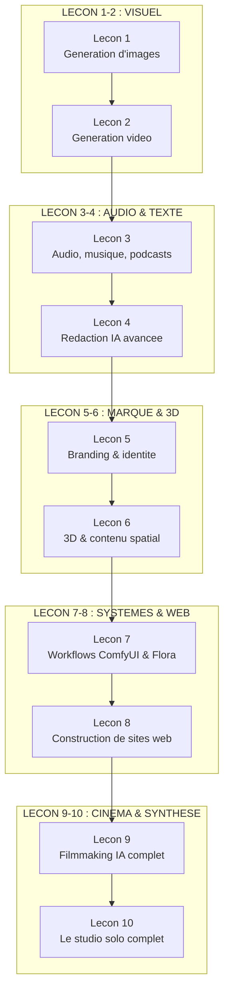
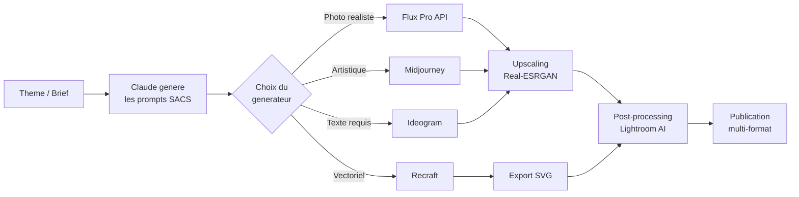
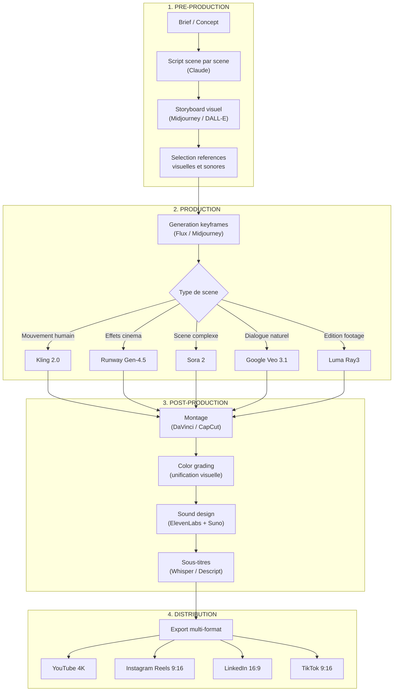
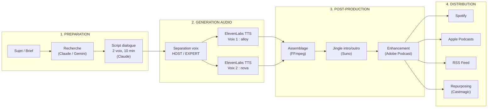
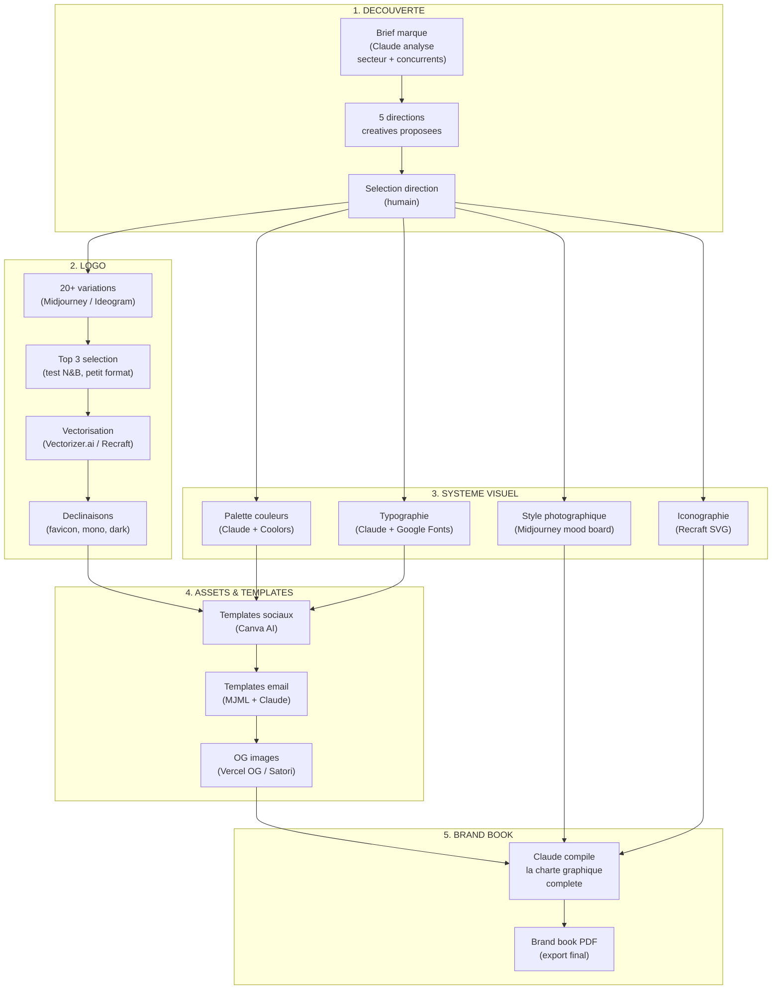
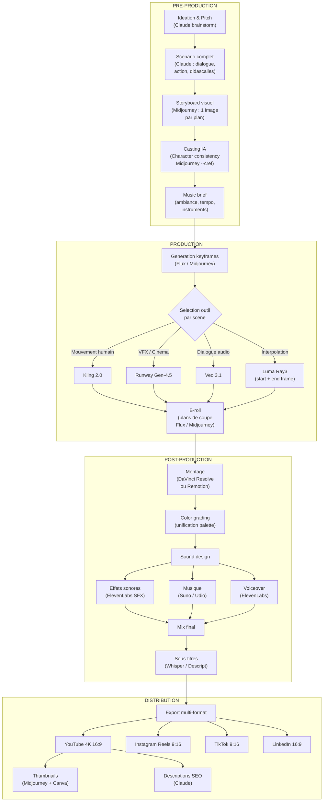

# Content Generation : Image, Video, Audio, Web

Maitriser tous les formats de creation avec l'IA : images professionnelles, videos marketing, musique et podcasts, sites web complets. Ce module fait de vous un createur multi-format capable de produire du contenu de qualite studio dans chaque medium — image, video, audio, texte et web — en une fraction du temps et du cout traditionnels.

En 2026, la barriere a l'entree de la creation n'a jamais ete aussi basse. Un individu avec un laptop et des idees peut generer des images qui rivalisent avec des directeurs artistiques, produire des videos qui ressemblent a des productions cinema, composer de la musique studio-quality en quelques minutes, et construire un site web complet en une apres-midi. Le vrai avantage competitif n'est plus l'acces aux outils — c'est la qualite des idees, le gout, et la vision creative.

Ce module couvre l'integralite de l'ecosysteme de creation : de la generation d'images avec Midjourney, DALL-E, Flux et Ideogram, a la production video avec Runway, Sora et Kling, en passant par l'audio avec Suno, ElevenLabs et NotebookLM, la redaction avancee, le branding complet, la 3D, les workflows visuels avec ComfyUI et Flora.ai, et la construction de sites web avec Claude Code.

---

## Objectif du module

A l'issue de ce module, vous maitriserez les outils de generation IA pour chaque format de contenu : images (Midjourney, DALL-E, Flux, Ideogram), videos (Runway, Sora, Kling, Veo), audio (Suno, ElevenLabs, NotebookLM), texte (Claude, GPT-4o) et web (Claude Code, v0, Bolt.new). Vous saurez choisir le bon outil pour chaque besoin, produire du contenu professionnel, creer une identite de marque complete, et integrer ces outputs dans vos pipelines de publication.

---

## Architecture du module



---

## Lecon 1 — Generation d'images : Midjourney, DALL-E, Flux, Ideogram

### Ce que vous allez apprendre

Comparer les generateurs d'images IA majeurs, maitriser le prompt engineering visuel avec le framework SACS, et produire des images de qualite professionnelle pour chaque usage : marketing, branding, social media, illustration, packaging.

### Contenu detaille

**Comparatif des generateurs d'images (2026) :**

| Critere | Midjourney v7 | DALL-E 3 | Gemini Imagen 3 | Flux Pro 1.1 | Ideogram 3 | Recraft v3 |
|---------|--------------|----------|-----------------|-------------|------------|------------|
| Qualite artistique | Excellente | Tres bonne | Tres bonne | Excellente | Bonne | Tres bonne |
| Precision du prompt | Bonne | Excellente | Excellente | Bonne | Excellente | Bonne |
| Texte dans l'image | Moyenne | Excellente | Excellente | Bonne | Excellente | Bonne |
| Photorealisme | Excellente | Bonne | Excellente | Excellente | Moyenne | Moyenne |
| Vitesse | Moyenne | Rapide | Rapide | Tres rapide | Rapide | Rapide |
| API disponible | Non (Discord) | Oui (OpenAI) | Oui (Google) | Oui (BFL/Replicate) | Oui | Oui |
| Prix par image | ~$0.04 | ~$0.04-0.08 | ~$0.03-0.07 | ~$0.03-0.06 | ~$0.03 | ~$0.04 |
| SVG natif | Non | Non | Non | Non | Non | Oui |
| Licence commerciale | Oui (plan payant) | Oui | Oui | Oui | Oui | Oui |

**Quand utiliser chaque outil :**

| Besoin | Meilleur choix | Pourquoi |
|--------|---------------|----------|
| Photo hyper-realiste | Flux Pro 1.1 | Meilleur photorealisme du marche |
| Esthetique artistique | Midjourney v7 | Style reference, personnalisation, cohesion visuelle |
| Texte lisible dans l'image | Ideogram 3 | Le seul qui rend du texte fiable |
| Image pour chatbot/API | DALL-E 3 ou Gemini | Comprehension superieure des prompts complexes |
| Logo vectoriel / icones SVG | Recraft v3 | Le seul qui genere du SVG natif |
| Securite copyright maximale | Adobe Firefly | Entraine exclusivement sur contenu sous licence |
| Controle total / local | Stable Diffusion + ComfyUI | Open-source, LoRA, ControlNet, gratuit |

**Le framework SACS pour le prompt engineering visuel :**

Le SACS est le framework de reference pour structurer vos prompts d'images. Chaque lettre represente une dimension cle du prompt :

1. **S**ujet — Quoi ? (une femme entrepreneur, un dashboard futuriste, un paysage urbain au crepuscule)
2. **A**mosphere — Mood ? (cinematique, minimaliste, energique, sombre, onirique, corporate)
3. **C**omposition — Comment ? (plan large, gros plan, vue aerienne, symetrique, regle des tiers)
4. **S**tyle — Reference ? (photorealiste, illustration editoriale, 3D render, flat design, aquarelle)

**Exemples de prompts structures avec SACS :**

```
# Marketing SaaS — Hero image
Sujet: A modern SaaS dashboard floating in space
Atmosphere: Clean, professional, premium tech
Composition: 3/4 angle, shallow depth of field, centered
Style: 3D render, dark background, blue and purple accent lights
Parametres: --ar 16:9 --v 7 --q 2

# LinkedIn post — Thought leadership
Sujet: A person standing at the edge of a data visualization cliff
Atmosphere: Inspirational, futuristic, warm golden light
Composition: Wide shot, rule of thirds, person on the left
Style: Cinematic photography, lens flare, high contrast
Parametres: --ar 4:5 --v 7 --s 750

# E-commerce — Packshot produit
Sujet: A premium skincare bottle on marble surface
Atmosphere: Luxurious, serene, editorial beauty
Composition: Centered, eye-level, soft shadows, negative space
Style: Product photography, soft studio lighting, clean background
Parametres: --ar 1:1 --v 7 --q 2

# Poster d'evenement — Texte dans l'image (Ideogram)
Sujet: Conference poster with title "AI SUMMIT 2026"
Atmosphere: Tech-forward, energetic, bold
Composition: Centered title, abstract background
Style: Modern graphic design, neon accents, dark base
```

**Pipeline de generation d'images en batch :**



**Techniques avancees Midjourney :**

Les parametres avances de Midjourney v7+ ouvrent des possibilites uniques :

| Parametre | Syntaxe | Usage |
|-----------|---------|-------|
| Style Reference | `--sref [URL]` | Verrouiller un style visuel a partir d'une image de reference |
| Character Reference | `--cref [URL]` | Reutiliser un personnage a travers plusieurs images |
| Omni Reference | `--oref [URL]` | Reutiliser objets ou personnages |
| Multiprompting | `sujet1::2 sujet2::1` | Attribuer des poids relatifs a chaque element |
| Chaos | `--chaos 0-100` | Varier les resultats (0 = predictible, 100 = experimental) |
| Stylize | `--s 0-1000` | Forcer l'esthetique Midjourney (defaut 100, 750+ = tres stylise) |
| Draft Mode | `--draft` | Generation 10x plus rapide pour les iterations |
| Quality | `--q 0.25-2` | Temps de calcul (2 = max qualite, 0.25 = rapide) |

**Code de generation batch via API :**

```python
import anthropic
import requests

# Generer les prompts d'images via Claude
def generate_image_prompts(theme: str, count: int = 5) -> list[str]:
    client = anthropic.Anthropic()
    response = client.messages.create(
        model="claude-sonnet-4-20250514",
        max_tokens=2000,
        messages=[{
            "role": "user",
            "content": f"Genere {count} prompts d'image pour le theme: {theme}. "
                       f"Utilise le framework SACS (Sujet, Atmosphere, Composition, Style). "
                       f"Format: un prompt par ligne, en anglais."
        }]
    )
    return response.content[0].text.strip().split("\n")

# Generer les images via DALL-E 3
def generate_images_dalle(prompts: list[str]) -> list[str]:
    urls = []
    for prompt in prompts:
        response = openai.images.generate(
            model="dall-e-3",
            prompt=prompt,
            size="1792x1024",
            quality="hd",
            n=1
        )
        urls.append(response.data[0].url)
    return urls

# Generer via Flux Pro (Replicate)
def generate_images_flux(prompts: list[str]) -> list[str]:
    import replicate
    urls = []
    for prompt in prompts:
        output = replicate.run(
            "black-forest-labs/flux-pro",
            input={"prompt": prompt, "aspect_ratio": "16:9"}
        )
        urls.append(output[0])
    return urls
```

**Les erreurs fatales a eviter :**

- Ne PAS utiliser de noms de personnes reelles ou de marques deposees dans les prompts
- Ne PAS generer d'images avec du texte important (sauf avec Ideogram qui gere bien le texte)
- Ne PAS utiliser une image IA brute sans retouche pour un usage premium
- Toujours verifier la coherence anatomique (mains, doigts, yeux)
- Toujours conserver les prompts utilises pour la reproductibilite
- Ne PAS ignorer les licences : verifier les termes de chaque outil avant usage commercial

**Techniques transversales indispensables :**

| Technique | Description | Outils recommandes |
|-----------|-------------|-------------------|
| Upscaling | Augmenter la resolution d'une image generee | Real-ESRGAN, Topaz Gigapixel, Magnific AI |
| Inpainting | Modifier des zones specifiques d'une image | DALL-E, Stable Diffusion, Midjourney (vary region) |
| Outpainting | Etendre une image au-dela de ses bords | DALL-E, Stable Diffusion |
| Image-to-image | Transformer une image existante (style transfer) | Midjourney --iw, Flux img2img, ControlNet |
| Background removal | Isoler le sujet, supprimer l'arriere-plan | remove.bg, Rembg (open-source), Photoshop AI |
| Post-processing | Retouche finale (contraste, couleur, nettete) | Lightroom AI, Photoshop AI, Snapseed |

### Exercice pratique

Creez une serie de 10 images pour une campagne LinkedIn sur le theme "L'IA transforme le marketing B2B". Utilisez 3 outils differents (Midjourney + DALL-E + Flux). Pour chaque image, documentez : le prompt SACS utilise, les iterations necessaires, le temps de generation, le cout. Comparez les resultats sur qualite, fidelite au prompt, et coherence visuelle de la serie.

---

## Lecon 2 — Generation de video : Runway, Sora, Kling, Veo, Hailuo

### Ce que vous allez apprendre

Maitriser les plateformes majeures de generation video IA. Produire des clips marketing, des demos produit, et des contenus social media de qualite professionnelle sans camera ni equipe de tournage. Comprendre les techniques de storyboarding, d'animation, de color grading et de compositing.

### Contenu detaille

**Comparatif des generateurs video (2026) :**

| Critere | Runway Gen-4.5 | Sora 2 | Kling 2.0 | Google Veo 3.1 | Hailuo MiniMax | Luma Ray3 |
|---------|----------------|--------|-----------|----------------|----------------|-----------|
| Duree max | 16 sec | 60 sec | 10 sec | 30 sec | 6 sec | 10 sec |
| Resolution max | 4K | 1080p | 4K natif | 1080p | 1080p | 4K 60fps |
| Coherence temporelle | Excellente | Excellente | Bonne | Tres bonne | Moyenne | Tres bonne |
| Controle camera | Excellent (Motion Brush) | Bon | Bon (explicit controls) | Bon | Basique | Bon |
| Audio+Video simultane | Non | Non | Non | Oui (dialogue inclus) | Non | Non |
| Image-to-video | Oui | Oui | Oui | Oui | Oui | Oui |
| Video-to-video (style) | Oui | Non | Oui | Non | Non | Oui (Ray3 Modify) |
| Mouvements humains | Bon | Bon | Excellent (moteur physique) | Bon | Moyen | Bon |
| API | Oui | Oui (OpenAI) | Oui | Oui (Vertex) | Non | Oui |
| Prix / seconde | ~$0.25 | ~$0.15-0.50 | ~$0.10 | ~$0.15 | Gratuit (limites) | ~$0.15 |

**Les specialites de chaque outil :**

| Outil | Meilleur pour | Technique unique |
|-------|--------------|-----------------|
| Runway Gen-4.5 | Effets cinematiques, precision du mouvement | Motion Brushes : peindre le mouvement, Act-Two : mocap sans equipement |
| Sora 2 | Scenes complexes multi-elements | Prompts longs detailles, ecosysteme OpenAI |
| Kling 2.0 | Mouvements humains realistes | Modele 3D facial/corporel, moteur physique |
| Veo 3.1 | Video + audio simultane | Dialogue naturel genere directement dans la video |
| Luma Ray3 | Edition de footage existant | Ray3 Modify : editer des videos existantes, interpolation start/end |
| HeyGen | Avatars parlants, presentations | Avatar IV : gestuelles naturelles, 175+ langues |
| Pika Labs | Effets creatifs speciaux | Focus effets visuels, 80 credits/mois gratuit |
| LTX Studio | Filmmaking complet bout-en-bout | Du concept a la livraison, LTX-2 production model |

**Les 5 types de videos IA pour le marketing :**

1. **Hero video** — Clip cinematique 10-15s pour landing page. Methode : image-to-video avec Runway sur une image Midjourney.
2. **Product demo** — Screencast augmente. Enregistrement ecran + overlays IA + voiceover ElevenLabs.
3. **Social clip** — 5-15s format vertical pour Reels/TikTok/Shorts. Impact visuel maximal.
4. **Explainer** — 30-60s avec narration. Combine generation IA + montage traditionnel.
5. **Testimonial** — Video d'avatar parlant (HeyGen, Synthesia). Attention a l'authenticite.

**Workflow de production video IA :**



**Techniques de prompt video avancees :**

```
# Runway Gen-4.5 — Structure de prompt
Camera: [dolly forward / pan left / static / crane up / orbit]
Subject: [description precise du sujet principal]
Action: [ce qui se passe dans la scene]
Style: [cinematique / documentaire / editorial / anime]
Lighting: [naturel / studio / neon / golden hour / dramatic]

# Exemple concret — Hero video SaaS
Camera: slow dolly forward through a modern office space
Subject: a holographic AI dashboard floating above a wooden desk
Action: data visualizations morphing and expanding in real-time
Style: cinematic, shallow depth of field, anamorphic lens
Lighting: soft blue ambient with warm desk lamp accent

# Kling 2.0 — Mouvements humains
Subject: a young entrepreneur walking through a futuristic co-working space
Action: she stops, picks up a tablet, data projections appear around her
Camera: tracking shot following the subject, orbit at the end
Physics: natural hair movement, realistic fabric physics
Style: 4K, shallow depth of field, warm cinematic grade
```

**Techniques de filmmaking IA :**

| Technique | Description | Quand l'utiliser |
|-----------|-------------|-----------------|
| Storyboarding | Generer les plans avec Midjourney/DALL-E avant la video | Toujours — le plan visuel guide tout |
| Sequencage | Enchainer plusieurs clips generes en scene coherente | Videos >15 secondes |
| Color grading | Unifier l'aspect visuel post-generation | Quand les clips viennent de sources differentes |
| Compositing | Combiner elements generes et footage reel | Productions hybrides IA + camera |
| Sound design | Ajouter ambiance et effets sonores (ElevenLabs SFX) | Toute video finale |
| Interpolation | Start frame + end frame, l'IA genere entre les deux | Luma Ray3, transitions fluides |

**Pipeline video automatise :**

```python
# Pipeline complet : sujet → video finale
async def video_pipeline(topic: str):
    # 1. Generer le script (Claude)
    script = await generate_video_script(topic, duration=15)
    
    # 2. Generer les images de base (DALL-E / Flux)
    keyframes = await generate_keyframes(script.scenes)
    
    # 3. Animer chaque scene (Runway API)
    clips = []
    for scene, keyframe in zip(script.scenes, keyframes):
        clip = await runway_generate(
            image=keyframe,
            prompt=scene.motion_prompt,
            duration=scene.duration
        )
        clips.append(clip)
    
    # 4. Generer la voix off (ElevenLabs)
    voiceover = await elevenlabs_tts(
        text=script.narration,
        voice="alloy",
        model="eleven_multilingual_v2"
    )
    
    # 5. Generer la musique de fond (Suno API)
    music = await suno_generate(
        prompt="cinematic ambient, inspirational, 100 BPM",
        duration=20
    )
    
    # 6. Assembler (FFmpeg)
    final = await assemble_video(clips, voiceover, music)
    return final
```

**Couts de production — comparatif :**

| Type de video | Production traditionnelle | Production IA | Ratio |
|-------------- |--------------------------|---------------|-------|
| Clip social 15s | $500-2000 | $5-20 | 100x |
| Demo produit 60s | $2000-5000 | $20-50 | 100x |
| Explainer 2min | $5000-15000 | $50-150 | 100x |
| Hero video 30s | $10000-50000 | $30-100 | 300x |
| Court-metrage 3min | $50000-200000 | $100-500 | 400x |

### Exercice pratique

Creez une video de 15 secondes pour presenter un produit (reel ou fictif). Pipeline complet : (1) ecrivez le script avec Claude (3 scenes), (2) generez 3 keyframes avec Midjourney ou Flux, (3) animez chaque scene avec Runway ou Kling, (4) generez une voix off avec ElevenLabs, (5) ajoutez de la musique avec Suno, (6) assemblez avec CapCut ou DaVinci. Publiez sur LinkedIn et mesurez l'engagement vs un post texte classique.

---

## Lecon 3 — Audio et musique IA : Suno, Udio, ElevenLabs, podcasts

### Ce que vous allez apprendre

Produire du contenu audio professionnel avec l'IA : musique originale pour videos et marketing, podcasts automatises, voix off de qualite studio, jingles de marque, et doublage multilangue. Transformer du texte en experience audio immersive.

### Contenu detaille

**L'ecosysteme audio IA en 2026 :**

| Outil | Specialite | Qualite | Prix | API | Cas d'usage principal |
|-------|-----------|---------|------|-----|----------------------|
| Suno v5 | Musique complete | Excellente | $10-30/mois | Oui | Jingles, fond musical, chansons completes |
| Udio | Musique haute fidelite | Excellente | $10-30/mois | Non | Production musicale, genres specifiques |
| ElevenLabs Music | Musique monetisable | Tres bonne | $5-99/mois | Oui | YouTube (accord Merlin/Kobalt), jingles |
| ElevenLabs Voice | Voix synthetique | Excellente | $5-99/mois | Oui | Voiceover, doublage, podcast, clonage |
| OpenAI TTS | Text-to-speech | Bonne | ~$0.015/1K car. | Oui | Narration, accessibilite, podcasts |
| Whisper | Speech-to-text | Excellente | Gratuit (local) | Oui | Transcription, sous-titres |
| NotebookLM | Podcast IA | Bonne | Gratuit | Non | Podcasts conversationnels, Deep Dive |
| AIVA | Composition orchestrale | Tres bonne | $15-49/mois | Oui | Musique classique, cinematique, trailer |
| Descript | Edition audio/video | Tres bonne | $24-33/mois | Non | Edition texte-based, filler removal |
| Adobe Podcast | Enhancement audio | Bonne | Gratuit | Non | Qualite studio a partir de micro laptop |

**Musique IA — quand utiliser quoi :**

| Besoin | Meilleur outil | Pourquoi |
|--------|---------------|----------|
| Chanson complete avec voix | Suno v5 | Meilleures voix (vibrato, respiration, phrase naturel) |
| Genre musical tres specifique | Udio | Meilleure precision (shoegaze, bossa nova, afrobeat) |
| Musique monetisable YouTube | ElevenLabs Music | Premier outil autorise (accords Merlin/Kobalt) |
| Orchestral / cinematique | AIVA | Edition instrument par instrument, full copyright |
| Musique de fond simple | Soundraw / Loudly | Customisation par blocs, description naturelle |

**Creer de la musique avec Suno — guide complet :**

```
# Structure de prompt Suno v5
[Genre]: cinematic ambient electronic
[Mood]: inspirational, uplifting, forward-looking
[Tempo]: 100-120 BPM
[Instruments]: synthesizer pads, subtle piano, electronic drums
[Duration]: 2 minutes
[Structure]: intro(15s) → build(30s) → chorus(30s) → bridge(20s) → outro(25s)

# Techniques avancees
- Section tags : [Verse], [Chorus], [Bridge], [Outro], [Instrumental Break]
- Termes abstraits efficaces : "haunting", "uplifting", "ethereal", "gritty"
- Limite : 1000 caracteres max pour le style prompt
- Duree max : 4 minutes par generation
- Generer plusieurs variations et cherry-picker les meilleurs elements
```

**ElevenLabs Voice — les parametres cles :**

| Parametre | Valeur recommandee | Effet |
|-----------|-------------------|-------|
| Stability | 0.5-0.7 | Equilibre naturel/coherence (bas = expressif, haut = stable) |
| Similarity boost | 0.7-0.9 | Fidelite a la voix clonee (haut = fidele) |
| Style | 0.3-0.5 | Expressivite emotionnelle (haut = plus d'emotion) |
| Speaker boost | Actif | Meilleure separation voix/bruit de fond |
| Model | Eleven Multilingual v2 | Meilleur pour le francais et les langues europeennes |

**Clonage vocal avec ElevenLabs :**

Le clonage vocal permet de reproduire n'importe quelle voix a partir d'echantillons audio. Applications :

- Creer une voix de marque consistante pour tous vos contenus
- Generer des voiceovers dans votre propre voix sans re-enregistrer
- Dubbing multilangue : votre voix dans 29 langues
- Corriger des erreurs dans un enregistrement sans reprise

Prerequis : 3+ minutes d'audio propre de la voix a cloner. La qualite de l'echantillon determine la qualite du resultat.

**Creer un podcast automatise — pipeline complet :**



**NotebookLM — le podcast automatique :**

NotebookLM de Google transforme n'importe quel document en podcast conversationnel avec 2 hosts IA. Fonctionnalites :

| Format | Description | Duree |
|--------|-------------|-------|
| Deep Dive | Exploration approfondie du sujet | 15-30 min |
| Brief | Resume rapide des points cles | 3-5 min |
| Critique | Analyse critique et debat | 10-20 min |
| Debate | Les 2 hosts debattent du sujet | 10-20 min |

Nouveaute mars 2026 : **Cinematic Video Overviews** — podcast video genere automatiquement avec Gemini 3 + Veo 3. Le podcast devient video.

Mode interactif : vous pouvez rejoindre la conversation en tant que 3eme participant.

**Script de generation podcast automatise :**

```bash
#!/bin/zsh
# Pipeline podcast automatise
TOPIC="$1"
OUTPUT="./podcasts/$(date +%Y-%m-%d)"
mkdir -p "$OUTPUT"

# 1. Generer le script (format dialogue)
curl -s https://api.anthropic.com/v1/messages \
  -H "x-api-key: $ANTHROPIC_API_KEY" \
  -H "content-type: application/json" \
  -d '{
    "model": "claude-sonnet-4-20250514",
    "max_tokens": 8000,
    "messages": [{"role": "user", "content": "Ecris un script de podcast de 10 minutes sur: '"$TOPIC"'. Format: HOST: ... / EXPERT: ... Ton conversationnel, engageant, avec anecdotes."}]
  }' | jq -r '.content[0].text' > "$OUTPUT/script.md"

# 2. Separer les voix
grep "^HOST:" "$OUTPUT/script.md" | sed 's/^HOST: //' > "$OUTPUT/host.txt"
grep "^EXPERT:" "$OUTPUT/script.md" | sed 's/^EXPERT: //' > "$OUTPUT/expert.txt"

# 3. Generer l'audio (OpenAI TTS)
generate_tts "$OUTPUT/host.txt" "alloy" "$OUTPUT/host.mp3"
generate_tts "$OUTPUT/expert.txt" "nova" "$OUTPUT/expert.mp3"

# 4. Generer le jingle (Suno API)
generate_jingle "podcast intro, upbeat, tech, 10 seconds" "$OUTPUT/jingle.mp3"

# 5. Assembler
ffmpeg -i "$OUTPUT/jingle.mp3" -i "$OUTPUT/host.mp3" -i "$OUTPUT/expert.mp3" \
  -filter_complex "[0:a][1:a][2:a]concat=n=3:v=0:a=1" \
  "$OUTPUT/podcast-final.mp3"

echo "Podcast genere : $OUTPUT/podcast-final.mp3"
```

**Droits et licences audio IA :**

| Source | Licence commerciale | Attribution requise | Monetisation YouTube |
|--------|-------------------|--------------------|--------------------|
| Suno (plan payant) | Oui | Non | Non garanti |
| ElevenLabs Music | Oui | Non | Oui (accord Merlin/Kobalt) |
| OpenAI TTS | Oui | Disclosure obligatoire | Oui |
| Udio (plan payant) | Oui | Non | Non garanti |
| AIVA (plan payant) | Oui (full copyright) | Non | Oui |
| Voix clonee (la votre) | Oui | Non | Oui |

**Repurposing audio avec Castmagic :**

Un seul enregistrement audio = des dizaines de contenus :
- Transcription complete
- Show notes structures
- Tweets et posts LinkedIn
- Newsletter recap
- Scripts pour Reels / TikTok
- Articles de blog
- FAQ extraites
- Citations marquantes

### Exercice pratique

Creez un episode de podcast de 5 minutes sur un sujet de votre choix. Pipeline : (1) generez le script avec Claude (format dialogue 2 voix, ton conversationnel), (2) synthetisez l'audio avec ElevenLabs ou OpenAI TTS (2 voix differentes), (3) generez un jingle d'intro de 10 secondes avec Suno, (4) assemblez le tout avec FFmpeg ou Audacity, (5) utilisez Adobe Podcast pour ameliorer la qualite audio. Bonus : publiez sur Spotify via un flux RSS.

---

## Lecon 4 — Redaction IA avancee : blog, newsletter, copywriting

### Ce que vous allez apprendre

Depasser le simple "ecris-moi un article" pour maitriser les techniques de redaction IA avancees : chaines de prompts, brand voice calibration avec le framework VTP, A/B testing de titres, repurposing multi-format, et production de contenu long-form de qualite editoriale.

### Contenu detaille

**Les 4 niveaux de redaction IA :**

| Niveau | Methode | Qualite | Temps | Quand l'utiliser |
|--------|---------|---------|-------|-----------------|
| 1. One-shot | 1 prompt, 1 output | Faible | 2 min | Jamais en production |
| 2. Template | Prompt structure + template | Moyenne | 5 min | Posts sociaux, emails courts |
| 3. Chain | Multi-prompt sequentiel | Bonne | 15 min | Articles, newsletters |
| 4. Orchestrated | Pipeline multi-agent | Excellente | 30 min | Long-form, whitepaper, ebook |

**La chaine de prompts editoriale (niveau 3) :**

```
Prompt 1 : RESEARCH
"Recherche les 5 dernieres tendances sur {sujet}. Sources fiables uniquement.
 Pour chaque tendance : fait cle, chiffre, implication business."

Prompt 2 : OUTLINE  
"A partir de cette recherche, cree un plan d'article de 2000 mots.
 Structure : H1, 4-6 H2, 2-3 H3 par H2. Angle : {angle editorial}."

Prompt 3 : DRAFT
"Ecris l'article complet a partir de ce plan.
 Brand voice : {descripteurs}. Ton : {formel/conversationnel/provocateur}.
 Inclus des exemples concrets et des donnees chiffrees."

Prompt 4 : EDIT
"Relis cet article en mode editeur senior.
 Verifie : clarte, flow, repetitions, jargon inutile, factual accuracy.
 Suggere 3 titres alternatifs avec analyse de clickability."

Prompt 5 : SEO
"Optimise cet article pour le SEO.
 Mot-cle principal : {keyword}. 
 Ajoute : meta description, balises alt, liens internes suggeres."
```

**Brand Voice Calibration — le framework VTP :**

Le VTP est le framework pour definir et maintenir la voix de marque de maniere coherente a travers tous les contenus IA :

| Dimension | Spectre | Exemples concrets |
|-----------|---------|-------------------|
| **V**oix | Formelle --------- Conversationnelle | "Nous observons une tendance" vs "On a remarque un truc" |
| **T**on | Serieux --------- Humoristique | "Analyse critique des donnees" vs "Spoiler alert : ca marche" |
| **P**erspective | Expert --------- Pair | "Il convient de noter que" vs "Entre nous, voici ce qui compte" |

**Implementation du VTP en JSON :**

```json
{
  "brand_voice": {
    "voice": "conversational-professional",
    "tone": "confident-but-not-arrogant",
    "perspective": "experienced-peer",
    "vocabulary": {
      "prefer": ["concretement", "en pratique", "resultat", "impact", "le truc"],
      "avoid": ["il convient de", "force est de constater", "paradigme", "synergie"],
      "signature_phrases": ["Le truc que personne ne dit", "Les chiffres parlent"]
    },
    "formatting": {
      "paragraphs": "courts (2-3 phrases max)",
      "lists": "frequentes, actionables",
      "headers": "questions ou affirmations directes"
    },
    "examples": {
      "good": "On a teste 3 outils. Voici lequel gagne — et pourquoi.",
      "bad": "Suite a notre analyse comparative, nous sommes parvenus a la conclusion suivante."
    }
  }
}
```

**Templates de contenu par format :**

| Format | Structure | Longueur | Hook | CTA |
|--------|----------|----------|------|-----|
| Blog SEO | Probleme, Solution, How-to, FAQ | 1500-3000 mots | Question / stat | Lien interne |
| Newsletter | Accroche, 3 insights, Ressource | 500-800 mots | Anecdote perso | Reply / share |
| Landing page | Hero, Benefices, Preuves, CTA | 800-1500 mots | Proposition de valeur | Signup / achat |
| Email cold | Pain point, Solution, Credibilite | 100-200 mots | Personnalisation | Meeting CTA |
| Thread LinkedIn | Hook, 5 points, Lecon, Question | 1000-1500 car. | Stat choc / contrarian | Follow / comment |
| Script video YouTube | Hook 5s, Probleme, Solution, CTA | 1500-2500 mots | "La plupart des gens ne savent pas que..." | Subscribe + lien |
| Carousel Instagram | Couverture, 5-8 slides, CTA | 50-100 mots/slide | Titre provocateur | Save / share |

**Content repurposing — 1 contenu, 10 formats :**

Un seul article de blog peut etre transforme en :

```
1 Article blog (2000 mots)
├── 3 Posts LinkedIn (400 mots chacun, angles differents)
├── 10 Tweets / X posts (thread ou individuels)
├── 1 Newsletter (resume + insight exclusif)
├── 1 Script video YouTube (8-10 min)
├── 1 Episode podcast (10 min via NotebookLM)
├── 5 Stories / Reels Instagram (clips 30s)
├── 1 Carousel Instagram (8 slides)
├── 1 Email de prospection (200 mots)
├── 1 FAQ (5 questions extraites)
└── 1 Presentation Gamma (10 slides)
```

Outils pour le repurposing : Claude (rewriting multi-format), Castmagic (audio vers texte), Canva AI (visuels), Typefully (social media scheduling).

**A/B testing de titres avec l'IA :**

```python
def generate_title_variants(article_summary: str) -> dict:
    """Genere 5 titres + prediction de CTR"""
    prompt = f"""
    Pour cet article : {article_summary}
    
    Genere 5 titres avec des angles differents :
    1. Curiosite (question ouverte)
    2. Chiffre (stat impressionnante)
    3. Contrarian (opinion controversee)
    4. How-to (promesse pratique)
    5. Urgence (time-sensitive)
    
    Pour chaque titre, estime le CTR relatif (1-10).
    Format : TITRE | ANGLE | CTR_ESTIMATE
    """
    # ... appel API Claude
```

### Exercice pratique

Creez un document de "Brand Voice" pour votre marque (ou une marque fictive) en utilisant le framework VTP. Puis ecrivez un article de 1500 mots avec la chaine de prompts editoriale (5 etapes). Transformez cet article en 5 formats differents (LinkedIn post, thread X, newsletter, script video, carousel). Documentez le temps passe et comparez avec une production manuelle.

---

## Lecon 5 — Branding et identite visuelle avec l'IA

### Ce que vous allez apprendre

Construire une identite visuelle complete avec l'IA : logo, palette de couleurs, typographie, guidelines, templates, et assets de marque. Du concept a la charte graphique en quelques heures au lieu de plusieurs semaines.

### Contenu detaille

**Les composants d'une identite visuelle :**

| Composant | Outil IA recommande | Methode | Livrable |
|-----------|-------------------|---------|----------|
| Logo | Midjourney + Vectorizer.ai OU Recraft | Generation + vectorisation | SVG + variantes (favicon, monochrome, fond sombre) |
| Palette couleurs | Claude + Coolors | Analyse sectorielle, psychologie des couleurs | 5-7 couleurs (hex/rgb/hsl) |
| Typographie | Claude + Google Fonts | Analyse de personnalite, pairing | 2-3 fonts (heading/body/accent) |
| Iconographie | Recraft (SVG natif) OU Midjourney | Style coherent, batch de 20+ | Set d'icones SVG |
| Photography style | Midjourney + Flux | Style guide + images de reference | Mood board + 10 images |
| Templates | Canva AI / Figma | Application de la charte | 10+ templates multi-format |
| Brand book | Claude | Compilation de tous les elements | Document PDF de reference |

**Pipeline de branding IA complet :**



**Le processus de creation de logo IA :**

```
Etape 1 — Brief (Claude)
"Analyse le secteur {secteur} et suggere 5 directions creatives pour un logo.
 Pour chaque direction : concept, style visuel, emotion cible, reference existante."

Etape 2 — Generation (Midjourney ou Ideogram pour texte)
"minimal logo design for {brand}, {concept}, vector style, flat design,
 single color, white background, no text --v 7 --s 250"
 × 20 variations minimum (4 lots de 4, + relances sur les meilleurs)

Etape 3 — Selection (humain)
Top 3 → test en noir et blanc, petit format (16x16), sur fond sombre

Etape 4 — Vectorisation
Vectorizer.ai ou Recraft (si genere directement en SVG) → SVG propre

Etape 5 — Declinaisons
Logo principal + favicon + monochrome + sur fond sombre + version compacte
```

**Framework de palette de couleurs par secteur :**

| Secteur | Couleur primaire | Secondaire | Accent | Emotion cible |
|---------|-----------------|------------|--------|---------------|
| Tech / SaaS | Bleu profond (#1a1a2e) | Gris (#e0e0e0) | Violet (#6c63ff) | Confiance, innovation |
| Sante | Vert (#2d6a4f) | Blanc (#fefefe) | Bleu clair (#48cae4) | Soin, serenite |
| Finance | Bleu marine (#003049) | Or (#fca311) | Gris (#8d99ae) | Autorite, prosperite |
| Education | Orange (#e76f51) | Creme (#fefae0) | Bleu (#264653) | Energie, accessibilite |
| Luxe | Noir (#0a0a0a) | Or (#c9a227) | Blanc (#f8f8f8) | Exclusivite, elegance |
| Alimentaire | Rouge (#d62828) | Jaune (#fcbf49) | Vert (#606c38) | Appetit, fraicheur |
| Creative / Startup | Gradient multi (#ff6b6b → #4ecdc4) | Blanc (#ffffff) | Noir (#1a1a2e) | Dynamisme, modernite |

**Typographie — les pairings qui marchent :**

```
# Modern Tech
Heading: Inter Bold (sans-serif, geometrique, lisibilite maximale)
Body: Inter Regular
Accent: JetBrains Mono (code, donnees, chiffres)

# Editorial Premium
Heading: Playfair Display Bold (serif, elegant, editorial)
Body: Source Sans 3 Regular
Accent: Playfair Display Italic

# Creative / Startup
Heading: Plus Jakarta Sans ExtraBold
Body: Plus Jakarta Sans Regular
Accent: Space Grotesk Medium

# Corporate / Enterprise  
Heading: DM Sans Bold
Body: DM Sans Regular
Accent: IBM Plex Mono
```

**Automatiser la production d'assets de marque :**

| Asset | Outil | Automatisable | Template requis |
|-------|-------|---------------|-----------------|
| Posts sociaux | Canva API + Claude | 95% | Oui |
| Presentations | Google Slides API / Gamma | 85% | Oui |
| Email templates | MJML + Claude | 90% | Oui |
| Business cards | Canva API | 80% | Oui |
| Favicons / app icons | DALL-E + script resize | 95% | Oui |
| OG images (partage social) | Vercel OG / Satori | 100% | Oui |
| Thumbnails YouTube | Midjourney + Canva | 90% | Oui |

### Exercice pratique

Creez l'identite visuelle complete d'une marque fictive dans le secteur de votre choix. Delivrables : (1) un logo avec 5 variantes (principal, favicon, monochrome, fond sombre, compact), (2) une palette de 6 couleurs avec justification psychologique, (3) un pairing typographique (heading/body/accent), (4) un mood board de 5 images generees par IA, (5) 3 templates de posts sociaux, (6) un mini-guide de style d'une page genere par Claude. Temps cible : 4-5 heures. Comparez avec le cout d'un designer freelance (~$2000-5000 pour le meme scope).

---

## Lecon 6 — Contenu 3D et spatial avec l'IA

### Ce que vous allez apprendre

Generer du contenu 3D avec l'IA : objets, personnages, scenes, et les integrer dans vos videos et experiences web. Comprendre les outils de text-to-3D et leurs applications concretes en marketing, e-commerce, et creation visuelle.

### Contenu detaille

**L'ecosysteme 3D IA en 2026 :**

| Outil | Specialite | Vitesse | Format export | Prix |
|-------|-----------|---------|--------------|------|
| Luma Genie | Text-to-3D instantane | <10 secondes | GLTF, OBJ, USDZ | Freemium |
| Meshy | Text-to-3D + Image-to-3D | Quelques secondes | GLTF, OBJ, FBX | $10-30/mois |
| Hunyuan3D (Tencent) | Detail geometrique exceptionnel | 30-60 secondes | GLTF, OBJ | Gratuit (open-source) |
| Tripo | 3D haute qualite | 15-30 secondes | GLTF, OBJ | Freemium |
| Spline AI | Design 3D interactif (web) | Temps reel | Web embed, GLTF | Freemium |

**Applications concretes du 3D IA :**

| Application | Description | Outils |
|-------------|-------------|--------|
| Product visualization | Modeles 3D de produits pour e-commerce | Meshy (image-to-3D a partir d'une photo) |
| Augmented Reality | Objets 3D visualisables en AR sur mobile | Luma Genie (export USDZ pour iOS) |
| Scene 3D pour video | Elements 3D composites dans des videos IA | Luma + Blender + Runway compositing |
| Prototypage rapide | Visualiser un concept de produit en 3D | Meshy / Tripo pour iteration rapide |
| Experience web immersive | Objets 3D interactifs dans une page web | Spline AI + Three.js / React Three Fiber |
| Reconstruction de scene | Capturer un lieu reel en 3D | Luma Labs NeRF (photo/video vers 3D) |

**Luma Genie — text-to-3D instantane :**

Generation d'un objet 3D en moins de 10 secondes a partir d'un prompt texte. Le resultat est un mesh propre (quad mesh) exportable en GLTF, OBJ ou USDZ.

```
# Exemples de prompts Luma Genie
"a sleek futuristic drone with blue LED accents"
"a ceramic coffee mug with a geometric pattern"
"a low-poly medieval castle"
"a realistic human hand holding a smartphone"
```

Export vers Blender, Unity, ou directement en AR sur iOS (USDZ).

**Hunyuan3D — la meilleure geometrie :**

- Open-source (Tencent) : peut tourner en local gratuitement avec un GPU
- Detail geometrique exceptionnel — topologie professionnelle
- Ideal pour les modeles qui seront retravailles par un designer 3D

**Integration 3D dans les videos :**

Pipeline de compositing 3D + video IA :
1. Generer un objet 3D avec Luma Genie ou Meshy
2. Animer l'objet dans Blender (ou directement dans Luma)
3. Exporter l'animation
4. Compositer dans une video generee par Runway/Kling
5. Unifier avec color grading dans DaVinci Resolve

Wonder Dynamics / Flow Studio (Autodesk) : permettent de compositer automatiquement des personnages CG dans du footage reel sans green screen.

**Luma Labs pour la reconstruction de scenes :**

NeRF (Neural Radiance Fields) : prenez 30-50 photos d'un lieu ou objet sous differents angles. Luma reconstruit une scene 3D navigable. Applications :

- Visites virtuelles immersives
- Reference pour generation video (upload .obj/.fbx dans Luma Ray3)
- Assets 3D a partir d'objets reels

### Exercice pratique

(1) Generez 3 objets 3D differents avec Luma Genie et Meshy. Comparez la qualite, le temps, et les formats d'export. (2) Importez l'un des objets dans une scene Blender simple (ou Spline AI pour le web). (3) Bonus avance : compositer un objet 3D dans un clip video genere par Runway. Documentez le pipeline complet.

---

## Lecon 7 — Workflows visuels avec ComfyUI et Flora.ai

### Ce que vous allez apprendre

Maitriser les workflows visuels pour creer des pipelines de generation complexes et reproductibles. ComfyUI pour la generation lourde (images, videos, 3D), Flora.ai pour la coordination creative multi-modele, et comment les connecter a vos pipelines de production.

### Contenu detaille

**ComfyUI — le workflow engine ultime :**

ComfyUI est une interface node-based open-source pour la generation IA. Chaque etape de votre pipeline devient un node visuel, connecte aux autres par des liens. Avantages :

- Open-source : tourner en local (gratuit) ou sur cloud.comfy.org
- 200+ workflows pre-configures disponibles
- Supporte : Stable Diffusion, Flux, Wan 2.2, Hunyuan3D, AnimateDiff
- Import de modeles depuis HuggingFace et CivitAI
- Communaute massive : des milliers de custom nodes

**Les workflows essentiels ComfyUI :**

| Workflow | Description | Cas d'usage |
|----------|-------------|-------------|
| Text-to-image | prompt, generation, upscale | Production d'images standard |
| Image-to-video | Image statique, animation avec AnimateDiff | Animer des images generees |
| Character consistency | LoRA + IP-Adapter pour maintenir un personnage | Serie d'images coherentes |
| Batch generation | Generer des series d'images coherentes | Campagnes marketing, catalogues |
| Multi-LoRA fusion | Combiner plusieurs styles | Style unique personnalise |
| ControlNet | Controler pose, profondeur, contours | Composition precise |
| AutoNegativePrompt | Prompts negatifs generes automatiquement | Qualite amelioree sans effort |

**ComfyUI Cloud (cloud.comfy.org) :**

Pas besoin de GPU local pour utiliser ComfyUI :
- Pricing : $0.266 credits/sec GPU
- Plans : Standard (~4.4h GPU), Creator (~7.7h GPU)
- Import de modeles .safetensor (jusqu'a 100GB)
- Tous les workflows de la communaute accessibles

**Flora.ai — le canvas creatif no-code :**

Flora.ai est un canvas infini avec des nodes visuels qui connectent plusieurs modeles IA :

| Fonctionnalite | Description |
|----------------|-------------|
| Canvas infini | Interface visuelle drag-and-drop |
| Multi-modele | Claude, GPT, Flux, Kling, Higgsfield en un seul workflow |
| Collaboration | Travail en equipe en temps reel |
| Templates | Pipelines pre-configures pour le branding, le storyboarding |
| Prix | Free + Pro a partir de $16/mois |

Applications Flora.ai :
- Brand identity completes (logo + couleurs + typo + assets en un flux)
- Storyboards cinematiques (script + images + animation)
- Pipelines multi-format (article + images + social posts)

**Connecter ComfyUI/Flora a votre workflow :**

| Outil | Role | Quand |
|-------|------|-------|
| ComfyUI | Generation lourde (images, videos, 3D) | Quand vous avez besoin de controle granulaire |
| Flora.ai | Coordination creative (multi-modele, collaboration) | Quand vous orchestrez plusieurs IA |
| n8n / Pipedream | Automatisation (trigger, generation, publication) | Quand le pipeline doit tourner en automatique |

### Exercice pratique

(1) Creez un workflow ComfyUI (local ou cloud) qui genere 5 images coherentes pour un personnage fictif en utilisant LoRA + IP-Adapter. (2) Animez une de ces images en video avec AnimateDiff. (3) Alternativement, creez un pipeline Flora.ai qui genere une identite visuelle complete (brief, logo, palette, 3 posts sociaux) en enchainant Claude + Flux + Canva. Documentez chaque node et son role.

---

## Lecon 8 — Construction de sites web avec Claude Code et les generateurs IA

### Ce que vous allez apprendre

Construire un site web complet — de la landing page au SaaS — en utilisant Claude Code comme developpeur principal, ou des outils no-code comme v0, Bolt.new et Lovable pour le prototypage rapide. Scaffolding, composants, deploiement, et iteration rapide.

### Contenu detaille

**Comparatif des generateurs de sites IA (2026) :**

| Outil | Best for | Controle dev | Temps moyen | Prix |
|-------|----------|-------------|-------------|------|
| **Claude Code** | Controle total, production-grade | Total | 3-40h selon complexite | Claude Max ($100-200/mois) |
| **v0** (Vercel) | Apps web complexes, composants React | Eleve | 2-8h | Freemium |
| **Bolt.new** | Sites rapides, SEO built-in | Moyen | 1-4h | Freemium |
| **Lovable** | Debutants, landing pages simples | Bas | 30min-2h | $20/mois |
| **Replit Agent** | Full-stack apps avec BDD | Moyen | 2-6h | $25/mois |

**Ce que Claude Code peut construire :**

| Type de site | Complexite | Temps moyen | Stack recommandee |
|-------------|-----------|-------------|-------------------|
| Landing page | Faible | 1-3h | Next.js + Tailwind + Vercel |
| Blog / portfolio | Moyenne | 3-6h | Next.js + MDX + Vercel |
| E-commerce simple | Elevee | 8-15h | Next.js + Stripe + Supabase |
| SaaS MVP | Tres elevee | 20-40h | Next.js + Convex + Clerk + Stripe |
| Dashboard | Elevee | 10-20h | Next.js + shadcn/ui + API backend |

**Le workflow Claude Code pour un site :**

```
[1. VISION]          [2. SCAFFOLD]        [3. BUILD]           [4. DEPLOY]
Definir le produit → Creer le projet  → Construire page   → Vercel deploy
(brief, personas,    (Next.js, deps,     par page, composant  + domaine custom
 wireframes)          structure)          par composant        + analytics
```

**Prompts efficaces pour Claude Code :**

```
# Scaffold initial
"Cree un projet Next.js 15 avec App Router, Tailwind CSS 4, shadcn/ui.
 Structure : landing page + pricing + blog. 
 Design : minimaliste, dark mode par defaut, palette bleu/violet."

# Composant specifique
"Cree un composant PricingTable avec 3 plans (Free, Pro, Enterprise).
 Style : cartes avec hover effect, plan Pro mis en avant avec badge.
 Donnees : prop plans[] avec name, price, features[], cta."

# Page complete
"Construis la page /about avec :
 - Hero section avec photo equipe + mission statement
 - Timeline de l'histoire de l'entreprise (5 dates)
 - Section valeurs (4 cards avec icones Lucide)
 - CTA vers /contact
 Design coherent avec le reste du site."

# Iteration sur feedback
"Modifie le hero : titre plus court (max 8 mots), 
 CTA plus visible (bouton plus grand, couleur accent),
 et ajoute un badge social proof '500+ entreprises nous font confiance'."
```

**Les composants indispensables (shadcn/ui) :**

| Composant | Usage marketing | Personnalisation cle |
|-----------|----------------|---------------------|
| `Hero` | Accroche principale | Titre, sous-titre, CTA, image/video |
| `FeatureGrid` | Presentation produit | Icones Lucide, titres, descriptions |
| `PricingTable` | Conversion | Plans, toggle mensuel/annuel, badge "Populaire" |
| `Testimonials` | Preuve sociale | Carousel, photos, citations, etoiles |
| `FAQ` | Reponses objections | Accordion, schema markup JSON-LD |
| `CTA` | Conversion | Formulaire, bouton, urgence ("Offre limitee") |
| `Footer` | Navigation + legal | Links, social, newsletter signup |
| `Navbar` | Navigation | Logo, links, CTA, mobile hamburger |

**Deploiement automatise avec Vercel :**

```bash
# Deployer en une commande (VPS headless)
vercel --prod --token=$VERCEL_TOKEN

# Pipeline complet
npm run build                    # Verifier que tout compile
vercel --prod --token=$VERCEL_TOKEN  # Deployer
vercel domains add monsite.com   # Ajouter le domaine custom

# Variables d'environnement
vercel env add NEXT_PUBLIC_SITE_URL production
vercel env add STRIPE_SECRET_KEY production
```

**Checklist de lancement d'un site (10 points) :**

1. **Performance** — Lighthouse score >90 sur les 4 axes
2. **SEO** — Meta tags, sitemap.xml, robots.txt, schema markup JSON-LD
3. **Mobile** — Responsive teste sur 3 tailles (375px, 768px, 1440px)
4. **Accessibilite** — Navigation clavier, contrastes WCAG AA, ARIA labels
5. **Analytics** — Google Analytics 4 ou Plausible installe et verifie
6. **Legal** — Mentions legales, politique de confidentialite, bandeau cookies
7. **Favicon** — Toutes les tailles (16, 32, 180, 192, 512)
8. **OG Images** — Preview correcte sur LinkedIn, Twitter, Facebook
9. **404** — Page d'erreur personnalisee avec redirection utile
10. **Vitesse** — First Contentful Paint <1.5s, Largest Contentful Paint <2.5s

**Iteration rapide — le cycle de 30 minutes :**

```
[Feedback utilisateur]
  → Claude Code : "Modifie le hero : titre plus court, CTA plus visible"
  → Build + test (2 min)
  → Deploy Vercel (1 min)
  → Verifier en production (1 min)
  → Cycle suivant
```

Chaque iteration prend 5-10 minutes au lieu de 2-4 heures avec un developpeur traditionnel. Un site peut evoluer 10x plus vite.

### Exercice pratique

Construisez une landing page complete pour un produit fictif (ou reel) en utilisant Claude Code (ou v0 / Bolt.new si vous preferez le no-code). Objectif : de zero a deploye sur Vercel en moins de 3 heures. La page doit inclure : hero, 3 features, pricing (3 plans), testimonials (3), FAQ (5 questions), et footer. Mesurez votre temps et documentez les prompts les plus efficaces.

---

## Lecon 9 — Filmmaking IA complet : du concept a la distribution

### Ce que vous allez apprendre

Produire un court-metrage ou une video marketing complete entierement avec l'IA. Pre-production (ideation, script, storyboard), production (generation video multi-outils), post-production (montage, color grading, sound design, sous-titres), et distribution multi-plateforme.

### Contenu detaille

**Le pipeline de filmmaking IA complet :**



**Pre-production IA detaillee :**

| Etape | Outil | Methode | Livrable |
|-------|-------|---------|----------|
| Ideation | Claude | Brainstorming guide : "Propose 5 concepts de court-metrage sur le theme {X}" | 5 pitches avec synopsis |
| Scenario | Claude | "Ecris un scenario complet de 3 minutes : dialogue, action, didascalies, transitions" | Script format professionnel |
| Storyboard | Midjourney / DALL-E | 1 image par plan, avec annotations de mouvement camera | 10-20 images storyboard |
| Casting | Midjourney --cref | Generer le personnage principal, le reutiliser dans chaque scene | Character reference constante |
| Music brief | Claude | Decrire l'ambiance musicale scene par scene | Brief pour Suno/Udio |

**Techniques de coherence visuelle :**

Le plus grand defi du filmmaking IA est la coherence entre les clips. Solutions :

1. **Character Reference (--cref)** : reutiliser exactement le meme personnage dans Midjourney
2. **IP-Adapter (ComfyUI)** : maintenir un style et un personnage via Stable Diffusion
3. **Color palette fixe** : definir une palette LUT appliquee a tous les clips en post-production
4. **Meme generateur** : utiliser le meme outil pour toutes les scenes d'une sequence
5. **Start/end frame** : utiliser Luma Ray3 pour interpoler entre deux images fixes coherentes

**Technique d'interpolation (Luma Ray3) :**

Au lieu de generer une video a partir d'un prompt (resultats imprevisibles), vous pouvez :
1. Generer l'image de debut (frame 1)
2. Generer l'image de fin (frame N)
3. Demander a Luma Ray3 de generer le mouvement entre les deux

Resultat : une transition fluide et controlable. Ideal pour les scenes de transformation, les timelapses, ou les transitions narratives.

**Sound design complet :**

| Element | Outil | Usage |
|---------|-------|-------|
| Dialogues | ElevenLabs (voix clonees ou synthetiques) | Personnages qui parlent |
| Narration | ElevenLabs / OpenAI TTS | Voix off |
| Musique originale | Suno v5 / Udio | Bande son scene par scene |
| Effets sonores | ElevenLabs SFX / Freesound | Ambiance, foley, bruits |
| Mastering | LANDR / eMastered | Mix final professionnel |

### Exercice pratique

Produisez un court-metrage de 1-2 minutes entierement avec l'IA. Pipeline obligatoire : (1) Script 3 scenes avec Claude, (2) Storyboard 6+ images avec Midjourney, (3) Generation video avec minimum 2 outils differents (Runway + Kling), (4) Musique originale avec Suno, (5) Voiceover avec ElevenLabs, (6) Montage + sous-titres avec CapCut ou DaVinci. Documentez le cout total, le temps total, et la qualite percue (auto-evaluation + feedback d'un tiers).

---

## Lecon 10 — Le studio solo complet : assembler les pieces

### Ce que vous allez apprendre

Assembler toutes les competences des lecons precedentes en un systeme de production integre. Comprendre comment un createur solo peut rivaliser avec une equipe de 10-20 personnes en combinant strategiquement tous les outils IA.

### Contenu detaille

**L'architecture du studio solo IA :**

Un createur solo equipe des bons outils IA peut aujourd'hui couvrir les roles de :

| Role traditionnel | Outil IA equivalent | Temps d'apprentissage |
|------------------|--------------------|-----------------------|
| Graphiste | Midjourney + Flux + Recraft | 5-10h |
| Videaste | Runway + Kling + Sora | 5-10h |
| Musicien / Sound designer | Suno + ElevenLabs + Udio | 3-5h |
| Redacteur / Copywriter | Claude + chaines de prompts | 3-5h |
| Directeur artistique | Brand pipeline IA + VTP | 5-8h |
| Modeliseur 3D | Luma Genie + Meshy + Hunyuan3D | 2-3h |
| Developpeur web | Claude Code + Vercel | 8-15h |
| Monteur video | DaVinci Resolve + Remotion | 5-10h |
| Podcaster | NotebookLM + ElevenLabs + FFmpeg | 3-5h |
| Social media manager | Claude + Typefully + Buffer | 2-3h |

**Cout mensuel d'un studio solo IA vs equipe traditionnelle :**

| Poste | Equipe traditionnelle | Studio solo IA |
|-------|----------------------|----------------|
| Graphiste | $3000-5000/mois | Midjourney Pro : $30/mois |
| Videaste | $4000-7000/mois | Runway : $30/mois + Kling : $15/mois |
| Musicien | $2000-4000/mois | Suno : $30/mois |
| Redacteur | $3000-5000/mois | Claude Max : $200/mois |
| Dev web | $5000-8000/mois | Claude Code (inclus dans Max) |
| Social media | $2000-3000/mois | Typefully : $15/mois + Buffer : $15/mois |
| **TOTAL** | **$19000-32000/mois** | **$335/mois** |

Ratio : un studio solo IA coute **60-100x moins** qu'une equipe equivalente.

**Le content engine — pipeline multi-format automatise :**

```
1 Idee / Brief
    ↓
Claude genere le contenu pilier (article long-format 2000+ mots)
    ↓
Repurposing automatique :
├── Posts LinkedIn (Typefully)
├── Tweets / Threads (Twitter/X)
├── Carousel Instagram (Canva AI)
├── Video courte 15s (Runway / Kling)
├── Episode podcast 5min (NotebookLM)
├── Newsletter (React Email / Beehiiv)
├── Slides (Gamma)
└── Infographie (Recraft / Canva)
    ↓
Distribution automatique (Composio / Buffer)
    ↓
Analytics & feedback → prochain cycle
```

**Checklist du studio solo operationnel :**

| Element | Description | Status requis |
|---------|-------------|---------------|
| Brand voice | Document VTP + brand book | Defini et documente |
| Pipeline blog | Article auto → SEO → publication | Automatise (cron) |
| Pipeline social | Repurposing → multi-plateforme | Semi-automatise |
| Pipeline video | Script → generation → montage → publish | Manuel assiste |
| Pipeline podcast | Script → TTS → assemblage → distribution | Automatisable |
| Pipeline newsletter | Curation → redaction → envoi | Automatise (hebdo) |
| Site web | Landing page deployee sur Vercel | En production |
| Monitoring | Dashboard Next.js + alertes Telegram | En production |
| Analytics | GA4 / Plausible sur tous les canaux | Active |
| Assets de marque | Templates sociaux + email + presentations | Prets a l'emploi |

**Les 3 piliers du createur de demain :**

| Pilier | Description | Comment le developper |
|--------|-------------|---------------------|
| **Logique** | Comprendre comment les outils fonctionnent, les connecter, les automatiser | Ce module + module Automation (T3-01) |
| **Imagination** | Avoir la vision creative, savoir ce qu'on veut creer avant de toucher un outil | Pratique + culture visuelle + feedback |
| **Maitrise** | Savoir prompter, iterer, raffiner jusqu'a l'excellence | Repetition deliberee, SACS, VTP, chaines de prompts |

**Monetisation du studio solo :**

| Modele | Description | Revenue potentiel |
|--------|-------------|------------------|
| Freelance | Creer du contenu pour des clients | $50-200/piece |
| Agence | Content-as-a-Service | $2-10K/mois/client |
| SaaS | Outil de creation automatise | $29-99/mois/user |
| Cours | Enseigner la creation IA | $497-997/eleve |
| Templates | Vendre des workflows/prompts/templates | $19-99/template |
| Affiliation | Recommander des outils (Midjourney, Runway, etc.) | 10-30% recurring |
| Produits numeriques | Ebooks, presets, brand kits, prompts packs | $19-199/produit |

### Exercice pratique — Projet final du module

Construisez votre mini-studio solo operationnel. Delivrables :

1. **Identite de marque** — Logo, palette, typographie, brand voice VTP (lecon 5)
2. **1 article de blog** — 1500+ mots, SEO-optimise, chaine de prompts niveau 3 (lecon 4)
3. **5 visuels** — Images coherentes avec la marque, generees avec 2+ outils (lecon 1)
4. **1 video 15s** — Hero video ou clip social (lecon 2)
5. **1 podcast 5min** — Script + 2 voix + jingle (lecon 3)
6. **1 landing page** — Deployee sur Vercel, Lighthouse >90 (lecon 8)
7. **Content repurposing** — L'article transforme en 3 formats supplementaires (lecon 4)

Temps cible total : 15-20 heures. Budget outils : <$100.

---

## Ce que cette formation apporte

- Maitrise des generateurs d'images IA (Midjourney, DALL-E, Flux, Ideogram, Recraft) et du framework SACS
- Capacite a produire des videos marketing de qualite cinematique sans camera ni equipe
- Competences en production audio : podcasts automatises, voix off studio, musique originale, clonage vocal
- Techniques de redaction IA avancees avec chaines de prompts et brand voice calibration VTP
- Savoir-faire en creation d'identite visuelle complete (logo, palette, typographie, charte graphique)
- Comprehension du 3D IA (Luma Genie, Meshy, Hunyuan3D) et de ses applications
- Maitrise des workflows visuels ComfyUI et Flora.ai pour des pipelines reproductibles
- Capacite a construire et deployer des sites web complets avec Claude Code en quelques heures
- Maitrise du filmmaking IA bout-en-bout (pre-prod, prod, post-prod, distribution)
- Vision complete du studio solo IA et de la monetisation

---

## Ressources complementaires

- Module prerequis : Content Automation — Systemes & Pipelines (T3-01)
- Module connexe : Stack System Builder — MCP & API Mastery (T1-02)
- Module connexe : Giving Your AI Agents a Personality (T4-02) — pour les agents creatifs avec SOUL.md
- Galerie de prompts visuels SACS (Notion partagee)
- Templates de brand voice VTP et charte graphique (Google Docs)
- Workflows ComfyUI pre-configures (cloud.comfy.org)
- Guide de deploiement Vercel pour debutants (PDF)
- Communaute Kommu pour partager vos creations et obtenir des feedbacks
