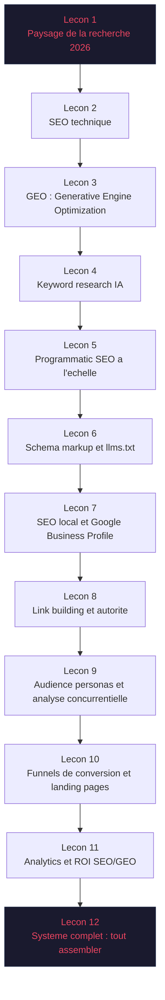
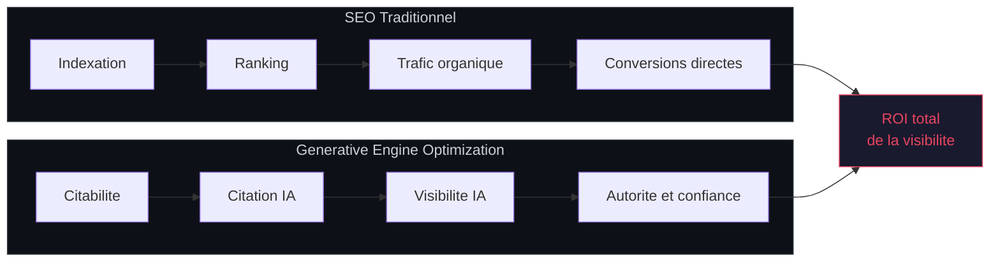
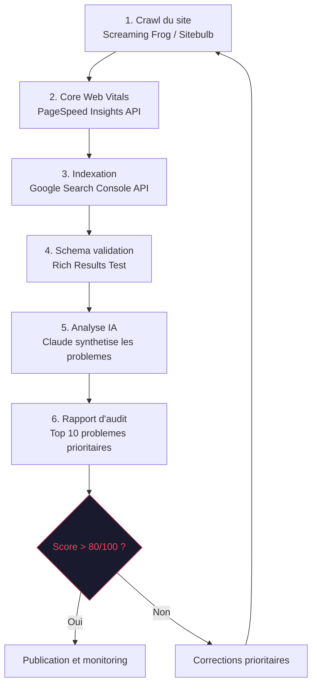
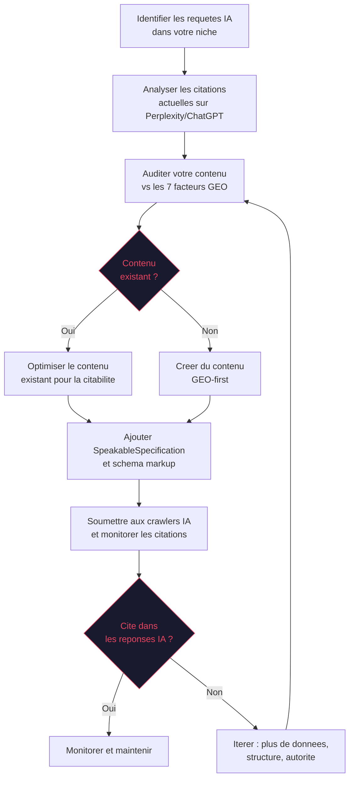
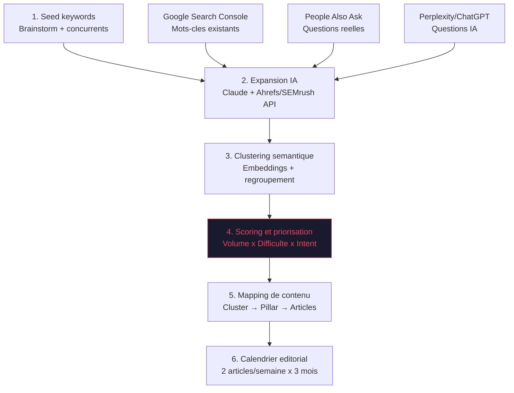
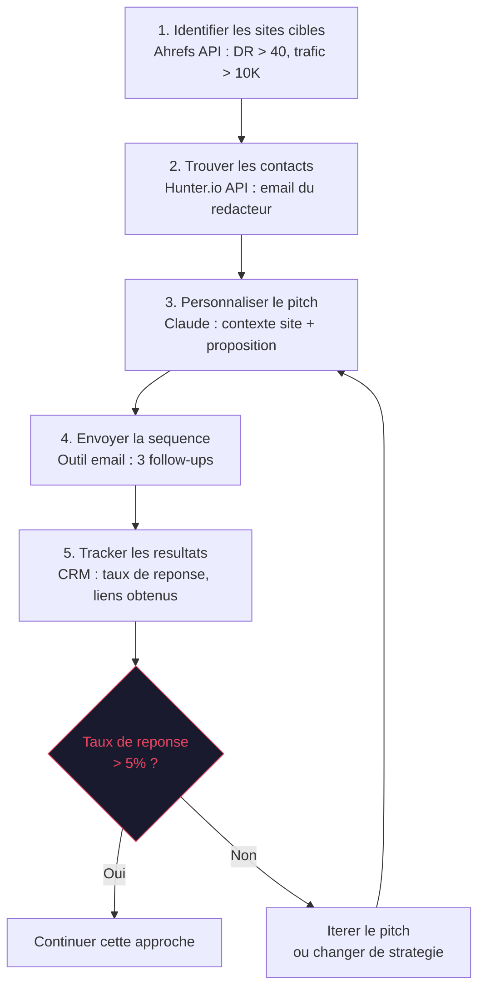
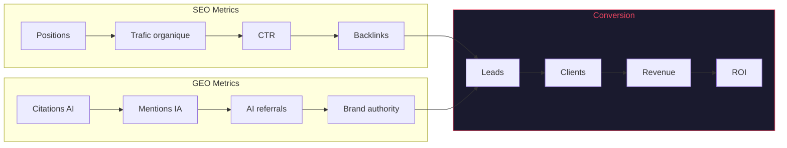
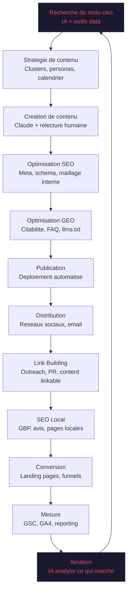

# SEO & GEO : AI Expert en Visibilite

Le SEO tel qu'on le connaissait est mort. En 2026, la moitie des recherches ne generent plus de clic — les reponses sont directement dans les AI Overviews, les resultats Perplexity, ou les reponses ChatGPT. Ce module vous transforme en expert des deux mondes : le SEO technique traditionnel ET la Generative Engine Optimization (GEO), la nouvelle discipline qui determine si votre contenu est cite par les IA.

Vous apprendrez a construire des pipelines automatises de contenu, a deployer du SEO programmatique a grande echelle, a optimiser votre presence locale, a creer des funnels de conversion performants, et a mesurer le ROI de chaque action avec precision.

---

## Objectif du module

A l'issue de ce module, vous saurez construire une strategie de visibilite complete couvrant le SEO classique et le GEO, deployer des pipelines de contenu automatises par IA, optimiser votre presence locale et votre Google Business Profile, creer des landing pages et funnels de conversion, analyser vos concurrents, et mesurer le ROI de chaque canal de recherche — humain ou generatif.

---

## Architecture du module



---

## Lecon 1 — Le nouveau paysage de la recherche en 2026

### Ce que vous allez apprendre

L'evolution des moteurs de recherche, l'impact des AI Overviews sur le trafic organique, et pourquoi la strategie SEO doit desormais integrer les moteurs de recherche generatifs. Comprendre les metriques qui comptent vraiment.

### Contenu detaille

**L'evolution des sources de trafic de recherche (2020-2026) :**

| Annee | Google classique | AI Overviews | ChatGPT Search | Perplexity | Autres IA |
|-------|-----------------|--------------|----------------|------------|-----------|
| 2020 | 92% | 0% | 0% | 0% | 8% |
| 2023 | 88% | 2% | 1% | 0.5% | 8.5% |
| 2024 | 78% | 10% | 4% | 3% | 5% |
| 2025 | 65% | 18% | 8% | 5% | 4% |
| 2026 | 52% | 22% | 12% | 8% | 6% |

**Les 3 types de moteurs de recherche en 2026 :**

1. **Moteurs traditionnels** (Google, Bing) — Resultats indexes, liens bleus, snippets. Le trafic baisse mais la conversion reste elevee. SEO technique + contenu toujours essentiels.
2. **Moteurs generatifs** (Google AI Overviews, SearchGPT, Perplexity) — Reponses synthetisees a partir de plusieurs sources. Pas de clic necessaire. La citation = la nouvelle visibilite.
3. **Assistants IA** (ChatGPT, Claude, Gemini) — Recommandations directes dans les conversations. Reputation = decouverte. Pas de SEO possible, mais GEO oui.

**Le zero-click problem en chiffres :**
- 58% des recherches Google ne generent aucun clic en 2026
- Les AI Overviews apparaissent sur 40% des requetes commerciales
- Le CTR moyen du premier resultat organique est passe de 28% (2020) a 14% (2026)
- Mais : les sites cites dans les AI Overviews voient +35% de trafic qualifie

**Le framework SEO+GEO unifie :**



**L'economie de la reponse :**

Les utilisateurs ne veulent plus des liens. Ils veulent des reponses. Cette mutation fondamentale change le role du contenu web : il ne s'agit plus seulement de ranker, mais d'etre la source que l'IA choisit de citer. Cela implique :

- **Contenu structure** : headers clairs, listes, tableaux, definitions directes
- **Donnees sourcees** : chiffres precis, etudes referenciees, dates de mise a jour
- **Format reponse-ready** : paragraphes autonomes qui repondent directement a une question
- **Autorite demontrable** : E-E-A-T (Experience, Expertise, Autorite, Fiabilite)

**Les AI crawlers a connaitre :**

| Crawler | Editeur | User-Agent | Impact |
|---------|---------|------------|--------|
| GPTBot | OpenAI | GPTBot/1.0 | ChatGPT Search |
| ClaudeBot | Anthropic | ClaudeBot/1.0 | Claude |
| PerplexityBot | Perplexity | PerplexityBot | Perplexity |
| Google-Extended | Google | Google-Extended | AI Overviews |
| Bingbot | Microsoft | Bingbot | Bing Copilot |
| CCBot | Common Crawl | CCBot/2.0 | Divers modeles |

**robots.txt recommande pour maximiser le GEO :**

```
User-agent: GPTBot
Allow: /

User-agent: ClaudeBot
Allow: /

User-agent: PerplexityBot
Allow: /

User-agent: Google-Extended
Allow: /

User-agent: CCBot
Allow: /

Sitemap: https://example.com/sitemap.xml
```

### Exercice pratique

Analysez les 20 mots-cles principaux de votre site. Pour chacun, verifiez : (1) votre position Google classique, (2) si un AI Overview apparait, (3) si vous etes cite dans cet Overview. Calculez votre "GEO coverage rate" (nombre de citations / nombre d'Overviews). Objectif : identifier les 5 mots-cles ou vous avez un AI Overview mais pas de citation — ce sont vos priorites GEO.

---

## Lecon 2 — Fondations du SEO technique

### Ce que vous allez apprendre

Les fondamentaux techniques qui permettent aux moteurs de recherche de crawler, indexer et comprendre votre site. L'audit technique comme point de depart obligatoire de toute strategie SEO.

### Contenu detaille

**La checklist SEO technique (les 5 piliers) :**

| Pilier | Elements cles | Outils de verification |
|--------|---------------|----------------------|
| **Crawlability** | robots.txt, sitemap.xml, architecture URL | Screaming Frog, Google Search Console |
| **Indexability** | Meta robots, canonical, hreflang, pagination | GSC Coverage, Ahrefs Site Audit |
| **Renderability** | JavaScript rendering, Core Web Vitals, mobile | Lighthouse, PageSpeed Insights, Chrome DevTools |
| **Securite** | HTTPS, mixed content, headers securite | SSL Labs, Security Headers |
| **Structure** | Schema markup, heading hierarchy, internal linking | Schema Validator, Sitebulb |

**Architecture URL optimale :**

```
Mauvais :
example.com/p?id=12345
example.com/blog/2024/03/15/mon-article-seo-2024-guide-complet-debutant

Bon :
example.com/guide-seo-debutant
example.com/blog/seo-technique-2026

Regles :
- Longueur : 3-5 mots max dans le slug
- Separateur : tirets (-)
- Pas de dates dans l'URL (contenu evergreen)
- Hierarchie claire : /categorie/sous-categorie/page
- Pas de parametres dynamiques visibles
```

**Core Web Vitals — seuils 2026 :**

| Metrique | Bon | A ameliorer | Mauvais | Impact SEO |
|----------|-----|-------------|---------|-----------|
| LCP (Largest Contentful Paint) | < 2.5s | 2.5-4s | > 4s | Eleve |
| INP (Interaction to Next Paint) | < 200ms | 200-500ms | > 500ms | Eleve |
| CLS (Cumulative Layout Shift) | < 0.1 | 0.1-0.25 | > 0.25 | Moyenne |
| TTFB (Time to First Byte) | < 800ms | 800ms-1.8s | > 1.8s | Moyenne |

**Pipeline d'audit SEO technique :**



**Audit technique automatise avec l'IA :**

```bash
# Pipeline d'audit SEO technique automatise
# 1. Crawler le site
npx screaming-frog-cli --crawl https://example.com --output /tmp/crawl.csv

# 2. Analyser les Core Web Vitals via l'API PageSpeed
curl "https://www.googleapis.com/pagespeedonline/v5/runPagespeed?\
url=https://example.com&strategy=mobile&key=$API_KEY" \
| jq '{lcp: .lighthouseResult.audits["largest-contentful-paint"].numericValue,
       inp: .lighthouseResult.audits["interaction-to-next-paint"].numericValue,
       cls: .lighthouseResult.audits["cumulative-layout-shift"].numericValue}'

# 3. Verifier l'indexation via Search Console API
python3 scripts/gsc-index-check.py --site https://example.com --days 30

# 4. Generer le rapport d'audit avec Claude
cat /tmp/crawl.csv | claude "Analyse ce crawl SEO. Identifie les 10 problemes \
techniques les plus critiques. Pour chaque probleme, donne : description, \
impact estime sur le trafic, priorite (P1/P2/P3), et solution concrete."
```

**Hierarchie de crawl et budget :**

| Type de page | Priorite de crawl | Actions |
|-------------|-------------------|---------|
| Pages produit/service | Maximale | Liens internes, sitemap prioritaire |
| Articles piliers | Elevee | Maillage interne fort |
| Articles satellites | Moyenne | Liens depuis les piliers |
| Pages utilitaires (CGV, mentions) | Faible | noindex si pas de valeur SEO |
| Pages dupliquees/thin | Aucune | Canonical, noindex, ou suppression |

### Exercice pratique

Realisez un audit technique complet de votre site en suivant le pipeline ci-dessus. Utilisez Screaming Frog (version gratuite = 500 URLs) ou un outil equivalent. Pour chaque probleme identifie, redigez une fiche : probleme, impact, solution, et temps de correction estime. Priorisez les 5 corrections les plus impactantes et executez-les dans la semaine.

---

## Lecon 3 — GEO : Generative Engine Optimization

### Ce que vous allez apprendre

Les principes de la Generative Engine Optimization — comment optimiser votre contenu pour etre cite par les IA generatives. Les differents moteurs, leurs algorithmes de citation, et les strategies qui fonctionnent.

### Contenu detaille

**Qu'est-ce que le GEO ?**

Le GEO (Generative Engine Optimization) est la discipline qui vise a maximiser la probabilite que votre contenu soit cite, reference ou recommande par les moteurs de recherche generatifs (Google AI Overviews, ChatGPT, Perplexity, Claude).

**Les 7 facteurs de citation GEO :**

| Facteur | Poids estime | Ce que les IA privilegient |
|---------|-------------|--------------------------|
| **Autorite du domaine** | 25% | Backlinks, anciennete, mentions, E-E-A-T |
| **Qualite du contenu** | 20% | Profondeur, originalite, donnees uniques |
| **Structure semantique** | 15% | Headers clairs, listes, tableaux, schema markup |
| **Fraicheur** | 15% | Date de publication, mises a jour regulieres |
| **Citations et sources** | 10% | References, etudes, donnees primaires |
| **Consensus web** | 10% | Coherence avec d'autres sources fiables |
| **Format reponse-ready** | 5% | Paragraphes concis, definitions directes |

**Processus d'optimisation GEO par citation :**



**Strategies GEO par moteur :**

1. **Google AI Overviews** :
   - Privilegier les formats "definition + explication + exemple"
   - Structurer avec des H2/H3 en questions naturelles
   - Inclure des donnees chiffrees sourcees
   - Optimiser le schema markup (FAQ, HowTo, Article)
   - Les listes et tableaux sont fortement privilegies

2. **Perplexity** :
   - Citations academiques et rapports officiels
   - Donnees recentes (< 6 mois)
   - Format journalistique : fait, source, analyse
   - URLs courtes et descriptives
   - Autorise PerplexityBot dans votre robots.txt

3. **ChatGPT Search** :
   - Contenu conversationnel et pedagogique
   - Listes a puces avec points actionnables
   - Pas de clickbait — repondre directement a la question
   - Expertise demontree (auteur identifiable, credentials)
   - Autorise GPTBot dans votre robots.txt

4. **Claude** :
   - Profondeur et nuance privilegiees
   - Sources primaires et donnees originales
   - Contexte et caveats (pas de simplification excessive)
   - Autorise ClaudeBot dans votre robots.txt

**Citabilite au niveau du passage :**

Les moteurs IA citent des PASSAGES, pas des pages entieres. Chaque paragraphe doit etre independamment significatif et citable. Le test : votre paragraphe pourrait-il etre cite dans une encyclopedie sans contexte supplementaire ?

**Regles de la citabilite par passage :**
- Chaque paragraphe repond a une question specifique
- La premiere phrase est une affirmation factuelle et autonome
- Les chiffres et dates sont presents dans le passage lui-meme
- Le vocabulaire est precis et non ambigu
- Le passage n'a pas besoin du contexte des paragraphes precedents

**Le template de contenu GEO-optimise :**

```markdown
# [Question exacte que l'utilisateur pose]

[Reponse directe en 1-2 phrases — la "featured answer"]

## Contexte et definition

[Paragraphe d'explication — 50-100 mots]

## [Sous-question 1]

[Reponse structuree avec donnees]

| Critere | Detail | Source |
|---------|--------|--------|
| ...     | ...    | ...    |

## Points cles a retenir

- Point 1 (actionnable)
- Point 2 (actionnable)
- Point 3 (actionnable)

## Sources

1. [Source primaire — rapport, etude, donnees]
2. [Source secondaire — article d'expert]
```

**Optimisation FAQ pour l'IA :**

Les sections FAQ sont la source numero un pour les citations IA. Chaque question-reponse doit etre autonome, contenir des chiffres precis, et utiliser le balisage FAQPage schema.

### Exercice pratique

Prenez un de vos articles existants et reecrivez-le en appliquant les 7 facteurs GEO. Comparez la version originale et la version optimisee en verifiant : (1) presence de reponse directe, (2) structure semantique, (3) citations sourcees, (4) donnees chiffrees, (5) passages autonomes. Soumettez les deux versions a Perplexity pour la meme requete et comparez laquelle est citee.

---

## Lecon 4 — Keyword research et strategie de contenu propulsees par l'IA

### Ce que vous allez apprendre

Comment utiliser l'IA pour identifier les opportunites de mots-cles a fort potentiel, creer des clusters de contenu strategiques, et construire un calendrier editorial data-driven. La methode pour passer de 0 a 100 articles cibles.

### Contenu detaille

**Le pipeline de keyword research IA :**



**Les 4 types d'intention de recherche :**

| Intent | Exemple | Format optimal | Taux de conversion |
|--------|---------|----------------|-------------------|
| **Informationnelle** | "qu'est-ce que le GEO" | Guide, definition, tutoriel | 1-3% |
| **Navigationnelle** | "Ahrefs login" | Page de marque | 5-10% |
| **Commerciale** | "meilleur outil SEO 2026" | Comparatif, review | 8-15% |
| **Transactionnelle** | "acheter Ahrefs" | Landing page, pricing | 15-30% |

**Prompt Claude pour la recherche de mots-cles :**

```
Tu es un expert SEO. Pour le domaine [NICHE], genere :

1. 50 mots-cles informationnels (questions que les debutants posent)
2. 20 mots-cles commerciaux (comparaisons, "meilleur X")
3. 10 mots-cles transactionnels (avec intention d'achat)

Pour chaque mot-cle, estime :
- Volume de recherche mensuel (faible/moyen/eleve)
- Difficulte (facile/moyen/difficile)
- Potentiel GEO (oui/non — ce mot-cle declenche-t-il un AI Overview ?)

Organise en clusters thematiques de 5-8 mots-cles.
Identifie le pillar page pour chaque cluster.
```

**La methode Topic Cluster :**

```
                    +-- Article satellite 1
                    +-- Article satellite 2
Pillar Page --------+-- Article satellite 3
(3000+ mots)        +-- Article satellite 4
                    +-- Article satellite 5

Liens internes bidirectionnels entre pillar et satellites.
Chaque satellite cible un mot-cle longue traine specifique.
Le pillar cible le mot-cle principal (head term).
```

**Scoring de priorisation ICE pour les mots-cles :**

La methode ICE (Impact x Confidence x Ease) permet de prioriser objectivement :

| Mot-cle | Volume | Difficulte | GEO potentiel | ICE Score | Priorite |
|---------|--------|-----------|---------------|-----------|----------|
| "geo optimization" | Moyen | Facile | Oui | 810 | P1 |
| "seo vs geo" | Eleve | Facile | Oui | 900 | P1 |
| "ai overview optimization" | Faible | Facile | Oui | 720 | P2 |
| "programmatic seo guide" | Moyen | Moyen | Non | 480 | P3 |

**Formule ICE :**
```
ICE = Impact (1-10) x Confidence (1-10) x Ease (1-10)

Impact = Volume de recherche x Taux de conversion estime x Valeur client
Confidence = Qualite des donnees (outils vs estimation)
Ease = Inverse de la difficulte de classement
```

**Analyse des lacunes de contenu (Content Gap Analysis) :**

1. Identifier les 5 principaux concurrents dans votre niche
2. Extraire leurs mots-cles avec Ahrefs/SEMrush
3. Croiser avec vos mots-cles existants
4. Les mots-cles ou ils rankent et pas vous = vos lacunes
5. Prioriser les lacunes par ICE Score

### Exercice pratique

Utilisez Claude pour generer 50 mots-cles dans votre niche. Organisez-les en 5 clusters thematiques. Pour chaque cluster, identifiez la pillar page et les 5 articles satellites. Faites une analyse de lacunes contre 3 concurrents. Creez un calendrier editorial de 3 mois avec 2 publications par semaine, priorise par ICE Score.

---

## Lecon 5 — Content creation a l'echelle : programmatic SEO

### Ce que vous allez apprendre

Comment produire des centaines de pages de contenu optimise SEO en utilisant le programmatic SEO (pSEO) et l'IA generative. Les templates, les pipelines de generation, les implementations Next.js, et les garde-fous qualite.

### Contenu detaille

**Qu'est-ce que le programmatic SEO ?**

Le programmatic SEO consiste a creer des pages a grande echelle en combinant des templates avec des donnees structurees. Chaque page cible un mot-cle longue traine specifique.

**Exemples de succes :**
- **Zapier** : 25 000+ pages "Comment connecter X a Y" — 5M visites/mois
- **Nomadlist** : 1 500+ pages ville — 1M visites/mois
- **Wise** : 10 000+ pages "Envoyer de l'argent de X a Y" — 8M visites/mois
- **Tripadvisor** : 10M+ pages lieu — 200M visites/mois

**Les types de pages pSEO qui fonctionnent :**

| Type | Template | Exemple |
|------|----------|---------|
| **Comparaison** | "[Produit] vs [Produit]" | "Claude vs ChatGPT pour le business" |
| **Integration** | "[Outil A] + [Outil B]" | "Slack + GitHub Integration" |
| **Localisation** | "[Service] a [Ville]" | "Consulting IA a Paris" |
| **Cas d'usage** | "[Service] pour [Industrie]" | "Agents IA pour la Sante" |
| **Glossaire** | "Definition de [Terme]" | "C'est quoi l'Agentic AI ?" |
| **Alternative** | "Alternatives a [Produit]" | "Alternatives a Zapier 2026" |

**Implementation pSEO avec Next.js :**

```javascript
// app/[category]/[slug]/page.tsx
import { Metadata } from 'next'
import { getPageData, getAllPages } from '@/lib/pseo-data'

// Genere toutes les pages statiquement au build
export async function generateStaticParams() {
  const pages = await getAllPages()
  return pages.map((page) => ({
    category: page.category,
    slug: page.slug,
  }))
}

// Metadata unique par page (titre, description, OG)
export async function generateMetadata({ params }): Promise<Metadata> {
  const data = await getPageData(params.category, params.slug)
  return {
    title: data.metaTitle,
    description: data.metaDescription,
    openGraph: {
      title: data.ogTitle,
      description: data.ogDescription,
      type: 'article',
    },
  }
}

// Page avec contenu unique genere par IA
export default async function PseoPage({ params }) {
  const data = await getPageData(params.category, params.slug)

  return (
    <article>
      <h1>{data.title}</h1>
      <p className="lead">{data.introduction}</p>

      {/* Contenu unique genere par IA */}
      <section dangerouslySetInnerHTML={{ __html: data.content }} />

      {/* FAQ schema-ready */}
      <section>
        <h2>Questions frequentes</h2>
        {data.faq.map((item, i) => (
          <details key={i}>
            <summary>{item.question}</summary>
            <p>{item.answer}</p>
          </details>
        ))}
      </section>

      {/* JSON-LD structure */}
      <script
        type="application/ld+json"
        dangerouslySetInnerHTML={{
          __html: JSON.stringify(data.jsonLd),
        }}
      />
    </article>
  )
}
```

**Le pipeline de generation de contenu IA :**

```python
import anthropic
import json

client = anthropic.Anthropic()

def generate_seo_article(keyword: str, template: str, data: dict) -> str:
    """Genere un article SEO optimise a partir d'un template et de donnees."""

    prompt = f"""
    Tu es un redacteur SEO expert. Genere un article complet pour le mot-cle : "{keyword}"

    Template a suivre :
    {template}

    Donnees a integrer :
    {json.dumps(data, ensure_ascii=False)}

    Regles :
    - Titre H1 avec le mot-cle exact
    - Introduction de 50-100 mots avec le mot-cle dans les 50 premiers mots
    - 5-8 sous-sections H2 avec des variations du mot-cle
    - 1 tableau de donnees minimum
    - 1 liste a puces minimum
    - FAQ schema-ready (3-5 questions)
    - Meta description de 155 caracteres
    - Ton : expert mais accessible
    - Longueur : 1500-2500 mots
    - Chaque paragraphe doit etre autonome (citable par l'IA)
    """

    response = client.messages.create(
        model="claude-sonnet-4-20250514",
        max_tokens=4000,
        messages=[{"role": "user", "content": prompt}]
    )

    return response.content[0].text


def quality_check(article: str) -> dict:
    """Verifie la qualite d'un article genere."""
    checks = {
        "word_count": len(article.split()) >= 1500,
        "has_h2": article.count("## ") >= 5,
        "has_table": "|" in article and "---" in article,
        "has_list": "- " in article,
        "has_faq": "FAQ" in article or "Questions" in article,
    }
    score = sum(checks.values()) / len(checks) * 100
    return {"score": score, "checks": checks}


# Exemple : generer 100 pages "Meilleur [outil] pour [usage]"
tools = ["Ahrefs", "SEMrush", "Screaming Frog", "Surfer SEO"]
usages = ["debutant", "agence", "e-commerce", "SaaS", "local"]

for tool in tools:
    for usage in usages:
        keyword = f"meilleur {tool} pour {usage}"
        article = generate_seo_article(keyword, template, {"tool": tool, "usage": usage})
        quality = quality_check(article)
        if quality["score"] >= 80:
            save_article(keyword, article)
        else:
            print(f"Qualite insuffisante ({quality['score']}%) pour : {keyword}")
```

**Les garde-fous qualite pour le contenu programmatique :**

| Garde-fou | Pourquoi | Comment |
|-----------|----------|---------|
| **Unicite** | Google penalise le contenu duplique | Chaque page doit avoir >70% de contenu unique |
| **Profondeur** | Le thin content ne ranke pas | Minimum 1500 mots, 3 tableaux, 5 sous-sections |
| **E-E-A-T** | Autorite et expertise | Auteur identifie, sources citees, date de MAJ |
| **Actualisation** | La fraicheur est un signal | Pipeline de mise a jour trimestriel automatise |
| **Canonicalisation** | Eviter la cannibalisation | Un mot-cle principal = une seule page |
| **Quality gate** | Empecher le contenu faible | Score > 80/100 avant publication |

**Le workflow complet :**

```
Donnees (CSV/API) --> Template (Markdown) --> IA (Claude) --> Quality Gate (>80/100)
                                                                    |
                                                         Oui       |     Non
                                                          |        |       |
                                                   Publication   Regeneration
                                                      (CMS)
                                                          |
                                                   Monitoring (GSC)
```

### Exercice pratique

Creez un template de contenu programmatique pour votre niche. Definissez les variables (le contenu qui change par page). Generez 10 articles avec Claude en variant les donnees. Evaluez chaque article avec la grille de garde-fous qualite. Implementez le quality gate automatise. Publiez les articles qui passent le seuil de 80/100.

---

## Lecon 6 — Schema markup, donnees structurees, llms.txt et SpeakableSpecification

### Ce que vous allez apprendre

Comment implementer les donnees structurees (JSON-LD) pour maximiser votre visibilite dans les SERP et les AI Overviews. Les schemas essentiels, llms.txt, SpeakableSpecification, et l'automatisation de l'implementation.

### Contenu detaille

**Les 10 schemas les plus impactants pour le SEO/GEO :**

| Schema | Impact SEO | Impact GEO | Utilisation |
|--------|-----------|-----------|-------------|
| **Article** | Eleve | Eleve | Blog, guides, actualites |
| **FAQ** | Eleve | Tres eleve | Pages produit, guides |
| **HowTo** | Eleve | Eleve | Tutoriels, processus |
| **Product** | Eleve | Moyen | E-commerce, SaaS |
| **Review** | Eleve | Moyen | Comparatifs, avis |
| **Organization** | Moyen | Eleve | Page d'accueil, a propos |
| **BreadcrumbList** | Moyen | Faible | Navigation, toutes pages |
| **VideoObject** | Moyen | Moyen | Pages avec video |
| **LocalBusiness** | Eleve (local) | Moyen | Entreprises locales |
| **SpeakableSpecification** | Faible | Tres eleve | Contenu voice/IA |

**Implementation JSON-LD pour un article GEO-optimise :**

```json
{
  "@context": "https://schema.org",
  "@type": "Article",
  "headline": "Guide complet du GEO en 2026",
  "description": "Maitriser la Generative Engine Optimization pour etre cite par les IA",
  "author": {
    "@type": "Person",
    "name": "Votre Nom",
    "url": "https://example.com/auteur",
    "jobTitle": "Expert SEO & GEO",
    "sameAs": [
      "https://linkedin.com/in/votre-profil",
      "https://twitter.com/votre-handle"
    ]
  },
  "publisher": {
    "@type": "Organization",
    "name": "Votre Entreprise",
    "logo": {
      "@type": "ImageObject",
      "url": "https://example.com/logo.png"
    }
  },
  "datePublished": "2026-04-01",
  "dateModified": "2026-04-15",
  "mainEntityOfPage": "https://example.com/guide-geo-2026",
  "speakable": {
    "@type": "SpeakableSpecification",
    "cssSelector": [".article-summary", ".key-takeaways", ".definition"]
  }
}
```

**Le schema SpeakableSpecification — le secret GEO :**

SpeakableSpecification indique aux IA quelles parties de votre contenu sont "lisibles" — directement citables dans une reponse vocale ou generative. C'est le signal le plus direct pour le GEO.

```json
{
  "@type": "SpeakableSpecification",
  "cssSelector": [
    ".answer-box",
    ".definition",
    ".summary",
    ".key-takeaway",
    ".faq-answer"
  ]
}
```

**Regles d'implementation :**
- Les selecteurs CSS doivent pointer vers du contenu factuel et autonome
- Chaque section ciblee doit contenir 20-150 mots
- Pas de contenu promotionnel dans les sections speakable
- Privilegier les definitions, chiffres cles, et reponses directes

**llms.txt — le resume de site lisible par l'IA :**

Le fichier `/llms.txt` est le nouveau standard pour fournir aux AI crawlers un resume structure de votre site. Il complement le robots.txt et le sitemap.

```markdown
# Example.com

> Plateforme de formation SEO et GEO propulsee par l'IA

## A propos
Example.com est une plateforme de formation en ligne specialisee dans
le SEO et la Generative Engine Optimization (GEO). Fondee en 2024, elle
sert plus de 5000 professionnels du marketing digital.

## Contenu principal
- [Guide SEO 2026](/guide-seo-2026): Guide complet du SEO technique et strategique
- [Guide GEO](/guide-geo): Tout savoir sur la Generative Engine Optimization
- [Outils SEO](/outils): Comparatifs et reviews des meilleurs outils SEO

## Expertise
- SEO technique et strategique
- Generative Engine Optimization (GEO)
- Programmatic SEO a grande echelle
- Content marketing propulse par l'IA

## Contact
- Email: contact@example.com
- LinkedIn: linkedin.com/company/example
```

**llms-full.txt :**

Le fichier `/llms-full.txt` est la version complete avec toutes les pages, descriptions et metadonnees. Il est destine aux crawlers qui veulent une cartographie exhaustive.

**Schema FAQPage complet :**

```json
{
  "@context": "https://schema.org",
  "@type": "FAQPage",
  "mainEntity": [
    {
      "@type": "Question",
      "name": "Qu'est-ce que le GEO ?",
      "acceptedAnswer": {
        "@type": "Answer",
        "text": "Le GEO (Generative Engine Optimization) est la discipline qui vise a maximiser la probabilite que votre contenu soit cite par les moteurs de recherche IA comme Google AI Overviews, ChatGPT et Perplexity."
      }
    },
    {
      "@type": "Question",
      "name": "Quelle est la difference entre SEO et GEO ?",
      "acceptedAnswer": {
        "@type": "Answer",
        "text": "Le SEO optimise pour le classement dans les resultats traditionnels de Google. Le GEO optimise pour etre cite dans les reponses generees par l'IA. Les deux sont complementaires : 80% des bonnes pratiques SEO aident aussi le GEO."
      }
    }
  ]
}
```

**Pipeline d'automatisation du schema markup :**

```python
def generate_schema(page_type: str, content: dict) -> dict:
    """Genere le schema JSON-LD adapte au type de page."""
    schemas = {
        "article": build_article_schema(content),
        "faq": build_faq_schema(content),
        "howto": build_howto_schema(content),
        "product": build_product_schema(content),
        "local": build_local_business_schema(content),
    }
    schema = schemas.get(page_type, {})

    # Toujours ajouter SpeakableSpecification
    schema["speakable"] = {
        "@type": "SpeakableSpecification",
        "cssSelector": [".answer-box", ".key-points", ".summary", ".definition"]
    }
    return schema


def validate_schema(schema: dict) -> bool:
    """Valide le schema contre les specifications Google."""
    required_fields = {
        "Article": ["headline", "author", "datePublished", "dateModified"],
        "FAQPage": ["mainEntity"],
        "LocalBusiness": ["name", "address", "telephone"],
    }
    schema_type = schema.get("@type", "")
    for field in required_fields.get(schema_type, []):
        if field not in schema:
            print(f"Champ manquant : {field} pour {schema_type}")
            return False
    return True
```

### Exercice pratique

Implementez 4 types de schema markup sur votre site : Article (blog post), FAQ (page produit), Organization (page d'accueil), et LocalBusiness (si applicable). Creez votre fichier `/llms.txt` et `/llms-full.txt`. Ajoutez SpeakableSpecification sur vos 5 pages les plus importantes. Validez tout avec le Rich Results Test de Google. Verifiez que vos AI crawlers sont autorises dans robots.txt.

---

## Lecon 7 — SEO local et Google Business Profile

### Ce que vous allez apprendre

Comment dominer les resultats de recherche locale avec l'optimisation Google Business Profile, le schema LocalBusiness, les landing pages locales, et les strategies d'avis. Essentiel pour toute entreprise avec une dimension geographique.

### Contenu detaille

**Pourquoi le SEO local est essentiel :**

- 46% de toutes les recherches Google ont une intention locale
- 88% des recherches locales sur mobile aboutissent a un appel ou une visite en 24h
- Le local pack (3 resultats Google Maps) capte 44% des clics sur les requetes locales
- Les AI Overviews integrent de plus en plus les resultats locaux

**Optimisation du Google Business Profile (GBP) :**

| Element | Action | Impact |
|---------|--------|--------|
| **Nom** | Nom exact de l'entreprise (pas de mots-cles supplementaires) | Eleve |
| **Categorie** | Categorie principale precise + categories secondaires | Eleve |
| **Description** | 750 caracteres, mots-cles naturels, proposition de valeur | Moyen |
| **Photos** | 10+ photos de qualite, mises a jour mensuellement | Eleve |
| **Posts** | Publications hebdomadaires (evenements, offres, actualites) | Moyen |
| **Avis** | Strategie d'obtention + reponses a tous les avis | Tres eleve |
| **Q&R** | Pre-remplir avec les questions courantes | Moyen |
| **Horaires** | Toujours a jour, y compris jours feries | Eleve |
| **Attributs** | Renseigner tous les attributs disponibles | Faible |

**Schema LocalBusiness complet :**

```json
{
  "@context": "https://schema.org",
  "@type": "LocalBusiness",
  "name": "Votre Entreprise",
  "image": "https://example.com/photo.jpg",
  "address": {
    "@type": "PostalAddress",
    "streetAddress": "123 Rue de la Paix",
    "addressLocality": "Paris",
    "postalCode": "75001",
    "addressCountry": "FR"
  },
  "geo": {
    "@type": "GeoCoordinates",
    "latitude": 48.8566,
    "longitude": 2.3522
  },
  "telephone": "+33-1-23-45-67-89",
  "url": "https://example.com",
  "openingHoursSpecification": [
    {
      "@type": "OpeningHoursSpecification",
      "dayOfWeek": ["Monday", "Tuesday", "Wednesday", "Thursday", "Friday"],
      "opens": "09:00",
      "closes": "18:00"
    }
  ],
  "aggregateRating": {
    "@type": "AggregateRating",
    "ratingValue": "4.8",
    "reviewCount": "127"
  },
  "areaServed": {
    "@type": "City",
    "name": "Paris"
  },
  "priceRange": "$$"
}
```

**Strategie de landing pages locales :**

Pour chaque ville ou zone de service, creer une page dediee avec :
- H1 incluant le nom du service + la ville
- Contenu unique de 1000+ mots (pas de duplication entre villes)
- Temoignages de clients locaux
- Schema LocalBusiness specifique a chaque localisation
- Integration Google Maps embed
- Mots-cles locaux naturellement integres
- Liens vers le Google Business Profile

**Strategie d'avis Google :**

1. **Obtenir des avis** : email post-service avec lien direct vers la page d'avis Google
2. **Repondre a tous** : chaque avis recoit une reponse personnalisee dans les 24h
3. **Avis negatifs** : reponse empathique, proposition de resolution, suivi
4. **Volume** : objectif de 5-10 nouveaux avis par mois
5. **Diversite** : encourager les avis detailles avec mots-cles naturels

**Posts Google Business Profile generes par IA :**

```python
def generate_gbp_post(business_type: str, topic: str) -> dict:
    """Genere un post GBP optimise."""
    prompt = f"""
    Genere un post Google Business Profile pour une {business_type}.
    Sujet : {topic}

    Regles :
    - Maximum 1500 caracteres
    - Inclure un call-to-action
    - Ton professionnel mais chaleureux
    - Inclure 1-2 mots-cles locaux naturellement
    """
    # ... appel API Claude
    return {"text": response, "cta": "En savoir plus", "type": "UPDATE"}
```

### Exercice pratique

Si vous avez une activite locale : optimisez completement votre Google Business Profile (tous les champs), creez le schema LocalBusiness, publiez 4 posts GBP en un mois, et mettez en place la strategie d'avis. Si votre activite est nationale : creez 3 landing pages locales pour vos 3 plus grandes villes cibles avec contenu unique et schema.

---

## Lecon 8 — Link building et autorite avec l'IA

### Ce que vous allez apprendre

Les strategies de link building qui fonctionnent en 2026, comment l'IA peut accelerer la prospection et la creation de contenu linkable, et les metriques d'autorite qui comptent pour le SEO et le GEO.

### Contenu detaille

**Les 5 strategies de link building les plus efficaces en 2026 :**

| Strategie | Difficulte | ROI | Temps | Scalable avec IA ? |
|-----------|-----------|-----|-------|-------------------|
| **Digital PR / Data studies** | Elevee | Tres eleve | 2-4 semaines | Oui (analyse + redaction) |
| **Guest posting strategique** | Moyenne | Eleve | 1-2 semaines | Oui (prospection + contenu) |
| **Broken link building** | Faible | Moyen | 3-5 jours | Oui (detection + outreach) |
| **Resource page outreach** | Moyenne | Moyen | 1-2 semaines | Oui (prospection) |
| **HARO / Connectively** | Faible | Moyen-eleve | 30 min/jour | Oui (veille + reponses) |

**Pipeline de prospection outreach automatise :**



**Le content linkable — ce qui attire naturellement des backlinks :**

1. **Etudes originales** — Sondages, analyses de donnees, rapports avec des chiffres exclusifs
2. **Outils gratuits** — Calculateurs, templates, generateurs (ex: "Generateur de meta descriptions IA")
3. **Infographies data-driven** — Visualisations de donnees complexes
4. **Guides definitifs** — Le contenu le plus complet sur un sujet (5000+ mots)
5. **Statistiques compilees** — "50 statistiques SEO en 2026" avec sources primaires

**Prompt Claude pour le digital PR :**

```
Analyse cette base de donnees [CSV avec donnees de l'industrie].
Identifie les 5 insights les plus surprenants ou contre-intuitifs.
Pour chaque insight, redige :
1. Un titre accrocheur pour un communique de presse
2. Un paragraphe de 100 mots avec le chiffre cle
3. Une citation d'expert attribuable
4. 3 angles pour des medias differents (tech, business, grand public)
```

**Metriques d'autorite a suivre :**

| Metrique | Outil | Seuil "bon" | Impact GEO |
|----------|-------|-------------|-----------|
| Domain Rating (DR) | Ahrefs | > 50 | Eleve |
| Domain Authority (DA) | Moz | > 40 | Moyen |
| Trust Flow | Majestic | > 30 | Eleve |
| Referring Domains | Ahrefs | > 500 | Eleve |
| Brand Mentions | Brand24 | Croissance | Tres eleve |

**Maillage interne strategique :**

Le maillage interne est le link building que vous controlez a 100%. Regles :
- Chaque page lie vers 3-5 pages liees
- Les pages piliers lient vers tous les articles clusters et inversement
- Utiliser des textes d'ancrage descriptifs (pas "cliquez ici")
- Auditer regulierement les pages orphelines (0 liens internes entrants)
- Le pagerank interne doit couler vers vos pages prioritaires

### Exercice pratique

Creez une "data study" dans votre niche : collectez des donnees (sondage, scraping, analyse), identifiez 3 insights surprenants avec Claude, redigez un communique de presse, identifiez 20 journalistes/blogueurs cibles avec Hunter.io. Envoyez les pitchs. En parallele, auditez votre maillage interne et corrigez les pages orphelines.

---

## Lecon 9 — Audience personas et analyse concurrentielle pour le SEO

### Ce que vous allez apprendre

Comment integrer la recherche d'audience personas et l'analyse concurrentielle dans votre strategie SEO/GEO. Comprendre qui cherche quoi, comment vos concurrents se positionnent, et ou se trouvent les opportunites non exploitees.

### Contenu detaille

**Pourquoi les personas sont essentiels au SEO :**

Le SEO ne consiste pas a optimiser pour des mots-cles — il consiste a optimiser pour des personnes qui utilisent des mots-cles. Sans comprendre qui cherche, pourquoi, et a quel stade de son parcours, vos efforts SEO manquent leur cible.

**Framework persona-SEO :**

| Element persona | Impact sur le SEO | Application |
|----------------|-------------------|-------------|
| **Douleur centrale** | Definit les mots-cles informationnels | "comment resoudre [douleur]" |
| **Vocabulaire utilise** | Definit les termes exacts a cibler | Mots du client, pas jargon expert |
| **Canal principal** | Definit ou distribuer le contenu | LinkedIn, YouTube, Reddit, etc. |
| **Stade de conscience** | Definit l'intention de recherche | Informationnelle vs transactionnelle |
| **Objections** | Definit le contenu FAQ | Repondre aux doutes dans le contenu |

**Mapper les mots-cles au parcours client :**

```
DECOUVERTE          CONSIDERATION          DECISION
(ne sait pas        (compare les           (pret a acheter)
qu'il a besoin)     solutions)

"c'est quoi         "meilleur outil        "acheter Ahrefs
le GEO"             SEO 2026"              plan pro"

Intent:             Intent:                Intent:
Informationnelle    Commerciale            Transactionnelle

Format:             Format:                Format:
Guide, definition   Comparatif, review     Landing page, pricing
```

**Analyse concurrentielle SEO :**

L'analyse concurrentielle ne consiste pas a copier — elle consiste a identifier les lacunes que vos concurrents ne comblent pas.

**Framework d'analyse SEO concurrentielle :**

1. **Identifier les 5 principaux concurrents SEO** (pas forcement les concurrents business)
   - Rechercher vos 10 mots-cles principaux sur Google
   - Lister les sites qui apparaissent le plus souvent
   - Ce sont vos concurrents SEO reels

2. **Analyser leur strategie de contenu**
   - Volume d'articles publies par mois
   - Types de contenu (guides, comparatifs, outils)
   - Structure des URLs et de l'architecture
   - Frequence de mise a jour

3. **Content Gap Analysis**
   - Mots-cles ou ils rankent et pas vous
   - Sujets qu'ils couvrent et pas vous
   - Formats de contenu qu'ils utilisent et pas vous

4. **Backlink Gap Analysis**
   - Sites qui lient vers eux mais pas vers vous
   - Strategies de link building qu'ils utilisent
   - Autorite de domaine comparative

5. **GEO Gap Analysis**
   - Citations IA : sont-ils cites plus que vous ?
   - Structure du contenu : leur contenu est-il plus citable ?
   - Schema markup : utilisent-ils SpeakableSpecification ?

**Matrice de positionnement concurrentiel SEO :**

| Critere | Vous | Concurrent A | Concurrent B | Concurrent C |
|---------|------|-------------|-------------|-------------|
| DR (Ahrefs) | ? | ? | ? | ? |
| Articles publies/mois | ? | ? | ? | ? |
| Mots-cles top 10 | ? | ? | ? | ? |
| Citations AI Overview | ? | ? | ? | ? |
| Schema markup | ? | ? | ? | ? |
| Maillage interne | ? | ? | ? | ? |

**Les signaux concurrentiels a surveiller :**

- **Nouveaux contenus** : quels sujets leurs concurrents couvrent-ils cette semaine ?
- **Changements de prix** : un changement de pricing peut signaler un pivot strategique
- **Nouvelles fonctionnalites** : chaque feature = nouveau mot-cle potentiel
- **Changements de positionnement** : leurs meta titles et descriptions changent-ils ?

**Outils de veille concurrentielle :**

| Outil | Usage | Prix |
|-------|-------|------|
| Ahrefs | Backlinks, mots-cles, content gap | $99-999/mois |
| SEMrush | Mots-cles, ads, audit technique | $129-499/mois |
| Google Alerts | Mentions de concurrents, gratuit | Gratuit |
| Visualping | Changements sur les pages concurrentes | $0-30/mois |
| SpyFu | Historique des mots-cles et ads | $39-79/mois |

### Exercice pratique

Definissez 3 personas principaux pour votre activite avec leurs douleurs, vocabulaire et stade de conscience. Pour chaque persona, identifiez 10 mots-cles specifiques. Realisez une analyse concurrentielle SEO complete de vos 3 principaux concurrents en remplissant la matrice ci-dessus. Identifiez les 5 plus grosses lacunes de contenu et creez un plan pour les combler en 30 jours.

---

## Lecon 10 — Funnels de conversion et landing pages

### Ce que vous allez apprendre

Comment convertir le trafic SEO/GEO en leads et clients grace a des landing pages optimisees et des funnels de conversion performants. L'integration du SEO dans l'ensemble du parcours d'achat.

### Contenu detaille

**Le probleme : trafic sans conversion**

Avoir 100 000 visites par mois ne sert a rien si le taux de conversion est de 0.1%. Le SEO/GEO genere le trafic. Les funnels et landing pages le convertissent.

**Le funnel SEO-to-conversion :**

```
TOFU (Top of Funnel)         SEO informationnels
Blog, guides, definitions    "qu'est-ce que le GEO"
    |                        Taux conversion : 2-5%
    v
MOFU (Middle of Funnel)      SEO commerciaux
Lead magnets, comparatifs    "meilleur outil SEO 2026"
    |                        Taux conversion : 15-30%
    v
BOFU (Bottom of Funnel)      SEO transactionnels
Landing pages, pricing       "acheter Ahrefs pro"
    |                        Taux conversion : 20-40%
    v
POST-FUNNEL                  Retention
Onboarding, upsell           "comment utiliser Ahrefs avance"
                             Taux retention : 90-97% (SaaS sain)
```

**Les 10 regles d'une landing page qui convertit :**

1. **Un seul objectif** — 1 page = 1 action. Pas de menu qui distrait.
2. **Headline visible sans scroll** — 5 secondes pour comprendre la proposition de valeur.
3. **Benefice > Feature** — "Gagne du temps" > "Automatisation". Parler du resultat.
4. **Social proof partout** — Nombres, logos, temoignages avec photos, stars.
5. **CTA visible et clair** — Couleur contrastee, texte action, repete plusieurs fois.
6. **Friction minimale** — Moins de champs = plus de conversions. Pas de compte requis.
7. **Urgence/rarete (si vraie)** — "Places limitees" seulement si c'est reel.
8. **Objections traitees** — FAQ qui repond aux doutes, garanties visibles.
9. **Mobile parfait** — 60%+ du trafic est mobile. Touch targets suffisamment grands.
10. **Vitesse** — < 3 secondes de chargement. Images optimisees.

**Frameworks de structure de landing page :**

**PAS (Problem-Agitate-Solution) :**
- **P** — Identifier le probleme clairement
- **A** — Appuyer sur la douleur, la rendre urgente
- **S** — Presenter la solution comme l'evidence

**AIDA (Attention-Interest-Desire-Action) :**
- **A** — Headline qui arrete le scroll
- **I** — Details intrigants, differenciation
- **D** — Preuves, temoignages, resultats
- **A** — CTA clair et irresistible

**4Ps (Picture-Promise-Prove-Push) :**
- **Picture** — Peindre une image vivante du resultat
- **Promise** — Faire une promesse specifique
- **Prove** — Prouver avec des evidences
- **Push** — Pousser vers l'action

**Optimisation SEO des landing pages :**

Les landing pages ne sont pas exemptees du SEO. Elles doivent cibler des mots-cles transactionnels specifiques :

| Element | Optimisation SEO | Optimisation conversion |
|---------|-----------------|----------------------|
| Title | Mot-cle + benefice | Clair et accrocheur |
| H1 | Mot-cle exact | Proposition de valeur |
| URL | /mot-cle-principal | Courte et descriptive |
| Meta description | Mot-cle + CTA | Incite au clic |
| Contenu | 500+ mots uniques | Benefits > features |
| Schema | Product ou Service | Prix, avis, disponibilite |

**Sequence email post-lead-magnet (7 emails, 14 jours) :**

| Jour | Email | Objectif |
|------|-------|----------|
| J+0 | Delivrance du lead magnet | Quick win immediat |
| J+1 | Valeur pure (pas de pitch) | Construire la confiance |
| J+3 | Storytelling + probleme | Identification |
| J+5 | Preuve sociale (case study) | Credibilite |
| J+7 | Le probleme coute cher | Urgence |
| J+10 | La solution | Presentation du produit |
| J+14 | Urgence + CTA final | Conversion |

**Calcul du CPA et ROAS par canal SEO :**

```
CPA (Cout Par Acquisition) = Cout SEO mensuel / Nombre de clients acquis

ROAS (Return On Ad Spend) = Revenue genere / Cout SEO

Exemple :
- Cout SEO mensuel : 4000 EUR (outils + contenu + technique)
- Trafic organique : 50 000 visites/mois
- Taux conversion : 2%
- Leads : 1000
- Taux closing : 5%
- Clients : 50
- Panier moyen : 200 EUR
- Revenue : 10 000 EUR

CPA = 4000 / 50 = 80 EUR
ROAS = 10 000 / 4000 = 2.5x
```

### Exercice pratique

Creez une landing page optimisee pour votre mot-cle transactionnel le plus important. Appliquez le framework PAS ou AIDA. Incluez : headline avec benefice, social proof, CTA contrastant, FAQ de 5 questions, schema Product ou Service. Testez la page avec 100 visiteurs et mesurez le taux de conversion. Objectif : > 3%.

---

## Lecon 11 — Analytics et mesure du ROI SEO/GEO

### Ce que vous allez apprendre

Comment mesurer l'impact reel de vos efforts SEO et GEO, construire des dashboards automatises, calculer le ROI de chaque action, et tracker les referrals depuis les moteurs IA.

### Contenu detaille

**Le framework de mesure SEO+GEO :**



**Les KPIs essentiels par categorie :**

| Categorie | KPI | Source | Frequence |
|-----------|-----|--------|-----------|
| **Visibilite SEO** | Impressions, positions moyennes | Google Search Console | Hebdomadaire |
| **Trafic SEO** | Sessions organiques, pages/session | GA4 | Hebdomadaire |
| **Visibilite GEO** | Citations AI Overview, mentions Perplexity | Monitoring GEO | Quotidienne |
| **Trafic GEO** | Referrals depuis chatgpt.com, perplexity.ai | GA4 (source/medium) | Hebdomadaire |
| **Conversion** | Leads, ventes, revenue par canal | GA4 + CRM | Mensuelle |
| **Autorite** | DR, backlinks, brand mentions | Ahrefs + Brand24 | Mensuelle |
| **ROI** | Revenue / cout par canal | Custom dashboard | Mensuelle |

**Tracker les referrals IA dans GA4 :**

```javascript
// Ajouter dans Google Tag Manager
// Detecter les referrals depuis les moteurs IA
const aiReferrers = [
  'chatgpt.com',
  'perplexity.ai',
  'you.com',
  'bing.com/chat',
  'bard.google.com',
  'claude.ai',
  'copilot.microsoft.com'
];

const referrer = document.referrer;
const isAIReferral = aiReferrers.some(ai => referrer.includes(ai));

if (isAIReferral) {
  // Envoyer l'evenement a GA4
  gtag('event', 'ai_referral', {
    'ai_source': referrer,
    'landing_page': window.location.pathname,
    'timestamp': new Date().toISOString()
  });

  // Stocker pour attribution multi-touch
  sessionStorage.setItem('ai_referral_source', referrer);
}
```

**Formules de calcul du ROI SEO/GEO :**

```
ROI SEO = (Revenue SEO - Cout SEO) / Cout SEO x 100

Couts SEO typiques :
- Outils (Ahrefs, SEMrush...) : 200-500 EUR/mois
- Contenu (redaction IA + revue humaine) : 500-2000 EUR/mois
- Technique (dev SEO) : 500-1500 EUR/mois
- Link building : 500-2000 EUR/mois
Total : 1700-6000 EUR/mois

Revenue SEO typique (e-commerce moyen) :
- Trafic organique : 50 000 visites/mois
- Taux de conversion : 2%
- Panier moyen : 80 EUR
- Revenue : 80 000 EUR/mois

ROI = (80 000 - 4 000) / 4 000 x 100 = 1 900%
```

**Calcul de la valeur d'une citation AI :**

```
Valeur citation AI = Impressions estimees x CTR equivalent x Valeur par visite

Exemple :
- 1 citation dans Google AI Overview pour "meilleur outil SEO"
- Impressions estimees : 10 000/mois
- CTR equivalent (click sur la source citee) : 8%
- Visites generees : 800/mois
- Taux de conversion : 3%
- Valeur par conversion : 200 EUR
- Valeur mensuelle de cette citation : 800 x 0.03 x 200 = 4 800 EUR/mois
```

**Le dashboard SEO/GEO automatise :**

| Section | Donnees | Source API | Actualisation |
|---------|---------|-----------|---------------|
| Score de sante SEO | Erreurs, warnings, opportunites | Screaming Frog API | Hebdomadaire |
| Positions top 10 | Mots-cles en page 1, evolution | GSC API | Quotidienne |
| Citations GEO | Nombre de citations AI, sources | Monitoring GEO | Quotidienne |
| Trafic par source | SEO vs GEO vs Paid vs Direct | GA4 API | Quotidienne |
| ROI par canal | Revenue / cout par source | Custom | Mensuelle |
| Backlinks | Nouveaux / perdus, DR moyen | Ahrefs API | Hebdomadaire |
| Core Web Vitals | LCP, INP, CLS par page | CrUX API | Mensuelle |

**Script d'automatisation du reporting :**

```python
import datetime
from google.analytics.data_v1beta import BetaAnalyticsDataClient
from google.analytics.data_v1beta.types import RunReportRequest

def generate_seo_report(property_id: str, start_date: str, end_date: str) -> dict:
    """Genere un rapport SEO automatise depuis GA4."""
    client = BetaAnalyticsDataClient()

    # Trafic organique
    organic_request = RunReportRequest(
        property=f"properties/{property_id}",
        dimensions=[{"name": "sessionSource"}],
        metrics=[{"name": "sessions"}, {"name": "conversions"}],
        date_ranges=[{"start_date": start_date, "end_date": end_date}],
        dimension_filter={
            "filter": {
                "field_name": "sessionMedium",
                "string_filter": {"value": "organic"}
            }
        }
    )
    organic_response = client.run_report(organic_request)

    # Referrals IA
    ai_request = RunReportRequest(
        property=f"properties/{property_id}",
        dimensions=[{"name": "sessionSource"}],
        metrics=[{"name": "sessions"}, {"name": "conversions"}],
        date_ranges=[{"start_date": start_date, "end_date": end_date}],
        dimension_filter={
            "filter": {
                "field_name": "sessionSource",
                "in_list_filter": {
                    "values": ["chatgpt.com", "perplexity.ai", "you.com", "claude.ai"]
                }
            }
        }
    )
    ai_response = client.run_report(ai_request)

    return {
        "organic_traffic": parse_response(organic_response),
        "ai_referrals": parse_response(ai_response),
        "report_date": datetime.datetime.now().isoformat()
    }
```

### Exercice pratique

Configurez un dashboard GA4 avec les segments suivants : trafic SEO classique, referrals depuis les IA (ChatGPT, Perplexity, etc.), et trafic direct marque. Ajoutez le tracking JavaScript des AI referrals. Calculez votre ROI SEO sur les 3 derniers mois. Estimez la valeur de vos citations AI. Creez un rapport mensuel automatise avec le script Python.

---

## Lecon 12 — Le systeme complet : tout assembler

### Ce que vous allez apprendre

Comment integrer toutes les competences des lecons precedentes dans un systeme SEO/GEO complet, automatise et mesurable. Le workflow operationnel quotidien, hebdomadaire et mensuel.

### Contenu detaille

**Le systeme SEO/GEO complet :**



**Le rythme operationnel :**

**Quotidien (30 min) :**
- Verifier les alertes Google Search Console (erreurs d'indexation)
- Monitorer les citations AI (nouveau citations, perdues)
- Repondre aux avis Google Business Profile
- Scruter les opportunites HARO/Connectively

**Hebdomadaire (2-3h) :**
- Publier 2 articles optimises SEO/GEO
- Analyser les positions et le trafic de la semaine
- Envoyer 5-10 emails d'outreach link building
- Publier 1 post Google Business Profile
- Mettre a jour le maillage interne des nouveaux contenus

**Mensuel (4-5h) :**
- Rapport complet SEO/GEO (positions, trafic, conversions, ROI)
- Audit technique rapide (Core Web Vitals, erreurs 404)
- Mise a jour du calendrier editorial du mois suivant
- Analyse concurrentielle (nouveaux contenus, nouvelles strategies)
- Revue du funnel de conversion (taux a chaque etape)
- Mise a jour de llms.txt et des schemas

**Trimestriel (1 journee) :**
- Audit SEO technique complet
- Revue de la strategie de mots-cles (nouveaux clusters ?)
- Mise a jour des personas et de l'analyse concurrentielle
- Revue du ROI par canal et reallocation du budget
- Mise a jour de tous les contenus evergreen (fraicheur GEO)

**La stack d'outils recommandee :**

| Categorie | Outil | Usage | Prix |
|-----------|-------|-------|------|
| **Recherche** | Ahrefs ou SEMrush | Mots-cles, backlinks, audit | 99-199 EUR/mois |
| **Audit technique** | Screaming Frog | Crawl complet du site | 209 EUR/an |
| **Analytics** | GA4 + GSC | Trafic, conversions, indexation | Gratuit |
| **Contenu** | Claude API | Generation et optimisation | Usage |
| **Schema** | Schema.org Validator | Validation JSON-LD | Gratuit |
| **Monitoring** | Brand24 | Mentions de marque | 79-249 EUR/mois |
| **Outreach** | Hunter.io | Emails, prospection | 0-99 EUR/mois |
| **Local** | Google Business Profile | Presence locale | Gratuit |
| **Vitesse** | PageSpeed Insights | Core Web Vitals | Gratuit |
| **Dashboard** | Google Data Studio | Reporting automatise | Gratuit |

**Les erreurs les plus courantes a eviter :**

| Erreur | Pourquoi c'est grave | Solution |
|--------|---------------------|----------|
| Ignorer le GEO | 50% du trafic futur vient de l'IA | Double optimisation SEO+GEO |
| Contenu thin a l'echelle | Google penalise, IA ne cite pas | Quality gate > 80/100 |
| Pas de schema markup | Moins de rich snippets, moins de citations | JSON-LD sur toutes les pages |
| Bloquer les AI crawlers | Invisible pour ChatGPT/Perplexity | Autoriser dans robots.txt |
| Pas de llms.txt | Les IA ne comprennent pas votre site | Creer et maintenir llms.txt |
| Ignorer le local | Manquer 46% des recherches | GBP optimise + pages locales |
| Pas de mesure du ROI | Impossible de justifier l'investissement | Dashboard automatise mensuel |
| Maillage interne faible | Pages orphelines, budget crawl gaspille | Audit mensuel + correction |

**Checklist de lancement :**

- [ ] Audit SEO technique complet realise et corrige
- [ ] robots.txt autorise tous les AI crawlers
- [ ] llms.txt et llms-full.txt crees et publies
- [ ] Schema markup (Article, FAQ, Organization, SpeakableSpecification) deploye
- [ ] 5 pillar pages creees avec clusters de contenus satellites
- [ ] Google Business Profile completement optimise (si applicable)
- [ ] Calendrier editorial de 3 mois etabli
- [ ] Pipeline de contenu programmatique configure avec quality gate
- [ ] Dashboard GA4 configure avec segments SEO et AI referrals
- [ ] Tracking des AI referrals en place
- [ ] Strategie de link building lancee (10 emails d'outreach envoyes)
- [ ] Landing pages principales optimisees pour la conversion
- [ ] Formule de ROI configuree avec couts et revenus reels

---

## Ce que cette formation apporte

- Maitrise complete du SEO technique et du GEO en 2026
- Capacite a auditer et optimiser n'importe quel site pour les moteurs classiques ET generatifs
- Pipelines de contenu programmatique a grande echelle avec garde-fous qualite
- Implementation pSEO avec Next.js (generateStaticParams, metadata dynamique)
- Maitrise de llms.txt et SpeakableSpecification pour le GEO
- Optimisation de la presence locale avec Google Business Profile
- Strategies de link building automatisees par IA
- Integration des personas et de l'analyse concurrentielle dans la strategie SEO
- Creation de funnels de conversion et landing pages optimisees
- Framework de mesure unifie SEO+GEO avec dashboards automatises et tracking IA
- Competence en schema markup avance (tous types + SpeakableSpecification)
- Methode de keyword research et clustering semantique propulsee par l'IA
- ROI mesurable et reportable pour justifier l'investissement SEO/GEO
- Systeme operationnel complet avec rythmes quotidien/hebdomadaire/mensuel

---

## Ressources complementaires

- Module precedent : Content & Branding avec l'IA
- Module suivant : Formation avancee sur les agents de contenu
- Communaute Kommu pour echanger sur vos strategies SEO/GEO
- Template de dashboard GA4 SEO+GEO (Google Data Studio)
- Grille d'audit technique SEO (spreadsheet)
- Collection de prompts Claude pour la creation de contenu SEO
- Guide des schemas JSON-LD les plus impactants (PDF)
- Template llms.txt et llms-full.txt
- Checklist programmatic SEO avec Next.js
- Templates d'emails d'outreach pour le link building (5 variantes)
- Template de rapport SEO/GEO mensuel automatise
